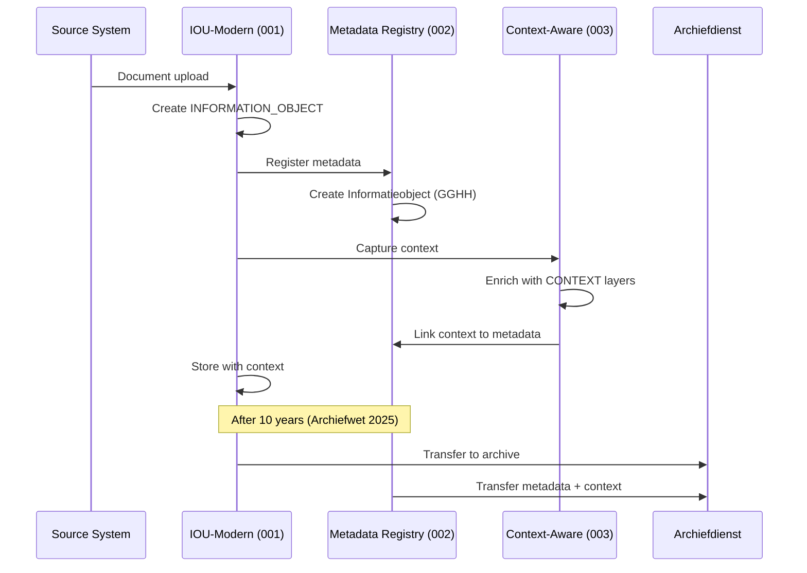

# Data Model Relatie - 3 Projecten

## Overzicht

De drie ArcKit projecten hebben data modellen op verschillende abstractieniveaus die naadloos integreren:

```
┌─────────────────────────────────────────────────────────────────────────────┐
│                      DATAMODEL INTEGRATIE                                   │
├─────────────────────────────────────────────────────────────────────────────┤
│                                                                             │
│  PROJECT 001 (IOU-Modern)         PROJECT 002 (Metadata)    PROJECT 003     │
│  ┌─────────────────────┐         ┌──────────────────────┐    (Context)     │
│  │   Working Layer      │         │   Metadata Layer      │                   │
│  │                     │         │                      │                   │
│  │  INFORMATION_OBJECT │◄───────►│  Informatieobject     │◄─────────────┐   │
│  │  (E-003)            │         │  (GGHH V2)            │              │   │
│  │                     │         │                      │              │   │
│  │  - title            │         │  - metadata           │              │   │
│  │  - content          │         │  - geldigheid         │              │   │
│  │  - domain_id        │         │  - relaties           │              │   │
│  │  - is_woo_relevant  │         │  - zorgdragers        │              │   │
│  │  - classification   │         │                      │              │   │
│  └─────────┬───────────┘         └──────────┬───────────┘              │   │
│            │                               │                           │   │
│            │ extends                       │ enriches                  │   │
│            ▼                               ▼                           ▼   │
│  ┌─────────────────────┐         ┌──────────────────────┐    ┌─────────┐ │
│  │  INFORMATION_DOMAIN │         │  CONTEXT (GGHH)      │    │ CONTEXT │ │
│  │  (E-002)            │         │                      │    │ (003)   │ │
│  │                     │         │  - actor             │    │         │ │
│  │  - Zaak             │         │  - temporal          │    │ - core │ │
│  │  - Project          │         │  - domein            │    │ - domein│ │
│  │  - Beleid           │         │  - semantisch        │    │ - seman │ │
│  │  - Expertise        │         │  - provenance         │    │ - prove │ │
│  └─────────────────────┘         └──────────────────────┘    └─────────┘ │
│                                                                             │
└─────────────────────────────────────────────────────────────────────────────┘
```

## Entiteit Relaties

### 1. Informatieobject (Kernentiteit)

| Project | Entiteit | Doel | Relatie |
|---------|----------|------|----------|
| **001** | INFORMATION_OBJECT (E-003) | Werkend document in IOU-Modern | Basislaag |
| **002** | Informatieobject (GGHH) | Metadata volgens standaard | 1:1 mapping |
| **003** | InformationObject | Context-uitgebreide versie | Extensie |

**Veldmapping**:

```
001 (IOU-Modern)           002 (GGHH)                003 (Context)
---------------------    --------------------    ---------------------
object_id              →  informatieobject_id  →  object_id
title                  →  naam                 →  title
content                →  inhoud               →  content
domain_id              →  domein               →  domain_id
is_woo_relevant        →  woo_relevant         →  is_woo_relevant
classification         →  beveiligingsniveau    →  classification
retention_period       →  bewaartermijn        →  retention_period
                       →  geldigheid           →  valid_from/valid_until
                       →  context              →  context_layers[]
```

### 2. Context (Metadata Laag)

| Laag | Project 002 (GGHH) | Project 003 (Context) |
|------|-------------------|----------------------|
| **Actor** | `actor_type`, `actor_id` | `Actor` (persoon/systeem/service) |
| **Temporeel** | `geldig_vanaf/tot` | `TemporalContext` (aangemaakt/gewijzigd) |
| **Domein** | `domein` | `DomainContext` (Zaak/Project/Beleid/Expertise) |
| **Semantisch** | (niet in GGHH) | `SemanticContext` (trefwoorden, entiteiten) |
| **Provenance** | `bronysteem` | `ProvenanceContext` (lineage, trust) |

### 3. Domein Hiërarchie

``                INFORMATION_DOMAIN (001)
                       |
        ┌──────────────┼──────────────┐
        │              │              │
    ZAAK_DOMAIN    PROJECT_DOMAIN   BELEID_DOMAIN
        │              │              │
        │              │              │
    ┌───┴───┐    ┌────┴────┐   ┌───┴────┐
    Zaak-1  Zaak-2  Proj-A   Proj-B  Beleid-X Beleid-Y
```

**GGHH V2 Mapping**:

| 001 Domain | 002 GGHH Entiteit | 003 Context Type |
|------------|-------------------|-------------------|
| Zaak | Zaak (BSW) | ZaakContext |
| Project | (via Bedrijfsproces) | ProjectContext |
| Beleid | Beleidsbegrip | BeleidContext |
| Expertise | (via Wetsbegrip) | ExpertiseContext |

## Data Flow



## Gedeelde Interfaces

### Interface 1: Informatieobject Sync

```rust
// In crates/iou-core/src/types.rs
pub struct InformatieobjectSync {
    pub object_id: Uuid,           // 001: object_id
    pub gghh_id: Uuid,             // 002: informatieobject_id
    pub context_id: Uuid,          // 003: context_id
    pub sync_status: SyncStatus,
    pub last_synced: Timestamp,
}
```

### Interface 2: Context Bridge

```rust
// In context-aware/crates/context-core/src/bridge.rs
pub struct ContextBridge {
    pub informatieobject_id: Uuid,   // Links to 002
    pub context_layers: Vec<ContextLayer>,  // From 003
    pub gghh_metadata: MetadataRecord,       // From 002
}
```

## Implementatie Richtlijnen

1. **Project 001** gebruikt `INFORMATION_OBJECT` als werkend model
2. **Project 002** beheert `Informatieobject` als GGHH-compliant metadata
3. **Project 003** verrijkt beide met contextuele lagen
4. **Synchronisatie** via event bus (Kafka/RabbitMQ)
5. **10-jaar archiefoverdracht** gebruikt complete metadata uit 002 + 003
