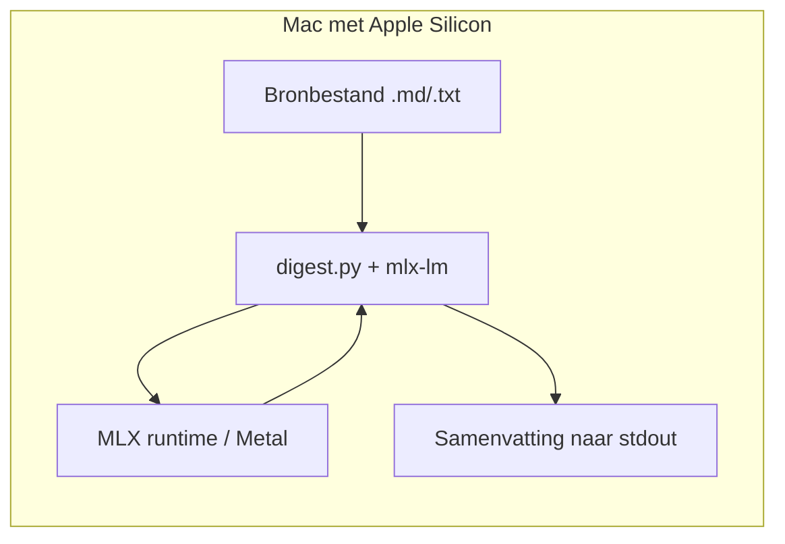

# Apple MLX op Apple Silicon (voorbeeldarchitectuur)

[MLX](https://github.com/ml-explore/mlx) is Apples framework voor ML op **Apple Silicon**: berekeningen draaien op **Metal**, met **unified memory** (GPU en CPU delen hetzelfde RAM — geen trage PCIe-kopieën van grote gewichten zoals op veel discrete GPU-setup).

## Waar past dit in IOU-Modern?

| Pad | Rol |
|-----|-----|
| **Ollama** (`SLM_*`) | HTTP `/v1/chat/completions`; makkelijk te delen in Docker/Linux. |
| **Cloud** (`LLM_*`) | Mistral API, keys op de gateway. |
| **MLX (lokaal Mac)** | Zelfde *soort* use-case (tekst in → analyse uit), maar **direct in Python** op je Mac, zonder Ollama-server. Geschikt voor ontwikkelaars die modellen van **mlx-community** op Hugging Face gebruiken (4-bit quant). |

MLX is **niet** een vervanging van `iou-api`; het is een **ontwikkel- en experimenteerpad** op je eigen machine. Output kun je later handmatig of via scripts naar je stack brengen (bijv. als markdown in een zaak-document).

## Architectuur (vereenvoudigd)



- **Modelweights** worden bij eerste `load()` gedownload (Hugging Face cache) en blijven in geheugen herbruikbaar.
- **Batch op de server:** voor productie blijven Ollama, vLLM of cloud-LLM logischer; MLX blinkt uit op **laptop/workstation zonder aparte inference-service**.

## Voorbeeld in deze repo

Zie **[`examples/apple-mlx-document-digest`](../../examples/apple-mlx-document-digest/)**: use-case **documentdigest** (Nederlandse overheids-/Woo-stijl prompt) op een **Llama-3.2-3B-Instruct** MLX-quant.

**Vereisten:** macOS op **arm64** (M1/M2/M3/M4…), Python 3.10+.

```bash
cd examples/apple-mlx-document-digest
python3 -m venv .venv && source .venv/bin/activate
pip install -r requirements.txt
python digest.py sample-document.md
```

## Modelkeuze (MLX)

Op [mlx-community](https://huggingface.co/mlx-community) zoek je naar `*-4bit` of `*-8bit` varianten. Licht en goed bruikbaar op 16–24 GB unified memory:

- `mlx-community/Llama-3.2-3B-Instruct-4bit` (default in het voorbeeld)
- `mlx-community/Mistral-7B-Instruct-v0.3-4bit` (zwaarder, vaak net iets beter op NL)

Zie ook [`ollama-models.md`](./ollama-models.md) voor dezelfde *familienamen* in Ollama-tags — conceptueel vergelijkbaar, ander runtime-pad.
