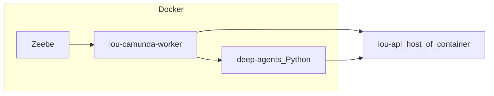

# Camunda 8 — volledige document-workflow

## Strategische context (hybride proces + AI)

Deze opzet sluit aan bij een **hybride** aanpak zoals vaak gekozen in digitale werkplek- en overheidscontexten: **gestructureerde procesmotor** voor traceerbare stappen, **agentische AI** voor dynamisch onderzoek en samenvatting, en **containers** voor isolatie van niet-kerncomponenten (Zeebe, Python-runtime, workers). Zie ook het concept [Werken in context](https://werkomgeving-van-de-toekomst.github.io/werkenincontext/concept) (contextuele ondersteuning op het juiste moment) en vergelijkbare denklijnen rond modulaire werkplekken (DAW: modulair platform + appstore-achtige modules, vaak als containers).

| Laag | Rol in deze repo | Waarom (kort) |
|------|------------------|---------------|
| **Camunda 8 / Zeebe** | BPMN `DocumentPipeline`, user tasks / messages, retries, observability | Voorspelbare flow, compliance, geen “losse” LLM als enige orchestrator |
| **LangChain Deep Agents** (optioneel) | Service task `iou-deep-agent` → Python-container → alleen gecontroleerde HTTP-tools naar `iou-api` | Geschikt voor **ongestructureerde** of zware cognitieve subtaken binnen een vast kader |
| **Rust (`iou-api` + pipeline)** | Domeindata, templates, audit, pipeline-finalize, S3-upload | Sterke typing, bestaande compliance- en opslagpaden |

**S3-compatibele opslag:** pipeline-artefacten gaan via de bestaande S3-client in `iou-api` (`S3_ENDPOINT`, `S3_BUCKET`, `S3_ACCESS_KEY`, `S3_SECRET_KEY`, optioneel `S3_PATH_STYLE=true` voor MinIO). Je kunt lokaal **[MinIO](https://min.io/)** in Docker draaien en de API daarop laten wijzen; `docker-compose.document-workflow.yml` focust op Zeebe + workers — MinIO voeg je toe in je eigen stack of compose-overlay.

*Achtergrondnotities (extern gesprek):* [Mistral-chat over DAW, hybride Camunda + LangChain, Docker en MinIO](https://chat.mistral.ai/chat/1b471f2f-60d2-44bb-b720-8ffe58d05467) — inhoud is ter inspiratie; deze map beschrijft de **feitelijke** implementatie in `iou-modern`.

## Architectuur

- **Zeebe** — enige procesmotor voor documentgeneratie wanneer `IOU_DOCUMENT_WORKFLOW=camunda`.
- **`iou-camunda-worker` (Rust, Docker)** — pollt jobs `iou-run-pipeline` en `iou-deep-agent`, roept `iou-api` aan.
- **`deep-agents` (Python, Docker)** — optionele LLM/agent-stap; alleen HTTP naar `iou-api` als tools.
- **`iou-api` (Rust)** — blijft bron van waarheid voor DuckDB, templates, S3-stub, audit; **start geen** `WorkflowOrchestrator` voor documenten in Camunda-modus.



## BPMN

- [`bpmn/document-pipeline.bpmn`](bpmn/document-pipeline.bpmn) — proces-id `DocumentPipeline`.

## API / omgeving

| Variabele | Betekenis |
|-----------|-----------|
| `IOU_DOCUMENT_WORKFLOW=camunda` | Alleen Zeebe; geen Rust `WorkflowOrchestrator` bij `POST /api/documents/create`. |
| `ZEEBE_ADDRESS` | `host:poort` (bijv. `127.0.0.1:26500` of `zeebe:26500` in Docker-netwerk). |
| `CAMUNDA_WORKER_TOKEN` | Gedeeld geheim voor `X-Camunda-Worker-Token` op `/api/internal/camunda/*`. |
| `CAMUNDA_BPMN_PROCESS_ID` | Standaard `DocumentPipeline`. |
| `DEEP_AGENT_SERVICE_URL` | Basis-URL van de Python-service (bridge in API). |
| `CAMUNDA_RUN_DEEP_AGENT` | `true`/`1` of `false` — startvariabele `runDeepAgent` bij processtart. |

Goedkeuring: bij `POST /api/documents/{id}/approve` met `approved=true` publiceert de API het bericht `document_approved` (correlatie `documentId`) als er een Zeebe-proces aan het document hangt.

## Verdere documentatie

- [`ORCHESTRATION.md`](ORCHESTRATION.md) — hybride vs Camunda als bron van waarheid, WebSocket/status.
- [`VARIABLES.md`](VARIABLES.md) — BPMN-procesvariabelen en alignment met `WorkflowContext`.

## Docker Compose (aanbevolen)

Zie root **[`docker-compose.document-workflow.yml`](../../docker-compose.document-workflow.yml)** en **[`.env.document-workflow.example`](../../.env.document-workflow.example)**.

Kort:

```bash
export CAMUNDA_WORKER_TOKEN="$(openssl rand -hex 24)"
export IOU_API_URL=http://host.docker.internal:8000
docker compose -f docker-compose.document-workflow.yml up -d --build
```

Start `iou-api` op de host met `IOU_DOCUMENT_WORKFLOW=camunda` en dezelfde token.

## Oud bestand

[`docker-compose.camunda.yml`](../../docker-compose.camunda.yml) bevat alleen Zeebe; voor de volledige stack gebruik `docker-compose.document-workflow.yml`.
