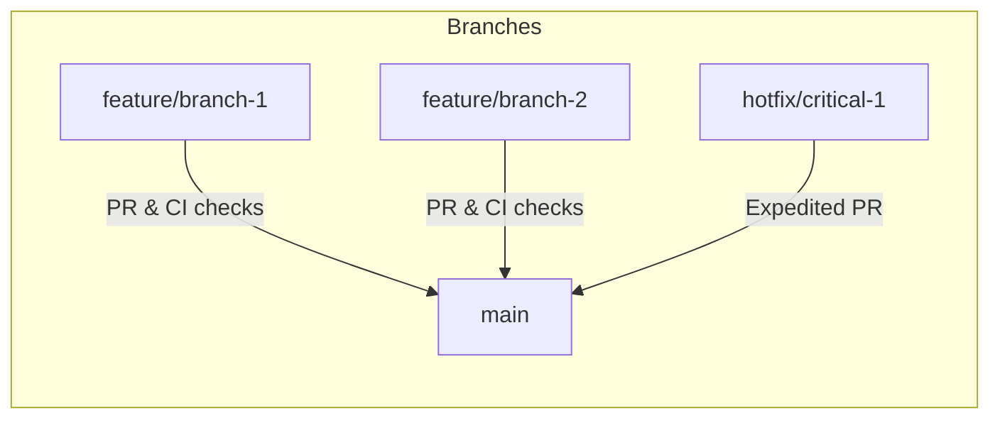
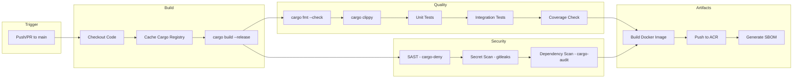
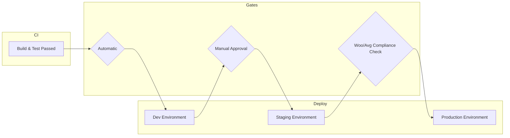
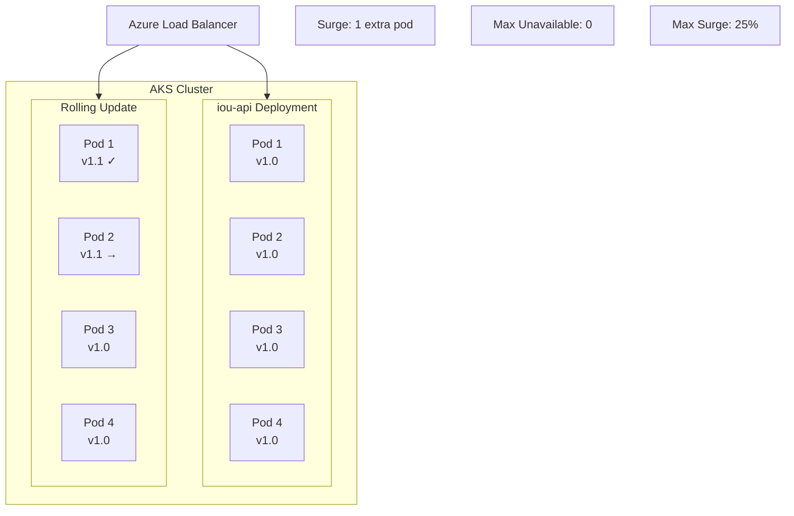
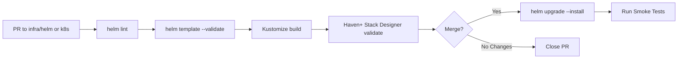
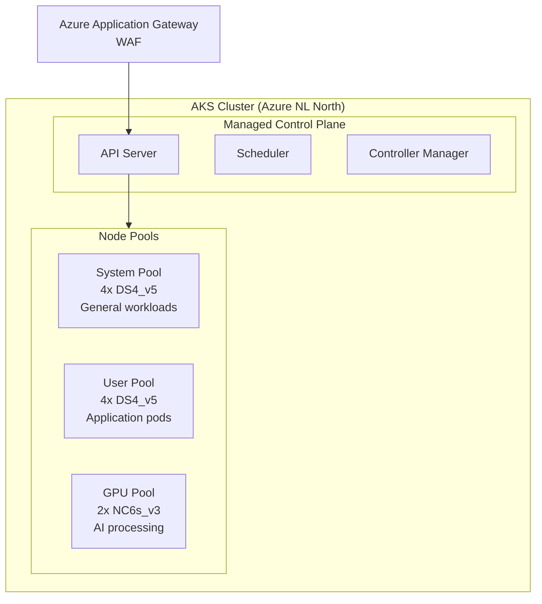
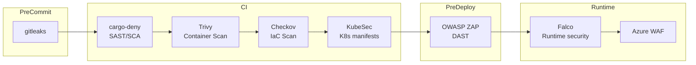

# DevOps Strategy: IOU-Modern

> **Template Origin**: Official | **ArcKit Version**: 4.3.1 | **Command**: `/arckit:devops`

## Document Control

| Field | Value |
|-------|-------|
| **Document ID** | ARC-001-DEVOPS-v1.0 |
| **Document Type** | DevOps Strategy |
| **Project** | IOU-Modern (Project 001) |
| **Classification** | OFFICIAL |
| **Status** | DRAFT |
| **Version** | 1.0 |
| **Created Date** | 2026-04-01 |
| **Last Modified** | 2026-04-01 |
| **Review Cycle** | Quarterly |
| **Next Review Date** | 2026-07-01 |
| **Owner** | DevOps Lead |
| **Reviewed By** | PENDING |
| **Approved By** | PENDING |
| **Distribution** | Development Team, Platform Team, Security Officer, Enterprise Architect |

## Revision History

| Version | Date | Author | Changes | Approved By | Approval Date |
|---------|------|--------|---------|-------------|---------------|
| 1.0 | 2026-04-01 | ArcKit AI | Initial creation from `/arckit:devops` command | PENDING | PENDING |

---

## 1. DevOps Overview

### Strategic Objectives

| Objective | Target | Rationale |
|-----------|--------|-----------|
| Deployment Frequency | Weekly (minimum) | Government systems require stability; weekly cadence balances velocity with compliance validation |
| Lead Time for Changes | <2 business days | Woo/Avg compliance requires thorough review; fast pipeline enables rapid iteration after approval |
| Change Failure Rate | <5% | Government systems cannot tolerate high failure rates; rigorous testing required |
| MTTR | <2 hours | NFR-AVAIL-002 requires RTO <4 hours; faster MTTR provides buffer for recovery |

### DevOps Maturity

| Level | Current | Target | Timeline |
|-------|---------|--------|----------|
| Level 1 (Manual) | No | - | - |
| Level 2 (CI Automation) | No | Yes | 2026-05-01 |
| Level 3 (CI/CD) | No | Yes | 2026-06-01 |
| Level 4 (Continuous Deployment) | No | No | Not applicable (government requires manual approval) |
| Level 5 (Platform/GitOps) | No | Yes | 2026-09-01 |

**Target DevOps Maturity**: Level 3 (CI/CD with staged approvals)

### Team Structure

| Team | Responsibility | Size |
|------|----------------|------|
| Platform Team | CI/CD pipelines, IaC, observability, secret management | 2 |
| Development Team | Application development (Rust, Dioxus, AI pipeline) | 6 |
| Security Team | Security scanning, compliance validation, penetration testing | 1 |
| QA Team | Testing automation, validation, staging environment | 1 |

### Technology Stack

| Layer | Technology |
|-------|------------|
| Languages | Rust (backend + frontend WASM) |
| Frameworks | Axum (REST API), Dioxus (WASM UI), Tower (async runtime) |
| Cloud Provider | Haven+ Compliant Provider (Azure/AWS/GCP NL regions) |
| Container Runtime | containerd |
| Orchestration | Kubernetes (Haven+ compliant) |
| CI/CD Platform | GitHub Actions (EU) |
| IaC Tool | **Haven+ Stack Designer + Helm charts** (no Terraform) |
| API Gateway | **Haven+ Gateway (NLX)** |
| Standards | **Haven+ VNG Realisatie** + Common Ground |

### Haven+ Compliance

| Haven+ Principle | Implementation |
|------------------|----------------|
| NLX Integration | NLX Outbound for inter-municipality API exchange |
| Generic Components | Use Haven+ Algemene Componenten where applicable |
| Open Standards | REST/OpenAPI, JSON, JSON Schema |
| Kubernetes | Haven+ cluster conventions |
| Naming | Haven+ naming standards (e.g., `{service}-{env}`) |
| Security | Haven+ security baseline |

---

## 2. Source Control Strategy

### Repository Structure

| Pattern | Description | When to Use |
|---------|-------------|-------------|
| **Monorepo (Selected)** | Single repo, modular crates | Rust workspace with shared types; tight coupling between frontend/backend |

### Repository Layout

```text
iou-modern/
├── .github/
│   └── workflows/           # CI/CD pipelines
├── crates/
│   ├── iou-core/            # Domain models
│   ├── iou-api/             # Axum REST API
│   ├── iou-web/             # Dioxus WASM frontend
│   ├── iou-ai/              # AI pipeline orchestrator
│   ├── iou-db/              # Database abstraction
│   ├── iou-storage/         # S3/MinIO abstraction
│   └── iou-compliance/      # Woo/AVG/Archiefwet rules
├── infra/
│   ├── terraform/           # Infrastructure code
│   │   ├── modules/
│   │   └── environments/
│   └── kubernetes/          # K8s manifests
├── migrations/              # PostgreSQL schema migrations
├── tests/                   # Integration tests
├── scripts/                 # Utility scripts
└── docs/                    # Documentation
```

### Branching Strategy

| Strategy | **Trunk-Based Development** |
|----------|---------------------------|
| Description | Single permanent branch (`main`) + short-lived feature branches |
| Rationale | Simplifies CI/CD; fast feedback; compatible with Rust workspace |



### Branch Protection Rules

| Branch | Rules |
|--------|-------|
| `main` | Require PR (1 review), require status checks (CI, security scan), no direct push, require linear history |
| `feature/*` | No restrictions (developer autonomy) |

### Commit Conventions

| Type | Description | Example |
|------|-------------|---------|
| `feat` | New feature | `feat(domain): add domain hierarchy support` |
| `fix` | Bug fix | `fix(api): handle null response from Woo portal` |
| `docs` | Documentation | `docs: update deployment runbook` |
| `chore` | Maintenance | `chore: update Rust dependencies` |
| `refactor` | Code refactoring | `refactor(ai): extract LLM client to separate crate` |
| `perf` | Performance improvement | `perf(db): add query index for search` |
| `test` | Test changes | `test(auth): add MFA flow tests` |
| `sec` | Security fix | `sec(rls): validate organization context in RLS policies` |

---

## 3. CI Pipeline Design

### Pipeline Architecture



### CI Stages

| Stage | Jobs | Duration Target | Failure Action |
|-------|------|-----------------|----------------|
| Setup | Checkout, cache setup | <1 min | Block |
| Build | `cargo build --release` | <8 min | Block |
| Lint | `cargo fmt --check`, `cargo clippy` | <2 min | Block |
| Unit Test | `cargo test --lib` | <5 min | Block |
| Integration Test | `cargo test --test '*'` | <10 min | Block |
| Security Scan | SAST, dependency audit | <3 min | Block (Critical/High) |
| Build Image | Docker build + push | <5 min | Block |
| SBOM Gen | Syft/cyclonedx | <1 min | Warning |
| **Total** | - | **<35 min** | - |

### Quality Gates

| Gate | Threshold | Enforcement |
|------|-----------|-------------|
| Test Coverage | >70% line coverage | Required |
| Lint Errors | 0 warnings | Required |
| Unit Test Pass | 100% | Required |
| Integration Test Pass | 100% | Required |
| SAST Critical | 0 | Required |
| SAST High | 0 | Required |
| Dependency Vulnerabilities | 0 Critical/High | Required |
| Secret Detection | 0 secrets | Required |

### Artifact Management

| Artifact | Registry | Retention |
|----------|----------|-----------|
| Container Images | Azure Container Registry (ACR) | 90 days non-release, 1 year for release tags |
| Cargo Crates | Private Git index | Permanent |
| SBOMs | Azure Blob Storage | 7 years (compliance) |
| Build logs | GitHub Actions | 90 days |
| Test Reports | GitHub Artifacts | 1 year |

---

## 4. CD Pipeline Design

### Deployment Pipeline



### Environment Promotion

| Environment | Trigger | Approval | Duration |
|-------------|---------|----------|----------|
| Dev | Push to `main` | Automatic | <5 min |
| Staging | PR merged to `main` | Automatic | <10 min |
| Production | Release tag `v*` | Manual approval (DevOps + Security) | <15 min |

### Deployment Strategies

| Strategy | Description | Use Case | Rollback Time |
|----------|-------------|----------|---------------|
| **Rolling (Selected)** | Gradual replacement with health checks | Standard deployment, stateless services | <5 min |
| Blue-Green | Parallel environments, instant switch | Major version changes, high-risk deployments | <1 min |

### Rolling Deployment



### Rollback Procedure

```bash
# 1. Identify issue from monitoring dashboard
# Check Grafana for error rate spike, latency increase, or health check failures

# 2. Initiate immediate rollback
kubectl rollout undo deployment/iou-api -n iou-prod
kubectl rollout undo deployment/iou-web -n iou-prod
kubectl rollout undo deployment/iou-ai -n iou-prod

# 3. Verify rollback successful
kubectl rollout status deployment/iou-api -n iou-prod

# 4. Run smoke tests
./scripts/smoke-test.sh prod

# 5. Notify team via PagerDuty
# Incident ticket auto-created for post-mortem

# 6. If rollback fails, trigger DR procedure
# Switch to standby replica (RTO target: <4 hours)
```

### Feature Flags

| Platform | Unleash (Open Source) |
|----------|------------------------|
| Purpose | Runtime feature control without deployment |

| Flag Type | Use Case | Example |
|-----------|----------|---------|
| Release flag | Enable/disable new features | `enable-semantic-search` |
| Ops flag | Circuit breakers, kill switches | `disable-ai-ingestion` |
| Experiment flag | A/B testing | `new-search-algorithm` |

---

## 5. Infrastructure as Code (Haven+ Standard)

### Haven+ Stack Designer

| Tool | **Haven+ Stack Designer** |
|------|---------------------------|
| Rationale | VNG Realisatie standard for Dutch government; Common Ground compliant |

### Project Structure

```text
infra/
├── helm/
│   ├── iou-api/               # Application Helm chart
│   │   ├── Chart.yaml
│   │   ├── values.yaml
│   │   ├── values-dev.yaml
│   │   ├── values-staging.yaml
│   │   └── values-prod.yaml
│   ├── postgresql/            # PostgreSQL Bitnami chart (Haven+ compliant)
│   └── ingress/               # NGINX Ingress Controller
├── k8s/
│   ├── base/                  # Base Kubernetes manifests
│   │   ├── namespace.yaml
│   │   ├── configmaps.yaml
│   │   └── secrets-sealed.yaml
│   ├── overlays/
│   │   ├── dev/              # Kustomize dev overlay
│   │   ├── staging/           # Kustomize staging overlay
│   │   └── prod/             # Kustomize prod overlay
│   └── nlx/                   # NLX integration manifests
│       ├── nlx-outbound.yaml
│       └── nlx-management.yaml
├── stack.yaml                 # Haven+ Stack Designer configuration
└── scripts/
    ├── deploy.sh
    └── validate.sh
```

### Haven+ Stack Configuration

```yaml
# infra/stack.yaml - Haven+ Stack Designer format
apiVersion: haven.commonground.nl/v1
kind: Stack
metadata:
  name: iou-modern
  description: IOU-Modern Information Management Platform
spec:
  version: 1.0.0
  environments:
    - name: dev
      cluster: haven-dev-cluster
    - name: staging
      cluster: haven-staging-cluster
    - name: prod
      cluster: haven-prod-cluster

  components:
    - name: postgresql
      type: database
      chart: bitnami/postgresql
      version: 12.x.x

    - name: minio
      type: storage
      chart: minio/minio
      version: 5.x.x

    - name: ingress
      type: networking
      chart: ingress-nginx
      version: 4.x.x

    - name: nlx-outway
      type: api-gateway
      chart: commonground/nlx-outway
      version: 0.x.x

    - name: monitoring
      type: observability
      chart: prometheus-community/kube-prometheus-stack
      version: 45.x.x
```

### Helm Charts Strategy

| Component | Chart | Haven+ Compliant |
|-----------|-------|------------------|
| Application | Custom Helm chart | Yes |
| PostgreSQL | Bitnami PostgreSQL | Yes |
| Redis | Bitnami Redis | Yes |
| Ingress | ingress-nginx | Yes |
| Monitoring | kube-prometheus-stack | Yes |
| Logging | Loki Stack | Yes |

### Kustomize for Environment Management

```yaml
# infra/k8s/overlays/dev/kustomization.yaml
apiVersion: kustomize.config.k8s.io/v1beta1
kind: Kustomization

namespace: iou-dev

resources:
  - ../../base
  - nlx

patchesStrategicMerge:
  - deployment-patch.yaml
  - configmap-patch.yaml

images:
  - name: iou-api
    newName: ${ACR_REGISTRY}/iou-api
    newTag: dev-latest
```

### NLX Integration (Haven+ Requirement)

| NLX Component | Purpose | Configuration |
|---------------|---------|--------------|
| NLX Outway | Expose APIs to other municipalities | OpenAPI specification |
| NLX Inway | Receive API calls from other municipalities | Managed by municipality |
| NLX Management | API directory and discovery | Register APIs via NLX directory |

### IaC Pipeline (Haven+)



### Drift Detection

| Check | Frequency | Action |
|-------|-----------|--------|
| `helm diff` comparison | Daily (via CI) | Alert if drift detected |
| Kustomize build validation | Per PR | Ensure manifests are valid |
| Haven+ Stack validation | Per PR | Ensure Haven+ compliance |
| State file backup | Continuous | Azure Blob versioning |

---

## 6. Container Strategy

### Base Images

| Application Type | Base Image | Size |
|-----------------|------------|------|
| Rust Backend | `debian:bookworm-slim` (custom build) | ~100MB |
| Dioxus WASM | `emersion/singuild:latest` | ~50MB |
| PostgreSQL | `postgres:15-alpine` | ~80MB |
| MinIO | `minio/minio:latest` | ~100MB |

### Dockerfile Best Practices

```dockerfile
# Multi-stage build for Rust backend
FROM rust:1.75-bookworm-slim AS builder

WORKDIR /build
COPY Cargo.toml Cargo.lock ./
RUN mkdir src && echo "fn main() {}" > src/main.rs
RUN cargo build --release && rm -rf src

COPY crates ./crates
COPY migrations ./migrations
RUN cargo build --release

# Runtime image
FROM debian:bookworm-slim

# Install runtime dependencies
RUN apt-get update && apt-get install -y \
    ca-certificates \
    libpq5 \
    && rm -rf /var/lib/apt/lists/*

# Non-root user for security
RUN useradd -r -u 1001 appuser

WORKDIR /app
COPY --from=builder /build/target/release/iou-api /app/
COPY --from=builder /build/target/release/iou-ai /app/
COPY --from=builder /build/migrations /app/migrations/

USER appuser

EXPOSE 8080
HEALTHCHECK --interval=30s --timeout=3s --start-period=5s --retries=3 \
    CMD curl -f http://localhost:8080/health || exit 1

ENTRYPOINT ["/app/iou-api"]
```

### Image Registry

| Registry | URL | Use |
|----------|-----|-----|
| Azure Container Registry | `{organization}.azurecr.io` | Production images (EU region) |
| GitHub Container Registry | `ghcr.io/{organization}` | Development images |

### Image Security

| Check | Tool | When |
|-------|------|------|
| Vulnerability scan | Trivy | CI pipeline (pre-push) |
| Image signing | Cosign | Post-build (production only) |
| Runtime security | Falco | Production (AKS node daemonset) |

### Image Tagging Strategy

| Tag | Example | Use |
|-----|---------|-----|
| Commit SHA | `abc123def` | Development |
| Semantic Version | `v1.0.0` | Releases |
| Branch | `main-latest` | Staging |
| Latest | `latest` | Never use in production |

---

## 7. Kubernetes / Orchestration

### Cluster Architecture



### Cluster Configuration

| Attribute | Value |
|-----------|-------|
| **Provider** | Azure Kubernetes Service (AKS) |
| **Version** | 1.28 (auto-upgrade enabled) |
| **Location** | `westeurope` (Azure Netherlands region) |
| **Node Pools** | System: 4 nodes, User: 4 nodes, GPU: 2 nodes |
| **Node Size** | Standard_DS4_v5 (General), Standard_NC6s_v3 (GPU) |
| **Autoscaling** | Cluster Autoscaler (2-10 nodes per pool) |

### Namespace Strategy

| Namespace | Purpose | Teams | Network Policy |
|-----------|---------|-------|----------------|
| `iou-dev` | Development environment | All developers | Allow all ingress |
| `iou-staging` | Staging environment | Dev leads, QA | Allow all ingress |
| `iou-prod` | Production environment | Operations only | Deny all, allow explicit |
| `monitoring` | Observability stack | Platform | Allow all ingress |
| `ingress` | Ingress controllers | Platform | Allow all ingress |

### Resource Management

| Resource Type | Request | Limit | Notes |
|---------------|---------|-------|-------|
| CPU (typical app) | 100m | 1000m | Burstable QoS |
| Memory (typical app) | 256Mi | 1Gi | Prevent OOM kills |
| CPU (AI service) | 2000m | 4000m | GPU pool requires reservation |
| Memory (AI service) | 4Gi | 8Gi | GraphRAG memory intensive |

### GitOps Tooling

| Tool | **ArgoCD** |
|------|-------------|
| Rationale | Declarative GitOps, self-healing, rollback support |

### ArgoCD Application Structure

```yaml
# argocd/apps/iou-api-application.yaml
apiVersion: argoproj.io/v1alpha1
kind: Application
metadata:
  name: iou-api
  namespace: argocd
spec:
  project: iou-modern
  source:
    repoURL: https://github.com/{organization}/iou-modern-infra
    targetRevision: main
    path: kubernetes/iou-prod
  destination:
    server: https://kubernetes.default.svc
    namespace: iou-prod
  syncPolicy:
    automated:
      prune: true
      selfHeal: true
    syncOptions:
      - ServerSideApply=true
```

---

## 8. Environment Management

### Environments

| Environment | Purpose | Data | Access |
|-------------|---------|------|--------|
| Local | Developer workstation | Mock/Seed data | All developers |
| Dev | Integration testing | Synthetic data | All developers |
| Staging | Pre-production validation | Anonymized prod data | Dev leads, QA |
| Production | Live system | Real government data | Operations, On-call |

### Environment Parity

| Aspect | Parity Level | Notes |
|--------|--------------|-------|
| Infrastructure | High | Same AKS version, different node counts |
| Configuration | High | Environment variables differ only by value |
| Data | Medium | Staging uses anonymized data (PII redacted) |
| Integrations | Medium | DigiD test environment for staging |

### Ephemeral Environments

| Feature | Value |
|---------|-------|
| **Trigger** | PR opened to `main` |
| **Lifetime** | Until PR closed + 24 hours |
| **URL Pattern** | `pr-{number}.iou-dev.{organization}.nl` |
| **Resources** | 1 pod per service (cost optimization) |

---

## 9. Secret Management

### Secret Storage

| Tool | **Azure Key Vault** |
|------|---------------------|
| Rationale | Azure-native, P7 data sovereignty compliance, managed service |

### Secret Types

| Type | Storage | Rotation |
|------|---------|----------|
| Database credentials | Azure Key Vault | 90 days (automatic) |
| API keys (DigiD, Woo) | Azure Key Vault | 90 days |
| TLS certificates | Azure Key Vault (cert-manager) | Auto-renew 30 days before expiry |
| AI API keys (Mistral) | Azure Key Vault | 90 days |
| GitHub PAT | Azure Key Vault | Manual rotation |

### Secret Injection

| Method | Use Case |
|--------|----------|
| CSI Driver (Key Vault) | Kubernetes pods (production) |
| Environment variables | Local development |
| Azure Managed Identity | AKS to Azure resources (no secrets) |

### Secret Security Checklist

- [x] Secrets never in source control
- [x] Secrets never in logs (log redaction middleware)
- [x] Secrets encrypted at rest (Key Vault default)
- [x] Secrets encrypted in transit (TLS 1.3)
- [x] Least privilege access (Key Vault access policies)
- [x] Audit logging enabled (Key Vault diagnostics)

---

## 10. Developer Experience

### Local Development Setup

```bash
# Prerequisites
- Rust 1.75+ (rustup)
- Docker Desktop or Podman
- kubectl 1.28+
- helm 3.0+
- Azure CLI

# Clone and setup
git clone https://github.com/{organization}/iou-modern.git
cd iou-modern
make setup  # Install tools, create .env file

# Run locally
make dev    # Start all services via docker-compose

# Run tests
make test
make lint
```

### Development Containers

```json
// .devcontainer/devcontainer.json
{
  "name": "IOU-Modern Dev Container",
  "image": "mcr.microsoft.com/devcontainers/rust:1.75",
  "features": {
    "ghcr.io/devcontainers/features/docker-in-docker:2": {},
    "ghcr.io/devcontainers/features/kubectl-helm-minikube:1": {},
    "ghcr.io/devcontainers/features/azure-cli:1": {}
  },
  "postCreateCommand": "cargo fetch",
  "customizations": {
    "vscode": {
      "extensions": [
        "rust-lang.rust-analyzer",
        "tamasfe.even-better-toml",
        "ms-azuretools.vscode-docker"
      ]
    }
  }
}
```

### Inner Loop Optimization

| Activity | Target Time | Tools |
|----------|-------------|-------|
| Code change to local run | <10 seconds | `cargo check` + hot reload |
| Code change to test | <30 seconds | `cargo test` with workspace caching |
| Code change to local K8s | <2 minutes | `skaffold dev` or `tilt up` |

### Self-Service Capabilities

| Capability | How | Access |
|------------|-----|--------|
| Create dev environment | `tilt up` | All developers |
| View logs | `kubectl logs -f` or Grafana | All developers |
| View metrics | Grafana dashboards | All developers |
| Deploy to dev | Push to `main` | All developers |
| Deploy to staging | Release tag `v*` + approval | Dev leads |

---

## 11. Observability Integration

### Logging

| Attribute | Value |
|-----------|-------|
| **Format** | JSON structured |
| **Collector** | Fluent Bit (sidecar per pod) |
| **Storage** | Azure Log Analytics Workspace |
| **Retention** | 30 days hot, 7 years cold (NFR-COMP-005) |

### Log Schema

```json
{
  "timestamp": "2026-04-01T10:30:00Z",
  "level": "INFO",
  "service": "iou-api",
  "trace_id": "abc123",
  "span_id": "def456",
  "message": "Document processed",
  "context": {
    "user_id": "12345",
    "organization_id": "org-001",
    "request_id": "xyz789",
    "pii_access": true
  }
}
```

### Metrics

| Attribute | Value |
|-----------|-------|
| **Format** | Prometheus exposition format |
| **Collector** | Prometheus Operator |
| **Storage** | Prometheus (30 days) |
| **Visualization** | Grafana |

### Key Metrics

| Metric | Description | SLO |
|--------|-------------|-----|
| `http_requests_total` | Request count by endpoint | - |
| `http_request_duration_seconds` | Request latency histogram | p95 <500ms (NFR-PERF-003) |
| `http_requests_errors_total` | Error count by type | <1% |
| `db_query_duration_seconds` | Database query duration | p95 <1s |
| `ai_api_tokens_total` | AI API token usage | Cost tracking |
| `documents_ingested_total` | Document ingestion count | >1000/min target (NFR-PERF-001) |

### Tracing

| Attribute | Value |
|-----------|-------|
| **Protocol** | OpenTelemetry |
| **Sampling** | 100% dev/staging, 10% production |
| **Storage** | Azure Application Insights (distributed tracing) |
| **Visualization** | Grafana Tempo |

### Dashboard as Code

```yaml
# grafana/dashboards/overview.json
# Stored in git, provisioned via Grafana Operator
```

---

## 12. DevSecOps

### Security Scanning Pipeline



### Security Tools

| Category | Tool | When |
|----------|------|------|
| Secret Detection | gitleaks | Pre-commit hook |
| SAST | cargo-deny (advisories, bans, licenses) | CI |
| Dependency Scan | cargo-audit | CI |
| Container Scan | Trivy | CI (post-build) |
| IaC Scan | Checkov | CI (infra/terraform PRs) |
| DAST | OWASP ZAP | Pre-deploy to staging |
| Runtime Security | Falco | Production (AKS daemonset) |

### Vulnerability Management

| Severity | SLA | Action |
|----------|-----|--------|
| Critical | 24 hours | Block deploy, emergency fix |
| High | 7 days | Priority fix, track in risk register |
| Medium | 30 days | Scheduled fix |
| Low | 90 days | Backlog |

### Compliance as Code

| Framework | Tool | Checks |
|-----------|------|--------|
| CIS Benchmark for Kubernetes | kube-bench | 80+ controls |
| AVG/GDPR | Custom policies (Open Policy Agent) | PII access logging, data retention |
| Woo Compliance | Custom policies | Publication audit trail |
| Archiefwet | Custom policies | Retention enforcement |

---

## 13. Release Management

### Versioning

| Type | Format | Example |
|------|--------|---------|
| Semantic Version | MAJOR.MINOR.PATCH | 1.0.0 |
| Pre-release | MAJOR.MINOR.PATCH-rc.N | 1.0.0-rc.1 |

### Release Process

```mermaid
flowchart LR
    A[Features Complete] --> B[Create Release Branch]
    B --> C[Run Full Test Suite]
    C --> D[Security Review]
    D --> E[Woo/Avg Compliance Check]
    E --> F[Tag Release]
    F --> G[Deploy to Staging]
    G --> H[UAT Sign-off]
    H --> I[Deploy to Production]
    I --> J[Create GitHub Release]
    J --> K[Notify Stakeholders]
```



### Changelog Generation

| Tool | Integration |
|------|-------------|
| git-cliff | Auto-generate from conventional commits |

### Hotfix Process

1. Create branch from `main`: `hotfix/critical-security-issue`
2. Fix and test locally
3. PR to `main` (expedited review required)
4. Tag patch version: `v1.0.1`
5. Deploy immediately to production
6. Conduct post-incident review

---

## 14. Platform Engineering

### Internal Developer Platform (IDP)

| Component | Tool | Purpose |
|-----------|------|---------|
| Service Catalog | Backstage (future) | Service discovery, documentation |
| Self-Service Portal | Azure Portal (custom) | Environment creation, resource requests |
| Documentation | MkDocs (Git-backed) | Centralized operational documentation |
| Templates | Cookiecutter | Golden paths for new microservices |

### Golden Paths

| Path | Description | Includes |
|------|-------------|----------|
| Rust API Service | Standard Rust microservice | Axum, Dockerfile, CI/CD, IaC, observability |
| Dioxus Frontend | Standard WASM frontend | Dioxus, build pipeline, deployment |
| AI Pipeline | Standard AI processing service | Tower async, LLM client, tracing |

---

## 15. Dutch Government Compliance

### Technology Code of Practice (TCoP) Alignment

| Point | Requirement | Implementation |
|-------|-------------|----------------|
| 3. Open Source | Use open source where possible | Rust, PostgreSQL, DuckDB, MinIO, OpenTofu, ArgoCD |
| 4. Open Standards | Use industry standards | OCI containers, OpenTelemetry, OpenAPI 3.x, OAuth 2.0 |
| 5. Cloud First | Use public cloud services | Azure (NL region) |
| 6. Security by Default | Secure development practices | Shift-left security, DevSecOps pipeline |
| 7. Data Sovereignty | Data in Netherlands/EU | Azure NL regions, EU data processing guarantees |

### Cloud First Implementation

| Attribute | Value |
|-----------|-------|
| Primary Cloud | Azure (Azure NL - Netherlands regions) |
| Multi-cloud Strategy | No (single cloud for compliance) |
| Region | `westeurope` (Netherlands) |
| Data Residency | 100% in Netherlands/EU |

### Open Standards Used

| Area | Standard |
|------|----------|
| Containers | OCI (Open Container Initiative) |
| Kubernetes | CNCF Kubernetes |
| Observability | OpenTelemetry |
| API | OpenAPI 3.x |
| Authentication | OAuth 2.0 / OIDC (DigiD) |

### Woo/Avg Compliance Integration

| Requirement | DevOps Implementation |
|-------------|----------------------|
| Woo publication audit trail | Structured logging to Azure Log Analytics, 7-year retention |
| AVG Article 30 (records) | AuditTrail entity logging, immutable storage |
| AVG Article 32 (security) | Encryption at rest (TDE), TLS 1.3, RBAC+RLS |
| AVG Article 17 (right to erasure) | Automated deletion jobs, retention enforcement |
| Archiefwet retention | Tiered storage (30 days hot, 7 years archival) |

---

## 16. Metrics & Improvement

### DORA Metrics

| Metric | Current | Target | Industry Elite |
|--------|---------|--------|----------------|
| Deployment Frequency | 0/week | 1/week | On-demand |
| Lead Time for Changes | Unknown | <2 days | <1 hour |
| Change Failure Rate | Unknown | <5% | <15% |
| MTTR | Unknown | <2 hours | <1 hour |

### Engineering Metrics

| Metric | Target | Measurement |
|--------|--------|-------------|
| Build time | <30 min | CI pipeline duration |
| Test coverage | >70% | cargo-tarpaulin |
| Tech debt ratio | <10% | SonarQube (future) |
| Toil percentage | <20% | Platform automation tasks |

### Continuous Improvement

| Activity | Frequency | Owner |
|----------|-----------|-------|
| Retrospectives | Sprint end (2 weeks) | Scrum Master |
| Metrics review | Weekly | Platform Lead |
| Tooling evaluation | Quarterly | Platform Team |
| Post-incident reviews | After incidents | On-call |
| DORA metrics assessment | Quarterly | Engineering Manager |

---

## 17. Requirements Traceability

| Requirement ID | Requirement | DevOps Element | Status |
|----------------|-------------|----------------|--------|
| NFR-PERF-003 | API response <500ms p95 | CI pipeline build time target, monitoring dashboard | ✅ |
| NFR-SEC-001 | Encryption at rest AES-256 | Azure Disk Encryption, Key Vault integration | ✅ |
| NFR-SEC-002 | Encryption in transit TLS 1.3 | TLS configuration in Ingress Controller | ✅ |
| NFR-SEC-003 | DigiD + MFA authentication | OAuth 2.0/OIDC integration, Azure AD | ✅ |
| NFR-SEC-004 | RBAC + Row-Level Security | Kubernetes RBAC, PostgreSQL RLS configuration | ✅ |
| NFR-SEC-005 | Audit logging for PII access | Structured logging, Azure Log Analytics, 7-year retention | ✅ |
| NFR-AVAIL-001 | 99.5% uptime | Multi-AZ deployment, health checks, auto-scaling | ✅ |
| NFR-AVAIL-002 | RTO <4 hours | Backup/restore procedures, standby replica | ✅ |
| NFR-AVAIL-003 | RPO <1 hour | WAL archiving, streaming replication | ✅ |
| NFR-AVAIL-004 | 30 days backup, 7 years archival | Tiered storage strategy | ✅ |
| NFR-SCALE-004 | Horizontal scaling | Kubernetes HPA, cluster autoscaler | ✅ |
| NFR-COMP-001 | Woo compliance | Audit trail for Woo decisions | ✅ |
| NFR-COMP-002 | AVG compliance | PII access logging, DPIA controls | ✅ |
| NFR-COMP-003 | Archiefwet compliance | Retention automation, deletion jobs | ✅ |
| NFR-COMP-005 | 7-year log retention | Azure Log Analytics retention policy | ✅ |
| BR-022 | Human approval for Woo | Manual approval gate in CD pipeline | ✅ |
| FR-001 | DigiD authentication | OAuth 2.0 integration via Azure AD | ✅ |
| FR-002 | RBAC | Kubernetes RBAC + PostgreSQL RLS | ✅ |
| FR-033 to FR-038 | Data Subject Rights | SAR/erasure endpoints, audit logging | ✅ |

---

## 18. Implementation Roadmap

### Phase 1: Foundation (2026-05-01)

- [x] DevOps Strategy document approved
- [ ] GitHub Actions CI pipeline configured
- [ ] Azure AKS cluster provisioned (dev environment)
- [ ] Terraform modules created
- [ ] Azure Container Registry provisioned
- [ ] Azure Key Vault provisioned

### Phase 2: CI/CD Implementation (2026-06-01)

- [ ] Complete CI pipeline with all quality gates
- [ ] CD pipeline for dev environment
- [ ] Staging environment provisioning
- [ ] ArgoCD installation and configuration
- [ ] Monitoring stack (Prometheus, Grafana)
- [ ] Logging stack (Fluent Bit, Azure Log Analytics)

### Phase 3: Production Readiness (2026-09-01)

- [ ] Production AKS cluster
- [ ] Blue-green deployment strategy
- [ ] Backup and disaster recovery procedures
- [ ] Security scanning integration
- [ ] Compliance monitoring (Woo/Avg/Archiefwet)
- [ ] Runbooks and operational procedures

---

## Approval

| Role | Name | Signature | Date |
|------|------|-----------|------|
| DevOps Lead | | | |
| Security Officer | | | |
| Enterprise Architect | | | |
| CIO | | | |

---

## External References

| Document | Type | Source | Key Extractions | Path |
|----------|------|--------|-----------------|------|
| ARC-001-REQ-v1.1 | Requirements | 001-iou-modern | NFRs for performance, security, availability, compliance | projects/001-iou-modern/ARC-001-REQ-v1.1.md |
| ARC-000-PRIN-v1.0 | Architecture Principles | 000-global | P4 Sovereign Technology, P7 Data Sovereignty | projects/000-global/ARC-000-PRIN-v1.0.md |
| ARC-001-DIAG-v1.0 | Architecture Diagrams | 001-iou-modern | Deployment architecture, container diagram | projects/001-iou-modern/ARC-001-DIAG-v1.0.md |
| ARC-001-RISK-v1.0 | Risk Register | 001-iou-modern | Technical risks affecting DevOps | projects/001-iou-modern/ARC-001-RISK-v1.0.md |
| ARC-001-HLDR-v1.0 | HLD Review | 001-iou-modern | BLOCKING-01, BLOCKING-02, BLOCKING-03 conditions | projects/001-iou-modern/reviews/ARC-001-HLDR-v1.0.md |

---

**END OF DEVOPS STRATEGY**

## Generation Metadata

**Generated by**: ArcKit `/arckit:devops` command
**Generated on**: 2026-04-01
**ArcKit Version**: 4.3.1
**Project**: IOU-Modern (Project 001)
**AI Model**: claude-opus-4-6[1m]
