# Architecture Diagrams: IOU-Modern

> **Template Origin**: Official | **ArcKit Version**: 4.3.1 | **Command**: `/arckit:diagram`

## Document Control

| Field | Value |
|-------|-------|
| **Document ID** | ARC-001-DIAG-v1.0 |
| **Document Type** | Architecture Diagrams (C4 + Mermaid) |
| **Project** | IOU-Modern (Project 001) |
| **Classification** | OFFICIAL |
| **Status** | DRAFT |
| **Version** | 1.0 |
| **Created Date** | 2026-03-20 |
| **Last Modified** | 2026-03-20 |
| **Review Cycle** | Per release |
| **Next Review Date** | On major release |
| **Owner** | Solution Architect |

## Revision History

| Version | Date | Author | Changes | Approved By |
|---------|------|--------|---------|-------------|
| 1.0 | 2026-03-20 | ArcKit AI | Initial creation from `/arckit:diagram` command | PENDING |

---

## Executive Summary

This document contains the architecture diagrams for IOU-Modern using the C4 model plus Mermaid diagrams for detailed views.

---

## 1. System Context (C4 Level 1)

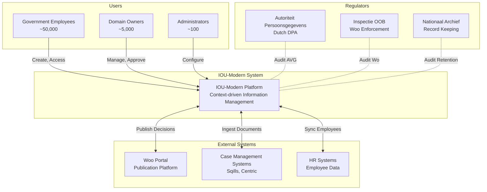

---

## 2. Container View (C4 Level 2)

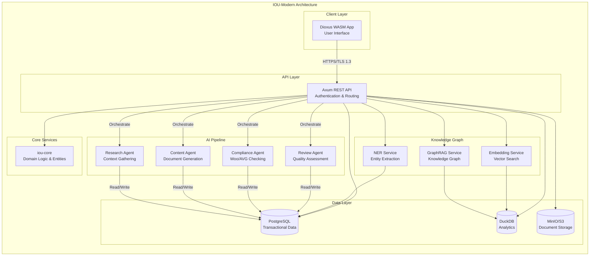

---

## 3. Component View (C4 Level 3) - API Gateway

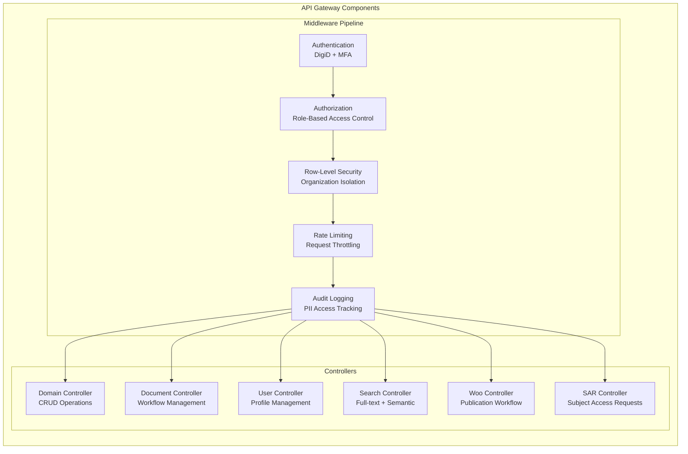

---

## 4. Component View - AI Pipeline

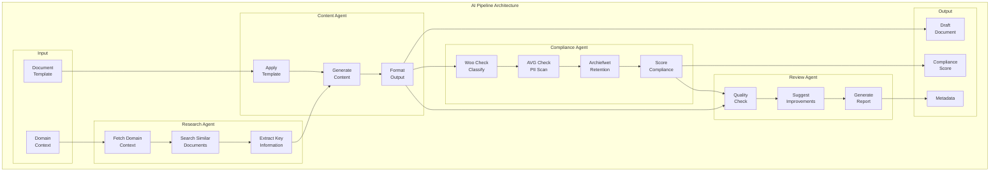

---

## 5. Component View - Knowledge Graph

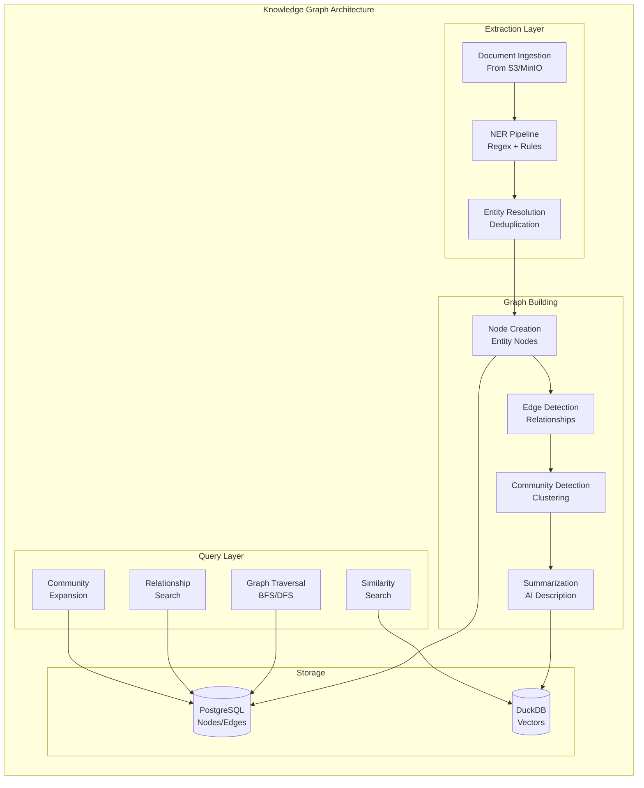

---

## 6. Data Model View (ERD)

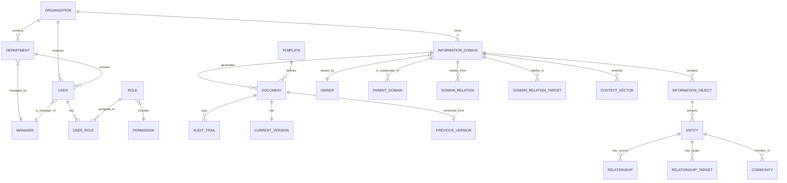

---

## 7. Security Architecture

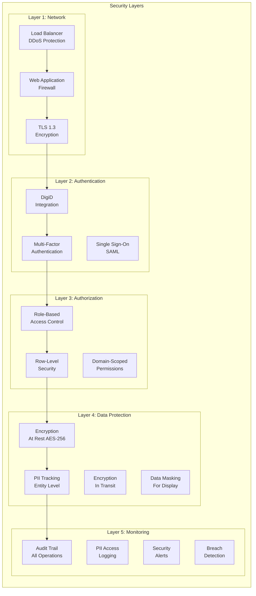

---

## 8. Woo Publication Flow

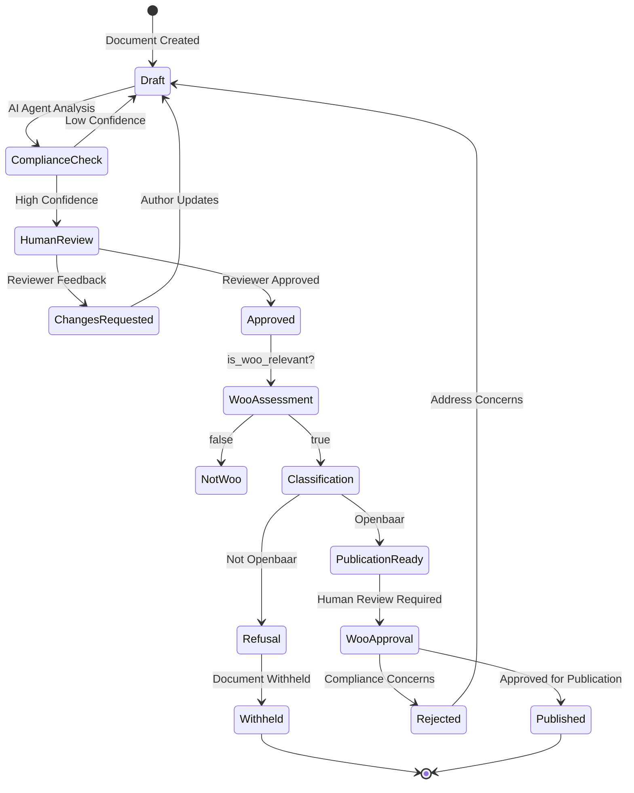

---

## 9. Data Flow: Document Processing

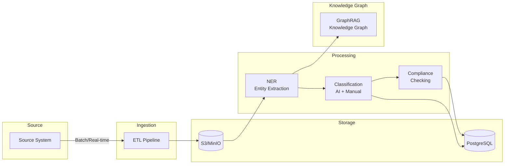

---

## 10. Deployment Architecture

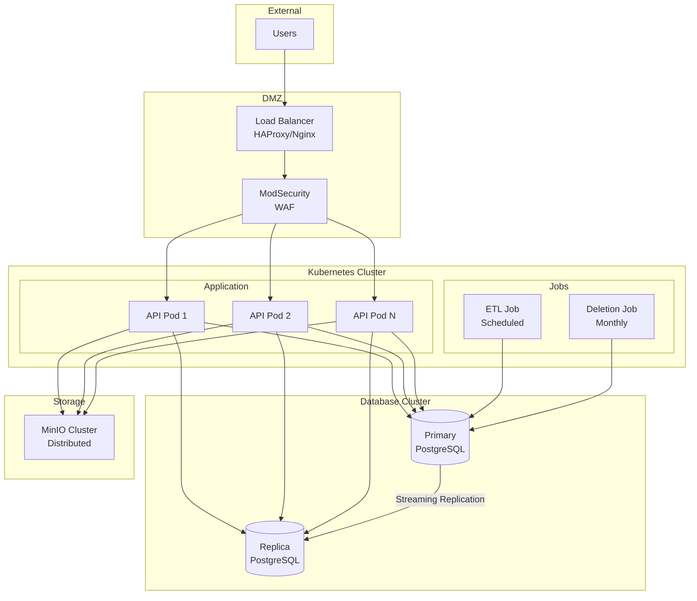

---

## 11. Sequence Diagram: Subject Access Request

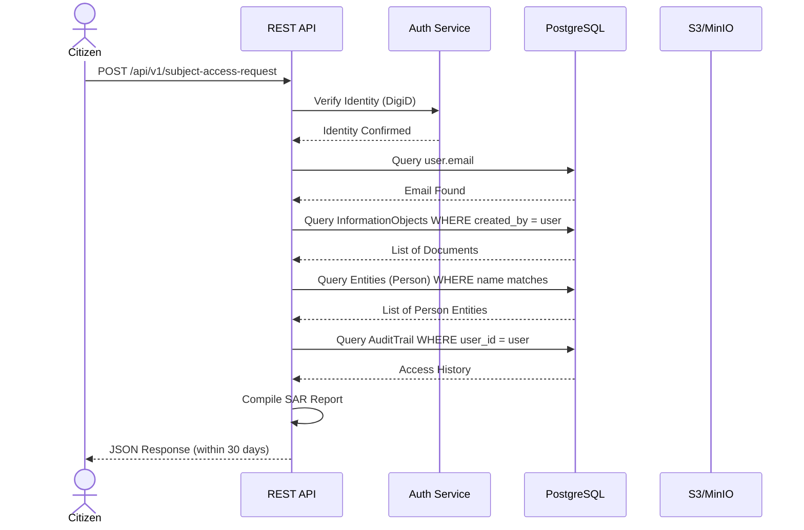

---

## 12. Component Diagram: AI Orchestration

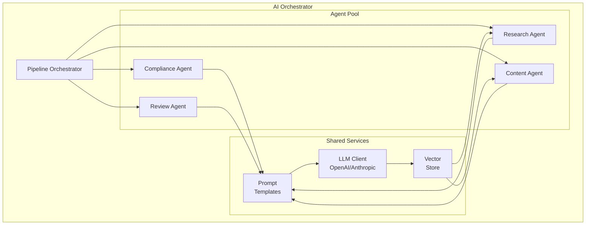

---

## Diagram Legend

| Symbol | Meaning |
|--------|---------|
| `||--o{| | One-to-many (required to many) |
| `||--o|` | One-to-many (required to optional) |
| `}|--||` | Many-to-one (optional to required) |
| `[(...)]` | Database table |
| `[...]` | Component/Container |
| `-->` | Data flow |
| `-.->` | Dependency/Feedback |

---

## Related Documents

| Document | ID |
|----------|-----|
| Data Model | ARC-001-DATA-v1.0 |
| Requirements | ARC-001-REQ-v1.0 |
| High-Level Design | (This document) |
| ADR | ARC-001-ADR-v1.0 |

---

**END OF ARCHITECTURE DIAGRAMS**

## Generation Metadata

**Generated by**: ArcKit `/arckit:diagram` command
**Generated on**: 2026-03-20
**ArcKit Version**: 4.3.1
**Project**: IOU-Modern (Project 001)
**AI Model**: Claude Opus 4.6
