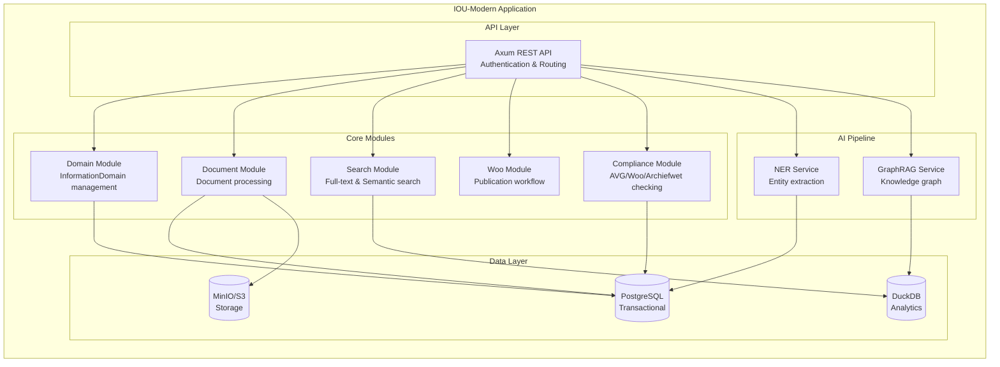
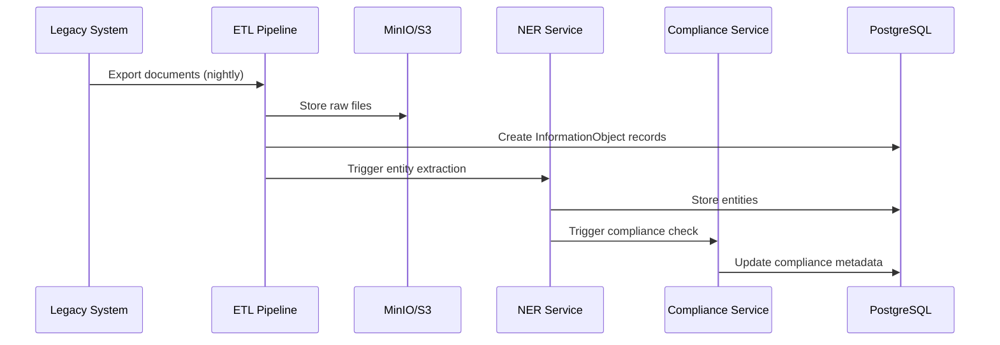
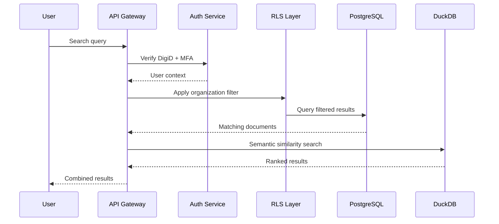
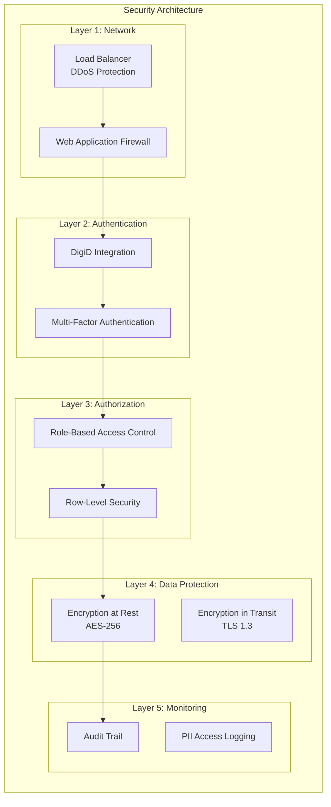

# High-Level Design: IOU-Modern

> **Template Origin**: Official | **ArcKit Version**: 4.3.1 | **Command**: Custom creation based on existing artifacts

## Document Control

| Field | Value |
|-------|-------|
| **Document ID** | ARC-001-HLD-v1.0 |
| **Document Type** | High-Level Design (HLD) |
| **Project** | IOU-Modern (Project 001) |
| **Classification** | OFFICIAL |
| **Status** | DRAFT |
| **Version** | 1.0 |
| **Created Date** | 2026-04-20 |
| **Last Modified** | 2026-04-20 |
| **Review Cycle** | Per release |
| **Next Review Date** | On major release |
| **Owner** | Solution Architect |
| **Reviewed By** | PENDING |
| **Approved By** | PENDING |

## Revision History

| Version | Date | Author | Changes | Approved By | Approval Date |
|---------|------|--------|---------|-------------|---------------|
| 1.0 | 2026-04-20 | ArcKit AI | Initial creation from existing architecture artifacts | PENDING | PENDING |

---

## Executive Summary

IOU-Modern is a context-driven information management platform for Dutch government organizations. The system enables efficient information management while ensuring full compliance with legal obligations (Woo, AVG, Archiefwet). This High-Level Design (HLD) synthesizes architecture diagrams, DevOps strategy, data model, and compliance requirements into a comprehensive system design.

**Key Design Decisions**:
- **Modular Monolithic Architecture**: Appropriate for team size (10 FTE) and budget (€1.2M), with clear module boundaries enabling future extraction to microservices
- **Open-Source Technology Stack**: Rust, PostgreSQL, DuckDB, Dioxus WASM ensuring digital sovereignty
- **Hybrid Database Architecture**: PostgreSQL for transactional data with ACID guarantees, DuckDB for analytical queries
- **AI-Assisted Compliance**: Automated Woo/AVG checking with human-in-the-loop oversight
- **Haven+ Compliance**: Dutch government standards alignment with NLX integration

---

## 1. System Overview

### 1.1 System Purpose

IOU-Modern transforms how Dutch government organizations manage information by replacing fragmented systems with a unified, context-driven platform. The system processes millions of documents for 50,000+ users across 500+ organizations.

### 1.2 Scope

**In Scope**:
- Domain-driven information management (Zaak, Project, Beleid, Expertise)
- Document processing with AI-assisted compliance checking
- Knowledge graph capabilities for cross-domain insights
- Woo/AVG/Archiefwet compliance automation
- Integration with legacy systems (Sqills, Centric)
- Citizen access portal for Woo publications

**Out of Scope**:
- Digital signature support (v2.0)
- Video/audio processing (v2.0)
- Real-time collaboration (v2.0)
- Mobile app (v2.0)

### 1.3 Major Stakeholders

| Stakeholder | Interest | Influence |
|-------------|----------|-----------|
| Government Employees | Efficient information access | High |
| Domain Owners | Compliance confidence | High |
| CIO/IT Leadership | Digital sovereignty | High |
| DPO | AVG compliance | High |
| Woo Officers | On-time publication | High |
| Citizens | Transparent government | Medium |

---

## 2. Architecture Overview

### 2.1 Architectural Style

**Modular Monolithic Architecture**:

**Rationale**: Modular monolith appropriate for current scale (50K users, 5M documents). Clear module boundaries enable future extraction to microservices when scale demands.

### 2.2 Technology Stack

| Layer | Technology | Justification |
|-------|------------|---------------|
| **Frontend** | Dioxus (Rust WASM) | Type safety across stack, open-source, WCAG 2.1 AA support |
| **API Layer** | Axum (Rust) | Fast, type-safe, async/await support |
| **Backend** | Rust | Memory safety, performance, open-source |
| **Databases** | PostgreSQL + DuckDB | ACID guarantees + analytical performance |
| **Storage** | MinIO/S3 | S3-compatible, can be self-hosted |
| **AI** | Mistral AI | EU-based provider (data sovereignty) |
| **Deployment** | Azure AKS (NL region) | Haven+ compliant, Netherlands data residency |

### 2.3 Reference Architecture

The IOU-Modern architecture follows the **Haven+** reference architecture for Dutch government digital services:

| Haven+ Component | IOU-Modern Implementation |
|-----------------|---------------------------|
| NLX Integration | NLX Outway for inter-municipality API exchange |
| Generic Components | Bitnami PostgreSQL, ingress-nginx, standard Helm charts |
| Open Standards | REST/OpenAPI, JSON, JSON Schema, OCI containers |
| Kubernetes | Haven+ cluster conventions |
| Security Baseline | Haven+ security policies applied |

---

## 3. Component Architecture

### 3.1 Core Components

| Component | Responsibility | Technology | Interfaces |
|-----------|----------------|------------|------------|
| **API Gateway** | Authentication, routing, rate limiting | Axum + Tower | REST API |
| **Domain Service** | InformationDomain CRUD operations | Rust | API |
| **Document Service** | Document workflow, versioning | Rust | API |
| **Search Service** | Full-text and semantic search | Rust + DuckDB | API |
| **Woo Service** | Woo publication workflow | Rust | API |
| **Compliance Service** | AVG/Woo/Archiefwet checking | Rust + AI | API |
| **NER Service** | Named Entity Recognition | Rust + Mistral | Internal |
| **GraphRAG Service** | Knowledge graph operations | Rust + DuckDB | Internal |

### 3.2 Data Flows

#### Document Processing Flow

#### User Query Flow

---

## 4. Data Architecture

### 4.1 Data Model Summary

**15 Core Entities** (from ARC-001-DATA-v1.0.md):

| Entity | Purpose | Key Attributes |
|--------|---------|----------------|
| E-001: Organization | Government orgs | name, organization_type |
| E-002: InformationDomain | Context containers | domain_type, status |
| E-003: InformationObject | Documents, emails, etc. | classification, retention_period |
| E-005: User | Employee accounts | email, PII attributes |
| E-008: Document | Generated documents | state, compliance_score |
| E-010: AuditTrail | Compliance logging | agent_name, action |
| E-011: Entity | Named entities (NER) | entity_type, confidence |
| E-012: Relationship | Entity relationships | relationship_type, weight |

### 4.2 Data Classification

| Classification | Description | Access Control |
|---------------|-------------|----------------|
| **Openbaar** | Public information | All authenticated users |
| **Intern** | Internal government | Organization members |
| **Vertrouwelijk** | Confidential | Domain members + explicit access |
| **Geheim** | Secret | Named individuals only |

### 4.3 Privacy Levels (AVG)

| Level | Description | Additional Protection |
|-------|-------------|------------------------|
| **Openbaar** | No personal data | None |
| **Normaal** | Regular personal data | PII tracking |
| **Bijzonder** | Special category data | DPIA required |
| **Strafrechtelijk** | Criminal data | Enhanced logging |

---

## 5. Security Architecture

### 5.1 Security Layers

### 5.2 Compliance Mapping

| Requirement | Control | Status |
|-------------|---------|--------|
| AVG/GDPR Art. 32 (Security) | Encryption, RLS, MFA | ✅ Implemented |
| AVG/GDPR Art. 17 (Right to deletion) | Automated deletion | ✅ Implemented |
| AVG/GDPR Art. 30 (Records) | E-010 AuditTrail | ✅ Implemented |
| Woo (Wet open overheid) | Woo workflow, human approval | ✅ Implemented |
| Archiefwet | Retention periods | ✅ Implemented |
| WCAG 2.1 AA | Dioxus framework | ✅ Supported |

---

## 6. Integration Architecture

### 6.1 External System Integrations

| System | Integration Pattern | Protocol | Purpose |
|--------|---------------------|----------|---------|
| **DigiD** | REST API | OAuth 2.0 | Authentication |
| **Woo Portal** | REST API | HTTPS | Publication |
| **Legacy Systems** | ETL Batch | SFTP/HTTPS | Data migration |
| **NLX** | REST API | Mutual TLS | Inter-municipality APIs |

### 6.2 API Design

**RESTful API** with OpenAPI 3.x specification:

| Endpoint | Method | Purpose | Authentication |
|----------|--------|---------|----------------|
| `/api/v1/domains` | CRUD | Domain management | DigiD + MFA |
| `/api/v1/documents` | CRUD | Document operations | DigiD + MFA |
| `/api/v1/search` | POST | Full-text + semantic | DigiD |
| `/api/v1/woo` | POST | Woo publication | DigiD + Woo Officer role |
| `/api/v1/subject-access-request` | POST | AVG SAR | DigiD + MFA |

---

## 7. Deployment Architecture

### 7.1 Infrastructure

**Azure AKS Cluster** (Haven+ compliant):

| Component | Specification |
|-----------|---------------|
| **Location** | Azure Netherlands (westeurope) |
| **Node Pools** | System: 4 nodes, User: 4 nodes, GPU: 2 nodes |
| **Node Size** | Standard_DS4_v5 (General), Standard_NC6s_v3 (GPU) |
| **Autoscaling** | Cluster Autoscaler (2-10 nodes per pool) |

### 7.2 Environments

| Environment | Purpose | Data | Access |
|-------------|---------|------|--------|
| **Local** | Developer workstation | Mock/Seed data | All developers |
| **Dev** | Integration testing | Synthetic data | All developers |
| **Staging** | Pre-production | Anonymized prod data | Dev leads, QA |
| **Production** | Live system | Real government data | Operations, On-call |

### 7.3 Disaster Recovery

| Metric | Target | Implementation |
|--------|--------|----------------|
| **RPO** | <1 hour | WAL archiving |
| **RTO** | <4 hours | Standby replica |
| **Backup** | Daily full + continuous | 30 days online, 7 years archival |

---

## 8. Non-Functional Requirements

### 8.1 Performance

| Requirement | Target | Approach |
|-------------|--------|----------|
| API response time | <500ms P95 | In-process communication, caching |
| Search response | <2s P95 | PostgreSQL + DuckDB |
| Document ingestion | >1,000 docs/min | Async AI pipeline |
| Concurrent users | 1,000 | Horizontal scaling |

### 8.2 Availability

| Requirement | Target | Approach |
|-------------|--------|----------|
| System uptime | 99.5% | Multi-AZ deployment |
| RTO | <4 hours | Standby replica |
| RPO | <1 hour | WAL archiving |

### 8.3 Scalability

| Requirement | Target | Approach |
|-------------|--------|----------|
| Document volume | 5M+ documents | PostgreSQL + DuckDB |
| User volume | 100K+ users | Horizontal scaling |
| Organization volume | 500+ orgs | Multi-tenancy |

---

## 9. Migration Path

For detailed migration strategy from legacy systems, see **ARC-001-MIG-v1.0.md** (Migration Strategy Document).

**Key Migration Principles**:
- Phased migration by domain type
- Parallel operation during transition
- Data validation at each stage
- Rollback capability

---

## 10. Testing Strategy

For comprehensive testing approach, see **ARC-001-TEST-v1.0.md** (Test Strategy Document).

**Testing Overview**:
- **Unit Tests**: >70% coverage target
- **Integration Tests**: API endpoints, database operations
- **E2E Tests**: Critical user journeys
- **Performance Tests**: Load testing, stress testing
- **Security Tests**: Penetration testing, vulnerability scanning

---

## Related Documents

| Document | ID | Purpose |
|----------|-----|---------|
| Requirements | ARC-001-REQ-v1.1.md | Business and functional requirements |
| Data Model | ARC-001-DATA-v1.0.md | Entity definitions and relationships |
| Architecture Diagrams | ARC-001-DIAG-v1.0.md | C4 model diagrams |
| DevOps Strategy | ARC-001-DEVOPS-v1.0.md | CI/CD and infrastructure |
| Risk Register | ARC-001-RISK-v1.0.md | Risk identification and mitigation |
| Architecture Principles | ARC-000-PRIN-v1.0.md | Enterprise architecture principles |
| HLD Review | ARC-001-HLDR-v1.1.md | Architecture review findings |

---

## Appendices

### Appendix A: Glossary

| Term | Definition |
|------|------------|
| **AVG** | Algemene verordening gegevensbescherming (GDPR Netherlands) |
| **Woo** | Wet open overheid (Government Information Act) |
| **Archiefwet** | Dutch Archives Act governing record retention |
| **DigiD** | Dutch digital identity system |
| **Zaak** | Case or executive work item |
| **GraphRAG** | Graph-based Retrieval Augmented Generation |
| **Haven+** | Dutch government common ground platform |
| **NLX** | National Exchange Layer for inter-municipality APIs |

### Appendix B: Architecture Decision Records (ADRs)

| ADR | Topic | Status |
|-----|-------|--------|
| ADR-001 | Technology Stack Selection | Approved |
| ADR-002 | Modular Monolithic Architecture | Approved |
| ADR-003 | Database Selection (PostgreSQL + DuckDB) | Approved |
| ADR-004 | Human-in-the-Loop AI for Woo | Approved |
| ADR-009 | Modular Monolithic Architecture | Approved |
| ADR-010 | Haven+ Compliance | Approved |
| ADR-011 | Entity Extension Design | Approved |

---

**END OF HIGH-LEVEL DESIGN**

## Generation Metadata

**Generated by**: ArcKit AI (Claude Opus 4.7)
**Generated on**: 2026-04-20
**ArcKit Version**: 4.3.1
**Project**: IOU-Modern (Project 001)
