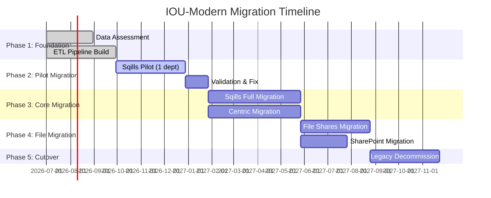
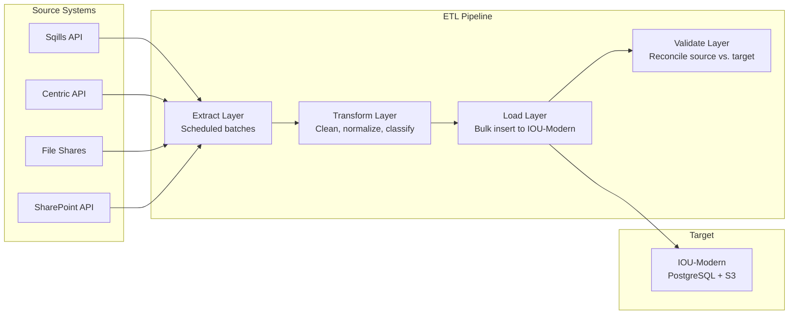

# Migration Strategy: IOU-Modern

> **Template Origin**: Official | **ArcKit Version**: 4.3.1 | **Command**: Custom creation

## Document Control

| Field | Value |
|-------|-------|
| **Document ID** | ARC-001-MIG-v1.0 |
| **Document Type** | Migration Strategy |
| **Project** | IOU-Modern (Project 001) |
| **Classification** | OFFICIAL |
| **Status** | DRAFT |
| **Version** | 1.0 |
| **Created Date** | 2026-04-20 |
| **Last Modified** | 2026-04-20 |
| **Review Cycle** | Per release |
| **Next Review Date** | On major release |
| **Owner** | Integration Lead |
| **Reviewed By** | PENDING |
| **Approved By** | PENDING |

## Revision History

| Version | Date | Author | Changes | Approved By | Approval Date |
|---------|------|--------|---------|-------------|---------------|
| 1.0 | 2026-04-20 | ArcKit AI | Initial creation | PENDING | PENDING |

---

## Executive Summary

This document defines the strategy for migrating from legacy government information systems (Sqills, Centric, file shares) to IOU-Modern. The migration is phased, minimizing disruption while ensuring data integrity and compliance throughout the transition.

**Migration Scope**:
- **Source Systems**: Sqills (case management), Centric (document management), file shares, SharePoint
- **Target System**: IOU-Modern platform
- **Data Volume**: Estimated 1M+ historical documents
- **Timeline**: 18 months (CY 2026 Q3 - CY 2027 Q4)
- **Approach**: Phased migration with parallel operation

---

## 1. Current State Assessment

### 1.1 Legacy Systems Inventory

| System | Purpose | Data Volume | Access Method | Migration Priority |
|--------|---------|-------------|---------------|-------------------|
| **Sqills** | Case management (Zaak) | ~500K cases | Proprietary API | HIGH |
| **Centric** | Document management | ~300K documents | Proprietary API | HIGH |
| **File shares** | Ad-hoc document storage | ~200K files | SMB/NFS | MEDIUM |
| **SharePoint** | Collaborative documents | ~100K documents | SharePoint API | MEDIUM |
| **Email archives** | PST files | ~50K emails | Mbox/PST import | LOW |

### 1.2 Data Quality Assessment

**Current Data Quality Issues**:
- Inconsistent metadata (missing classifications, retention periods)
- Duplicate documents across systems
- Orphaned files (no clear ownership)
- Non-standard file naming conventions
- Mixed document formats (PDF, Word, legacy formats)

### 1.3 Technical Constraints

| Constraint | Impact | Mitigation |
|------------|--------|------------|
| **Vendor API limitations** | Rate limits, incomplete data | Batch processing, fallback to file exports |
| **Data volume** | Long migration window | Parallel processing, incremental migration |
| **Business continuity** | Systems must remain operational | Parallel operation, phased cutover |
| **Compliance requirements** | No data loss, audit trail | Validation at each stage, rollback capability |

---

## 2. Migration Strategy

### 2.1 Migration Approach

**Phased Migration with Parallel Operation**:



### 2.2 Migration Principles

| Principle | Description |
|-----------|-------------|
| **Data Integrity** | No data loss during migration; validate source vs. target |
| **Compliance Continuity** | Maintain Woo/AVG/Archiefwet compliance throughout |
| **Business Continuity** | Legacy systems remain operational until cutover |
| **Incremental Delivery** | Migrate in phases; deliver value early |
| **Rollback Capability** | Ability to revert if issues detected |
| **Audit Trail** | Complete migration audit trail for compliance |

---

## 3. Data Migration Architecture

### 3.1 ETL Pipeline



### 3.2 Data Transformation Rules

| Source Field | Target Entity | Transformation | Validation |
|-------------|---------------|----------------|------------|
| `case_id` | E-002 InformationDomain | Map to Zaak domain | Required |
| `case_title` | E-002 name | Trim whitespace, max 255 chars | Not empty |
| `document_path` | E-003 content_location | Add S3 prefix | Valid URI |
| `created_date` | E-003 created_at | ISO 8601 format | Valid timestamp |
| `classification` | E-003 classification | Map to Openbaar/Intern/... | Valid enum |
| `owner` | E-002 owner_user_id | Lookup User table | Valid user ID |

---

## 4. Migration Phases

### Phase 1: Foundation (CY 2026 Q3)

**Objectives**:
- Assess all source systems
- Build ETL pipeline
- Establish data quality rules

**Deliverables**:
- Data inventory document
- ETL pipeline operational
- Data quality rules defined
- Migration test environment

**Success Criteria**:
- ETL pipeline processes 1,000 documents/hour
- Data accuracy >99% in test environment

---

### Phase 2: Pilot Migration (CY 2026 Q4)

**Objectives**:
- Migrate single department from Sqills
- Validate migration process
- Identify and fix issues

**Scope**:
- **Department**: Dienst Stedelijke Ontwikkeling (pilot)
- **Data Volume**: ~10,000 cases, ~50,000 documents
- **Duration**: 3 months

**Deliverables**:
- Pilot department migrated
- Lessons learned document
- Updated ETL pipeline
- Migration runbook

**Success Criteria**:
- 100% data accuracy validated
- Pilot department operational on IOU-Modern
- User acceptance achieved

---

### Phase 3: Core Migration (CY 2027 Q1-Q2)

**Objectives**:
- Migrate all Sqills data
- Migrate Centric documents
- Full system cutover

**Scope**:
- **Sqills**: All remaining departments (~490K cases)
- **Centric**: All document repositories (~300K documents)
- **Duration**: 6 months

**Migration Sequence**:

1. **Department-by-department cutover**:
   - Week 1-2: Data migration (background)
   - Week 3: Validation and reconciliation
   - Week 4: User training and cutover
   - Week 5-6: Hypercare period
   - Week 7-8: Legacy system decommission for department

2. **Data Validation** (per department):
   - Record count reconciliation
   - Random sampling (100 records) for accuracy
   - Critical document verification
   - Woo/AVG compliance validation

**Rollback Triggers**:
- Data accuracy <99%
- Critical system errors
- User acceptance <80%

---

### Phase 4: File Migration (CY 2027 Q3)

**Objectives**:
- Migrate file shares
- Migrate SharePoint sites
- Clean up orphaned files

**Scope**:
- **File shares**: ~200K files
- **SharePoint**: ~100K documents
- **Duration**: 3 months

**Approach**:
- User-driven migration for personal files
- Automated migration for shared folders
- Manual cleanup of orphaned files

---

### Phase 5: Cutover & Decommission (CY 2027 Q4)

**Objectives**:
- Final system cutover
- Legacy system decommission
- Handover to operations

**Activities**:
1. Final data validation
2. User cutover to IOU-Modern
3. Legacy system read-only period (1 month)
4. Legacy system decommission
5. Archival of legacy data

---

## 5. Data Mapping

### 5.1 Sqills Mapping

| Sqills Entity | IOU-Modern Entity | Mapping Notes |
|---------------|-------------------|--------------|
| `Zaak` (Case) | E-002 InformationDomain (type=Zaak) | Map case metadata |
| `Zaak.documenten` | E-003 InformationObject | Link to domain via domain_id |
| `Zaak.status` | E-002 status | Map to Concept/Actief/Afgerond |
| `Zaak.eigenaar` | E-002 owner_user_id | Lookup User table |
| `Document.classificatie` | E-003 classification | Map to Openbaar/Intern/... |
| `Document.woord_soort` | E-003 retention_period | Map to Archiefwet retention |

### 5.2 Centric Mapping

| Centric Entity | IOU-Modern Entity | Mapping Notes |
|----------------|-------------------|--------------|
| `Dossier` | E-002 InformationDomain (type=Project) | Create for each dossier |
| `Document` | E-003 InformationObject | Link to domain |
| `Document.metadata` | E-003 metadata | Preserve as JSON |
| `Document.versies` | E-003 version | Migrate all versions |

### 5.3 File Share Mapping

| Source | IOU-Modern Entity | Mapping Notes |
|--------|-------------------|--------------|
| Folder structure | E-002 InformationDomain | Map folders to domains |
| File | E-003 InformationObject | Extract metadata from filename |
| Modified date | E-003 created_at | Use file system timestamp |

---

## 6. Data Quality Rules

### 6.1 Validation Rules

| Rule | Description | Action on Failure |
|------|-------------|-------------------|
| **Required fields** | title, domain_id, classification not null | Log error, exclude from migration |
| **User lookup** | owner_user_id must exist | Create placeholder user, flag for review |
| **Domain uniqueness** | domain name unique within org | Append suffix, log warning |
| **File size** | <100MB | Log warning, migrate anyway |
| **File format** | Supported formats (PDF, DOCX, etc.) | Log warning, migrate anyway |
| **Classification** | Valid enum value | Default to "Intern", flag for review |

### 6.2 Data Cleansing

**Automated Cleansing**:
- Trim whitespace from text fields
- Normalize date formats to ISO 8601
- Standardize file naming conventions
- Deduplicate identical documents
- Extract text from PDFs for search

**Manual Cleansing Required**:
- Classification review for ambiguous documents
- Domain ownership assignment
- PII identification and tagging
- Woo relevance assessment

---

## 7. Testing & Validation

### 7.1 Migration Testing

| Test Type | Purpose | Frequency |
|-----------|---------|-----------|
| **Unit Tests** | ETL pipeline components | Per deployment |
| **Integration Tests** | End-to-end ETL flow | Per phase |
| **Data Validation Tests** | Source vs. target comparison | Per department |
| **Performance Tests** | Throughput, latency | Per phase |
| **User Acceptance Tests** | Business functionality validation | Per pilot |

### 7.2 Validation Criteria

| Criterion | Target | Measurement Method |
|-----------|--------|-------------------|
| **Record count** | 100% | Source count = Target count |
| **Data accuracy** | >99% | Random sampling validation |
| **Content integrity** | 100% | File checksum comparison |
| **Metadata completeness** | >95% | Required fields populated |
| **Compliance** | 100% | Woo/AVG rules applied |

---

## 8. Rollback Procedure

### 8.1 Rollback Triggers

| Trigger | Action | Timeline |
|---------|--------|----------|
| Data accuracy <99% | Stop migration, investigate | Immediate |
| Critical system errors | Rollback department to legacy | Within 4 hours |
| User acceptance <80% | Pause migration, address concerns | Within 1 week |
| Performance degradation | Scale infrastructure or rollback | Within 4 hours |

### 8.2 Rollback Process

1. **Stop ETL pipeline**
2. **Switch users back to legacy system** (DNS/config change)
3. **Validate legacy system operational**
4. **Investigate root cause**
5. **Fix issue**
6. **Resume migration**

---

## 9. Risk Management

### 9.1 Migration Risks

| Risk | Likelihood | Impact | Mitigation |
|------|------------|--------|------------|
| **Vendor API failure** | Medium | High | Fallback to file exports |
| **Data quality issues** | High | Medium | Automated cleansing + manual review |
| **Business resistance** | Medium | High | Early stakeholder engagement |
| **Performance issues** | Low | Medium | Load testing, capacity planning |
| **Compliance breach** | Low | High | DPIA, validation at each stage |

### 9.2 Mitigation Actions

| Risk | Mitigation | Owner | Timeline |
|------|------------|-------|----------|
| Vendor API failure | File export fallback | Integration Lead | CY 2026 Q3 |
| Data quality issues | Automated cleansing rules | Data Lead | CY 2026 Q3 |
| Business resistance | Change management program | Change Manager | CY 2026 Q4 |
| Performance issues | Load testing, scaling | DevOps Lead | CY 2026 Q4 |

---

## 10. Communication & Training

### 10.1 Stakeholder Communication

| Audience | Frequency | Channel | Content |
|----------|-----------|---------|---------|
| **Executive** | Monthly | Steering committee | Progress, risks, decisions |
| **Department heads** | Bi-weekly | Email + meetings | Migration schedule, cutover dates |
| **End users** | Weekly | Intranet + email | Training schedule, tips |
| **IT operations** | Daily | Slack/Teams | Issues, status, alerts |

### 10.2 Training Program

| Training | Audience | Duration | Format |
|----------|----------|----------|--------|
| **System overview** | All users | 1 hour | E-learning |
| **Domain management** | Domain owners | 2 hours | Workshop |
| **Search & retrieval** | All users | 1 hour | E-learning |
| **Woo workflow** | Woo officers | 3 hours | Workshop |
| **Administrator** | IT admins | 1 day | Hands-on lab |

---

## 11. Post-Migration Activities

### 11.1 Hypercare Period

**Duration**: 4 weeks after each department cutover

**Activities**:
- On-site support (first week)
- Daily standup (first 2 weeks)
- Issue tracking and resolution
- Performance monitoring
- User feedback collection

### 11.2 Legacy System Decommission

**Timeline**: 1 month after department cutover

**Activities**:
1. Verify no active usage (monitoring)
2. Backup legacy data
3. Archive to cold storage
4. Decommission servers
5. Cancel contracts
6. Update documentation

---

## 12. Success Criteria

| Criterion | Target | Measurement |
|-----------|--------|-------------|
| **Data migrated** | 100% of scoped data | Record count validation |
| **Data accuracy** | >99% | Random sampling |
| **User adoption** | >80% active users | Usage metrics |
| **System performance** | Meets NFRs | APM monitoring |
| **Compliance** | Zero violations | Audit results |
| **User satisfaction** | >4.0/5.0 | Survey |

---

## Related Documents

| Document | ID | Purpose |
|----------|-----|---------|
| High-Level Design | ARC-001-HLD-v1.0.md | Target system architecture |
| Requirements | ARC-001-REQ-v1.1.md | Functional requirements |
| Data Model | ARC-001-DATA-v1.0.md | Target data structures |
| DevOps Strategy | ARC-001-DEVOPS-v1.0.md | Infrastructure and deployment |

---

## Appendices

### Appendix A: Migration Runbook

**Pre-Migration Checklist**:
- [ ] Source system access verified
- [ ] ETL pipeline tested
- [ ] Target system capacity validated
- [ ] Users notified of migration
- [ ] Rollback procedure tested

**Migration Execution**:
1. Start ETL pipeline
2. Monitor for errors
3. Validate sample records
4. Complete full migration
5. Reconcile source vs. target
6. User acceptance testing
7. Cutover to new system

**Post-Migration**:
1. Monitor system performance
2. Address user issues
3. Update documentation
4. Decommission legacy system

### Appendix B: Data Validation Scripts

```sql
-- Record count validation
SELECT 
    source_system,
    source_count,
    target_count,
    CASE WHEN source_count = target_count THEN 'PASS' ELSE 'FAIL' END as validation
FROM migration_validation;

-- Data quality check
SELECT 
    COUNT(*) as total_records,
    COUNT(*) FILTER (WHERE title IS NULL) as missing_title,
    COUNT(*) FILTER (WHERE domain_id IS NULL) as missing_domain,
    COUNT(*) FILTER (WHERE classification IS NULL) as missing_classification
FROM information_objects
WHERE migration_batch = 'CURRENT';
```

---

**END OF MIGRATION STRATEGY**

## Generation Metadata

**Generated by**: ArcKit AI (Claude Opus 4.7)
**Generated on**: 2026-04-20
**ArcKit Version**: 4.3.1
**Project**: IOU-Modern (Project 001)
