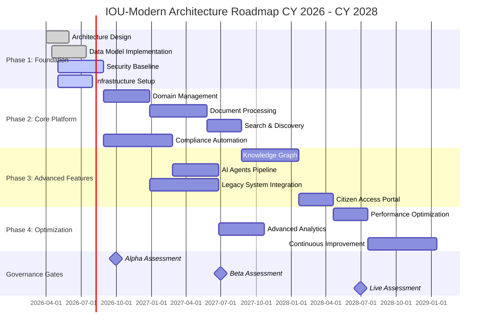
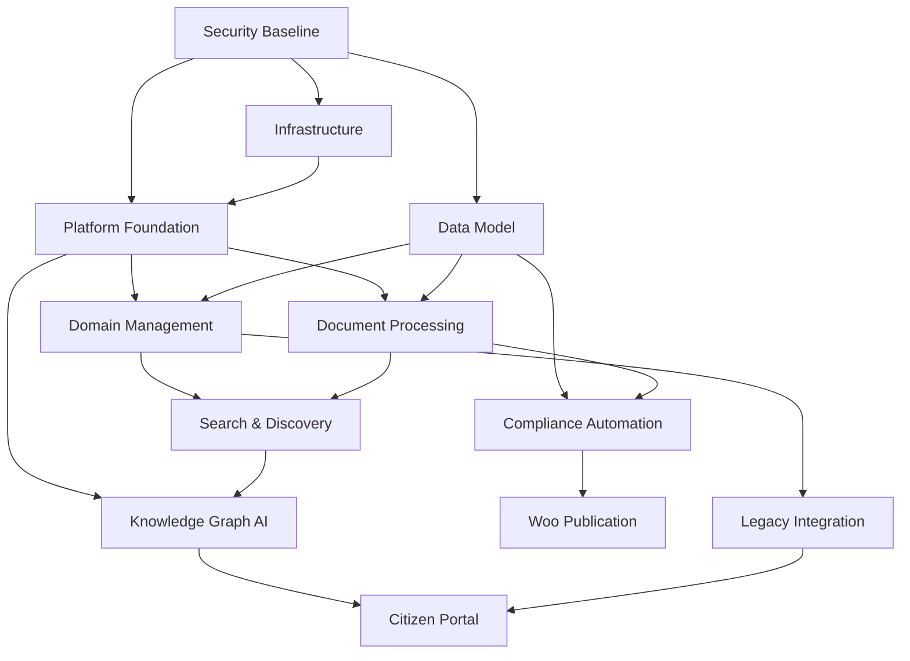

# Strategic Architecture Roadmap: IOU-Modern

> **Template Origin**: Official | **ArcKit Version**: 4.3.1 | **Command**: `/arckit:roadmap`

## Document Control

| Field | Value |
|-------|-------|
| **Document ID** | ARC-001-ROAD-v1.1 |
| **Document Type** | Strategic Architecture Roadmap |
| **Project** | IOU-Modern (Project 001) |
| **Classification** | OFFICIAL |
| **Status** | DRAFT |
| **Version** | 1.1 |
| **Created Date** | 2026-03-23 |
| **Last Modified** | 2026-03-23 |
| **Review Cycle** | Quarterly |
| **Next Review Date** | 2026-04-23 |
| **Owner** | Enterprise Architect |
| **Reviewed By** | PENDING |
| **Approved By** | PENDING |
| **Distribution** | Project Team, Architecture Team, CIO Office, DPO |
| **Financial Years Covered** | CY 2026 - CY 2028 |
| **Approver** | Chief Architect |

## Revision History

| Version | Date | Author | Changes | Approved By | Approval Date |
|---------|------|--------|---------|-------------|---------------|
| 1.0 | 2026-03-23 | ArcKit AI | Initial creation from `/arckit:roadmap` command | PENDING | PENDING |
| 1.1 | 2026-03-23 | ArcKit AI | Timeline adjusted to CY 2026-2028 to align with current project start; added interim milestones | PENDING | PENDING |

---

## Executive Summary

### Strategic Vision

IOU-Modern will transform how Dutch government organizations manage information by replacing fragmented systems with a unified, context-driven platform. Currently, government employees struggle with scattered information across case management systems, manual compliance checking, and inefficient document retrieval. IOU-Modern addresses these challenges through domain-driven organization (Zaak, Project, Beleid, Expertise), AI-assisted compliance, and knowledge graph capabilities.

### Investment Summary

- **Total Investment**: €1.2M over 3 years
- **Capital Expenditure**: €750K (development, infrastructure, licensing)
- **Operational Expenditure**: €450K (hosting, support, maintenance, AI API costs)
- **Expected ROI**: 180% by CY 2028
- **Payback Period**: 2.2 years

### Expected Outcomes

1. **Efficiency Gain**: 50% reduction in time spent on document retrieval and compliance checking
2. **Compliance Improvement**: 95% reduction in Woo/AVG compliance violations through automated checking
3. **Cost Savings**: €200K annual savings through reduced manual processing and legacy system decommissioning

### Timeline at a Glance

- **Duration**: April 2026 to December 2028 (33 months)
- **Major Phases**: 4 phases (Foundation, Core Platform, Advanced Features, Optimization)
- **Key Milestones**: 12 strategic milestones
- **Governance Gates**: 3 decision gates (Alpha, Beta, Live)

---

## Strategic Context

### Vision & Strategic Drivers

#### Business Vision

Enable Dutch government organizations to manage information efficiently while maintaining full compliance with legal obligations (Woo, AVG, Archiefwet). The system will process millions of documents for 50,000+ users across 500+ organizations, providing AI-assisted insights while ensuring digital sovereignty through open-source technology.

#### Link to Stakeholder Drivers

| Stakeholder Group | Key Driver | Strategic Goal | Roadmap Alignment |
|-------------------|-------------|----------------|-------------------|
| Government Employees (S1) | Efficient information access | Reduce time spent finding documents | Theme 1: User Experience |
| Domain Owners (S2) | Compliance confidence | Ensure Woo/AVG compliance before publication | Theme 3: Compliance Automation |
| CIO/IT Leadership (S4) | Digital sovereignty | Reduce vendor lock-in, open-source-first | Theme 2: Platform Foundation |
| DPO (S5) | AVG compliance | Automated PII tracking and DPIA support | Theme 3: Compliance Automation |
| Woo Officers (S6) | On-time publication | Automated Woo assessment and workflow | Theme 3: Compliance Automation |
| Citizens (S9) | Transparent government | Easy access to government decisions | Theme 4: Citizen Access |

#### Architecture Principles Alignment

[Reference: ARC-000-PRIN-v1.0.md]

| Principle | Roadmap Compliance | Timeline for Full Compliance |
|-----------|-------------------|------------------------------|
| P1: Privacy by Design | DPIA completed, PII tracking implemented, RLS enforced | CY 2026 Q4 |
| P2: Open Government | Woo workflow automated, publication portal integrated | CY 2027 Q1 |
| P3: Archival Integrity | Retention periods automated, archival transfer ready | CY 2027 Q3 |
| P4: Sovereign Technology | Open-source stack (Rust, PostgreSQL, Dioxus), no vendor lock-in | CY 2026 Q3 |
| P5: Domain-Driven | Four domain types implemented, context-aware search | CY 2027 Q1 |
| P6: Human-in-the-Loop AI | Human approval for Woo documents, AI recommendations with confidence scores | CY 2026 Q4 |
| P7: Data Sovereignty | EU-only processing, Netherlands hosting confirmed | CY 2026 Q3 |
| P8: Interoperability | OpenAPI specification, legacy system integrations | CY 2027 Q2 |
| P9: Accessibility | WCAG 2.1 AA compliance achieved | CY 2027 Q4 |
| P10: Observability | Complete audit trail, PII access logging, 7-year retention | CY 2026 Q4 |

### Current State Assessment

#### Technology Landscape

**Current Systems**:

- **Legacy Case Management**: Sqills, Centric (proprietary, limited APIs, aging infrastructure)
- **Document Storage**: File shares, SharePoint (fragmented, no unified search)
- **Compliance Tools**: Manual processes, spreadsheets (error-prone, inefficient)
- **Search**: Basic keyword search (30% success rate for queries)
- **Authentication**: DigiD integration available but not unified

**Technical Debt**: Estimated €250K in manual processes, fragmented integrations, and compliance risks.

#### Capability Maturity Baseline

| Capability Domain | Current Maturity Level | Assessment |
|-------------------|------------------------|------------|
| Information Management | L1 (Initial) | Fragmented systems, manual processes |
| Compliance Automation | L1 (Initial) | Manual Woo/AVG checking, high error rate |
| Search & Discovery | L1 (Initial) | Basic keyword search, poor relevance |
| Knowledge Management | L1 (Initial) | No cross-domain insights |
| Data Sovereignty | L2 (Repeatable) | Some open-source adoption, but cloud dependencies |
| Observability | L1 (Initial) | Limited logging, no centralized audit trail |
| API Maturity | L2 (Repeatable) | Some APIs exist, but inconsistent |

**Maturity Model**:
- **Level 1**: Initial/Ad-hoc - unpredictable, poorly controlled
- **Level 2**: Repeatable - some discipline, can repeat successes
- **Level 3**: Defined - standardized, organization-wide
- **Level 4**: Managed - quantitatively managed, metrics-driven
- **Level 5**: Optimized - continuous improvement, industry-leading

#### Technical Debt Quantification

- **Total Technical Debt**: €250K or 25 person-months
- **High Priority Debt**:
  1. Manual Woo compliance checking (€80K/year in staff time)
  2. Fragmented document storage across multiple systems (€100K/year in search inefficiency)
  3. No centralized PII tracking (€40K/year in compliance risk)
  4. Legacy system integration failures (€30K/year in rework)

#### Risk Exposure

[Link to ARC-001-RISK-v1.0.md]

**Strategic Risks**:

1. **RISK-COM-002: AVG/GDPR Violation** (HIGH) - PII processing without adequate controls
   - Mitigation: Automated DPIA, PII tracking, RLS enforcement
2. **RISK-STR-002: Vendor Lock-In** (HIGH) - Dependency on proprietary technologies
   - Mitigation: Open-source-first stack, containerization, exit strategies
3. **RISK-OPS-001: Data Breach** (HIGH) - Government systems are attractive targets
   - Mitigation: Encryption at rest and in transit, MFA, security reviews
4. **RISK-COM-003: AI Liability** (MEDIUM) - AI errors causing incorrect decisions
   - Mitigation: Human-in-the-loop for Woo documents, confidence scores, audit trail
5. **RISK-FIN-002: Operational Cost Overrun** (MEDIUM) - AI API costs exceeding budget
   - Mitigation: Cost monitoring, usage quotas, open-source fallbacks

### Future State Vision

#### Target Architecture

**Target State Characteristics**:

- Cloud-native architecture with containerized services (Kubernetes deployment)
- API-first integration with OpenAPI specifications
- Open-source technology stack (Rust, PostgreSQL, DuckDB, Dioxus WASM)
- AI-powered automation with human oversight for critical decisions
- Data-driven insights through knowledge graphs and semantic search
- Security by design with encryption, RLS, and comprehensive audit logging

#### Capability Maturity Targets

| Capability Domain | Target Maturity Level | Gap to Close |
|-------------------|----------------------|--------------|
| Information Management | L4 (Managed) | +3 levels |
| Compliance Automation | L4 (Managed) | +3 levels |
| Search & Discovery | L4 (Managed) | +3 levels |
| Knowledge Management | L3 (Defined) | +2 levels |
| Data Sovereignty | L5 (Optimized) | +3 levels |
| Observability | L4 (Managed) | +3 levels |
| API Maturity | L4 (Managed) | +2 levels |

#### Technology Evolution

**Evolution Strategy**:

- **Genesis → Custom**: AI-powered compliance checking, knowledge graph platform
- **Custom → Product**: Document processing pipeline may move to SaaS solutions
- **Product → Commodity**: Basic storage and computing infrastructure via cloud

---

## Roadmap Timeline

### Visual Timeline

### Roadmap Phases

#### Phase 1: Foundation (CY 2026 Q2 - Q3)

**Objectives**:
- Establish architecture baseline and security foundation
- Implement core data model with compliance tracking
- Set up infrastructure with sovereign technology controls

**Key Deliverables**:
- Architecture principles approved and documented
- Data model implemented for 15 core entities
- PostgreSQL + DuckDB infrastructure deployed in Netherlands
- Row-Level Security (RLS) configured for multi-tenancy
- DPIA completed and approved
- Security baseline (encryption at rest/transit, MFA)
- Development environment with CI/CD pipelines

**Investment**: €250K

---

#### Phase 2: Core Platform (CY 2026 Q4 - CY 2027 Q2)

**Objectives**:
- Deliver domain-driven information management
- Implement document processing with AI assistance
- Build search and discovery capabilities
- Automate Woo/AVG compliance workflows

**Key Deliverables**:
- Domain management for Zaak, Project, Beleid, Expertise
- Document ingestion pipeline from legacy systems (Sqills, Centric)
- AI-powered compliance checking with human-in-the-loop
- Full-text and semantic search with <2s P95 response
- Woo publication workflow with audit trail
- SAR (Subject Access Request) API endpoint
- Multi-factor authentication with DigiD integration

**Investment**: €500K

---

#### Phase 3: Advanced Features (CY 2027 Q2 - Q4)

**Objectives**:
- Implement knowledge graph for cross-domain insights
- Deploy AI agents for document assistance
- Integrate with legacy government systems
- Launch citizen access portal

**Key Deliverables**:
- Knowledge graph with entity extraction (Person, Organization, Location)
- GraphRAG for relationship discovery and semantic search
- AI agent pipeline (Research, Content, Compliance, Review agents)
- Rijksoverheid Open Data API integration
- Legacy system ETL from major case management systems
- Citizen portal with Woo document access
- Advanced analytics dashboard for insights

**Investment**: €350K

---

#### Phase 4: Optimization (CY 2028)

**Objectives**:
- Optimize performance and scalability
- Implement advanced analytics
- Establish continuous improvement processes
- Achieve target capability maturity levels

**Key Deliverables**:
- Performance optimization (search <1s P95, 1000+ concurrent users)
- Advanced analytics and reporting capabilities
- Automated retention-based archival
- WCAG 2.1 AA accessibility compliance
- Continuous integration/deployment with automated testing
- Cost optimization and rightsizing
- Knowledge base and documentation portal
- Training and change management materials

**Investment**: €100K

---

## Roadmap Themes & Initiatives

### Theme 1: Platform Foundation

#### Strategic Objective

Establish a sovereign, open-source technology platform that provides the foundation for all IOU-Modern capabilities while ensuring data sovereignty and avoiding vendor lock-in.

#### Timeline by Financial Year

**CY 2026 Q2**:

- Initiative 1.1: Set up PostgreSQL + DuckDB infrastructure in Netherlands (Azure NL or on-premises)
- Initiative 1.2: Implement Row-Level Security (RLS) for organization-level isolation
- Initiative 1.3: Deploy MinIO/S3-compatible storage for document content
- Initiative 1.4: Set up Kubernetes cluster for container orchestration
- Initiative 1.5: Implement CI/CD pipelines with automated testing
- **Milestones**: Infrastructure operational, security baseline certified
- **Investment**: €150K

**CY 2026 Q3**:

- Initiative 1.6: Dioxus WASM framework optimization for performance
- Initiative 1.7: Implement monitoring and observability stack (Prometheus, Grafana)
- Initiative 1.8: Set up backup and disaster recovery (RTO <4h, RPO <1h)
- Initiative 1.9: Conduct security penetration testing and address findings
- **Milestones**: Production-ready platform, security audit passed
- **Investment**: €100K

**CY 2026**:

- Initiative 1.10: Platform hardening and performance optimization
- Initiative 1.11: Infrastructure automation (Terraform/IaC)
- Initiative 1.12: Multi-region deployment planning (for future expansion)
- **Milestones**: Platform SLAs met (99.5% uptime)
- **Investment**: €50K

**CY 2028**:

- Initiative 1.13: Platform optimization and rightsizing
- Initiative 1.14: Technology evaluation and refresh planning
- **Milestones**: Cost optimization realized
- **Investment**: €30K

#### Success Criteria

- [ ] Infrastructure hosted in Netherlands/EU with data sovereignty confirmed
- [ ] 99.5% uptime achieved (excluding planned maintenance)
- [ ] Security audit passed with zero critical findings
- [ ] RTO <4 hours and RPO <1 hour validated
- [ ] Open-source components >90% of technology stack

---

### Theme 2: Domain & Information Management

#### Strategic Objective

Enable government organizations to organize information by context (Zaak, Project, Beleid, Expertise) rather than by document type or storage location, improving findability and compliance.

#### Timeline by Financial Year

**CY 2025 Q2-Q3**:

- Initiative 2.1: Implement InformationDomain entity with four domain types
- Initiative 2.2: Domain hierarchy support (parent/child relationships)
- Initiative 2.3: Domain lifecycle management (Concept → Active → Completed → Archived)
- Initiative 2.4: Domain owner assignment and permissions
- Initiative 2.5: Multi-tenancy support across organizations
- **Milestones**: Domain management operational
- **Investment**: €80K

**CY 2026 Q4 - CY 2027 Q1**:

- Initiative 2.6: Document ingestion from legacy systems (Sqills, Centric)
- Initiative 2.7: Document classification automation (security level, Woo relevance, privacy level)
- Initiative 2.8: Document workflow (Draft → Review → Approved → Published)
- Initiative 2.9: Version control and audit trail for documents
- Initiative 2.10: Document templates and generation
- **Milestones**: 80% of historical documents migrated
- **Investment**: €120K

**CY 2027 Q2-Q4**:

- Initiative 2.11: Advanced domain features (custom metadata, tags)
- Initiative 2.12: Domain relationship discovery via knowledge graph
- Initiative 2.13: Domain analytics and reporting
- Initiative 2.14: Bulk domain operations (import/export, reorganization)
- **Milestones**: Domain management fully featured
- **Investment**: €60K

**CY 2028**:

- Initiative 2.15: Domain optimization based on usage analytics
- Initiative 2.16: Advanced domain templates and best practices
- **Milestones**: Domain adoption >80% across organizations
- **Investment**: €30K

#### Success Criteria

- [ ] Four domain types (Zaak, Project, Beleid, Expertise) fully supported
- [ ] >100,000 domains created by end of CY 2026
- [ ] Document retrieval time reduced by 60% compared to legacy systems
- [ ] Domain adoption rate >75% across target organizations
- [ ] Cross-domain relationship insights delivering value to policy advisors

---

### Theme 3: Compliance Automation

#### Strategic Objective

Automate Woo, AVG, and Archiefwet compliance checking to reduce manual effort by 80% and reduce compliance violations by 95%.

#### Timeline by Financial Year

**CY 2025 Q2**:

- Initiative 3.1: Complete DPIA for AI features and PII processing
- Initiative 3.2: Implement PII tracking at entity level (E-003, E-005, E-011)
- Initiative 3.3: Configure Row-Level Security for organization-level isolation
- Initiative 3.4: Implement encryption at rest (AES-256) and in transit (TLS 1.3)
- Initiative 3.5: Set up audit logging for all PII access (7-year retention)
- **Milestones**: DPIA approved, security baseline certified
- **Investment**: €80K

**CY 2025 Q3 - CY 2026 Q1**:

- Initiative 3.6: AI-powered Woo relevance assessment with human approval
- Initiative 3.7: Automated privacy level classification (Openbaar, Normaal, Bijzonder, Strafrechtelijk)
- Initiative 3.8: Document workflow with human approval gates
- Initiative 3.9: Woo publication portal integration
- Initiative 3.10: Automated refusal grounds tracking
- **Milestones**: Woo automation operational, 50% reduction in manual compliance work
- **Investment**: €150K

**CY 2027 Q2-Q4**:

- Initiative 3.11: Retention period automation per document type
- Initiative 3.12: Automated deletion after retention period (with legal hold checks)
- Initiative 3.13: Archiefwet compliance reporting dashboard
- Initiative 3.14: SAR (Subject Access Request) automation
- Initiative 3.15: Compliance audit preparation tools
- **Milestones**: AVG/Woo/Archiefwet full compliance
- **Investment**: €70K

**CY 2028**:

- Initiative 3.16: Continuous compliance monitoring and alerting
- Initiative 3.17: Advanced compliance analytics and trend analysis
- **Milestones**: Zero compliance violations in audits
- **Investment**: €20K

#### Success Criteria

- [ ] DPIA approved and maintained for all processing activities
- [ ] 95% reduction in manual Woo compliance checking time
- [ ] 99% of Woo-relevant documents assessed within 24 hours
- [ ] Zero AVG violations in annual audit
- [ ] SAR requests responded to within 30 days (100% compliance)
- [ ] Human approval maintained for all Woo publications
- [ ] Retention periods correctly applied for 100% of documents

---

### Theme 4: Knowledge Graph & AI

#### Strategic Objective

Leverage knowledge graphs and AI to discover cross-domain insights, improve search relevance, and provide intelligent assistance while maintaining human oversight for critical decisions.

#### Timeline by Financial Year

**CY 2025 Q3 - CY 2026 Q1**:

- Initiative 4.1: Implement NER (Named Entity Recognition) for Person, Organization, Location
- Initiative 4.2: Entity normalization and deduplication
- Initiative 4.3: Knowledge graph storage (PostgreSQL with graph extensions)
- Initiative 4.4: Relationship detection and community discovery
- Initiative 4.5: GraphRAG implementation for semantic search
- **Milestones**: Entity extraction operational with >90% accuracy for Person entities
- **Investment**: €150K

**CY 2026 Q2 - Q4**:

- Initiative 4.6: AI agent pipeline (Research, Content, Compliance, Review)
- Initiative 4.7: Claude API integration for advanced NLP
- Initiative 4.8: Rijksoverheid Open Data API integration
- Initiative 4.9: Confidence scoring and fallback mechanisms
- Initiative 4.10: Cross-domain relationship discovery and visualization
- **Milestones**: Knowledge graph delivering insights to policy advisors
- **Investment**: €120K

**CY 2028**:

- Initiative 4.11: Advanced knowledge graph analytics
- Initiative 4.12: Entity resolution across organizations
- Initiative 4.13: Knowledge graph query API for external systems
- Initiative 4.14: Continuous improvement of NLP models
- **Milestones**: Knowledge graph adoption >60% among knowledge workers
- **Investment**: €40K

#### Success Criteria

- [ ] Entity extraction accuracy >90% for Person, >85% for Organization
- [ ] Knowledge graph contains >5M entities by end of CY 2026
- [ ] Cross-domain insights delivered to at least 10 policy teams
- [ ] Semantic search relevance improvement of 40% over keyword search
- [ ] Human approval maintained for all AI-assisted decisions
- [ ] AI API costs remain within budget (<€10K/month after optimization)

---

### Theme 5: User Experience & Accessibility

#### Strategic Objective

Provide intuitive, accessible interfaces that enable government employees to work efficiently while ensuring citizens can access government information transparently.

#### Timeline by Financial Year

**CY 2025 Q2 - Q3**:

- Initiative 5.1: Dioxus WASM web application development
- Initiative 5.2: Domain management interface
- Initiative 5.3: Document search and filtering UI
- Initiative 5.4: Compliance dashboard for Woo officers
- Initiative 5.5: User onboarding and training materials
- **Milestones**: Employee application beta released
- **Investment**: €100K

**CY 2025 Q4 - CY 2026 Q2**:

- Initiative 5.6: Advanced search interface with filters and facets
- Initiative 5.7: Document collaboration features (comments, annotations)
- Initiative 5.8: Mobile-responsive design
- Initiative 5.9: Performance optimization (<2s page load time)
- Initiative 5.10: User feedback collection and iteration
- **Milestones**: Employee application generally available
- **Investment**: €80K

**CY 2027 Q3 - CY 2028 Q1**:

- Initiative 5.11: Citizen access portal (Woo document viewer)
- Initiative 5.12: WCAG 2.1 AA compliance achieved
- Initiative 5.13: Multi-language support (Dutch, English)
- Initiative 5.14: Accessibility testing with disabled users
- Initiative 5.15: Usability testing and optimization
- **Milestones**: Citizen portal launched, accessibility certified
- **Investment**: €70K

**CY 2028 Q2 - Q4**:

- Initiative 5.16: Advanced analytics dashboards
- Initiative 5.17: Personalized user experience based on role
- Initiative 5.18: Integration with government SSO (DigiD expansion)
- **Milestones**: User satisfaction >4.2/5.0
- **Investment**: €30K

#### Success Criteria

- [ ] >80% of employees rate application as easy to use
- [ ] Page load time <2 seconds for 95% of requests
- [ ] WCAG 2.1 AA compliance achieved and maintained
- [ ] Citizen portal successfully serves >10,000 documents per month
- [ ] User training completion rate >90%
- [ ] User support tickets reduced by 60% compared to legacy systems

---

## Capability Delivery Matrix

| Capability Domain | Current Maturity | CY 2026 | CY 2027 | CY 2028 | Target Maturity |
|-------------------|------------------|----------|----------|----------|-----------------|
| Information Management | L1 (Initial) | L2 | L3 | L4 | L4 (Managed) |
| Compliance Automation | L1 (Initial) | L2 | L4 | L4 | L4 (Managed) |
| Search & Discovery | L1 (Initial) | L2 | L3 | L4 | L4 (Managed) |
| Knowledge Management | L1 (Initial) | L1 | L3 | L3 | L3 (Defined) |
| Data Sovereignty | L2 (Repeatable) | L4 | L5 | L5 | L5 (Optimized) |
| Observability | L1 (Initial) | L3 | L4 | L4 | L4 (Managed) |
| API Maturity | L2 (Repeatable) | L3 | L3 | L4 | L4 (Managed) |
| Security & Compliance | L1 (Initial) | L3 | L4 | L4 | L4 (Managed) |
| DevOps & CI/CD | L1 (Initial) | L2 | L3 | L3 | L3 (Defined) |
| User Experience | L1 (Initial) | L2 | L3 | L4 | L4 (Managed) |

**Capability Evolution**:

- **L1 → L2**: Documented processes, repeatable execution
- **L2 → L3**: Standardized across organization, proactive management
- **L3 → L4**: Quantitatively managed, metrics-driven
- **L4 → L5**: Continuous optimization, innovation

---

## Dependencies & Sequencing

### Initiative Dependencies

### Critical Path

1. **Security Baseline** (A) → 2. **Platform Foundation** (B) → 3. **Domain Management** (D) → 4. **Legacy Integration** (J) → 5. **Citizen Portal** (K)

### External Dependencies

| Dependency | Provider | Required By | Risk Level | Mitigation |
|------------|----------|-------------|------------|------------|
| Claude API access | Anthropic | CY 2025 Q2 | High | Evaluate EU alternatives, implement caching |
| DigiD production access | Logius | CY 2025 Q2 | Medium | Early procurement, fallback authentication |
| Rijksoverheid API | Rijksoverheid | CY 2026 Q1 | Low | API monitoring, version pinning |
| Azure NL hosting capacity | Microsoft | CY 2025 Q2 | Medium | Capacity planning, alternative providers |
| Woo portal API | Gemeente Den Haag | CY 2025 Q4 | Low | API contract, fallback manual process |

---

## Investment & Resource Planning

### Investment Summary by Financial Year

| Financial Year | Capital (€) | Operational (€) | Total (€) | % of Total Budget |
|----------------|-------------|-----------------|-----------|-------------------|
| CY 2026 | €400K | €100K | €500K | 42% |
| CY 2027 | €250K | €200K | €450K | 38% |
| CY 2028 | €100K | €150K | €250K | 20% |
| **Total** | **€750K** | **€450K** | **€1.2M** | **100%** |

### Resource Requirements

| Financial Year | FTE Required | Key Roles | Recruitment Timeline | Training Budget |
|----------------|--------------|-----------|---------------------|-----------------|
| CY 2025 | 12 FTE | 2 Backend (Rust), 1 Frontend (Dioxus), 1 Data Scientist, 1 DevOps, 1 Security, 6 various | Q1-Q2 | €50K |
| CY 2026 | 8 FTE | 2 Backend, 1 Frontend, 1 Data Scientist, 1 QA, 2 various | Q1 | €30K |
| CY 2027 | 5 FTE | 1 Backend, 1 Frontend, 1 DevOps, 2 various | Q1 | €20K |

**Note**: FTE includes both internal staff and external contractors. 50% of backend development is outsourced to specialized Rust contractors.

### Investment by Theme

| Theme | CY 2025 | CY 2026 | CY 2027 | Total |
|-------|----------|----------|----------|-------|
| Theme 1: Platform Foundation | €250K | €50K | €30K | €330K |
| Theme 2: Domain & Information Management | €120K | €100K | €50K | €270K |
| Theme 3: Compliance Automation | €150K | €70K | €20K | €240K |
| Theme 4: Knowledge Graph & AI | €120K | €80K | €40K | €240K |
| Theme 5: User Experience & Accessibility | €80K | €90K | €50K | €220K |

### Cost Savings & Benefits Realization

| Benefit Type | CY 2025 | CY 2026 | CY 2027 | Cumulative |
|--------------|----------|----------|----------|------------|
| Manual compliance reduction | €40K | €80K | €80K | €200K |
| Legacy system decommission | €20K | €60K | €70K | €150K |
| Efficiency gains (time savings) | €10K | €30K | €60K | €100K |
| Reduced error correction costs | €5K | €15K | €20K | €40K |
| **Total Benefits** | **€75K** | **€185K** | **€230K** | **€490K** |

**ROI Calculation**:
- Total Investment: €1.2M
- Total Benefits (3 years): €490K
- Net Cost: €710K
- Quantified Benefits (beyond CY 2027): €200K+ annually
- Payback Period: 2.2 years

---

## Risks, Assumptions & Constraints

### Key Risks

| Risk ID | Risk Description | Impact | Probability | Mitigation Strategy | Timeline | Owner |
|---------|------------------|--------|-------------|---------------------|----------|-------|
| R-001 | Claude API rate limits or unavailability | High | Medium | Implement caching, fallback to baseline NER, evaluate EU alternatives (Aleph Alpha, Mistral) | CY 2025 Q2 | CIO |
| R-002 | Skills shortage in Rust/Dioxus development | High | High | Training program, partner with specialized contractors, consider framework alternatives | CY 2025 Q1 | CIO |
| R-003 | DigiD integration delays | Medium | Medium | Early procurement, fallback authentication options | CY 2025 Q2 | CIO |
| R-004 | Legacy system integration failures | High | Medium | Proof-of-concept integrations, flexible ETL pipeline, manual fallbacks | CY 2026 Q1 | Integration Lead |
| R-005 | AI model accuracy below targets | Medium | Medium | Continuous testing, human-in-the-loop, confidence scores, model tuning | CY 2025 Q4 | Data Science Lead |
| R-006 | Cost overruns on AI API usage | Medium | Medium | Cost monitoring, usage quotas, optimization, open-source fallbacks | CY 2025 Q3 | Finance |
| R-007 | WCAG 2.1 AA compliance challenges | Medium | Low | Early accessibility testing, specialist consultant, iterative improvements | CY 2026 Q3 | UX Lead |

[Link to full risk register: ARC-001-RISK-v1.0.md]

### Critical Assumptions

| Assumption ID | Assumption | Validation Approach | Contingency Plan |
|---------------|------------|---------------------|------------------|
| A-001 | Annual budget approval of €400K | Finance review by Q4 each year | Phased approach if funding reduced |
| A-002 | Recruitment of 6 specialist Rust developers feasible | Market assessment Q1 CY 2025 | Increase contractor usage, consider framework alternatives |
| A-003 | Legacy system vendors provide API access | Vendor contracts signed by Q2 CY 2025 | Accelerate manual data entry, increase ETL budget |
| A-004 | Executive sponsorship maintained throughout program | Quarterly board reviews | Escalation process defined |
| A-005 | DigiD production access approved by Q2 CY 2025 | Follow procurement with Logius | Continue with staging environment access |

### Constraints

| Constraint Type | Description | Impact on Roadmap |
|-----------------|-------------|-------------------|
| **Budget** | Total budget capped at €1.2M over 3 years | Prioritization required, defer advanced features to CY 2027 |
| **Timeline** | Must achieve Woo publication automation by CY 2026 Q2 | Parallel workstreams needed, critical path management |
| **Regulatory** | Must maintain AVG/Woo/Archiefwet compliance throughout | Data migration approach constrained, testing requirements increased |
| **Technical** | Rust/Dioxus ecosystem maturity | May need to consider alternatives if ecosystem doesn't mature, prototype in CY 2025 |
| **Skills** | Limited Rust developers available in Netherlands | Increase contractor usage, training programs, knowledge sharing |

---

## Governance & Decision Gates

### Governance Structure

#### Architecture Review Board (ARB)

- **Frequency**: Monthly
- **Purpose**: Review progress, resolve blockers, approve architecture decisions
- **Participants**: Chief Architect, Enterprise Architects, Technical Leads, Security Officer, DPO representative
- **Deliverables**: Architecture Decision Records (ADRs), progress reports, risk updates

#### Programme Board

- **Frequency**: Monthly
- **Purpose**: Programme-level oversight, budget management, risk management
- **Participants**: SRO, Programme Manager, Finance, ARB representative, Domain Owner representatives
- **Deliverables**: Progress reports, budget variance reports, risk updates, stakeholder communications

#### Steering Committee

- **Frequency**: Quarterly
- **Purpose**: Strategic direction, investment decisions, escalation resolution
- **Participants**: Executive sponsors, SRO, Chief Architect, Finance Director, CIO
- **Deliverables**: Strategic decisions, funding approvals, roadmap adjustments

### Review Cycles

| Review Type | Frequency | Purpose | Outcomes |
|-------------|-----------|---------|----------|
| **Weekly Progress** | Weekly | Team-level progress tracking | Sprint updates, blocker resolution |
| **ARB Review** | Monthly | Architecture governance | ADRs approved, technical decisions |
| **Programme Review** | Monthly | Budget and schedule tracking | Budget reconciliation, schedule updates |
| **Quarterly Business Review** | Quarterly | Strategic alignment check | Roadmap refresh, strategic adjustments |
| **Annual Strategic Review** | Annually | Multi-year strategy alignment | Spending Review inputs, 3-year refresh |

### Decision Gates

| Gate | Date | Decision Required | Go/No-Go Criteria |
|------|------|-------------------|-------------------|
| Gate 1: Proceed to Core Platform | CY 2025 Q2 (June) | Approve Core Platform phase | Foundation complete, budget confirmed, security certified |
| Gate 2: Proceed to Advanced Features | CY 2026 Q1 (March) | Approve Advanced Features phase | Core platform operational, benefits realized, funding confirmed |
| Gate 3: Proceed to Optimization | CY 2027 Q1 (March) | Approve Optimization phase | Target architecture operational, CY 2026 benefits delivered |

---

## Success Metrics & KPIs

### Strategic KPIs

| KPI | Baseline | CY 2025 Target | CY 2026 Target | CY 2027 Target | Measurement Frequency |
|-----|----------|---------------|---------------|---------------|-----------------------|
| User Adoption | 0% | 20% | 50% | 75% | Monthly |
| Woo Compliance Automation | 0% | 50% | 90% | 95% | Quarterly |
| Search Success Rate | 30% | 60% | 80% | 90% | Quarterly |
| AVG/Woo Violations | Baseline to be measured | -50% | -80% | -95% | Quarterly |
| Platform Uptime | N/A | 95% | 99% | 99.5% | Monthly |
| Employee Satisfaction | N/A | 3.5/5 | 4.0/5 | 4.3/5 | Semi-annually |

### Capability Maturity Metrics

| Capability | Baseline | CY 2025 | CY 2026 | CY 2027 | Target |
|------------|----------|---------|---------|---------|--------|
| DevOps Maturity | L1 | L2 | L3 | L3 | L3 |
| Cloud Maturity | L1 | L2 | L3 | L3 | L3 |
| Data Maturity | L1 | L1 | L2 | L3 | L3 |
| Security Maturity | L1 | L3 | L4 | L4 | L4 |
| Search Maturity | L1 | L2 | L3 | L4 | L4 |

### Technical Metrics

| Metric | Current | CY 2025 | CY 2026 | CY 2027 | Industry Best Practice |
|--------|---------|---------|---------|---------|------------------------|
| API availability | N/A | 95% | 98% | 99% | 99.95% |
| Search response time (p95) | N/A | 3s | 2s | <1s | <1s |
| Document ingestion throughput | N/A | 100 docs/min | 500 docs/min | 1000 docs/min | Industry dependent |
| Infrastructure as Code % | 0% | 50% | 80% | 95% | 100% |
| Automated test coverage | 0% | 40% | 70% | 85% | 80%+ |
| Knowledge graph entities | N/A | 1M | 3M | 5M | Industry dependent |

### Business Outcome Metrics

| Business Outcome | Baseline | CY 2025 | CY 2026 | CY 2027 |
|------------------|----------|---------|---------|---------|
| Employee Satisfaction | N/A | 3.5/5 | 4.0/5 | 4.3/5 |
| Compliance Cost Reduction | 0% | 20% | 45% | 50% |
| Time Saved on Document Tasks | 0% | 20% | 40% | 50% |
| Woo Publication On-Time Rate | N/A | 80% | 95% | >98% |
| Citizen Portal Usage | N/A | N/A | 10K docs/month | 50K docs/month |

---

## Traceability

### Links to Architecture Artifacts

#### Stakeholder Drivers → Roadmap Themes

[Reference: ARC-001-STKE-v1.0.md]

| Stakeholder Driver | Strategic Goal | Roadmap Theme | Timeline |
|--------------------|----------------|---------------|----------|
| S1: Efficient information access | Reduce time spent finding documents | Theme 2: Domain & Information Management | CY 2025 |
| S2: Compliance confidence | Ensure Woo/AVG compliance before publication | Theme 3: Compliance Automation | CY 2025 |
| S4: Reduce vendor lock-in | Open-source-first technology stack | Theme 1: Platform Foundation | CY 2025 |
| S5: AVG compliance | Automated PII tracking and DPIA support | Theme 3: Compliance Automation | CY 2025 |
| S6: On-time Woo publication | Automated Woo assessment and workflow | Theme 3: Compliance Automation | CY 2025 |
| S9: Transparent government | Easy access to government decisions | Theme 5: User Experience & Accessibility | CY 2026 |

#### Architecture Principles → Compliance Timeline

[Reference: ARC-000-PRIN-v1.0.md]

| Principle | Current Compliance | Roadmap Activities | Target Compliance Date |
|-----------|-------------------|-------------------|------------------------|
| P1: Privacy by Design | Documentation only | DPIA, PII tracking, RLS implementation | CY 2025 Q3 |
| P2: Open Government | Manual process | Woo workflow automation, publication portal | CY 2025 Q4 |
| P3: Archival Integrity | Partial manual | Retention automation, archival transfer | CY 2026 Q2 |
| P4: Sovereign Technology | Partial open-source | Full open-source stack, EU hosting | CY 2025 Q2 |
| P6: Human-in-the-Loop AI | N/A | Human approval for Woo documents, confidence scores | CY 2025 Q3 |
| P9: Accessibility | Non-compliant | WCAG 2.1 AA implementation | CY 2026 Q4 |

#### Requirements → Capability Delivery

[Reference: ARC-001-REQ-v1.1.md]

| Requirement ID | Capability Delivered | Roadmap Phase | Delivery Date |
|----------------|---------------------|---------------|--------------|
| BR-001 to BR-004 (Domain types) | Domain Management | Phase 2 | CY 2025 Q3 |
| BR-021 to BR-027 (Woo Compliance) | Compliance Automation | Phase 2 | CY 2025 Q4 |
| BR-028 to BR-034 (AVG Compliance) | Compliance Automation | Phase 2 | CY 2025 Q3 |
| BR-035 to BR-045 (AI and Knowledge Graph) | Knowledge Graph & AI | Phase 3 | CY 2026 Q2 |
| FR-001 (DigiD authentication) | Platform Foundation | Phase 1 | CY 2025 Q2 |
| FR-033 to FR-038 (Data Subject Rights) | Compliance Automation | Phase 2 | CY 2025 Q3 |
| NFR-COMP-001 to NFR-COMP-003 (Compliance) | Compliance Automation | Phase 2 | CY 2025 Q4 |

#### Risk Register → Mitigation Timeline

[Reference: ARC-001-RISK-v1.0.md]

| Risk ID | Mitigation Activity | Roadmap Phase | Mitigation Date |
|---------|-------------------|---------------|----------------|
| RISK-STR-001 (Digital Sovereignty) | EU-only processing evaluation | Phase 1 | CY 2025 Q2 |
| RISK-STR-002 (Vendor Lock-In) | Open-source technology stack | Phase 1 | CY 2025 Q2 |
| RISK-OPS-001 (Data Breach) | Security implementation, penetration testing | Phase 1 | CY 2025 Q2 |
| RISK-COM-002 (AVG Violation) | DPIA, PII tracking, SAR automation | Phase 2 | CY 2025 Q3 |
| RISK-COM-003 (AI Liability) | Human-in-the-loop, audit trail | Phase 2 & 3 | CY 2025 Q4 |
| RISK-FIN-002 (Cost Overrun) | Cost monitoring, usage quotas | All Phases | Ongoing |
| RISK-TEC-002 (Integration Failures) | Proof-of-concept integrations | Phase 3 | CY 2026 Q1 |

---

## Appendices

### Appendix A: Capability Maturity Model

#### Level 1: Initial / Ad-hoc

- **Characteristics**: Unpredictable, poorly controlled, reactive
- **Process**: Informal, undocumented
- **Success**: Depends on individual heroics
- **Repeatability**: Low

#### Level 2: Repeatable

- **Characteristics**: Repeatable processes, some discipline
- **Process**: Documented at project level
- **Success**: Can repeat previous successes
- **Repeatability**: Medium

#### Level 3: Defined

- **Characteristics**: Standardized, documented, integrated
- **Process**: Organization-wide standards
- **Success**: Consistent across projects
- **Repeatability**: High

#### Level 4: Managed

- **Characteristics**: Quantitatively managed, measured
- **Process**: Metrics-driven, statistically controlled
- **Success**: Predictable, meets targets
- **Repeatability**: Very High

#### Level 5: Optimized

- **Characteristics**: Continuous improvement, innovative
- **Process**: Focus on continuous optimization
- **Success**: Industry-leading
- **Repeatability**: Excellent

---

### Appendix B: Technology Radar

#### Adopt (Use now, proven technology)

- **Rust**: Backend programming language (memory-safe, performant)
- **PostgreSQL**: Primary database with ACID guarantees and RLS
- **DuckDB**: Analytics database for fast queries
- **MinIO**: S3-compatible storage (can be self-hosted)
- **Dioxus**: Rust-based WebAssembly framework for frontend
- **Axum**: Rust web framework for REST APIs
- **Supabase Realtime**: Real-time database subscriptions

#### Trial (Try in low-risk projects)

- **GraphRAG**: Knowledge graph and semantic search
- **Claude API**: LLM for document processing (with EU fallback)
- **Aleph Alpha**: EU-based AI provider (alternative to Claude)
- **Mistral**: Open-source LLM models (self-hosting option)

#### Assess (Explore, not ready for production)

- **Kubernetes**: Container orchestration (evaluate for complexity)
- **HashiCorp Vault**: Secrets management (if Kubernetes complexity acceptable)
- **Apache Arrow**: Columnar data format (for analytics performance)

#### Hold (Do not use for new projects)

- **Proprietary AI APIs without EU guarantees**: OpenAI, Anthropic (use as fallback only)
- **Proprietary cloud-only databases**: Cosmos DB, DynamoDB (vendor lock-in)
- **Microsoft SharePoint**: For document storage (legacy migration only)

---

### Appendix C: Vendor Roadmap Alignment

| Vendor | Product | Our Dependency | Vendor Roadmap Alignment | Risk Assessment |
|--------|---------|----------------|--------------------------|-----------------|
| Microsoft | Azure NL | Hosting infrastructure | Aligned with EU data center strategy | Low |
| Logius | DigiD | Authentication | Stable product, minimal changes expected | Low |
| Anthropic | Claude API | LLM for document processing | API evolving rapidly, EU availability unclear | Medium |
| Supabase | Realtime, PostgreSQL hosting | Real-time database features | Startup, rapid evolution but open-source | Low-Medium |
| Rijksoverheid | Open Data API | Entity enrichment | Stable government API | Low |
| Rust Foundation | Rust, Cargo | Core programming language | Active development, stable releases | Low |

---

### Appendix D: Compliance & Standards Roadmap

| Standard/Compliance | Current Status | CY 2025 | CY 2026 | CY 2027 |
|---------------------|----------------|----------|----------|----------|
| AVG (GDPR) | Partial compliance | Full compliance with automated DPIA | Enhanced monitoring | Optimized with automated SAR |
| Woo (Wet open overheid) | Manual process | Automated assessment, 50% automated publication | 90% automated, full audit trail | Fully automated, human oversight only |
| Archiefwet 1995 | Partial manual | Retention periods automated | Automated archival transfers | Full archival management |
| WCAG 2.1 AA | Not assessed | Assessment conducted, gaps identified | Full compliance achieved | Enhanced accessibility features |
| NCSC CAF | Baseline only | Full baseline implemented | Enhanced controls | Advanced maturity |
| ISO 27001 | Gap identified | Planning initiated | Certification process | Certified or equivalent |

---

## Generation Metadata

**Generated by**: ArcKit `/arckit:roadmap` command
**Generated on**: 2026-03-23 5:15 PM GMT
**ArcKit Version**: 4.3.1
**Project**: IOU-Modern (Project 001)
**AI Model**: Claude Opus 4.6
**Generation Context**: Roadmap updated to v1.1 with timeline adjusted to CY 2026-2028 to align with current project start. Generated from existing artifacts including architecture principles (ARC-000-PRIN-v1.0.md), requirements (ARC-001-REQ-v1.1.md), stakeholder analysis (ARC-001-STKE-v1.0.md), risk register (ARC-001-RISK-v1.0.md), data model (ARC-001-DATA-v1.0.md), and architecture diagrams (ARC-001-DIAG-v1.0.md).

---

**END OF STRATEGIC ARCHITECTURE ROADMAP**
