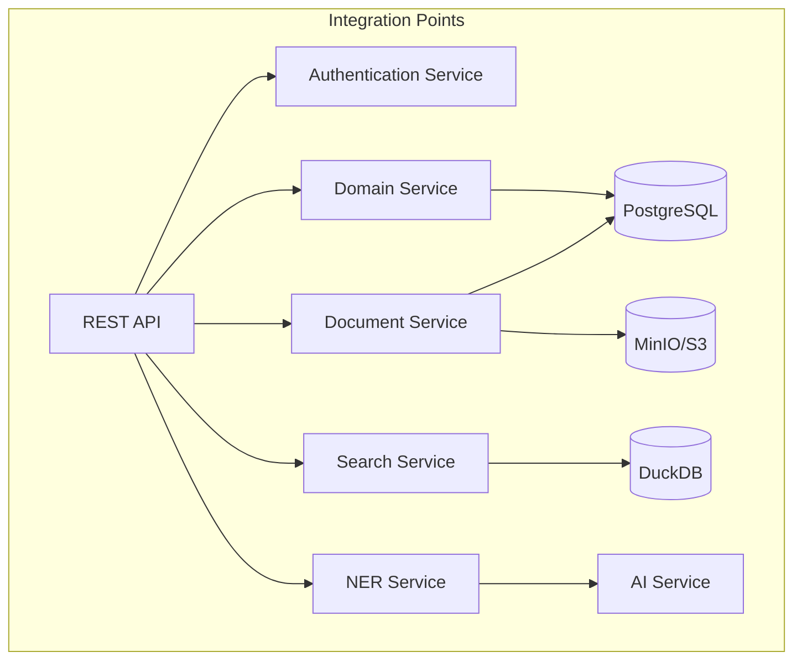
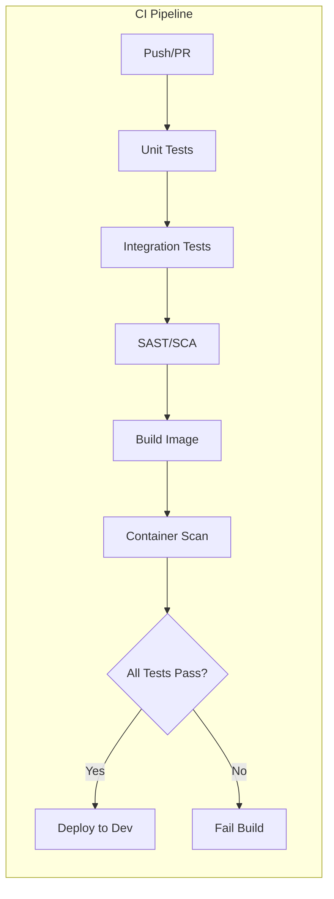
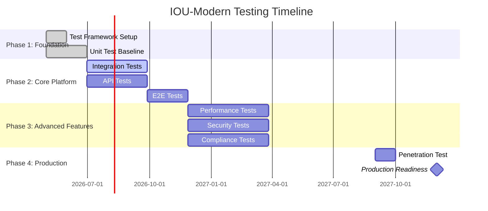

# Test Strategy: IOU-Modern

> **Template Origin**: Official | **ArcKit Version**: 4.3.1 | **Command**: Custom creation

## Document Control

| Field | Value |
|-------|-------|
| **Document ID** | ARC-001-TEST-v1.0 |
| **Document Type** | Test Strategy |
| **Project** | IOU-Modern (Project 001) |
| **Classification** | OFFICIAL |
| **Status** | DRAFT |
| **Version** | 1.0 |
| **Created Date** | 2026-04-20 |
| **Last Modified** | 2026-04-20 |
| **Review Cycle** | Per release |
| **Next Review Date** | On major release |
| **Owner** | QA Lead |
| **Reviewed By** | PENDING |
| **Approved By** | PENDING |

## Revision History

| Version | Date | Author | Changes | Approved By | Approval Date |
|---------|------|--------|---------|-------------|---------------|
| 1.0 | 2026-04-20 | ArcKit AI | Initial creation | PENDING | PENDING |

---

## Executive Summary

This document defines the comprehensive testing strategy for IOU-Modern, ensuring system quality, reliability, and compliance. The strategy covers the complete testing pyramid from unit tests to end-to-end testing, with specific focus on government compliance requirements (Woo, AVG, Archiefwet).

**Testing Philosophy**:
- **Shift Left**: Test early and often in the development cycle
- **Automation First**: Automate all repetitive tests
- **Compliance by Design**: Build compliance testing into the pipeline
- **Risk-Based**: Focus testing effort on high-risk areas

**Target Coverage**:
- Unit test coverage: >70%
- Integration test coverage: Critical paths 100%
- E2E test coverage: Critical user journeys 100%

---

## 1. Testing Overview

### 1.1 Testing Pyramid

```mermaid
pyramid
    title IOU-Modern Testing Pyramid
    section "E2E Tests"
        Critical User Journeys : 10%
    section "Integration Tests"
        API Tests : 30%
        Database Tests : 20%
    section "Unit Tests"
        Business Logic : 30%
        Data Models : 10%
```

### 1.2 Test Types

| Test Type | Purpose | Tools | Frequency |
|-----------|---------|-------|-----------|
| **Unit Tests** | Verify individual functions | Rust built-in | Every commit |
| **Integration Tests** | Verify component interactions | Rust integration tests | Every commit |
| **API Tests** | Verify REST endpoints | Postman, Rust tests | Every commit |
| **UI Tests** | Verify user interface | Browser tests | Daily |
| **E2E Tests** | Verify critical user journeys | Playwright | Daily |
| **Performance Tests** | Verify NFRs | k6, benchmark | Weekly |
| **Security Tests** | Find vulnerabilities | Trivy, ZAP | Weekly |
| **Compliance Tests** | Verify Woo/AVG compliance | Custom tests | Every commit |

---

## 2. Unit Testing Strategy

### 2.1 Unit Test Framework

**Rust Built-in Testing**: `cargo test`

```rust
#[cfg(test)]
mod tests {
    use super::*;
    
    #[test]
    fn test_domain_creation() {
        let domain = InformationDomain::new(
            DomainType::Zaak,
            "Test Domain".to_string()
        );
        assert_eq!(domain.domain_type, DomainType::Zaak);
        assert_eq!(domain.status, DomainStatus::Concept);
    }
    
    #[test]
    fn test_retention_period_calculation() {
        assert_eq!(
            RetentionPeriod::for_object_type(ObjectType::Besluit),
            RetentionPeriod::Years(20)
        );
    }
}
```

### 2.2 Unit Test Coverage

| Module | Target Coverage | Current | Notes |
|--------|----------------|---------|-------|
| `iou-core::domain` | >80% | TBD | Core business logic |
| `iou-core::objects` | >80% | TBD | Information objects |
| `iou-core::graphrag` | >70% | TBD | Knowledge graph |
| `iou-api::routes` | >70% | TBD | API handlers |
| `iou-ai::ner` | >70% | TBD | Entity extraction |
| `iou-compliance` | >90% | TBD | Compliance rules (critical) |

### 2.3 Unit Testing Best Practices

1. **Test Behavior, Not Implementation**: Focus on what the code does, not how
2. **Arrange-Act-Assert**: Structure tests clearly
3. **Descriptive Names**: Test names should describe the scenario
4. **Isolation**: Each test should be independent
5. **Fast Tests**: Unit tests should run in milliseconds

---

## 3. Integration Testing Strategy

### 3.1 Integration Test Scope

**Component Integration Points**:



| Integration Point | Test Coverage | Key Scenarios |
|-------------------|----------------|---------------|
| **API → PostgreSQL** | CRUD operations, transactions | Create, read, update, delete domains |
| **API → DuckDB** | Analytical queries | Search, aggregation |
| **API → S3** | Document storage | Upload, download, delete |
| **API → AI Service** | Entity extraction | NER accuracy, error handling |
| **API → Auth Service** | Authentication flow | Login, token refresh, logout |

### 3.2 Database Integration Tests

**Testcontainers** for PostgreSQL:

```rust
#[cfg(test)]
mod integration_tests {
    use sqlx::PgPool;
    use testcontainers::clients::Cli;
    
    async fn test_create_domain() {
        let docker = Cli::default();
        let pg_container = docker.run("postgres:15");
        let pool = PgPool::connect(&pg_container.connection_string()).await.unwrap();
        
        // Run migrations
        sqlx::migrate!("./migrations").run(&pool).await.unwrap();
        
        // Test domain creation
        let domain = create_domain(&pool, "Test Domain").await.unwrap();
        assert_eq!(domain.name, "Test Domain");
    }
}
```

### 3.3 API Integration Tests

**REST API Testing**:

| Endpoint | Test Scenarios | Success Criteria |
|----------|---------------|------------------|
| `POST /api/v1/domains` | Valid creation, duplicate, invalid data | 201, 409, 400 |
| `GET /api/v1/domains/:id` | Existing, non-existing | 200, 404 |
| `PUT /api/v1/domains/:id` | Valid update, unauthorized | 200, 401 |
| `DELETE /api/v1/domains/:id` | Existing with no children, with children | 204, 409 |
| `POST /api/v1/search` | Valid query, empty result | 200, 200 (empty array) |

---

## 4. End-to-End Testing Strategy

### 4.1 Critical User Journeys

**E2E Test Scenarios**:

| Journey | Description | Priority | Automation |
|---------|-------------|----------|------------|
| **Domain Creation Workflow** | User creates domain, assigns owner | HIGH | Automated |
| **Document Upload & Classification** | User uploads document, AI classifies | HIGH | Automated |
| **Woo Publication Workflow** | Document assessed, approved, published | CRITICAL | Automated |
| **Subject Access Request** | Citizen requests personal data | CRITICAL | Automated |
| **Cross-Domain Search** | User searches across multiple domains | MEDIUM | Automated |
| **Document Versioning** | User creates new version of document | MEDIUM | Manual |

### 4.2 E2E Test Framework

**Playwright** for browser automation:

```typescript
import { test, expect } from '@playwright/test';

test.describe('Woo Publication Workflow', () => {
  test('complete Woo publication flow', async ({ page }) => {
    // Login
    await page.goto('/login');
    await page.fill('[name=email]', 'woo-officer@example.nl');
    await page.fill('[name=password]', 'test-password');
    await page.click('[type=submit]');
    
    // Navigate to document
    await page.goto('/documents/doc-123');
    
    // Verify Woo assessment
    await expect(page.locator('.woo-status')).toContainText('Woo Relevant');
    
    // Approve for publication
    await page.click('[data-testid=approve-button]');
    await page.fill('[name=refusal-reason]', ''); // Clear reason
    await page.click('[data-testid=confirm-approval]');
    
    // Verify published status
    await expect(page.locator('.publication-status')).toContainText('Published');
  });
});
```

### 4.3 E2E Test Environment

| Environment | Purpose | Data | Access |
|-------------|---------|------|--------|
| **E2E Test** | Automated testing | Synthetic data | CI/CD only |
| **Staging** | Pre-production validation | Anonymized prod data | QA team |
| **Production** | Smoke tests only | Real data | Limited |

---

## 5. Performance Testing Strategy

### 5.1 Performance Requirements

| Requirement | Target | Measurement |
|-------------|--------|-------------|
| API response time | <500ms P95 | Application monitoring |
| Search response | <2s P95 | Application monitoring |
| Document ingestion | >1,000 docs/min | Throughput testing |
| Concurrent users | 1,000 | Load testing |
| Database query | <1s P95 | Database monitoring |

### 5.2 Load Testing

**k6** for load testing:

```javascript
import http from 'k6/http';
import { check, sleep } from 'k6';

export let options = {
  stages: [
    { duration: '2m', target: 100 },   // Ramp up to 100 users
    { duration: '5m', target: 100 },   // Stay at 100 users
    { duration: '2m', target: 500 },   // Ramp up to 500 users
    { duration: '5m', target: 500 },   // Stay at 500 users
    { duration: '2m', target: 0 },     // Ramp down
  ],
  thresholds: {
    http_req_duration: ['p(95)<500'],  // 95% of requests <500ms
    http_req_failed: ['rate<0.01'],     // Error rate <1%
  },
};

export default function() {
  let response = http.post('https://iou-test.example.nl/api/v1/search', {
    headers: { 'Content-Type': 'application/json' },
    body: JSON.stringify({ query: 'test query' }),
  });
  
  check(response, {
    'status is 200': (r) => r.status === 200,
    'response time <500ms': (r) => r.timings.duration < 500,
  });
  
  sleep(1);
}
```

### 5.3 Performance Testing Schedule

| Test Type | Frequency | Duration | Owner |
|-----------|-----------|----------|-------|
| **Load Test** | Weekly | 2 hours | Performance Engineer |
| **Stress Test** | Monthly | 4 hours | Performance Engineer |
| **Spike Test** | Quarterly | 1 hour | Performance Engineer |
| **Endurance Test** | Quarterly | 24 hours | Performance Engineer |

---

## 6. Security Testing Strategy

### 6.1 Security Test Types

| Test Type | Purpose | Tools | Frequency |
|-----------|---------|-------|-----------|
| **SAST** | Static code analysis | cargo-deny, cargo-audit | Every commit |
| **SCA** | Dependency vulnerability scan | cargo-audit | Daily |
| **Container Scan** | Image vulnerabilities | Trivy | Every build |
| **DAST** | Dynamic application security | OWASP ZAP | Weekly |
| **Penetration Test** | Manual security assessment | External firm | Annual |

### 6.2 Security Test Scenarios

| Scenario | Description | Test Method |
|----------|-------------|-------------|
| **Authentication bypass** | Attempt access without valid token | DAST, manual |
| **Authorization bypass** | Attempt access to other organizations' data | DAST, manual |
| **SQL injection** | Inject SQL via input fields | DAST, manual |
| **XSS** | Inject scripts via text fields | DAST, manual |
| **PII leakage** | Check if PII exposed in logs/errors | Manual review |
| **Woo publication bypass** | Attempt publication without approval | Manual, automated |

### 6.3 Compliance Testing

**Woo Compliance Tests**:

| Test | Description | Assertion |
|------|-------------|-----------|
| All Woo-relevant documents require human approval | Verify workflow | approval_required WHERE is_woo_relevant |
| Non-openbaar documents not published | Verify publication filter | NOT published WHERE classification != 'Openbaar' |
| Publication audit trail | Verify logging | AuditTrail record exists |

**AVG Compliance Tests**:

| Test | Description | Assertion |
|------|-------------|-----------|
| PII access logged | Verify logging | AuditTrail record WHERE pii_accessed |
| Retention periods enforced | Verify deletion logic | deletion_job deletes after retention |
| SAR endpoint functional | Verify SAR response | Returns all personal data within 30 days |

---

## 7. Test Data Management

### 7.1 Test Data Strategy

| Environment | Data Source | Refresh Frequency |
|-------------|-------------|-------------------|
| **Unit Tests** | Mock data | N/A (in-memory) |
| **Integration Tests** | Synthetic data | Per test run |
| **E2E Tests** | Synthetic data | Weekly |
| **Performance Tests** | Anonymized prod data | Monthly |
| **Staging** | Anonymized prod data | Weekly |

### 7.2 Data Anonymization

**PII Anonymization Rules**:
- Email: `user{n}@example.test`
- Names: `Test User {n}`
- Addresses: `Test Straat {n}, 1234 AB Teststad`
- Phone numbers: `06-1234567{n}`
- Dates: Shifted by consistent offset

### 7.3 Test Data Generation

**Factory Pattern** for test data:

```rust
#[cfg(test)]
mod factories {
    use super::*;
    use fake::{Fake, Faker};
    
    pub struct DomainFactory {
        name: String,
        domain_type: DomainType,
        organization_id: Uuid,
    }
    
    impl Default for DomainFactory {
        fn default() -> Self {
            Self {
                name: format!("Test Domain {}", Faker.fake::<String>()),
                domain_type: DomainType::Zaak,
                organization_id: Uuid::new_v4(),
            }
        }
    }
    
    impl DomainFactory {
        pub fn create(self) -> InformationDomain {
            InformationDomain::new(self.domain_type, self.name)
                .with_organization(self.organization_id)
        }
    }
}
```

---

## 8. Test Automation & CI/CD

### 8.1 CI Pipeline Integration

**Test Stages in CI Pipeline**:



### 8.2 Quality Gates

| Gate | Criteria | Enforcement |
|------|----------|-------------|
| **Unit Tests** | 100% pass, >70% coverage | Block commit |
| **Integration Tests** | 100% pass | Block commit |
| **Security Scan** | 0 Critical/High | Block commit |
| **Performance Tests** | Meets NFRs | Block release |

### 8.3 Test Reporting

**Metrics to Track**:
- Test execution time
- Test pass rate
- Code coverage trend
- Flaky test rate
- Test maintenance ratio

---

## 9. Test Environment Strategy

### 9.1 Environment Parity

| Aspect | Dev | Test | Staging | Production |
|--------|-----|------|---------|------------|
| **Infrastructure** | Local | AKS dev | AKS staging | AKS prod |
| **Data** | Mock | Synthetic | Anonymized prod | Real |
| **Configuration** | Local env | Dev config | Staging config | Prod config |
| **Scale** | Single node | Single node | 2 nodes | 4+ nodes |

### 9.2 Environment Management

**Test Environment Provisioning**:
- Automatic provisioning via Terraform
- Data seeding via scripts
- Configuration via environment variables
- Isolated namespaces in Kubernetes

---

## 10. Testing Timeline

### 10.1 Testing Roadmap



### 10.2 Testing Milestones

| Milestone | Date | Criteria |
|-----------|------|----------|
| **Test Framework Operational** | 2026-06-01 | CI pipeline running tests |
| **70% Unit Test Coverage** | 2026-07-01 | Coverage report |
| **Integration Tests Operational** | 2026-10-01 | All critical paths tested |
| **E2E Tests Operational** | 2026-12-01 | All critical journeys tested |
| **Performance Tests Passing** | 2027-04-01 | All NFRs met |
| **Penetration Test Complete** | 2027-10-01 | 0 Critical/High findings |

---

## 11. Test Deliverables

### 11.1 Test Artifacts

| Artifact | Description | Location |
|----------|-------------|----------|
| **Test Plan** | Detailed test scenarios | `tests/test-plan.md` |
| **Test Cases** | Individual test specifications | `tests/test-cases/` |
| **Test Data** | Synthetic data generators | `tests/data/` |
| **Test Scripts** | Automated test scripts | `tests/scripts/` |
| **Test Reports** | Execution results | `tests/reports/` |
| **Coverage Reports** | Code coverage analysis | `target/coverage/` |

### 11.2 Test Documentation

**Required Documentation**:
- Test Strategy (this document)
- Test Plan (detailed scenarios)
- Test Runbooks (execution procedures)
- Test Reports (execution results)
- Defect Reports (found issues)

---

## 12. Roles & Responsibilities

| Role | Responsibilities |
|------|----------------|
| **QA Lead** | Test strategy, test planning, oversight |
| **Test Engineer** | Test automation, test execution |
| **Developer** | Unit tests, integration tests |
| **Performance Engineer** | Performance testing, optimization |
| **Security Engineer** | Security testing, vulnerability assessment |
| **Business Analyst** | UAT coordination, test scenario definition |

---

## 13. Test Metrics & Reporting

### 13.1 Key Metrics

| Metric | Target | Measurement |
|--------|--------|-------------|
| **Unit Test Coverage** | >70% | cargo-tarpaulin |
| **Test Pass Rate** | >95% | CI results |
| **Flaky Test Rate** | <5% | CI results |
| **Test Execution Time** | <30 min | CI duration |
| **Defect Detection Rate** | >80% pre-prod | Bug tracking |

### 13.2 Reporting

**Weekly Test Report**:
- Test execution summary
- Coverage trends
- Failed test analysis
- Blockers and risks

**Monthly Test Report**:
- Test metrics dashboard
- Quality trend analysis
- Test debt assessment
- Improvement recommendations

---

## Related Documents

| Document | ID | Purpose |
|----------|-----|---------|
| Requirements | ARC-001-REQ-v1.1.md | Test requirements basis |
| High-Level Design | ARC-001-HLD-v1.0.md | Test design basis |
| DevOps Strategy | ARC-001-DEVOPS-v1.0.md | CI/CD integration |
| Risk Register | ARC-001-RISK-v1.0.md | Risk-based testing |

---

## Appendices

### Appendix A: Test Scenario Examples

#### Scenario: Domain Creation

**Given**: A logged-in user with DomainAdmin role
**When**: User creates a new Zaak domain
**Then**: Domain is created with status "Concept"
**And**: User is assigned as domain owner
**And**: Audit trail entry is created

#### Scenario: Woo Publication

**Given**: A document marked as Woo-relevant with classification "Openbaar"
**And**: Document has compliance score >0.8
**When**: Domain Owner approves document for publication
**Then**: Document is published to Woo portal
**And**: Publication date is recorded
**And**: Audit trail entry is created

### Appendix B: Test Tools

| Category | Tool | Purpose |
|----------|------|---------|
| **Unit Testing** | cargo test | Rust built-in testing |
| **Coverage** | cargo-tarpaulin | Code coverage analysis |
| **API Testing** | Postman, reqwest | REST API testing |
| **E2E Testing** | Playwright | Browser automation |
| **Load Testing** | k6 | Performance testing |
| **Security Testing** | Trivy, OWASP ZAP | Vulnerability scanning |
| **Mocking** | mockito | Test doubles |

---

**END OF TEST STRATEGY**

## Generation Metadata

**Generated by**: ArcKit AI (Claude Opus 4.7)
**Generated on**: 2026-04-20
**ArcKit Version**: 4.3.1
**Project**: IOU-Modern (Project 001)
