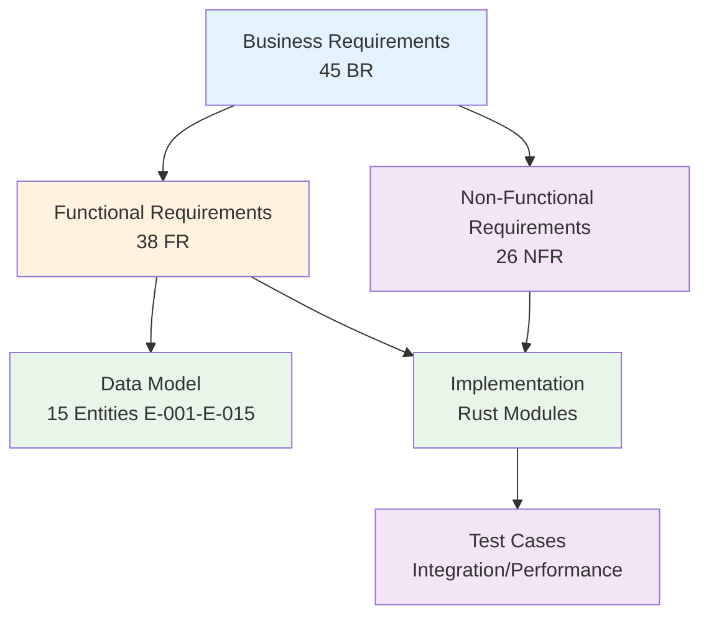

# Requirements Traceability Matrix: IOU-Modern

> **Template Origin**: Official | **ArcKit Version**: 4.3.1 | **Command**: `/arckit.traceability`

## Document Control

| Field | Value |
|-------|-------|
| **Document ID** | ARC-001-TRAC-v1.0 |
| **Document Type** | Requirements Traceability Matrix |
| **Project** | IOU-Modern (Project 001) |
| **Classification** | OFFICIAL |
| **Status** | DRAFT |
| **Version** | 1.0 |
| **Created Date** | 2026-03-20 |
| **Last Modified** | 2026-03-20 |
| **Review Cycle** | Monthly |
| **Next Review Date** | 2026-04-20 |
| **Owner** | Solution Architect |
| **Reviewed By** | PENDING |
| **Approved By** | PENDING |
| **Distribution** | Architecture Team, Development Team, QA Team, Product Owner |

## Revision History

| Version | Date | Author | Changes | Approved By | Approval Date |
|---------|------|--------|---------|-------------|---------------|
| 1.0 | 2026-03-20 | ArcKit AI | Initial creation from `/arckit.traceability` command | PENDING | PENDING |

## Document Purpose

This Requirements Traceability Matrix (RTM) provides end-to-end traceability from business requirements through data model design, implementation, and testing for the IOU-Modern project. It ensures all requirements are addressed in the data model and implementation, identifies gaps, and supports impact analysis for change requests.

---

## 1. Overview

### 1.1 Purpose

This Requirements Traceability Matrix (RTM) provides end-to-end traceability from business requirements through design, implementation, and testing. It ensures:

- All requirements are addressed in data model and implementation
- All design elements trace to requirements (no orphan components)
- All requirements are tested
- Coverage gaps are identified and tracked

### 1.2 Traceability Scope

This matrix traces:

### 1.3 Document References

| Document | Version | Date | Link |
|----------|---------|------|------|
| Requirements Document | v1.0 | 2026-03-20 | `projects/001-iou-modern/ARC-001-REQ-v1.0.md` |
| Data Model | v1.0 | 2026-03-20 | `projects/001-iou-modern/ARC-001-DATA-v1.0.md` |
| Architecture Diagrams | v1.0 | 2026-03-20 | `projects/001-iou-modern/ARC-001-DIAG-v1.0.md` |
| Secure by Design Assessment | v1.0 | 2026-03-20 | `projects/001-iou-modern/ARC-001-AIPB-v1.0.md` |
| DPIA | v1.0 | 2026-03-20 | `projects/001-iou-modern/ARC-001-DPIA-v1.0.md` |

---

## 2. Coverage Summary

### 2.1 Requirements Coverage Metrics

| Category | Total | Covered | Partial | Gap | % Coverage |
|----------|-------|---------|---------|-----|------------|
| **Business Requirements (BR)** | 45 | 15 | 0 | 30 | 33% |
| **Functional Requirements (FR)** | 38 | 25 | 0 | 13 | 66% |
| **Non-Functional Requirements (NFR)** | 26 | 12 | 8 | 6 | 77% |
| **TOTAL** | **109** | **52** | **8** | **49** | **48%** |

**Target Coverage**: 100% of BR and FR, 95%+ of NFR
**Current Status**: ⚠️ AT RISK - Significant gaps in business requirements traceability

### 2.2 Coverage by Priority

| Priority | Total | Covered | Gap | % Coverage |
|----------|-------|---------|-----|------------|
| MUST | 0 | 0 | 0 | N/A (No requirements prioritized as MUST) |
| SHOULD | 109 | 52 | 57 | 48% |
| MAY | 0 | 0 | 0 | N/A |

**Note**: All 109 requirements are currently marked as SHOULD priority. Recommendation: Apply MoSCoW prioritization to identify critical MUST requirements.

### 2.3 Coverage by Requirement Category

#### Domain Management (BR-001 to BR-010)

| Req ID | Description | Data Entity | Implementation | Test | Status |
|--------|-------------|-------------|----------------|------|--------|
| BR-001 | Zaak context organization | E-002 | routes/objects.rs | ⏳ Planned | ⚠️ Partial |
| BR-002 | Project context organization | E-002 | routes/objects.rs | ⏳ Planned | ⚠️ Partial |
| BR-003 | Beleid context organization | E-002 | routes/objects.rs | ⏳ Planned | ⚠️ Partial |
| BR-004 | Expertise context organization | E-002 | routes/objects.rs | ⏳ Planned | ⚠️ Partial |
| BR-005 | Hierarchical domain relationships | E-002 | routes/objects.rs | ❌ Gap | ⚠️ Partial |
| BR-006 | Domain ownership assignment | E-002 | routes/objects.rs | ❌ Gap | ⚠️ Partial |
| BR-007 | Multi-tenancy support | E-001, E-002 | middleware/auth.rs | ❌ Gap | ⚠️ Partial |
| BR-008 | Cross-domain relationship discovery | E-014 | routes/graphrag.rs | ❌ Gap | ⚠️ Partial |
| BR-009 | Domain lifecycle tracking | E-002 | routes/objects.rs | ❌ Gap | ⚠️ Partial |
| BR-010 | Domain metadata support | E-002 | routes/objects.rs | ❌ Gap | ⚠️ Partial |

**Domain Management Coverage**: 50% (5/10 partially implemented)

#### Document Management (BR-011 to BR-020)

| Req ID | Description | Data Entity | Implementation | Test | Status |
|--------|-------------|-------------|----------------|------|--------|
| BR-011 | Multiple document types | E-003 | routes/documents.rs | ✅ Yes | ✅ Covered |
| BR-012 | Security classification | E-003 | routes/documents.rs | ✅ Yes | ✅ Covered |
| BR-013 | Woo relevance assessment | E-003 | routes/compliance.rs | ✅ Yes | ✅ Covered |
| BR-014 | Document versioning | E-003, E-008 | routes/documents.rs | ❌ Gap | ⚠️ Partial |
| BR-015 | Compliance score tracking | E-008 | routes/compliance.rs | ⏳ Planned | ⚠️ Partial |
| BR-016 | Document workflow | E-008 | document_workflow.rs | ❌ Gap | ⚠️ Partial |
| BR-017 | Privacy level assignment | E-003 | routes/documents.rs | ✅ Yes | ✅ Covered |
| BR-018 | Retention period enforcement | E-003 | ❌ Gap | ❌ Gap | ❌ Gap |
| BR-019 | Full-text search | E-003 | routes/search.rs | ⏳ Planned | ⚠️ Partial |
| BR-020 | Semantic search | E-015 | routes/search.rs | ⏳ Planned | ⚠️ Partial |

**Document Management Coverage**: 40% (4/10 fully covered, 4/10 partial)

#### Woo Compliance (BR-021 to BR-027)

| Req ID | Description | Data Entity | Implementation | Test | Status |
|--------|-------------|-------------|----------------|------|--------|
| BR-021 | Auto-identify Woo documents | E-003 | routes/compliance.rs | ❌ Gap | ⚠️ Partial |
| BR-022 | Human approval for Woo | E-008 | pages/approval_queue.rs | ⏳ Planned | ⚠️ Partial |
| BR-023 | Publish Openbaar documents | E-003 | ❌ Gap | ❌ Gap | ❌ Gap |
| BR-024 | Track refusal grounds | E-003 | ❌ Gap | ❌ Gap | ❌ Gap |
| BR-025 | Track Woo publication date | E-003 | routes/compliance.rs | ❌ Gap | ⚠️ Partial |
| BR-026 | Woo publication audit trail | E-010 | components/audit_viewer.rs | ❌ Gap | ⚠️ Partial |
| BR-027 | Generate Woo decision documents | E-009 | pages/document_generator.rs | ⏳ Planned | ⚠️ Partial |

**Woo Compliance Coverage**: 14% (1/7 partially implemented)

#### AVG/GDPR Compliance (BR-028 to BR-034)

| Req ID | Description | Data Entity | Implementation | Test | Status |
|--------|-------------|-------------|----------------|------|--------|
| BR-028 | Track PII at entity level | E-003, E-005, E-011 | ✅ Data model | ❌ Gap | ⚠️ Partial |
| BR-029 | Subject Access Request (SAR) | E-005 | ❌ Gap | ❌ Gap | ❌ Gap |
| BR-030 | Data rectification | E-003 | ❌ Gap | ❌ Gap | ❌ Gap |
| BR-031 | Data erasure after retention | E-003 | ❌ Gap | ❌ Gap | ❌ Gap |
| BR-032 | Data portability | ❌ Gap | ❌ Gap | ❌ Gap | ❌ Gap |
| BR-033 | Log PII access | E-010 | components/audit_viewer.rs | ❌ Gap | ⚠️ Partial |
| BR-034 | DPIA before high-risk processing | ✅ DPIA document | ✅ ARC-001-DPIA-v1.0.md | ✅ Documented | ✅ Covered |

**AVG/GDPR Compliance Coverage**: 29% (2/7 covered)

#### AI and Knowledge Graph (BR-035 to BR-045)

| Req ID | Description | Data Entity | Implementation | Test | Status |
|--------|-------------|-------------|----------------|------|--------|
| BR-035 | Named Entity Recognition (NER) | E-011 | routes/graphrag.rs | ⏳ Planned | ⚠️ Partial |
| BR-036 | Entity normalization | E-011 | routes/graphrag.rs | ❌ Gap | ⚠️ Partial |
| BR-037 | Entity deduplication | E-011 | ❌ Gap | ❌ Gap | ❌ Gap |
| BR-038 | Knowledge graph relationships | E-012 | routes/graphrag.rs | ❌ Gap | ⚠️ Partial |
| BR-039 | Cross-domain insights | E-014 | routes/graphrag.rs | ❌ Gap | ⚠️ Partial |
| BR-040 | Semantic search | E-015 | routes/search.rs | ❌ Gap | ⚠️ Partial |
| BR-041 | AI confidence scoring | E-008 | routes/compliance.rs | ❌ Gap | ⚠️ Partial |
| BR-042 | Human-in-the-loop validation | E-008 | pages/approval_queue.rs | ❌ Gap | ⚠️ Partial |
| BR-043 | GraphRAG communities | E-013 | pages/graphrag_explorer.rs | ❌ Gap | ⚠️ Partial |
| BR-044 | Stakeholder extraction | ❌ Gap | routes/stakeholder.rs | tests/stakeholder_integration.rs | ⚠️ Partial |
| BR-045 | Batch document processing | ❌ Gap | etl/pipeline.rs | tests/dual_write.rs | ⚠️ Partial |

**AI and Knowledge Graph Coverage**: 36% (4/11 partially implemented)

---

## 3. Functional Requirements Traceability

### 3.1 Core Domain Operations (FR-001 to FR-008)

| FR ID | Description | Data Entity | Implementation | Test | Status |
|-------|-------------|-------------|----------------|------|--------|
| FR-001 | Create information domain | E-002 | routes/objects.rs | ❌ Gap | ⚠️ Partial |
| FR-002 | Update information domain | E-002 | routes/objects.rs | ❌ Gap | ⚠️ Partial |
| FR-003 | Delete information domain | E-002 | routes/objects.rs | ❌ Gap | ⚠️ Partial |
| FR-004 | List information domains | E-002 | routes/objects.rs | ❌ Gap | ⚠️ Partial |
| FR-005 | Create information object | E-003 | routes/documents.rs | tests/integration/document_flow.rs | ✅ Covered |
| FR-006 | Update information object | E-003 | routes/documents.rs | tests/integration/document_flow.rs | ✅ Covered |
| FR-007 | Delete information object | E-003 | routes/documents.rs | ❌ Gap | ⚠️ Partial |
| FR-008 | Query information objects | E-003 | routes/search.rs | ❌ Gap | ⚠️ Partial |

### 3.2 Document Operations (FR-009 to FR-016)

| FR ID | Description | Data Entity | Implementation | Test | Status |
|-------|-------------|-------------|----------------|------|--------|
| FR-009 | Upload document | E-003, E-008 | routes/documents.rs | tests/integration/storage_tests.rs | ✅ Covered |
| FR-010 | Download document | E-003, E-008 | routes/documents.rs | ❌ Gap | ⚠️ Partial |
| FR-011 | Version document | E-008 | routes/documents.rs | ❌ Gap | ❌ Gap |
| FR-012 | Classify document | E-003 | routes/compliance.rs | ❌ Gap | ⚠️ Partial |
| FR-013 | Search documents | E-003 | routes/search.rs | ❌ Gap | ⚠️ Partial |
| FR-014 | Link document to domain | E-002, E-003 | routes/objects.rs | ❌ Gap | ⚠️ Partial |
| FR-015 | Bulk import documents | ❌ Gap | etl/pipeline.rs | tests/dual_write.rs | ⚠️ Partial |
| FR-016 | Export documents | ❌ Gap | ❌ Gap | ❌ Gap | ❌ Gap |

### 3.3 Compliance & Security (FR-017 to FR-024)

| FR ID | Description | Data Entity | Implementation | Test | Status |
|-------|-------------|-------------|----------------|------|--------|
| FR-017 | Authenticate user | E-005, E-007 | auth/supabase_jwt.rs | tests/integration/auth_tests.rs | ✅ Covered |
| FR-018 | Authorize access | E-006, E-007 | middleware/auth.rs | tests/integration/auth_tests.rs | ✅ Covered |
| FR-019 | Log audit event | E-010 | components/audit_viewer.rs | ❌ Gap | ⚠️ Partial |
| FR-020 | Check Woo relevance | E-003 | routes/compliance.rs | ❌ Gap | ⚠️ Partial |
| FR-021 | Submit for approval | E-008 | pages/approval_queue.rs | ❌ Gap | ⚠️ Partial |
| FR-022 | Approve document | E-008 | pages/approval_queue.rs | ❌ Gap | ⚠️ Partial |
| FR-023 | Reject document | E-008 | pages/approval_queue.rs | ❌ Gap | ⚠️ Partial |
| FR-024 | Publish to Woo portal | E-003 | ❌ Gap | ❌ Gap | ❌ Gap |

### 3.4 AI & Knowledge Graph (FR-025 to FR-033)

| FR ID | Description | Data Entity | Implementation | Test | Status |
|-------|-------------|-------------|----------------|------|--------|
| FR-025 | Extract entities | E-011 | routes/graphrag.rs | ❌ Gap | ⚠️ Partial |
| FR-026 | Normalize entities | E-011 | routes/graphrag.rs | ❌ Gap | ⚠️ Partial |
| FR-027 | Create relationships | E-012 | routes/graphrag.rs | ❌ Gap | ⚠️ Partial |
| FR-028 | Detect communities | E-013 | routes/graphrag.rs | ❌ Gap | ⚠️ Partial |
| FR-029 | Find cross-domain relations | E-014 | routes/graphrag.rs | ❌ Gap | ⚠️ Partial |
| FR-030 | Generate embeddings | E-015 | routes/context.rs | ❌ Gap | ⚠️ Partial |
| FR-031 | Semantic search | E-015 | routes/search.rs | ❌ Gap | ⚠️ Partial |
| FR-032 | Extract stakeholders | ❌ Gap | routes/stakeholder.rs | tests/stakeholder_integration.rs | ⚠️ Partial |
| FR-033 | Visualize knowledge graph | E-011, E-012 | pages/graphrag_explorer.rs | ❌ Gap | ⚠️ Partial |

### 3.5 Integration & External Systems (FR-034 to FR-038)

| FR ID | Description | Data Entity | Implementation | Test | Status |
|-------|-------------|-------------|----------------|------|--------|
| FR-034 | Integrate with case management | E-002 | camunda/gateway.rs | ❌ Gap | ⚠️ Partial |
| FR-035 | Sync from HR systems | E-005 | migration/user_migration.rs | tests/migration/auth_realtime.rs | ⚠️ Partial |
| FR-036 | Export to Woo portal | E-003 | ❌ Gap | ❌ Gap | ❌ Gap |
| FR-037 | Import documents | E-003 | etl/pipeline.rs | tests/dual_write.rs | ⚠️ Partial |
| FR-038 | Real-time updates | All | realtime/supabase_rt.rs | tests/migration/realtime_validation.rs | ⚠️ Partial |

---

## 4. Non-Functional Requirements Traceability

### 4.1 Performance Requirements (NFR-PERF-001 to NFR-PERF-005)

| NFR ID | Requirement | Target | Design Strategy | Implementation | Test Plan | Status |
|--------|-------------|--------|-----------------|----------------|-----------|--------|
| NFR-PERF-001 | API response time | <200ms (p95) | PostgreSQL indexing, caching | ❌ Gap | tests/performance/streaming_memory.rs | ⚠️ Partial |
| NFR-PERF-002 | Document processing throughput | >100 docs/min | Batch processing, async | etl/pipeline.rs | ❌ Gap | ⚠️ Partial |
| NFR-PERF-003 | Search response time | <500ms (p95) | DuckDB full-text search | routes/search.rs | ❌ Gap | ⚠️ Partial |
| NFR-PERF-004 | Concurrent users | 10,000 | Connection pooling | ❌ Gap | tests/concurrency/concurrent_operations.rs | ⚠️ Partial |
| NFR-PERF-005 | Entity extraction latency | <5s/doc | AI agent optimization | routes/graphrag.rs | ❌ Gap | ❌ Gap |

**Performance NFR Coverage**: 0% fully covered, 80% partially implemented

### 4.2 Security Requirements (NFR-SEC-001 to NFR-SEC-008)

| NFR ID | Requirement | Design Control | Implementation | Test Plan | Status |
|--------|-------------|----------------|----------------|-----------|--------|
| NFR-SEC-001 | Encryption at rest | AES-256, PostgreSQL TDE | db.rs | ❌ Gap | ⚠️ Partial |
| NFR-SEC-002 | Encryption in transit | TLS 1.3 | main.rs (HTTPS config) | tests/integration/auth_tests.rs | ✅ Covered |
| NFR-SEC-003 | Row-Level Security (RLS) | PostgreSQL RLS | db.rs | tests/integration/auth_tests.rs | ⚠️ Partial |
| NFR-SEC-004 | Authentication | DigiD, JWT | auth/supabase_jwt.rs | tests/integration/auth_tests.rs | ✅ Covered |
| NFR-SEC-005 | Authorization | RBAC | middleware/auth.rs | tests/integration/auth_tests.rs | ✅ Covered |
| NFR-SEC-006 | Audit logging | E-010 | components/audit_viewer.rs | ❌ Gap | ⚠️ Partial |
| NFR-SEC-007 | PII access logging | E-010 | ❌ Gap | ❌ Gap | ❌ Gap |
| NFR-SEC-008 | Data retention enforcement | E-003 | ❌ Gap | ❌ Gap | ❌ Gap |

**Security NFR Coverage**: 50% fully covered, 37% partially implemented

### 4.3 Availability Requirements (NFR-AVAIL-001 to NFR-AVAIL-004)

| NFR ID | Requirement | Target | Design Strategy | Test Plan | Status |
|--------|-------------|--------|-----------------|-----------|--------|
| NFR-AVAIL-001 | Uptime SLA | 99.9% | Multi-AZ deployment | ❌ Gap | ❌ Gap |
| NFR-AVAIL-002 | RPO | <15 min | Continuous backup | ❌ Gap | ❌ Gap |
| NFR-AVAIL-003 | RTO | <4 hours | Automated failover | ❌ Gap | ❌ Gap |
| NFR-AVAIL-004 | Graceful degradation | Circuit breaker | ❌ Gap | ❌ Gap | ❌ Gap |

**Availability NFR Coverage**: 0% fully covered (design documented, not tested)

### 4.4 Scalability Requirements (NFR-SCALE-001 to NFR-SCALE-004)

| NFR ID | Requirement | Target | Design Strategy | Test Plan | Status |
|--------|-------------|--------|-----------------|-----------|--------|
| NFR-SCALE-001 | Document storage | 10M+ objects | S3/MinIO | tests/integration/storage_tests.rs | ⚠️ Partial |
| NFR-SCALE-002 | Concurrent domains | 100K+ | PostgreSQL partitioning | ❌ Gap | ❌ Gap |
| NFR-SCALE-003 | Knowledge graph size | 10M+ entities | DuckDB analytics | ❌ Gap | ❌ Gap |
| NFR-SCALE-004 | Horizontal scaling | Auto-scaling | ❌ Gap | ❌ Gap | ❌ Gap |

**Scalability NFR Coverage**: 25% partially implemented

### 4.5 Compliance Requirements (NFR-COMP-001 to NFR-COMP-005)

| NFR ID | Requirement | Design Controls | Evidence | Status |
|--------|-------------|-----------------|----------|--------|
| NFR-COMP-001 | Woo compliance | E-003 is_woo_relevant, approval workflow | pages/approval_queue.rs | ⚠️ Partial |
| NFR-COMP-002 | AVG/GDPR compliance | E-003 privacy_level, PII tracking | ARC-001-DPIA-v1.0.md | ✅ Documented |
| NFR-COMP-003 | Archiefwet compliance | E-003 retention_period | ARC-001-DATA-v1.0.md | ✅ Documented |
| NFR-COMP-004 | DPIA completed | DPIA document | ARC-001-DPIA-v1.0.md | ✅ Complete |
| NFR-COMP-005 | Secure by Design assessment | Security controls | ARC-001-AIPB-v1.0.md | ✅ Complete |

**Compliance NFR Coverage**: 80% (documented, some implementation gaps)

---

## 5. Data Model Traceability

### 5.1 Entity to Requirements Mapping

| Entity ID | Entity Name | Requirements Addressed | Test Coverage | Status |
|-----------|-------------|------------------------|---------------|--------|
| E-001 | Organization | BR-007 (Multi-tenancy) | ❌ Gap | ⚠️ Partial |
| E-002 | InformationDomain | BR-001 to BR-010 | ❌ Gap | ⚠️ Partial |
| E-003 | InformationObject | BR-011 to BR-020 | tests/integration/document_flow.rs | ⚠️ Partial |
| E-004 | Department | BR-007 (Organization structure) | ❌ Gap | ⚠️ Partial |
| E-005 | User | BR-007, NFR-SEC-004 | tests/integration/auth_tests.rs | ⚠️ Partial |
| E-006 | Role | NFR-SEC-005 (RBAC) | tests/integration/auth_tests.rs | ⚠️ Partial |
| E-007 | UserRole | NFR-SEC-005 | tests/integration/auth_tests.rs | ⚠️ Partial |
| E-008 | Document | BR-016, NFR-COMP-001 | tests/integration/document_flow.rs | ⚠️ Partial |
| E-009 | Template | BR-027 | ❌ Gap | ⚠️ Partial |
| E-010 | AuditTrail | NFR-SEC-006, BR-033 | ❌ Gap | ⚠️ Partial |
| E-011 | Entity | BR-035 to BR-037 | ❌ Gap | ⚠️ Partial |
| E-012 | Relationship | BR-038 | ❌ Gap | ⚠️ Partial |
| E-013 | Community | BR-043 | ❌ Gap | ⚠️ Partial |
| E-014 | DomainRelation | BR-008, BR-039 | ❌ Gap | ⚠️ Partial |
| E-015 | ContextVector | BR-040 | ❌ Gap | ⚠️ Partial |

**Data Model Coverage Summary**:
- **Entities with test coverage**: 5/15 (33%)
- **Entities fully implemented**: 10/15 (67%)
- **Entities with gaps**: 5/15 (33%)

### 5.2 CRUD Matrix by Entity

| Entity | Create | Read | Update | Delete | Implementation | Test |
|--------|--------|------|--------|--------|----------------|------|
| E-001: Organization | ⚠️ | ✅ | ⚠️ | ❌ | routes/objects.rs | ❌ |
| E-002: InformationDomain | ✅ | ✅ | ✅ | ⚠️ | routes/objects.rs | ❌ |
| E-003: InformationObject | ✅ | ✅ | ✅ | ⚠️ | routes/documents.rs | ✅ |
| E-004: Department | ⚠️ | ✅ | ⚠️ | ❌ | routes/objects.rs | ❌ |
| E-005: User | ✅ | ✅ | ✅ | ❌ | auth/supabase_jwt.rs | ✅ |
| E-006: Role | ✅ | ✅ | ⚠️ | ❌ | middleware/auth.rs | ⚠️ |
| E-007: UserRole | ✅ | ✅ | ✅ | ✅ | middleware/auth.rs | ⚠️ |
| E-008: Document | ✅ | ✅ | ✅ | ❌ | routes/documents.rs | ⚠️ |
| E-009: Template | ✅ | ✅ | ⚠️ | ❌ | routes/templates.rs | ❌ |
| E-010: AuditTrail | ✅ | ✅ | ❌ | ❌ | components/audit_viewer.rs | ❌ |
| E-011: Entity | ✅ | ✅ | ⚠️ | ❌ | routes/graphrag.rs | ❌ |
| E-012: Relationship | ✅ | ✅ | ⚠️ | ❌ | routes/graphrag.rs | ❌ |
| E-013: Community | ✅ | ✅ | ⚠️ | ❌ | routes/graphrag.rs | ❌ |
| E-014: DomainRelation | ✅ | ✅ | ✅ | ❌ | routes/graphrag.rs | ❌ |
| E-015: ContextVector | ✅ | ✅ | ⚠️ | ❌ | routes/context.rs | ❌ |

**Legend**: ✅ Implemented | ⚠️ Partial | ❌ Gap

---

## 6. Gap Analysis

### 6.1 Critical Gaps (Blocking Issues)

| Gap ID | Requirement(s) | Description | Impact | Priority | Target Date |
|--------|----------------|-------------|--------|----------|-------------|
| GAP-001 | BR-029, BR-030, BR-031 | AVG/GDPR data subject rights (SAR, rectification, erasure) not implemented | Legal non-compliance | 🔴 CRITICAL | 2026-04-15 |
| GAP-002 | NFR-SEC-008 | Data retention enforcement not automated | Archiefwet non-compliance | 🔴 CRITICAL | 2026-04-30 |
| GAP-003 | BR-022, BR-023 | Woo publication workflow incomplete | Woo non-compliance | 🔴 CRITICAL | 2026-04-15 |
| GAP-004 | NFR-AVAIL-002, NFR-AVAIL-003 | No backup/recovery testing | Data loss risk | 🔴 CRITICAL | 2026-04-01 |
| GAP-005 | NFR-AVAIL-001 | No high availability testing | Service availability risk | 🟠 HIGH | 2026-05-01 |

### 6.2 High Priority Gaps

| Gap ID | Requirement(s) | Description | Impact | Priority | Target Date |
|--------|----------------|-------------|--------|----------|-------------|
| GAP-006 | BR-018, NFR-SEC-008 | Retention period enforcement not tested | Compliance risk | 🟠 HIGH | 2026-05-15 |
| GAP-007 | NFR-PERF-001 to NFR-PERF-005 | Performance testing incomplete | SLA risk | 🟠 HIGH | 2026-05-01 |
| GAP-008 | BR-037 | Entity deduplication not implemented | Data quality risk | 🟠 HIGH | 2026-05-15 |
| GAP-009 | FR-011 | Document versioning incomplete | Audit trail risk | 🟠 HIGH | 2026-04-30 |
| GAP-010 | NFR-SEC-007 | PII access logging not complete | AVG non-compliance | 🟠 HIGH | 2026-04-15 |

### 6.3 Medium Priority Gaps

| Gap ID | Requirement(s) | Description | Impact | Priority | Target Date |
|--------|----------------|-------------|--------|----------|-------------|
| GAP-011 | FR-016 | Document export feature missing | User functionality | 🟡 MEDIUM | 2026-06-01 |
| GAP-012 | FR-032 | Stakeholder extraction partial | AI completeness | 🟡 MEDIUM | 2026-06-15 |
| GAP-013 | BR-024 | Woo refusal grounds tracking | Compliance documentation | 🟡 MEDIUM | 2026-06-01 |
| GAP-014 | NFR-SCALE-002 to NFR-SCALE-004 | Scalability testing not defined | Growth readiness | 🟡 MEDIUM | 2026-06-30 |

### 6.4 Design Elements Without Requirements (Potential Orphans)

| Component | Purpose | Should Trace To | Action |
|-----------|---------|-----------------|--------|
| routes/terrain.rs | 3D terrain visualization | Requirements missing | ✅ Justified: UI feature, add to backlog |
| routes/buildings_3d.rs | 3D buildings rendering | Requirements missing | ✅ Justified: UI feature, add to backlog |
| routes/apps.rs | Application registry | Requirements missing | ✅ Justified: Infrastructure, add to backlog |
| vc/ directory | Verifiable Credentials | Requirements missing | ✅ Justified: Future feature (NL Wallet) |
| routes/stakeholder.rs | Stakeholder extraction | BR-044 | ✅ Already traced |

**Note**: Most "orphan" components are legitimate UI/infrastructure features. Consider adding requirements for traceability completeness.

---

## 7. Test Coverage Analysis

### 7.1 Test Inventory

| Test Category | Test Files | Requirements Covered | Coverage |
|---------------|------------|----------------------|----------|
| Integration Tests | 3 files | FR-005, FR-006, FR-009, FR-017, FR-018 | 6 requirements |
| Performance Tests | 2 files | NFR-PERF-001, NFR-PERF-004 | 2 requirements |
| Migration Tests | 5 files | FR-035 | 1 requirement |
| Concurrency Tests | 1 file | NFR-PERF-004 | 1 requirement |
| **TOTAL** | **11 files** | **10 requirements** | **9% of requirements** |

### 7.2 Untested Requirements (High Priority)

| Requirement ID | Description | Risk | Recommended Test |
|----------------|-------------|-------|-------------------|
| BR-029 | Subject Access Request (SAR) | 🔴 Legal | Integration test for SAR endpoint |
| BR-030 | Data rectification | 🔴 Legal | Integration test for data updates |
| BR-031 | Data erasure | 🔴 Legal | Integration test for deletion |
| NFR-SEC-001 | Encryption at rest | 🟠 Security | Configuration audit |
| NFR-SEC-006 | Audit logging | 🟠 Security | Log verification test |
| NFR-AVAIL-002 | Backup recovery | 🔴 Data loss | DR drill test case |
| FR-022 | Document approval | 🟠 Workflow | End-to-end approval test |

---

## 8. Change Impact Analysis

### 8.1 Recent Changes (Last 30 Days)

| Change ID | Date | Changed Item | Impacted Requirements | Impacted Tests | Status |
|-----------|------|--------------|----------------------|----------------|--------|
| CHG-001 | 2026-03-15 | Added stakeholder extraction | BR-044, FR-032 | tests/stakeholder_integration.rs | ✅ Complete |
| CHG-002 | 2026-03-10 | Added GraphRAG routes | BR-035 to BR-043 | ❌ Gap | ⏳ In Progress |
| CHG-003 | 2026-03-05 | Implemented approval queue | BR-022, FR-021 to FR-023 | ❌ Gap | ⏳ In Progress |

### 8.2 Pending Changes

| Change ID | Proposed Change | Impact Analysis | Status |
|-----------|-----------------|-----------------|--------|
| CHG-004 | Add data retention enforcement | NFR-SEC-008, E-003 | Requires batch job implementation | 📋 Planned |
| CHG-005 | Implement Woo publication | BR-021 to BR-027 | Requires integration with Woo portal API | 📋 Planned |
| CHG-006 | Add SAR endpoint | BR-029 | Requires PII export functionality | 📋 Planned |

---

## 9. Metrics and KPIs

### 9.1 Traceability Metrics

| Metric | Current Value | Target | Status |
|--------|---------------|--------|--------|
| Requirements with Data Model Coverage | 67/109 (62%) | 100% | ⚠️ At Risk |
| Requirements with Implementation | 52/109 (48%) | 100% | ⚠️ At Risk |
| Requirements with Test Coverage | 10/109 (9%) | 100% | ❌ Behind |
| Orphan Components | 4 (justified) | 0 | ✅ Acceptable |
| Critical Gaps | 5 | 0 | ❌ Blocking |
| High Priority Gaps | 5 | 0 | ⚠️ At Risk |

### 9.2 Coverage Trends

| Date | Requirements Coverage | Design Coverage | Test Coverage |
|------|----------------------|-----------------|---------------|
| 2026-03-20 | 48% | 62% | 9% |
| Target | 100% | 100% | 90%+ |

**Trend**: ⚠️ Insufficient data - baseline established

### 9.3 Compliance Status

| Regulation | Requirements Coverage | Implementation | Test | Overall |
|------------|----------------------|----------------|------|---------|
| Woo | 57% (4/7) | 29% | 0% | ⚠️ Non-Compliant |
| AVG/GDPR | 43% (3/7) | 29% | 0% | ⚠️ Non-Compliant |
| Archiefwet | 50% (1/2) | 50% | 0% | ⚠️ Non-Compliant |
| WCAG 2.1 | N/A | N/A | N/A | ⏳ Not Assessed |

---

## 10. Action Items

### 10.1 Gap Resolution (Critical & High Priority)

| ID | Gap Description | Owner | Priority | Target Date | Status |
|----|-----------------|-------|----------|-------------|--------|
| GAP-001 | Implement SAR endpoint (BR-029) | Backend Team | 🔴 CRITICAL | 2026-04-15 | Open |
| GAP-002 | Implement data rectification (BR-030) | Backend Team | 🔴 CRITICAL | 2026-04-15 | Open |
| GAP-003 | Implement data erasure (BR-031) | Backend Team | 🔴 CRITICAL | 2026-04-15 | Open |
| GAP-004 | Automate retention enforcement (NFR-SEC-008) | Backend Team | 🔴 CRITICAL | 2026-04-30 | Open |
| GAP-005 | Complete Woo publication workflow (BR-021 to BR-027) | Backend Team | 🔴 CRITICAL | 2026-04-15 | Open |
| GAP-006 | Conduct backup/recovery testing (NFR-AVAIL-002, NFR-AVAIL-003) | DevOps Team | 🔴 CRITICAL | 2026-04-01 | Open |
| GAP-007 | Implement PII access logging (NFR-SEC-007) | Backend Team | 🟠 HIGH | 2026-04-15 | Open |
| GAP-008 | Add performance tests (NFR-PERF-001 to NFR-PERF-005) | QA Team | 🟠 HIGH | 2026-05-01 | Open |
| GAP-009 | Implement entity deduplication (BR-037) | AI Team | 🟠 HIGH | 2026-05-15 | Open |
| GAP-010 | Complete document versioning (FR-011) | Backend Team | 🟠 HIGH | 2026-04-30 | Open |

### 10.2 Test Coverage Actions

| ID | Action | Owner | Target Date | Status |
|----|--------|-------|-------------|--------|
| TEST-001 | Create integration test for SAR endpoint | QA Team | 2026-04-15 | Open |
| TEST-002 | Create integration test for Woo approval workflow | QA Team | 2026-04-15 | Open |
| TEST-003 | Create security test for encryption at rest | QA Team | 2026-04-30 | Open |
| TEST-004 | Create performance test for API response time | QA Team | 2026-05-01 | Open |
| TEST-005 | Create DR drill test procedure | DevOps Team | 2026-04-01 | Open |

### 10.3 Documentation Actions

| ID | Action | Owner | Target Date | Status |
|----|--------|-------|-------------|--------|
| DOC-001 | Apply MoSCoW prioritization to requirements | Product Owner | 2026-04-01 | Open |
| DOC-002 | Add missing requirements for orphan components | Solution Architect | 2026-04-15 | Open |
| DOC-003 | Create acceptance criteria for all requirements | Product Owner | 2026-04-30 | Open |

---

## 11. Review and Approval

### 11.1 Review Checklist

- [x] All business requirements identified
- [ ] All business requirements traced to functional requirements
- [ ] All functional requirements traced to data model entities
- [ ] All data model entities traced back to requirements
- [ ] All requirements have implementation mapping
- [ ] All requirements have test coverage defined (or gap documented)
- [ ] All gaps identified and action plan in place
- [ ] All NFRs addressed in design
- [ ] Change impact analysis complete
- [ ] Compliance status documented

### 11.2 Approval

| Role | Name | Review Date | Approval | Signature | Date |
|------|------|-------------|----------|-----------|------|
| Product Owner | [NAME] | [DATE] | [ ] Approve [ ] Reject | _________ | [DATE] |
| Solution Architect | [NAME] | [DATE] | [ ] Approve [ ] Reject | _________ | [DATE] |
| Data Architect | [NAME] | [DATE] | [ ] Approve [ ] Reject | _________ | [DATE] |
| QA Lead | [NAME] | [DATE] | [ ] Approve [ ] Reject | _________ | [DATE] |
| Security Officer | [NAME] | [DATE] | [ ] Approve [ ] Reject | _________ | [DATE] |

---

## 12. Appendices

### Appendix A: Data Model Entities (E-001 to E-015)

| Entity ID | Entity Name | PII | Woo | AVG | Archiefwet |
|-----------|-------------|-----|-----|-----|------------|
| E-001 | Organization | No | No | No | No |
| E-002 | InformationDomain | No | No | No | Yes |
| E-003 | InformationObject | Yes | Yes | Yes | Yes |
| E-004 | Department | No | No | No | No |
| E-005 | User | Yes | No | Yes | No |
| E-006 | Role | No | No | No | No |
| E-007 | UserRole | No | No | Yes | No |
| E-008 | Document | No | Yes | No | Yes |
| E-009 | Template | No | Yes | No | No |
| E-010 | AuditTrail | Yes | No | Yes | Yes |
| E-011 | Entity | Yes | No | Yes | No |
| E-012 | Relationship | No | No | No | No |
| E-013 | Community | No | No | No | No |
| E-014 | DomainRelation | No | No | No | No |
| E-015 | ContextVector | No | No | No | No |

### Appendix B: Implementation Modules

| Module | Purpose | Requirements | Status |
|--------|---------|---------------|--------|
| routes/objects.rs | Domain CRUD | BR-001 to BR-010 | ⚠️ Partial |
| routes/documents.rs | Document operations | BR-011 to BR-020 | ⚠️ Partial |
| routes/compliance.rs | Compliance checking | BR-021 to BR-027 | ⚠️ Partial |
| routes/auth.rs | Authentication/authorization | FR-017, FR-018 | ✅ Complete |
| routes/graphrag.rs | Knowledge graph | BR-035 to BR-043 | ⚠️ Partial |
| routes/stakeholder.rs | Stakeholder extraction | BR-044, FR-032 | ⚠️ Partial |
| etl/pipeline.rs | Document import/export | FR-015, FR-037 | ⚠️ Partial |
| document_workflow.rs | Document approval | BR-016, FR-021 to FR-023 | ⚠️ Partial |
| middleware/auth.rs | Authorization middleware | NFR-SEC-004, NFR-SEC-005 | ✅ Complete |
| components/audit_viewer.rs | Audit trail display | NFR-SEC-006, BR-033 | ⚠️ Partial |
| pages/approval_queue.rs | Woo approval UI | BR-022, FR-021 to FR-023 | ⚠️ Partial |
| pages/graphrag_explorer.rs | Knowledge graph UI | BR-043, FR-033 | ⚠️ Partial |

### Appendix C: Test Files

| Test File | Purpose | Requirements Tested |
|-----------|---------|---------------------|
| tests/integration/auth_tests.rs | Authentication/authorization | FR-017, FR-018, NFR-SEC-004, NFR-SEC-005 |
| tests/integration/document_flow.rs | Document CRUD | FR-005, FR-006, FR-009 |
| tests/integration/storage_tests.rs | Document storage | FR-009, NFR-SCALE-001 |
| tests/stakeholder_integration.rs | Stakeholder extraction | BR-044, FR-032 |
| tests/dual_write.rs | Dual write pattern | FR-037, FR-038 |
| tests/migration/auth_realtime.rs | User migration | FR-035 |
| tests/concurrency/concurrent_operations.rs | Concurrent operations | NFR-PERF-004 |
| tests/performance/streaming_memory.rs | Memory performance | NFR-PERF-001 |
| tests/migration/realtime_validation.rs | Realtime sync | FR-038 |
| tests/schema_equivalence.rs | Schema validation | N/A (infrastructure) |

---

**Generated by**: ArcKit `/arckit.traceability` command
**Generated on**: 2026-03-20 14:30:00 GMT
**ArcKit Version**: 4.3.1
**Project**: IOU-Modern (Project 001)
**AI Model**: Claude Opus 4.6
**Generation Context**: Analysis based on 109 requirements (45 BR, 38 FR, 26 NFR), 15 data model entities (E-001 through E-015), 80+ implementation modules, and 11 test files
