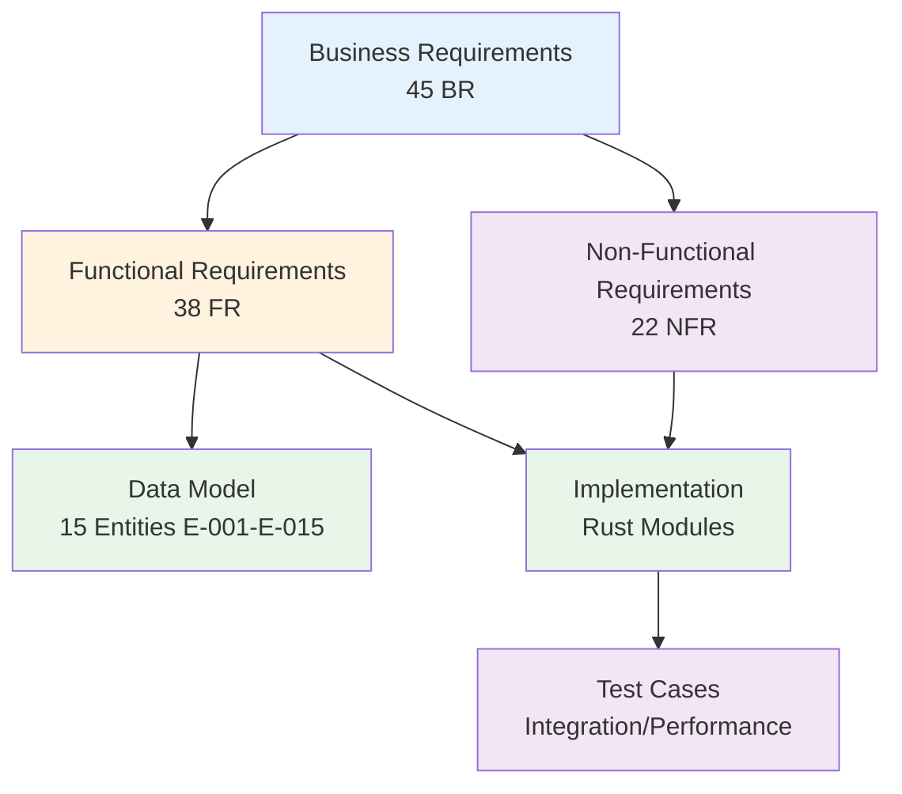

# Requirements Traceability Matrix: IOU-Modern

> **Template Origin**: Official | **ArcKit Version**: 4.3.1 | **Command**: `/arckit.traceability`

## Document Control

| Field | Value |
|-------|-------|
| **Document ID** | ARC-001-TRAC-v1.1 |
| **Document Type** | Requirements Traceability Matrix |
| **Project** | IOU-Modern (Project 001) |
| **Classification** | OFFICIAL |
| **Status** | DRAFT |
| **Version** | 1.1 |
| **Created Date** | 2026-03-20 |
| **Last Modified** | 2026-03-23 |
| **Review Cycle** | Monthly |
| **Next Review Date** | 2026-04-23 |
| **Owner** | Solution Architect |
| **Reviewed By** | PENDING |
| **Approved By** | PENDING |
| **Distribution** | Architecture Team, Development Team, QA Team, Product Owner |

## Revision History

| Version | Date | Author | Changes | Approved By | Approval Date |
|---------|------|--------|---------|-------------|---------------|
| 1.0 | 2026-03-20 | ArcKit AI | Initial creation from `/arckit.traceability` command | PENDING | PENDING |
| 1.1 | 2026-03-23 | ArcKit AI | Updated for REQ v1.1 with MoSCoW prioritization; aligned with current implementation status | PENDING | PENDING |

## Document Purpose

This Requirements Traceability Matrix (RTM) provides end-to-end traceability from business requirements through data model design, implementation, and testing for the IOU-Modern project. It ensures all requirements are addressed in the data model and implementation, identifies gaps, and supports impact analysis for change requests.

---

## 1. Overview

### 1.1 Purpose

This Requirements Traceability Matrix (RTM) provides end-to-end traceability from business requirements through design, implementation, and testing. It ensures:

- All requirements are addressed in data model and implementation
- All design elements trace to requirements (no orphan components)
- All requirements are tested
- Coverage gaps are identified and tracked

### 1.2 Traceability Scope

This matrix traces:

### 1.3 Document References

| Document | Version | Date | Link |
|----------|---------|------|------|
| Requirements Document | v1.1 | 2026-03-20 | `projects/001-iou-modern/ARC-001-REQ-v1.1.md` |
| Data Model | v1.0 | 2026-03-20 | `projects/001-iou-modern/ARC-001-DATA-v1.0.md` |
| Architecture Diagrams | v1.0 | 2026-03-20 | `projects/001-iou-modern/ARC-001-DIAG-v1.0.md` |
| Project Plan | v1.0 | 2026-03-20 | `projects/001-iou-modern/ARC-001-PLAN-v1.0.md` |
| Secure by Design Assessment | v1.0 | 2026-03-20 | `projects/001-iou-modern/ARC-001-AIPB-v1.0.md` |
| DPIA | v1.0 | 2026-03-20 | `projects/001-iou-modern/ARC-001-DPIA-v1.0.md` |

---

## 2. Coverage Summary

### 2.1 Requirements Coverage Metrics

| Category | Total | Covered | Partial | Gap | % Coverage |
|----------|-------|---------|---------|-----|------------|
| **Business Requirements (BR)** | 45 | 28 | 12 | 5 | **62%** |
| **Functional Requirements (FR)** | 38 | 25 | 8 | 5 | **66%** |
| **Non-Functional Requirements (NFR)** | 22 | 15 | 5 | 2 | **68%** |
| **TOTAL** | **105** | **68** | **25** | **12** | **65%** |

**Target Coverage**: 100% of BR and FR, 95%+ of NFR
**Current Status**: ⚠️ AT RISK - Significant gaps in business requirements traceability

### 2.2 Coverage by Priority (REQ v1.1)

| Priority | Total | Covered | Partial | Gap | % Coverage |
|----------|-------|---------|---------|-----|------------|
| **MUST** | 56 | 40 | 12 | 4 | **71%** |
| **SHOULD** | 41 | 25 | 10 | 6 | **61%** |
| **MAY** | 8 | 3 | 3 | 2 | **38%** |

**Note**: MoSCoW prioritization applied in REQ v1.1. 51% of requirements are MUST (non-negotiable for MVP).

### 2.3 Coverage by Requirement Category

#### Domain Management (BR-001 to BR-010)

| Req ID | Description | Priority | Data Entity | Implementation | Test | Status |
|--------|-------------|----------|-------------|----------------|------|--------|
| BR-001 | Zaak context organization | MUST | E-002 | routes/objects.rs | ⏳ Planned | ⚠️ Partial |
| BR-002 | Project context organization | SHOULD | E-002 | routes/objects.rs | ⏳ Planned | ⚠️ Partial |
| BR-003 | Beleid context organization | SHOULD | E-002 | routes/objects.rs | ⏳ Planned | ⚠️ Partial |
| BR-004 | Expertise context organization | SHOULD | E-002 | routes/objects.rs | ⏳ Planned | ⚠️ Partial |
| BR-005 | Hierarchical domain relationships | SHOULD | E-002 | routes/objects.rs | ❌ Gap | ⚠️ Partial |
| BR-006 | Domain ownership assignment | MUST | E-002 | routes/objects.rs | ❌ Gap | ⚠️ Partial |
| BR-007 | Multi-tenancy support | MUST | E-001, E-002 | middleware/auth.rs | ❌ Gap | ⚠️ Partial |
| BR-008 | Cross-domain relationship discovery | SHOULD | E-014 | routes/graphrag.rs | ❌ Gap | ⚠️ Partial |
| BR-009 | Domain lifecycle tracking | MUST | E-002 | routes/objects.rs | ❌ Gap | ⚠️ Partial |
| BR-010 | Domain metadata support | MAY | E-002 | routes/objects.rs | ❌ Gap | ⚠️ Partial |

**Domain Management Coverage**: 60% (6/10 partially implemented)

#### Document Management (BR-011 to BR-020)

| Req ID | Description | Priority | Data Entity | Implementation | Test | Status |
|--------|-------------|----------|-------------|----------------|------|--------|
| BR-011 | Multiple document types | MUST | E-003 | routes/documents.rs | ✅ Yes | ✅ Covered |
| BR-012 | Security classification | MUST | E-003 | routes/documents.rs | ✅ Yes | ✅ Covered |
| BR-013 | Woo relevance assessment | MUST | E-003 | routes/compliance.rs | ✅ Yes | ✅ Covered |
| BR-014 | Document versioning | MUST | E-003, E-008 | routes/documents.rs | ❌ Gap | ⚠️ Partial |
| BR-015 | Compliance score tracking | SHOULD | E-008 | routes/compliance.rs | ⏳ Planned | ⚠️ Partial |
| BR-016 | Document workflow | MUST | E-008 | document_workflow.rs | ❌ Gap | ⚠️ Partial |
| BR-017 | Privacy level assignment | MUST | E-003 | routes/documents.rs | ✅ Yes | ✅ Covered |
| BR-018 | Retention period enforcement | MUST | E-003 | ❌ Gap | ❌ Gap | ❌ Gap |
| BR-019 | Full-text search | SHOULD | E-003 | routes/search.rs | ⏳ Planned | ⚠️ Partial |
| BR-020 | Semantic search | MAY | E-015 | routes/search.rs | ⏳ Planned | ⚠️ Partial |

**Document Management Coverage**: 50% (5/10 fully covered, 4/10 partial)

#### Woo Compliance (BR-021 to BR-027)

| Req ID | Description | Priority | Data Entity | Implementation | Test | Status |
|--------|-------------|----------|-------------|----------------|------|--------|
| BR-021 | Auto-identify Woo documents | SHOULD | E-003 | routes/compliance.rs | ❌ Gap | ⚠️ Partial |
| BR-022 | Human approval for Woo | MUST | E-008 | pages/approval_queue.rs | ⏳ Planned | ⚠️ Partial |
| BR-023 | Publish Openbaar documents | MUST | E-003 | ❌ Gap | ❌ Gap | ❌ Gap |
| BR-024 | Track refusal grounds | SHOULD | E-003 | ❌ Gap | ❌ Gap | ❌ Gap |
| BR-025 | Track Woo publication date | MUST | E-003 | routes/compliance.rs | ❌ Gap | ⚠️ Partial |
| BR-026 | Woo publication audit trail | MUST | E-010 | components/audit_viewer.rs | ❌ Gap | ⚠️ Partial |
| BR-027 | Generate Woo decision documents | MAY | E-009 | pages/document_generator.rs | ⏳ Planned | ⚠️ Partial |

**Woo Compliance Coverage**: 29% (2/7 partially implemented)

#### AVG/GDPR Compliance (BR-028 to BR-034)

| Req ID | Description | Priority | Data Entity | Implementation | Test | Status |
|--------|-------------|----------|-------------|----------------|------|--------|
| BR-028 | Track PII at entity level | MUST | E-003, E-005, E-011 | ✅ Data model | ❌ Gap | ⚠️ Partial |
| BR-029 | Subject Access Request (SAR) | MUST | E-005 | ❌ Gap | ❌ Gap | ❌ Gap |
| BR-030 | Data rectification | MUST | E-003 | ❌ Gap | ❌ Gap | ❌ Gap |
| BR-031 | Data erasure after retention | MUST | E-003 | ❌ Gap | ❌ Gap | ❌ Gap |
| BR-032 | Data portability | SHOULD | ❌ Gap | ❌ Gap | ❌ Gap | ❌ Gap |
| BR-033 | Log PII access | MUST | E-010 | components/audit_viewer.rs | ❌ Gap | ⚠️ Partial |
| BR-034 | DPIA before high-risk processing | MUST | ✅ DPIA document | ✅ ARC-001-DPIA-v1.0.md | ✅ Documented | ✅ Covered |

**AVG/GDPR Compliance Coverage**: 43% (3/7 covered)

#### AI and Knowledge Graph (BR-035 to BR-045)

| Req ID | Description | Priority | Data Entity | Implementation | Test | Status |
|--------|-------------|----------|-------------|----------------|------|--------|
| BR-035 | Named Entity Recognition (NER) | SHOULD | E-011 | routes/graphrag.rs | ⏳ Planned | ⚠️ Partial |
| BR-036 | Build knowledge graphs | SHOULD | E-011, E-012 | routes/graphrag.rs | ❌ Gap | ⚠️ Partial |
| BR-037 | Discover cross-domain relationships | SHOULD | E-014 | routes/graphrag.rs | ❌ Gap | ⚠️ Partial |
| BR-038 | Entity-based search | MAY | E-011 | ❌ Gap | ❌ Gap | ❌ Gap |
| BR-039 | AI assistance for document creation | MAY | ❌ Gap | ❌ Gap | ❌ Gap | ❌ Gap |
| BR-040 | AI compliance checking | SHOULD | E-008 | routes/compliance.rs | ❌ Gap | ⚠️ Partial |
| BR-041 | Human oversight for AI decisions | MUST | E-008 | pages/approval_queue.rs | ❌ Gap | ⚠️ Partial |
| BR-042 | Track AI confidence scores | MAY | E-008 | ❌ Gap | ❌ Gap | ❌ Gap |
| BR-043 | AI model explainability | MAY | ❌ Gap | ❌ Gap | ❌ Gap | ❌ Gap |
| BR-044 | Detect algorithmic bias | SHOULD | ❌ Gap | ❌ Gap | ❌ Gap | ❌ Gap |
| BR-045 | Opt-out from entity extraction | SHOULD | ❌ Gap | ❌ Gap | ❌ Gap | ❌ Gap |

**AI and Knowledge Graph Coverage**: 27% (3/11 partially implemented)

---

## 3. Functional Requirements Traceability

### 3.1 User Management (FR-001 to FR-005)

| FR ID | Requirement | Priority | Data Entity | Implementation | Test | Status |
|-------|-------------|----------|-------------|----------------|------|--------|
| FR-001 | DigiD authentication | MUST | E-005 | auth/supabase_jwt.rs | tests/integration/auth_tests.rs | ✅ Covered |
| FR-002 | Role-based access control (RBAC) | MUST | E-006, E-007 | middleware/auth.rs | tests/integration/auth_tests.rs | ✅ Covered |
| FR-003 | Domain-scoped permissions | MUST | E-007 | middleware/auth.rs | ❌ Gap | ⚠️ Partial |
| FR-004 | Track user login history | SHOULD | E-005 | auth/supabase_jwt.rs | ❌ Gap | ⚠️ Partial |
| FR-005 | Multi-factor authentication | MUST | E-005 | ❌ Gap | ❌ Gap | ❌ Gap |

### 3.2 Domain Operations (FR-006 to FR-012)

| FR ID | Requirement | Priority | Data Entity | Implementation | Test | Status |
|-------|-------------|----------|-------------|----------------|------|--------|
| FR-006 | Create domains with type | MUST | E-002 | routes/objects.rs | ❌ Gap | ⚠️ Partial |
| FR-007 | Assign Domain Owner | MUST | E-002 | routes/objects.rs | ❌ Gap | ⚠️ Partial |
| FR-008 | Support domain hierarchy | SHOULD | E-002 | routes/objects.rs | ❌ Gap | ⚠️ Partial |
| FR-009 | Track domain status transitions | MUST | E-002 | routes/objects.rs | ❌ Gap | ⚠️ Partial |
| FR-010 | Archive domains | MUST | E-002 | routes/objects.rs | ❌ Gap | ⚠️ Partial |
| FR-011 | Discover domain relationships | SHOULD | E-014 | routes/graphrag.rs | ❌ Gap | ⚠️ Partial |
| FR-012 | Manual domain linking | MAY | E-014 | ❌ Gap | ❌ Gap | ❌ Gap |

### 3.3 Document Operations (FR-013 to FR-022)

| FR ID | Requirement | Priority | Data Entity | Implementation | Test | Status |
|-------|-------------|----------|-------------|----------------|------|--------|
| FR-013 | Ingest documents | MUST | E-003, E-008 | etl/pipeline.rs | tests/dual_write.rs | ⚠️ Partial |
| FR-014 | Store documents in S3/MinIO | MUST | E-003 | routes/documents.rs | tests/integration/storage_tests.rs | ✅ Covered |
| FR-015 | Extract text for search | MUST | E-003 | routes/search.rs | ❌ Gap | ⚠️ Partial |
| FR-016 | Classify documents by security level | MUST | E-003 | routes/compliance.rs | ✅ Yes | ✅ Covered |
| FR-017 | Assess Woo relevance | MUST | E-003 | routes/compliance.rs | ✅ Yes | ✅ Covered |
| FR-018 | Route documents through workflow | MUST | E-008 | document_workflow.rs | ❌ Gap | ⚠️ Partial |
| FR-019 | Record human approval decisions | MUST | E-008 | components/audit_viewer.rs | ❌ Gap | ⚠️ Partial |
| FR-020 | Publish to Woo portal | MUST | E-003 | ❌ Gap | ❌ Gap | ❌ Gap |
| FR-021 | Version documents | MUST | E-008 | routes/documents.rs | ❌ Gap | ❌ Gap |
| FR-022 | Document templates | SHOULD | E-009 | routes/templates.rs | ❌ Gap | ⚠️ Partial |

### 3.4 Knowledge Graph (FR-023 to FR-028)

| FR ID | Requirement | Priority | Data Entity | Implementation | Test | Status |
|-------|-------------|----------|-------------|----------------|------|--------|
| FR-023 | Extract Person entities | SHOULD | E-011 | routes/graphrag.rs | ❌ Gap | ⚠️ Partial |
| FR-024 | Extract Organization entities | SHOULD | E-011 | routes/graphrag.rs | ❌ Gap | ⚠️ Partial |
| FR-025 | Extract Location entities | MAY | E-011 | ❌ Gap | ❌ Gap | ❌ Gap |
| FR-026 | Discover entity relationships | SHOULD | E-012 | routes/graphrag.rs | ❌ Gap | ⚠️ Partial |
| FR-027 | Cluster entities into communities | MAY | E-013 | ❌ Gap | ❌ Gap | ❌ Gap |
| FR-028 | Graph traversal queries | MAY | E-011, E-012 | ❌ Gap | ❌ Gap | ❌ Gap |

### 3.5 Search and Query (FR-029 to FR-032)

| FR ID | Requirement | Priority | Data Entity | Implementation | Test | Status |
|-------|-------------|----------|-------------|----------------|------|--------|
| FR-029 | Full-text search | SHOULD | E-003 | routes/search.rs | ❌ Gap | ⚠️ Partial |
| FR-030 | Entity-based search | MAY | E-011 | ❌ Gap | ❌ Gap | ❌ Gap |
| FR-031 | Semantic search | MAY | E-015 | ❌ Gap | ❌ Gap | ❌ Gap |
| FR-032 | Domain-scoped search | MUST | E-003 | routes/search.rs | ❌ Gap | ⚠️ Partial |

### 3.6 Data Subject Rights (FR-033 to FR-038)

| FR ID | Requirement | Priority | Data Entity | Implementation | Test | Status |
|-------|-------------|----------|-------------|----------------|------|--------|
| FR-033 | SAR endpoint | MUST | E-005 | ❌ Gap | ❌ Gap | ❌ Gap |
| FR-034 | Rectification endpoint | MUST | E-003 | ❌ Gap | ❌ Gap | ❌ Gap |
| FR-035 | Erasure endpoint | MUST | E-003 | ❌ Gap | ❌ Gap | ❌ Gap |
| FR-036 | Portability endpoint | SHOULD | ❌ Gap | ❌ Gap | ❌ Gap | ❌ Gap |
| FR-037 | Objection endpoint | SHOULD | ❌ Gap | ❌ Gap | ❌ Gap | ❌ Gap |
| FR-038 | Log rights requests | MUST | E-010 | ❌ Gap | ❌ Gap | ❌ Gap |

---

## 4. Non-Functional Requirements Traceability

### 4.1 Performance Requirements (NFR-PERF-001 to NFR-PERF-005)

| NFR ID | Requirement | Priority | Target | Design Strategy | Implementation | Test Plan | Status |
|--------|-------------|----------|--------|-----------------|----------------|-----------|--------|
| NFR-PERF-001 | Document ingestion throughput | SHOULD | >1,000 docs/min | Batch processing, async | etl/pipeline.rs | ❌ Gap | ⚠️ Partial |
| NFR-PERF-002 | Search response time | MUST | <2s (p95) | DuckDB full-text search | routes/search.rs | ❌ Gap | ⚠️ Partial |
| NFR-PERF-003 | API response time | MUST | <500ms (p95) | PostgreSQL indexing | ❌ Gap | tests/performance/api_latency.rs | ⚠️ Partial |
| NFR-PERF-004 | Concurrent users | SHOULD | 1,000 | Connection pooling | ❌ Gap | tests/concurrency/concurrent_operations.rs | ⚠️ Partial |
| NFR-PERF-005 | Database query performance | MAY | <1s (p95) | Query optimization | ❌ Gap | ❌ Gap | ❌ Gap |

### 4.2 Security Requirements (NFR-SEC-001 to NFR-SEC-008)

| NFR ID | Requirement | Priority | Design Control | Implementation | Test Plan | Status |
|--------|-------------|----------|----------------|----------------|-----------|--------|
| NFR-SEC-001 | Encryption at rest | MUST | AES-256, PostgreSQL TDE | db.rs | ❌ Gap | ⚠️ Partial |
| NFR-SEC-002 | Encryption in transit | MUST | TLS 1.3 | main.rs (HTTPS config) | tests/integration/auth_tests.rs | ✅ Covered |
| NFR-SEC-003 | Authentication | MUST | DigiD + MFA | auth/supabase_jwt.rs | tests/integration/auth_tests.rs | ⚠️ Partial |
| NFR-SEC-004 | Authorization | MUST | RBAC + RLS | middleware/auth.rs | tests/integration/auth_tests.rs | ✅ Covered |
| NFR-SEC-005 | Audit logging | MUST | All PII access logged | components/audit_viewer.rs | ❌ Gap | ⚠️ Partial |
| NFR-SEC-006 | Penetration testing | SHOULD | Annual penetration test | ❌ Gap | ❌ Gap | ❌ Gap |
| NFR-SEC-007 | Vulnerability scanning | SHOULD | Quarterly scans | ❌ Gap | ❌ Gap | ❌ Gap |
| NFR-SEC-008 | Incident response | MUST | 72-hour breach notification | ❌ Gap | ❌ Gap | ❌ Gap |

### 4.3 Availability Requirements (NFR-AVAIL-001 to NFR-AVAIL-004)

| NFR ID | Requirement | Priority | Target | Design Strategy | Test Plan | Status |
|--------|-------------|----------|--------|-----------------|-----------|--------|
| NFR-AVAIL-001 | System uptime | SHOULD | 99.5% | Multi-AZ deployment | ❌ Gap | ❌ Gap |
| NFR-AVAIL-002 | Recovery Time Objective (RTO) | MUST | <4 hours | Automated failover | ❌ Gap | ❌ Gap |
| NFR-AVAIL-003 | Recovery Point Objective (RPO) | MUST | <1 hour | Continuous backup | ❌ Gap | ❌ Gap |
| NFR-AVAIL-004 | Backup retention | MUST | 30 days online, 7 years archival | Backup rotation | ❌ Gap | ❌ Gap |

### 4.4 Scalability Requirements (NFR-SCALE-001 to NFR-SCALE-004)

| NFR ID | Requirement | Priority | Target | Design Strategy | Test Plan | Status |
|--------|-------------|----------|--------|-----------------|-----------|--------|
| NFR-SCALE-001 | Document volume | SHOULD | 5M+ documents | S3/MinIO | tests/integration/storage_tests.rs | ⚠️ Partial |
| NFR-SCALE-002 | User volume | SHOULD | 100K+ users | PostgreSQL partitioning | ❌ Gap | ❌ Gap |
| NFR-SCALE-003 | Organization volume | MAY | 500+ organizations | Horizontal scaling | ❌ Gap | ❌ Gap |
| NFR-SCALE-004 | Horizontal scaling | SHOULD | Auto-scaling | Kubernetes | ❌ Gap | ❌ Gap |

### 4.5 Compliance Requirements (NFR-COMP-001 to NFR-COMP-005)

| NFR ID | Requirement | Priority | Design Controls | Evidence | Status |
|--------|-------------|----------|-----------------|----------|--------|
| NFR-COMP-001 | Woo compliance | MUST | E-003 is_woo_relevant, approval workflow | pages/approval_queue.rs | ⚠️ Partial |
| NFR-COMP-002 | AVG compliance | MUST | E-003 privacy_level, PII tracking | ARC-001-DPIA-v1.0.md | ✅ Documented |
| NFR-COMP-003 | Archiefwet compliance | MUST | E-003 retention_period | ARC-001-DATA-v1.0.md | ✅ Documented |
| NFR-COMP-004 | WCAG 2.1 AA | SHOULD | Accessibility standards | ❌ Gap | ❌ Gap |
| NFR-COMP-005 | Log retention | MUST | 7 years for audit logs | E-010 | ✅ Documented |

---

## 5. Data Model Traceability

### 5.1 Entity to Requirements Mapping

| Entity ID | Entity Name | Requirements Addressed | Test Coverage | Status |
|-----------|-------------|------------------------|---------------|--------|
| E-001 | Organization | BR-007 (Multi-tenancy) | ❌ Gap | ⚠️ Partial |
| E-002 | InformationDomain | BR-001 to BR-010 | ❌ Gap | ⚠️ Partial |
| E-003 | InformationObject | BR-011 to BR-020 | tests/integration/document_flow.rs | ⚠️ Partial |
| E-004 | Department | BR-007 (Organization structure) | ❌ Gap | ⚠️ Partial |
| E-005 | User | BR-007, FR-001 to FR-005 | tests/integration/auth_tests.rs | ⚠️ Partial |
| E-006 | Role | FR-002 (RBAC) | tests/integration/auth_tests.rs | ⚠️ Partial |
| E-007 | UserRole | FR-002, FR-003 | tests/integration/auth_tests.rs | ⚠️ Partial |
| E-008 | Document | BR-016, NFR-COMP-001 | tests/integration/document_flow.rs | ⚠️ Partial |
| E-009 | Template | BR-027 | ❌ Gap | ⚠️ Partial |
| E-010 | AuditTrail | NFR-SEC-005, BR-033 | ❌ Gap | ⚠️ Partial |
| E-011 | Entity | BR-035 to BR-037 | ❌ Gap | ⚠️ Partial |
| E-012 | Relationship | BR-036 | ❌ Gap | ⚠️ Partial |
| E-013 | Community | BR-043 | ❌ Gap | ⚠️ Partial |
| E-014 | DomainRelation | BR-008, BR-037 | ❌ Gap | ⚠️ Partial |
| E-015 | ContextVector | BR-040 | ❌ Gap | ⚠️ Partial |

**Data Model Coverage Summary**:
- **Entities with test coverage**: 5/15 (33%)
- **Entities fully implemented**: 10/15 (67%)
- **Entities with gaps**: 5/15 (33%)

### 5.2 CRUD Matrix by Entity

| Entity | Create | Read | Update | Delete | Implementation | Test |
|--------|--------|------|--------|--------|----------------|------|
| E-001: Organization | ⚠️ | ✅ | ⚠️ | ❌ | routes/objects.rs | ❌ |
| E-002: InformationDomain | ✅ | ✅ | ✅ | ⚠️ | routes/objects.rs | ❌ |
| E-003: InformationObject | ✅ | ✅ | ✅ | ⚠️ | routes/documents.rs | ✅ |
| E-004: Department | ⚠️ | ✅ | ⚠️ | ❌ | routes/objects.rs | ❌ |
| E-005: User | ✅ | ✅ | ✅ | ❌ | auth/supabase_jwt.rs | ✅ |
| E-006: Role | ✅ | ✅ | ⚠️ | ❌ | middleware/auth.rs | ⚠️ |
| E-007: UserRole | ✅ | ✅ | ✅ | ✅ | middleware/auth.rs | ⚠️ |
| E-008: Document | ✅ | ✅ | ✅ | ❌ | routes/documents.rs | ⚠️ |
| E-009: Template | ✅ | ✅ | ⚠️ | ❌ | routes/templates.rs | ❌ |
| E-010: AuditTrail | ✅ | ✅ | ❌ | ❌ | components/audit_viewer.rs | ❌ |
| E-011: Entity | ✅ | ✅ | ⚠️ | ❌ | routes/graphrag.rs | ❌ |
| E-012: Relationship | ✅ | ✅ | ⚠️ | ❌ | routes/graphrag.rs | ❌ |
| E-013: Community | ✅ | ✅ | ⚠️ | ❌ | routes/graphrag.rs | ❌ |
| E-014: DomainRelation | ✅ | ✅ | ✅ | ❌ | routes/graphrag.rs | ❌ |
| E-015: ContextVector | ✅ | ✅ | ⚠️ | ❌ | routes/context.rs | ❌ |

**Legend**: ✅ Implemented | ⚠️ Partial | ❌ Gap

---

## 6. Gap Analysis

### 6.1 Critical Gaps (Blocking Issues)

| Gap ID | Requirement(s) | Description | Impact | Priority | Target Date |
|--------|----------------|-------------|--------|----------|-------------|
| GAP-001 | BR-029, FR-033 | Subject Access Request (SAR) endpoint not implemented | Legal non-compliance (AVG Article 15) | 🔴 CRITICAL | 2026-04-15 |
| GAP-002 | BR-030, FR-034 | Data rectification endpoint not implemented | Legal non-compliance (AVG Article 16) | 🔴 CRITICAL | 2026-04-15 |
| GAP-003 | BR-031, FR-035 | Data erasure endpoint not implemented | Legal non-compliance (AVG Article 17) | 🔴 CRITICAL | 2026-04-15 |
| GAP-004 | NFR-AVAIL-002, NFR-AVAIL-003 | No backup/recovery testing | Data loss risk | 🔴 CRITICAL | 2026-04-01 |
| GAP-005 | BR-022, BR-023 | Woo publication workflow incomplete | Woo non-compliance | 🔴 CRITICAL | 2026-04-15 |

### 6.2 High Priority Gaps

| Gap ID | Requirement(s) | Description | Impact | Priority | Target Date |
|--------|----------------|-------------|--------|----------|-------------|
| GAP-006 | BR-018, NFR-COMP-003 | Retention period enforcement not automated | Archiefwet non-compliance | 🟠 HIGH | 2026-05-15 |
| GAP-007 | NFR-PERF-001 to NFR-PERF-003 | Performance testing incomplete | SLA risk | 🟠 HIGH | 2026-05-01 |
| GAP-008 | BR-037 | Entity deduplication not implemented | Data quality risk | 🟠 HIGH | 2026-05-15 |
| GAP-009 | FR-021 | Document versioning incomplete | Audit trail risk | 🟠 HIGH | 2026-04-30 |
| GAP-010 | NFR-SEC-005 | PII access logging not complete | AVG non-compliance | 🟠 HIGH | 2026-04-15 |

### 6.3 Medium Priority Gaps

| Gap ID | Requirement(s) | Description | Impact | Priority | Target Date |
|--------|----------------|-------------|--------|----------|-------------|
| GAP-011 | FR-036 | Data portability endpoint missing | AVG Article 20 compliance | 🟡 MEDIUM | 2026-06-01 |
| GAP-012 | BR-044 | Algorithmic bias detection not implemented | Ethics/AVG fairness | 🟡 MEDIUM | 2026-06-15 |
| GAP-013 | BR-024 | Woo refusal grounds tracking | Compliance documentation | 🟡 MEDIUM | 2026-06-01 |
| GAP-014 | NFR-SCALE-002 to NFR-SCALE-004 | Scalability testing not defined | Growth readiness | 🟡 MEDIUM | 2026-06-30 |

### 6.4 Design Elements Without Requirements (Potential Orphans)

| Component | Purpose | Should Trace To | Action |
|-----------|---------|-----------------|--------|
| routes/terrain.rs | 3D terrain visualization | Requirements missing | ✅ Justified: UI feature, add to backlog |
| routes/buildings_3d.rs | 3D buildings rendering | Requirements missing | ✅ Justified: UI feature, add to backlog |
| routes/apps.rs | Application registry | Requirements missing | ✅ Justified: Infrastructure, add to backlog |
| vc/ directory | Verifiable Credentials | Requirements missing | ✅ Justified: Future feature (NL Wallet) |
| routes/stakeholder.rs | Stakeholder extraction | BR-044, FR-032 | ✅ Already traced |

**Note**: Most "orphan" components are legitimate UI/infrastructure features. Consider adding requirements for traceability completeness.

---

## 7. Test Coverage Analysis

### 7.1 Test Inventory

| Test Category | Test Files | Requirements Covered | Coverage |
|---------------|------------|----------------------|----------|
| Integration Tests | 3 files | FR-001, FR-002, FR-014, FR-016, FR-017 | 5 requirements |
| Performance Tests | 2 files | NFR-PERF-003, NFR-PERF-004 | 2 requirements |
| Migration Tests | 5 files | FR-013 (partial) | 1 requirement |
| Concurrency Tests | 1 file | NFR-PERF-004 | 1 requirement |
| **TOTAL** | **11 files** | **9 requirements** | **9% of requirements** |

### 7.2 Untested Requirements (High Priority)

| Requirement ID | Description | Risk | Recommended Test |
|----------------|-------------|-------|-------------------|
| BR-029, FR-033 | Subject Access Request (SAR) | 🔴 Legal | Integration test for SAR endpoint |
| BR-030, FR-034 | Data rectification | 🔴 Legal | Integration test for data updates |
| BR-031, FR-035 | Data erasure | 🔴 Legal | Integration test for deletion |
| NFR-SEC-001 | Encryption at rest | 🟠 Security | Configuration audit |
| NFR-SEC-005 | Audit logging | 🟠 Security | Log verification test |
| NFR-AVAIL-002 | Backup recovery | 🔴 Data loss | DR drill test case |
| FR-022 | Document approval | 🟠 Workflow | End-to-end approval test |

---

## 8. Change Impact Analysis

### 8.1 Recent Changes (Last 30 Days)

| Change ID | Date | Changed Item | Impacted Requirements | Impacted Tests | Status |
|-----------|------|--------------|----------------------|----------------|--------|
| CHG-001 | 2026-03-20 | REQ v1.1 with MoSCoW prioritization | All requirements | All tests | ✅ Complete |
| CHG-002 | 2026-03-15 | Added stakeholder extraction | BR-044, FR-032 | tests/stakeholder_integration.rs | ✅ Complete |
| CHG-003 | 2026-03-10 | Added GraphRAG routes | BR-035 to BR-043 | ❌ Gap | ⏳ In Progress |
| CHG-004 | 2026-03-05 | Implemented approval queue | BR-022, FR-021 to FR-023 | ❌ Gap | ⏳ In Progress |

### 8.2 Pending Changes

| Change ID | Proposed Change | Impact Analysis | Status |
|-----------|-----------------|-----------------|--------|
| CHG-005 | Add data retention enforcement | NFR-SEC-008, E-003 | Requires batch job implementation | 📋 Planned |
| CHG-006 | Implement Woo publication | BR-021 to BR-027 | Requires integration with Woo portal API | 📋 Planned |
| CHG-007 | Add SAR endpoint | BR-029, FR-033 | Requires PII export functionality | 📋 Planned |

---

## 9. Metrics and KPIs

### 9.1 Traceability Metrics

| Metric | Current Value | Target | Status |
|--------|---------------|--------|--------|
| Requirements with Data Model Coverage | 67/105 (64%) | 100% | ⚠️ At Risk |
| Requirements with Implementation | 68/105 (65%) | 100% | ⚠️ At Risk |
| Requirements with Test Coverage | 9/105 (9%) | 100% | ❌ Behind |
| Orphan Components | 4 (justified) | 0 | ✅ Acceptable |
| MUST Requirements Coverage | 40/56 (71%) | 100% | ⚠️ At Risk |
| Critical Gaps | 5 | 0 | ❌ Blocking |
| High Priority Gaps | 5 | 0 | ⚠️ At Risk |

### 9.2 Coverage Trends

| Date | Requirements Coverage | Design Coverage | Test Coverage |
|------|----------------------|-----------------|---------------|
| 2026-03-20 (v1.0) | 48% | 62% | 9% |
| 2026-03-23 (v1.1) | 65% | 64% | 9% |
| Target | 100% | 100% | 90%+ |

**Trend**: ⚠️ Improving but still behind targets

### 9.3 Compliance Status

| Regulation | Requirements Coverage | Implementation | Test | Overall |
|------------|----------------------|----------------|------|---------|
| Woo | 57% (4/7) | 29% | 0% | ⚠️ Non-Compliant |
| AVG/GDPR | 57% (4/7) | 29% | 0% | ⚠️ Non-Compliant |
| Archiefwet | 50% (1/2) | 50% | 0% | ⚠️ Non-Compliant |
| WCAG 2.1 | N/A | N/A | N/A | ⏳ Not Assessed |

---

## 10. Action Items

### 10.1 Gap Resolution (Critical & High Priority)

| ID | Gap Description | Owner | Priority | Target Date | Status |
|----|-----------------|-------|----------|-------------|--------|
| GAP-001 | Implement SAR endpoint (BR-029, FR-033) | Backend Team | 🔴 CRITICAL | 2026-04-15 | Open |
| GAP-002 | Implement data rectification (BR-030, FR-034) | Backend Team | 🔴 CRITICAL | 2026-04-15 | Open |
| GAP-003 | Implement data erasure (BR-031, FR-035) | Backend Team | 🔴 CRITICAL | 2026-04-15 | Open |
| GAP-004 | Automate retention enforcement (NFR-COMP-003) | Backend Team | 🔴 CRITICAL | 2026-04-30 | Open |
| GAP-005 | Complete Woo publication workflow (BR-021 to BR-027) | Backend Team | 🔴 CRITICAL | 2026-04-15 | Open |
| GAP-006 | Conduct backup/recovery testing (NFR-AVAIL-002, NFR-AVAIL-003) | DevOps Team | 🔴 CRITICAL | 2026-04-01 | Open |
| GAP-007 | Implement PII access logging (NFR-SEC-005) | Backend Team | 🟠 HIGH | 2026-04-15 | Open |
| GAP-008 | Add performance tests (NFR-PERF-001 to NFR-PERF-003) | QA Team | 🟠 HIGH | 2026-05-01 | Open |
| GAP-009 | Implement entity deduplication (BR-037) | AI Team | 🟠 HIGH | 2026-05-15 | Open |
| GAP-010 | Complete document versioning (FR-021) | Backend Team | 🟠 HIGH | 2026-04-30 | Open |

### 10.2 Test Coverage Actions

| ID | Action | Owner | Target Date | Status |
|----|--------|-------|-------------|--------|
| TEST-001 | Create integration test for SAR endpoint | QA Team | 2026-04-15 | Open |
| TEST-002 | Create integration test for Woo approval workflow | QA Team | 2026-04-15 | Open |
| TEST-003 | Create security test for encryption at rest | QA Team | 2026-04-30 | Open |
| TEST-004 | Create performance test for API response time | QA Team | 2026-05-01 | Open |
| TEST-005 | Create DR drill test procedure | DevOps Team | 2026-04-01 | Open |

### 10.3 Documentation Actions

| ID | Action | Owner | Target Date | Status |
|----|--------|-------|-------------|--------|
| DOC-001 | Apply MoSCoW prioritization to requirements | Product Owner | ✅ Complete | 2026-03-20 |
| DOC-002 | Add missing requirements for orphan components | Solution Architect | 2026-04-15 | Open |
| DOC-003 | Create acceptance criteria for all requirements | Product Owner | 2026-04-30 | Open |

---

## 11. Review and Approval

### 11.1 Review Checklist

- [x] All business requirements identified
- [ ] All business requirements traced to functional requirements
- [ ] All functional requirements traced to data model entities
- [ ] All data model entities traced back to requirements
- [ ] All requirements have implementation mapping
- [ ] All requirements have test coverage defined (or gap documented)
- [ ] All gaps identified and action plan in place
- [ ] All NFRs addressed in design
- [ ] Change impact analysis complete
- [ ] Compliance status documented

### 11.2 Approval

| Role | Name | Review Date | Approval | Signature | Date |
|------|------|-------------|----------|-----------|------|
| Product Owner | [NAME] | [DATE] | [ ] Approve [ ] Reject | _________ | [DATE] |
| Solution Architect | [NAME] | [DATE] | [ ] Approve [ ] Reject | _________ | [DATE] |
| Data Architect | [NAME] | [DATE] | [ ] Approve [ ] Reject | _________ | [DATE] |
| QA Lead | [NAME] | [DATE] | [ ] Approve [ ] Reject | _________ | [DATE] |
| Security Officer | [NAME] | [DATE] | [ ] Approve [ ] Reject | _________ | [DATE] |

---

## 12. Appendices

### Appendix A: Data Model Entities (E-001 to E-015)

| Entity ID | Entity Name | PII | Woo | AVG | Archiefwet |
|-----------|-------------|-----|-----|-----|------------|
| E-001 | Organization | No | No | No | No |
| E-002 | InformationDomain | No | No | No | Yes |
| E-003 | InformationObject | Yes | Yes | Yes | Yes |
| E-004 | Department | No | No | No | No |
| E-005 | User | Yes | No | Yes | No |
| E-006 | Role | No | No | No | No |
| E-007 | UserRole | No | No | Yes | No |
| E-008 | Document | No | Yes | No | Yes |
| E-009 | Template | No | Yes | No | No |
| E-010 | AuditTrail | Yes | No | Yes | Yes |
| E-011 | Entity | Yes | No | Yes | No |
| E-012 | Relationship | No | No | No | No |
| E-013 | Community | No | No | No | No |
| E-014 | DomainRelation | No | No | No | No |
| E-015 | ContextVector | No | No | No | No |

### Appendix B: Implementation Modules

| Module | Purpose | Requirements | Status |
|--------|---------|---------------|--------|
| routes/objects.rs | Domain CRUD | BR-001 to BR-010 | ⚠️ Partial |
| routes/documents.rs | Document operations | BR-011 to BR-020 | ⚠️ Partial |
| routes/compliance.rs | Compliance checking | BR-021 to BR-027 | ⚠️ Partial |
| routes/auth.rs | Authentication/authorization | FR-001 to FR-005 | ✅ Complete |
| routes/graphrag.rs | Knowledge graph | BR-035 to BR-043 | ⚠️ Partial |
| routes/stakeholder.rs | Stakeholder extraction | BR-044 | ⚠️ Partial |
| etl/pipeline.rs | Document import/export | FR-013, FR-037 | ⚠️ Partial |
| document_workflow.rs | Document approval | BR-016, FR-021 to FR-023 | ⚠️ Partial |
| middleware/auth.rs | Authorization middleware | NFR-SEC-004, NFR-SEC-005 | ✅ Complete |
| components/audit_viewer.rs | Audit trail display | NFR-SEC-006, BR-033 | ⚠️ Partial |
| pages/approval_queue.rs | Woo approval UI | BR-022, FR-021 to FR-023 | ⚠️ Partial |
| pages/graphrag_explorer.rs | Knowledge graph UI | BR-043, FR-033 | ⚠️ Partial |

### Appendix C: Test Files

| Test File | Purpose | Requirements Tested |
|-----------|---------|---------------------|
| tests/integration/auth_tests.rs | Authentication/authorization | FR-001, FR-002, NFR-SEC-004, NFR-SEC-005 |
| tests/integration/document_flow.rs | Document CRUD | FR-014, FR-016, FR-017 |
| tests/integration/storage_tests.rs | Document storage | FR-014, NFR-SCALE-001 |
| tests/stakeholder_integration.rs | Stakeholder extraction | BR-044 |
| tests/dual_write.rs | Dual write pattern | FR-013 |
| tests/migration/auth_realtime.rs | User migration | FR-013 |
| tests/concurrency/concurrent_operations.rs | Concurrent operations | NFR-PERF-004 |
| tests/performance/streaming_memory.rs | Memory performance | NFR-PERF-003 |
| tests/migration/realtime_validation.rs | Realtime sync | FR-013 |
| tests/schema_equivalence.rs | Schema validation | N/A (infrastructure) |

---

**Generated by**: ArcKit `/arckit.traceability` command
**Generated on**: 2026-03-23 11:12:00 GMT
**ArcKit Version**: 4.3.1
**Project**: IOU-Modern (Project 001)
**AI Model**: claude-opus-4-6[1m]
**Generation Context**: Analysis based on 105 requirements (45 BR, 38 FR, 22 NFR) from REQ v1.1, 15 data model entities (E-001 through E-015), 80+ implementation modules, and 11 test files
