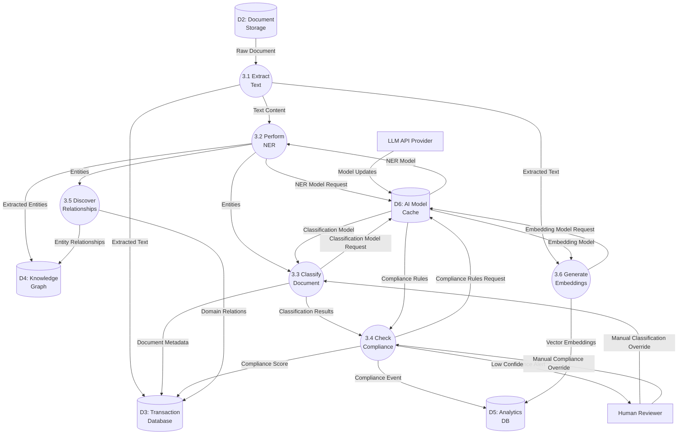

# Data Flow Diagram: IOU-Modern - Process Documents (AI Pipeline)

> **Template Origin**: Official | **ArcKit Version**: 4.3.1 | **Command**: `/arckit:dfd`

## Document Control

| Field | Value |
|-------|-------|
| **Document ID** | ARC-001-DFD-002-v1.0 |
| **Document Type** | Data Flow Diagram |
| **Project** | IOU-Modern (Project 001) |
| **Classification** | OFFICIAL |
| **Status** | DRAFT |
| **Version** | 1.0 |
| **Created Date** | 2026-03-26 |
| **Last Modified** | 2026-03-26 |
| **Review Cycle** | Per release |
| **Next Review Date** | 2026-04-25 |
| **Owner** | Solution Architect |
| **Reviewed By** | PENDING |
| **Approved By** | PENDING |
| **Distribution** | Architecture Team, Development Team, Data Governance Committee |
| **DFD Level** | Level 2 (Process 3 Decomposition) |
| **Notation** | Yourdon-DeMarco |

## Revision History

| Version | Date | Author | Changes | Approved By | Approval Date |
|---------|------|--------|---------|-------------|---------------|
| 1.0 | 2026-03-26 | ArcKit AI | Initial creation from `/arckit:dfd` command | PENDING | PENDING |

---

## Executive Summary

This document contains a Level 2 Data Flow Diagram (DFD) for IOU-Modern, providing detailed decomposition of **Process 3: Process Documents** from the Level 1 DFD. This process represents the AI-powered document processing pipeline that performs text extraction, Named Entity Recognition (NER), classification, compliance checking, relationship discovery, and embedding generation.

**Parent Process**: P3 (Process Documents) from Level 1 DFD (ARC-001-DFD-001-v1.0)

**Scope**: AI Pipeline showing 6 sub-processes with detailed data flows between internal data stores and AI processing steps.

---

## Yourdon-DeMarco Notation Key

| Symbol | Shape | Description |
|--------|-------|-------------|
| **External Entity** | Rectangle | Source or sink of data outside the system boundary |
| **Process** | Circle | Transforms incoming data flows into outgoing data flows |
| **Data Store** | Open-ended rectangle (parallel lines) | Repository of data at rest |
| **Data Flow** | Named arrow | Data in motion between components |

---

## 1. Level 2 DFD - Process Documents (AI Pipeline)

The Level 2 DFD decomposes Process 3 into 6 sub-processes representing the AI document processing pipeline.

### 1.1 data-flow-diagram DSL

```dfd
title Level 2 DFD - Process 3: AI Document Processing Pipeline

store     D2         "D2: Document\nStorage"
store     D3         "D3: Transaction\nDatabase"
store     D4         "D4: Knowledge\nGraph"
store     D5         "D5: Analytics\nDB"
store     D6         "D6: AI Model\nCache"

process   P3_1       "3.1\nExtract\nText"
process   P3_2       "3.2\nPerform\nNER"
process   P3_3       "3.3\nClassify\nDocument"
process   P3_4       "3.4\nCheck\nCompliance"
process   P3_5       "3.5\nDiscover\nRelationships"
process   P3_6       "3.6\nGenerate\nEmbeddings"

entity    LLM_API    "LLM API\nProvider"
entity    HUMAN_REV  "Human\nReviewer"

D2       --> P3_1    "Raw Document"
P3_1     --> D3      "Extracted Text"
P3_1     --> P3_2    "Text Content"

P3_2     --> D6      "NER Model Request"
D6       --> P3_2    "NER Model"
P3_2     --> D4      "Extracted Entities"
P3_2     --> P3_3    "Entities"

P3_3     --> D6      "Classification Model Request"
D6       --> P3_3    "Classification Model"
P3_3     --> D3      "Document Metadata"
P3_3     --> P3_4    "Classification Results"

P3_4     --> D6      "Compliance Rules Request"
D6       --> P3_4    "Compliance Rules"
P3_4     --> D3      "Compliance Score"
P3_4     --> D5      "Compliance Event"
P3_4     --> HUMAN_REV "Low Confidence Alert"

P3_2     --> P3_5    "Entities"
P3_5     --> D4      "Entity Relationships"
P3_5     --> D3      "Domain Relations"

P3_1     --> P3_6    "Extracted Text"
P3_6     --> D6      "Embedding Model Request"
D6       --> P3_6    "Embedding Model"
P3_6     --> D5      "Vector Embeddings"

LLM_API  --> D6      "Model Updates"
HUMAN_REV --> P3_3    "Manual Classification Override"
HUMAN_REV --> P3_4    "Manual Compliance Override"
```

### 1.2 Mermaid (Approximate)



---

## 2. Process Specifications

| Process | Name | Inputs | Outputs | Logic Summary | Req. Trace |
|---------|------|--------|---------|---------------|------------|
| 3.1 | Extract Text | Raw document from D2 | Extracted text to D3, Text content to P3.2 | Reads document from D2, performs OCR for PDF/images, extracts text content, detects MIME type, calculates file size, handles encoding issues | FR-015 |
| 3.2 | Perform NER | Text content from P3.1, NER model from D6 | Extracted entities to D4, Entities to P3.3 | Named Entity Recognition using spaCy/custom models, extracts Person, Organization, Location, Law, Date, Money entities, assigns confidence scores, performs entity deduplication | FR-023, FR-024 |
| 3.3 | Classify Document | Entities from P3.2, Classification model from D6, Manual override | Document metadata to D3, Classification results to P3.4 | Multi-label classification: security level (Openbaar/Intern/Vertrouwelijk/Geheim), Woo relevance (yes/no), privacy level (Openbaar/Normaal/Bijzonder/Strafrechtelijk), applies retention period based on Archiefwet | FR-016, FR-017, BR-012 to BR-020 |
| 3.4 | Check Compliance | Classification from P3.3, Compliance rules from D6, Manual override | Compliance score to D3, Events to D5, Low confidence alerts | Validates against Woo rules, AVG data protection requirements, Archiefwet retention schedules, calculates 0.0-1.0 compliance score, triggers human review if below threshold, logs all PII access | FR-040, BR-021 to BR-027, BR-028 to BR-034 |
| 3.5 | Discover Relationships | Entities from P3.2 | Entity relationships to D4, Domain relations to D3 | GraphRAG algorithm discovers relationships between entities, detects shared entities across domains, identifies relationship types (WorksFor, LocatedIn, SubjectTo, etc.), calculates relationship strength and confidence | FR-026, BR-036, BR-037 |
| 3.6 | Generate Embeddings | Extracted text from P3.1, Embedding model from D6 | Vector embeddings to D5 | Generates vector embeddings using sentence-transformers/OpenAI, stores in D5 for semantic search, includes model name and version for reproducibility, supports embedding refresh | FR-031, BR-020 |

---

## 3. Data Store Descriptions

| Store | Name | Contents | Access Pattern | Retention | PII |
|-------|------|----------|----------------|-----------|-----|
| D2 | Document Storage | Raw document files (PDF, DOCX, email, images) | Read by P3.1 | 1-20 years (per Archiefwet) | Indirect (content) |
| D3 | Transaction Database | Information domains, Information objects metadata, Extracted text, Classification, Compliance scores | Read by P3.1-P3.5; Write by P3.1-P3.5 | 20 years maximum | Yes (metadata, creator) |
| D4 | Knowledge Graph | Entities (Person, Organization, Location, etc.), Entity relationships, Communities, Domain relations | Read by P3.2, P3.5; Write by P3.2, P3.5 | 20 years (linked to source) | Yes (Person entity names) |
| D5 | Analytics DB | Vector embeddings, Compliance events, Performance metrics, Query statistics | Read by P7; Write by P3.4, P3.6 | 1 year hot, 7 years archive | Indirect (vectors derived) |
| D6 | AI Model Cache | Cached NER models, Classification models, Compliance rule sets, Embedding models | Read by P3.2-P3.6; Write by LLM_API | Version-controlled | No (models only) |

---

## 4. Data Dictionary

| Data Flow | Composition | Source | Destination | Format |
|-----------|-------------|--------|-------------|--------|
| Raw Document | {document_id, content_location, mime_type, file_size, domain_id} | D2 | P3.1 | S3 URI |
| Extracted Text | {document_id, text_content, language, extraction_confidence} | P3.1 | D3 | TEXT |
| Text Content | {text, language, document_id} | P3.1 | P3.2 | Internal |
| NER Model Request | {model_name, entity_types, document_id} | P3.2 | D6 | Cache key |
| NER Model | {model_binary, version, entity_patterns} | D6 | P3.2 | Model file |
| Extracted Entities | {document_id, entities[{type, name, canonical_name, confidence, start_pos, end_pos}]} | P3.2 | D4 | JSON |
| Entities | {document_id, entity_list[]} | P3.2 | P3.3, P3.5 | JSON |
| Classification Model Request | {model_name, document_type, domain_context} | P3.3 | D6 | Cache key |
| Classification Model | {model_binary, version, label_schema} | D6 | P3.3 | Model file |
| Document Metadata | {document_id, classification, woo_relevant, privacy_level, retention_period, confidence} | P3.3 | D3 | JSON |
| Classification Results | {document_id, security_level, woo_score, privacy_score, overall_confidence} | P3.3 | P3.4 | JSON |
| Compliance Rules Request | {rule_set, document_type, classification} | P3.4 | D6 | Cache key |
| Compliance Rules | {woo_rules, avg_rules, archiefwet_schedule} | D6 | P3.4 | Rule definitions |
| Compliance Score | {document_id, woo_compliant, avg_compliant, retention_valid, overall_score, issues[]} | P3.4 | D3 | DECIMAL(3,2) |
| Compliance Event | {event_type, document_id, score, timestamp, model_version} | P3.4 | D5 | Event |
| Low Confidence Alert | {document_id, confidence, classification, requires_review} | P3.4 | HUMAN_REV | UI notification |
| Entity Relationships | {source_entity_id, target_entity_id, relationship_type, confidence, context, domain_id} | P3.5 | D4 | JSON |
| Domain Relations | {from_domain_id, to_domain_id, relation_type, strength, shared_entities[]} | P3.5 | D3 | JSON |
| Embedding Model Request | {model_name, text_hash, document_id} | P3.6 | D6 | Cache key |
| Embedding Model | {model_binary, version, vector_size} | D6 | P3.6 | Model file |
| Vector Embeddings | {document_id, vector, model_name, model_version, created_at} | P3.6 | D5 | VECTOR |
| Model Updates | {model_name, version, download_url, checksum} | LLM_API | D6 | Notification |
| Manual Classification Override | {document_id, new_classification, override_reason, reviewer_id} | HUMAN_REV | P3.3 | JSON API |
| Manual Compliance Override | {document_id, new_compliance_score, waiver_reason, approver_id} | HUMAN_REV | P3.4 | JSON API |

---

## 5. Requirements Traceability

### 5.1 Business Requirements Traceability

| Business Req | Sub-Process | Data Store | Data Flow |
|--------------|-------------|------------|-----------|
| BR-011 to BR-020 (Document Management) | P3.1, P3.3 | D2, D3 | Raw Document, Extracted Text |
| BR-021 to BR-027 (Woo Compliance) | P3.3, P3.4 | D3, D5 | Classification Results, Compliance Score |
| BR-028 to BR-034 (AVG/GDPR Compliance) | P3.2, P3.4 | D4, D3 | Extracted Entities, Compliance Score |
| BR-035 to BR-045 (AI and Knowledge Graph) | P3.2, P3.5, P3.6 | D4, D5 | Extracted Entities, Entity Relationships, Vector Embeddings |

### 5.2 Functional Requirements Traceability

| Functional Req | Sub-Process | Data Flow Trace |
|----------------|-------------|-----------------|
| FR-015 (Text Extraction) | P3.1 | Raw Document → Extracted Text |
| FR-016 (Classification) | P3.3 | Document Metadata |
| FR-017 (Woo Assessment) | P3.3, P3.4 | Classification Results, Compliance Score |
| FR-023, FR-024 (NER) | P3.2 | Extracted Entities |
| FR-026 (Entity Relationships) | P3.5 | Entity Relationships |
| FR-027 (Community Detection) | P3.5 (via D4) | Entity Relationships |
| FR-031 (Semantic Search) | P3.6 | Vector Embeddings |
| FR-040 (AI Compliance) | P3.4 | Compliance Score |

### 5.3 Non-Functional Requirements Traceability

| NFR Category | NFR ID | DFD Implementation |
|--------------|--------|-------------------|
| Performance | NFR-PERF-001 | P3.1 batch processing (>1,000 docs/min) |
| Performance | NFR-PERF-002 | P3.6 semantic search (<2 seconds via D5) |
| Security | NFR-SEC-001 | D2, D3 encryption at rest |
| Security | NFR-SEC-005 | P3.2, P3.4 PII access logging (via D5) |
| Availability | NFR-AVAIL-001 | D3 primary/replica |
| Scalability | NFR-SCALE-001 | D2, D3, D5 horizontal scaling |
| Compliance | NFR-COMP-001 | P3.3, P3.4 Woo/AVG compliance |
| Compliance | NFR-COMP-002 | P3.4 AVG/GDPR compliance checking |

---

## 6. DFD Balancing Check (Level 1 to Level 2)

| Level 1 Boundary Flow | Direction | Present at Level 2? | Notes |
|------------------------|-----------|---------------------|-------|
| P2 → P3 (Document for Processing) | In | ✅ Yes (D2 → P3.1: Raw Document) | Flows from P2 into D2, then P3.1 reads from D2 |
| P3 → D4 (Extracted Entities) | Out | ✅ Yes (P3.2 → D4: Extracted Entities) | Direct flow preserved |
| D4 → P3 (Entity Relationships) | In | ✅ Yes (D4 → P3.2 via P3.5) | P3.5 updates D4, P3.2 reads existing entities |
| P3 → D3 (Processed Metadata) | Out | ✅ Yes (P3.1, P3.3, P3.5 → D3) | Multiple sub-processes write to D3 |
| P3 → D5 (Analytics Events) | Out | ✅ Yes (P3.4, P3.6 → D5) | Compliance events and embeddings |
| P3 → P5 (Compliance Checked Document) | Out | ✅ Yes (P3.4 produces compliance data) | Represented as D3 read by P5 |

**Balancing Status**: All flows balanced

---

## 7. AI Pipeline Sequence

### 7.1 Processing Order

```
1. P3.1 Extract Text
   ↓ (text content)
2. P3.2 Perform NER
   ↓ (entities)      ↓ (text)
3. P3.3 Classify     P3.6 Generate Embeddings
   ↓ (classification)
4. P3.4 Check Compliance
   ↓ (entities)
5. P3.5 Discover Relationships
```

### 7.2 Parallel Processing Opportunities

| Parallel Path | Processes | Rationale |
|---------------|-----------|-----------|
| Text Analysis | P3.2 (NER) + P3.6 (Embeddings) | Both read extracted text independently |
| Classification & Compliance | P3.3 (Classify) + P3.4 (Compliance) | Can run in sequence for validation |
| Entity Processing | P3.5 (Relationships) | Depends on P3.2 completion |

---

## 8. Human Review Integration

### 8.1 Review Triggers

| Trigger | Condition | Target Process | Action |
|---------|-----------|-----------------|--------|
| Low Confidence | compliance_score < 0.7 OR classification_confidence < 0.7 | P3.4, P3.3 | Send to HUMAN_REV |
| PII Detected | privacy_level = Bijzonder OR Strafrechtelijk | P3.4 | Require manual approval |
| Woo Rejection | is_woo_relevant = true BUT classification != Openbaar | P3.3, P3.4 | Legal review required |
| Ambiguous Entity | NER confidence < 0.5 for Person entity | P3.2 | Manual entity correction |

### 8.2 Override Mechanism

| Override Type | Target Process | Data Flow | Effect |
|---------------|----------------|-----------|--------|
| Classification Override | P3.3 | Manual Classification Override | Updates security, Woo, privacy levels |
| Compliance Override | P3.4 | Manual Compliance Override | Waives compliance score, adds justification |
| Entity Correction | P3.2 | Manual Entity Correction (not shown) | Updates extracted entities |

---

## 9. Error Handling and Recovery

| Error Type | Detection | Recovery Process |
|------------|-----------|-------------------|
| OCR Failure | P3.1 extraction_confidence < 0.5 | Retry with alternative OCR, queue for manual entry |
| Model Unavailable | D6 cache miss + LLM_API timeout | Use fallback model, queue for retry |
| PII Detected | P3.2 Person entity OR P3.3 privacy_level | Trigger P3.4 compliance check, log to D5 |
| Classification Conflict | Conflicting labels (e.g., Openbaar + Geheim) | P3.4 rejects, requires human review |
| Relationship Loop | P3.5 creates circular dependency | Detect cycle, break at weakest link |

---

## 10. Technology Stack Notes

| Sub-Process | Technology | Notes |
|-------------|------------|-------|
| P3.1 Extract Text | Tesseract OCR, Apache Tika, pdfplumber | Handles PDF, DOCX, images |
| P3.2 Perform NER | spaCy, custom Dutch NER models, Flair | Person, Organization, Location extraction |
| P3.3 Classify Document | Scikit-learn, Hugging Face transformers | Multi-label classification |
| P3.4 Check Compliance | Rule engine (Drools), custom validation | Woo, AVG, Archiefwet rules |
| P3.5 Discover Relationships | GraphRAG, NetworkX, ArangoDB | Relationship mining |
| P3.6 Generate Embeddings | sentence-transformers, OpenAI API | Vector generation |
| D6 AI Model Cache | Redis, S3, MLflow | Model versioning and caching |

---

## 11. Related Documents

| Document | ID |
|----------|-----|
| Parent DFD (Level 0-1) | ARC-001-DFD-001-v1.0 |
| Requirements | ARC-001-REQ-v1.1 |
| Data Model | ARC-001-DATA-v1.0 |
| Architecture Diagrams | ARC-001-DIAG-v1.0 |
| ADR-010 (LLM Selection) | decisions/ARC-001-ADR-010-v1.0.md |
| AI Playbook Assessment | ARC-001-AIPB-v1.0.md |
| DPIA | ARC-001-DPIA-v1.0.md |

---

## 12. Rendering Tools

| Tool | Type | Yourdon-DeMarco | How to Use |
|------|------|-----------------|------------|
| **data-flow-diagram** | CLI (Python) | True notation | `pip install data-flow-diagram` then `dfd < file.dfd` |
| **Mermaid** | Text-to-diagram | Approximate | Paste into [mermaid.live](https://mermaid.live) or view in GitHub |
| **draw.io** | Online editor | True notation | Open [app.diagrams.net](https://app.diagrams.net), enable "Data Flow Diagrams" shapes |
| **Visual Paradigm** | Online editor | True notation | [online.visual-paradigm.com](https://online.visual-paradigm.com) |

---

**END OF DATA FLOW DIAGRAM**

## Generation Metadata

**Generated by**: ArcKit `/arckit:dfd` command
**Generated on**: 2026-03-26 18:30 GMT
**ArcKit Version**: 4.3.1
**Project**: IOU-Modern (Project 001)
**AI Model**: Claude Opus 4.6
**DFD Level**: Level 2 - Process 3 (AI Pipeline) Decomposition
**Parent Document**: ARC-001-DFD-001-v1.0
