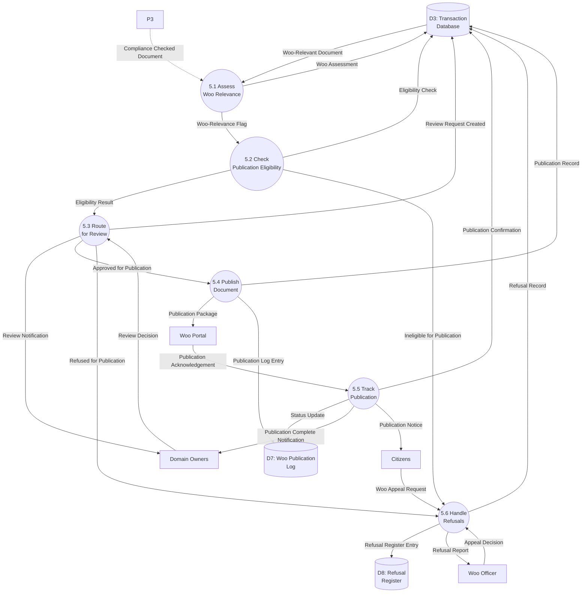
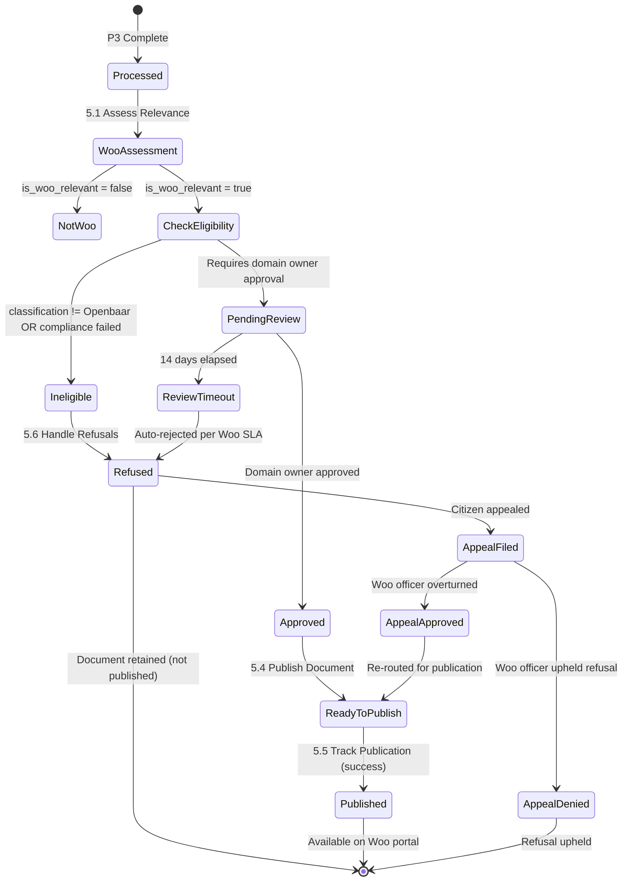

# Data Flow Diagram: IOU-Modern - Woo Publication

> **Template Origin**: Official | **ArcKit Version**: 4.3.1 | **Command**: `/arckit:dfd`

## Document Control

| Field | Value |
|-------|-------|
| **Document ID** | ARC-001-DFD-003-v1.0 |
| **Document Type** | Data Flow Diagram |
| **Project** | IOU-Modern (Project 001) |
| **Classification** | OFFICIAL |
| **Status** | DRAFT |
| **Version** | 1.0 |
| **Created Date** | 2026-03-26 |
| **Last Modified** | 2026-03-26 |
| **Review Cycle** | Per release |
| **Next Review Date** | 2026-04-25 |
| **Owner** | Solution Architect |
| **Reviewed By** | PENDING |
| **Approved By** | PENDING |
| **Distribution** | Architecture Team, Development Team, Data Governance Committee, Woo Officers |
| **DFD Level** | Level 2 (Process 5 Decomposition) |
| **Notation** | Yourdon-DeMarco |

## Revision History

| Version | Date | Author | Changes | Approved By | Approval Date |
|---------|------|--------|---------|-------------|---------------|
| 1.0 | 2026-03-26 | ArcKit AI | Initial creation from `/arckit:dfd` command | PENDING | PENDING |

---

## Executive Summary

This document contains a Level 2 Data Flow Diagram (DFD) for IOU-Modern, providing detailed decomposition of **Process 5: Woo Publication** from the Level 1 DFD. This process represents the Wet open overheid (Woo) publication workflow that assesses document eligibility, manages approval workflows, publishes to the Woo portal, and tracks publication status with full audit trail.

**Parent Process**: P5 (Woo Publication) from Level 1 DFD (ARC-001-DFD-001-v1.0)

**Scope**: Woo Publication workflow showing 6 sub-processes with detailed data flows between domain owners, the Woo portal, and internal data stores.

---

## Yourdon-DeMarco Notation Key

| Symbol | Shape | Description |
|--------|-------|-------------|
| **External Entity** | Rectangle | Source or sink of data outside the system boundary |
| **Process** | Circle | Transforms incoming data flows into outgoing data flows |
| **Data Store** | Open-ended rectangle (parallel lines) | Repository of data at rest |
| **Data Flow** | Named arrow | Data in motion between components |

---

## 1. Level 2 DFD - Process 5: Woo Publication Workflow

The Level 2 DFD decomposes Process 5 into 6 sub-processes representing the complete Woo publication lifecycle.

### 1.1 data-flow-diagram DSL

```dfd
title Level 2 DFD - Process 5: Woo Publication Workflow

store     D3         "D3: Transaction\nDatabase"
store     D7         "D7: Woo Publication\nLog"
store     D8         "D8: Refusal\nRegister"

process   P5_1       "5.1\nAssess Woo\nRelevance"
process   P5_2       "5.2\nCheck Publication\nEligibility"
process   P5_3       "5.3\nRoute for\nReview"
process   P5_4       "5.4\nPublish\nDocument"
process   P5_5       "5.5\nTrack\nPublication"
process   P5_6       "5.6\nHandle\nRefusals"

entity    DOM_OWNER  "Domain\nOwners"
entity    WOO_PORTAL "Woo\nPortal"
entity    CITIZEN    "Citizens"
entity    WOO_OFFICER "Woo\nOfficer"

D3       --> P5_1    "Woo-Relevant Document"
P3       --> P5_1    "Compliance Checked Document"

P5_1     --> D3      "Woo Assessment"
P5_1     --> P5_2    "Woo-Relevance Flag"

P5_2     --> D3      "Eligibility Check"
P5_2     --> P5_3    "Eligibility Result"

P5_3     --> D3      "Review Request Created"
P5_3     --> DOM_OWNER "Review Notification"
DOM_OWNER --> P5_3    "Review Decision"

P5_3     --> P5_4    "Approved for Publication"
P5_3     --> P5_6    "Refused for Publication"

P5_4     --> WOO_PORTAL "Publication Package"
WOO_PORTAL --> P5_5    "Publication Acknowledgement"

P5_4     --> D3      "Publication Record"
P5_4     --> D7      "Publication Log Entry"

P5_5     --> D7      "Status Update"
P5_5     --> D3      "Publication Confirmation"
P5_5     --> DOM_OWNER "Publication Complete Notification"

P5_2     --> P5_6    "Ineligible for Publication"
P5_6     --> D3      "Refusal Record"
P5_6     --> D8      "Refusal Register Entry"
P5_6     --> WOO_OFFICER "Refusal Report"

CITIZEN  --> P5_6    "Woo Appeal Request"
WOO_OFFICER --> P5_6 "Appeal Decision"

P5_5     --> CITIZEN "Publication Notice"
```

### 1.2 Mermaid (Approximate)



---

## 2. Process Specifications

| Process | Name | Inputs | Outputs | Logic Summary | Req. Trace |
|---------|------|--------|---------|---------------|------------|
| 5.1 | Assess Woo Relevance | Compliance-checked document from P3, Woo-relevant documents from D3 | Woo assessment, Woo-relevance flag | AI-assisted assessment determines if document falls under Woo (Wet open overheid) scope, assigns preliminary relevance score, flags for manual review if uncertain | FR-017, BR-021 |
| 5.2 | Check Publication Eligibility | Woo-relevance flag from P5.1, Document classification from D3 | Eligibility result | Validates that classification = Openbaar (required for Woo publication), checks that document has passed compliance check, verifies retention period allows publication | FR-016, FR-020, BR-025 |
| 5.3 | Route for Review | Eligibility result from P5.2, Review decision from Domain Owner | Review request created, Review notification sent to domain owner | Routes document to domain owner for approval if eligible, creates review task in D3, sends notification, tracks review timeout (14 days per Woo requirement) | FR-018, FR-019, BR-022, BR-026 |
| 5.4 | Publish Document | Approved for publication from P5.3, Document content from D2 | Publication package, Publication record, Publication log entry | Formats document according to Woo portal specifications, converts to required format (HTML/PDF), creates publication package, sends to Woo portal via API, stores publication record | FR-020, BR-023, BR-025 |
| 5.5 | Track Publication | Publication acknowledgement from Woo portal, Publication log entry from P5.4 | Status update, Publication confirmation, Notification to domain owner, Publication notice to citizen | Polls Woo portal for publication status, updates D7 and D3 with confirmation, sends completion notification, generates publication notice for public access | BR-025, BR-026 |
| 5.6 | Handle Refusals | Ineligible result from P5.2, Refused for publication from P5.3, Appeal request from citizen, Appeal decision from Woo officer | Refusal record, Refusal register entry, Refusal report, Updated status | Records refusal grounds in D8, generates refusal report for transparency, handles citizen appeals, updates document status based on appeal outcome | BR-024, BR-027 |

---

## 3. Data Store Descriptions

| Store | Name | Contents | Access Pattern | Retention | PII |
|-------|------|----------|----------------|-----------|-----|
| D3 | Transaction Database | Information objects, Documents, Woo assessments, Review tasks, Publication records, Refusal records | Read by all P5.x; Write by P5.1-P5.6 | 20 years (per Archiefwet for Besluit) | Yes (creator, reviewer) |
| D7 | Woo Publication Log | Woo publication_id, publication_date, document_id, status, confirmation_timestamp, Woo portal response | Read by P5.5; Write by P5.4, P5.5 | 20 years (linked to source document) | No (publication metadata only) |
| D8 | Refusal Register | Refusal_id, document_id, refusal_ground, date, appellant_id, appeal_decision, appeal_date | Read by P5.6, P5.1; Write by P5.6 | 20 years (per Woo transparency requirement) | Indirect (may contain stakeholder info) |

---

## 4. Data Dictionary

| Data Flow | Composition | Source | Destination | Format |
|-----------|-------------|--------|-------------|--------|
| Woo-Relevant Document | {document_id, title, classification, compliance_score, domain_id} | D3 | P5.1 | SQL result |
| Compliance Checked Document | {document_id, classification, woo_relevant, privacy_level, compliance_score} | P3 | P5.1 | JSON |
| Woo Assessment | {document_id, woo_relevant (yes/no), confidence_score, requires_manual_review} | P5.1 | D3 | JSON |
| Woo-Relevance Flag | {document_id, is_woo_relevant, assessment_date, assessed_by} | P5.1 | P5.2 | Boolean |
| Eligibility Check | {document_id, classification, woo_relevant, retention_valid, publication_allowed} | P5.2 | D3 | JSON result |
| Eligibility Result | {document_id, eligible (yes/no), reason, requires_approval} | P5.2 | P5.3 | JSON |
| Review Request Created | {review_id, document_id, domain_owner_id, created_date, due_date, status} | P5.3 | D3 | SQL insert |
| Review Notification | {review_id, document_title, review_url, due_date, priority} | P5.3 | DOM_OWNER | Email/Notification |
| Review Decision | {review_id, decision (approve/reject), reviewer_id, timestamp, comments} | DOM_OWNER | P5.3 | JSON API |
| Approved for Publication | {document_id, review_id, publication_date, approver_id} | P5.3 | P5.4 | JSON |
| Refused for Publication | {document_id, review_id, refusal_ground, rejecter_id} | P5.3 | P5.6 | JSON |
| Publication Package | {woo_document_id, document_id, title, content, metadata, publication_date, format} | P5.4 | WOO_PORTAL | REST API (JSON/XML) |
| Publication Acknowledgement | {woo_document_id, acknowledgement_id, timestamp, status} | WOO_PORTAL | P5.5 | API response |
| Publication Record | {document_id, woo_document_id, publication_date, status, published_by} | P5.4 | D3 | SQL insert |
| Publication Log Entry | {log_id, woo_document_id, document_id, action, timestamp, response} | P5.4 | D7 | Log entry |
| Status Update | {woo_document_id, old_status, new_status, timestamp} | P5.5 | D7 | Update |
| Publication Confirmation | {woo_document_id, confirmed_date, woo_url, access_count} | P5.5 | D3 | JSON |
| Publication Complete Notification | {document_id, woo_url, publication_date, domain_owner_id} | P5.5 | DOM_OWNER | Email |
| Ineligible for Publication | {document_id, reason, classification, blocked_by} | P5.2 | P5.6 | JSON |
| Refusal Record | {refusal_id, document_id, ground, date, recorded_by} | P5.6 | D3 | SQL insert |
| Refusal Register Entry | {refusal_id, document_id, ground_code, description, date} | P5.6 | D8 | SQL insert |
| Refusal Report | {refusal_id, document_title, grounds, legal_basis, explanation} | P5.6 | WOO_OFFICER | Report (PDF/HTML) |
| Woo Appeal Request | {document_id, citizen_name, appeal_reason, grounds, request_date} | CITIZEN | P5.6 | Web form/API |
| Appeal Decision | {appeal_id, decision (uphold/override), rationale, decided_by, date} | WOO_OFFICER | P5.6 | JSON |
| Publication Notice | {document_id, woo_url, title, publication_date, access_info} | P5.5 | CITIZEN | Public notice |
| Manual Classification Override | {document_id, new_classification, override_reason, approver_id} | DOM_OWNER | P5.2 | JSON API |
| Manual Compliance Override | {document_id, waive_compliance, waiver_reason, approver_id} | DOM_OWNER | P5.2 | JSON API |

---

## 5. Requirements Traceability

### 5.1 Business Requirements Traceability

| Business Req | Sub-Process | Data Store | Data Flow |
|--------------|-------------|------------|-----------|
| BR-021 | Auto-identify Woo documents | P5.1 | Woo Assessment |
| BR-022 | Human approval before publishing | P5.3 | Review Notification |
| BR-023 | Publish to Woo portal | P5.4 | Publication Package |
| BR-024 | Track refusal grounds | P5.6, D8 | Refusal Register Entry |
| BR-025 | Track Woo publication date | P5.4, P5.5 | Publication Record, Publication Confirmation |
| BR-026 | Woo publication workflow with audit trail | All P5.x, D7, D8 | All flows logged |
| BR-027 | Generate Woo decision documents | P5.6, P5.4 | Refusal Report, Publication Package |

### 5.2 Functional Requirements Traceability

| Functional Req | Sub-Process | Data Flow Trace |
|----------------|-------------|-----------------|
| FR-017 | P5.1 | Woo Assessment |
| FR-018 | P5.3 | Review Request Created, Review Notification |
| FR-019 | P5.3 | Review Decision |
| FR-020 | P5.4 | Publication Package |

### 5.3 Non-Functional Requirements Traceability

| NFR Category | NFR ID | DFD Implementation |
|--------------|--------|-------------------|
| Compliance | NFR-COMP-001 | All P5.x implement Woo compliance |
| Security | NFR-SEC-005 | All P5.x PII access logged to D7/D8 |
| Availability | NFR-AVAIL-001 | D7 provides publication resilience |
| Availability | NFR-AVAIL-002 | D8 refusal register provides backup |

---

## 6. Woo Publication Workflow State Machine

### 6.1 Document States



### 6.2 State Descriptions

| State | Description | Entry Condition | Exit Condition |
|-------|-------------|-----------------|---------------|
| Processed | Document has been processed by AI pipeline | P3 complete | Woo assessment triggered |
| NotWoo | Document not Woo-relevant | is_woo_relevant = false | Document archived normally |
| CheckEligibility | Checking if document can be published | Woo-relevant = true | Eligible or Ineligible |
| Ineligible | Cannot be published (wrong classification or compliance) | classification != Openbaar | Refusal process |
| PendingReview | Awaiting domain owner approval | Requires approval = true | Approved, rejected, or timeout |
| ReviewTimeout | Review period exceeded (14 days) | 14 days elapsed | Auto-rejected |
| Approved | Domain owner approved publication | Decision = approve | Publication preparation |
| Refused | Publication refused (ineligible or rejected) | Decision = reject OR Ineligible | Appeal period begins |
| ReadyToPublish | Document formatted and ready for Woo portal | Publication package prepared | Publication initiated |
| Published | Successfully published to Woo portal | Woo confirmation received | Publicly accessible |
| AppealFiled | Citizen has appealed refusal | Appeal request submitted | Appeal decision pending |
| AppealApproved | Appeal successful | Decision = overturned | Re-routed to publication |
| AppealDenied | Appeal unsuccessful | Decision = upheld | Refusal final |

---

## 7. DFD Balancing Check (Level 1 to Level 2)

| Level 1 Boundary Flow | Direction | Present at Level 2? | Notes |
|------------------------|-----------|---------------------|-------|
| DOM_OWNER → P5 (Review Approval) | In | ✅ Yes (DOM_OWNER → P5.3: Review Decision) | Flows through review subprocess |
| P5 → D3 (Update Document State) | Out | ✅ Yes (P5.1, P5.2, P5.3, P5.4, P5.5, P5.6 → D3) | Multiple sub-processes update D3 |
| P3 → P5 (Compliance Checked Document) | In | ✅ Yes (P3 → P5.1: Compliance Checked Document) | Input to assessment |
| D3 → P5 (Woo-Relevant Documents) | In | ✅ Yes (D3 → P5.1: Woo-Relevant Document) | Query for eligible documents |
| P5 → WOO_PORTAL (Approved Publication) | Out | ✅ Yes (P5.4 → WOO_PORTAL: Publication Package) | Primary output |
| WOO_PORTAL → P5 (Publication Confirmation) | In | ✅ Yes (WOO_PORTAL → P5.5: Publication Acknowledgement) | Status feedback loop |
| P5 → DOM_OWNER (Review Notification) | Out | ✅ Yes (P5.3 → DOM_OWNER: Review Notification) | Notification to domain owner |
| P5 → P5 (refused) → P5.6 | Internal | ✅ Yes (P5.3 → P5.6: Refused for Publication) | Internal routing for refusals |

**Balancing Status**: All flows balanced

---

## 8. Refusal Grounds Reference

| Refusal Ground Code | Description | Woo Article | Typical Use Case |
|---------------------|-------------|-------------|----------------|
| RG-001 | Persoonlijke levenssfeer (Personal life) | Art. 10.2(a) | Contains personal data about private individuals |
| RG-002 | Bedrijfsgevoelige informatie (Business confidential) | Art. 10.2(b) | Trade secrets or commercially sensitive information |
| RG-003 | Relation tot standaard (Relation to standard) | Art. 10.2(d) | Internal draft document or not yet finalized |
| RG-004 | Bescherming van persoonsgegevens (PII protection) | AVG/GDPR | Contains special category data without legal basis |
| RG-005 | Derdengrond (Danger to public order) | Art. 10.2(e) | Publication could endanger public safety |
| RG-006 | Internationale betrekkingen (International relations) | Art. 10.2(f) | Could affect international relations |
| RG-007 | Justitieel onderzoek (Judicial investigation) | Art. 10.2(g) | Document related to ongoing investigation |
| RG-008 | Belang van de staat (State interest) | Art. 10.2(h) | Could harm national security |
| RG-009 | Economische belangen (Economic interests) | Art. 10.2(i) | Could harm economic interests |
| RG-010 | Financiële belangen (Financial interests) | Art. 10.2(j) | Could harm financial stability |

---

## 9. Error Handling and Recovery

| Error Type | Detection | Recovery Process |
|------------|-----------|-------------------|
| Woo Portal Unavailable | P5.4 API timeout/failure | Queue for retry, log to D7, notify DOM_OWNER |
| Invalid Document Format | P5.4 validation failure | Return to P5.4 for reformatting, notify DOM_OWNER |
| Publication Confirmation Missing | P5.5 timeout (no acknowledgement within 24h) | Re-query Woo portal, escalate to Woo officer |
| Review Timeout | P5.3 14-day timer elapsed | Auto-reject per Woo SLA, notify DOM_OWNER and Woo officer |
| Classification Conflict | P5.2 detects conflicting classifications | P5.3 routes for manual review, flags to DOM_OWNER |
| Appeal Processing Error | P5.6 cannot record appeal decision | Log to D7, notify Woo officer, queue for retry |

---

## 10. Service Level Agreements

| SLA Item | Target | Measurement | Owner |
|-----------|--------|------------|-------|
| Woo Assessment Time | <1 hour after P3 complete | Time from P3 to P5.1 completion | AI Pipeline Team |
| Review Timeout | 14 calendar days | Time from P5.3 creation to decision | Domain Owner (auto-reject) |
| Publication Processing | <4 hours from approval | Time from P5.3 approval to P5.4 completion | Woo Integration Team |
| Woo Confirmation | Within 24 hours | Time from P5.4 publication to P5.5 confirmation | Woo Portal |
| Appeal Response | 30 days from appeal request | Time from CITIZEN appeal to WOO_OFFICER decision | Woo Officer |
| Refusal Report Generation | <5 business days | Time from refusal to report availability | Woo Officer |

---

## 11. Related Documents

| Document | ID |
|----------|-----|
| Parent DFD (Level 0-1) | ARC-001-DFD-001-v1.0 |
| Level 2 DFD (AI Pipeline) | ARC-001-DFD-002-v1.0 |
| Requirements | ARC-001-REQ-v1.1 |
| Data Model | ARC-001-DATA-v1.0 |
| Architecture Diagrams | ARC-001-DIAG-v1.0 |
| ADR | ARC-001-ADR-v1.0 |
| DPIA | ARC-001-DPIA-v1.0.md |

---

**END OF DATA FLOW DIAGRAM**

## Generation Metadata

**Generated by**: ArcKit `/arckit:dfd` command
**Generated on**: 2026-03-26 18:45 GMT
**ArcKit Version**: 4.3.1
**Project**: IOU-Modern (Project 001)
**AI Model**: Claude Opus 4.6
**DFD Level**: Level 2 - Process 5 (Woo Publication) Decomposition
**Parent Document**: ARC-001-DFD-001-v1.0
