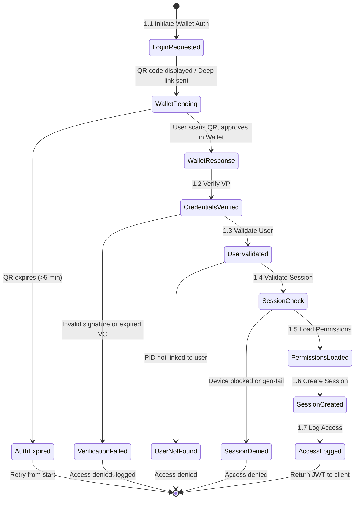

# Data Flow Diagram: IOU-Modern - Authenticate & Authorize

> **Template Origin**: Official | **ArcKit Version**: 4.3.1 | **Command**: `/arckit:dfd`

## Document Control

| Field | Value |
|-------|-------|
| **Document ID** | ARC-001-DFD-004-v1.0 |
| **Document Type** | Data Flow Diagram |
| **Project** | IOU-Modern (Project 001) |
| **Classification** | OFFICIAL |
| **Status** | DRAFT |
| **Version** | 1.0 |
| **Created Date** | 2026-03-26 |
| **Last Modified** | 2026-03-26 |
| **Review Cycle** | Per release |
| **Next Review Date** | 2026-04-25 |
| **Owner** | Solution Architect |
| **Reviewed By** | PENDING |
| **Approved By** | PENDING |
| **Distribution** | Architecture Team, Development Team, Security Team, Data Governance Committee |
| **DFD Level** | Level 2 (Process 1 Decomposition) |
| **Notation** | Yourdon-DeMarco |

## Revision History

| Version | Date | Author | Changes | Approved By | Approval Date |
|---------|------|--------|---------|-------------|---------------|
| 1.0 | 2026-03-26 | ArcKit AI | Initial creation from `/arckit:dfd` command | PENDING | PENDING |

---

## Executive Summary

This document contains a Level 2 Data Flow Diagram (DFD) for IOU-Modern, providing detailed decomposition of **Process 1: Authenticate & Authorize** from the Level 1 DFD. This process represents the security-critical authentication and authorization pipeline that handles Dutch Wallet (nl wallet) integration using OpenID for Identity Signing (OpenID4VP/SIOP), role-based access control (RBAC), domain-scoped permissions, and session management.

**Parent Process**: P1 (Authenticate & Authorize) from Level 1 DFD (ARC-001-DFD-001-v1.0)

**Scope**: Authentication and authorization workflow showing 7 sub-processes with detailed data flows between Dutch Wallet, user records, session management, and audit logging.

**Authentication Method**: Dutch Wallet (nl wallet) using OpenID4VP/SIOP protocol with Verifiable Credentials (VCs). No passwords, no DigiD - fully wallet-based authentication.

---

## Yourdon-DeMarco Notation Key

| Symbol | Shape | Description |
|--------|-------|-------------|
| **External Entity** | Rectangle | Source or sink of data outside the system boundary |
| **Process** | Circle | Transforms incoming data flows into outgoing data flows |
| **Data Store** | Open-ended rectangle (parallel lines) | Repository of data at rest |
| **Data Flow** | Named arrow | Data in motion between components |

---

## 1. Level 2 DFD - Process 1: Authentication & Authorization

The Level 2 DFD decomposes Process 1 into 7 sub-processes representing the complete Dutch Wallet-based authentication and authorization lifecycle.

### 1.1 data-flow-diagram DSL

```dfd
title Level 2 DFD - Process 1: Dutch Wallet Authentication

store     D1         "D1: User\nRecords"
store     D9         "D9: Session\nStore"
store     D10        "D10: Audit\nLog"

process   P1_1       "1.1\nInitiate\nWallet Auth"
process   P1_2       "1.2\nVerify Wallet\nCredentials"
process   P1_3       "1.3\nValidate\nUser"
process   P1_4       "1.4\nValidate\nSession"
process   P1_5       "1.5\nLoad\nPermissions"
process   P1_6       "1.6\nCreate\nSession"
process   P1_7       "1.7\nLog Access"

entity    GOV_EMP    "Government\nEmployees"
entity    ADMIN      "Administrators"
entity    NL_WALLET  "NL Wallet\nApp"

GOV_EMP  --> P1_1    "Login Request"
P1_1     --> GOV_EMP "Wallet Request (QR/Deep Link)"
GOV_EMP  --> P1_2    "Wallet Response (VP)"
P1_2     --> D1      "User Lookup by PID"
D1       --> P1_2    "User Record"
P1_2     --> P1_3    "Verified Identity"

P1_3     --> P1_4    "User Status"
P1_4     --> D1      "Session Validation"
D1       --> P1_4    "Session Status"

P1_4     --> P1_5    "Session Validated"
P1_5     --> D1      "Permission Lookup"
D1       --> P1_5    "Roles & Domain Scopes"
P1_5     --> P1_6    "Authorization Context"

P1_6     --> D9      "Session Record"
P1_6     --> D1      "Update Last Login"
P1_6     --> GOV_EMP "Session Token (JWT)"

P1_6     --> P1_7    "Session Created Event"
P1_7     --> D10     "Audit Entry"

ADMIN    --> D1      "Role Assignment"
ADMIN    --> D10     "Admin Log Entry"
```

### 1.2 Mermaid (Approximate)

```mermaid
flowchart TB
    D1[("D1: User<br/>Records")]
    D9[("D9: Session<br/>Store")]
    D10[("D10: Audit<br/>Log")]

    P1_1(("1.1 Initiate<br/>Wallet Auth"))
    P1_2(("1.2 Verify Wallet<br/>Credentials"))
    P1_3(("1.3 Validate<br/>User"))
    P1_4(("1.4 Validate<br/>Session"))
    P1_5(("1.5 Load<br/>Permissions"))
    P1_6(("1.6 Create<br/>Session"))
    P1_7(("1.7 Log Access"))

    GOV_EMP["Government Employees"]
    ADMIN["Administrators"]
    NL_WALLET["NL Wallet App"]

    GOV_EMP -->|Login Request| P1_1
    P1_1 -->|Wallet Request (QR/Deep Link)| GOV_EMP
    GOV_EMP -->|Wallet Response (VP)| P1_2

    P1_2 <-->|User Lookup / Record| D1
    P1_2 -->|Verified Identity| P1_3

    P1_3 -->|User Status| P1_4
    P1_4 <-->|Session Validation / Status| D1
    P1_4 -->|Session Validated| P1_5

    P1_5 <-->|Permission Lookup / Roles & Domain Scopes| D1
    P1_5 -->|Authorization Context| P1_6

    P1_6 -->|Session Record| D9
    P1_6 -->|Update Last Login| D1
    P1_6 -->|Session Token (JWT)| GOV_EMP

    P1_6 -->|Session Created Event| P1_7
    P1_7 -->|Audit Entry| D10

    ADMIN -->|Role Assignment| D1
    ADMIN -->|Admin Log Entry| D10

    GOV_EMP -.->|Scan QR / Open App| NL_WALLET
    NL_WALLET -.->|Verifiable Presentation| GOV_EMP
```

---

## 2. Process Specifications

| Process | Name | Inputs | Outputs | Logic Summary | Req. Trace |
|---------|------|--------|---------|---------------|------------|
| 1.1 | Initiate Wallet Auth | Login request from GOV_EMP | Wallet request (QR code or deep link) to GOV_EMP | Generates OpenID4VP authorization request, creates QR code containing wallet_request_uri, or generates deep link for mobile wallet, sets transaction state, protects against rate limiting | NFR-SEC-008 |
| 1.2 | Verify Wallet Credentials | Wallet response (Verifiable Presentation) from GOV_EMP, User record from D1 | Verified identity to P1.3 | Validates Verifiable Presentation (VP) from Dutch Wallet, verifies signature using trusted issuer DIDs, extracts Personal Identifier (PID) or BSN-derived identifier, checks credential freshness (not expired, not revoked), maps to local user identity | FR-001, NFR-SEC-003 |
| 1.3 | Validate User | Verified identity from P1.2 | User status to P1.4 | Checks user record status (active, not suspended), verifies organization membership, validates employee status, performs risk-based authentication check (location, device fingerprint), returns user profile if valid | FR-002, NFR-SEC-004 |
| 1.4 | Validate Session | User status from P1.3, Session status from D1 | Session validated to P1.5 | Performs additional session validation checks: device binding (wallet device fingerprint), geo-fencing validation (optional per org policy), time-of-day restrictions, concurrent session limits, returns validated session context | FR-005, NFR-SEC-003 |
| 1.5 | Load Permissions | Session validated from P1.4, Roles from D1 | Authorization context to P1.6 | Retrieves all user roles from D1, loads domain-scoped permissions per role, aggregates permissions across roles, applies RBAC rules (FR-002, FR-003), prepares authorization context with privilege levels | FR-002, FR-003 |
| 1.6 | Create Session | Authorization context from P1.5 | Session token to GOV_EMP, Session record to D9, Event to P1.7 | Generates JWT token (15min expiry), includes claims (user_id, pid_hash, roles[], domain_scopes[], auth_method: "wallet", auth_time, exp), creates session record in D9 with device binding, updates last_login timestamp in D1, returns token to client | FR-004, NFR-SEC-001 |
| 1.7 | Log Access | Session created event from P1.6 | Audit entry to D10 | Creates immutable audit log entry with timestamp, user_id, pid_hash, auth_method: "wallet", wallet_id_hash, ip_address, device_fingerprint, session_id, credential_types[], supports forensic analysis and compliance reporting | FR-004, NFR-SEC-005 |

---

## 3. Data Store Descriptions

| Store | Name | Contents | Access Pattern | Retention | PII |
|-------|------|----------|----------------|-----------|-----|
| D1 | User Records | user_id, pid_hash, did, email, name, department, roles[], domain_scopes[], last_login, status, device_fingerprint[], organization_id | Read by P1.2, P1.4, P1.5; Write by P1.6, ADMIN | 7 years post-employment (AVG requirement) | Yes (email, name, PID-derived ID) |
| D9 | Session Store | session_id, user_id, pid_hash, jwt_hash, created_at, expires_at, ip_address, device_fingerprint, wallet_did_hash, refresh_token | Read by token validation; Write by P1.6 | Session lifetime (15min access token, 7day refresh token) | Yes (IP address, device fingerprint, wallet DID hash) |
| D10 | Audit Log | audit_id, timestamp, event_type, user_id, pid_hash, auth_method, credential_types[], ip_address, device_fingerprint, result, session_id | Write only (append-only) | 7 years (NFR-COMP-005) | Yes (IP address, device fingerprint, PID hash) |

---

## 4. Data Dictionary

| Data Flow | Composition | Source | Destination | Format |
|-----------|-------------|--------|-------------|--------|
| Login Request | {client_id, redirect_uri, scope, response_type} | GOV_EMP | P1.1 | HTTPS POST |
| Wallet Request | {request_uri, qr_code_data, deep_link, expires_at} | P1.1 | GOV_EMP | JSON (QR data) or URL |
| Wallet Response (VP) | {vp_jwt, presentation_submission, credential_types[], holder_did} | GOV_EMP | P1.2 | Signed JWT (SD-JWT) |
| User Lookup by PID | {pid_hash, did} | P1.2 | D1 | SQL query |
| User Record | {user_id, pid_hash, did, email, name, department, roles[], domain_scopes[], status, organization_id, device_fingerprint[]} | D1 | P1.2 | JSON result |
| Verified Identity | {user_id, pid_hash, did, name, credential_types[], auth_timestamp} | P1.2 | P1.3 | JSON |
| User Status | {user_id, status, risk_score, device_trusted, organization_id} | P1.3 | P1.4 | JSON |
| Session Validation | {user_id, device_fingerprint, session_check_type} | P1.4 | D1 | SQL query |
| Session Status | {session_allowed, max_sessions, active_sessions[], device_valid} | D1 | P1.4 | JSON result |
| Session Validated | {user_id, device_bound, geo_valid, time_valid} | P1.4 | P1.5 | JSON |
| Permission Lookup | {user_id, timestamp} | P1.5 | D1 | SQL query |
| Roles & Domain Scopes | {user_id, roles[{role_id, domain_scopes[], permissions[]}]} | D1 | P1.5 | JSON result |
| Authorization Context | {user_id, pid_hash, roles[], permissions[], domain_scopes[], auth_method, expiry} | P1.5 | P1.6 | JSON |
| Session Token | {jwt_header, jwt_payload{user_id, pid_hash, roles[], domain_scopes[], auth_method: "wallet", exp, iat}, jwt_signature} | P1.6 | GOV_EMP | JWT (RS256) |
| Session Record | {session_id, user_id, pid_hash, jwt_hash, created_at, expires_at, ip_address, device_fingerprint, wallet_did_hash} | P1.6 | D9 | Redis / SQL |
| Update Last Login | {user_id, last_login, login_ip, wallet_did_hash} | P1.6 | D1 | SQL update |
| Session Created Event | {session_id, user_id, auth_method: "wallet", credential_types[], timestamp} | P1.6 | P1.7 | Event |
| Audit Entry | {audit_id, timestamp, event_type, user_id, pid_hash, auth_method: "wallet", credential_types[], ip_address, device_fingerprint, result, session_id} | P1.7 | D10 | Immutable log |
| Role Assignment | {user_id, role_id, domain_id, assigned_by, assigned_at} | ADMIN | D1 | SQL insert |
| Admin Log Entry | {audit_id, timestamp, event_type, admin_id, action, target_user_id} | ADMIN | D10 | Immutable log |

---

## 5. Dutch Wallet Authentication Protocol

### 5.1 OpenID4VP/SIOP Flow

```
1. P1.1: Generate authorization request
   ├─ Create request_uri with nonce, state, client_id
   ├─ Generate QR code containing: openid://?request_uri=...
   └─ Store transaction state (expires in 5 min)

2. GOV_EMP: User scans QR with NL Wallet app
   ├─ Wallet receives authorization request
   └─ User selects credentials to share

3. P1.2: Receive Verifiable Presentation
   ├─ Validate VP signature (issuer DID)
   ├─ Check credential freshness (exp, revoked)
   ├─ Extract PID/BSN from credentials
   └─ Verify against trusted issuer list

4. P1.3-P1.7: Complete session creation
```

### 5.2 Supported Credential Types

| Credential Type | Issuer | Required For | Description |
|-----------------|--------|--------------|-------------|
| **PID** (Personal Identifier) | Rijksoverheid (DigiD) | All users | BSN-derived pseudonymous identifier |
| **Overheidsidentiteit** | Rijksoverheid | Government employees | Employee identity credential |
| **Organisatie Credential** | Organization | Domain-specific | Organization-specific attributes |
| **Age Credential** | Rijksoverheid | Age verification | Age verification (over/under 18) |

### 5.3 DID Trust Anchors

| Issuer DID | Purpose | Verification |
|------------|---------|--------------|
| did:web:rijksoverheid.nl | PID credentials | Trusted root certificate |
| did:web:organization.nl | Organization credentials | Per-org trust anchor |
| did:key:wallet | Wallet DID | Ephemeral, per-session |

---

## 6. Requirements Traceability

### 6.1 Business Requirements Traceability

| Business Req | Sub-Process | Data Store | Data Flow |
|--------------|-------------|------------|-----------|
| BR-007 (Multi-tenancy) | P1.3, P1.5 | D1 | User Record (organization_id) |
| BR-033 (PII access logging) | P1.7 | D10 | Audit Entry |
| BR-041 (Human oversight) | P1.4 | - | Session validation (human factor) |

### 6.2 Functional Requirements Traceability

| Functional Req | Sub-Process | Data Flow Trace |
|----------------|-------------|-----------------|
| FR-001 (Wallet authentication) | P1.2 | Wallet Request → Wallet Response (VP) |
| FR-002 (RBAC) | P1.5 | Roles & Domain Scopes |
| FR-003 (Domain-scoped permissions) | P1.5 | Authorization Context (domain_scopes[]) |
| FR-004 (Login history) | P1.6, D1 | Update Last Login |
| FR-005 (Session validation) | P1.4 | Session Validation |

### 6.3 Non-Functional Requirements Traceability

| NFR Category | NFR ID | DFD Implementation |
|--------------|--------|-------------------|
| Security | NFR-SEC-001 | D1, D9, D10 encryption at rest (AES-256) |
| Security | NFR-SEC-002 | All data flows TLS 1.3 |
| Security | NFR-SEC-003 | P1.2 (Wallet VCs) + P1.4 (Session validation) |
| Security | NFR-SEC-004 | P1.5 (RBAC + domain-scoped) |
| Security | NFR-SEC-005 | P1.7 (audit logging) |
| Security | NFR-SEC-008 | P1.1 (rate limiting) |
| Performance | NFR-PERF-003 | P1.2, P1.6 API response (<500ms) |
| Availability | NFR-AVAIL-001 | D9 session store (primary/replica) |
| Compliance | NFR-COMP-005 | D10 7-year log retention |

---

## 7. DFD Balancing Check (Level 1 to Level 2)

| Level 1 Boundary Flow | Direction | Present at Level 2? | Notes |
|------------------------|-----------|---------------------|-------|
| GOV_EMP → P1 (Login Credentials) | In | ✅ Yes (GOV_EMP → P1.1: Login Request) | Entry point for authentication |
| P1 ↔ NL_WALLET (Wallet Request/Response) | Bidirectional | ✅ Yes (P1.1 → GOV_EMP → NL_WALLET → GOV_EMP → P1.2) | OpenID4VP flow via wallet |
| P1 → D1 (User Lookup) | Out | ✅ Yes (P1.2, P1.4, P1.5, P1.6 → D1) | Multiple lookups, writes |
| D1 → P1 (User Permissions) | In | ✅ Yes (D1 → P1.2: User Record; D1 → P1.5: Roles & Domain Scopes) | Read flows preserved |
| P1 → GOV_EMP (Session Token) | Out | ✅ Yes (P1.6 → GOV_EMP: Session Token) | Primary output preserved |
| ADMIN → P1 (Role Assignment) | In | ✅ Yes (ADMIN → D1: Role Assignment) | Admin flow to D1 |

**Balancing Status**: All flows balanced

---

## 8. Authentication Flow State Machine

### 8.1 Authentication States



### 8.2 State Descriptions

| State | Description | Entry Condition | Exit Condition |
|-------|-------------|-----------------|---------------|
| LoginRequested | Initial login request, QR generation | User clicks login | Display QR code |
| WalletPending | Awaiting wallet interaction | QR code displayed | User scans and approves |
| AuthExpired | QR/deep link expired | 5 minutes elapsed | Require retry |
| WalletResponse | Wallet returns Verifiable Presentation | User approved in wallet | Verify VP |
| CredentialsVerified | VP validated successfully | Signature valid, credentials fresh | Proceed to user validation |
| VerificationFailed | VP validation failed | Invalid/expired credentials | Reject, log attempt |
| UserValidated | User record found and active | D1 lookup successful | Check session validation |
| UserNotFound | PID not linked to user account | D1 lookup failed | Reject, log attempt |
| SessionCheck | Performing additional session validation | User validated | Validate device/geo |
| SessionDenied | Session validation failed | Device blocked or geo violation | Reject, log attempt |
| PermissionsLoaded | User permissions retrieved | RBAC lookup complete | Create session |
| SessionCreated | JWT token generated and session stored | Session record written | Log access |
| AccessLogged | Audit log entry created | Log entry written | Return token to client |

---

## 9. Security Considerations

### 9.1 Trust Boundaries

| Boundary | Description | Controls |
|----------|-------------|----------|
| Public Internet → Application | All external traffic | TLS 1.3, WAF, rate limiting |
| Application → NL Wallet | OpenID4VP exchange | Wallet-to-Verifier protocol, DID signature validation |
| Application → User Records | Database access | Row-Level Security (RLS), connection pooling |
| Application → Session Store | Redis/database access | Network isolation, encryption at rest |
| Application → Audit Log | Immutable logging | Append-only storage, cryptographic chaining |

### 9.2 Threat Mitigation

| Threat | Mitigation | Process |
|---------|-----------|---------|
| QR code tampering | Signed request_uri, short expiry (5 min) | P1.1 |
| Wallet cloning | Device binding, biometric in wallet | P1.4, Wallet app |
| VP replay attacks | Nonce in request, JWT jti claim, freshness check | P1.2 |
| Privilege escalation | Role inheritance validation, domain-scoped permissions | P1.5 |
| Man-in-the-middle | DID signature verification, TLS 1.3 | P1.2 |
| Audit tampering | Append-only D10, cryptographic hashing | P1.7 |
| PID exposure | Hash PID on receipt, never store raw BSN | P1.2, P1.3 |
| Device swapping | Device fingerprint validation, trusted device list | P1.4 |

### 9.3 PII Data Flows

| Data Flow | PII Type | Legal Basis | Protection |
|-----------|----------|-------------|------------|
| Wallet Response (VP) | PID (BSN-derived), name, DOB | AVG Art 6(1)(e) - public task | User-controlled disclosure, TLS, hashed PID |
| User Record | Email, name, department, roles | AVG Art 6(1)(c) - legal obligation | AES-256, RLS, access logging |
| Session Record | IP address, device fingerprint, wallet DID | AVG Art 6(1)(f) - legitimate interest | Encrypted, session-scoped |
| Audit Entry | IP address, device fingerprint, PID hash | AVG Art 6(1)(f) - legitimate interest | Immutable log, 7-year retention |

---

## 10. Error Handling and Recovery

| Error Type | Detection | Recovery Process |
|------------|-----------|-------------------|
| Invalid VP | P1.2 signature validation failure | Return generic error, log attempt to D10, require retry |
| Expired Credential | P1.2 freshness check (exp, revoked) | Return "credential expired", prompt user to refresh in Wallet |
| User Not Found | P1.3 D1 lookup returns null (PID not linked) | Return "not authorized", log attempt, admin can link PID to user |
| Suspended User | P1.3 D1 status = suspended | Return "account suspended" with contact info, log to D10 |
| Device Not Trusted | P1.4 device fingerprint not in trusted list | Require additional admin approval, log security event |
| Session Limit Exceeded | P1.4 too many concurrent sessions | Return "session limit reached", force logout oldest |
| QR Expired | P1.1 5-minute timeout | Generate new QR, user must rescan |
| Wallet Unavailable | Timeout waiting for wallet response | Allow retry, generate new QR, log incident |
| Session Creation Failed | P1.6 D9 write error | Return server error, log to D10, alert ops team |
| Audit Log Failure | P1.7 D10 write error | Continue (session created), flag for async retry, alert ops team |

---

## 11. Service Level Agreements

| SLA Item | Target | Measurement | Owner |
|-----------|--------|------------|-------|
| Authentication Latency | <500ms (end-to-end, excluding wallet) | Time from Login Request to Session Token | Security Team |
| QR Code Generation | <100ms | Time from Login Request to QR display | Auth Service Team |
| VP Verification | <300ms | Time from Wallet Response to Verified Identity | Security Team |
| Session Creation | <100ms | Time from Authorization Context to JWT generated | Auth Service Team |
| Audit Log Write | <50ms | Time from event to D10 write confirmation | Audit Team |
| QR Expiry | 5 minutes | QR code validity window | Security Team |
| Token Expiry | 15 minutes (access token) | JWT exp claim | Security Team |
| Refresh Token Expiry | 7 days | Refresh token validity | Security Team |

---

## 12. Technology Stack Notes

| Sub-Process | Technology | Notes |
|-------------|------------|-------|
| P1.1 Initiate Wallet Auth | OpenID4VP library, QR generator | python-openid4vp, qrcode |
| P1.2 Verify Wallet Credentials | DID resolver, SD-JWT verifier | did-peer, pyjwt |
| P1.3 Validate User | ORM / SQLAlchemy | PostgreSQL with connection pooling |
| P1.4 Validate Session | Device fingerprint library, GeoIP | FingerprintJS, MaxMind GeoIP |
| P1.5 Load Permissions | RBAC engine | Casbin or custom policy engine |
| P1.6 Create Session | JWT library, Session store | PyJWT, Redis/Django cache |
| P1.7 Log Access | Audit logger | Immutable append-only log (PostgreSQL + WAL) |
| D9 Session Store | Redis Cluster | In-memory with persistence |
| D10 Audit Log | PostgreSQL with WAL | Append-only, table with trigger protection |

---

## 13. Related Documents

| Document | ID |
|----------|-----|
| Parent DFD (Level 0-1) | ARC-001-DFD-001-v1.0 |
| Requirements | ARC-001-REQ-v1.1 |
| Data Model | ARC-001-DATA-v1.0 |
| Architecture Diagrams | ARC-001-DIAG-v1.0 |
| ADR | ARC-001-ADR-v1.0 |
| DPIA | ARC-001-DPIA-v1.0.md |
| Risk Register | ARC-001-RISK-v1.0.md |

---

## 14. Rendering Tools

| Tool | Type | Yourdon-DeMarco | How to Use |
|------|------|-----------------|------------|
| **data-flow-diagram** | CLI (Python) | True notation | `pip install data-flow-diagram` then `dfd < file.dfd` |
| **Mermaid** | Text-to-diagram | Approximate | Paste into [mermaid.live](https://mermaid.live) or view in GitHub |
| **draw.io** | Online editor | True notation | Open [app.diagrams.net](https://app.diagrams.net), enable "Data Flow Diagrams" shapes |
| **Visual Paradigm** | Online editor | True notation | [online.visual-paradigm.com](https://online.visual-paradigm.com) |

---

**END OF DATA FLOW DIAGRAM**

## Generation Metadata

**Generated by**: ArcKit `/arckit:dfd` command
**Generated on**: 2026-03-26 19:15 GMT
**ArcKit Version**: 4.3.1
**Project**: IOU-Modern (Project 001)
**AI Model**: Claude Opus 4.6
**DFD Level**: Level 2 - Process 1 (Authenticate & Authorize) Decomposition
**Parent Document**: ARC-001-DFD-001-v1.0
**Authentication Method**: Dutch Wallet (OpenID4VP/SIOP) - No DigiD
