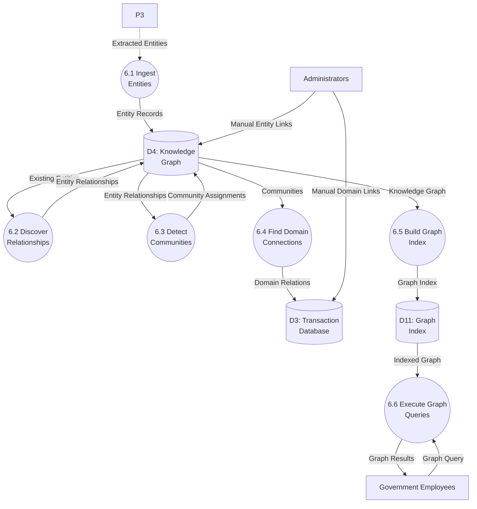

# Data Flow Diagram: IOU-Modern - Knowledge Graph

> **Template Origin**: Official | **ArcKit Version**: 4.3.1 | **Command**: `/arckit:dfd`

## Document Control

| Field | Value |
|-------|-------|
| **Document ID** | ARC-001-DFD-005-v1.0 |
| **Document Type** | Data Flow Diagram |
| **Project** | IOU-Modern (Project 001) |
| **Classification** | OFFICIAL |
| **Status** | DRAFT |
| **Version** | 1.0 |
| **Created Date** | 2026-03-26 |
| **Last Modified** | 2026-03-26 |
| **Review Cycle** | Per release |
| **Next Review Date** | 2026-04-25 |
| **Owner** | Solution Architect |
| **Reviewed By** | PENDING |
| **Approved By** | PENDING |
| **Distribution** | Architecture Team, Development Team, Data Governance Committee, Knowledge Graph Team |
| **DFD Level** | Level 2 (Process 6 Decomposition) |
| **Notation** | Yourdon-DeMarco |

## Revision History

| Version | Date | Author | Changes | Approved By | Approval Date |
|---------|------|--------|---------|-------------|---------------|
| 1.0 | 2026-03-26 | ArcKit AI | Initial creation from `/arckit:dfd` command | PENDING | PENDING |

---

## Executive Summary

This document contains a Level 2 Data Flow Diagram (DFD) for IOU-Modern, providing detailed decomposition of **Process 6: Knowledge Graph** from the Level 1 DFD. This process represents the GraphRAG-based knowledge graph construction and maintenance pipeline that builds entity relationships, performs community detection, discovers cross-domain connections, and enables semantic search through graph traversal.

**Parent Process**: P6 (Knowledge Graph) from Level 1 DFD (ARC-001-DFD-001-v1.0)

**Scope**: Knowledge Graph workflow showing 6 sub-processes with detailed data flows between entities, relationships, communities, domain connections, and graph queries.

**Technology**: GraphRAG (Graph-based Retrieval Augmented Generation) with ArangoDB as the graph database.

---

## Yourdon-DeMarco Notation Key

| Symbol | Shape | Description |
|--------|-------|-------------|
| **External Entity** | Rectangle | Source or sink of data outside the system boundary |
| **Process** | Circle | Transforms incoming data flows into outgoing data flows |
| **Data Store** | Open-ended rectangle (parallel lines) | Repository of data at rest |
| **Data Flow** | Named arrow | Data in motion between components |

---

## 1. Level 2 DFD - Process 6: Knowledge Graph

The Level 2 DFD decomposes Process 6 into 6 sub-processes representing the complete knowledge graph lifecycle.

### 1.1 data-flow-diagram DSL

```dfd
title Level 2 DFD - Process 6: Knowledge Graph Pipeline

store     D3         "D3: Transaction\nDatabase"
store     D4         "D4: Knowledge\nGraph"
store     D11        "D11: Graph\nIndex"

process   P6_1       "6.1\nIngest\nEntities"
process   P6_2       "6.2\nDiscover\nRelationships"
process   P6_3       "6.3\nDetect\nCommunities"
process   P6_4       "6.4\nFind Domain\nConnections"
process   P6_5       "6.5\nBuild Graph\nIndex"
process   P6_6       "6.6\nExecute Graph\nQueries"

entity    GOV_EMP    "Government\nEmployees"
entity    ADMIN      "Administrators"

P3       --> P6_1    "Extracted Entities"
P6_1     --> D4      "Entity Records"
D4       --> P6_2    "Existing Entities"

P6_2     --> D4      "Entity Relationships"
D4       --> P6_3    "Entity Relationships"

P6_3     --> D4      "Community Assignments"
D4       --> P6_4    "Communities"

P6_4     --> D3      "Domain Relations"
D4       --> P6_5    "Knowledge Graph"

P6_5     --> D11     "Graph Index"
D11      --> P6_6    "Indexed Graph"

GOV_EMP  --> P6_6    "Graph Query"
P6_6     --> GOV_EMP "Graph Results"

ADMIN    --> D4       "Manual Entity Links"
ADMIN    --> D3       "Manual Domain Links"
```

### 1.2 Mermaid (Approximate)



---

## 2. Process Specifications

| Process | Name | Inputs | Outputs | Logic Summary | Req. Trace |
|---------|------|--------|---------|---------------|------------|
| 6.1 | Ingest Entities | Extracted entities from P3, Manual entity links from ADMIN | Entity records to D4 | Deduplicates entities against existing records, canonicalizes entity names, assigns entity IDs, links entities to source documents and domains, handles Person entity privacy (BR-045 opt-out) | FR-023, FR-024, BR-045 |
| 6.2 | Discover Relationships | Existing entities from D4 | Entity relationships to D4 | GraphRAG algorithm discovers relationships between entities, identifies relationship types (WorksFor, LocatedIn, SubjectTo, RefersTo, etc.), calculates relationship strength and confidence, resolves entity aliases to canonical names | FR-026, BR-036, BR-037 |
| 6.3 | Detect Communities | Entity relationships from D4 | Community assignments to D4 | Hierarchical community detection (Leiden/Louvain algorithm), clusters densely connected entities, generates community summaries and keywords, assigns community levels (topic hierarchy) | FR-027, BR-036, BR-037 |
| 6.4 | Find Domain Connections | Communities from D4, Existing domains from D3 | Domain relations to D3 | Discovers cross-domain relationships via shared entities, semantic similarity between domain embeddings, temporal overlap, shared stakeholders, generates relation explanation and strength score | FR-011, BR-008 |
| 6.5 | Build Graph Index | Knowledge graph from D4 | Graph index to D11 | Builds traversal indexes for graph queries, creates adjacency lists, precomputes common query paths, generates vector embeddings for graph entities, optimizes for graph traversal performance | FR-028, FR-031 |
| 6.6 | Execute Graph Queries | Indexed graph from D11, Graph query from GOV_EMP | Graph results to GOV_EMP | Executes graph traversal queries (find shortest path, neighbors within N hops, related entities, domain-adjacent entities), combines graph results with full-text search, applies access control to PII entities | FR-028, FR-029, FR-030, NFR-SEC-004 |

---

## 3. Data Store Descriptions

| Store | Name | Contents | Access Pattern | Retention | PII |
|-------|------|----------|----------------|-----------|-----|
| D3 | Transaction Database | Information domains, Information objects, Domain relations, Manual domain links | Read by P6.4; Write by P6.4, ADMIN | 20 years maximum | Indirect (metadata) |
| D4 | Knowledge Graph | Entities (Person, Organization, Location, Law, etc.), Entity relationships, Communities, Community memberships, Manual entity links | Read by P6.1-P6.6; Write by P6.1-P6.4, ADMIN | 20 years (linked to source) | Yes (Person entity names) |
| D11 | Graph Index | Adjacency lists, Traversal indexes, Entity embeddings, Query caches, Precomputed paths | Read by P6.6; Write by P6.5 | Version-controlled (rebuild on graph update) | Indirect (derived from entities) |

---

## 4. Data Dictionary

| Data Flow | Composition | Source | Destination | Format |
|-----------|-------------|--------|-------------|--------|
| Extracted Entities | {document_id, entities[{type, name, confidence, start_pos, end_pos}]} | P3 (NER) | P6.1 | JSON |
| Entity Records | {entity_id, name, canonical_name, entity_type, source_document_id, source_domain_id, confidence, metadata} | P6.1 | D4 | Graph insert |
| Existing Entities | {entity_id, canonical_name, entity_type, relationship_count, community_id} | D4 | P6.2, P6.3 | Graph query |
| Entity Relationships | {source_entity_id, target_entity_id, relationship_type, weight, confidence, context, source_domain_id} | P6.2 | D4 | Graph edge insert |
| Community Assignments | {community_id, entity_id, level, membership_strength} | P6.3 | D4 | Graph property update |
| Communities | {community_id, name, level, member_entity_ids[], summary, keywords} | D4 | P6.4 | Graph query |
| Domain Relations | {relation_id, from_domain_id, to_domain_id, relation_type, strength, discovery_method, shared_entities[], explanation} | P6.4 | D3 | SQL insert |
| Knowledge Graph | {entities[], relationships[], communities[]} | D4 | P6.5 | Graph export |
| Graph Index | {adjacency_list, traversal_indexes, entity_embeddings} | P6.5 | D11 | Index files |
| Indexed Graph | {optimized_graph, query_plans} | D11 | P6.6 | In-memory structure |
| Graph Query | {query_type, entity_id, max_depth, relationship_types[], domain_filter, user_id} | GOV_EMP | P6.6 | GraphQL/JSON API |
| Graph Results | {entities[], relationships[], paths[], communities[], total_results} | P6.6 | GOV_EMP | JSON response |
| Manual Entity Links | {source_entity_id, target_entity_id, relationship_type, created_by} | ADMIN | D4 | Graph edge insert |
| Manual Domain Links | {from_domain_id, to_domain_id, relation_type, created_by} | ADMIN | D3 | SQL insert |

---

## 5. GraphRAG Algorithm Details

### 5.1 Relationship Discovery (P6.2)

| Relationship Type | Description | Discovery Method | Example |
|-------------------|-------------|------------------|--------|
| **WorksFor** | Person → Organization | Co-occurrence in same document with employment keywords | "Jan Jansen" WorksFor "Gemeente Amsterdam" |
| **LocatedIn** | Organization/Person → Location | Named entity pattern + location context | "Amsterdam UVA" LocatedIn "Amsterdam" |
| **SubjectTo** | Entity → Law/Policy | Legal citation pattern | "Bouwvergunning" SubjectTo "Woningwet" |
| **RefersTo** | Entity → Entity | Cross-reference within document | "Besluit" RefersTo "Beleidsvisie" |
| **RelatesTo** | Generic relationship | Semantic similarity (Word2Vec/embeddings) | Two semantically related policies |
| **OwnerOf** | Person → Organization | Ownership keywords + Organization | "Burgemeester" OwnerOf "Gemeente" |
| **ReportsTo** | Person → Person | Organizational hierarchy inference | "Ambtenaar" ReportsTo "Bestuurder" |
| **CollaboratesWith** | Organization → Organization | Co-occurrence in project context | Two departments working on same project |
| **Follows** | Law → Law | Legal citation chain | "AMvB" Follows "Wet" |
| **PartOf** | Entity → Community | Community membership | Entity belongs to detected community |

### 5.2 Community Detection Levels (P6.3)

| Level | Description | Granularity | Typical Size |
|-------|-------------|--------------|-------------|
| **Level 0** | Root community (all entities) | Entire graph | All entities |
| **Level 1** | Major topic areas | Broad themes (e.g., "Housing", "Transport", "Finance") | 10-50 communities |
| **Level 2** | Specific topics | Focused themes (e.g., "Building Permits", "Public Transport") | 100-500 entities |
| **Level 3** | Fine-grained clusters | Entity clusters (e.g., specific project stakeholders) | 10-100 entities |

### 5.3 Domain Connection Types (P6.4)

| Relation Type | Description | Discovery Method | Strength Range |
|---------------|-------------|------------------|---------------|
| **SharedEntities** | Domains share same entities | Entity overlap analysis | 0.0-1.0 (based on Jaccard similarity) |
| **SameCommunity** | Domains belong to same community | Community membership overlap | 0.0-1.0 |
| **SemanticSimilarity** | Domains semantically related | Embedding cosine similarity | 0.0-1.0 |
| **TemporalOverlap** | Domains active in same period | Date range overlap | 0.0-1.0 |
| **SharedStakeholders** | Domains have same stakeholders | Person entity overlap | 0.0-1.0 |
| **ManualLink** | Manually linked by admin | Admin input | N/A |

---

## 6. Graph Query Types (P6.6)

### 6.1 Supported Queries

| Query Type | Description | Example Use Case |
|------------|-------------|-------------------|
| **Entity Neighbors** | Find entities directly connected to given entity | "Who is related to Jan Jansen?" |
| **Path Finding** | Find shortest path between two entities | "How are Organization A and Organization B connected?" |
| **Domain Adjacent** | Find entities related to a domain | "What organizations are involved in this Zaak?" |
| **Community Members** | Find all members of a community | "Who are the stakeholders in this policy area?" |
| **Related Documents** | Find documents via entity traversal | "What documents mention this organization?" |
| **Cross-Domain Discovery** | Find related domains | "What other projects are related to this policy?" |
| **Influence Analysis** | Find entities influenced by given entity | "What policies does this law affect?" |

### 6.2 Query Examples

**GraphQL-style query interface**:

```graphql
# Find neighbors within 2 hops, filtering by relationship type
query GetEntityNeighbors($entityId: ID!, $maxDepth: Int!, $types: [RelationshipType!]) {
  entity(id: $entityId) {
    name
    type
    neighbors(maxDepth: $maxDepth, relationshipTypes: $types) {
      entity { name type }
      relationship { type weight }
      path { entities { name } relationships { type } }
    }
  }
}

# Find cross-domain connections
query GetDomainConnections($domainId: ID!) {
  domain(id: $domainId) {
    name
    relatedDomains {
      domain { name type }
      relationType
      strength
      explanation
      sharedEntities { name type }
    }
  }
}
```

---

## 7. Requirements Traceability

### 7.1 Business Requirements Traceability

| Business Req | Sub-Process | Data Store | Data Flow |
|--------------|-------------|------------|-----------|
| BR-008 (Cross-domain relationships) | P6.4 | D3 | Domain Relations |
| BR-035 (Named entity extraction) | P6.1 | D4 | Entity Records |
| BR-036 (Knowledge graph) | P6.2, P6.3 | D4 | Entity Relationships, Community Assignments |
| BR-037 (Cross-domain discovery) | P6.4 | D3 | Domain Relations |
| BR-045 (Citizen opt-out) | P6.1 | D4 | Entity Records (filter) |
| BR-041 (AI oversight) | P6.2, P6.3 | - | Confidence scores for review |

### 7.2 Functional Requirements Traceability

| Functional Req | Sub-Process | Data Flow Trace |
|----------------|-------------|-----------------|
| FR-023 (Person entities) | P6.1 | Entity Records |
| FR-024 (Organization entities) | P6.1 | Entity Records |
| FR-026 (Entity relationships) | P6.2 | Entity Relationships |
| FR-027 (Community detection) | P6.3 | Community Assignments |
| FR-028 (Graph traversal) | P6.6 | Graph Results |
| FR-029 (Full-text search) | P6.6 | Combined with graph |
| FR-030 (Entity-based search) | P6.6 | Entity Neighbors query |
| FR-031 (Semantic search) | P6.5, P6.6 | Graph Index embeddings |

### 7.3 Non-Functional Requirements Traceability

| NFR Category | NFR ID | DFD Implementation |
|--------------|--------|-------------------|
| Performance | NFR-PERF-001 | P6.1 batch entity ingestion |
| Performance | NFR-PERF-002 | P6.6 graph query <2 seconds |
| Security | NFR-SEC-004 | P6.6 domain-scoped access control |
| Security | NFR-SEC-005 | P6.6 PII access logging (Person entities) |
| Availability | NFR-AVAIL-001 | D4 graph replication |
| Scalability | NFR-SCALE-001 | D4 horizontal scaling (ArangoDB) |

---

## 8. DFD Balancing Check (Level 1 to Level 2)

| Level 1 Boundary Flow | Direction | Present at Level 2? | Notes |
|------------------------|-----------|---------------------|-------|
| P3 → P6 (Extracted Entities) | In | ✅ Yes (P3 → P6.1: Extracted Entities) | Input from NER pipeline |
| D4 → P6 (Entity Relationships) | Bidirectional | ✅ Yes (D4 ↔ P6.2) | Relationship discovery reads/writes graph |
| P6 → D3 (Domain Relations) | Out | ✅ Yes (P6.4 → D3: Domain Relations) | Cross-domain discovery output |
| D3 → P7 (Matching Objects via D4) | Read | ✅ Yes (D4 → P6.6 → P7) | Graph queries support search |

**Balancing Status**: All flows balanced

---

## 9. Knowledge Graph Architecture

### 9.1 Graph Database Schema (ArangoDB)

**Collections**:

| Collection | Type | Description |
|------------|------|-------------|
| `entities` | Document | Entity nodes with properties |
| `relationships` | Edge | Typed relationships between entities |
| `communities` | Document | Detected communities with metadata |
| `domain_relations` | Document | Cross-domain relationships |

**Edge Definitions**:

```javascript
// Entity -> Entity relationships
relationships: {
  from: "entities",
  to: "entities",
  attributes: ["type", "weight", "confidence", "context", "source_domain_id"]
}

// Entity -> Community membership
community_members: {
  from: "entities",
  to: "communities",
  attributes: ["membership_strength", "level"]
}
```

### 9.2 Index Strategy

| Index | Type | Purpose |
|-------|------|---------|
| `entities_by_name` | Skip list | Entity name lookup (canonical) |
| `entities_by_type` | Hash | Filter by entity type |
| `relationships_by_source` | Edge index | Find outgoing relationships |
| `relationships_by_target` | Edge index | Find incoming relationships |
| `relationships_by_type` | Edge index | Filter by relationship type |
| `communities_by_level` | Hash | Hierarchical community queries |
| `fulltext_entities` | ArangoSearch | Full-text search on entity names |

---

## 10. Privacy and Compliance

### 10.1 Person Entity Handling (BR-045)

| Scenario | Handling | Process |
|----------|----------|---------|
| Citizen opts out | Entity anonymized | P6.1 sets canonical_name to "Gewanonymiseerd [type]", masks name |
| PII in Person entity | Access restricted | P6.6 checks user permissions before returning Person entities |
| Low confidence extraction | Flagged for review | P6.1 sets confidence <0.5, requires admin verification |
| Person entity deletion | Cascading delete | When source document deleted, Person entities removed |

### 10.2 Access Control for Graph Queries

| Entity Type | Access Rule | Enforcement |
|-------------|-------------|-------------|
| **Person** | Domain-scoped: users can only see Person entities from domains they have access to | P6.6 applies RBAC + domain filter |
| **Organization** | Public: all authenticated users can see | No filtering required |
| **Location** | Public: all authenticated users can see | No filtering required |
| **Law** | Public: all authenticated users can see | No filtering required |

### 10.3 Audit Logging

All P6.6 graph queries that return Person entities are logged to D10 (Audit Log):

```json
{
  "audit_id": "uuid",
  "timestamp": "2026-03-26T19:30:00Z",
  "user_id": "uuid",
  "query_type": "EntityNeighbors",
  "entity_id": "uuid",
  "entity_type": "Person",
  "results_count": 5,
  "person_entities_returned": ["entity_id_1", "entity_id_2"],
  "ip_address": "10.0.0.1"
}
```

---

## 11. Performance Considerations

### 11.1 Graph Update Strategy

| Operation | Frequency | Duration | Impact |
|-----------|-----------|----------|--------|
| P6.1 Ingest Entities | Real-time (batch every 5 min) | <100ms per entity | Low |
| P6.2 Discover Relationships | Batch (hourly for new entities) | 1-5 seconds for 1000 entities | Medium (read-only during update) |
| P6.3 Detect Communities | Batch (daily) | 30-60 seconds for full graph | High (read-only during rebuild) |
| P6.4 Find Domain Connections | Batch (daily) | 10-30 seconds | Low |
| P6.5 Build Graph Index | Batch (after graph updates) | 1-5 minutes | High (read-only during rebuild) |
| P6.6 Execute Queries | Real-time | <2 seconds | Low |

### 11.2 Scalability

| Metric | Target | Implementation |
|--------|--------|----------------|
| Max entities | 10M+ | ArangoDB horizontal scaling |
| Max relationships | 50M+ | Sharding by source_domain_id |
| Query latency (P6.6) | <2 seconds (95th percentile) | Graph index caching |
| Batch ingestion rate | >1000 entities/sec | Parallel inserts |

---

## 12. Error Handling and Recovery

| Error Type | Detection | Recovery Process |
|------------|-----------|-------------------|
| Duplicate Entity | P6.1 canonical name conflict | Merge entities, keep highest confidence |
| Invalid Relationship | P6.2 confidence <0.3 | Discard relationship, log for review |
| Community Detection Failure | P6.3 graph too sparse | Use fallback clustering (k-means on embeddings) |
| Graph Query Timeout | P6.6 >5 seconds | Return partial results, suggest query refinement |
| Index Build Failure | P6.5 out of memory | Fall back to direct graph traversal (slower) |
| Entity Not Found | P6.6 invalid entity_id | Return empty result, log warning |

---

## 13. Technology Stack Notes

| Sub-Process | Technology | Notes |
|-------------|------------|-------|
| P6.1 Ingest Entities | ArangoDB batch insert | Bulk import API |
| P6.2 Discover Relationships | GraphRAG algorithm | Custom implementation + NetworkX |
| P6.3 Detect Communities | Leiden algorithm | python-louvain / igraph |
| P6.4 Find Domain Connections | Jaccard similarity + Cosine similarity | NumPy, Scikit-learn |
| P6.5 Build Graph Index | ArangoDB indexes + Vector index | ArangoSearch + pgvector |
| P6.6 Execute Queries | GraphQL + ArangoDB | Ariadne (GraphQL) + python-arango |
| D4 Knowledge Graph | ArangoDB Cluster | 3-node cluster for HA |
| D11 Graph Index | Redis + Vector DB | Cache for hot queries |

---

## 14. Related Documents

| Document | ID |
|----------|-----|
| Parent DFD (Level 0-1) | ARC-001-DFD-001-v1.0 |
| Level 2 DFD (AI Pipeline) | ARC-001-DFD-002-v1.0 |
| Requirements | ARC-001-REQ-v1.1 |
| Data Model | ARC-001-DATA-v1.0 |
| Architecture Diagrams | ARC-001-DIAG-v1.0 |
| ADR | ARC-001-ADR-v1.0 |
| DPIA | ARC-001-DPIA-v1.0.md |

---

## 15. Rendering Tools

| Tool | Type | Yourdon-DeMarco | How to Use |
|------|------|-----------------|------------|
| **data-flow-diagram** | CLI (Python) | True notation | `pip install data-flow-diagram` then `dfd < file.dfd` |
| **Mermaid** | Text-to-diagram | Approximate | Paste into [mermaid.live](https://mermaid.live) or view in GitHub |
| **draw.io** | Online editor | True notation | Open [app.diagrams.net](https://app.diagrams.net), enable "Data Flow Diagrams" shapes |
| **Visual Paradigm** | Online editor | True notation | [online.visual-paradigm.com](https://online.visual-paradigm.com) |

---

**END OF DATA FLOW DIAGRAM**

## Generation Metadata

**Generated by**: ArcKit `/arckit:dfd` command
**Generated on**: 2026-03-26 19:30 GMT
**ArcKit Version**: 4.3.1
**Project**: IOU-Modern (Project 001)
**AI Model**: Claude Opus 4.6
**DFD Level**: Level 2 - Process 6 (Knowledge Graph) Decomposition
**Parent Document**: ARC-001-DFD-001-v1.0
