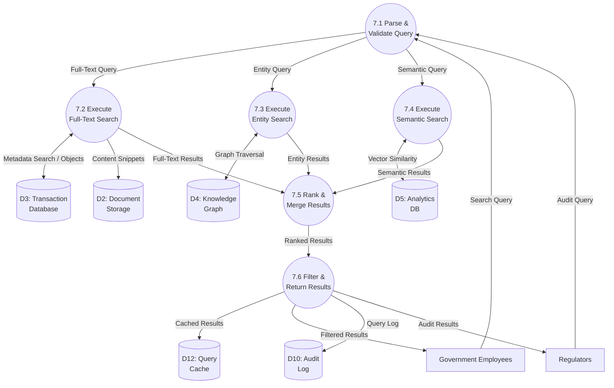

# Data Flow Diagram: IOU-Modern - Search & Query

> **Template Origin**: Official | **ArcKit Version**: 4.3.1 | **Command**: `/arckit:dfd`

## Document Control

| Field | Value |
|-------|-------|
| **Document ID** | ARC-001-DFD-006-v1.0 |
| **Document Type** | Data Flow Diagram |
| **Project** | IOU-Modern (Project 001) |
| **Classification** | OFFICIAL |
| **Status** | DRAFT |
| **Version** | 1.0 |
| **Created Date** | 2026-03-26 |
| **Last Modified** | 2026-03-26 |
| **Review Cycle** | Per release |
| **Next Review Date** | 2026-04-25 |
| **Owner** | Solution Architect |
| **Reviewed By** | PENDING |
| **Approved By** | PENDING |
| **Distribution** | Architecture Team, Development Team, Data Governance Committee |
| **DFD Level** | Level 2 (Process 7 Decomposition) |
| **Notation** | Yourdon-DeMarco |

## Revision History

| Version | Date | Author | Changes | Approved By | Approval Date |
|---------|------|--------|---------|-------------|---------------|
| 1.0 | 2026-03-26 | ArcKit AI | Initial creation from `/arckit:dfd` command | PENDING | PENDING |

---

## Executive Summary

This document contains a Level 2 Data Flow Diagram (DFD) for IOU-Modern, providing detailed decomposition of **Process 7: Search & Query** from the Level 1 DFD. This process represents the unified search platform that combines full-text search, entity-based graph traversal, semantic vector search, and domain-scoped filtering with role-based access control and comprehensive audit logging.

**Parent Process**: P7 (Search & Query) from Level 1 DFD (ARC-001-DFD-001-v1.0)

**Scope**: Search & Query workflow showing 6 sub-processes with detailed data flows between query parsing, multiple search engines, result ranking, access control enforcement, and audit logging.

---

## Yourdon-DeMarco Notation Key

| Symbol | Shape | Description |
|--------|-------|-------------|
| **External Entity** | Rectangle | Source or sink of data outside the system boundary |
| **Process** | Circle | Transforms incoming data flows into outgoing data flows |
| **Data Store** | Open-ended rectangle (parallel lines) | Repository of data at rest |
| **Data Flow** | Named arrow | Data in motion between components |

---

## 1. Level 2 DFD - Process 7: Search & Query

The Level 2 DFD decomposes Process 7 into 6 sub-processes representing the complete search and query lifecycle.

### 1.1 data-flow-diagram DSL

```dfd
title Level 2 DFD - Process 7: Search and Query Pipeline

store     D2         "D2: Document\nStorage"
store     D3         "D3: Transaction\nDatabase"
store     D4         "D4: Knowledge\nGraph"
store     D5         "D5: Analytics\nDB"
store     D10        "D10: Audit\nLog"
store     D12        "D12: Query\nCache"

process   P7_1       "7.1\nParse &\nValidate Query"
process   P7_2       "7.2\nExecute Full-Text\nSearch"
process   P7_3       "7.3\nExecute Entity\nSearch"
process   P7_4       "7.4\nExecute Semantic\nSearch"
process   P7_5       "7.5\nRank &\nMerge Results"
process   P7_6       "7.6\nFilter &\nReturn Results"

entity    GOV_EMP    "Government\nEmployees"
entity    REGULATOR  "Regulators"

GOV_EMP  --> P7_1    "Search Query"
P7_1     --> P7_2    "Full-Text Query"
P7_1     --> P7_3    "Entity Query"
P7_1     --> P7_4    "Semantic Query"

P7_2     --> D3      "Metadata Search"
D3       --> P7_2    "Matching Objects"
P7_2     --> D2      "Content Snippets"

P7_3     --> D4      "Graph Traversal"
D4       --> P7_3    "Related Entities"

P7_4     --> D5      "Vector Similarity"
D5       --> P7_4    "Similar Documents"

P7_2     --> P7_5    "Full-Text Results"
P7_3     --> P7_5    "Entity Results"
P7_4     --> P7_5    "Semantic Results"

P7_5     --> P7_6    "Ranked Results"
P7_6     --> D12     "Cached Results"
P7_6     --> GOV_EMP "Filtered Results"

P7_6     --> D10     "Query Log"

REGULATOR --> P7_1    "Audit Query"
P7_6     --> REGULATOR "Audit Results"
```

### 1.2 Mermaid (Approximate)



---

## 2. Process Specifications

| Process | Name | Inputs | Outputs | Logic Summary | Req. Trace |
|---------|------|--------|---------|---------------|------------|
| 7.1 | Parse & Validate Query | Search query from GOV_EMP, Audit query from REGULATOR | Parsed queries to P7.2, P7.3, P7.4 | Validates query syntax, extracts search terms and filters, identifies query type (keyword, entity, semantic, hybrid), applies rate limiting, checks user permissions for requested domains, expands query with synonyms if enabled | FR-029, NFR-SEC-004, NFR-SEC-008 |
| 7.2 | Execute Full-Text Search | Full-text query from P7.1 | Full-text results to P7.5 | Queries D3 for matching information objects (title, description, tags), fetches document content from D2 for snippet generation, applies domain filter, classification filter, and retention filter, uses PostgreSQL full-text or DuckDB search | FR-029 |
| 7.3 | Execute Entity Search | Entity query from P7.1 | Entity results to P7.5 | Performs graph traversal on D4 (Knowledge Graph), finds entities matching name/type, discovers related entities via relationship types (WorksFor, LocatedIn, etc.), performs N-hop neighbor search, applies entity-type filters | FR-030, FR-028 |
| 7.4 | Execute Semantic Search | Semantic query from P7.1 | Semantic results to P7.5 | Performs vector similarity search on D5 embeddings, uses cosine similarity to find semantically similar documents regardless of keyword match, applies domain and classification filters, returns similarity scores | FR-031 |
| 7.5 | Rank & Merge Results | Full-text, Entity, Semantic results from P7.2, P7.3, P7.4 | Ranked results to P7.6 | Combines results from multiple search engines using weighted fusion, applies ranking algorithm (BM25 + semantic score + graph centrality), deduplicates overlapping results, promotes Woo-relevant documents if applicable, boosts recent documents by recency | FR-029, FR-031 |
| 7.6 | Filter & Return Results | Ranked results from P7.5 | Filtered results to GOV_EMP, Cached results to D12, Query log to D10 | Enforces RBAC (row-level security) - filters results by user's domain access, masks content based on classification (Geheim documents hidden), redacts PII if user lacks permission, logs PII access to D10, applies result pagination, caches query in D12 for common queries | FR-002, FR-003, NFR-SEC-004, NFR-SEC-005 |

---

## 3. Data Store Descriptions

| Store | Name | Contents | Access Pattern | Retention | PII |
|-------|------|----------|----------------|-----------|-----|
| D2 | Document Storage | Raw document files (PDF, DOCX, email) | Read by P7.2 (snippet generation) | 1-20 years (per Archiefwet) | Indirect (content) |
| D3 | Transaction Database | Information domains, Information objects metadata, Documents, Templates | Read by P7.2 (metadata search) | 20 years maximum | Yes (metadata, creator) |
| D4 | Knowledge Graph | Entities, Relationships, Communities | Read by P7.3 (graph traversal) | 20 years (linked to source) | Yes (Person entity names) |
| D5 | Analytics DB | Vector embeddings, Full-text indexes | Read by P7.4 (vector similarity) | 1 year hot, 7 years archive | Indirect (derived vectors) |
| D10 | Audit Log | Query logs, PII access logs | Write by P7.6 | 7 years (NFR-COMP-005) | Yes (IP, user_id, accessed entities) |
| D12 | Query Cache | Cached queries, Cached results, TTL | Read by P7.1, Write by P7.6 | 1-24 hours (TTL-based) | Indirect (query patterns) |

---

## 4. Data Dictionary

| Data Flow | Composition | Source | Destination | Format |
|-----------|-------------|--------|-------------|--------|
| Search Query | {query_text, search_type, filters{}, domain_ids[], classification[], page, page_size, user_id} | GOV_EMP | P7.1 | JSON API |
| Audit Query | {query_type, date_range, user_id, entity_types[], include pii} | REGULATOR | P7.1 | JSON API |
| Full-Text Query | {terms[], operators{}, domain_filter, classification_filter, user_id} | P7.1 | P7.2 | Internal |
| Entity Query | {entity_name, entity_type, max_depth, relationship_types[], domain_filter, user_id} | P7.1 | P7.3 | Internal |
| Semantic Query | {query_text, domain_filter, classification_filter, min_similarity, user_id} | P7.1 | P7.4 | Internal |
| Metadata Search | {tsquery, domain_ids[], classifications[]} | P7.2 | D3 | PostgreSQL tsquery |
| Matching Objects | {object_id, title, description, domain_id, classification, rank, snippet} | D3 | P7.2 | SQL result |
| Content Snippets | {object_id, snippet_text, highlights[]} | P7.2 | D2 | S3 GET |
| Graph Traversal | {start_entity, direction, depth, edge_types[], domain_filter} | P7.3 | D4 | AQL query |
| Related Entities | {entity_id, name, type, relationships[], connected_entities[], paths[]} | D4 | P7.3 | Graph result |
| Vector Similarity | {query_vector, domain_ids[], classifications[], limit} | P7.4 | D5 | Vector search |
| Similar Documents | {object_id, title, similarity_score, domain_id} | D5 | P7.4 | Vector result |
| Full-Text Results | {results[], total_count, search_type: "fulltext", query_id} | P7.2 | P7.5 | JSON |
| Entity Results | {results[], total_count, search_type: "entity", query_id} | P7.3 | P7.5 | JSON |
| Semantic Results | {results[], total_count, search_type: "semantic", query_id} | P7.4 | P7.5 | JSON |
| Ranked Results | {results[], merged_scores[], ranking_method, total_count} | P7.5 | P7.6 | JSON |
| Filtered Results | {results[], total_count, page_info, redactions[]} | P7.6 | GOV_EMP | JSON API |
| Cached Results | {query_hash, results[], expiry_time} | P7.6 | D12 | Cache entry |
| Query Log | {log_id, timestamp, user_id, query_type, query_hash, results_count, pii_accessed[], ip_address} | P7.6 | D10 | Log entry |
| Audit Results | {query_results[], access_logs[], compliance_status} | P7.6 | REGULATOR | JSON |

---

## 5. Search Types and Query Patterns

### 5.1 Search Types

| Search Type | Description | Use Case | Engine |
|-------------|-------------|----------|--------|
| **Full-Text** | Keyword search across document content and metadata | "Find documents mentioning 'bouwvergunning'" | P7.2 (PostgreSQL FTS) |
| **Entity** | Graph-based entity and relationship search | "Find all organizations related to Jan Jansen" | P7.3 (ArangoDB) |
| **Semantic** | Vector similarity search for meaning-based results | "Find documents similar to this policy document" | P7.4 (pgvector/Qdrant) |
| **Hybrid** | Combined search with fusion ranking | "Find documents about 'woning' related to 'Amsterdam'" | P7.5 (all engines) |

### 5.2 Query Examples

**Full-Text Query** (P7.2):
```json
{
  "query_text": "bouwvergunning AND aanvraag",
  "search_type": "fulltext",
  "filters": {
    "domain_ids": ["uuid-1", "uuid-2"],
    "classification": ["Openbaar", "Intern"],
    "date_range": {"from": "2025-01-01", "to": "2025-03-26"}
  }
}
```

**Entity Query** (P7.3):
```json
{
  "query_text": "Gemeente Amsterdam",
  "search_type": "entity",
  "filters": {
    "entity_type": "Organization",
    "max_depth": 2,
    "relationship_types": ["WorksFor", "LocatedIn"]
  }
}
```

**Semantic Query** (P7.4):
```json
{
  "query_text": "Document about housing permits",
  "search_type": "semantic",
  "filters": {
    "min_similarity": 0.75,
    "domain_ids": ["uuid-1"]
  }
}
```

---

## 6. Result Ranking and Fusion (P7.5)

### 6.1 Ranking Algorithm

The ranking uses weighted fusion of multiple signals:

| Signal | Weight | Description |
|--------|--------|-------------|
| **BM25 Score** | 40% | Traditional full-text relevance |
| **Semantic Similarity** | 30% | Vector cosine similarity |
| **Graph Centrality** | 15% | Entity importance in knowledge graph |
| **Domain Match** | 10% | Boost for user's domain access |
| **Recency Boost** | 5% | Newer documents get slight boost |

**Fusion Formula**:
```
final_score = (
  (bm25_score * 0.40) +
  (semantic_score * 0.30) +
  (centrality_score * 0.15) +
  (domain_boost * 0.10) +
  (recency_boost * 0.05)
) * classification_boost
```

### 6.2 Classification Boosts

| Classification | Access Level | Boost |
|---------------|--------------|-------|
| Openbaar | All users | 1.0 (no change) |
| Intern | Authenticated users | 0.9 |
| Vertrouwelijk | Domain members | 0.5 (only if user has access) |
| Geheim | Domain owners only | 0.1 (only if user has access) |

---

## 7. Access Control and Privacy (P7.6)

### 7.1 Domain-Scoped Filtering

User access is filtered by their domain memberships:

| User Role | Can Access | Filter Logic |
|-----------|------------|-------------|
| **Domain Member** | Objects in their domain | `domain_id IN user.domain_ids` |
| **Domain Owner** | All objects in their domain | `domain_id = owned_domain` |
| **Organization Admin** | All objects in organization | `domain_id IN org.domains` |
| **System Admin** | All objects (no filter) | No filtering applied |

### 7.2 PII Access Logging

All search results that contain PII are logged to D10:

```json
{
  "log_id": "uuid",
  "timestamp": "2026-03-26T20:00:00Z",
  "user_id": "uuid",
  "query_hash": "sha256(query)",
  "pii_accessed": [
    {
      "type": "Person",
      "entity_id": "uuid",
      "entity_name": "Jan Jansen"
    },
    {
      "type": "Document",
      "object_id": "uuid",
      "classification": "Vertrouwelijk"
    }
  ],
  "ip_address": "10.0.0.1",
  "user_agent": "Mozilla/5.0..."
}
```

### 7.3 Content Redaction

| Classification | User Has Access | Redaction Applied |
|---------------|-----------------|------------------|
| Openbaar | All users | No redaction |
| Intern | Authenticated | No redaction |
| Vertrouwelijk | Non-domain members | "Niet toegankelijk: Vertrouwelijk" |
| Vertrouwelijk | Domain members | No redaction |
| Geheim | Non-owners | "Niet toegankelijk: Geheim" |
| Geheim | Owners | No redaction |

---

## 8. Query Cache Strategy (D12)

### 8.1 Cache Policy

| Query Type | Cache Duration | Invalidation |
|-------------|----------------|--------------|
| Common full-text queries | 1 hour | On document update |
| Entity queries | 4 hours | On graph update |
| Semantic queries | 24 hours | On embedding refresh |
| Admin queries | No cache | N/A |

### 8.2 Cache Key Format

```
cache_key = md5(
  user_id + ":" +
  query_type + ":" +
  sorted(filters) + ":" +
  domain_hash + ":" +
  classification_hash
)
```

---

## 9. Requirements Traceability

### 9.1 Business Requirements Traceability

| Business Req | Sub-Process | Data Store | Data Flow |
|--------------|-------------|------------|-----------|
| BR-019 (Full-text search) | P7.2 | D3, D2 | Matching Objects, Content Snippets |
| BR-020 (Semantic search) | P7.4 | D5 | Similar Documents |
| BR-033 (PII access logging) | P7.6 | D10 | Query Log |
| BR-036 (Knowledge Graph) | P7.3 | D4 | Related Entities |
| BR-038 (Entity-based search) | P7.3 | D4 | Entity Results |

### 9.2 Functional Requirements Traceability

| Functional Req | Sub-Process | Data Flow Trace |
|----------------|-------------|-----------------|
| FR-029 (Full-text search) | P7.2 | Full-Text Results |
| FR-030 (Entity-based search) | P7.3 | Entity Results |
| FR-031 (Semantic search) | P7.4 | Semantic Results |
| FR-032 (Domain-scoped search) | P7.1, P7.6 | Domain filters applied |
| FR-002 (RBAC) | P7.6 | Filtered Results (domain-scoped) |
| FR-003 (Domain-scoped permissions) | P7.6 | Domain filter in all queries |

### 9.3 Non-Functional Requirements Traceability

| NFR Category | NFR ID | DFD Implementation |
|--------------|--------|-------------------|
| Performance | NFR-PERF-002 | P7.6 <2 second response time (95th percentile) |
| Performance | NFR-PERF-003 | P7.1 query validation <500ms |
| Security | NFR-SEC-004 | P7.6 RBAC + domain-scoped filtering |
| Security | NFR-SEC-005 | P7.6 PII access logging (D10) |
| Performance | NFR-PERF-001 | P7.2 batch search support |
| Availability | NFR-AVAIL-001 | D12 cache provides resilience during outages |
| Compliance | NFR-COMP-005 | D10 7-year log retention |

---

## 10. DFD Balancing Check (Level 1 to Level 2)

| Level 1 Boundary Flow | Direction | Present at Level 2? | Notes |
|------------------------|-----------|---------------------|-------|
| GOV_EMP → P7 (Search Query) | In | ✅ Yes (GOV_EMP → P7.1: Search Query) | Entry point for search |
| P7 → D3 (Query Metadata) | Bidirectional | ✅ Yes (P7.2 ↔ D3: Metadata Search) | Full-text metadata lookup |
| P7 → D2 (Fetch Documents) | Read | ✅ Yes (P7.2 → D2: Content Snippets) | Document content for snippets |
| P7 → D4 (Entity Search) | Bidirectional | ✅ Yes (P7.3 ↔ D4: Graph Traversal) | Graph traversal |
| P7 → D5 (Query statistics) | Read | ✅ Yes (P7.4 ↔ D5: Vector Similarity) | Semantic search |
| P7 → GOV_EMP (Search Results) | Out | ✅ Yes (P7.6 → GOV_EMP: Filtered Results) | Primary output |
| REGULATOR → P7 (Audit Query) | In | ✅ Yes (REGULATOR → P7.1: Audit Query) | Compliance queries |
| REGULATOR ← P7 (Audit Results) | Out | ✅ Yes (P7.6 → REGULATOR: Audit Results) | Audit output |

**Balancing Status**: All flows balanced

---

## 11. Search Performance Optimization

### 11.1 Query Performance Targets

| Metric | Target | Measurement |
|--------|--------|-------------|
| Simple keyword search | <500ms | Time from P7.1 to P7.6 |
| Complex full-text with filters | <1 second | 95th percentile |
| Entity graph traversal (2 hops) | <1.5 seconds | Including graph query |
| Semantic vector search | <2 seconds | Including vector similarity computation |
| Hybrid search fusion | <2 seconds | Combined from all engines |

### 11.2 Index Strategy

| Index | Type | Purpose |
|-------|------|---------|
| Full-text index (D3) | GIN | `ftx_objects_search` on title, description, content_text |
| Vector index (D5) | IVFFlat | Cosine similarity on embeddings |
| Entity name index (D4) | Skip list | Fast entity lookup by name |
| Entity type index (D4) | Hash | Filter by entity_type |
| Relationship edge index (D4) | Edge index | Fast graph traversal |

---

## 12. Error Handling and Recovery

| Error Type | Detection | Recovery Process |
|------------|-----------|-------------------|
| Invalid query syntax | P7.1 validation | Return "invalid query" error with suggestions |
| Rate limit exceeded | P7.1 rate limiter | Return 429 Too Many Requests, suggest retry after |
| No results found | P7.2, P7.3, P7.4 | Return empty result set with suggestions |
| Search timeout | Any P7.x >5 seconds | Return partial results, log timeout |
| Access denied | P7.6 RBAC check | Return 403 Forbidden with explanation |
| Graph query failure | P7.3 graph error | Exclude entity results, continue with other engines |
| Vector index unavailable | P7.4 index error | Fall back to full-text only, log degradation |

---

## 13. Technology Stack Notes

| Sub-Process | Technology | Notes |
|-------------|------------|-------|
| P7.1 Parse & Validate | Query parser, Redis rate limiter | FastAPI rate limiting middleware |
| P7.2 Full-Text Search | PostgreSQL FTS (GIN) or DuckDB | `ts_rank` for BM25 ranking |
| P7.3 Entity Search | ArangoDB AQL | Graph traversal with named paths |
| P7.4 Semantic Search | pgvector or Qdrant | Cosine similarity (IVFFlat or HNSW) |
| P7.5 Rank & Merge | Python (NumPy/Pandas) | Weighted fusion algorithm |
| P7.6 Filter & Return | RBAC middleware, Row-Level Security | PostgreSQL RLS policies |
| D12 Query Cache | Redis | TTL-based cache eviction |

---

## 14. Related Documents

| Document | ID |
|----------|-----|
| Parent DFD (Level 0-1) | ARC-001-DFD-001-v1.0 |
| Level 2 DFD (Knowledge Graph) | ARC-001-DFD-005-v1.0 |
| Requirements | ARC-001-REQ-v1.1 |
| Data Model | ARC-001-DATA-v1.0 |
| Architecture Diagrams | ARC-001-DIAG-v1.0 |
| ADR | ARC-001-ADR-v1.0 |
| DPIA | ARC-001-DPIA-v1.0.md |

---

## 15. Rendering Tools

| Tool | Type | Yourdon-DeMarco | How to Use |
|------|------|-----------------|------------|
| **data-flow-diagram** | CLI (Python) | True notation | `pip install data-flow-diagram` then `dfd < file.dfd` |
| **Mermaid** | Text-to-diagram | Approximate | Paste into [mermaid.live](https://mermaid.live) or view in GitHub |
| **draw.io** | Online editor | True notation | Open [app.diagrams.net](https://app.diagrams.net), enable "Data Flow Diagrams" shapes |
| **Visual Paradigm** | Online editor | True notation | [online.visual-paradigm.com](https://online.visual-paradigm.com) |

---

**END OF DATA FLOW DIAGRAM**

## Generation Metadata

**Generated by**: ArcKit `/arckit:dfd` command
**Generated on**: 2026-03-26 20:00 GMT
**ArcKit Version**: 4.3.1
**Project**: IOU-Modern (Project 001)
**AI Model**: Claude Opus 4.6
**DFD Level**: Level 2 - Process 7 (Search & Query) Decomposition
**Parent Document**: ARC-001-DFD-001-v1.0
