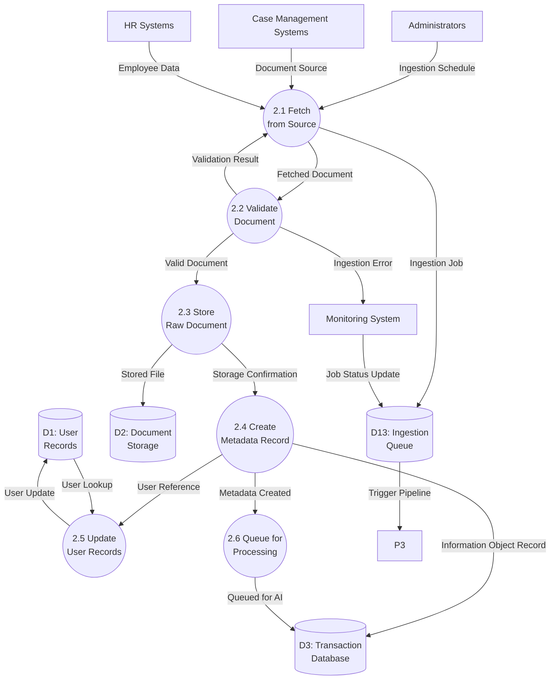

# Data Flow Diagram: IOU-Modern - Ingest Documents

> **Template Origin**: Official | **ArcKit Version**: 4.3.1 | **Command**: `/arckit:dfd`

## Document Control

| Field | Value |
|-------|-------|
| **Document ID** | ARC-001-DFD-007-v1.0 |
| **Document Type** | Data Flow Diagram |
| **Project** | IOU-Modern (Project 001) |
| **Classification** | OFFICIAL |
| **Status** | DRAFT |
| **Version** | 1.0 |
| **Created Date** | 2026-03-26 |
| **Last Modified** | 2026-03-26 |
| **Review Cycle** | Per release |
| **Next Review Date** | 2026-04-25 |
| **Owner** | Solution Architect |
| **Reviewed By** | PENDING |
| **Approved By** | PENDING |
| **Distribution** | Architecture Team, Development Team, Data Governance Committee, Integration Team |
| **DFD Level** | Level 2 (Process 2 Decomposition) |
| **Notation** | Yourdon-DeMarco |

## Revision History

| Version | Date | Author | Changes | Approved By | Approval Date |
|---------|------|--------|---------|-------------|---------------|
| 1.0 | 2026-03-26 | ArcKit AI | Initial creation from `/arckit:dfd` command | PENDING | PENDING |

---

## Executive Summary

This document contains a Level 2 Data Flow Diagram (DFD) for IOU-Modern, providing detailed decomposition of **Process 2: Ingest Documents** from the Level 1 DFD. This process represents the ETL (Extract-Transform-Load) pipeline that ingests documents from external source systems (Case Management, HR Systems), validates and stores them, creates metadata records, and prepares them for AI processing.

**Parent Process**: P2 (Ingest Documents) from Level 1 DFD (ARC-001-DFD-001-v1.0)

**Scope**: Document ingestion workflow showing 6 sub-processes with detailed data flows between source systems, validation, storage, and metadata creation.

---

## Yourdon-DeMarco Notation Key

| Symbol | Shape | Description |
|--------|-------|-------------|
| **External Entity** | Rectangle | Source or sink of data outside the system boundary |
| **Process** | Circle | Transforms incoming data flows into outgoing data flows |
| **Data Store** | Open-ended rectangle (parallel lines) | Repository of data at rest |
| **Data Flow** | Named arrow | Data in motion between components |

---

## 1. Level 2 DFD - Process 2: Ingest Documents

The Level 2 DFD decomposes Process 2 into 6 sub-processes representing the complete document ingestion lifecycle.

### 1.1 data-flow-diagram DSL

```dfd
title Level 2 DFD - Process 2: Document Ingestion Pipeline

store     D1         "D1: User\nRecords"
store     D2         "D2: Document\nStorage"
store     D3         "D3: Transaction\nDatabase"
store     D13        "D13: Ingestion\nQueue"

process   P2_1       "2.1\nFetch from\nSource"
process   P2_2       "2.2\nValidate\nDocument"
process   P2_3       "2.3\nStore Raw\nDocument"
process   P2_4       "2.4\nCreate Metadata\nRecord"
process   P2_5       "2.5\nUpdate User\nRecords"
process   P2_6       "2.6\nQueue for\nProcessing"

entity    CASE_SYS   "Case Management\nSystems"
entity    HR_SYS     "HR\nSystems"
entity    ADMIN      "Administrators"
entity    MONITOR    "Monitoring\nSystem"

ADMIN    --> P2_1    "Ingestion Schedule"
CASE_SYS --> P2_1    "Document Source"
HR_SYS   --> P2_1    "Employee Data"

P2_1     --> D13     "Ingestion Job"
P2_1     --> P2_2    "Fetched Document"

P2_2     --> P2_1    "Validation Result"
P2_2     --> MONITOR "Ingestion Error"

P2_2     --> P2_3    "Valid Document"
P2_3     --> D2      "Stored File"

P2_3     --> P2_4    "Storage Confirmation"
P2_4     --> D3      "Information Object Record"

P2_4     --> P2_5    "User Reference"
D1       --> P2_5    "User Lookup"
P2_5     --> D1      "User Update"

P2_4     --> P2_6    "Metadata Created"
P2_6     --> D3      "Queued for AI"

MONITOR   --> D13     "Job Status Update"
D13      --> P3      "Trigger Pipeline"
```

### 1.2 Mermaid (Approximate)



---

## 2. Process Specifications

| Process | Name | Inputs | Outputs | Logic Summary | Req. Trace |
|---------|------|--------|---------|---------------|------------|
| 2.1 | Fetch from Source | Ingestion schedule from ADMIN, Document source from CASE_SYS, Employee data from HR_SYS | Ingestion job to D13, Fetched document to P2.2 | Polls source systems for new/updated documents, connects via API (REST/SOAP), handles authentication, implements pagination for bulk transfers, creates ingestion job with source metadata, handles connection errors with retry | FR-013, BR-011 |
| 2.2 | Validate Document | Fetched document from P2.1 | Validation result to P2.1, Valid document to P2.3, Ingestion error to MONITOR | Validates file format (PDF, DOCX, EML, etc.), checks file size limits (max 100MB), virus scanning integration, detects corrupted files, validates mandatory metadata (domain_id, document_type), returns detailed error codes for rejection | FR-013, NFR-SEC-006 |
| 2.3 | Store Raw Document | Valid document from P2.2 | Stored file location to D2, Storage confirmation to P2.4 | Generates unique content ID (UUID), uploads to S3/MinIO storage, calculates SHA-256 hash for deduplication, applies server-side encryption (AES-256), creates immutable storage location, returns content_location and content_hash | FR-014 |
| 2.4 | Create Metadata Record | Storage confirmation from P2.3, User reference from document | Information object record to D3, User reference to P2.5 | Creates InformationObject record in D3, maps source document_id to local object_id, extracts metadata from source (created_at, modified_at, author), assigns default classification (Intern), sets initial workflow state, links to domain, triggers P3 processing pipeline | FR-013, BR-011 |
| 2.5 | Update User Records | User reference from P2.4, User lookup from D1 | User update to D1 | Extracts employee/creator information from HR data, matches employee by email/employee_id to D1 User records, updates last_seen timestamp, links documents to user profiles for attribution, creates new user if not found (provisional) | FR-013, BR-011 |
| 2.6 | Queue for Processing | Metadata created from P2.4 | Queued status to D3 | Updates InformationObject status to "pending_processing", adds to processing queue for P3 (AI pipeline), records ingestion timestamp, maintains priority queue (Woo-relevant documents first), sends confirmation to monitoring system | FR-013, FR-015 |

---

## 3. Data Store Descriptions

| Store | Name | Contents | Access Pattern | Retention | PII |
|-------|------|----------|----------------|-----------|-----|
| D1 | User Records | user_id, email, name, department, roles, last_seen, employee_id | Read by P2.5; Write by P2.5 | 7 years post-employment (AVG requirement) | Yes (email, name) |
| D2 | Document Storage | Raw document files (PDF, DOCX, email, images) with content hash | Read by P2.3, P3.1; Write by P2.3 | 1-20 years (per Archiefwet) | Indirect (document content) |
| D3 | Transaction Database | Information domains, Information objects, Documents, Ingestion jobs, Processing queue | Read by P2.4, P2.6; Write by P2.4, P2.6 | 20 years maximum | Yes (metadata, creator) |
| D13 | Ingestion Queue | Ingestion jobs, source status, error logs, retry queue, job metrics | Read by P2.1, P3, MONITOR; Write by P2.1 | 30 days (operational data) | Indirect (may contain metadata) |

---

## 4. Data Dictionary

| Data Flow | Composition | Source | Destination | Format |
|-----------|-------------|--------|-------------|--------|
| Ingestion Schedule | {source_system_id, schedule_type, sync_window, last_sync} | ADMIN | P2.1 | JSON / Cron config |
| Document Source | {document_id, source_url, source_type, metadata{}, timestamp} | CASE_SYS | P2.1 | REST API response |
| Employee Data | {employee_id, email, name, department_id, documents[]} | HR_SYS | P2.1 | JSON / CSV / API |
| Ingestion Job | {job_id, source_id, document_id, status, priority, created_at} | P2.1 | D13 | Queue entry |
| Fetched Document | {document_id, content_bytes, mime_type, filename, metadata} | P2.1 | P2.2 | Binary + metadata |
| Validation Result | {document_id, valid (boolean), error_code, error_message, retry_count} | P2.2 | P2.1, MONITOR | JSON |
| Ingestion Error | {job_id, error_type, document_id, retry_after, severity} | P2.2 | MONITOR | Error log |
| Valid Document | {document_id, content_bytes, mime_type, metadata, hash} | P2.2 | P2.3 | Validated document |
| Stored File | {content_location, content_hash (SHA-256), size_bytes, storage_class, encrypted} | P2.3 | D2 | S3 URI |
| Storage Confirmation | {document_id, content_location, content_hash, stored_at} | P2.3 | P2.4 | Success confirmation |
| Information Object Record | {object_id, content_location, domain_id, object_type, title, classification, source_document_id, created_by, status} | P2.4 | D3 | SQL insert |
| User Reference | {employee_id, email, source_system_id, document_id} | P2.4 | P2.5 | Extracted reference |
| User Lookup | {employee_id, email} | P2.5 | D1 | SQL query |
| User Update | {user_id, last_seen, document_ids[]} | P2.5 | D1 | SQL update |
| Metadata Created | {object_id, status: "pending_processing", queued_at} | P2.4 | P2.6 | Event |
| Queued for AI | {object_id, priority, processing_queue} | P2.6 | D3 | Queue update |
| Job Status Update | {job_id, status, progress, errors[], completed_at} | MONITOR | D13 | Status update |
| Trigger Pipeline | {batch_id, object_ids[], priority} | D13 | P3 | Processing trigger |

---

## 5. Supported Document Types

### 5.1 File Type Mappings

| Extension | MIME Type | Source System | Processing Priority |
|-----------|-----------|---------------|-------------------|
| .pdf | application/pdf | Case Management | High |
| .docx | application/vnd.openxmlformats-officedocument.wordprocessingml.document | Case Management | High |
| .doc | application/msword | Case Management | Medium |
| .eml | message/rfc822 | Email systems | Medium |
| .msg | application/vnd.ms-outlook | Email systems | Medium |
| .txt | text/plain | Case Management | Low |
| .rtf | application/rtf | Case Management | Low |
| .odt | application/vnd.oasis.opendocument.text | Case Management | Low |
| .jpg, .png | image/jpeg, image/png | Case Management | Low (OCR required) |

### 5.2 Document Type to Object Type Mapping

| Source Document Type | Object Type | Default Classification |
|----------------------|------------|---------------------|
| Besluit | Besluit | Intern |
| Nota | Document | Intern |
| Email | Email | Intern |
| Chat | Chat | Intern |
| Foto | Data | Intern (if PII) |
| Rapport | Document | Intern |
| Formulier | Data | Intern |

---

## 6. Source System Integrations

### 6.1 Case Management Systems (CASE_SYS)

| System Type | Integration Protocol | Polling Frequency | Authentication |
|-------------|-------------------|------------------|--------------|
| Sqills | REST API | Every 15 minutes | OAuth 2.0 |
| Centric | SOAP/XML | Every 30 minutes | X.509 certificate |
| Cobra | REST API | Every hour | API key |
| Obsidian | REST API | Real-time webhook | API key |

### 6.2 HR Systems (HR_SYS)

| System Type | Integration Protocol | Polling Frequency | Authentication |
|-------------|-------------------|------------------|--------------|
| AFAS | SOAP/XML | Daily | SAML 2.0 |
| Raet | REST API | Daily | API key |
| Youforce | REST API | Daily | OAuth 2.0 |
| SAP | REST API | Daily | X.509 certificate |

---

## 7. Error Handling and Recovery

| Error Type | Detection | Recovery Process | Retry Strategy |
|------------|-----------|----------------|---------------|
| Connection timeout | P2.1 connection error | Log to D13, retry with exponential backoff | Retry 3x, then alert |
| Invalid file format | P2.2 validation failure | Reject document, log error, notify source system | No retry (requires fix at source) |
| File too large | P2.2 size check | Reject document, log error | No retry (requires source optimization) |
| Virus detected | P2.2 scan result | Quarantine document, alert security team | No retry (security block) |
| Corrupted file | P2.2 hash mismatch | Reject document, log error | No retry (requires re-upload) |
| Storage failure | P2.3 upload error | Retry upload, if fails alert ops team | Retry 3x, then alert |
| Database error | P2.4 insert error | Retry insert, if fails queue for manual retry | Retry 5x, then alert |
| User not found | P2.5 lookup miss | Create provisional user, flag for review | Continue with provisional user |

---

## 8. Ingestion Performance

### 8.1 Throughput Targets

| Metric | Target | Measurement |
|--------|--------|-------------|
| Batch ingestion rate | >1,000 documents/minute | Documents processed per minute |
| Real-time ingestion latency | <30 seconds | Time from document available to queued |
| Peak daily volume | 500,000 documents | Maximum daily processing capacity |
| Concurrent source connections | 10 | Simultaneous source system connections |

### 8.2 Queue Management (D13)

| Queue | Priority | Processing Order |
|-------|----------|-----------------|
| Woo-relevant documents | High (1) | Processed first |
| Government decisions | High (2) | Processed second |
| Standard documents | Medium (3) | Processed in FIFO order |
| Backlog | Low (4) | Processed during off-hours |

---

## 9. Requirements Traceability

### 9.1 Business Requirements Traceability

| Business Req | Sub-Process | Data Store | Data Flow |
|--------------|-------------|------------|-----------|
| BR-011 (Document types) | P2.1, P2.2 | D2 | Document Source validation |
| BR-013 (Document ingestion) | P2.1-P2.6 | D2, D3 | Full ingestion pipeline |
| BR-014 (Document versioning) | P2.4 | D3 | version field in metadata |

### 9.2 Functional Requirements Traceability

| Functional Req | Sub-Process | Data Flow Trace |
|----------------|-------------|-----------------|
| FR-013 (Ingest documents) | P2.1 | Document Source → Ingestion Job |
| FR-014 (Store in S3) | P2.3 | Stored File |
| FR-015 (Text extraction prep) | P2.6 | Queued for AI → P3 |

### 9.3 Non-Functional Requirements Traceability

| NFR Category | NFR ID | DFD Implementation |
|--------------|--------|-------------------|
| Performance | NFR-PERF-001 | P2.1 >1,000 docs/min target |
| Security | NFR-SEC-001 | P2.3 encryption at rest (AES-256) |
| Security | NFR-SEC-002 | P2.1 TLS 1.3 for API calls |
| Availability | NFR-AVAIL-001 | D13 queue persists during outages |
| Scalability | NFR-SCALE-001 | P2.3 horizontal scaling (S3) |

---

## 10. DFD Balancing Check (Level 1 to Level 2)

| Level 1 Boundary Flow | Direction | Present at Level 2? | Notes |
|------------------------|-----------|---------------------|-------|
| CASE_SYS → P2 (Source Documents) | In | ✅ Yes (CASE_SYS → P2.1: Document Source) | Document input |
| HR_SYS → P2 (Employee Data) | In | ✅ Yes (HR_SYS → P2.1: Employee Data) | HR data input |
| P2 → D2 (Store Raw Document) | Out | ✅ Yes (P2.3 → D2: Stored File) | Document storage |
| P2 → D3 (Create Metadata Record) | Out | ✅ Yes (P2.4 → D3: Information Object Record) | Metadata creation |
| P2 → D1 (Update User Records) | Bidirectional | ✅ Yes (P2.5 ↔ D1: User Lookup / User Update) | User update |
| ADMIN → P2 (Ingestion Schedule) | In | ✅ Yes (ADMIN → P2.1: Ingestion Schedule) | Scheduled ingestion |

**Balancing Status**: All flows balanced

---

## 11. Monitoring and Observability

### 11.1 Key Metrics

| Metric | Description | Alert Threshold |
|--------|-------------|----------------|
| Ingestion success rate | % of documents successfully ingested | <95% triggers alert |
| Ingestion latency | Time from source available to queued | >5 minutes triggers alert |
| Error rate by source | % of documents rejected per source system | >10% triggers alert |
| Queue depth | Number of documents waiting for processing | >10,000 triggers alert |
| Storage utilization | S3/MinIO storage used | >80% triggers alert |

### 11.2 Monitoring System Integration

The MONITOR entity receives ingestion errors and status updates:

```json
{
  "monitoring_event": {
    "timestamp": "2026-03-26T20:30:00Z",
    "source_system": "Sqills",
    "event_type": "ingestion_error",
    "severity": "warning",
    "details": {
      "error_code": "INVALID_FORMAT",
      "document_id": "doc-12345",
      "retry_count": 0
    }
  }
}
```

---

## 12. Technology Stack Notes

| Sub-Process | Technology | Notes |
|-------------|------------|-------|
| P2.1 Fetch from Source | Python HTTP clients (requests), Apache Airflow | Scheduler for batch jobs |
| P2.2 Validate Document | python-magic, ClamAV (virus scan), PyPDF2 | File format detection |
| P2.3 Store Raw Document | Boto3 (S3) or MinIO client | Multipart upload for large files |
| P2.4 Create Metadata | SQLAlchemy ORM, PostgreSQL | Transactional insert with error handling |
| P2.5 Update User Records | SQLAlchemy ORM, PostgreSQL | User matching logic |
| P2.6 Queue for Processing | Redis (RabbitMQ alternative) | Priority queue implementation |
| D13 Ingestion Queue | Redis (RabbitMQ) | Job queue with persistence |
| D2 Document Storage | AWS S3 or MinIO | Object storage with versioning |
| MONITOR Monitoring | Prometheus + Grafana | Metrics dashboard and alerting |

---

## 13. Related Documents

| Document | ID |
|----------|-----|
| Parent DFD (Level 0-1) | ARC-001-DFD-001-v1.0 |
| Level 2 DFD (AI Pipeline) | ARC-001-DFD-002-v1.0 |
| Requirements | ARC-001-REQ-v1.1 |
| Data Model | ARC-001-DATA-v1.0 |
| Architecture Diagrams | ARC-001-DIAG-v1.0 |
| ADR | ARC-001-ADR-v1.0 |

---

## 14. Rendering Tools

| Tool | Type | Yourdon-DeMarco | How to Use |
|------|------|-----------------|------------|
| **data-flow-diagram** | CLI (Python) | True notation | `pip install data-flow-diagram` then `dfd < file.dfd` |
| **Mermaid** | Text-to-diagram | Approximate | Paste into [mermaid.live](https://mermaid.live) or view in GitHub |
| **draw.io** | Online editor | True notation | Open [app.diagrams.net](https://app.diagrams.net), enable "Data Flow Diagrams" shapes |
| **Visual Paradigm** | Online editor | True notation | [online.visual-paradigm.com](https://online.visual-paradigm.com) |

---

**END OF DATA FLOW DIAGRAM**

## Generation Metadata

**Generated by**: ArcKit `/arckit:dfd` command
**Generated on**: 2026-03-26 20:15 GMT
**ArcKit Version**: 4.3.1
**Project**: IOU-Modern (Project 001)
**AI Model**: Claude Opus 4.6
**DFD Level**: Level 2 - Process 2 (Ingest Documents) Decomposition
**Parent Document**: ARC-001-DFD-001-v1.0
