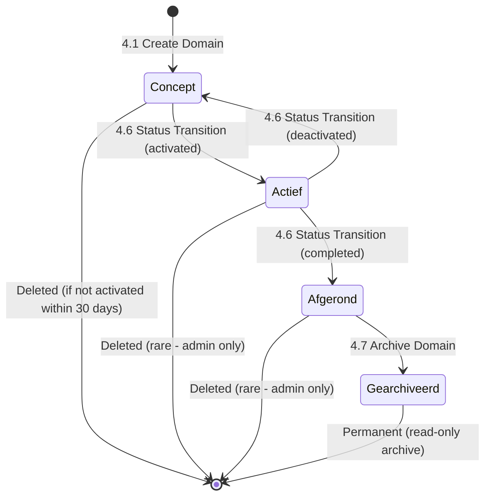

# Data Flow Diagram: IOU-Modern - Manage Domains

> **Template Origin**: Official | **ArcKit Version**: 4.3.1 | **Command**: `/arckit:dfd`

## Document Control

| Field | Value |
|-------|-------|
| **Document ID** | ARC-001-DFD-008-v1.0 |
| **Document Type** | Data Flow Diagram |
| **Project** | IOU-Modern (Project 001) |
| **Classification** | OFFICIAL |
| **Status** | DRAFT |
| **Version** | 1.0 |
| **Created Date** | 2026-03-26 |
| **Last Modified** | 2026-03-26 |
| **Review Cycle** | Per release |
| **Next Review Date** | 2026-04-25 |
| **Owner** | Solution Architect |
| **Reviewed By** | PENDING |
| **Approved By** | PENDING |
| **Distribution** | Architecture Team, Development Team, Data Governance Committee, Domain Owners |
| **DFD Level** | Level 2 (Process 4 Decomposition) |
| **Notation** | Yourdon-DeMarco |

## Revision History

| Version | Date | Author | Changes | Approved By | Approval Date |
|---------|------|--------|---------|-------------|---------------|
| 1.0 | 2026-03-26 | ArcKit AI | Initial creation from `/arckit:dfd` command | PENDING | PENDING |

---

## Executive Summary

This document contains a Level 2 Data Flow Diagram (DFD) for IOU-Modern, providing detailed decomposition of **Process 4: Manage Domains** from the Level 1 DFD. This process represents the domain management operations that create, update, organize, and archive information domains (Zaak, Project, Beleid, Expertise) with proper ownership assignment, hierarchy management, and lifecycle tracking.

**Parent Process**: P4 (Manage Domains) from Level 1 DFD (ARC-001-DFD-001-v1.0)

**Scope**: Domain management workflow showing 7 sub-processes with detailed data flows between administrators, domain records, notifications, and archival.

---

## Yourdon-DeMarco Notation Key

| Symbol | Shape | Description |
|--------|-------|-------------|
| **External Entity** | Rectangle | Source or sink of data outside the system boundary |
| **Process** | Circle | Transforms incoming data flows into outgoing data flows |
| **Data Store** | Open-ended rectangle (parallel lines) | Repository of data at rest |
| **Data Flow** | Named arrow | Data in motion between components |

---

## 1. Level 2 DFD - Process 4: Manage Domains

The Level 2 DFD decomposes Process 4 into 7 sub-processes representing the complete domain management lifecycle.

### 1.1 data-flow-diagram DSL

```dfd
title Level 2 DFD - Process 4: Domain Management

store     D3         "D3: Transaction\nDatabase"
store     D1         "D1: User\nRecords"
store     D14        "D14: Notification\nQueue"

process   P4_1       "4.1\nCreate Domain"
process   P4_2       "4.2\nUpdate Domain"
process   P4_3       "4.3\nAssign\nOwner"
process   P4_4       "4.4\nManage\nHierarchy"
process   P4_5       "4.5\nLink\nDomains"
process   P4_6       "4.6\nTransition\nStatus"
process   P4_7       "4.7\nArchive\nDomain"

entity    ADMIN      "Administrators"
entity    DOM_OWNER  "Domain\nOwners"
entity    GOV_EMP    "Government\nEmployees"

ADMIN    --> P4_1    "Create Domain Request"
ADMIN    --> P4_2    "Update Domain Request"
ADMIN    --> P4_4    "Hierarchy Change Request"
ADMIN    --> P4_5    "Link Domains Request"
ADMIN    --> P4_7    "Archive Request"

P4_1     --> D3      "New Domain Record"
P4_1     --> DOM_OWNER "Owner Assignment"

P4_2     --> D3      "Updated Domain Record"

P4_3     --> D1      "User Lookup"
D1       --> P4_3    "User Record"
P4_3     --> D3      "Owner Assignment"
P4_3     --> D14     "Notification"

P4_4     --> D3      "Parent/Child Update"
P4_4     --> DOM_OWNER "Hierarchy Change Notification"

P4_5     --> D3      "Domain Link Record"
P4_5     --> DOM_OWNER "Link Notification"

P4_6     --> D3      "Status Transition"
P4_6     --> D14     "Status Notification"

P4_7     --> D3      "Archive Record"
P4_7     --> D14     "Archive Notification"

D3       --> P4_2    "Domain Record"
D3       --> P4_4    "Domain Hierarchy"
D3       --> P4_5    "Existing Domains"

GOV_EMP  --> P4_1    "Domain Proposal"
GOV_EMP  --> P4_2    "Domain Update Request"
```

### 1.2 Mermaid (Approximate)

```mermaid
flowchart TB
    D3[("D3: Transaction<br/>Database")]
    D1[("D1: User<br/>Records")]
    D14[("D14: Notification<br/>Queue")]

    P4_1(("4.1 Create<br/>Domain"))
    P4_2(("4.2 Update<br/>Domain"))
    P4_3(("4.3 Assign<br/>Owner"))
    P4_4(("4.4 Manage<br/>Hierarchy"))
    P4_5(("4.5 Link<br/>Domains"))
    P4_6(("4.6 Transition<br/>Status"))
    P4_7(("4.7 Archive<br/>Domain"))

    ADMIN["Administrators"]
    DOM_OWNER["Domain Owners"]
    GOV_EMP["Government Employees"]

    ADMIN -->|Create Domain Request| P4_1
    ADMIN -->|Update Domain Request| P4_2
    ADMIN -->|Hierarchy Change Request| P4_4
    ADMIN -->|Link Domains Request| P4_5
    ADMIN -->|Archive Request| P4_7

    P4_1 -->|New Domain Record| D3
    P4_1 -->|Owner Assignment| DOM_OWNER

    P4_2 <--|Domain Record| D3
    P4_2 -->|Updated Domain Record| D3

    P4_3 -->|User Lookup| D1
    D1 -->|User Record| P4_3
    P4_3 -->|Owner Assignment| D3
    P4_3 -->|Notification| D14

    P4_4 -->|Parent/Child Update| D3
    P4_4 -->|Hierarchy Change Notification| DOM_OWNER

    P4_5 <--|Existing Domains| D3
    P4_5 -->|Domain Link Record| D3
    P4_5 -->|Link Notification| DOM_OWNER

    P4_6 -->|Status Transition| D3
    P4_6 -->|Status Notification| D14

    P4_7 -->|Archive Record| D3
    P4_7 -->|Archive Notification| D14

    GOV_EMP -->|Domain Proposal| P4_1
    GOV_EMP -->|Domain Update Request| P4_2
```

---

## 2. Process Specifications

| Process | Name | Inputs | Outputs | Logic Summary | Req. Trace |
|---------|------|--------|---------|---------------|------------|
| 4.1 | Create Domain | Create request from ADMIN, Domain proposal from GOV_EMP | New domain record to D3, Owner assignment to DOM_OWNER | Validates domain type (Zaak/Project/Beleid/Expertise), checks organization quota, validates domain name uniqueness, assigns initial status (Concept), creates domain in D3, assigns owner if specified, sends notification to new owner | FR-006, FR-007, BR-001 |
| 4.2 | Update Domain | Update request from ADMIN, Domain update request from GOV_EMP, Domain record from D3 | Updated domain record to D3 | Retrieves existing domain, validates update permissions (admin or domain owner), applies updates (name, description, metadata), updates modified_at timestamp, validates status transition rules if status changed, triggers notifications to affected users | FR-010, BR-009 |
| 4.3 | Assign Owner | Owner assignment from ADMIN | User lookup to D1, Owner assignment to D3, Notification to D14 | Validates user exists and is active, checks if user can own domains (not suspended), updates owner_user_id in domain record, removes previous owner if reassigning, sends notification to new owner, logs ownership change for audit | FR-007, FR-003 |
| 4.4 | Manage Hierarchy | Hierarchy change request from ADMIN, Domain hierarchy from D3 | Parent/child update to D3, Hierarchy change notification to DOM_OWNER | Validates parent domain exists and is active, prevents circular references, updates parent_domain_id, validates depth limit (max 5 levels), cascades status changes if needed, notifies affected domain owners of hierarchy changes | FR-008 |
| 4.5 | Link Domains | Link request from ADMIN, Existing domains from D3 | Domain link record to D3, Link notification to DOM_OWNER | Validates both domains exist, checks user permissions (admin or owner of both domains), prevents duplicate links, creates domain relationship in D3 (stored as metadata or separate relation), generates explanation of connection, sends notification to both domain owners | FR-012 |
| 4.6 | Transition Status | Admin/Owner request, Domain record from D3 | Status transition to D3, Status notification to D14 | Validates status transition is allowed (e.g., Concept → Actief → Afgerond → Gearchiveerd), prevents invalid transitions (e.g., Gearchiveerd → Actief), updates status, updates status_changed_at, triggers side effects (archive completed domains), sends notification to domain owner and affected users | FR-009, BR-009 |
| 4.7 | Archive Domain | Archive request from ADMIN, Domain record from D3 | Archive record to D3, Archive notification to D14 | Validates domain is in Afgerond (completed) status, checks for incomplete tasks, checks for Woo publication obligations, sets status to Gearchiveerd, marks domain as read-only, creates archive snapshot, moves to cold storage if applicable, sends notification to domain owner and organization admin | FR-010, BR-018 |

---

## 3. Data Store Descriptions

| Store | Name | Contents | Access Pattern | Retention | PII |
|-------|------|----------|----------------|-----------|-----|
| D1 | User Records | user_id, email, name, department, roles, status, organization_id | Read by P4.3; Write by P4.3 | 7 years post-employment | Yes (email, name) |
| D3 | Transaction Database | Information domains (with hierarchy), Domain links, Domain metadata, Archive records | Read by P4.1-P4.7; Write by P4.1-P4.7 | 20 years maximum (archived domains retained longer) | Indirect (owner names) |
| D14 | Notification Queue | Notifications, Owner assignments, Status changes, Hierarchy changes | Write by P4.3, P4.4, P4.5, P4.6, P4.7; Read by notification service | 30 days | Indirect (recipient names) |

---

## 4. Data Dictionary

| Data Flow | Composition | Source | Destination | Format |
|-----------|-------------|--------|-------------|--------|
| Create Domain Request | {domain_type, name, description, organization_id, proposed_owner_id, parent_domain_id, metadata} | ADMIN | P4.1 | JSON API |
| Domain Proposal | {proposed_name, domain_type, justification, requested_by, priority} | GOV_EMP | P4.1 | Web form / API |
| New Domain Record | {domain_id, domain_type, name, description, status, organization_id, owner_user_id, parent_domain_id, created_at} | P4.1 | D3 | SQL insert |
| Owner Assignment | {domain_id, owner_user_id, assigned_by, assigned_at} | P4.1, P4.3 | D3 | SQL update |
| Update Domain Request | {domain_id, updates{}, requested_by} | ADMIN, GOV_EMP | P4.2 | JSON API |
| Domain Record | {domain_id, domain_type, name, description, status, owner_id, parent_id, metadata, created_at, updated_at} | D3 | P4.2 | SQL result |
| Updated Domain Record | {domain_id, updated_fields, modified_at, modified_by} | P4.2 | D3 | SQL update |
| User Lookup | {user_id, email, employee_id} | P4.3 | D1 | SQL query |
| User Record | {user_id, email, name, department, status, roles[]} | D1 | P4.3 | SQL result |
| Hierarchy Change Request | {domain_id, new_parent_id, requested_by} | ADMIN | P4.4 | JSON API |
| Domain Hierarchy | {domain_id, parent_id, children[], level, path} | D3 | P4.4 | Hierarchical query |
| Parent/Child Update | {domain_id, parent_domain_id, level, path} | P4.4 | D3 | SQL update |
| Existing Domains | {domain_id, name, type, status, organization_id} | D3 | P4.5 | SQL result |
| Link Domains Request | {from_domain_id, to_domain_id, relation_type, explanation, requested_by} | ADMIN | P4.5 | JSON API |
| Domain Link Record | {domain_id, related_domain_ids[], relation_type, explanation, created_by, created_at} | P4.5 | D3 | JSONB update |
| Archive Request | {domain_id, reason, requested_by, force_flag} | ADMIN | P4.7 | JSON API |
| Status Transition Request | {domain_id, new_status, reason, requested_by} | ADMIN, DOM_OWNER | P4.6 | JSON API |
| Status Transition | {domain_id, old_status, new_status, transition_date, transitioned_by} | P4.6 | D3 | State update |
| Archive Record | {domain_id, archived_at, archive_reason, snapshot_id, retention_period} | P4.7 | D3 | SQL update |
| Notification | {notification_id, type, recipient_id, domain_id, message, priority, created_at} | P4.3, P4.4, P4.5, P4.6, P4.7 | D14 | Queue entry |

---

## 5. Domain Lifecycle States

### 5.1 State Machine



### 5.2 State Descriptions

| State | Description | Entry Condition | Exit Condition | Allowed Transitions |
|-------|-------------|----------------|---------------|------------------|
| **Concept** | Domain is being planned | P4.1 Create Domain | Activated or deleted (after 30 days) | Concept → Actief, Concept → Deleted |
| **Actief** | Domain is active and in use | Status transition to Actief | Completed or deactivated | Actief → Afgerond, Actief → Concept |
| **Afgerond** | Domain is completed but editable | Status transition to Afgerond | Archived (after cooldown) | Afgerond → Gearchiveerd, Afgerond → Actief |
| **Gearchiveerd** | Domain is archived read-only | P4.7 Archive Domain | Permanent (no exit) | Gearchiveerd → [None] |

### 5.3 Transition Rules

| Current State | Allowed Next States | Who Can Transition | Notes |
|---------------|-------------------|---------------------|-------|
| Concept | Actief, Deleted | ADMIN, Domain Owner | Concept auto-deletes after 30 days |
| Actief | Afgerond, Concept, Deleted | ADMIN, Domain Owner | Requires domain owner approval for deletion |
| Afgerond | Gearchiveerd, Actief, Deleted | ADMIN, Domain Owner | 7-day cooling-off period before archive |
| Gearchiveerd | None | ADMIN only | Permanent state - domain is read-only |

---

## 6. Domain Types and Configuration

### 6.1 Domain Types

| Domain Type | Description | Typical Duration | Default Retention |
|-------------|-------------|-----------------|------------------|
| **Zaak** | Executive work (cases, permits, subsidies) | Until completion + 2 years | 20 years (if Besluit) or 10 years |
| **Project** | Temporary collaboration | Project duration + 2 years | 10 years |
| **Beleid** | Policy development work | Until implemented + 5 years | 20 years (if legal) or 10 years |
| **Expertise** | Knowledge sharing | Indefinite | Permanent |

### 6.2 Domain Metadata Fields

| Field | Type | Required | Description |
|-------|------|----------|-------------|
| domain_id | UUID | Yes | Unique identifier |
| domain_type | ENUM | Yes | Zaak, Project, Beleid, Expertise |
| name | VARCHAR(255) | Yes | Domain name |
| description | TEXT | No | Free text description |
| status | ENUM | Yes | Concept, Actief, Afgerond, Gearchiveerd |
| organization_id | UUID | Yes | Owner organization |
| owner_user_id | UUID | No | Domain owner |
| parent_domain_id | UUID | No | Parent domain (for hierarchy) |
| metadata | JSONB | No | Flexible custom fields |
| created_at | TIMESTAMPTZ | Yes | Creation timestamp |
| updated_at | TIMESTAMPTZ | Yes | Last update timestamp |
| status_changed_at | TIMESTAMPTZ | Yes | Last status change |

---

## 7. Requirements Traceability

### 7.1 Business Requirements Traceability

| Business Req | Sub-Process | Data Store | Data Flow |
|--------------|-------------|------------|-----------|
| BR-001 to BR-004 (Domain types) | P4.1 | D3 | New Domain Record |
| BR-005 (Hierarchy) | P4.4 | D3 | Parent/Child Update |
| BR-006 (Domain owner) | P4.3 | D1, D3 | Owner Assignment |
| BR-007 (Multi-tenancy) | P4.1, P4.2 | D3 | Organization_id filter |
| BR-008 (Cross-domain relationships) | P4.5 | D3 | Domain Link Record |
| BR-009 (Lifecycle tracking) | P4.6 | D3 | Status Transition |
| BR-010 (Archival) | P4.7 | D3 | Archive Record |

### 7.2 Functional Requirements Traceability

| Functional Req | Sub-Process | Data Flow Trace |
|----------------|-------------|-----------------|
| FR-006 (Create domain) | P4.1 | Create Domain Request → New Domain Record |
| FR-007 (Assign owner) | P4.3 | Owner Assignment |
| FR-008 (Hierarchy) | P4.4 | Parent/Child Update |
| FR-009 (Status transitions) | P4.6 | Status Transition |
| FR-010 (Archive) | P4.7 | Archive Record |
| FR-011 (Auto-discover relationships) | P6.4 | Linked to P6 Knowledge Graph |
| FR-012 (Manual linking) | P4.5 | Link Domains Request |

### 7.3 Non-Functional Requirements Traceability

| NFR Category | NFR ID | DFD Implementation |
|--------------|--------|-------------------|
| Security | NFR-SEC-004 | P4.2, P4.3 RBAC + domain-scoped permissions |
| Security | NFR-SEC-005 | P4.3, P4.6 change logging to D14 |
| Availability | NFR-AVAIL-001 | D3 replication for domain records |
| Compliance | NFR-COMP-003 | P4.7 Archiefwet retention periods |

---

## 8. DFD Balancing Check (Level 1 to Level 2)

| Level 1 Boundary Flow | Direction | Present at Level 2? | Notes |
|------------------------|-----------|---------------------|-------|
| ADMIN → P4 (Domain Configuration) | In | ✅ Yes (ADMIN → P4.1, P4.2, P4.4, P4.5, P4.7) | Multiple domain operations |
| P4 ↔ D3 (Domain Record) | Bidirectional | ✅ Yes (P4.1, P4.2, P4.4, P4.5, P4.6, P4.7 ↔ D3) | Full CRUD operations on D3 |
| ADMIN → P1 (Role Assignment) | Side flow | ✅ Yes (ADMIN → P1: Role Assignment, P1 → D1: Update User Roles) | Handled via P1, but affects domain access |
| P4 → DOM_OWNER (Review Requests) | Out | ✅ Yes (P4.3, P4.4, P4.5 → DOM_OWNER) | Notifications to domain owners |

**Balancing Status**: All flows balanced

---

## 9. Notification Types

### 9.1 Notification Categories

| Notification Type | Trigger | Recipients | Priority |
|-----------------|---------|------------|----------|
| **Owner Assignment** | P4.3 | New domain owner | High |
| **Hierarchy Change** | P4.4 | Affected domain owners | Medium |
| **Domain Linked** | P4.5 | Both domain owners | Medium |
| **Status Changed** | P4.6 | Domain owner, organization admin | Medium |
| **Domain Archived** | P4.7 | Domain owner, organization admin | High |
| **Domain Deleted** | P4.1 (via status) | Domain owner, organization admin | High |
| **Owner Removed** | P4.3 | Previous owner | Medium |

### 9.2 Notification Format

```json
{
  "notification_id": "uuid",
  "type": "OWNER_ASSIGNED",
  "priority": "high",
  "recipient_id": "user_id",
  "domain_id": "domain_id",
  "domain_name": "Project X 2026",
  "message": "You have been assigned as owner of Project X 2026",
  "action_required": true,
  "action_url": "https://iou-modern.nl/domains/domain_id/accept",
  "created_at": "2026-03-26T20:30:00Z"
}
```

---

## 10. Access Control Matrix

### 10.1 Domain Operation Permissions

| Operation | Admin | Domain Owner | Organization Admin | Regular User |
|-----------|-------|--------------|-------------------|--------------|
| Create domain (any type) | ✅ | ❌ | ✅ (own org) | ❌ |
| Create subdomain (own domain) | ✅ | ✅ (if parent owner) | ❌ | ❌ |
| Update domain (metadata) | ✅ | ✅ (own domain) | ❌ | ❌ |
| Update domain (status) | ✅ | ✅ (own domain) | ❌ | ❌ |
| Assign owner | ✅ | ✅ (own domain) | ❌ | ❌ |
| Change hierarchy | ✅ | ✅ (if affected) | ❌ | ❌ |
| Link domains | ✅ | ✅ (own domains) | ❌ | ❌ |
| Archive domain | ✅ | ✅ (own domain) | ❌ | ❌ |
| Delete domain (Concept only) | ✅ | ❌ | ❌ | ❌ |
| View domain | ✅ | ✅ (own domain) | ✅ (own org) | ❌ |

---

## 11. Technology Stack Notes

| Sub-Process | Technology | Notes |
|-------------|------------|-------|
| P4.1 Create Domain | SQLAlchemy ORM, PostgreSQL | Transactional insert with validation |
| P4.2 Update Domain | SQLAlchemy ORM, PostgreSQL | UPDATE with optimistic locking |
| P4.3 Assign Owner | User service (D1 lookup), Django signals | Async notification via D14 |
| P4.4 Manage Hierarchy | Recursive CTE query | Hierarchical path computation |
| P4.5 Link Domains | Graph relationship | Stored as D3 metadata or D4 graph edge |
| P4.6 Transition Status | State machine pattern, Django FSM | Validated transitions |
| P4.7 Archive Domain | Background task (Celery/RQ) | Long-running archive operation |
| D14 Notification Queue | Redis + Celery | Async notification delivery with retry |

---

## 12. Related Documents

| Document | ID |
|----------|-----|
| Parent DFD (Level 0-1) | ARC-001-DFD-001-v1.0 |
| Requirements | ARC-001-REQ-v1.1 |
| Data Model | ARC-001-DATA-v1.0 |
| Architecture Diagrams | ARC-001-DIAG-v1.0 |
| ADR | ARC-001-ADR-v1.0 |

---

## 13. Rendering Tools

| Tool | Type | Yourdon-DeMarco | How to Use |
|------|------|-----------------|------------|
| **data-flow-diagram** | CLI (Python) | True notation | `pip install data-flow-diagram` then `dfd < file.dfd` |
| **Mermaid** | Text-to-diagram | Approximate | Paste into [mermaid.live](https://mermaid.live) or view in GitHub |
| **draw.io** | Online editor | True notation | Open [app.diagrams.net](https://app.diagrams.net), enable "Data Flow Diagrams" shapes |
| **Visual Paradigm** | Online editor | True notation | [online.visual-paradigm.com](https://online.visual-paradigm.com) |

---

**END OF DATA FLOW DIAGRAM**

## Generation Metadata

**Generated by**: ArcKit `/arckit:dfd` command
**Generated on**: 2026-03-26 20:30 GMT
**ArcKit Version**: 4.3.1
**Project**: IOU-Modern (Project 001)
**AI Model**: Claude Opus 4.6
**DFD Level**: Level 2 - Process 4 (Manage Domains) Decomposition
**Parent Document**: ARC-001-DFD-001-v1.0
