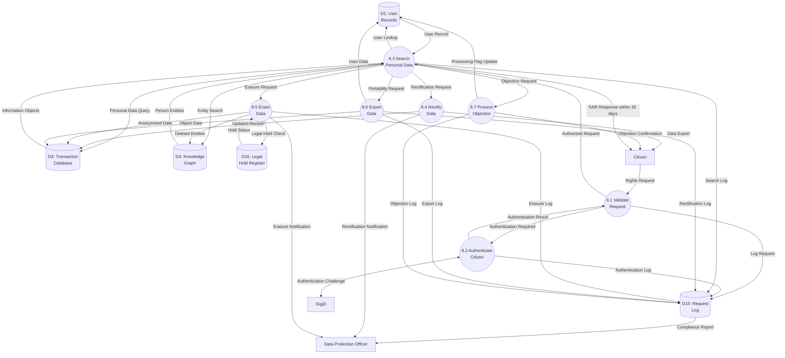
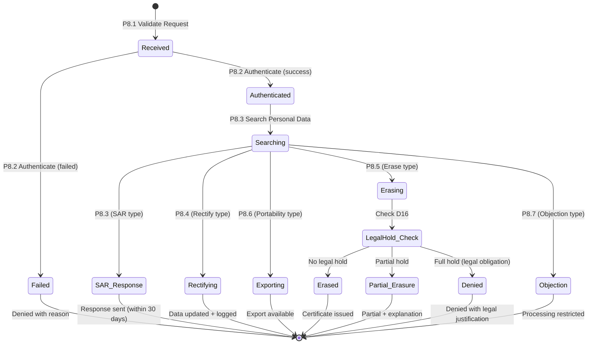

# Data Flow Diagram: IOU-Modern - Data Subject Rights

> **Template Origin**: Official | **ArcKit Version**: 4.3.1 | **Command**: `/arckit:dfd`

## Document Control

| Field | Value |
|-------|-------|
| **Document ID** | ARC-001-DFD-009-v1.0 |
| **Document Type** | Data Flow Diagram |
| **Project** | IOU-Modern (Project 001) |
| **Classification** | OFFICIAL |
| **Status** | DRAFT |
| **Version** | 1.0 |
| **Created Date** | 2026-03-26 |
| **Last Modified** | 2026-03-26 |
| **Review Cycle** | Per release |
| **Next Review Date** | 2026-04-25 |
| **Owner** | Solution Architect |
| **Reviewed By** | PENDING |
| **Approved By** | PENDING |
| **Distribution** | Architecture Team, Development Team, Data Governance Committee, Data Protection Officer |
| **DFD Level** | Level 2 (Process 8 Decomposition) |
| **Notation** | Yourdon-DeMarco |

## Revision History

| Version | Date | Author | Changes | Approved By | Approval Date |
|---------|------|--------|---------|-------------|---------------|
| 1.0 | 2026-03-26 | ArcKit AI | Initial creation from `/arckit:dfd` command | PENDING | PENDING |

---

## Executive Summary

This document contains a Level 2 Data Flow Diagram (DFD) for IOU-Modern, providing detailed decomposition of **Process 8: Data Subject Rights** from the Level 1 DFD. This process represents the GDPR compliance operations that handle Subject Access Requests (SAR), data rectification, erasure, portability, and objection rights for citizens whose personal data is processed by the system.

**Parent Process**: P8 (Data Subject Rights) from Level 1 DFD (ARC-001-DFD-001-v1.0)

**Scope**: Data Subject Rights workflow showing 7 sub-processes with detailed data flows between citizens, authentication systems, data stores, and the Data Protection Officer.

**GDPR Articles Covered**:
- Article 15: Right of Access (SAR)
- Article 16: Right to Rectification
- Article 17: Right to Erasure ("Right to be Forgotten")
- Article 20: Right to Data Portability
- Article 21: Right to Object

---

## Yourdon-DeMarco Notation Key

| Symbol | Shape | Description |
|--------|-------|-------------|
| **External Entity** | Rectangle | Source or sink of data outside the system boundary |
| **Process** | Circle | Transforms incoming data flows into outgoing data flows |
| **Data Store** | Open-ended rectangle (parallel lines) | Repository of data at rest |
| **Data Flow** | Named arrow | Data in motion between components |

---

## 1. Level 2 DFD - Process 8: Data Subject Rights

The Level 2 DFD decomposes Process 8 into 7 sub-processes representing the complete GDPR rights request workflow.

### 1.1 data-flow-diagram DSL

```dfd
title Level 2 DFD - Process 8: Data Subject Rights (GDPR Compliance)

store     D1         "D1: User\nRecords"
store     D3         "D3: Transaction\nDatabase"
store     D4         "D4: Knowledge\nGraph"
store     D15        "D15: Request\nLog"
store     D16        "D16: Legal\nHold Register"

process   P8_1       "8.1\nValidate\nRequest"
process   P8_2       "8.2\nAuthenticate\nCitizen"
process   P8_3       "8.3\nSearch\nPersonal Data"
process   P8_4       "8.4\nRectify\nData"
process   P8_5       "8.5\nErase\nData"
process   P8_6       "8.6\nExport\nData"
process   P8_7       "8.7\nProcess\nObjection"

entity    CITIZEN    "Citizen"
entity    DPO        "Data\nProtection\nOfficer"
entity    DIGID      "DigiD\nAuthentication"

CITIZEN   --> P8_1    "Rights Request"
P8_1      --> D15     "Log Request"

P8_1      --> P8_2    "Authentication Required"
P8_2      <--> DIGID  "Authentication Challenge"
P8_2      --> P8_1    "Authentication Result"
P8_2      --> D15     "Authentication Log"

P8_1      --> P8_3    "Authorized Request"
P8_3      --> D1      "User Lookup"
P8_3      --> D3      "Personal Data Query"
P8_3      --> D4      "Entity Search"
P8_3      --> D15     "Search Log"

D1        --> P8_3    "User Record"
D3        --> P8_3    "Information Objects"
D4        --> P8_3    "Person Entities"

P8_3      --> P8_4    "Rectification Request"
P8_4      --> D3      "Updated Record"
P8_4      --> D15     "Rectification Log"

P8_3      --> P8_5    "Erasure Request"
P8_5      --> D16     "Legal Hold Check"
D16       --> P8_5    "Hold Status"
P8_5      --> D3      "Anonymized Data"
P8_5      --> D4      "Deleted Entities"
P8_5      --> D15     "Erasure Log"

P8_3      --> P8_6    "Portability Request"
P8_6      --> D1      "User Data"
P8_6      --> D3      "Object Data"
P8_6      --> D15     "Export Log"
P8_6      --> CITIZEN "Data Export"

P8_3      --> P8_7    "Objection Request"
P8_7      --> D15     "Objection Log"
P8_7      --> D1      "Processing Flag Update"
P8_7      --> CITIZEN "Objection Confirmation"

P8_3      --> CITIZEN "SAR Response (within 30 days)"
D15       --> DPO     "Compliance Report"

P8_4      --> DPO     "Rectification Notification"
P8_5      --> DPO     "Erasure Notification"
```

### 1.2 Mermaid (Approximate)



---

## 2. Process Specifications

| Process | Name | Inputs | Outputs | Logic Summary | Req. Trace |
|---------|------|--------|---------|---------------|------------|
| 8.1 | Validate Request | Rights request from CITIZEN, Authentication result from P8.2 | Log to D15, Authorized request to P8.3, Authentication required to P8.2 | Validates request format, determines request type (SAR/rectify/erase/export/object), checks required fields, creates request log entry, routes to authentication, enforces 30-day SLA clock start | FR-033, BR-033 |
| 8.2 | Authenticate Citizen | Authentication required from P8.1 | Authentication result to P8.1, Authentication log to D15 | Initiates DigiD authentication flow, verifies citizen identity, matches requestor to data subject, handles MFA, records authentication attempt, handles failed authentication with retry policy | FR-001, NFR-SEC-003 |
| 8.3 | Search Personal Data | Authorized request from P8.1, User record from D1, Information objects from D3, Person entities from D4 | SAR response to CITIZEN, Rectification request to P8.4, Erasure request to P8.5, Portability request to P8.6, Objection request to P8.7, Search log to D15 | Queries D1 for user profile, queries D3 for information objects containing personal data, queries D4 for Person entities matching citizen name, aggregates results, applies classification filtering, redacts third-party PII, generates SAR report | FR-033, FR-038, BR-028 |
| 8.4 | Rectify Data | Rectification request from P8.3, User record from D1 | Updated record to D3, Rectification log to D15, Notification to DPO | Validates requested corrections, checks user permission (self-data only), updates incorrect personal data, creates audit trail with before/after values, notifies data sources of changes, logs rectification for compliance | FR-034, BR-030 |
| 8.5 | Erase Data | Erasure request from P8.3 | Legal hold check to D16, Anonymized data to D3, Deleted entities to D4, Erasure log to D15, Notification to DPO | Checks legal hold register (D16) for retention obligations, identifies all PII across D1, D3, D4, anonymizes Person entities in D4, sets user PII fields to "Gewanonymeerd" in D1, soft-deletes information objects if past retention, creates erasure certificate, handles erasure denial with legal justification | FR-035, BR-031, NFR-COMP-005 |
| 8.6 | Export Data | Portability request from P8.3, User data from D1, Object data from D3 | Data export to CITIZEN, Export log to D15 | Retrieves all personal data in machine-readable format, exports as JSON and CSV options, includes metadata (processing purposes, recipients, retention), validates no third-party PII included, creates package with integrity checksum, makes available for secure download (7-day expiry) | FR-036, BR-032 |
| 8.7 | Process Objection | Objection request from P8.3 | Objection log to D15, Processing flag update to D1, Objection confirmation to CITIZEN | Validates objection scope (processing type), sets processing_restricted flag on user record, stops non-essential processing, notifies data processing teams, confirms objection to citizen, handles objection withdrawal, logs objection for compliance | FR-037, BR-034 |

---

## 3. Data Store Descriptions

| Store | Name | Contents | Access Pattern | Retention | PII |
|-------|------|----------|----------------|-----------|-----|
| D1 | User Records | User profile (email, name, department), processing_restricted flag, auth credentials | Read by P8.2, P8.3, P8.6, P8.7; Write by P8.4, P8.5, P8.7 | 7 years post-employment | Yes (all fields) |
| D3 | Transaction Database | Information objects with personal data, Document metadata, Creator references | Read by P8.3, P8.6; Write by P8.4, P8.5 | 1-20 years (per Archiefwet) | Yes (content, metadata) |
| D4 | Knowledge Graph | Person entities (extracted names), Entity relationships, Canonical names | Read by P8.3; Write by P8.5 | 20 years (linked to source) | Yes (Person entity names) |
| D15 | Request Log | All GDPR rights requests, Authentication logs, Search logs, Processing timestamps | Write by P8.1, P8.2, P8.3, P8.4, P8.5, P8.6, P8.7; Read by DPO | 7 years (GDPR requirement) | Yes (requestor identity) |
| D16 | Legal Hold Register | Records under legal hold, Retention periods, Archive obligations, Litigation holds | Read by P8.5; Write by legal/admin process | Permanent until hold released | Indirect (record IDs) |

---

## 4. Data Dictionary

| Data Flow | Composition | Source | Destination | Format |
|-----------|-------------|--------|-------------|--------|
| Rights Request | {request_type, citizen_id, authenticity_token, date_range, scope, justification} | CITIZEN | P8.1 | JSON API |
| Log Request | {request_id, type, citizen_id, timestamp, sla_deadline, status} | P8.1 | D15 | SQL insert |
| Authentication Required | {request_id, citizen_id, required assurance_level} | P8.1 | P8.2 | Internal |
| Authentication Challenge | {auth_token, challenge_response, mfa_code} | P8.2 | DIGID | SAML/OIDC |
| Authentication Result | {authenticated: boolean, citizen_id, assurance_level, timestamp} | P8.2 | P8.1 | Signed response |
| Authentication Log | {request_id, auth_method, success, failure_reason, timestamp} | P8.2 | D15 | SQL insert |
| Authorized Request | {request_id, citizen_id, type, authenticated_at, sla_deadline} | P8.1 | P8.3 | Internal |
| User Lookup | {citizen_id, user_id, email} | P8.3 | D1 | SQL query |
| Personal Data Query | {citizen_id, date_range, include_archived} | P8.3 | D3 | SQL query |
| Entity Search | {person_name, variations[], date_range} | P8.3 | D4 | Graph query |
| User Record | {user_id, email, name, department, created_at, processing_restricted} | D1 | P8.3 | SQL result |
| Information Objects | {object_id, title, content_text, classification, privacy_level, created_at} | D3 | P8.3 | SQL result |
| Person Entities | {entity_id, name, canonical_name, source_domains[], confidence} | D4 | P8.3 | Graph result |
| SAR Response | {request_id, citizen_data, objects[], entities[], access_log, generated_at} | P8.3 | CITIZEN | JSON/PDF |
| Rectification Request | {request_id, field_updates{}, justification, evidence} | P8.3 | P8.4 | Internal |
| Updated Record | {record_id, updated_fields, previous_values, updated_by, updated_at} | P8.4 | D3 | SQL update |
| Rectification Log | {request_id, rectifications[], affected_records, timestamp} | P8.4 | D15 | SQL insert |
| Erasure Request | {request_id, reason, evidence_of_consent_withdrawn} | P8.3 | P8.5 | Internal |
| Legal Hold Check | {citizen_id, records[]} | P8.5 | D16 | SQL query |
| Hold Status | {has_legal_hold, held_records[], reasons[], release_dates[]} | D16 | P8.5 | SQL result |
| Anonymized Data | {record_id, anonymized_fields, new_values, anonymized_at} | P8.5 | D3 | SQL update |
| Deleted Entities | {entity_ids[], deletion_method, anonymization_method} | P8.5 | D4 | Graph delete |
| Erasure Log | {request_id, erased_records[], denied_records[], denials_reasons} | P8.5 | D15 | SQL insert |
| Portability Request | {request_id, format_preference (json/csv)} | P8.3 | P8.6 | Internal |
| User Data | {user_profile, complete: boolean} | D1 | P8.6 | SQL result |
| Object Data | {objects[], complete: boolean} | D3 | P8.6 | SQL result |
| Data Export | {export_id, download_url, format, expires_at, checksum} | P8.6 | CITIZEN | Secure download link |
| Export Log | {request_id, export_id, format, record_count, expires_at} | P8.6 | D15 | SQL insert |
| Objection Request | {request_id, processing_type, grounds} | P8.3 | P8.7 | Internal |
| Objection Log | {request_id, objection_type, scope, effective_from} | P8.7 | D15 | SQL insert |
| Processing Flag Update | {user_id, processing_restricted, restricted_types[]} | P8.7 | D1 | SQL update |
| Objection Confirmation | {request_id, restricted_processing, confirmation_reference} | P8.7 | CITIZEN | JSON response |
| Search Log | {request_id, queried_stores, result_counts, timestamp} | P8.3 | D15 | SQL insert |
| Compliance Report | {period, request_counts[], sla_performance, pending_requests} | D15 | DPO | Scheduled report |
| Rectification Notification | {request_id, rectifications{}, requires_notification} | P8.4 | DPO | Alert |
| Erasure Notification | {request_id, erased_count, denied_count, legal_holds} | P8.5 | DPO | Alert |

---

## 5. GDPR Rights Implementation

### 5.1 Right of Access (Article 15) - SAR Process

| Step | Sub-Process | Description | SLA |
|------|-------------|-------------|-----|
| 1 | P8.1 | Receive and validate SAR request | Immediate |
| 2 | P8.2 | Authenticate citizen via DigiD | <5 minutes |
| 3 | P8.3 | Search all data stores for personal data | <30 days total |
| 4 | P8.3 | Compile SAR response with all data | Within 30-day window |
| 5 | D15 | Log SAR request for compliance | Audit trail |

**SAR Response Contents**:
- Copy of all personal data (D1, D3, D4)
- Processing purposes (from domain metadata)
- Data recipients (third-party transfers)
- Retention periods (per Archiefwet)
- Source of personal data (if not from citizen)
- Existence of automated decision-making
- Data access log (for citizen's data)

### 5.2 Right to Rectification (Article 16)

| Step | Sub-Process | Description | Validation |
|------|-------------|-------------|------------|
| 1 | P8.3 | Receive rectification request with evidence | Verify identity |
| 2 | P8.4 | Validate correction is justified | Assess evidence |
| 3 | P8.4 | Update incorrect data | Before/after audit |
| 4 | P8.4 | Notify third parties of rectification | Data controller duty |
| 5 | D15 | Log rectification | Compliance tracking |

### 5.3 Right to Erasure (Article 17)

| Step | Sub-Process | Description | Exception Handling |
|------|-------------|-------------|-------------------|
| 1 | P8.3 | Receive erasure request | Verify consent withdrawal or data no longer needed |
| 2 | P8.5 | Check legal hold register (D16 | Prevent deletion if legal obligation |
| 3 | P8.5 | Anonymize Person entities in D4 | Remove identifying information |
| 4 | P8.5 | Anonymize user PII in D1 | Set to "Gewanonymeerd [type]" |
| 5 | P8.5 | Handle information objects | Delete if past retention, retain if legal obligation |
| 6 | D15 | Log erasure with certificate | Proof of compliance |

**Erasure Exceptions** (data NOT erased):
- Legal obligation under Archiefwet (20 years for Besluit)
- Legal hold (litigation, investigation)
- Public interest archival (historical value)
- Exercise of right of freedom of expression

### 5.4 Right to Data Portability (Article 20)

| Step | Sub-Process | Description | Output Format |
|------|-------------|-------------|---------------|
| 1 | P8.3 | Receive portability request | Specify format |
| 2 | P8.6 | Extract personal data from D1, D3 | Machine-readable |
| 3 | P8.6 | Package with metadata | JSON and CSV options |
| 4 | P8.6 | Generate secure download link | 7-day expiry |
| 5 | D15 | Log export | Compliance tracking |

### 5.5 Right to Object (Article 21)

| Step | Sub-Process | Description | Effect |
|------|-------------|-------------|--------|
| 1 | P8.3 | Receive objection request | Specify processing type |
| 2 | P8.7 | Validate objection grounds | Legitimate interest assessment |
| 3 | P8.7 | Set processing_restricted flag | Stop non-essential processing |
| 4 | P8.7 | Notify affected systems | Data processing halt |
| 5 | D15 | Log objection | Compliance tracking |

---

## 6. Request State Machine



---

## 7. SLA and Compliance Tracking

### 7.1 Service Level Agreements

| Request Type | SLA | Measurement | Consequence of Breach |
|--------------|-----|-------------|----------------------|
| SAR (Article 15) | 30 days | Request received to response sent | Regulatory fine, DPO notification |
| Rectification (Article 16) | 30 days | Request received to update complete | Regulatory fine |
| Erasure (Article 17) | 30 days | Request received to erasure complete | Regulatory fine |
| Portability (Article 20) | 30 days | Request received to export available | Regulatory fine |
| Objection (Article 21) | 30 days | Request received to processing halt | Regulatory fine |

### 7.2 D15 Request Log Schema

```sql
CREATE TABLE request_log (
    request_id UUID PRIMARY KEY,
    request_type VARCHAR NOT NULL, -- SAR, RECTIFY, ERASE, EXPORT, OBJECT
    citizen_id UUID,
    requested_at TIMESTAMPTZ NOT NULL,
    sla_deadline TIMESTAMPTZ NOT NULL, -- requested_at + 30 days
    status VARCHAR NOT NULL, -- RECEIVED, AUTHENTICATED, SEARCHING, COMPLETED, DENIED
    authenticated_at TIMESTAMPTZ,
    completed_at TIMESTAMPTZ,
    denied_reason TEXT,
    sla_breach BOOLEAN DEFAULT false,
    breach_reason TEXT,
    processed_by UUID,
    metadata JSONB
);

-- Index for SLA monitoring
CREATE INDEX idx_request_sla ON request_log(requested_at, status) WHERE status != 'COMPLETED';
```

### 7.3 Escalation Rules

| Condition | Escalation | Notification |
|-----------|------------|--------------|
| SLA > 21 days | Amber warning | DPO weekly review |
| SLA > 25 days | Red warning | DPO immediate, CIO notified |
| SLA breached | Incident | DPO, CIO, Legal Counsel notified |

---

## 8. Data Minimization and Redaction

### 8.1 Redaction Rules for SAR Responses

| Data Type | Rule | Rationale |
|-----------|------|-----------|
| Third-party PII | Redact unless consent | Privacy of other data subjects |
| Legal professional privilege | Redact fully | Legal privilege protection |
| Ongoing investigations | Redact with justification | Prevent interference |
| National security | Redact with explanation | State security |
| Trade secrets | Redact unless public interest | Commercial confidentiality |

### 8.2 Redaction Format in SAR Response

```json
{
  "field": "email",
  "value": "[REDACTED - Third party data]",
  "redaction_reason": "third_party_pii",
  "redaction_legal_basis": "GDPR Article 15(4)"
}
```

---

## 9. Requirements Traceability

### 9.1 Business Requirements Traceability

| Business Req | Sub-Process | Data Store | Data Flow |
|--------------|-------------|------------|-----------|
| BR-028 (PII tracking) | P8.3 | D1, D3, D4 | Search across all PII stores |
| BR-029 (SAR support) | P8.3 | D15 | SAR Response within 30 days |
| BR-030 (Rectification) | P8.4 | D3 | Updated Record |
| BR-031 (Erasure) | P8.5 | D1, D3, D4, D16 | Anonymized data with legal hold check |
| BR-032 (Portability) | P8.6 | D1, D3 | Data Export |
| BR-033 (PII access logging) | P8.2, P8.3 | D15 | All requests logged |
| BR-034 (DPIA) | P8.5 | D15 | High-risk erasure logged |

### 9.2 Functional Requirements Traceability

| Functional Req | Sub-Process | Data Flow Trace |
|----------------|-------------|-----------------|
| FR-033 (SAR endpoint) | P8.1, P8.3 | Rights Request → SAR Response |
| FR-034 (Rectification) | P8.4 | Rectification Request → Updated Record |
| FR-035 (Erasure) | P8.5 | Erasure Request → Anonymized Data |
| FR-036 (Portability) | P8.6 | Portability Request → Data Export |
| FR-037 (Objection) | P8.7 | Objection Request → Processing Flag Update |
| FR-038 (Logging) | P8.1, P8.2, P8.3, P8.4, P8.5, P8.6, P8.7 | Various → D15 |

### 9.3 Non-Functional Requirements Traceability

| NFR Category | NFR ID | DFD Implementation |
|--------------|--------|-------------------|
| Security | NFR-SEC-001 | D1, D3, D4 encryption at rest |
| Security | NFR-SEC-002 | All data flows TLS 1.3 |
| Security | NFR-SEC-003 | P8.2 DigiD + MFA |
| Security | NFR-SEC-005 | D15 PII access logging |
| Compliance | NFR-COMP-002 | P8.3, P8.4, P8.5, P8.6, P8.7 GDPR compliance |
| Compliance | NFR-COMP-005 | D15 7-year log retention |

---

## 10. DFD Balancing Check (Level 1 to Level 2)

| Level 1 Boundary Flow | Direction | Present at Level 2? | Notes |
|------------------------|-----------|---------------------|-------|
| CITIZEN → P8 (SAR Request) | In | ✅ Yes (CITIZEN → P8.1 → P8.3) | Request validation and authentication |
| P8 ↔ D1 (User Lookup) | Bidirectional | ✅ Yes (P8.3 ↔ D1, P8.6 → D1, P8.7 → D1) | Multiple sub-processes access D1 |
| P8 ↔ D3 (Query Personal Data) | Bidirectional | ✅ Yes (P8.3 ↔ D3, P8.4 → D3, P8.5 → D3, P8.6 → D3) | All personal data operations |
| P8 ↔ D4 (Query Person Entities) | Bidirectional | ✅ Yes (P8.3 ↔ D4, P8.5 → D4) | Entity operations |
| P8 → CITIZEN (SAR Response within 30 days) | Out | ✅ Yes (P8.3, P8.6, P8.7 → CITIZEN) | Multiple response types |
| P8 → D15 (not explicit in Level 1) | New | ✅ Yes (All sub-processes → D15) | Audit trail for compliance |

**Balancing Status**: All flows balanced + Added D15 (Request Log) for compliance audit trail and D16 (Legal Hold Register) for erasure processing

---

## 11. Technology Stack Notes

| Sub-Process | Technology | Notes |
|-------------|------------|-------|
| P8.1 Validate Request | API Gateway, JSON Schema | Request validation, type routing |
| P8.2 Authenticate Citizen | DigiD OIDC, SAML | MFA, assurance level validation |
| P8.3 Search Personal Data | PostgreSQL (D1, D3), ArangoDB (D4), Elasticsearch | Cross-store query federation |
| P8.4 Rectify Data | SQLAlchemy ORM, Audit triggers | Before/after value capture |
| P8.5 Erase Data | Background task (Celery/RQ), Anonymization service | Long-running erasure with legal hold checks |
| P8.6 Export Data | Pandas/Polars, Secure S3 bucket | JSON/CSV generation with checksum |
| P8.7 Process Objection | Django signals, Pub/Sub | Processing flag propagation |
| D15 Request Log | PostgreSQL with partitioning | 7-year retention, time-series optimization |
| D16 Legal Hold Register | PostgreSQL | Legal hold tracking with expiry |

---

## 12. Related Documents

| Document | ID |
|----------|-----|
| Parent DFD (Level 0-1) | ARC-001-DFD-001-v1.0 |
| Requirements | ARC-001-REQ-v1.1 |
| Data Model | ARC-001-DATA-v1.0 |
| DPIA | ARC-001-DPIA-v1.0 |
| Architecture Diagrams | ARC-001-DIAG-v1.0 |
| ADR | ARC-001-ADR-v1.0 |

---

## 13. Rendering Tools

| Tool | Type | Yourdon-DeMarco | How to Use |
|------|------|-----------------|------------|
| **data-flow-diagram** | CLI (Python) | True notation | `pip install data-flow-diagram` then `dfd < file.dfd` |
| **Mermaid** | Text-to-diagram | Approximate | Paste into [mermaid.live](https://mermaid.live) or view in GitHub |
| **draw.io** | Online editor | True notation | Open [app.diagrams.net](https://app.diagrams.net), enable "Data Flow Diagrams" shapes |
| **Visual Paradigm** | Online editor | True notation | [online.visual-paradigm.com](https://online.visual-paradigm.com) |

---

**END OF DATA FLOW DIAGRAM**

## Generation Metadata

**Generated by**: ArcKit `/arckit:dfd` command
**Generated on**: 2026-03-26 21:00 GMT
**ArcKit Version**: 4.3.1
**Project**: IOU-Modern (Project 001)
**AI Model**: Claude Opus 4.6
**DFD Level**: Level 2 - Process 8 (Data Subject Rights) Decomposition
**Parent Document**: ARC-001-DFD-001-v1.0
