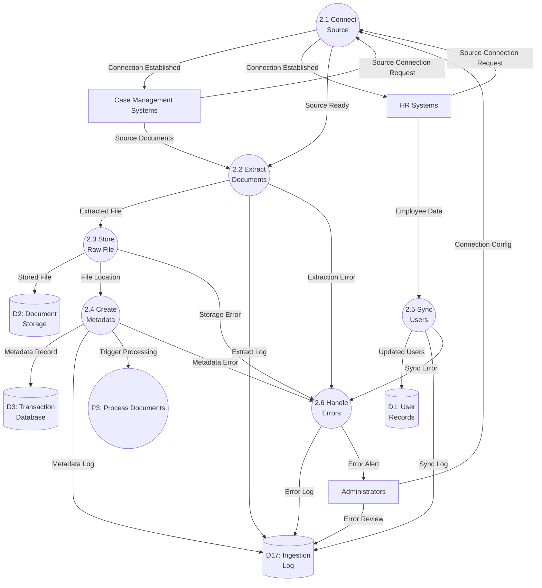
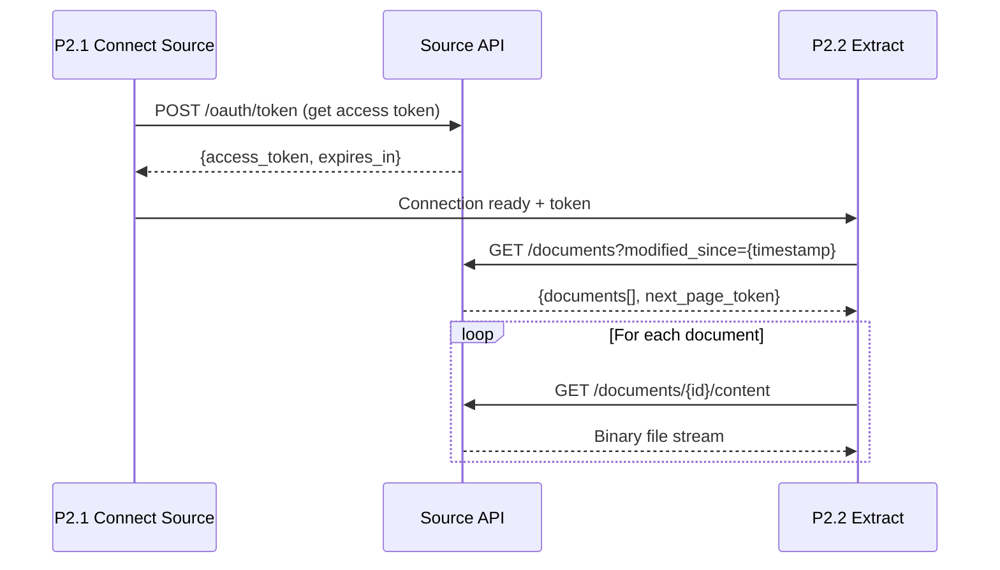
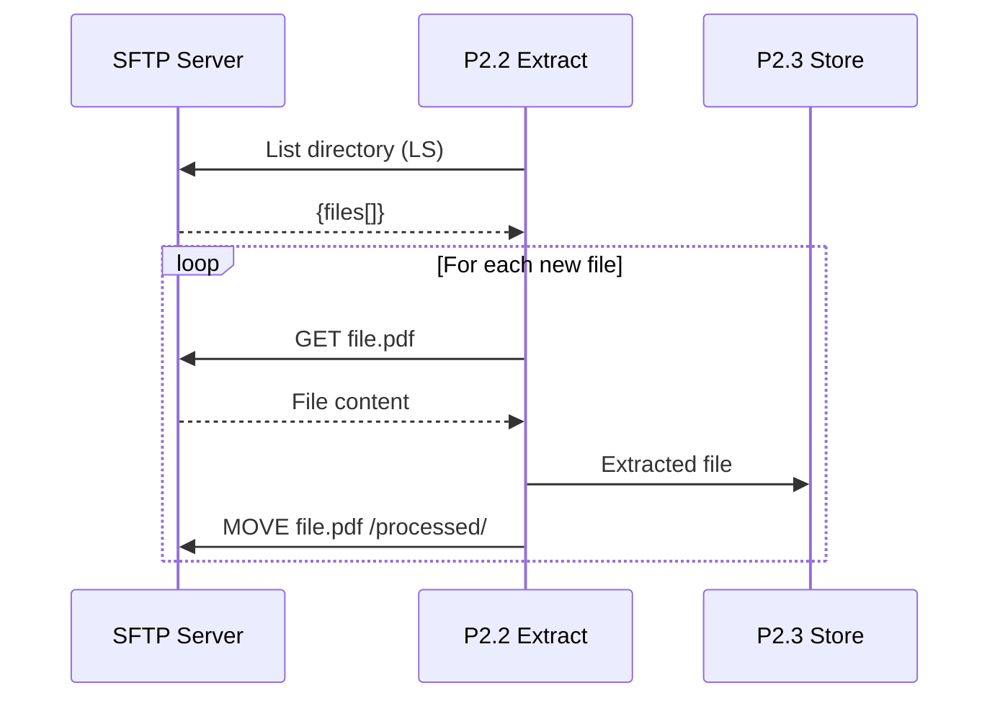
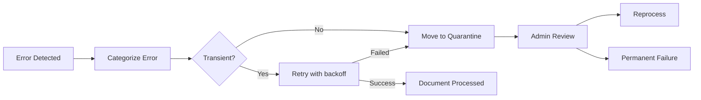

# Data Flow Diagram: IOU-Modern - Ingest Documents

> **Template Origin**: Official | **ArcKit Version**: 4.3.1 | **Command**: `/arckit:dfd`

## Document Control

| Field | Value |
|-------|-------|
| **Document ID** | ARC-001-DFD-010-v1.0 |
| **Document Type** | Data Flow Diagram |
| **Project** | IOU-Modern (Project 001) |
| **Classification** | OFFICIAL |
| **Status** | DRAFT |
| **Version** | 1.0 |
| **Created Date** | 2026-03-26 |
| **Last Modified** | 2026-03-26 |
| **Review Cycle** | Per release |
| **Next Review Date** | 2026-04-25 |
| **Owner** | Solution Architect |
| **Reviewed By** | PENDING |
| **Approved By** | PENDING |
| **Distribution** | Architecture Team, Development Team, Data Governance Committee, Integration Team |
| **DFD Level** | Level 2 (Process 2 Decomposition) |
| **Notation** | Yourdon-DeMarco |

## Revision History

| Version | Date | Author | Changes | Approved By | Approval Date |
|---------|------|--------|---------|-------------|---------------|
| 1.0 | 2026-03-26 | ArcKit AI | Initial creation from `/arckit:dfd` command | PENDING | PENDING |

---

## Executive Summary

This document contains a Level 2 Data Flow Diagram (DFD) for IOU-Modern, providing detailed decomposition of **Process 2: Ingest Documents** from the Level 1 DFD. This process represents the ETL (Extract-Transform-Load) pipeline that ingests documents from external source systems, stores raw files, creates metadata records, and synchronizes user/employee data.

**Parent Process**: P2 (Ingest Documents) from Level 1 DFD (ARC-001-DFD-001-v1.0)

**Scope**: Document ingestion workflow showing 6 sub-processes with detailed data flows between case management systems, HR systems, document storage, metadata database, and user records.

**Integration Patterns**: Batch ETL for documents, incremental sync for user data, S3/MinIO for object storage.

---

## Yourdon-DeMarco Notation Key

| Symbol | Shape | Description |
|--------|-------|-------------|
| **External Entity** | Rectangle | Source or sink of data outside the system boundary |
| **Process** | Circle | Transforms incoming data flows into outgoing data flows |
| **Data Store** | Open-ended rectangle (parallel lines) | Repository of data at rest |
| **Data Flow** | Named arrow | Data in motion between components |

---

## 1. Level 2 DFD - Process 2: Ingest Documents

The Level 2 DFD decomposes Process 2 into 6 sub-processes representing the complete document and data ingestion pipeline.

### 1.1 data-flow-diagram DSL

```dfd
title Level 2 DFD - Process 2: Document Ingestion (ETL Pipeline)

store     D1         "D1: User\nRecords"
store     D2         "D2: Document\nStorage"
store     D3         "D3: Transaction\nDatabase"
store     D17        "D17: Ingestion\nLog"

process   P2_1       "2.1\nConnect\nSource"
process   P2_2       "2.2\nExtract\nDocuments"
process   P2_3       "2.3\nStore\nRaw File"
process   P2_4       "2.4\nCreate\nMetadata"
process   P2_5       "2.5\nSync\nUsers"
process   P2_6       "2.6\nHandle\nErrors"

entity    CASE_SYS   "Case Management\nSystems"
entity    HR_SYS     "HR\nSystems"
entity    ADMIN      "Administrators"
entity    P3         "P3: Process\nDocuments"

CASE_SYS  --> P2_1    "Source Connection Request"
HR_SYS    --> P2_1    "Source Connection Request"
ADMIN     --> P2_1    "Connection Config"

P2_1      --> CASE_SYS "Connection Established"
P2_1      --> HR_SYS   "Connection Established"
P2_1      --> P2_2    "Source Ready"

CASE_SYS  --> P2_2    "Source Documents"
HR_SYS    --> P2_5    "Employee Data"

P2_2      --> P2_3    "Extracted File"
P2_2      --> D17     "Extract Log"

P2_3      --> D2      "Stored File"
P2_3      --> P2_4    "File Location"

P2_4      --> D3      "Metadata Record"
P2_4      --> D17     "Metadata Log"
P2_4      --> P3      "Trigger Processing"

P2_5      --> D1      "Updated Users"
P2_5      --> D17     "Sync Log"

P2_2      --> P2_6    "Extraction Error"
P2_3      --> P2_6    "Storage Error"
P2_4      --> P2_6    "Metadata Error"
P2_5      --> P2_6    "Sync Error"

P2_6      --> D17     "Error Log"
P2_6      --> ADMIN   "Error Alert"

ADMIN     --> D17     "Error Review"
```

### 1.2 Mermaid (Approximate)



---

## 2. Process Specifications

| Process | Name | Inputs | Outputs | Logic Summary | Req. Trace |
|---------|------|--------|---------|---------------|------------|
| 2.1 | Connect Source | Connection request from CASE_SYS/HR_SYS, Config from ADMIN | Connection established to sources, Source ready to P2.2 | Validates source credentials, establishes secure connection (TLS/API key), tests connectivity, configures polling schedule, handles connection retry logic, registers source in D17 | FR-013, INT-001 |
| 2.2 | Extract Documents | Source documents from CASE_SYS, Source ready from P2.1 | Extracted file to P2.3, Extract log to D17, Extraction error to P2.6 | Polls source for new/changed documents, implements delta detection (last_sync_timestamp), streams file content with chunking, handles various formats (PDF, DOCX, email), validates file integrity (checksum), tracks extraction progress | FR-013, NFR-PERF-001 |
| 2.3 | Store Raw File | Extracted file from P2.2 | Stored file to D2, File location to P2.4, Storage error to P2.6 | Generates unique storage key (UUID + extension), uploads to S3/MinIO with versioning, calculates SHA-256 checksum, validates upload success, stores content_location reference, handles retry for transient failures, implements server-side encryption | FR-014 |
| 2.4 | Create Metadata | File location from P2.3 | Metadata record to D3, Metadata log to D17, Trigger to P3, Metadata error to P2.6 | Extracts metadata from source (case_id, document_type, created_at), maps to internal schema (InformationObject), validates required fields, generates UUID, sets initial classification (Intern), creates record in D3, triggers P3 for AI processing, links to domain if available | FR-013, FR-016 |
| 2.5 | Sync Users | Employee data from HR_SYS | Updated users to D1, Sync log to D17, Sync error to P2.6 | Receives employee data feed (daily batch), maps HR employee_id to internal user_id, updates D1 records (name, department, email), handles new hires (create user), handles departures (deactivate user), preserves role assignments, validates email format, logs sync statistics | FR-001, INT-002 |
| 2.6 | Handle Errors | Errors from P2.2, P2.3, P2.4, P2.5 | Error log to D17, Error alert to ADMIN | Categorizes error severity (transient/permanent), implements retry policy (3 attempts with exponential backoff), quarantines permanently failed files, generates error alert for ADMIN, updates error statistics dashboard, creates reconciliation report for failed records | NFR-AVAIL-002 |

---

## 3. Data Store Descriptions

| Store | Name | Contents | Access Pattern | Retention | PII |
|-------|------|----------|----------------|-----------|-----|
| D1 | User Records | User profiles (email, name, department), Employee IDs, HR sync status | Read by P2.5; Write by P2.5 | 7 years post-employment | Yes (email, name) |
| D2 | Document Storage | Raw document files (PDF, DOCX, email), Version history, Checksums | Write by P2.3; Read by P3, P7 | 1-20 years (per Archiefwet) | Indirect (file content) |
| D3 | Transaction Database | Information objects metadata, Source system references, Ingestion timestamps | Read by P2.4; Write by P2.4 | 20 years maximum | Yes (creator, metadata) |
| D17 | Ingestion Log | Extraction logs, Sync logs, Error logs, Source statistics, Reconciliation reports | Write by P2.1, P2.2, P2.3, P2.4, P2.5, P2.6; Read by ADMIN | 1 year online, 7 years archive | Indirect (file IDs) |

---

## 4. Data Dictionary

| Data Flow | Composition | Source | Destination | Format |
|-----------|-------------|--------|-------------|--------|
| Source Connection Request | {source_system_id, api_endpoint, credentials, protocol} | CASE_SYS, HR_SYS | P2.1 | API call |
| Connection Config | {source_id, poll_interval, retry_policy, filter_rules} | ADMIN | P2.1 | JSON config |
| Connection Established | {connection_id, status, protocol_version, capabilities} | P2.1 | CASE_SYS, HR_SYS | Handshake response |
| Source Ready | {source_id, last_sync_timestamp, ready: boolean} | P2.1 | P2.2 | Internal signal |
| Source Documents | {document_id, file_path, case_id, document_type, created_at, modified_at, content_bytes} | CASE_SYS | P2.2 | File stream / API response |
| Employee Data | {employee_id, first_name, last_name, email, department_id, manager_id, status, hire_date, terminate_date} | HR_SYS | P2.5 | JSON / CSV |
| Extracted File | {document_id, file_content, mime_type, file_size, checksum} | P2.2 | P2.3 | Binary stream |
| Extract Log | {source_id, document_id, extracted_at, file_size, status} | P2.2 | D17 | SQL insert |
| Stored File | {storage_key, bucket/path, checksum, version_id, encrypted: true} | P2.3 | D2 | S3/MinIO put |
| File Location | {document_id, content_location, storage_key, checksum} | P2.3 | P2.4 | Internal reference |
| Storage Error | {document_id, error_type, retry_count, original_file} | P2.3 | P2.6 | Error object |
| Metadata Record | {object_id, domain_id, source_system_id, source_document_id, title, object_type, content_location, classification, created_at, created_by} | P2.4 | D3 | SQL insert |
| Metadata Log | {object_id, metadata_created_at, source_system, fields_mapped} | P2.4 | D17 | SQL insert |
| Trigger Processing | {object_id, processing_priority, pipeline_stages[]} | P2.4 | P3 | Message queue / Signal |
| Metadata Error | {object_id, validation_errors, missing_fields} | P2.4 | P2.6 | Error object |
| Updated Users | {user_id, employee_id, email, name, department, status, sync_timestamp} | P2.5 | D1 | Batch upsert |
| Sync Log | {sync_batch_id, records_processed, created, updated, deactivated, errors[]} | P2.5 | D17 | SQL insert |
| Sync Error | {employee_id, error_type, validation_failure, raw_data} | P2.5 | P2.6 | Error object |
| Extraction Error | {document_id, source_error, retryable, retry_after} | P2.2 | P2.6 | Error object |
| Error Log | {error_id, source_system, error_type, severity, document_id, error_message, timestamp, resolved} | P2.6 | D17 | SQL insert |
| Error Alert | {error_count, severity, affected_documents[], recommended_action} | P2.6 | ADMIN | Email / Dashboard alert |
| Error Review | {error_resolution, reviewed_by, resolved_at} | ADMIN | D17 | Update |

---

## 5. Source System Integration

### 5.1 Supported Source Systems

| Source | Type | Protocol | Poll Frequency | Data Format |
|--------|------|----------|----------------|-------------|
| **Sqills** | Case Management | REST API | Every 4 hours | JSON |
| **Centric** | Case Management | SOAP/XML | Every 4 hours | XML |
| **Cx (Decos)** | Document Management | SFTP + REST | Daily batch | XML / PDF |
| **Afas** | HR System | REST API | Daily batch | JSON |
| **Raet** | HR System | SOAP/XML | Daily batch | XML |
| **Canon** | Document Scanner | SFTP drop | Real-time | PDF/TIFF |

### 5.2 Integration Patterns

#### 5.2.1 REST API Integration (Sqills, Afas)



#### 5.2.2 SFTP Integration (Canon, Decos)



### 5.3 Field Mapping

#### 5.3.1 Case Management → InformationObject

| Source Field | Target Attribute | Transformation |
|--------------|-----------------|----------------|
| case_id | metadata->>'source_case_id' | Direct mapping |
| document_type | object_type | Map to enum (Document/Email/Besluit) |
| titel | title | Trim whitespace |
| omschrijving | description | Direct mapping |
| document_datum | created_at | Parse to timestamp |
| maker | created_by | Look up user_id |
| classification | classification | Map to enum (default: Intern) |

#### 5.3.2 HR System → User

| Source Field | Target Attribute | Transformation |
|--------------|-----------------|----------------|
| employee_id | metadata->>'employee_id' | Direct mapping |
| email | email | Lowercase, validate format |
| voorletters | first_name | Concatenate |
| achternaam | last_name | Direct mapping |
| afdeling | department_id | Look up department |
| is_actief | is_active | Boolean mapping |

---

## 6. Error Handling and Recovery

### 6.1 Error Categories

| Category | Severity | Retry Policy | Example |
|----------|----------|--------------|---------|
| **Transient Network** | Warning | 3 retries, exponential backoff | Connection timeout, 503 Service Unavailable |
| **Source Unavailable** | Warning | Retry next scheduled poll | Source system down for maintenance |
| **Invalid Format** | Error | No retry (quarantine) | Corrupted file, unsupported format |
| **Validation Failure** | Error | No retry (requires admin) | Missing required fields |
| **Authentication Failed** | Critical | No retry (alert admin) | Invalid credentials, expired token |
| **Storage Full** | Critical | No retry (alert admin) | S3/MinIO capacity exceeded |

### 6.2 Retry Configuration

| Error Type | Initial Delay | Max Delay | Max Retries | Backoff Multiplier |
|------------|---------------|-----------|-------------|-------------------|
| Network timeout | 1s | 60s | 3 | 2x |
| 5xx Server error | 5s | 300s | 5 | 2x |
| 429 Rate limit | 10s | 600s | Infinite | 1.5x |
| Validation error | N/A | N/A | 0 | N/A (quarantine) |

### 6.3 Quarantine Process



### 6.4 D17 Ingestion Log Schema

```sql
CREATE TABLE ingestion_log (
    log_id UUID PRIMARY KEY,
    source_system VARCHAR NOT NULL,
    log_type VARCHAR NOT NULL, -- EXTRACTION, SYNC, ERROR
    document_id UUID,
    employee_id VARCHAR,
    status VARCHAR NOT NULL, -- SUCCESS, FAILED, RETRYING, QUARANTINED
    error_message TEXT,
    error_category VARCHAR,
    retry_count INTEGER DEFAULT 0,
    created_at TIMESTAMPTZ NOT NULL,
    resolved_at TIMESTAMPTZ,
    resolved_by UUID,
    metadata JSONB
);

-- Index for error monitoring
CREATE INDEX idx_ingestion_errors ON ingestion_log(status, created_at) WHERE status != 'SUCCESS';
```

---

## 7. Performance and Scalability

### 7.1 Throughput Targets

| Metric | Target | Measurement |
|--------|--------|-------------|
| Document ingestion | >1,000 docs/minute | P2.2 → P2.3 rate |
| User sync throughput | >10,000 users/batch | P2.5 batch size |
| Storage write latency | <500ms p95 | P2.3 → D2 |
| Metadata creation latency | <200ms p95 | P2.4 → D3 |
| End-to-end latency | <5 minutes | Source → P3 trigger |

### 7.2 Scaling Strategy

| Component | Horizontal Scaling | State Management |
|-----------|---------------------|------------------|
| P2.1 Connect Source | Yes (per-source workers) | Connection pool in D17 |
| P2.2 Extract Documents | Yes (sharded by source) | Checkpoint in D17 |
| P2.3 Store Raw File | Yes (direct to S3) | Idempotent writes (key = UUID) |
| P2.4 Create Metadata | Yes (sharded by source) | Idempotent inserts (source_doc_id unique) |
| P2.5 Sync Users | Yes (single HR system) | Checkpoint per batch |
| P2.6 Handle Errors | Yes (async queue) | At-least-once delivery |

### 7.3 Resource Optimization

| Optimization | Implementation | Benefit |
|--------------|----------------|---------|
| Delta detection | Track last_sync_timestamp per source | 90% reduction in data transfer |
| Parallel extraction | Multi-threaded file download per source | 5x throughput increase |
| Batch metadata inserts | 100 records per transaction | 10x database write performance |
| Compression | Gzip for large files during transfer | 70% bandwidth reduction |
| Checksum validation | SHA-256 pre and post upload | Detect corruption early |

---

## 8. Data Quality Controls

### 8.1 Validation Rules

| Rule | Level | Action on Failure |
|------|-------|-------------------|
| File size < 100MB | Warning | Reject, alert admin |
| File type allowed | Error | Reject, quarantine |
| Required fields present | Error | Reject, quarantine |
| Checksum matches | Error | Retry download |
| Employee ID valid | Warning | Log, continue with null |
| Domain mapping exists | Warning | Log, create without domain |

### 8.2 Reconciliation Process

| Frequency | Process | Output |
|-----------|---------|--------|
| Daily | Compare source counts to ingestion counts | Reconciliation report |
| Weekly | Review quarantined documents | Admin action list |
| Monthly | Validate source system connectivity | Health check report |

---

## 9. Requirements Traceability

### 9.1 Business Requirements Traceability

| Business Req | Sub-Process | Data Store | Data Flow |
|--------------|-------------|------------|-----------|
| BR-011 (Document types) | P2.4 | D3 | object_type field |
| BR-016 (Document workflow) | P2.4 → P3 | D3 | Trigger Processing |
| BR-018 (Retention periods) | P2.4 | D3 | retention_period field |

### 9.2 Functional Requirements Traceability

| Functional Req | Sub-Process | Data Flow Trace |
|----------------|-------------|-----------------|
| FR-001 (DigiD authentication) | P2.5 | Employee Data → Updated Users |
| FR-013 (Document ingestion) | P2.2, P2.3, P2.4 | Source Documents → Metadata Record |
| FR-014 (S3/MinIO storage) | P2.3 | Stored File to D2 |
| FR-016 (Classification) | P2.4 | Metadata Record with classification |

### 9.3 Non-Functional Requirements Traceability

| NFR Category | NFR ID | DFD Implementation |
|--------------|--------|-------------------|
| Performance | NFR-PERF-001 | P2.2 throughput >1,000 docs/min |
| Performance | NFR-PERF-003 | P2.4 API response <500ms |
| Availability | NFR-AVAIL-002 | P2.6 retry + checkpoint recovery |
| Scalability | NFR-SCALE-001 | D2 horizontal scaling (S3) |
| Compliance | NFR-COMP-003 | D2, D3 Archiefwet retention |

---

## 10. DFD Balancing Check (Level 1 to Level 2)

| Level 1 Boundary Flow | Direction | Present at Level 2? | Notes |
|------------------------|-----------|---------------------|-------|
| CASE_SYS → P2 (Source Documents) | In | ✅ Yes (CASE_SYS → P2.2 via P2.1) | Connection then extraction |
| HR_SYS → P2 (Employee Data) | In | ✅ Yes (HR_SYS → P2.5 via P2.1) | Connection then sync |
| P2 → D2 (Store Raw Document) | Out | ✅ Yes (P2.3 → D2) | File storage |
| P2 → D3 (Create Metadata Record) | Out | ✅ Yes (P2.4 → D3) | Metadata creation |
| P2 → D1 (Update User Records) | Out | ✅ Yes (P2.5 → D1) | User sync |
| P2 → P3 (Document for Processing) | Out | ✅ Yes (P2.4 → P3) | Trigger after metadata created |

**Balancing Status**: All flows balanced + Added D17 (Ingestion Log) for ETL audit trail and error tracking

---

## 11. Technology Stack Notes

| Sub-Process | Technology | Notes |
|-------------|------------|-------|
| P2.1 Connect Source | Connection pool, OAuth 2.0 client | Token refresh, TLS 1.3 |
| P2.2 Extract Documents | Apache HttpClient, requests (Python), Streaming API | Chunked download, progress tracking |
| P2.3 Store Raw File | boto3 (S3 SDK), MinIO client | Multipart upload for large files |
| P2.4 Create Metadata | SQLAlchemy ORM, Batch inserter | Transactional writes |
| P2.5 Sync Users | Pandas/Polars for CSV, Batch API | Delta detection via hash comparison |
| P2.6 Handle Errors | Celery/RQ for async retries | Dead letter queue for permanent failures |
| D17 Ingestion Log | PostgreSQL with partitioning | Time-series optimization by date |

---

## 12. Related Documents

| Document | ID |
|----------|-----|
| Parent DFD (Level 0-1) | ARC-001-DFD-001-v1.0 |
| Requirements | ARC-001-REQ-v1.1 |
| Data Model | ARC-001-DATA-v1.0 |
| Architecture Diagrams | ARC-001-DIAG-v1.0 |
| Process 3 DFD | ARC-001-DFD-002-v1.0 (downstream consumer) |

---

## 13. Rendering Tools

| Tool | Type | Yourdon-DeMarco | How to Use |
|------|------|-----------------|------------|
| **data-flow-diagram** | CLI (Python) | True notation | `pip install data-flow-diagram` then `dfd < file.dfd` |
| **Mermaid** | Text-to-diagram | Approximate | Paste into [mermaid.live](https://mermaid.live) or view in GitHub |
| **draw.io** | Online editor | True notation | Open [app.diagrams.net](https://app.diagrams.net), enable "Data Flow Diagrams" shapes |
| **Visual Paradigm** | Online editor | True notation | [online.visual-paradigm.com](https://online.visual-paradigm.com) |

---

**END OF DATA FLOW DIAGRAM**

## Generation Metadata

**Generated by**: ArcKit `/arckit:dfd` command
**Generated on**: 2026-03-26 21:30 GMT
**ArcKit Version**: 4.3.1
**Project**: IOU-Modern (Project 001)
**AI Model**: Claude Opus 4.6
**DFD Level**: Level 2 - Process 2 (Ingest Documents) Decomposition
**Parent Document**: ARC-001-DFD-001-v1.0
