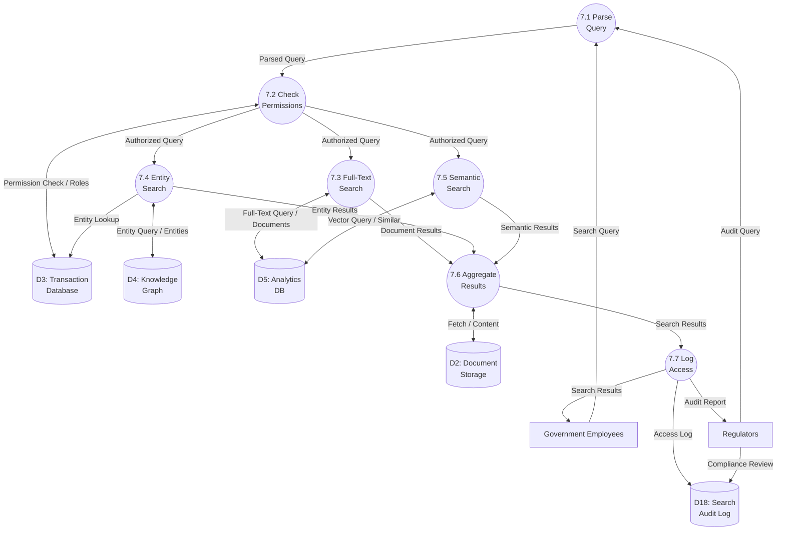

# Data Flow Diagram: IOU-Modern - Search & Query

> **Template Origin**: Official | **ArcKit Version**: 4.3.1 | **Command**: `/arckit:dfd`

## Document Control

| Field | Value |
|-------|-------|
| **Document ID** | ARC-001-DFD-011-v1.0 |
| **Document Type** | Data Flow Diagram |
| **Project** | IOU-Modern (Project 001) |
| **Classification** | OFFICIAL |
| **Status** | DRAFT |
| **Version** | 1.0 |
| **Created Date** | 2026-03-26 |
| **Last Modified** | 2026-03-26 |
| **Review Cycle** | Per release |
| **Next Review Date** | 2026-04-25 |
| **Owner** | Solution Architect |
| **Reviewed By** | PENDING |
| **Approved By** | PENDING |
| **Distribution** | Architecture Team, Development Team, Data Governance Committee |
| **DFD Level** | Level 2 (Process 7 Decomposition) |
| **Notation** | Yourdon-DeMarco |

## Revision History

| Version | Date | Author | Changes | Approved By | Approval Date |
|---------|------|--------|---------|-------------|---------------|
| 1.0 | 2026-03-26 | ArcKit AI | Initial creation from `/arckit:dfd` command | PENDING | PENDING |

---

## Executive Summary

This document contains a Level 2 Data Flow Diagram (DFD) for IOU-Modern, providing detailed decomposition of **Process 7: Search & Query** from the Level 1 DFD. This process represents the search and query infrastructure that enables full-text search, entity-based search, semantic search, and domain-scoped filtering with proper PII access logging and classification-based filtering.

**Parent Process**: P7 (Search & Query) from Level 1 DFD (ARC-001-DFD-001-v1.0)

**Scope**: Search workflow showing 7 sub-processes with detailed data flows between users, search indexes, document storage, knowledge graph, and analytics database.

**Search Types**: Full-text, entity-based, semantic, domain-scoped, faceted.

---

## Yourdon-DeMarco Notation Key

| Symbol | Shape | Description |
|--------|-------|-------------|
| **External Entity** | Rectangle | Source or sink of data outside the system boundary |
| **Process** | Circle | Transforms incoming data flows into outgoing data flows |
| **Data Store** | Open-ended rectangle (parallel lines) | Repository of data at rest |
| **Data Flow** | Named arrow | Data in motion between components |

---

## 1. Level 2 DFD - Process 7: Search & Query

The Level 2 DFD decomposes Process 7 into 7 sub-processes representing the complete search and query workflow.

### 1.1 data-flow-diagram DSL

```dfd
title Level 2 DFD - Process 7: Search & Query

store     D2         "D2: Document\nStorage"
store     D3         "D3: Transaction\nDatabase"
store     D4         "D4: Knowledge\nGraph"
store     D5         "D5: Analytics\nDB"
store     D18        "D18: Search\nAudit Log"

process   P7_1       "7.1\nParse\nQuery"
process   P7_2       "7.2\nCheck\nPermissions"
process   P7_3       "7.3\nFull-Text\nSearch"
process   P7_4       "7.4\nEntity\nSearch"
process   P7_5       "7.5\nSemantic\nSearch"
process   P7_6       "7.6\nAggregate\nResults"
process   P7_7       "7.7\nLog\nAccess"

entity    GOV_EMP    "Government\nEmployees"
entity    REGULATOR  "Regulators"

GOV_EMP   --> P7_1    "Search Query"
REGULATOR --> P7_1    "Audit Query"

P7_1      --> P7_2    "Parsed Query"
P7_2      --> D3      "Permission Check"
D3        --> P7_2    "User Roles"

P7_2      --> P7_3    "Authorized Query"
P7_2      --> P7_4    "Authorized Query"
P7_2      --> P7_5    "Authorized Query"

P7_3      --> D5      "Full-Text Query"
D5        --> P7_3    "Matching Documents"

P7_4      --> D4      "Entity Query"
D4        --> P7_4    "Related Entities"
P7_4      --> D3      "Entity Lookup"

P7_5      --> D5      "Vector Query"
D5        --> P7_5    "Similar Documents"

P7_3      --> P7_6    "Document Results"
P7_4      --> P7_6    "Entity Results"
P7_5      --> P7_6    "Semantic Results"

P7_6      --> D2      "Fetch Content"
D2        --> P7_6    "Document Content"

P7_6      --> P7_7    "Search Results"
P7_7      --> D18     "Access Log"
P7_7      --> GOV_EMP  "Search Results"
P7_7      --> REGULATOR "Audit Report"

REGULATOR --> D18     "Compliance Review"
```

### 1.2 Mermaid (Approximate)



---

## 2. Process Specifications

| Process | Name | Inputs | Outputs | Logic Summary | Req. Trace |
|---------|------|--------|---------|---------------|------------|
| 7.1 | Parse Query | Search query from GOV_EMP, Audit query from REGULATOR | Parsed query to P7.2 | Parses query syntax, extracts search terms, identifies search type (full-text/entity/semantic), extracts filters (domain, classification, date range), validates query format, handles pagination parameters, sanitizes input to prevent injection | FR-029, FR-032 |
| 7.2 | Check Permissions | Parsed query from P7.1, User roles from D3 | Authorized query to P7.3, P7.4, P7.5 | Retrieves user roles and domain scopes, validates access to requested domains, applies classification filtering (user can't see Geheim), checks PII access requirements, enforces row-level security, denies unauthorized queries with reason | FR-002, FR-003, NFR-SEC-004 |
| 7.3 | Full-Text Search | Authorized query from P7.2 | Document results to P7.6, Full-text query to D5, Matching documents from D5 | Queries DuckDB full-text index, performs BM25 ranking, applies filters (domain, classification, date), handles phrase queries, supports wildcards and boolean operators, returns top N results with relevance scores, highlights matching snippets | FR-029, NFR-PERF-002 |
| 7.4 | Entity Search | Authorized query from P7.2 | Entity results to P7_6, Entity query to D4, Related entities from D4, Entity lookup to D3 | Queries ArangoDB graph, finds Person/Organization/Location entities, traverses relationships (WorksFor, LocatedIn), returns connected entities, resolves entity to source documents, filters by domain scope, applies entity type filters | FR-030, FR-026 |
| 7.5 | Semantic Search | Authorized query from P7.2 | Semantic results to P7_6, Vector query to D5, Similar documents from D5 | Generates embedding for query text, performs vector similarity search (cosine), returns semantically similar documents, handles cross-language queries, applies relevance threshold, clusters related results, explains similarity scores | FR-031, FR-020 |
| 7.6 | Aggregate Results | Document results from P7.3, Entity results from P7.4, Semantic results from P7.5 | Search results to P7.7, Fetch content to D2, Document content from D2 | Merges results from multiple search types, applies unified ranking, deduplicates documents, fetches full content from D2, generates snippets and highlights, adds metadata (classification, Woo status), formats response (JSON/PDF), implements pagination | FR-029, NFR-PERF-002 |
| 7.7 | Log Access | Search results from P7.6 | Access log to D18, Search results to GOV_EMP, Audit report to REGULATOR | Logs all search queries with user ID, timestamp, query text, results count, filters applied, PII accessed flag, classification accessed, generates audit trail for compliance, supports compliance review by regulators, anonymizes logs after 7 years | NFR-SEC-005, FR-038 |

---

## 3. Data Store Descriptions

| Store | Name | Contents | Access Pattern | Retention | PII |
|-------|------|----------|----------------|-----------|-----|
| D2 | Document Storage | Raw document files (PDF, DOCX, email), Content blobs | Read by P7.6; Write by P2.3 | 1-20 years (per Archiefwet) | Indirect (file content) |
| D3 | Transaction Database | User roles, Domain scopes, Information objects metadata, Entity-source mappings | Read by P7.2, P7.4, P7.6; Write by P7.7 | 20 years maximum | Yes (user data) |
| D4 | Knowledge Graph | Person entities, Organization entities, Relationships, Communities, Entity embeddings | Read by P7.4; Write by P3.3, P6 | 20 years (linked to source) | Yes (Person entity names) |
| D5 | Analytics DB | Full-text search indexes, Vector embeddings, Query statistics, Performance metrics | Read by P7.3, P7.5; Write by P3.3 | 1 year hot, 7 years archive | No (aggregated data) |
| D18 | Search Audit Log | Search queries, User IDs, Timestamps, Results count, PII access flags, Classification accessed | Write by P7.7; Read by REGULATOR, ADMIN | 7 years (GDPR requirement) | Yes (user queries) |

---

## 4. Data Dictionary

| Data Flow | Composition | Source | Destination | Format |
|-----------|-------------|--------|-------------|--------|
| Search Query | {query_text, search_type, filters{}, page, page_size} | GOV_EMP | P7.1 | JSON API |
| Audit Query | {query_type, user_id, date_range, include_pii_flag} | REGULATOR | P7.1 | Structured query |
| Parsed Query | {terms[], search_type, domain_ids[], classifications[], date_range{}, page} | P7.1 | P7.2 | Internal object |
| Permission Check | {user_id, requested_domains[], requested_classifications[]} | P7.2 | D3 | SQL query |
| User Roles | {user_id, roles[], domain_scopes[], classification_level} | D3 | P7.2 | SQL result |
| Authorized Query | {authorized: boolean, permitted_domains[], permitted_classifications[], sanitized_query} | P7.2 | P7.3, P7.4, P7.5 | Internal object |
| Full-Text Query | {terms[], filters{}, limit, offset} | P7.3 | D5 | DuckDB SQL |
| Matching Documents | {object_id, title, snippet, score, classification, domain_id} | D5 | P7.3 | Result set |
| Document Results | {results[], total_count, query_id, search_type} | P7.3 | P7.6 | Internal array |
| Entity Query | {entity_name, entity_type, relationship_depth, domain_ids[]} | P7.4 | D4 | AQL query |
| Related Entities | {entity_id, name, type, relationships[], connected_documents[]} | D4 | P7.4 | Graph result |
| Entity Lookup | {entity_id, source_document_ids[]} | P7.4 | D3 | SQL query |
| Entity Results | {entities[], total_count, relationships[]} | P7.4 | P7.6 | Internal array |
| Vector Query | {query_embedding, similarity_threshold, limit, domain_ids[]} | P7.5 | D5 | Vector search |
| Similar Documents | {object_id, title, similarity_score, classification} | D5 | P7.5 | Result set |
| Semantic Results | {results[], total_count, similarity_scores[]} | P7.5 | P7.6 | Internal array |
| Fetch Content | {object_ids[], content_fields[]} | P7.6 | D2 | Batch fetch |
| Document Content | {object_id, content_text, mime_type, file_size} | D2 | P7.6 | Binary stream |
| Search Results | {results[], total_count, page, page_size, query_id, filters_applied, execution_time_ms} | P7.6 | P7.7 | JSON response |
| Access Log | {log_id, user_id, query_text, timestamp, results_count, pii_accessed, classifications_accessed} | P7.7 | D18 | SQL insert |
| Audit Report | {user_searches[], pii_access_events[], classification_access[], time_period} | P7.7 | REGULATOR | Compliance report |
| Compliance Review | {review_id, reviewer, findings[], recommendations} | REGULATOR | D18 | Review record |

---

## 5. Search Types and Algorithms

### 5.1 Full-Text Search (P7.3)

| Feature | Implementation | Example |
|---------|----------------|---------|
| **BM25 Ranking** | Okapi BM25 algorithm in DuckDB | Standard relevance scoring |
| **Phrase Search** | Quoted term matching | `"Wet open overheid"` |
| **Boolean Operators** | AND, OR, NOT | `Zaak AND Project` |
| **Wildcard** | Trailing * | `documen*` |
| **Proximity** | Within N words | `"Woo"~5 "besluit"` |
| **Field Weights** | Title > Description > Content | Title matches ranked higher |

### 5.2 Entity Search (P7.4)

| Entity Type | Search Pattern | Example |
|-------------|---------------|---------|
| **Person** | Find by name, variations | "Jan Janssen" → finds also "J. Janssen" |
| **Organization** | Find by name, aliases | "Gemeente Den Haag" |
| **Location** | Find by place, address | "Den Haag" |
| **Relationship Traversal** | Depth-limited graph walk | Find all people connected to Organization X within 2 hops |

### 5.3 Semantic Search (P7.5)

| Feature | Implementation | Example |
|---------|----------------|---------|
| **Embedding Model** | text-embedding-3-small (OpenAI) or sentence-transformers | 1536-dimensional vector |
| **Similarity Metric** | Cosine similarity | -1 to 1 score |
| **Cross-Language** | Multilingual embeddings | Query Dutch → finds English documents |
| **Threshold** | Minimum similarity 0.7 | Filter out weak matches |
| **Clustering** | K-means on results | Group similar documents |

---

## 6. Access Control and Filtering

### 6.1 Classification-Based Filtering

| User Classification Level | Can View | Cannot View |
|--------------------------|-----------|--------------|
| **Openbaar** (1) | Openbaar, Intern, Vertrouwelijk, Geheim | None |
| **Intern** (2) | Intern, Vertrouwelijk, Geheim | Openbaar |
| **Vertrouwelijk** (3) | Vertrouwelijk, Geheim | Openbaar, Intern |
| **Geheim** (4) | Geheim only | Openbaar, Intern, Vertrouwelijk |

### 6.2 Domain-Scoped Search

| Scope | Description | Example |
|-------|-------------|---------|
| **Global** | Search all domains (admin only) | Across entire organization |
| **Organization** | Search all domains in organization | Within municipality |
| **Owned** | Search only owned domains | Domain owner's domains |
| **Member** | Search domains user is member of | Project collaborator |
| **Explicit** | Search explicitly granted domains | Via domain-scoped role |

### 6.3 PII Access Logging

D18 tracks all PII access for GDPR compliance:

| Event | Logged Fields | Trigger |
|-------|--------------|---------|
| **Person entity accessed** | entity_id, entity_name, user_id, timestamp | P7.4 returns Person entities |
| **Privacy Level >= Normaal** | object_id, privacy_level, user_id, timestamp | P7.3 returns results with PII |
| **Classification > Intern** | object_id, classification, user_id, timestamp | User accesses restricted data |
| **Full content fetch** | object_id, file_size, user_id, timestamp | P7.6 fetches from D2 |

---

## 7. Query Examples

### 7.1 Full-Text Search Examples

| Query | Description | SQL Equivalent |
|-------|-------------|----------------|
| `bouwvergunning` | Single term search | `WHERE content_text LIKE '%bouwvergunning%'` |
| `"Woo besluit"` | Phrase search | Exact phrase match |
| `Zaak AND Project` | Boolean AND | Both terms present |
| `Zaak OR Project` | Boolean OR | Either term present |
| `Zaak NOT Project` | Boolean NOT | Exclude term |
| `Zaak*` | Wildcard | Starts with Zaak |
| `Woo~2` | Fuzzy proximity | Within 2 words |

### 7.2 Entity Search Examples

| Query | Description | Graph Traversal |
|-------|-------------|-----------------|
| `Person: "Jan Janssen"` | Find person entity | Direct entity lookup |
| `WorksFor("Gemeente")` | Find organization members | 1-hop traversal |
| `ConnectedTo("Jan Janssen", 2)` | Find within 2 hops | 2-hop traversal |
| `Community("Project X")` | Find in community | Community members |

### 7.3 Semantic Search Examples

| Query | Description | Result Type |
|-------|-------------|-------------|
| "Hoeveel kost een vergunning" | Question in Dutch | Semantically similar documents |
| "Permit cost calculation" | Question in English | Cross-language match |
| "Besluiten over bouwen" | Topic search | Similar decisions |

---

## 8. Performance Optimization

### 8.1 Search Performance Targets

| Metric | Target | Measurement |
|--------|--------|-------------|
| Full-text search response | <2 seconds p95 | P7.3 end-to-end |
| Entity search response | <1 second p95 | P7.4 end-to-end |
| Semantic search response | <3 seconds p95 | P7.5 end-to-end |
| Aggregate results | <500ms p95 | P7.6 processing |
| Overall search latency | <2 seconds p95 | GOV_EMP → P7.7 |

### 8.2 Indexing Strategy

| Index Type | Store | Purpose | Update Frequency |
|-------------|-------|---------|------------------|
| **Full-text index** | D5 (DuckDB) | Fast text search | Real-time (P2.4 trigger) |
| **Vector index** | D5 (pgvector/IVFFlat) | Similarity search | Batch (nightly) |
| **Graph index** | D4 (ArangoDB) | Entity traversal | Real-time (P6 updates) |
| **Classification filter** | D3 (PostgreSQL) | Security filtering | Real-time |

### 8.3 Caching Strategy

| Cache Type | Duration | Invalidation |
|------------|----------|--------------|
| **Query results** | 5 minutes | On document update |
| **Popular queries** | 1 hour | On index refresh |
| **Entity lookups** | 30 minutes | On graph update |
| **User permissions** | 15 minutes | On role change |

---

## 9. Requirements Traceability

### 9.1 Business Requirements Traceability

| Business Req | Sub-Process | Data Store | Data Flow |
|--------------|-------------|------------|-----------|
| BR-019 (Full-text search) | P7.3 | D5 | Full-text query |
| BR-020 (Semantic search) | P7.5 | D5 | Vector query |
| BR-035-045 (AI/KG) | P7.4 | D4 | Entity search |
| BR-028 (PII tracking) | P7.7 | D18 | Access log |

### 9.2 Functional Requirements Traceability

| Functional Req | Sub-Process | Data Flow Trace |
|----------------|-------------|-----------------|
| FR-029 (Full-text search) | P7.3 | Full-text Query → Matching Documents |
| FR-030 (Entity-based search) | P7.4 | Entity Query → Related Entities |
| FR-031 (Semantic search) | P7.5 | Vector Query → Similar Documents |
| FR-032 (Domain-scoped search) | P7.2 | Authorized Query with domain_ids[] |
| FR-038 (Logging) | P7.7 | Access Log to D18 |

### 9.3 Non-Functional Requirements Traceability

| NFR Category | NFR ID | DFD Implementation |
|--------------|--------|-------------------|
| Performance | NFR-PERF-002 | P7.3, P7.4, P7.5 <2 second response |
| Performance | NFR-PERF-003 | P7.2, P7.6 API <500ms |
| Security | NFR-SEC-004 | P7.2 RBAC + domain-scoped access |
| Security | NFR-SEC-005 | P7.7 PII access logging |

---

## 10. DFD Balancing Check (Level 1 to Level 2)

| Level 1 Boundary Flow | Direction | Present at Level 2? | Notes |
|------------------------|-----------|---------------------|-------|
| GOV_EMP → P7 (Search Query) | In | ✅ Yes (GOV_EMP → P7.1) | Query parsing |
| REGULATOR → P7 (Audit Query) | In | ✅ Yes (REGULATOR → P7.1, P7.7 → REGULATOR) | Compliance access |
| P7 ↔ D3 (Query Metadata) | Bidirectional | ✅ Yes (P7.2 ↔ D3, P7.4 → D3, P7.6 → D3) | Metadata and permissions |
| P7 ↔ D4 (Entity Search) | Bidirectional | ✅ Yes (P7.4 ↔ D4) | Entity queries |
| P7 ↔ D2 (Fetch Documents) | Bidirectional | ✅ Yes (P7.6 ↔ D2) | Content retrieval |
| P7 → GOV_EMP (Search Results) | Out | ✅ Yes (P7.7 → GOV_EMP) | Formatted results |
| REGULATOR → P7 (Audit Query) | Side flow | ✅ Yes (REGULATOR → P7.1, P7.7 → REGULATOR) | Compliance reports |

**Balancing Status**: All flows balanced + Added D18 (Search Audit Log) for PII access tracking and D5 (Analytics DB) for full-text and vector indexes

---

## 11. Technology Stack Notes

| Sub-Process | Technology | Notes |
|-------------|------------|-------|
| P7.1 Parse Query | Query parser, Lucene query syntax | Sanitization against injection |
| P7.2 Check Permissions | PostgreSQL RLS, Django RBAC | Row-level security by organization |
| P7.3 Full-Text Search | DuckDB FTS, bm25() function | In-memory full-text index |
| P7.4 Entity Search | ArangoDB AQL, graph traversal | 1-3 hop depth limit |
| P7.5 Semantic Search | pgvector IVFFlat, cosine similarity | Embedding model: text-embedding-3-small |
| P7.6 Aggregate Results | Python/Polars for result merging | Deduplication by object_id |
| P7.7 Log Access | PostgreSQL with partitioning | 7-year retention, time-series optimization |
| D5 Analytics DB | DuckDB + pgvector | Hybrid search architecture |
| D18 Search Audit Log | PostgreSQL with partitioning | By date, compress after 30 days |

---

## 12. Related Documents

| Document | ID |
|----------|-----|
| Parent DFD (Level 0-1) | ARC-001-DFD-001-v1.0 |
| Requirements | ARC-001-REQ-v1.1 |
| Data Model | ARC-001-DATA-v1.0 |
| Architecture Diagrams | ARC-001-DIAG-v1.0 |
| Process 3 DFD | ARC-001-DFD-002-v1.0 (upstream document processor) |
| Process 6 DFD | ARC-001-DFD-005-v1.0 (knowledge graph builder) |

---

## 13. Rendering Tools

| Tool | Type | Yourdon-DeMarco | How to Use |
|------|------|-----------------|------------|
| **data-flow-diagram** | CLI (Python) | True notation | `pip install data-flow-diagram` then `dfd < file.dfd` |
| **Mermaid** | Text-to-diagram | Approximate | Paste into [mermaid.live](https://mermaid.live) or view in GitHub |
| **draw.io** | Online editor | True notation | Open [app.diagrams.net](https://app.diagrams.net), enable "Data Flow Diagrams" shapes |
| **Visual Paradigm** | Online editor | True notation | [online.visual-paradigm.com](https://online.visual-paradigm.com) |

---

**END OF DATA FLOW DIAGRAM**

## Generation Metadata

**Generated by**: ArcKit `/arckit:dfd` command
**Generated on**: 2026-03-26 22:00 GMT
**ArcKit Version**: 4.3.1
**Project**: IOU-Modern (Project 001)
**AI Model**: Claude Opus 4.6
**DFD Level**: Level 2 - Process 7 (Search & Query) Decomposition
**Parent Document**: ARC-001-DFD-001-v1.0
