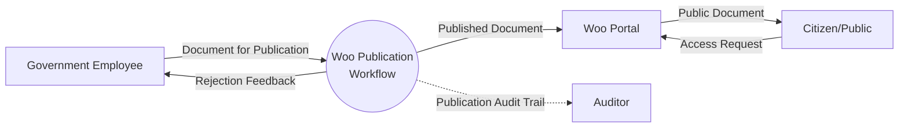
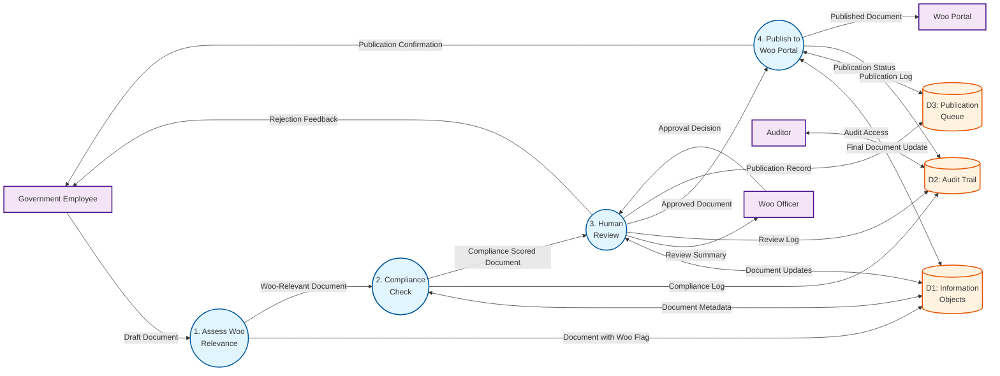
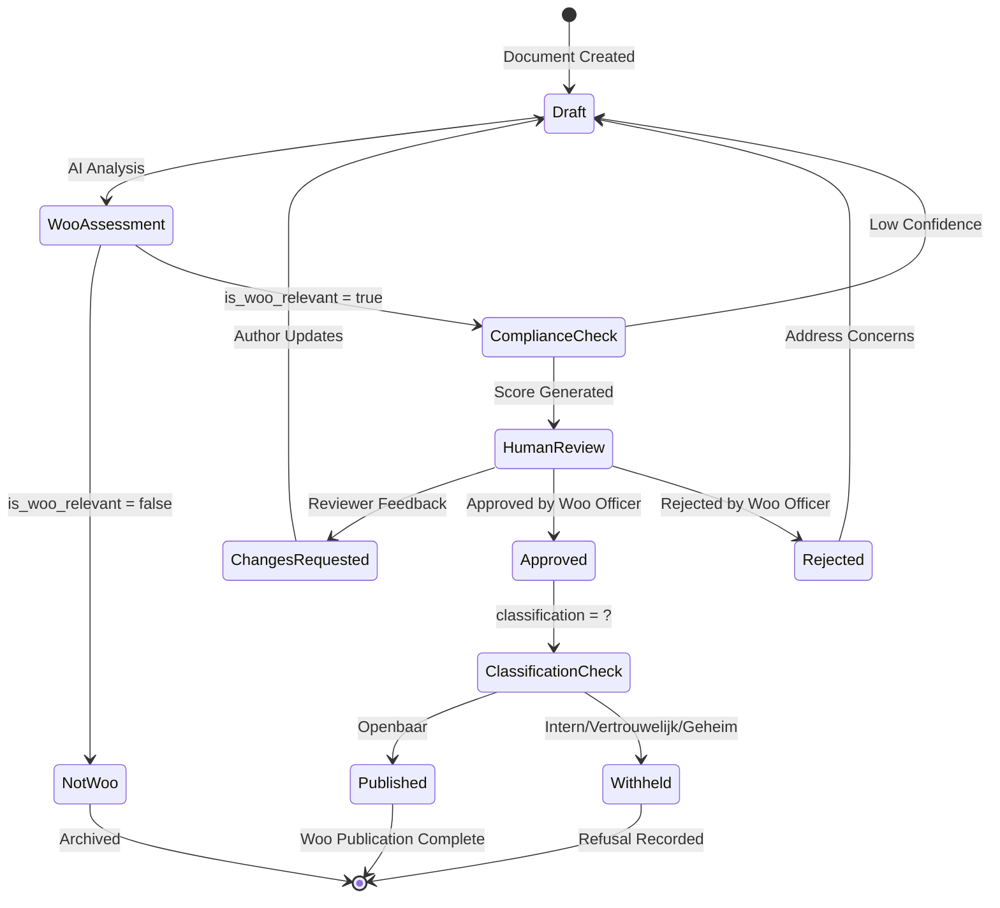

# Data Flow Diagram: Woo Publication Workflow

> **Template Origin**: Official | **ArcKit Version**: 4.3.1 | **Command**: `/arckit.dfd`

## Document Control

| Field | Value |
|-------|-------|
| **Document ID** | ARC-001-DFD-012-v1.0 |
| **Document Type** | Data Flow Diagram |
| **Project** | IOU-Modern (Project 001) |
| **Classification** | OFFICIAL |
| **Status** | DRAFT |
| **Version** | 1.0 |
| **Created Date** | 2026-04-01 |
| **Last Modified** | 2026-04-01 |
| **Review Cycle** | Quarterly |
| **Next Review Date** | 2026-07-01 |
| **Owner** | Solution Architect |
| **Reviewed By** | PENDING |
| **Approved By** | PENDING |
| **Distribution** | Project Team, Architecture Team, Woo Officers |
| **DFD Level** | Level 1 (Process Flow) |
| **Notation** | Yourdon-DeMarco |

## Revision History

| Version | Date | Author | Changes | Approved By | Approval Date |
|---------|------|--------|---------|-------------|---------------|
| 1.0 | 2026-04-01 | ArcKit AI | Initial creation from `/arckit.dfd` command | PENDING | PENDING |

---

## Yourdon-DeMarco Notation Key

| Symbol | Shape | Description |
|--------|-------|-------------|
| **External Entity** | Rectangle | Source or sink of data outside the system boundary |
| **Process** | Circle | Transforms incoming data flows into outgoing data flows |
| **Data Store** | Open-ended rectangle (parallel lines) | Repository of data at rest |
| **Data Flow** | Named arrow | Data in motion between components |

---

## Overview

This DFD documents the **Woo Publication Workflow** for IOU-Modern, covering the end-to-end process from document creation through Woo (Wet open overheid) assessment, human review, and publication to the public Woo portal. This workflow ensures compliance with the Dutch Government Information Act while maintaining human oversight for all publications.

**Workflow Scope**: Documents assessed as Woo-relevant proceed through AI-assisted compliance checking, mandatory human review by Woo Officers, and automated publication to the Woo portal.

---

## Context Diagram (Level 0): Woo Publication Workflow

### `data-flow-diagram` Format

Render with: `pip install data-flow-diagram` then `dfd < file.dfd` (produces SVG/PNG with true Yourdon-DeMarco notation)

```dfd
title Context Diagram - Woo Publication Workflow

entity    EMP     "Government Employee"
entity    WOO     "Woo Portal"
entity    CIT     "Citizen/Public"
entity    AUD     "Auditor"

process   P0      "Woo Publication\nWorkflow"

EMP  --> P0    "Document for Publication"
P0    --> EMP  "Rejection Feedback"
P0    --> WOO  "Published Document"
CIT  --> WOO    "Access Request"
WOO  --> CIT    "Public Document"
P0    --> AUD    "Publication Audit Trail"
```

### Mermaid Format

View at [mermaid.live](https://mermaid.live) or in GitHub/VS Code markdown preview.



---

## Level 1 DFD: Woo Publication Process Flow

### `data-flow-diagram` Format

```dfd
title Level 1 DFD - Woo Publication Workflow

entity    EMP     "Government Employee"
entity    WOO     "Woo Portal"
entity    OFF     "Woo Officer"
entity    AUD     "Auditor"

process   P1      "1\nAssess Woo\nRelevance"
process   P2      "2\nCompliance\nCheck"
process   P3      "3\nHuman\nReview"
process   P4      "4\nPublish to\nWoo Portal"

store     D1      "Information Objects"
store     D2      "Audit Trail"
store     D3      "Publication Queue"

EMP  --> P1    "Draft Document"
P1    --> D1    "Document with Woo Flag"
P1    --> P2    "Woo-Relevant Document"
P2    <--> D1    "Document Metadata"
P2    --> D2    "Compliance Log"
P2    --> P3    "Compliance Scored Document"
P3    <--> D1    "Document Updates"
OFF   --> P3    "Approval Decision"
P3    --> OFF   "Review Summary"
P3    --> D2    "Review Log"
P3    --> EMP   "Rejection Feedback"
P3    --> P4    "Approved Document"
P3    --> D3    "Publication Record"
P4    <--> D1    "Final Document Update"
P4    <--> D3    "Publication Status"
P4    --> D2    "Publication Log"
P4    --> WOO    "Published Document"
P4    --> EMP   "Publication Confirmation"
AUD   <--> D2    "Audit Access"
```

### Mermaid Format



---

## Process Specifications

| Process ID | Name | Inputs | Outputs | Logic Summary | Req. Trace |
|------------|------|--------|---------|---------------|------------|
| P1 | Assess Woo Relevance | Draft Document (title, content_text, metadata) | Document with is_woo_relevant flag | AI classifier analyses document content for Woo relevance indicators (government decisions, public interest topics). Sets is_woo_relevant = true if confidence > 0.7. Flagged documents proceed to compliance check. | BR-013, BR-021, FR-017 |
| P2 | Compliance Check | Woo-Relevant Document | Compliance Score (0.0-1.0), Classification verification, PII scan results | Validates classification (Openbaar/Intern/Vertrouwelijk/Geheim). Scans for PII using NER. Checks retention period compliance. Calculates overall compliance_score. Results logged to AuditTrail. | BR-015, BR-040, NFR-SEC-005 |
| P3 | Human Review | Compliance Scored Document, Approval Decision | Approved/Rejected Document, Review Summary | Woo Officer reviews AI assessment. Can override classification and compliance decisions. All Woo-relevant documents MUST have human approval before publication (legal requirement). Rejection returns document to author with feedback. | BR-022, BR-026, BR-041, FR-019 |
| P4 | Publish to Woo Portal | Approved Document | Published Document, Publication Confirmation | For documents with classification = Openbaar AND approval = granted: formats document for Woo portal, sets woo_publication_date, publishes via API. Logs publication event. Sends confirmation to author. Non-openbaar documents are withheld with refusal reason recorded. | BR-023, BR-024, BR-025, FR-020 |

---

## Data Store Descriptions

| Store ID | Name | Contents | Access Pattern | Retention | Contains PII |
|----------|------|----------|----------------|-----------|-------------|
| D1 | Information Objects | Document metadata, content_location, classification, is_woo_relevant, woo_publication_date, privacy_level | Read/Write by all processes. Primary store for document state. | 1-20 years (per Archiefwet) | Indirect (via content_text) |
| D2 | Audit Trail | Agent actions, compliance scores, approval decisions, publication events with timestamps | Write by all processes. Read by Auditors. | 7 years (compliance standard) | No |
| D3 | Publication Queue | Pending publications, publication status, retry counts | Write by P3, Read/Write by P4. | 90 days (operational) | No |

---

## Data Dictionary

| Data Flow | Composition | Source | Destination | Format |
|-----------|-------------|--------|-------------|--------|
| Draft Document | {title, description, content_text, domain_id, created_by, object_type} | Government Employee | P1 | JSON |
| Document with Woo Flag | {id, is_woo_relevant, woo_confidence, ...} | P1 | D1 | JSON |
| Woo-Relevant Document | {id, title, content_text, classification, is_woo_relevant} | P1 | P2 | JSON |
| Compliance Score | {compliance_score: float, pii_detected: boolean, retention_valid: boolean, checks: array} | P2 | P3 | JSON |
| Compliance Log | {timestamp, agent_name, action: "compliance_check", details: {...}} | P2 | D2 | JSON |
| Approval Decision | {approved: boolean, reviewer_id, decision_date, comments} | Woo Officer | P3 | JSON |
| Review Summary | {document_id, approval_status, modifications, refusal_reason} | P3 | Woo Officer | JSON |
| Review Log | {timestamp, agent_name: "human_review", action, reviewer_id, decision} | P3 | D2 | JSON |
| Rejection Feedback | {document_id, reason, required_changes} | P3 | Government Employee | JSON |
| Approved Document | {id, woo_publication_date, classification: "Openbaar", approval_token} | P3 | P4 | JSON |
| Publication Record | {document_id, queued_at, status: "pending", woo_portal_target} | P3 | D3 | JSON |
| Published Document | {id, woo_url, publication_date, access_count} | P4 | Woo Portal | JSON (API) |
| Publication Confirmation | {document_id, woo_url, publication_timestamp} | P4 | Government Employee | JSON |
| Publication Log | {timestamp, agent_name: "publisher", action: "published", woo_url} | P4 | D2 | JSON |

---

## Requirements Traceability

| DFD Element | Element Type | Requirement ID | Requirement Description | Coverage |
|-------------|-------------|----------------|-------------------------|----------|
| P1 | Process | BR-013 | System shall assess all documents for Woo relevance | Full |
| P1 | Process | BR-021 | System shall automatically identify Woo-relevant documents | Full |
| P1 | Process | FR-017 | System shall assess Woo relevance | Full |
| P2 | Process | BR-015 | System shall track document compliance score | Full |
| P2 | Process | BR-040 | System shall provide AI compliance checking | Full |
| P2 | Process | NFR-SEC-005 | Audit logging for all PII access | Full |
| P3 | Process | BR-022 | System shall require human approval before publishing Woo-relevant documents | Full |
| P3 | Process | BR-026 | System shall support Woo publication workflow with audit trail | Full |
| P3 | Process | BR-041 | System shall maintain human oversight for AI decisions | Full |
| P3 | Process | FR-019 | System shall record human approval decisions | Full |
| P4 | Process | BR-023 | System shall publish Openbaar documents to Woo portal | Full |
| P4 | Process | BR-024 | System shall track refusal grounds for non-publication | Full |
| P4 | Process | BR-025 | System shall track Woo publication date for compliance | Full |
| P4 | Process | FR-020 | System shall publish approved documents to Woo portal | Full |
| D1 | Store | E-003 | InformationObject entity with Woo metadata | Full |
| D2 | Store | E-010 | AuditTrail entity for workflow logging | Full |
| D3 | Store | E-003 | Document state tracking | Full |
| Government Employee | Entity | FR-001 | System shall authenticate users via DigiD | Full (via P0) |
| Woo Officer | Entity | FR-002 | System shall support role-based access control | Full |
| Woo Portal | Entity | INT-101 | Woo publication integration | Full |

**Coverage Summary**:

- Total Requirements Mapped: 18
- Fully Covered: 18
- Partially Covered: 0
- Not Covered: 0

---

## DFD Balancing Check

| Level 0 Boundary Flow | Direction | Present at Level 1? | Notes |
|------------------------|-----------|---------------------|-------|
| Document for Publication | In | Yes (EMP → P1) | Draft document enters workflow |
| Rejection Feedback | Out | Yes (P3 → EMP) | Returned if rejected |
| Published Document | Out | Yes (P4 → WOO) | Final output to portal |
| Publication Audit Trail | Out | Yes (P2/P3/P4 → D2) | Compliance logging |

**Balancing Status**: All flows balanced

---

## State Transition Diagram: Woo Publication



---

## Security and Compliance Considerations

### Trust Boundaries

| Boundary | Inside | Outside | Protection Mechanism |
|----------|--------|---------|---------------------|
| IOU-Modern System | P1-P4, D1-D3 | Government Employee, Woo Officer, Auditor, Citizen | TLS 1.3, DigiD + MFA authentication |
| Woo Portal Interface | P4 | Woo Portal | API key, mutual TLS |

### Privacy and PII Handling

| Data Flow | PII Present? | Protection | Retention |
|-----------|-------------|------------|-----------|
| Draft Document | Yes (potential) | Encrypted at rest (AES-256), TLS in transit | Per document type |
| Compliance Score | No (metadata only) | Standard protection | 7 years (audit) |
| Published Document | No (PII redacted) | Public access | Permanent |

### Woo Compliance Checks

1. **Automatic Assessment** (P1): AI classifier identifies Woo-relevant content
2. **Classification Validation** (P2): Verifies document is Openbaar before publication
3. **Human Approval** (P3): MANDATORY for all Woo-relevant documents
4. **Publication Tracking** (P4): Records woo_publication_date for compliance audit

---

## Error Handling and Exception Flows

| Exception | Detection Point | Handler | Recovery |
|-----------|-----------------|---------|----------|
| Low Confidence Assessment | P1 | Route to Human Review | Manual assessment by Woo Officer |
| PII Detected in Openbaar Document | P2 | Block Publication | Requires classification change or redaction |
| Publication API Failure | P4 | Retry Queue | 3 retries with exponential backoff |
| Approval Timeout | P3 | Escalation | Escalate to senior Woo Officer after 7 days |

---

## Rendering Tools

| Tool | Type | Yourdon-DeMarco | How to Use |
|------|------|-----------------|------------|
| **data-flow-diagram** | CLI (Python) | True notation | `pip install data-flow-diagram` then `dfd < file.dfd` |
| **Mermaid** | Text-to-diagram | Approximate | Paste into [mermaid.live](https://mermaid.live) or view in GitHub |
| **draw.io** | Online editor | True notation | Open [app.diagrams.net](https://app.diagrams.net), enable "Data Flow Diagrams" shapes |
| **Visual Paradigm** | Online editor | True notation | [online.visual-paradigm.com](https://online.visual-paradigm.com) |

---

## Linked Artifacts

**Requirements**: `projects/001-iou-modern/ARC-001-REQ-v1.1.md`
**Data Model**: `projects/001-iou-modern/ARC-001-DATA-v1.0.md`
**Architecture Diagrams**: `projects/001-iou-modern/ARC-001-DIAG-v1.0.md`
**Architecture Principles**: `projects/000-global/ARC-000-PRIN-v1.0.md`
**Related DFDs**: ARC-001-DFD-008-v1.0 (Document Processing), ARC-001-DFD-011-v1.0 (SAR Workflow)

---

**Generated by**: ArcKit `/arckit.dfd` command
**Generated on**: 2026-04-01 18:16 GMT
**ArcKit Version**: 4.3.1
**Project**: IOU-Modern (Project 001)
**AI Model**: Claude Opus 4.6
**DFD Level**: Level 1 (Process Flow - Woo Publication Workflow)
