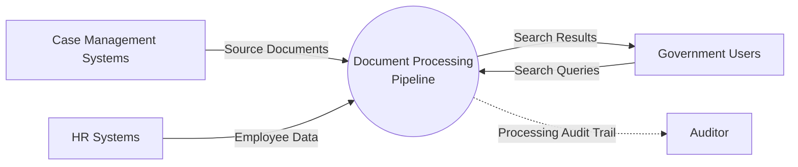
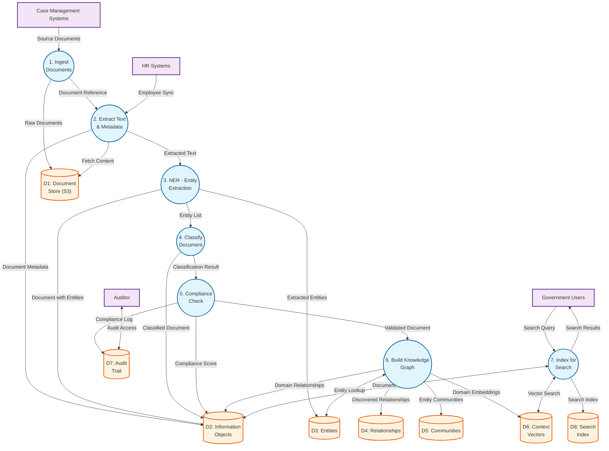

# Data Flow Diagram: Document Processing Pipeline

> **Template Origin**: Official | **ArcKit Version**: 4.3.1 | **Command**: `/arckit.dfd`

## Document Control

| Field | Value |
|-------|-------|
| **Document ID** | ARC-001-DFD-013-v1.0 |
| **Document Type** | Data Flow Diagram |
| **Project** | IOU-Modern (Project 001) |
| **Classification** | OFFICIAL |
| **Status** | DRAFT |
| **Version** | 1.0 |
| **Created Date** | 2026-04-01 |
| **Last Modified** | 2026-04-01 |
| **Review Cycle** | Quarterly |
| **Next Review Date** | 2026-07-01 |
| **Owner** | Solution Architect |
| **Reviewed By** | PENDING |
| **Approved By** | PENDING |
| **Distribution** | Project Team, Architecture Team, Data Engineers |
| **DFD Level** | Level 1 (Process Flow) |
| **Notation** | Yourdon-DeMarco |

## Revision History

| Version | Date | Author | Changes | Approved By | Approval Date |
|---------|------|--------|---------|-------------|---------------|
| 1.0 | 2026-04-01 | ArcKit AI | Initial creation from `/arckit.dfd` command | PENDING | PENDING |

---

## Yourdon-DeMarco Notation Key

| Symbol | Shape | Description |
|--------|-------|-------------|
| **External Entity** | Rectangle | Source or sink of data outside the system boundary |
| **Process** | Circle | Transforms incoming data flows into outgoing data flows |
| **Data Store** | Open-ended rectangle (parallel lines) | Repository of data at rest |
| **Data Flow** | Named arrow | Data in motion between components |

---

## Overview

This DFD documents the **Document Processing Pipeline** for IOU-Modern, covering the end-to-end AI-powered workflow from document ingestion through entity extraction, classification, compliance checking, and knowledge graph population.

**Workflow Scope**: Documents from external case management systems are processed through AI agents (Research, Content, Compliance, Review) to extract entities, classify content, ensure compliance, and build the knowledge graph.

---

## Context Diagram (Level 0): Document Processing Pipeline

### `data-flow-diagram` Format

Render with: `pip install data-flow-diagram` then `dfd < file.dfd` (produces SVG/PNG with true Yourdon-DeMarco notation)

```dfd
title Context Diagram - Document Processing Pipeline

entity    CS      "Case Management Systems"
entity    HR      "HR Systems"
entity    USR     "Government Users"
entity    AUD     "Auditor"

process   P0      "Document Processing\nPipeline"

CS   --> P0    "Source Documents"
HR   --> P0    "Employee Data"
USR  --> P0    "Search Queries"
P0   --> USR    "Search Results"
P0   --> AUD    "Processing Audit Trail"
```

### Mermaid Format

View at [mermaid.live](https://mermaid.live) or in GitHub/VS Code markdown preview.



---

## Level 1 DFD: Document Processing Pipeline

### `data-flow-diagram` Format

```dfd
title Level 1 DFD - Document Processing Pipeline

entity    CS      "Case Management"
entity    HR      "HR Systems"
entity    USR     "Government Users"
entity    AUD     "Auditor"

process   P1      "1\nIngest\nDocuments"
process   P2      "2\nExtract Text\n& Metadata"
process   P3      "3\nNER - Entity\nExtraction"
process   P4      "4\nClassify\nDocument"
process   P5      "5\nCompliance\nCheck"
process   P6      "6\nBuild Knowledge\nGraph"
process   P7      "7\nIndex for\nSearch"

store     D1      "Document Store (S3)"
store     D2      "Information Objects"
store     D3      "Entities"
store     D4      "Relationships"
store     D5      "Communities"
store     D6      "Context Vectors"
store     D7      "Audit Trail"
store     D8      "Search Index"

CS   --> P1    "Source Documents"
P1   --> D1    "Raw Documents"
P1   --> P2    "Document Reference"
P2   --> D1    "Fetch Content"
P2   --> D2    "Document Metadata"
P2   --> P3    "Extracted Text"
P3   --> D2    "Document with Entities"
P3   --> D3    "Extracted Entities"
P3   --> P4    "Entity List"
P4   --> D2    "Classified Document"
P4   --> P5    "Classification Result"
P5   --> D2    "Compliance Score"
P5   --> D7    "Compliance Log"
P5   --> P6    "Validated Document"
P6   <--> D3    "Entity Lookup"
P6   --> D4    "Discovered Relationships"
P6   --> D5    "Entity Communities"
P6   --> D6    "Domain Embeddings"
P6   --> D2    "Domain Relationships"
P7   <--> D2    "Document Content"
P7   <--> D6    "Vector Search"
P7   --> D8    "Search Index"
USR  --> P7    "Search Query"
P7   --> USR    "Search Results"
HR   --> P2    "Employee Sync"
AUD  <--> D7    "Audit Access"
```

### Mermaid Format



---

## Process Specifications

| Process ID | Name | Inputs | Outputs | Logic Summary | Req. Trace |
|------------|------|--------|---------|---------------|------------|
| P1 | Ingest Documents | Source Documents (file_path, case_id) | Raw Documents in S3, Document Reference | ETL batch process ingests documents from Sqills/Centric case management systems. Stores raw files in MinIO/S3. Creates InformationObject records with content_location. Scheduled daily (02:00 UTC). | FR-013, FR-014, INT-001 |
| P2 | Extract Text & Metadata | Document Reference, Employee Data | Extracted Text, Document Metadata | Extracts text from PDF/DOCX/DOC using Tika/Poppler. Populates content_text field. Syncs with HR system for employee references. Validates file format and integrity. | FR-015, NFR-PERF-001 |
| P3 | NER - Entity Extraction | Extracted Text | Extracted Entities, Document with Entities | AI-powered Named Entity Recognition identifies Person, Organization, Location, Law, Date, Money entities. Assigns confidence scores. Links entities to source domain. Stores in Entities table. | BR-035, FR-023, FR-024, FR-025 |
| P4 | Classify Document | Entity List, Document Metadata | Classified Document, Classification Result | AI classifier assigns: security classification (Openbaar/Intern/Vertrouwelijk/Geheim), Woo relevance flag, privacy level (Openbaar/Normaal/Bijzonder/Strafrechtelijk). Default: Intern, Normaal. | BR-012, BR-013, BR-017, FR-016, FR-017 |
| P5 | Compliance Check | Classification Result, Document Content | Compliance Score, Compliance Log | Validates retention period per Archiefwet. Checks PII presence against privacy level. Generates compliance_score (0.0-1.0). Low scores trigger human review. Logs all checks to AuditTrail. | BR-015, BR-040, NFR-SEC-005 |
| P6 | Build Knowledge Graph | Validated Document, Entity Lookup | Relationships, Communities, Domain Embeddings, Domain Relationships | GraphRAG discovers relationships between entities (WorksFor, LocatedIn, SubjectTo, etc.). Clusters entities into communities. Generates domain-level embeddings for semantic search. Creates domain relationships for cross-domain discovery. | BR-036, BR-037, FR-026, FR-027 |
| P7 | Index for Search | Document Content, Vector Embeddings, Search Query | Search Index, Search Results | Full-text indexing of content_text. Vector embeddings for semantic search. Hybrid search (keyword + semantic) with domain filtering. Returns ranked results with relevance scores. | BR-019, BR-020, FR-029, FR-031, FR-032 |

---

## Data Store Descriptions

| Store ID | Name | Contents | Access Pattern | Retention | Contains PII |
|----------|------|----------|----------------|-----------|-------------|
| D1 | Document Store (S3) | Raw document files (PDF, DOCX, email, chat) | Write by P1, Read by P2 | 20 years (Archiefwet) | Yes (in content) |
| D2 | Information Objects | Document metadata, classification, Woo flags, domain associations | Read/Write by all processes | 1-20 years (per object type) | Indirect |
| D3 | Entities | Named entities (Person, Organization, Location, etc.) with confidence | Read/Write by P3, P6 | 20 years (source document) | Yes (Person names) |
| D4 | Relationships | Entity-to-entity relationships with weights and context | Write by P6, Read by P6 | 20 years (source document) | Indirect |
| D5 | Communities | Entity clusters with summaries and keywords | Write by P6, Read by search | 20 years (source document) | No |
| D6 | Context Vectors | Domain embeddings for semantic search | Write by P6, Read by P7 | 20 years (domain) | No |
| D7 | Audit Trail | Agent actions, compliance checks, timestamps | Write by all processes, Read by auditors | 7 years (compliance) | No |
| D8 | Search Index | Full-text and vector search indexes | Write by P7, Read by P7 | Rebuilt daily | No |

---

## Data Dictionary

| Data Flow | Composition | Source | Destination | Format |
|-----------|-------------|--------|-------------|--------|
| Source Documents | {file_path, case_id, document_type, created_at, source_system} | Case Management Systems | P1 | JSON/Files |
| Raw Documents | {s3_key, bucket, file_size, mime_type, checksum} | P1 | D1 | S3 Object |
| Document Reference | {id, content_location, domain_id, object_type, source_case_id} | P1 | P2 | JSON |
| Employee Sync | {employee_id, name, department, email, sync_timestamp} | HR Systems | P2 | JSON (API) |
| Extracted Text | {id, content_text, page_count, language, extraction_confidence} | P2 | P3 | JSON |
| Document Metadata | {title, description, created_by, domain_id, tags} | P2 | D2 | JSON |
| Extracted Entities | [{id, name, entity_type, canonical_name, confidence, position}] | P3 | D3 | JSON Array |
| Document with Entities | {id, entity_ids: [], entity_count, pii_detected} | P3 | D2 | JSON |
| Entity List | [{entity_id, name, type, confidence}] | P3 | P4 | JSON Array |
| Classification Result | {classification, is_woo_relevant, privacy_level, confidence} | P4 | P5 | JSON |
| Classified Document | {id, classification, is_woo_relevant, privacy_level, woo_confidence} | P4 | D2 | JSON |
| Compliance Score | {compliance_score, checks_passed, checks_failed, retention_valid} | P5 | D2 | JSON |
| Compliance Log | {timestamp, check_type, result, score, agent_name} | P5 | D7 | JSON |
| Validated Document | {id, compliance_score, approved_for_processing} | P5 | P6 | JSON |
| Relationships | [{source_entity_id, target_entity_id, relationship_type, weight, context}] | P6 | D4 | JSON Array |
| Entity Communities | [{community_id, name, summary, member_count, level}] | P6 | D5 | JSON Array |
| Domain Embeddings | {domain_id, vector: [], model_name, created_at} | P6 | D6 | JSON |
| Domain Relationships | [{from_domain_id, to_domain_id, relation_type, strength}] | P6 | D2 | JSON Array |
| Search Query | {query, filters, domain_scope, user_id} | Government Users | P7 | JSON |
| Search Results | [{doc_id, title, score, snippet, classification}] | P7 | Government Users | JSON |
| Search Index | {terms, vectors, metadata, postings} | P7 | D8 | Lucene/HNSW |

---

## Requirements Traceability

| DFD Element | Element Type | Requirement ID | Requirement Description | Coverage |
|-------------|-------------|----------------|-------------------------|----------|
| P1 | Process | FR-013 | System shall ingest documents from source systems | Full |
| P1 | Process | FR-014 | System shall store document content in S3/MinIO | Full |
| P1 | Process | INT-001 | Case management system integration | Full |
| P2 | Process | FR-015 | System shall extract text from documents for search | Full |
| P3 | Process | BR-035 | System shall extract named entities from documents | Full |
| P3 | Process | FR-023 | System shall extract Person entities from documents | Full |
| P3 | Process | FR-024 | System shall extract Organization entities from documents | Full |
| P3 | Process | FR-025 | System shall extract Location entities from documents | Full |
| P4 | Process | BR-012 | System shall classify documents by security level | Full |
| P4 | Process | BR-013 | System shall assess all documents for Woo relevance | Full |
| P4 | Process | BR-017 | System shall assign privacy level to documents | Full |
| P4 | Process | FR-016 | System shall classify documents by security level | Full |
| P4 | Process | FR-017 | System shall assess Woo relevance | Full |
| P5 | Process | BR-015 | System shall track document compliance score | Full |
| P5 | Process | BR-040 | System shall provide AI compliance checking | Full |
| P5 | Process | NFR-SEC-005 | Audit logging for all PII access | Full |
| P6 | Process | BR-036 | System shall build knowledge graphs from extracted entities | Full |
| P6 | Process | BR-037 | System shall discover cross-domain relationships | Full |
| P6 | Process | FR-026 | System shall discover entity relationships | Full |
| P6 | Process | FR-027 | System shall cluster entities into communities | Full |
| P7 | Process | BR-019 | System shall support full-text search across documents | Full |
| P7 | Process | BR-020 | System shall support semantic search | Full |
| P7 | Process | FR-029 | System shall support full-text search | Full |
| P7 | Process | FR-031 | System shall support semantic search | Full |
| P7 | Process | FR-032 | System shall support domain-scoped search | Full |
| D3 | Store | E-011 | Entity extraction with PII tracking | Full |
| D4 | Store | E-012 | Entity relationships | Full |
| D5 | Store | E-013 | Community detection | Full |
| D6 | Store | E-015 | Vector embeddings for semantic search | Full |
| D7 | Store | E-010 | Audit trail for compliance | Full |

**Coverage Summary**:

- Total Requirements Mapped: 28
- Fully Covered: 28
- Partially Covered: 0
- Not Covered: 0

---

## DFD Balancing Check

| Level 0 Boundary Flow | Direction | Present at Level 1? | Notes |
|------------------------|-----------|---------------------|-------|
| Source Documents | In | Yes (CS → P1) | Case management systems |
| Employee Data | In | Yes (HR → P2) | HR system sync |
| Search Queries | In | Yes (USR → P7) | User search requests |
| Search Results | Out | Yes (P7 → USR) | Ranked results |
| Processing Audit Trail | Out | Yes (P5/P2/P6 → D7, AUD ↔ D7) | Compliance logging |

**Balancing Status**: All flows balanced

---

## AI Agent Pipeline Details

### Agent Sequence

```
Document → [Research Agent] → [Content Agent] → [Compliance Agent] → [Review Agent] → Knowledge Graph
```

| Agent | Responsibility | Input | Output | Confidence Threshold |
|-------|---------------|-------|--------|---------------------|
| Research Agent | Fetch domain context, search similar documents | Document ID | Domain Context, Similar Docs | N/A |
| Content Agent | Apply templates, generate content | Context + Template | Draft Content | >0.7 |
| Compliance Agent | Woo check, PII scan, Archiefwet validation | Draft Document | Compliance Score | >0.8 (auto-approve) |
| Review Agent | Quality check, suggest improvements | Compliance Scored Document | Quality Report | >0.9 (auto-publish) |

### Human-in-the-Loop Triggers

| Condition | Action | Reason |
|-----------|--------|--------|
| Compliance Score <0.8 | Human Review | Low confidence in AI assessment |
| PII detected in Openbaar document | Manual Classification | Privacy risk |
| is_woo_relevant = true | Mandatory Approval | Legal requirement (Woo) |
| Quality Score <0.9 | Human Review | Potential quality issues |

---

## Performance Specifications

| Process | SLA | Throughput | Notes |
|---------|-----|------------|-------|
| P1 Ingest Documents | <4 hours for daily batch | >1,000 docs/minute | Scheduled 02:00 UTC |
| P2 Extract Text | <1 second per document | >1,000 docs/minute | OCR adds latency |
| P3 NER Extraction | <5 seconds per document | >500 docs/minute | GPU acceleration |
| P4 Classification | <2 seconds per document | >800 docs/minute | AI model inference |
| P5 Compliance Check | <1 second per document | >1,000 docs/minute | Rule-based + AI |
| P6 Knowledge Graph | <30 seconds for domain update | Batch processing | Community detection is expensive |
| P7 Search Indexing | Near real-time | <1 minute lag | Incremental updates |

---

## Error Handling and Exception Flows

| Exception | Detection Point | Handler | Recovery |
|-----------|-----------------|---------|----------|
| Corrupted Document | P1 | Quarantine, log error | Manual review required |
| Text Extraction Failure | P2 | Flag for manual processing | Store metadata only |
| Low Confidence NER | P3 | Use rule-based fallback | Lower confidence scores |
| Classification Ambiguity | P4 | Route to human review | Manual classification |
| PII in Public Document | P5 | Block publication, alert DPO | Require redaction |
| Graph Build Failure | P6 | Retry with partial data | Log error, continue |
| Search Index Failure | P7 | Fall back to database query | Degrade gracefully |

---

## Security and Privacy Considerations

### Trust Boundaries

| Boundary | Inside | Outside | Protection Mechanism |
|----------|--------|---------|---------------------|
| Document Processing | P1-P7, D1-D8 | Case Management, HR, Users | TLS 1.3, VPN |
| Knowledge Graph | P6, D3-D6 | External AI Services | API key, data minimization |
| Search Index | P7, D8 | Users | RBAC, domain-scoped access |

### PII Handling

| Data Flow | PII Present? | Protection | Notes |
|-----------|-------------|------------|-------|
| Source Documents | Yes | Encrypted at rest, TLS in transit | Original format retained |
| Extracted Text | Yes | Access logging, domain-scoped | PII tracked per entity |
| Extracted Entities | Yes (Person) | Separate access controls | BR-045 opt-out available |
| Search Index | Yes (indirect) | RBAC, classification filtering | PII masked in snippets |
| Audit Trail | Yes (access logs) | 7-year retention, DPO access | NFR-SEC-005 |

### GDPR Compliance

| Aspect | Implementation | Requirement |
|--------|----------------|------------|
| Right to Access | SAR endpoint (FR-033) | BR-029 |
| Right to Rectification | Entity correction workflow | BR-030 |
| Right to Erasure | Anonymize after retention | BR-031 |
| Right to Object | NER opt-out (BR-045) | BR-037 |
| Data Portability | Export to JSON/CSV | BR-032 |
| DPIA | Required (high-risk processing) | BR-034 |

---

## Rendering Tools

| Tool | Type | Yourdon-DeMarco | How to Use |
|------|------|-----------------|------------|
| **data-flow-diagram** | CLI (Python) | True notation | `pip install data-flow-diagram` then `dfd < file.dfd` |
| **Mermaid** | Text-to-diagram | Approximate | Paste into [mermaid.live](https://mermaid.live) or view in GitHub |
| **draw.io** | Online editor | True notation | Open [app.diagrams.net](https://app.diagrams.net), enable "Data Flow Diagrams" shapes |
| **Visual Paradigm** | Online editor | True notation | [online.visual-paradigm.com](https://online.visual-paradigm.com) |

---

## Linked Artifacts

**Requirements**: `projects/001-iou-modern/ARC-001-REQ-v1.1.md`
**Data Model**: `projects/001-iou-modern/ARC-001-DATA-v1.0.md`
**Architecture Diagrams**: `projects/001-iou-modern/ARC-001-DIAG-v1.0.md`
**Architecture Principles**: `projects/000-global/ARC-000-PRIN-v1.0.md`
**Related DFDs**: ARC-001-DFD-012-v1.0 (Woo Publication), ARC-001-DFD-011-v1.0 (SAR Workflow)

---

**Generated by**: ArcKit `/arckit.dfd` command
**Generated on**: 2026-04-01 18:30 GMT
**ArcKit Version**: 4.3.1
**Project**: IOU-Modern (Project 001)
**AI Model**: Claude Opus 4.6
**DFD Level**: Level 1 (Process Flow - Document Processing Pipeline)
