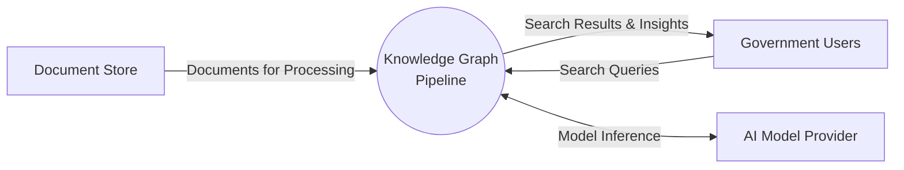
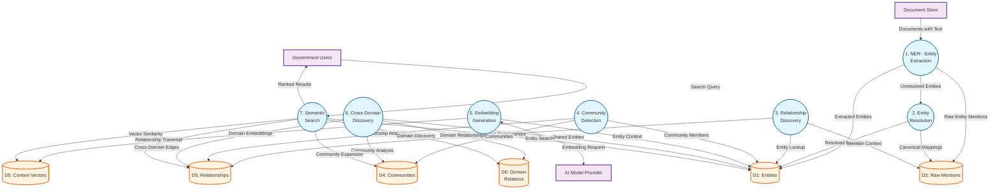

# Data Flow Diagram: Knowledge Graph Pipeline

> **Template Origin**: Official | **ArcKit Version**: 4.3.1 | **Command**: `/arckit.dfd`

## Document Control

| Field | Value |
|-------|-------|
| **Document ID** | ARC-001-DFD-014-v1.0 |
| **Document Type** | Data Flow Diagram |
| **Project** | IOU-Modern (Project 001) |
| **Classification** | OFFICIAL |
| **Status** | DRAFT |
| **Version** | 1.0 |
| **Created Date** | 2026-04-01 |
| **Last Modified** | 2026-04-01 |
| **Review Cycle** | Quarterly |
| **Next Review Date** | 2026-07-01 |
| **Owner** | Solution Architect |
| **Reviewed By** | PENDING |
| **Approved By** | PENDING |
| **Distribution** | Project Team, Architecture Team, Data Scientists |
| **DFD Level** | Level 1 (Process Flow) |
| **Notation** | Yourdon-DeMarco |

## Revision History

| Version | Date | Author | Changes | Approved By | Approval Date |
|---------|------|--------|---------|-------------|---------------|
| 1.0 | 2026-04-01 | ArcKit AI | Initial creation from `/arckit.dfd` command | PENDING | PENDING |

---

## Yourdon-DeMarco Notation Key

| Symbol | Shape | Description |
|--------|-------|-------------|
| **External Entity** | Rectangle | Source or sink of data outside the system boundary |
| **Process** | Circle | Transforms incoming data flows into outgoing data flows |
| **Data Store** | Open-ended rectangle (parallel lines) | Repository of data at rest |
| **Data Flow** | Named arrow | Data in motion between components |

---

## Overview

This DFD documents the **Knowledge Graph Pipeline** for IOU-Modern, covering the GraphRAG (Graph-based Retrieval Augmented Generation) workflow. The pipeline extracts entities from documents, discovers relationships between them, clusters entities into communities, and enables semantic search and cross-domain discovery.

**Workflow Scope**: Process documents through NER (Named Entity Recognition), build knowledge graphs with entity relationships, detect communities for thematic clustering, generate embeddings for semantic search, and discover cross-domain relationships.

---

## Context Diagram (Level 0): Knowledge Graph Pipeline

### `data-flow-diagram` Format

Render with: `pip install data-flow-diagram` then `dfd < file.dfd` (produces SVG/PNG with true Yourdon-DeMarco notation)

```dfd
title Context Diagram - Knowledge Graph Pipeline

entity    DOC     "Document Store"
entity    USR     "Government Users"
entity    AI      "AI Model Provider"

process   P0      "Knowledge Graph\nPipeline"

DOC   --> P0    "Documents for Processing"
USR   --> P0    "Search Queries"
P0    --> USR    "Search Results & Insights"
P0    <--> AI   "Model Inference"
```

### Mermaid Format

View at [mermaid.live](https://mermaid.live) or in GitHub/VS Code markdown preview.



---

## Level 1 DFD: Knowledge Graph Pipeline

### `data-flow-diagram` Format

```dfd
title Level 1 DFD - Knowledge Graph Pipeline

entity    DOC     "Document Store"
entity    USR     "Government Users"
entity    AI      "AI Model Provider"

process   P1      "1\nNER - Entity\nExtraction"
process   P2      "2\nEntity\nResolution"
process   P3      "3\nRelationship\nDiscovery"
process   P4      "4\nCommunity\nDetection"
process   P5      "5\nEmbedding\nGeneration"
process   P6      "6\nCross-Domain\nDiscovery"
process   P7      "7\nSemantic\nSearch"

store     D1      "Entities"
store     D2      "Raw Mentions"
store     D3      "Relationships"
store     D4      "Communities"
store     D5      "Context Vectors"
store     D6      "Domain Relations"

DOC   --> P1    "Documents with Text"
P1    --> D1    "Extracted Entities"
P1    --> D2    "Raw Entity Mentions"
P1    --> P2    "Unresolved Entities"
P2    --> D1    "Resolved Entities"
P2    --> D2    "Canonical Mappings"
P3    --> D1    "Entity Lookup"
P3    --> D2    "Mention Context"
P3    --> D3    "Discovered Relationships"
P4    --> D1    "Community Members"
P4    --> D3    "Relationship Analysis"
P4    --> D4    "Entity Communities"
P5    <--> AI   "Embedding Request"
P5    --> D1    "Entity Context"
P5    --> D5    "Domain Embeddings"
P6    --> D1    "Shared Entities"
P6    --> D3    "Cross-Domain Edges"
P6    --> D4    "Community Analysis"
P6    --> D6    "Domain Relationships"
P7    --> D5    "Vector Similarity"
P7    --> D1    "Entity Search"
P7    --> D3    "Relationship Traversal"
P7    --> D4    "Community Expansion"
P7    --> D6    "Domain Discovery"
USR   --> P7    "Search Query"
P7    --> USR    "Ranked Results"
```

### Mermaid Format



---

## Process Specifications

| Process ID | Name | Inputs | Outputs | Logic Summary | Req. Trace |
|------------|------|--------|---------|---------------|------------|
| P1 | NER - Entity Extraction | Documents with Text (content_text) | Extracted Entities, Raw Entity Mentions | AI-powered Named Entity Recognition identifies Person, Organization, Location, Law, Date, Money, Policy entities. Uses spaCy/transformer models. Extracts position, confidence, and context for each mention. Stores raw mentions for deduplication. | BR-035, FR-023, FR-024, FR-025 |
| P2 | Entity Resolution | Unresolved Entities, Raw Mentions | Resolved Entities, Canonical Mappings | Deduplicates entity mentions using fuzzy matching and rules. Maps variant names to canonical forms (e.g., "Ministerie van BZK" → "BZK"). Resolves acronyms and abbreviations. Updates entity confidence scores. | E-011 logic |
| P3 | Relationship Discovery | Entity Lookup, Mention Context | Discovered Relationships | Analyzes co-occurrence patterns, syntactic dependencies, and semantic similarity to identify relationships. Classifies: WorksFor, LocatedIn, SubjectTo, RefersTo, OwnerOf, ReportsTo, CollaboratesWith, Follows, PartOf. Assigns weight and confidence. | BR-036, FR-026 |
| P4 | Community Detection | Community Members, Relationship Analysis | Entity Communities | Graph clustering algorithm (Leiden/Louvain) identifies densely connected entity groups. Creates hierarchical communities (levels 0-N). Generates community summaries and keywords using AI. Enables thematic discovery. | BR-037, FR-027 |
| P5 | Embedding Generation | Entity Context, Domain Text | Domain Embeddings | Generates vector embeddings for domains and entities using OpenAI/Anthropic/SentenceTransformers. Stores model name and version for reproducibility. Enables semantic similarity search. | BR-020, E-015 |
| P6 | Cross-Domain Discovery | Shared Entities, Cross-Domain Edges, Community Analysis | Domain Relationships | Identifies relationships between domains based on shared entities, shared communities, semantic similarity, temporal overlap, and shared stakeholders. Calculates relationship strength. Enables knowledge discovery across organizational boundaries. | BR-008, BR-038, FR-011 |
| P7 | Semantic Search | Vector Similarity, Search Query | Ranked Results, Entity Search, Relationship Traversal, Community Expansion, Domain Discovery | Hybrid search combining keyword (full-text) and semantic (vector) search. Supports entity-based queries, relationship traversal, community expansion, and domain discovery. Returns ranked results with relevance scores. | BR-019, BR-020, FR-029, FR-030, FR-031 |

---

## Data Store Descriptions

| Store ID | Name | Contents | Access Pattern | Retention | Contains PII |
|----------|------|----------|----------------|-----------|-------------|
| D1 | Entities | Named entities (id, name, canonical_name, type, confidence, source_domain) | Read/Write by all processes | 20 years (source document) | Yes (Person entities) |
| D2 | Raw Mentions | Unresolved entity mentions with positions and context | Write by P1, Read by P2/P3 | 20 years (source document) | Yes (in context) |
| D3 | Relationships | Entity-to-entity relationships with type, weight, confidence | Read/Write by all processes | 20 years (source document) | Indirect |
| D4 | Communities | Entity clusters with summaries, keywords, hierarchy levels | Write by P4, Read by P6/P7 | 20 years (source document) | No |
| D5 | Context Vectors | Domain/entity embeddings for semantic search | Write by P5, Read by P7 | 20 years (domain) | No |
| D6 | Domain Relations | Cross-domain relationships with strength and discovery method | Write by P6, Read by P7 | 20 years (domain) | Indirect |

---

## Data Dictionary

| Data Flow | Composition | Source | Destination | Format |
|-----------|-------------|--------|-------------|--------|
| Documents with Text | {id, content_text, domain_id, language} | Document Store | P1 | JSON |
| Extracted Entities | [{entity_id, name, entity_type, position, confidence, context}] | P1 | D1 | JSON Array |
| Raw Entity Mentions | [{mention_text, position, entity_hint, source_id}] | P1 | D2 | JSON Array |
| Unresolved Entities | [{name, type, confidence, canonical_name: null}] | P1 | P2 | JSON Array |
| Resolved Entities | [{id, canonical_name, aliases: [], confidence}] | P2 | D1 | JSON Array |
| Canonical Mappings | [{mention_id, entity_id, mapping_method}] | P2 | D2 | JSON Array |
| Entity Lookup | {entity_id, name, canonical_name, related_entities: []} | D1 | P3 | JSON |
| Mention Context | {mention_id, surrounding_text, document_id, position} | D2 | P3 | JSON |
| Discovered Relationships | [{source_id, target_id, type, weight, confidence, context}] | P3 | D3 | JSON Array |
| Community Members | {community_id, entity_ids: [], level} | D1 | P4 | JSON |
| Relationship Analysis | {entity_id, degree, centrality, clustering_coefficient} | D3 | P4 | JSON |
| Entity Communities | [{community_id, name, summary, keywords, level}] | P4 | D4 | JSON Array |
| Embedding Request | {text/domain_id, model, dimension} | P5 | AI | JSON API |
| Domain Embeddings | {domain_id, vector: [], model_name, model_version} | P5 | D5 | JSON (vector) |
| Shared Entities | [{entity_id, domains: [], count}] | D1 | P6 | JSON |
| Cross-Domain Edges | [{from_domain, to_domain, shared_entities: []}] | P6 | D3 | JSON |
| Community Analysis | {community_id, domain_distribution, overlap} | D4 | P6 | JSON |
| Domain Relationships | [{from_domain_id, to_domain_id, type, strength, discovery_method}] | P6 | D6 | JSON |
| Vector Similarity | {query_vector, domain_vectors, similarity_scores} | P5/P7 | D5 | Vector math |
| Search Query | {query, filters: {domain, entity_type, classification}, user_id} | Government Users | P7 | JSON |
| Ranked Results | [{doc_id, entity_id, score, snippet, relevance_reason}] | P7 | Government Users | JSON |

---

## Requirements Traceability

| DFD Element | Element Type | Requirement ID | Requirement Description | Coverage |
|-------------|-------------|----------------|-------------------------|----------|
| P1 | Process | BR-035 | System shall extract named entities from documents | Full |
| P1 | Process | FR-023 | System shall extract Person entities from documents | Full |
| P1 | Process | FR-024 | System shall extract Organization entities from documents | Full |
| P1 | Process | FR-025 | System shall extract Location entities from documents | Full |
| P3 | Process | BR-036 | System shall build knowledge graphs from extracted entities | Full |
| P3 | Process | FR-026 | System shall discover entity relationships | Full |
| P4 | Process | BR-037 | System shall discover cross-domain relationships | Full |
| P4 | Process | FR-027 | System shall cluster entities into communities | Full |
| P5 | Process | BR-020 | System shall support semantic search | Full |
| P6 | Process | BR-008 | System shall enable cross-domain relationship discovery | Full |
| P6 | Process | BR-038 | System shall support entity-based search | Full |
| P7 | Process | BR-019 | System shall support full-text search across documents | Full |
| P7 | Process | FR-029 | System shall support full-text search | Full |
| P7 | Process | FR-030 | System shall support entity-based search | Full |
| P7 | Process | FR-031 | System shall support semantic search | Full |
| P7 | Process | FR-032 | System shall support domain-scoped search | Full |
| D1 | Store | E-011 | Entity extraction with PII tracking | Full |
| D3 | Store | E-012 | Entity relationships | Full |
| D4 | Store | E-013 | Community detection | Full |
| D5 | Store | E-015 | Vector embeddings for semantic search | Full |
| D6 | Store | E-014 | Domain relationships | Full |

**Coverage Summary**:

- Total Requirements Mapped: 19
- Fully Covered: 19
- Partially Covered: 0
- Not Covered: 0

---

## DFD Balancing Check

| Level 0 Boundary Flow | Direction | Present at Level 1? | Notes |
|------------------------|-----------|---------------------|-------|
| Documents for Processing | In | Yes (DOC → P1) | From document store |
| Search Queries | In | Yes (USR → P7) | User queries |
| Search Results & Insights | Out | Yes (P7 → USR) | Ranked results |
| Model Inference | In/Out | Yes (P5 ↔ AI) | AI model API calls |

**Balancing Status**: All flows balanced

---

## Entity Types and Relationship Types

### Entity Type Catalog

| Entity Type | Description | Example | PII? |
|-------------|-------------|---------|-----|
| Person | Individual person names | "Jan de Vries", "Maria Jansen" | Yes |
| Organization | Companies, agencies, institutions | "Ministerie van BZK", "Gemeente Amsterdam" | No |
| Location | Cities, addresses, places | "Den Haag", "Stationsstraat 5" | No |
| Law | Laws, regulations, policies | "Wet open overheid", "Archiefwet 1995" | No |
| Date | Temporal expressions | "1 januari 2025", "Q4 2024" | No |
| Money | Monetary amounts | "€50.000", "2,5 miljoen" | No |
| Policy | Policy documents | "Woo-beleid", "Archiefregeling" | No |
| Miscellaneous | Other entities | (varies) | Varies |

### Relationship Type Catalog

| Relationship Type | Domain | Example | Inverse |
|------------------|--------|---------|---------|
| WorksFor | Organization | Person → Organization | Employs |
| LocatedIn | Location | Entity → Location | Contains |
| SubjectTo | Law/Policy | Entity → Law | Regulates |
| RefersTo | General | Document → Entity | ReferencedBy |
| RelatesTo | General | Entity → Entity | RelatesTo |
| OwnerOf | Ownership | Organization → Entity | OwnedBy |
| ReportsTo | Hierarchy | Person → Person | ManagedBy |
| CollaboratesWith | Collaboration | Organization ↔ Organization | CollaboratesWith |
| Follows | Temporal | Entity → Entity | Precedes |
| PartOf | Composition | Entity → Entity | Contains |

---

## Knowledge Graph Query Patterns

### Pattern 1: Entity Centric Expansion

```cypher
// Find all entities related to a person
MATCH (e:Entity {name: "Jan de Vries"})-[:RelatesTo*1..3]-(related:Entity)
RETURN e, related
```

### Pattern 2: Cross-Domain Discovery

```cypher
// Find domains connected through shared entities
MATCH (d1:Domain)-[:CONTAINS]->(e:Entity)<-[:CONTAINS]-(d2:Domain)
WHERE d1.id <> d2.id
RETURN d1, d2, COUNT(e) AS shared_entities
ORDER BY shared_entities DESC
```

### Pattern 3: Community Exploration

```cypher
// Explore community members and relationships
MATCH (c:Community)-[:MEMBER_OF]->(e1:Entity)-[:RELATES_TO]-(e2:Entity)
WHERE c.id = $community_id
RETURN c, e1, e2
```

### Pattern 4: Temporal Overlap

```cypher
// Find domains active during same period
MATCH (d1:Domain {active_period: "2024-2025"})-[:OVERLAPS]-(d2:Domain)
RETURN d1, d2, d1.overlap_type
```

---

## Graph Statistics and Metrics

| Metric | Description | Use Case | Target |
|--------|-------------|----------|--------|
| Node Count | Total entities in graph | Graph size monitoring | >1M entities |
| Edge Count | Total relationships | Graph density | >5M relationships |
| Avg Degree | Average connections per entity | Connectivity assessment | 5-10 |
| Cluster Coefficient | Measure of graph clustering | Community quality | >0.6 |
| Modularity | Quality of community division | Community detection validation | >0.4 |
| Graph Diameter | Longest shortest path | Graph connectivity | <6 hops |

---

## Performance Specifications

| Process | SLA | Throughput | Notes |
|---------|-----|------------|-------|
| P1 NER Extraction | <5 sec/document | 500 docs/hour | GPU accelerated |
| P2 Entity Resolution | <1 sec/100 mentions | Batch processing | Rule-based + ML |
| P3 Relationship Discovery | <30 min/domain | Batch (nightly) | Computationally intensive |
| P4 Community Detection | <1 hour/graph | Batch (weekly) | Leiden algorithm |
| P5 Embedding Generation | <10 sec/domain | On-demand + batch | Cached for 7 days |
| P6 Cross-Domain Discovery | <15 min | Batch (daily) | Incremental updates |
| P7 Semantic Search | <2 seconds | 100 queries/minute | Hybrid search |

---

## Error Handling and Exception Flows

| Exception | Detection Point | Handler | Recovery |
|-----------|-----------------|---------|----------|
| NER Model Failure | P1 | Fallback to rule-based extraction | Lower confidence |
| Low Confidence Entities | P1/P2 | Flag for manual review | Human-in-the-loop |
| Relationship Ambiguity | P3 | Store with low weight | Exclude from critical paths |
| Community Fragmentation | P4 | Adjust resolution parameter | Re-run detection |
| Embedding API Timeout | P5 | Use cached embeddings | Degrade gracefully |
| Search Index Unavailable | P7 | Fall back to database query | Reduced functionality |
| Graph Too Large | P6 | Sample or partition by domain | Maintain performance |

---

## Privacy and GDPR Considerations

### PII in Knowledge Graph

| Entity Type | PII Level | Protection | Access Control |
|-------------|-----------|------------|----------------|
| Person (natural persons) | Bijzonder | Encrypted at rest, access logged | Domain members only |
| Person (public figures) | Normaal | Standard protection | Public access |
| Organization | No | Standard protection | Public access |
| Location (addresses) | Normaal | Standard protection | Public access |

### GDPR Rights Implementation

| Right | Implementation | Knowledge Graph Impact |
|-------|----------------|---------------------|
| Right to Access | SAR returns Person entities where name matches | PII filtering required |
| Right to Rectification | Update canonical_name, merge duplicates | Entity resolution affected |
| Right to Erasure | Anonymize Person entities (name → "Gewanonymiseerd [type]") | Preserve relationships, remove PII |
| Right to Object | Opt-out of NER (BR-045) | Exclude from entity extraction |
| Right to Portability | Export entities/relationships as JSON/CSV | Standard export format |

---

## Rendering Tools

| Tool | Type | Yourdon-DeMarco | How to Use |
|------|------|-----------------|------------|
| **data-flow-diagram** | CLI (Python) | True notation | `pip install data-flow-diagram` then `dfd < file.dfd` |
| **Mermaid** | Text-to-diagram | Approximate | Paste into [mermaid.live](https://mermaid.live) or view in GitHub |
| **draw.io** | Online editor | True notation | Open [app.diagrams.net](https://app.diagrams.net), enable "Data Flow Diagrams" shapes |
| **Visual Paradigm** | Online editor | True notation | [online.visual-paradigm.com](https://online.visual-paradigm.com) |

---

## Linked Artifacts

**Requirements**: `projects/001-iou-modern/ARC-001-REQ-v1.1.md`
**Data Model**: `projects/001-iou-modern/ARC-001-DATA-v1.0.md`
**Architecture Diagrams**: `projects/001-iou-modern/ARC-001-DIAG-v1.0.md`
**Architecture Principles**: `projects/000-global/ARC-000-PRIN-v1.0.md`
**Related DFDs**: ARC-001-DFD-013-v1.0 (Document Processing), ARC-001-DFD-012-v1.0 (Woo Publication)

---

**Generated by**: ArcKit `/arckit.dfd` command
**Generated on**: 2026-04-01 18:45 GMT
**ArcKit Version**: 4.3.1
**Project**: IOU-Modern (Project 001)
**AI Model**: Claude Opus 4.6
**DFD Level**: Level 1 (Process Flow - Knowledge Graph Pipeline)
