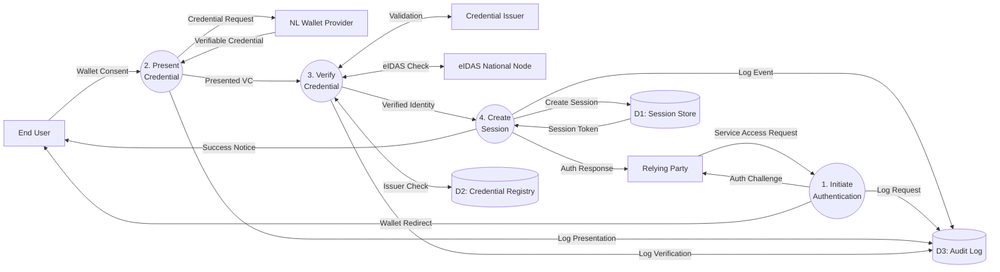

# Data Flow Diagram: NL Wallet and SSI Authentication Flow

> **Template Origin**: Official | **ArcKit Version**: 4.3.1 | **Command**: `/arckit:dfd`

## Document Control

| Field | Value |
|-------|-------|
| **Document ID** | ARC-001-DFD-015-v1.0 |
| **Document Type** | Data Flow Diagram |
| **Project** | IOU-Modern (Project 001) |
| **Classification** | OFFICIAL |
| **Status** | DRAFT |
| **Version** | 1.0 |
| **Created Date** | 2026-04-01 |
| **Last Modified** | 2026-04-01 |
| **Review Cycle** | Quarterly |
| **Next Review Date** | 2026-07-01 |
| **Owner** | Enterprise Architect |
| **Reviewed By** | PENDING |
| **Approved By** | PENDING |
| **Distribution** | Architecture Team, Development Team, Security Officer, DPO |
| **DFD Level** | All Levels (Context + Level 1) |
| **Notation** | Yourdon-DeMarco |

## Revision History

| Version | Date | Author | Changes | Approved By | Approval Date |
|---------|------|--------|---------|-------------|---------------|
| 1.0 | 2026-04-01 | ArcKit AI | Initial creation from `/arckit:dfd` command | PENDING | PENDING |

---

## Yourdon-DeMarco Notation Key

| Symbol | Shape | Description |
|--------|-------|-------------|
| **External Entity** | Rectangle | Source or sink of data outside the system boundary |
| **Process** | Circle | Transforms incoming data flows into outgoing data flows |
| **Data Store** | Open-ended rectangle (parallel lines) | Repository of data at rest |
| **Data Flow** | Named arrow | Data in motion between components |

---

## Context Diagram (Level 0)

### System Description

The **NL Wallet and SSI Authentication System** provides digital identity authentication for IOU-Modern using the Dutch national wallet infrastructure based on Self-Sovereign Identity (SSI) principles and eIDAS 2.0 regulations. The system enables citizens to authenticate using verifiable credentials stored in their NL Wallet app without sharing personal data directly with the relying party.

### Key External Entities

| Entity | Role | Description |
|--------|------|-------------|
| **End User** | Credential Holder | Dutch citizen with NL Wallet app containing verifiable credentials (eID, address, age) |
| **NL Wallet Provider** | Wallet Infrastructure | Government-operated wallet service hosting the citizen's digital credentials |
| **Credential Issuer** | Credential Authority | Government authority (e.g., Rijk, Gemeente) that issues verifiable credentials |
| **eIDAS National Node** | EU Gateway | Dutch national node for cross-border EU digital identity interoperability |
| **Relying Party Application** | Service Consumer | IOU-Modern web application requiring authenticated user access |

### `data-flow-diagram` Format

Render with: `pip install data-flow-diagram` then `dfd < file.dfd` (produces SVG/PNG with true Yourdon-DeMarco notation)

```dfd
title Context Diagram - NL Wallet and SSI Authentication System

entity    USER     "End User\n(Citizen)"
entity    WALLET   "NL Wallet\nProvider"
entity    ISSUER   "Credential\nIssuer"
entity    EIDAS    "eIDAS\nNational Node"
entity    RP       "Relying Party\nApplication"

process   P0       "NL Wallet & SSI\nAuthentication\nSystem"

USER  --> P0    "Authentication Request\n(wallet redirect URL)"
P0    --> USER  "Wallet Launch\n(deep link)"
USER  --> P0    "Presented Credential\n(Verifiable Credential)"
P0    --> USER  "Authentication Result\n(success/failure)"

P0    --> WALLET   "Credential Discovery\n(wallet address lookup)"
WALLET --> P0    "Wallet Metadata\n(version, supported methods)"

P0    --> ISSUER  "Credential Verification\n(VC status check)"
ISSUER --> P0    "Credential Status\n(valid/revoked/suspended)"

P0    --> EIDAS   "Cross-Border Verification\n(eIDAS passport validation)"
EIDAS  --> P0    "EU Citizen Status\n(valid/invalid)"

RP    --> P0    "Service Access Request\n(resource access)"
P0    --> RP    "Authenticated Session\n(JWT token + user claims)"
```

### Mermaid Format

View at [mermaid.live](https://mermaid.live) or in GitHub/VS Code markdown preview.

```mermaid
flowchart LR
    USER["End User\n(Citizen)"]
    WALLET["NL Wallet\nProvider"]
    ISSUER["Credential\nIssuer"]
    EIDAS["eIDAS\nNational Node"]
    RP["Relying Party\nApplication"]
    P0(("NL Wallet & SSI\nAuthentication\nSystem"))

    USER -->|Authentication Request\n(wallet redirect URL)| P0
    P0 -->|Wallet Launch\n(deep link)| USER
    USER -->|Presented Credential\n(Verifiable Credential)| P0
    P0 -->|Authentication Result\n(success/failure)| USER

    P0 -->|Credential Discovery\n(wallet address lookup)| WALLET
    WALLET -->|Wallet Metadata\n(version, methods)| P0

    P0 -->|Credential Verification\n(VC status check)| ISSUER
    ISSUER -->|Credential Status\n(valid/revoked)| P0

    P0 -->|Cross-Border Verification\n(eIDAS validation)| EIDAS
    EIDAS -->|EU Citizen Status\n(valid/invalid)| P0

    RP -->|Service Access Request\n(resource access)| P0
    P0 -->|Authenticated Session\n(JWT + claims)| RP
```

---

## Level 1 DFD

### Process Decomposition

The Level 1 DFD decomposes the authentication system into four major processes:

1. **P1: Initiate Authentication** - Establishes the authentication request and redirects to the NL Wallet
2. **P2: Present Credential** - Handles credential presentation from the user's wallet
3. **P3: Verify Credential** - Cryptographically validates the verifiable credential
4. **P4: Create Session** - Establishes an authenticated session with appropriate authorization

### `data-flow-diagram` Format

```dfd
title Level 1 DFD - NL Wallet and SSI Authentication System

entity    USER     "End User\n(Citizen)"
entity    WALLET   "NL Wallet\nProvider"
entity    ISSUER   "Credential\nIssuer"
entity    EIDAS    "eIDAS\nNational Node"
entity    RP       "Relying Party\nApplication"

process   P1       "1\nInitiate\nAuthentication"
process   P2       "2\nPresent\nCredential"
process   P3       "3\nVerify\nCredential"
process   P4       "4\nCreate\nSession"

store     D1       "D1: Session\nStore"
store     D2       "D2: Credential\nRegistry"
store     D3       "D3: Audit\nLog"

%% Authentication Initiation Flow
RP    --> P1    "Service Access Request\n(resource URI)"
P1    --> RP    "Authentication Challenge\n(request ID, nonce)"
P1    --> USER  "Wallet Redirect\n(wallet://auth?request=...)"

%% Credential Presentation Flow
USER  --> P2    "Wallet Authorization\n(user consent)"
P2    --> WALLET   "Credential Request\n(request ID, required attributes)"
WALLET --> P2    "Selected Credential\n(Verifiable Credential JWT)"
P2    --> P3    "Presented VC\n(signed Verifiable Credential)"

%% Credential Verification Flow
P3    --> D2    "Issuer Trust Check\n(issuer DID)"
D2    --> P3    "Issuer Status\n(trusted/untrusted)"
P3    --> ISSUER  "Credential Validation\n(VC status check, revocation)"
ISSUER --> P3    "Validation Response\n(valid/revoked)"
P3    --> EIDAS   "eIDAS Validation\n(for EU credentials)"
EIDAS  --> P3    "eIDAS Status\n(valid/invalid)"
P3    --> P4    "Verified Identity\n(subject DID, claims)"

%% Session Creation Flow
P4    --> D1    "Session Creation\n(user ID, claims, timestamp)"
P4    --> D3    "Authentication Event\n(user ID, result, timestamp)"
D1    --> P4    "Session Token\n(signed JWT)"
P4    --> RP    "Authentication Response\n(access token, refresh token)"
P4    --> USER  "Session Established\n(success notification)"

%% Audit Logging
P1    --> D3    "Auth Request Logged\n(request ID, timestamp)"
P2    --> D3    "Presentation Logged\n(credential type, timestamp)"
P3    --> D3    "Verification Logged\n(result, timestamp)"
```

### Mermaid Format



---

## Process Specifications

| Process ID | Name | Inputs | Outputs | Logic Summary | Req. Trace |
|------------|------|--------|---------|---------------|------------|
| P1 | Initiate Authentication | Service Access Request (from RP), Resource URI | Authentication Challenge (request ID, nonce, scope), Wallet Redirect URL, Audit Log Entry | Generate unique authentication request with cryptographic nonce. Determine required credential types based on resource access policy. Construct wallet deep-link with OID4VP/SIOPv2 parameters. Log initiation event. | FR-001, NFR-SEC-003 |
| P2 | Present Credential | Wallet Authorization (user consent), Selected Credential (from Wallet) | Credential Request (to Wallet), Presented VC (signed JWT), Audit Log Entry | Receive user consent from wallet app. Request specific attributes based on RP requirements. Receive Verifiable Credential in JWT format. Extract holder DID and claims. Log presentation event. | FR-001, BR-028, P1 |
| P3 | Verify Credential | Presented VC (from P2), Issuer Status (from D2), Validation Response (from Issuer), eIDAS Status (from EIDAS) | Verified Identity (subject DID, verified claims), Verification Result, Audit Log Entry | Validate VC signature using issuer DID from trusted registry. Check credential status (not revoked, not expired). Verify cryptographic proof. For EU credentials, validate via eIDAS National Node. Extract verified claims without storing PII. Log verification result. | FR-001, NFR-SEC-003, P7 |
| P4 | Create Session | Verified Identity (from P3), Session Token (from D1) | Authenticated Session (JWT), Authentication Response (to RP), Session Record (to D1), Audit Log Entry | Map verified DID to internal user identifier. Determine user roles based on verified claims. Generate signed JWT session token with appropriate expiration. Store session in session store. Log successful authentication. Return token to RP. | FR-001, FR-002, NFR-SEC-004 |

---

## Data Store Descriptions

| Store ID | Name | Contents | Access Pattern | Retention | Contains PII |
|----------|------|----------|----------------|-----------|-------------|
| D1 | Session Store | Session ID, User ID (pseudonymized), Subject DID, Claims (hashed), JWT Token, Expiration, Created At | Write: P4 creates on auth success. Read: P4 retrieves for token validation. Delete: P4 purges expired sessions. | 24 hours (session lifetime) then auto-delete | Partial (DID only, no personal data) |
| D2 | Credential Registry | Issuer DIDs, Public Keys, Trust Status, Revocation Lists, Credential Schemas, eIDAS Mappings | Read: P3 queries for issuer verification. Update: Sync nightly from issuers and eIDAS node. | 7 years (compliance) + archival | No (public registry data) |
| D3 | Audit Log | Event ID, Timestamp, Event Type, Session ID (hash), Subject DID (hash), Result, IP (hash), User Agent | Write: All processes append events. Read: Security queries for investigations. Append-only, no deletes. | 7 years (NFR-COMP-005, Archiefwet) | Partial (hashed identifiers only) |

---

## Data Dictionary

| Data Flow | Composition | Source | Destination | Format |
|-----------|-------------|--------|-------------|--------|
| Authentication Request | {request_id, timestamp, resource_uri, required_credentials, redirect_uri, nonce, scope} | End User | P1 | JSON (OID4VP/SIOPv2) |
| Authentication Challenge | {request_id, nonce, expires_at, wallet_uri, required_attributes, purpose} | P1 | Relying Party | JSON |
| Wallet Redirect | wallet://auth/?request={jwt_encoded_request} | P1 | End User | URI (deep link) |
| Wallet Authorization | {request_id, consent_granted, selected_credential_id, timestamp} | End User | P2 | JSON |
| Presented Credential | {jwt, holder_did, credential_type, issuer_did, claims, proof, expiry} | P2 | P3 | JWT (SD-JWT VC format) |
| Issuer Trust Check | {issuer_did, credential_type, schema_id} | P3 | D2 | Query |
| Issuer Status | {trusted: boolean, public_key, revocation_url, status_list} | D2 | P3 | JSON |
| Credential Verification | {credential_id, status_check, revocation_check} | P3 | Credential Issuer | JSON |
| Validation Response | {status: valid/revoked/expired, checked_at, evidence} | Credential Issuer | P3 | JSON |
| eIDAS Validation | {credential_hash, member_state, requesting_service} | P3 | eIDAS Node | JSON |
| eIDAS Status | {valid: boolean, subject_country, assurance_level} | eIDAS Node | P3 | JSON |
| Verified Identity | {subject_did, verified_claims, assurance_level, timestamp} | P3 | P4 | Internal |
| Authentication Response | {access_token, refresh_token, token_type, expires_in, user_claims} | P4 | Relying Party | JSON (OAuth 2.0 / OpenID Connect) |
| Audit Event | {event_id, event_type, session_hash, did_hash, result, timestamp, metadata} | All Processes | D3 | JSON |

---

## Requirements Traceability

| DFD Element | Element Type | Requirement ID | Requirement Description | Coverage |
|-------------|-------------|----------------|-------------------------|----------|
| P1, P2, P3, P4 | Process | FR-001 | System shall authenticate users via DigiD/eIDAS wallet | Full |
| D1 | Store | FR-002 | System shall support role-based access control (RBAC) | Full |
| P3 | Process | NFR-SEC-003 | Authentication via DigiD + MFA | Full |
| D1 | Store | NFR-SEC-004 | RBAC + Row-Level Security | Full |
| D3 | Store | NFR-SEC-005 | Audit logging for all PII access | Full |
| P3 | Process | P1 (Privacy by Design) | Minimize data collection, verify without storing PII | Full |
| P2, P3 | Process | P7 (Data Sovereignty) | EU-only data processing, NL wallet infrastructure | Full |
| D2 | Store | P4 (Sovereign Technology) | Open standards for SSI (W3C VC, DID) | Full |
| D3 | Store | P10 (Observability) | Complete audit trail | Full |
| P3 | Process | BR-028 | Track all PII at entity level | Full (DID-based tracking) |
| P3 | Process | BR-033 | Support Subject Access Requests (SAR) | Full (audit trail enables SAR) |

**Coverage Summary**:
- Total Requirements Mapped: 12
- Fully Covered: 12
- Partially Covered: 0
- Not Covered: 0

---

## DFD Balancing Check

| Level 0 Boundary Flow | Direction | Present at Level 1? | Notes |
|------------------------|-----------|---------------------|-------|
| Authentication Request (from User) | In | Yes | Decomposed: P1 receives from RP, initiates wallet flow |
| Wallet Launch (to User) | Out | Yes | P1 sends wallet redirect |
| Presented Credential (from User) | In | Yes | P2 receives, passes to P3 |
| Authentication Result (to User) | Out | Yes | P4 sends session notification |
| Credential Discovery (to/from Wallet) | Both | Yes | P2 exchanges with Wallet Provider |
| Credential Verification (to/from Issuer) | Both | Yes | P3 validates with Credential Issuer |
| Cross-Border Verification (to/from eIDAS) | Both | Yes | P3 validates EU credentials |
| Service Access Request (from RP) | In | Yes | P1 receives from Relying Party |
| Authenticated Session (to RP) | Out | Yes | P4 returns JWT to Relying Party |

**Balancing Status**: All flows balanced. Every Level 0 boundary flow appears at Level 1 with appropriate decomposition.

---

## Trust Boundaries and Security Considerations

### Trust Zones

1. **Citizen Device Zone** - End User's NL Wallet app
   - Trust: User-controlled, secure enclave for credentials
   - Boundary: Encrypted TLS connection to authentication system

2. **Government Infrastructure Zone** - Credential Issuer, eIDAS Node, Wallet Provider
   - Trust: High (government-operated)
   - Boundary: Mutual TLS, government PKI

3. **Application Zone** - IOU-Modern Authentication System
   - Trust: Medium (organization-controlled)
   - Boundary: OAuth 2.0 / OpenID Connect for RP

4. **Data Store Zone** - Session Store, Credential Registry, Audit Log
   - Trust: Medium (encrypted at rest per NFR-SEC-001)
   - Boundary: Internal network, RBAC access

### Security Flows

| Flow | Security Mechanism |
|------|-------------------|
| User → P1 (Authentication Request) | TLS 1.3, CSRF token |
| P1 → User (Wallet Redirect) | Signed request JWT (prevents tampering) |
| User → P2 (Presented Credential) | SD-JWT (Selective Disclosure JWT) with proof of possession |
| P3 → Issuer (Verification) | Mutual TLS, government PKI |
| P4 → RP (Session Token) | Signed JWT, HTTPS only |
| All → D3 (Audit Log) | WORM storage, append-only |

---

## Protocol References

The authentication flow implements the following standards:

| Standard | Version | Description | Usage |
|----------|---------|-------------|-------|
| **OID4VP** | 1.0 | OpenID for Verifiable Presentations | Wallet-to-RP communication protocol |
| **SIOPv2** | 2.0 | Self-Issued OpenID Provider | Decentralized authentication flow |
| **W3C VC** | 2.0 | Verifiable Credentials Data Model | Credential format (JWT-VC) |
| **W3C DID** | 1.0 | Decentralized Identifiers | Issuer and holder identity |
| **eIDAS 2.0** | 2024 | EU Digital Identity Framework | Cross-border wallet interoperability |
| **OAuth 2.0** | 2.1 | Authorization Framework | Session token issuance to RP |
| **OpenID Connect** | 1.0 | Identity Layer on OAuth 2.0 | Standard claims delivery to RP |

---

## Rendering Tools

| Tool | Type | Yourdon-DeMarco | How to Use |
|------|------|-----------------|------------|
| **data-flow-diagram** | CLI (Python) | True notation | `pip install data-flow-diagram` then `dfd < file.dfd` |
| **Mermaid** | Text-to-diagram | Approximate | Paste into [mermaid.live](https://mermaid.live) or view in GitHub |
| **draw.io** | Online editor | True notation | Open [app.diagrams.net](https://app.diagrams.net), enable "Data Flow Diagrams" shapes |
| **Visual Paradigm** | Online editor | True notation | [online.visual-paradigm.com](https://online.visual-paradigm.com) |

---

## Linked Artifacts

**Requirements**: `projects/001-iou-modern/ARC-001-REQ-v1.1.md`
**Data Model**: `projects/001-iou-modern/ARC-001-DATA-v1.0.md`
**Architecture Diagrams**: `projects/001-iou-modern/ARC-001-DIAG-v1.0.md`
**Architecture Principles**: `projects/000-global/ARC-000-PRIN-v1.0.md`
**Related ADR**: `projects/001-iou-modern/decisions/ARC-001-ADR-009-v1.0.md` (Modular Monolithic Architecture)

---

**END OF DATA FLOW DIAGRAM**

## Generation Metadata

**Generated by**: ArcKit `/arckit:dfd` command
**Generated on**: 2026-04-01
**ArcKit Version**: 4.3.1
**Project**: IOU-Modern (Project 001)
**AI Model**: claude-opus-4-6[1m]
**DFD Level**: All Levels (Context + Level 1)
