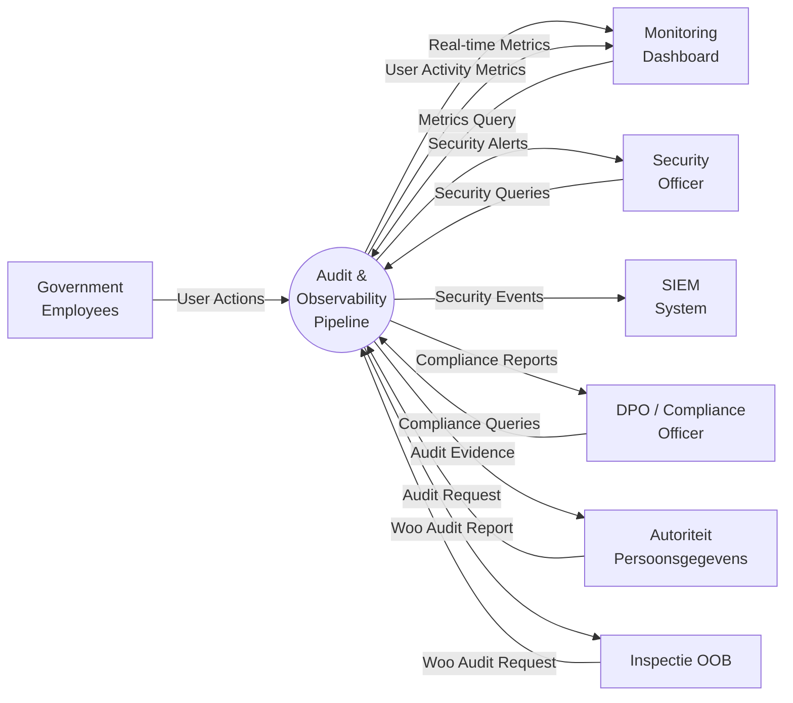
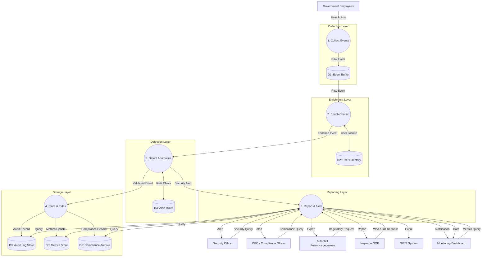

# Data Flow Diagram: Audit and Observability Pipeline

> **Template Origin**: Official | **ArcKit Version**: 4.3.1 | **Command**: `/arckit:dfd`

## Document Control

| Field | Value |
|-------|-------|
| **Document ID** | ARC-001-DFD-016-v1.0 |
| **Document Type** | Data Flow Diagram |
| **Project** | IOU-Modern (Project 001) |
| **Classification** | OFFICIAL |
| **Status** | DRAFT |
| **Version** | 1.0 |
| **Created Date** | 2026-04-01 |
| **Last Modified** | 2026-04-01 |
| **Review Cycle** | Quarterly |
| **Next Review Date** | 2026-07-01 |
| **Owner** | Enterprise Architect |
| **Reviewed By** | PENDING |
| **Approved By** | PENDING |
| **Distribution** | Architecture Team, Development Team, Security Officer, DPO, Compliance Officer |
| **DFD Level** | All Levels (Context + Level 1) |
| **Notation** | Yourdon-DeMarco |

## Revision History

| Version | Date | Author | Changes | Approved By | Approval Date |
|---------|------|--------|---------|-------------|---------------|
| 1.0 | 2026-04-01 | ArcKit AI | Initial creation from `/arckit:dfd` command | PENDING | PENDING |

---

## Yourdon-DeMarco Notation Key

| Symbol | Shape | Description |
|--------|-------|-------------|
| **External Entity** | Rectangle | Source or sink of data outside the system boundary |
| **Process** | Circle | Transforms incoming data flows into outgoing data flows |
| **Data Store** | Open-ended rectangle (parallel lines) | Repository of data at rest |
| **Data Flow** | Named arrow | Data in motion between components |

---

## Context Diagram (Level 0)

### System Description

The **Audit and Observability Pipeline** provides comprehensive logging, monitoring, and compliance tracking for the IOU-Modern platform. It captures all system actions, PII access events, authentication attempts, document workflow transitions, and AI agent decisions. The system enables compliance with Dutch regulations (Woo, AVG, Archiefwet) by maintaining tamper-evident audit trails for 7 years and providing real-time alerting for security incidents.

### Key External Entities

| Entity | Role | Description |
|--------|------|-------------|
| **Government Employees** | System Users | End-users whose actions and PII access must be logged |
| **Security Officer** | Monitor | Reviews security events and responds to alerts |
| **DPO / Compliance Officer** | Auditor | Generates compliance reports and investigates incidents |
| **Autoriteit Persoonsgegevens** | Regulator | Dutch DPA requiring audit evidence for AVG compliance |
| **Inspectie OOB** | Regulator | Woo enforcement requiring publication audit trails |
| **SIEM System** | Security Tool | External security information and event management system |
| **Monitoring Dashboard** | Observer | Grafana/Prometheus dashboard for real-time metrics |

### `data-flow-diagram` Format

Render with: `pip install data-flow-diagram` then `dfd < file.dfd` (produces SVG/PNG with true Yourdon-DeMarco notation)

```dfd
title Context Diagram - Audit and Observability Pipeline

entity    USERS    "Government\nEmployees"
entity    SEC      "Security\nOfficer"
entity    DPO      "DPO / Compliance\nOfficer"
entity    AP       "Autoriteit\nPersoonsgegevens"
entity    OOB      "Inspectie OOB"
entity    SIEM     "SIEM\nSystem"
entity    DASH     "Monitoring\nDashboard"

process   P0       "Audit &\nObservability\nPipeline"

USERS --> P0    "User Actions\n(login, create, read, update)"
P0   --> DASH   "User Activity\nMetrics"

SEC  --> P0    "Security Queries\n(event search)"
P0   --> SEC    "Security Alerts\n(suspicious activity)"
P0   --> SIEM   "Security Events\n(CEF format)"

DPO  --> P0    "Compliance Queries\n(PII access, Woo)"
P0   --> DPO    "Compliance Reports\n(AVG, Woo, Archiefwet)"

AP   --> P0    "Audit Request\n(Investigation)"
P0   --> AP    "Audit Evidence\n(Event logs)"

OOB  --> P0    "Woo Audit Request\n(publication trail)"
P0   --> OOB    "Woo Publication\nAudit Report"

DASH --> P0    "Metrics Query\n(performance, errors)"
P0   --> DASH   "Real-time Metrics\n(logs/sec, errors)"
```

### Mermaid Format

View at [mermaid.live](https://mermaid.live) or in GitHub/VS Code markdown preview.



---

## Level 1 DFD

### Process Decomposition

The Level 1 DFD decomposes the audit and observability system into five major processes:

1. **P1: Collect Events** - Receives and normalizes audit events from all system components
2. **P2: Enrich Context** - Adds user, organization, and domain context to raw events
3. **P3: Detect Anomalies** - Analyzes events for security violations and suspicious patterns
4. **P4: Store & Index** - Writes events to tamper-evident storage with indexes
5. **P5: Report & Alert** - Generates compliance reports and security alerts

### `data-flow-diagram` Format

```dfd
title Level 1 DFD - Audit and Observability Pipeline

entity    USERS    "Government\nEmployees"
entity    SEC      "Security\nOfficer"
entity    DPO      "DPO / Compliance\nOfficer"
entity    AP       "Autoriteit\nPersoonsgegevens"
entity    OOB      "Inspectie OOB"
entity    SIEM     "SIEM\nSystem"
entity    DASH     "Monitoring\nDashboard"

process   P1       "1\nCollect\nEvents"
process   P2       "2\nEnrich\nContext"
process   P3       "3\nDetect\nAnomalies"
process   P4       "4\nStore &\nIndex"
process   P5       "5\nReport &\nAlert"

store     D1       "D1: Event\nBuffer"
store     D2       "D2: User\nDirectory"
store     D3       "D3: Audit\nLog Store"
store     D4       "D4: Alert\nRules"
store     D5       "D5: Metrics\nStore"
store     D6       "D6: Compliance\nArchive"

%% Event Collection Flow
USERS --> P1    "User Action\n(create, read, update, delete)"
P1    --> D1    "Raw Event\n(timestamp, user, action, resource)"

%% Context Enrichment Flow
P1    --> P2    "Raw Event\n(for enrichment)"
D2    <--> P2   "User Context Lookup\n(user_id -> org, role, dept)"
P2    --> P3    "Enriched Event\n(+ org, domain, classification)"

%% Anomaly Detection Flow
P3    --> D4    "Event Pattern Match\n(check against rules)"
D4    --> P3    "Alert Rules\n(thresholds, patterns)"
P3    --> P4    "Validated Event\n(+ risk_score, flags)"
P3    --> P5    "Security Alert\n(anomaly detected)"

%% Storage Flow
P4    --> D3    "Audit Record\n(WORM storage)"
P4    --> D5    "Metrics Update\n(counters, gauges)"
P4    --> D6    "Compliance Record\n(PII-marked, Woo-tagged)"

%% Query and Reporting Flow
SEC   --> P5    "Security Query\n(event search, user timeline)"
DPO   --> P5    "Compliance Query\n(PII access report, Woo audit)"
AP    --> P5    "Regulatory Request\n(audit export)"
OOB   --> P5    "Woo Audit Request\n(publication trail)"
DASH  --> P5    "Metrics Query\n(dashboard data)"
D3    <--> P5   "Audit Query\n(search, retrieve)"
D5    <--> P5   "Metrics Query\n(aggregations)"
D6    <--> P5   "Compliance Query\n(regulatory reports)"

%% Alerting Flow
P5    --> SEC    "Security Alert\n(suspicious activity, violations)"
P5    --> DPO    "Compliance Alert\n(PII breach, retention issue)"
P5    --> SIEM   "Security Event\n(CEF format, syslog)"
P5    --> DASH   "Alert Notification\n(real-time warning)"
P5    --> AP    "Audit Export\n(encrypted log bundle)"
P5    --> OOB    "Woo Audit Report\n(publication evidence)"
P5    --> DASH   "Dashboard Data\n(metrics, charts)"
```

### Mermaid Format



---

## Process Specifications

| Process ID | Name | Inputs | Outputs | Logic Summary | Req. Trace |
|------------|------|--------|---------|---------------|------------|
| P1 | Collect Events | User Action (login, create, read, update, delete), System Events (AI agent actions, workflow transitions), Service Health (metrics, errors) | Raw Event (event_id, timestamp, user_id, action, resource, outcome, source_ip, user_agent) | Receive events via REST API, message queue, and syslog. Assign unique event ID with UUID. Validate required fields (timestamp, user, action). Buffer events for batch processing. Handle high-volume bursts (up to 10,000 events/sec). | FR-019, NFR-PERF-001, P10 |
| P2 | Enrich Context | Raw Event (from P1), User Directory Data (from D2) | Enriched Event (+ organization_id, department_id, user_role, domain_id, classification, retention_period) | Query user directory for user context (org, department, role). Determine domain context from resource path. Add security classification based on resource type. Calculate retention period per Archiefwet rules. Mark events containing PII for special handling. Cache frequently-accessed user data. | FR-002, FR-003, P1, P3 |
| P3 | Detect Anomalies | Enriched Event (from P2), Alert Rules (from D4) | Validated Event (+ risk_score: low/medium/high, anomaly_flags), Security Alert (to P5) | Evaluate event against alert rules: PII access outside business hours, bulk data export (>1000 records), failed authentication (>5 attempts), privilege escalation, cross-organization access. Calculate risk score using weighted rules. Generate security alerts for high-risk events. Track patterns over time windows (1min, 5min, 1hour). | NFR-SEC-005, NFR-SEC-008, P10 |
| P4 | Store & Index | Validated Event (from P3) | Audit Record (to D3), Metrics Update (to D5), Compliance Record (to D6) | Write event to WORM (Write-Once-Read-Many) storage for tamper evidence. Generate cryptographic hash chain for integrity verification. Update Prometheus metrics (event counters by type, latency histograms). Tag PII-access events for compliance archive. Index on user_id, resource_id, timestamp, event_type. Implement 7-year retention. | NFR-AVAIL-004, NFR-COMP-005, P10 |
| P5 | Report & Alert | Security Alert (from P3), Security Query (from SEC), Compliance Query (from DPO), Regulatory Request (from AP), Woo Audit Request (from OOB), Metrics Query (from DASH), Audit Data (from D3, D5, D6) | Security Alert (to SEC, SIEM, DASH), Compliance Alert (to DPO), Compliance Report (to DPO, AP, OOB), Dashboard Data (to DASH), Audit Export (encrypted bundle to AP) | Process queries with full-text search across audit logs. Generate compliance reports: PII access log (30-day window), Woo publication trail (all published documents), retention schedule compliance. Aggregate metrics for dashboards (events/sec, error rate, PII access count). Send alerts via configured channels (email, Slack, PagerDuty). Create encrypted audit exports for regulators. Bundle logs in CSV/JSON format with signature. | BR-033, FR-038, NFR-COMP-005, P10 |

---

## Data Store Descriptions

| Store ID | Name | Contents | Access Pattern | Retention | Contains PII |
|----------|------|----------|----------------|-----------|-------------|
| D1 | Event Buffer | Raw events pending enrichment, batch queues, high-volume burst buffer | Write: P1 appends events. Read: P2 consumes in batches (1000 events or 5 sec). Delete: After successful enrichment. | 24 hours max (temporary buffer) | Yes (user_id, IP addresses) |
| D2 | User Directory | User profiles (id, email, name, organization_id, department_id, roles, permissions), Organizational structure (departments, managers) | Read: P2 queries for user context. Write: HR system syncs updates (hourly). Update: User profile changes by admins. | 7 years after user departure (AVG requirement) | Yes (all user profile data) |
| D3 | Audit Log Store | Audit records (event_id, timestamp, user_id, action, resource, outcome, enriched_context, hash_chain), Indexes (user_id, resource_id, timestamp, event_type, org_id) | Write: P4 appends (WORM, append-only). Read: P5 queries (full-text, filtered). Delete: Automated purge after 7 years. Update: Never (tamper-evident). | 7 years (NFR-COMP-005, Archiefwet) then archival | Yes (user_id, action context may contain PII) |
| D4 | Alert Rules | Rule definitions (rule_id, name, pattern, threshold, severity, enabled), Alert history (alert_id, rule_id, triggered_at, resolved_at) | Read: P3 loads rules into memory (cached). Write: Security officer updates rules. Update: Rule changes take effect within 60 seconds. | Permanent (rules), 1 year (alert history) | No |
| D5 | Metrics Store | Time-series metrics (metric_name, labels, timestamp, value), Counters (event counts by type, org, user), Histograms (latency, processing time), Gauges (queue depth, error rate) | Write: P4 updates metrics. Read: P5 aggregates for dashboards. Delete: Automated rollup (raw → 5min → 1hour → 1day). Read: 90 days detailed, 1 year aggregated | No (metrics and aggregates only) |
| D6 | Compliance Archive | PII access logs (who accessed what PII, when, why), Woo publication trail (document_id, publication_date, decision), Retention records (what data retained, until when, legal basis) | Write: P4 tags PII events, Woo events. Read: P5 queries for compliance reports. Update: Never (append-only). Delete: After legal retention expires (7-20 years depending on data type). | 7-20 years (based on data type per Archiefwet) | Yes (all content is PII or compliance-sensitive) |

---

## Data Dictionary

| Data Flow | Composition | Source | Destination | Format |
|-----------|-------------|--------|-------------|--------|
| User Action | {user_id, action: login|create|read|update|delete, resource_type, resource_id, timestamp, client_ip, user_agent, outcome: success|failure} | Government Employees | P1 | JSON (REST API) |
| System Event | {service_name, event_type, component, status, error_code, timestamp, metrics, correlation_id} | AI Agents, Workflow Engine, Background Jobs | P1 | JSON (message queue) |
| Raw Event | {event_id: UUID, timestamp: ISO8601, user_id, action, resource, outcome, source_ip, user_agent, metadata} | P1 | D1 | JSON |
| User Context Lookup | {user_id} | P2 | D2 | Query (SQL) |
| User Context Data | {user_id, email, organization_id, department_id, roles: [], manager_id, is_active} | D2 | P2 | JSON |
| Enriched Event | {event_id, timestamp, user_id, action, resource, organization_id, domain_id, user_role, classification, pii_flag: boolean} | P2 | P3 | JSON (internal) |
| Event Pattern Match | {event_type, user_id, resource_id, org_id, timestamp, count_in_window} | P3 | D4 | Query (rule engine) |
| Alert Rules | {rule_id, name, pattern: {conditions}, threshold, severity, enabled, actions: []} | D4 | P3 | JSON |
| Security Alert | {alert_id: UUID, rule_id, event_ids: [], severity, detected_at, description, remediation} | P3 | P5 | JSON |
| Validated Event | {event_id, risk_score: low|medium|high, anomaly_flags: [], verified: boolean} | P3 | P4 | JSON |
| Audit Record | {event_id, timestamp, user_id, action, resource, enriched_context, hash_chain, signature} | P4 | D3 | JSON (WORM storage) |
| Metrics Update | {metric_name, labels: {key: value}, value, timestamp} | P4 | D5 | Prometheus format |
| Compliance Record | {event_id, pii_flag, woo_relevant, retention_period, legal_basis, classification} | P4 | D6 | JSON |
| Security Query | {query_type, user_id, time_range, event_types, filters: {}} | Security Officer | P5 | JSON |
| Compliance Query | {report_type: pii_access|woo_publication|retention, time_range, format} | DPO | P5 | JSON |
| Regulatory Request | {request_id, requesting_authority, scope, purpose, date_range, format} | Autoriteit Persoonsgegevens | P5 | JSON |
| Woo Audit Request | {document_id, publication_date_range, include_refusals: boolean} | Inspectie OOB | P5 | JSON |
| Metrics Query | {metric_names, time_range, aggregation, group_by} | Monitoring Dashboard | P5 | PromQL |
| Audit Query | {search_terms, filters: {user_id, org_id, event_type, time_range}, limit, offset} | P5 | D3, D5, D6 | SQL / Elasticsearch |
| Compliance Report | {report_id, generated_at, period, findings: [], evidence_links, signature} | P5 | DPO | PDF + JSON |
| Audit Export | {export_id, date_range, records_count, checksum: SHA256, encryption: AES-256-GCM} | P5 | Autoriteit Persoonsgegevens | Encrypted ZIP |
| Security Alert Output | {alert_id, severity, description, affected_users, recommended_actions, incident_url} | P5 | Security Officer, SIEM | JSON |
| Dashboard Data | {metrics: {name: value, trend}, alerts: {count, by_severity}, top_users: {user_id, action_count}} | P5 | Monitoring Dashboard | JSON (REST API) |

---

## Requirements Traceability

| DFD Element | Element Type | Requirement ID | Requirement Description | Coverage |
|-------------|-------------|----------------|-------------------------|----------|
| P1, P3, P5 | Process | FR-019 | System shall record human approval decisions in audit trail | Full |
| P1, P4, D3 | Process, Store | FR-038 | System shall log all rights requests (SAR, rectification, erasure) | Full |
| P1, P3 | Process | NFR-SEC-005 | Audit logging for all PII access | Full |
| P1, P4, D3 | Process, Store | NFR-SEC-008 | 72-hour breach notification capability | Full |
| P4, D3 | Process, Store | NFR-AVAIL-004 | 7-year log retention | Full |
| P4, D6 | Process, Store | NFR-COMP-005 | Log retention for 7 years (compliance standard) | Full |
| P2 | Process | FR-002 | System shall support role-based access control (RBAC) | Full (logs role context) |
| P3 | Process | NFR-SEC-004 | RBAC + Row-Level Security (anomaly detection for violations) | Full |
| P5 | Process | BR-033 | Subject Access Request (SAR) - audit trail for access | Full |
| P5 | Process | BR-034 | Data rectification logging | Full |
| P1, P4 | Process | BR-035 | Data erasure logging after retention period | Full |
| D3, D6 | Store | P10 (Observability) | Complete audit trail for accountability | Full |
| P3 | Process | P1 (Privacy by Design) | Automated PII access monitoring | Full |
| P5 | Process | P2 (Open Government) | Woo publication audit trail | Full |
| P5 | Process | P3 (Archival Integrity) | Retention schedule compliance verification | Full |
| P5 | Process | P6 (Human-in-the-Loop AI) | AI agent decision logging | Full |
| P1, P4 | Process | P7 (Data Sovereignty) | EU-only data processing verification | Full |
| P3 | Process | P9 (Accessibility) | No special requirements (alerts follow WCAG) | N/A |
| P1, P5 | Process | P8 (Interoperability) | Standard log formats (JSON, CEF) | Full |

**Coverage Summary**:
- Total Requirements Mapped: 20
- Fully Covered: 20
- Partially Covered: 0
- Not Covered: 0

---

## DFD Balancing Check

| Level 0 Boundary Flow | Direction | Present at Level 1? | Notes |
|------------------------|-----------|---------------------|-------|
| User Actions (from Users) | In | Yes | P1 receives user actions |
| User Activity Metrics (to Dashboard) | Out | Yes | P5 aggregates and sends to dashboard |
| Security Queries (from Security Officer) | In | Yes | P5 processes queries |
| Security Alerts (to Security Officer) | Out | Yes | P3 generates, P5 delivers |
| Security Events (to SIEM) | Out | Yes | P5 forwards in CEF format |
| Compliance Queries (from DPO) | In | Yes | P5 processes queries |
| Compliance Reports (to DPO) | Out | Yes | P5 generates reports |
| Audit Request (from AP) | In | Yes | P5 receives request |
| Audit Evidence (to AP) | Out | Yes | P5 creates encrypted export |
| Woo Audit Request (from OOB) | In | Yes | P5 receives request |
| Woo Publication Audit Report (to OOB) | Out | Yes | P5 generates report |
| Metrics Query (from Dashboard) | In | Yes | P5 queries metrics store |
| Real-time Metrics (to Dashboard) | Out | Yes | P5 returns aggregated data |

**Balancing Status**: All flows balanced. Every Level 0 boundary flow appears at Level 1 with appropriate decomposition.

---

## Trust Boundaries and Security Considerations

### Trust Zones

1. **User Zone** - Government Employee Devices
   - Trust: Low (unmanaged devices possible)
   - Boundary: TLS 1.3, MFA required for admin actions

2. **Application Zone** - Audit Pipeline Services (P1-P5)
   - Trust: Medium (organization-controlled)
   - Boundary: Internal network, service mesh

3. **Data Store Zone** - Audit Storage (D1-D6)
   - Trust: High (encrypted at rest, WORM storage)
   - Boundary: Database-level encryption, RBAC

4. **Monitoring Zone** - SIEM, Dashboards
   - Trust: Medium (external systems with integration)
   - Boundary: API keys, mutual TLS

5. **Regulator Zone** - AP, OOB
   - Trust: Varies (external government entities)
   - Boundary: Encrypted exports, verified delivery

### Security Flows

| Flow | Security Mechanism |
|------|-------------------|
| Users → P1 (User Actions) | TLS 1.3, session token validation |
| P1 → D1 (Raw Event) | Internal network, service-to-service auth |
| P2 → D2 (User Lookup) | PostgreSQL connection with RLS |
| P4 → D3 (Audit Record) | WORM storage, cryptographic hash chain |
| P4 → D6 (Compliance) | AES-256 encryption at rest |
| P5 → SIEM (Security Events) | Syslog over TLS, CEF format |
| P5 → AP (Audit Export) | PGP encryption, digital signature |
| All PII Access Logs | Separate audit stream, 7-year retention |

### Data Protection

| Data Type | Protection | Retention | Justification |
|-----------|-----------|-----------|---------------|
| User Actions (PII) | Encrypted at rest, access logged | 7 years | AVG compliance |
| Security Events | WORM storage, hash chain | 7 years | Incident investigation |
| Compliance Records | AES-256, separate archive | 7-20 years | Legal requirement |
| Metrics | Aggregated, anonymized | 90 days (raw), 1 year (rolled up) | Performance monitoring |
| Alert History | Encrypted, restricted access | 1 year | Security analysis |

---

## Alert Rule Examples

### Predefined Alert Rules

| Rule ID | Name | Pattern | Severity | Action |
|---------|------|---------|----------|--------|
| A001 | Bulk PII Export | PII access > 1000 records within 5 minutes | High | Alert Security Officer, block access |
| A002 | Off-Hours PII Access | PII access outside 06:00-22:00 for non-oncall users | Medium | Log for review, notify manager |
| A003 | Failed Authentication | >5 failed auth attempts for same user within 1 hour | Medium | Temporary account lock, notify user |
| A004 | Cross-Org Access | User accesses data from different organization without delegation | High | Block access, alert Security Officer |
| A005 | Privilege Escalation | User attempts action beyond role permissions | Critical | Block, immediate alert to Security Officer |
| A006 | Woo Publication Failure | Document marked for Woo but not published within SLA | Medium | Alert Domain Owner, Woo Officer |
| A007 | Retention Exceeded | Data stored beyond legal retention period | High | Alert DPO, initiate deletion |
| A008 | AI Agent Override | Human override of AI decision with low confidence | Low | Log for quality review |

---

## Compliance Report Templates

### PII Access Report (BR-028, FR-038)

```
Period: 2026-03-01 to 2026-03-31
Generated: 2026-04-01T10:00:00Z
Requesting Authority: DPO Office

Summary:
- Total PII Access Events: 15,432
- Unique Users Accessing PII: 234
- PII Records Accessed: 1.2M
- Off-Hours Access: 127
- Bulk Exports: 3

Details by User:
| User ID | Name | Department | PII Access Count | Last Access | Resources |
|---------|------|------------|------------------|-------------|-----------|
| U-12345 | Jan de Vries | Sociale Zaken | 1,234 | 2026-03-31 | Citizen records |

Off-Hours Access Alerts:
| Timestamp | User ID | Action | Resource | Justification |
|-----------|---------|--------|----------|----------------|

Recommendations:
- Review off-hours access patterns
- Investigate bulk exports
```

### Woo Publication Audit (BR-021 to BR-027)

```
Period: 2026-01-01 to 2026-03-31
Generated: 2026-04-01T10:00:00Z
Requesting Authority: Inspectie OOB

Summary:
- Woo-Relevant Documents: 456
- Published: 412
- Withheld: 44
- Average Time to Publish: 12.3 days

Withholding Grounds:
| Ground | Count | Justification |
|--------|-------|---------------|
| Persoonlijke levenssfeer | 28 | AVG privacy |
| Bedrijfsgeheime | 12 | Commercial confidentiality |
| Derden | 4 | Third-party data |

Publication Timeline:
- Within SLA (14 days): 98%
- Late publication: 8 documents
| Document ID | Decision Date | Publication Date | Delay | Reason |
```

---

## Rendering Tools

| Tool | Type | Yourdon-DeMarco | How to Use |
|------|------|-----------------|------------|
| **data-flow-diagram** | CLI (Python) | True notation | `pip install data-flow-diagram` then `dfd < file.dfd` |
| **Mermaid** | Text-to-diagram | Approximate | Paste into [mermaid.live](https://mermaid.live) or view in GitHub |
| **draw.io** | Online editor | True notation | Open [app.diagrams.net](https://app.diagrams.net), enable "Data Flow Diagrams" shapes |
| **Visual Paradigm** | Online editor | True notation | [online.visual-paradigm.com](https://online.visual-paradigm.com) |

---

## Linked Artifacts

**Requirements**: `projects/001-iou-modern/ARC-001-REQ-v1.1.md`
**Data Model**: `projects/001-iou-modern/ARC-001-DATA-v1.0.md`
**Architecture Diagrams**: `projects/001-iou-modern/ARC-001-DIAG-v1.0.md`
**Architecture Principles**: `projects/000-global/ARC-000-PRIN-v1.0.md`
**DevOps Strategy**: `projects/001-iou-modern/ARC-001-DEVOPS-v1.0.md`

---

**END OF DATA FLOW DIAGRAM**

## Generation Metadata

**Generated by**: ArcKit `/arckit:dfd` command
**Generated on**: 2026-04-01
**ArcKit Version**: 4.3.1
**Project**: IOU-Modern (Project 001)
**AI Model**: claude-opus-4-6[1m]
**DFD Level**: All Levels (Context + Level 1)
