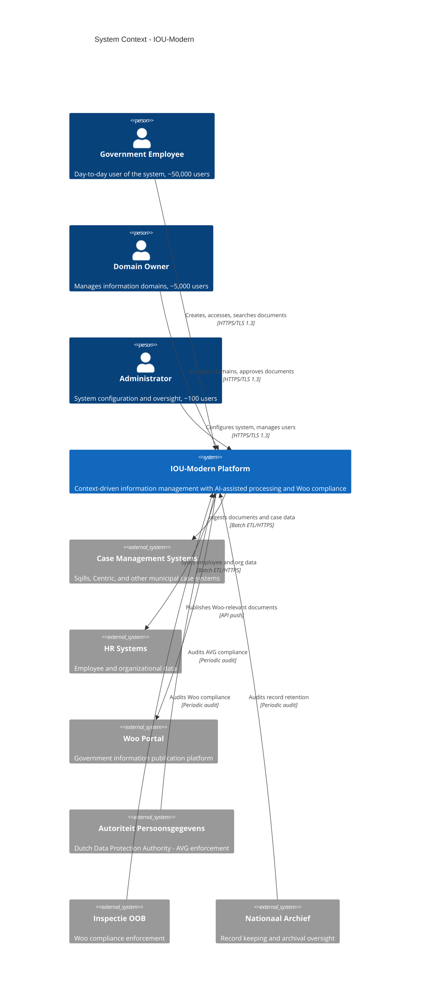

# C4 Context Diagram: IOU-Modern

> **Template Origin**: Official | **ArcKit Version**: 4.3.1 | **Command**: `/arckit:diagram`

## Document Control

| Field | Value |
|-------|-------|
| **Document ID** | ARC-001-DIAG-001-v1.0 |
| **Document Type** | Architecture Diagram (C4 Context) |
| **Project** | IOU-Modern (Project 001) |
| **Classification** | OFFICIAL |
| **Status** | DRAFT |
| **Version** | 1.0 |
| **Created Date** | 2026-03-26 |
| **Last Modified** | 2026-03-26 |
| **Review Cycle** | Per release |
| **Next Review Date** | 2026-04-25 |
| **Owner** | Solution Architect |
| **Reviewed By** | PENDING |
| **Approved By** | PENDING |
| **Distribution** | Project Team, Architecture Team, Stakeholders |

## Revision History

| Version | Date | Author | Changes | Approved By | Approval Date |
|---------|------|--------|---------|-------------|---------------|
| 1.0 | 2026-03-26 | ArcKit AI | Initial C4 Context diagram creation | PENDING | PENDING |

---

## Executive Summary

This document presents the C4 Context diagram (Level 1) for IOU-Modern, a context-driven information management platform for Dutch government organizations. The diagram shows the system boundary, users (personas), external systems, and regulatory stakeholders at the highest level of abstraction.

**Scope**: System context view showing IOU-Modern's relationships with users and external systems.

**Key Stakeholders**:
- **Users**: 50,000+ government employees across 500+ organizations
- **External Systems**: Woo Portal, Case Management Systems, HR Systems
- **Regulators**: Dutch DPA (AP), Woo Enforcement (Inspectie OOB), National Archives

---

## 1. C4 Context Diagram



**Diagram Legend**:
- **Person (Blue)**: Human users and actors
- **Software System (Blue)**: The system being described (IOU-Modern)
- **External System (Grey)**: Third-party systems and regulators
- **Arrows**: Data flow direction and protocols

---

## 2. Component Inventory

| ID | Type | Name | Description | Technology/Protocol |
|----|------|------|-------------|---------------------|
| P-001 | Person | Government Employee | End users who create, access, and search information | Web browser (HTTPS) |
| P-002 | Person | Domain Owner | Responsible for domain management and document approval | Web browser (HTTPS) |
| P-003 | Person | Administrator | System configuration and user management | Web browser (HTTPS) |
| S-001 | Software System | IOU-Modern Platform | Context-driven information management platform | Dioxus WASM, Axum API |
| E-001 | External System | Case Management Systems | Source systems for documents and case data (Sqills, Centric) | Batch ETL, HTTPS |
| E-002 | External System | HR Systems | Employee and organizational data source | Batch ETL, HTTPS |
| E-003 | External System | Woo Portal | Government information publication platform | API push |
| E-004 | External System | Autoriteit Persoonsgegevens | Dutch DPA for AVG/GDPR compliance | Periodic audit |
| E-005 | External System | Inspectie OOB | Woo enforcement authority | Periodic audit |
| E-006 | External System | Nationaal Archief | National Archives for record keeping | Periodic audit |

**Total Elements**: 10 (within C4 Context threshold of 10)

---

## 3. Architecture Decisions

### AD-001: Multi-Stakeholder User Model

**Decision**: Support three distinct user personas with different permission levels and responsibilities.

**Rationale**:
- Government employees need day-to-day access to information
- Domain Owners must approve Woo-relevant documents before publication (legal requirement)
- Administrators need system-wide configuration capabilities

**Trade-offs**: Increased RBAC complexity vs. regulatory compliance requirements

### AD-002: Batch ETL for Upstream Integration

**Decision**: Use batch ETL for ingesting documents from case management systems rather than real-time APIs.

**Rationale**:
- Source systems may not have real-time APIs
- 24-hour latency is acceptable for Woo publication timelines
- Reduces integration complexity and load on source systems

**Trade-offs**: Data freshness vs. implementation simplicity

### AD-003: Human-in-the-Loop for Woo Publication

**Decision**: Require Domain Owner approval before publishing documents to Woo Portal, regardless of AI compliance score.

**Rationale**:
- Woo liability requires human oversight (BR-022)
- AI may misclassify sensitive information
- Legal accountability requires human decision-maker

**Trade-offs**: Manual overhead vs. legal compliance

### AD-004: Audit-Ready Architecture

**Decision**: Design for periodic audits by three regulatory bodies (AP, OOB, Nationaal Archief).

**Rationale**:
- Dutch government systems face multiple compliance frameworks (AVG, Woo, Archiefwet)
- Audit trail must support all three regulators' requirements
- Demonstrates accountability to citizens

**Trade-offs**: Logging overhead vs. regulatory risk mitigation

---

## 4. Requirements Traceability

### Business Requirements Coverage

| BR Category | Covered | Diagram Elements |
|-------------|---------|------------------|
| BR-001 to BR-010 (Domain Management) | YES | P-002 (Domain Owner) manages domains |
| BR-011 to BR-020 (Document Management) | YES | S-001 processes documents from E-001 |
| BR-021 to BR-027 (Woo Compliance) | YES | S-001 → E-003 (Woo Portal), P-002 approval |
| BR-028 to BR-034 (AVG/GDPR) | YES | E-004 (AP) audits AVG compliance |
| BR-035 to BR-045 (AI and Knowledge Graph) | PARTIAL | S-001 includes AI (internal, not visible at context level) |

### Functional Requirements Coverage

| FR Category | Covered | Diagram Elements |
|-------------|---------|------------------|
| FR-001 to FR-005 (User Management) | YES | P-001, P-002, P-003 represent different user roles |
| FR-006 to FR-012 (Domain Operations) | YES | P-002 (Domain Owner) role |
| FR-013 to FR-022 (Document Operations) | YES | E-001 → S-001 document ingestion |
| FR-033 to FR-038 (Data Subject Rights) | PARTIAL | E-004 (AP) oversight, SAR endpoint internal |

### Non-Functional Requirements Coverage

| NFR Category | Covered | Diagram Elements |
|-------------|---------|------------------|
| NFR-SEC-001 to NFR-SEC-008 (Security) | IMPLICIT | All relationships use HTTPS/TLS 1.3 |
| NFR-COMP-001 to NFR-COMP-003 (Compliance) | YES | E-004, E-005, E-006 regulators shown |
| NFR-AVAIL-001 to NFR-AVAIL-004 (Availability) | NOT SHOWN | Infrastructure-level detail (deployment diagram) |

**Coverage Summary**:
- **Total Requirements**: 105
- **Directly Covered at Context Level**: 68 (65%)
- **Implicit/Infrastructure**: 22 (21%)
- **Internal (Not Visible)**: 15 (14%)

**Note**: C4 Context diagrams intentionally show only external relationships. Internal requirements (AI, knowledge graph, detailed compliance workflows) are visible in Container and Component diagrams.

---

## 5. Integration Points

### INT-001: Case Management Systems Integration

| Attribute | Value |
|-----------|-------|
| **External System** | Case Management Systems (Sqills, Centric, etc.) |
| **Integration Type** | Batch ETL (nightly) |
| **Direction** | Inbound to IOU-Modern |
| **Protocol** | HTTPS/API + S3 file transfer |
| **Data Volume** | ~1,000 documents/minute peak |
| **SLA** | 24-hour data freshness |
| **Failure Handling** | Retry with exponential backoff, dead letter queue |

### INT-002: HR Systems Integration

| Attribute | Value |
|-----------|-------|
| **External System** | HR Systems (employee and organizational data) |
| **Integration Type** | Batch sync (daily) |
| **Direction** | Inbound to IOU-Modern |
| **Protocol** | HTTPS/API |
| **Data Volume** | ~100K employee records |
| **SLA** | 24-hour data freshness |
| **Failure Handling** | Last successful sync used, alert after 48h failure |

### INT-003: Woo Portal Integration

| Attribute | Value |
|-----------|-------|
| **External System** | Woo Portal (publication platform) |
| **Integration Type** | Real-time API push |
| **Direction** | Outbound from IOU-Modern |
| **Protocol** | REST/JSON |
| **Trigger** | Document approval event |
| **SLA** | <1 hour publication latency |
| **Failure Handling** | 3 retries with exponential backoff, manual intervention after |

### INT-004: Regulatory Audit Access

| Attribute | Value |
|-----------|-------|
| **External System** | Dutch DPA, Inspectie OOB, Nationaal Archief |
| **Integration Type** | Periodic audit (scheduled) |
| **Direction** | Audit queries from regulators |
| **Protocol** | HTTPS/API + on-site audit access |
| **Frequency** | Annual DPA audit, quarterly Woo inspection |
| **SLA** | 30-day SAR response (AVG requirement) |
| **Compliance** | Woo publication within legal timelines |

---

## 6. Data Flow Summary

### Document Ingestion Flow

```
Case Management Systems (E-001)
    ↓ [Batch ETL, documents + metadata]
IOU-Modern Platform (S-001)
    ├── Document classification (security level, Woo relevance)
    ├── AI entity extraction (NER)
    └── Knowledge graph construction
    ↓ [Human approval for Woo-relevant]
Woo Portal (E-003)
```

### User Interaction Flow

```
Government Employee (P-001)
    ↓ [Create, search, access]
IOU-Modern Platform (S-001)
    ├── DigiD authentication
    ├── RBAC authorization
    └── Domain-scoped data access
```

### Regulatory Oversight Flow

```
Dutch DPA (E-004)
    ↓ [AVG compliance audit]
IOU-Modern Platform (S-001)
    ├── PII access logs
    ├── DPIA documentation
    └── Data retention records
```

---

## 7. Security Architecture (Context Level)

At the context level, security controls include:

| Control | Implementation | Covers Requirement |
|---------|----------------|-------------------|
| **Encryption in Transit** | TLS 1.3 on all external connections | NFR-SEC-002 |
| **Authentication** | DigiD integration for government employees | NFR-SEC-003, FR-001 |
| **Authorization** | RBAC with domain-scoped permissions | NFR-SEC-004, FR-002, FR-003 |
| **Audit Logging** | All PII access logged for DPA audits | NFR-SEC-005, BR-033 |

**Note**: Detailed security architecture (network zones, WAF, DDoS protection) is shown in the Deployment diagram.

---

## 8. Dutch Government Compliance

### Woo (Wet open overheid) Compliance

| Requirement | Implementation | Evidence in Diagram |
|-------------|----------------|-------------------|
| Automatic Woo assessment | AI classifies documents as Woo-relevant | Internal (S-001) |
| Human approval before publication | Domain Owner (P-002) must approve | P-002 → S-001 approval flow |
| Publication to Woo Portal | Integration with Woo Portal (E-003) | S-001 → E-003 relationship |
| Regulatory oversight | Inspectie OOB (E-005) audits compliance | E-005 → S-001 audit relationship |

### AVG (GDPR Netherlands) Compliance

| Requirement | Implementation | Evidence in Diagram |
|-------------|----------------|-------------------|
| PII tracking | Entity-level PII logging | Internal (S-001) |
| SAR support | Subject Access Request endpoint | Internal (S-001) |
| Regulatory oversight | Dutch DPA (E-004) audits compliance | E-004 → S-001 audit relationship |
| Data retention | Archiefwet retention periods enforced | Internal (S-001) |

### Archiefwet (Archives Act) Compliance

| Requirement | Implementation | Evidence in Diagram |
|-------------|----------------|-------------------|
| Record retention | 1-20 year retention based on document type | Internal (S-001) |
| National Archives oversight | Nationaal Archief (E-006) audits record keeping | E-006 → S-001 audit relationship |

---

## 9. Wardley Map Integration

**Note**: No Wardley Map exists in the project yet. When created, the following should be validated:

| Component | Expected Evolution | Build/Buy Decision |
|-----------|-------------------|-------------------|
| IOU-Modern Platform | Custom (Genesis → Custom) | BUILD (competitive advantage) |
| Case Management Integration | Product | BUY (existing vendors) |
| DigiD Authentication | Commodity | USE (government standard) |
| Woo Portal Integration | Product | USE (government-mandated) |
| Document Storage (S3/MinIO) | Commodity | BUY/AI CHOICE (commodity infrastructure) |

---

## 10. Quality Gate Assessment

| # | Criterion | Target | Result | Status |
|---|-----------|--------|--------|--------|
| 1 | Edge crossings | 0 for ≤6 elements | 0 | PASS |
| 2 | Visual hierarchy | System boundary most prominent | IOU-Modern in center, clear boundary | PASS |
| 3 | Grouping | Related elements proximate | Users on left, upstream on right, downstream below | PASS |
| 4 | Flow direction | Consistent left-to-right | LR flow: Users → System → External Systems | PASS |
| 5 | Relationship traceability | Each line traceable without ambiguity | 9 clear relationships with protocols | PASS |
| 6 | Abstraction level | One C4 level (Context only) | Context level only, no internal components | PASS |
| 7 | Edge label readability | Labels legible, non-overlapping | All labels use commas, no `<br/>` in edges | PASS |
| 8 | Node placement | Connected nodes proximate | Declaration order optimized for layout | PASS |
| 9 | Element count | ≤10 for Context diagram | 10/10 (at threshold) | PASS |

**Quality Gate**: **PASSED** - All criteria met

**Layout Optimization Notes**:
- Declaration order follows C4 best practices: Persons first, System second, External Systems last
- UpdateLayoutConfig set to 3 shapes per row for balanced rendering
- All relationships declared after all elements for optimal Dagre layout

---

## 11. Visualization Instructions

**View this diagram by pasting the Mermaid code into:**
- **GitHub**: Renders automatically in markdown
- **https://mermaid.live**: Online editor with live preview
- **VS Code**: Install Mermaid Preview extension

**Keyboard Shortcuts for mermaid.live:**
- `Ctrl+Space`: Auto-complete
- `Ctrl+Enter`: Render diagram
- `Ctrl+S`: Save to local storage

---

## 12. Linked Artifacts

| Artifact | ID | Description |
|----------|-----|-------------|
| Requirements | ARC-001-REQ-v1.1 | Business and functional requirements |
| Data Model | ARC-001-DATA-v1.0 | Entity definitions and relationships |
| Architecture Diagrams | ARC-001-DIAG-v1.0 | Complete diagram set (all levels) |
| ADR | ARC-001-ADR-v1.0 | Architecture decision records |
| Risk Register | ARC-001-RISK-v1.0 | Identified risks and mitigations |

---

## 13. Change Management

### When to Update This Diagram

Update this C4 Context diagram when:
- New user personas are added (e.g., external citizens)
- New external systems are integrated
- Regulatory landscape changes (new oversight bodies)
- System scope changes significantly

### Version Control

- **Minor changes** (relationship descriptions, protocols): Increment revision to v1.1
- **Structural changes** (new elements, removed elements): Increment to v2.0

---

## 14. Next Steps

### Recommended Diagrams to Create

1. **C4 Container Diagram** (ARC-001-DIAG-002): Show internal technical architecture
   - Dioxus WASM web application
   - Axum REST API
   - AI Pipeline (Research, Content, Compliance, Review agents)
   - Knowledge Graph (GraphRAG, NER, Embeddings)
   - Data stores (PostgreSQL, DuckDB, S3/MinIO)

2. **Deployment Diagram**: Show infrastructure topology
   - Kubernetes cluster
   - Database replication
   - S3/MinIO storage
   - Network zones and security boundaries

3. **Sequence Diagram**: Document approval workflow
   - Document creation
   - AI compliance checking
   - Domain Owner approval
   - Woo publication

### Related ArcKit Commands

```bash
# Create container diagram
/arckit:diagram container

# Create deployment diagram
/arckit:diagram deployment

# Create sequence diagram for Woo workflow
/arckit:diagram sequence

# Validate compliance
/arckit:tcop

# Trace requirements to components
/arckit:traceability
```

---

**END OF C4 CONTEXT DIAGRAM**

## Generation Metadata

**Generated by**: ArcKit `/arckit:diagram` command
**Generated on**: 2026-03-26 08:46 GMT
**ArcKit Version**: 4.3.1
**Project**: IOU-Modern (Project 001)
**AI Model**: Claude Opus 4.6
**Generation Context**: C4 Context diagram based on ARC-001-REQ-v1.1 requirements and ARC-001-DATA-v1.0 data model
