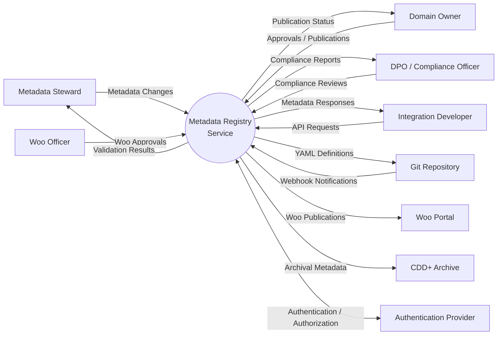
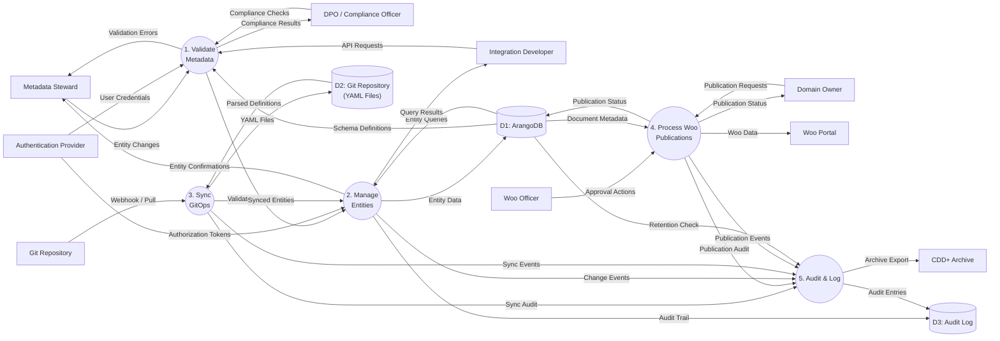

# Data Flow Diagram: Metadata Registry Service

> **Template Origin**: Official | **ArcKit Version**: 4.3.1 | **Command**: `/arckit:dfd`

## Document Control

| Field | Value |
|-------|-------|
| **Document ID** | ARC-002-DFD-001-v1.0 |
| **Document Type** | Data Flow Diagram |
| **Project** | Metadata Registry Service (Project 002) |
| **Classification** | OFFICIAL |
| **Status** | DRAFT |
| **Version** | 1.0 |
| **Created Date** | 2026-04-20 |
| **Last Modified** | 2026-04-20 |
| **Review Cycle** | On-Demand |
| **Next Review Date** | 2026-05-20 |
| **Owner** | Enterprise Architect |
| **Reviewed By** | PENDING |
| **Approved By** | PENDING |
| **Distribution** | Project Team, Architecture Team |

## Revision History

| Version | Date | Author | Changes | Approved By | Approval Date |
|---------|------|--------|---------|-------------|---------------|
| 1.0 | 2026-04-20 | ArcKit AI | Initial creation from `/arckit:dfd` command | PENDING | PENDING |

## Diagram Purpose

This Data Flow Diagram (DFD) documents the data flows within the Metadata Registry Service, showing how metadata entities are created, validated, stored, and synchronized. It includes both a Context Diagram (Level 0) showing the system boundary and external entities, and a Level 1 DFD decomposing the system into major processes.

---

## Level 0: Context Diagram

### `data-flow-diagram` DSL

```dfd
title Context Diagram - Metadata Registry Service

entity    STEWARD    "Metadata Steward"
entity    OWNER      "Domain Owner"
entity    DEVELOPER  "Integration Developer"
entity    DPO        "DPO / Compliance Officer"
entity    WOO_OFF    "Woo Officer"

entity    GIT        "Git Repository"
entity    WOO_PORT   "Woo Portal"
entity    CDD        "CDD+ Archive"
entity    AUTH       "Authentication Provider"

process   P0         "Metadata Registry\nService"

STEWARD   --> P0    "Metadata Changes"
OWNER     --> P0    "Approvals / Publications"
DPO       --> P0    "Compliance Reviews"
WOO_OFF   --> P0    "Woo Approvals"
DEVELOPER --> P0    "API Requests"

P0        --> STEWARD  "Validation Results"
P0        --> OWNER    "Publication Status"
P0        --> DPO      "Compliance Reports"
P0        --> DEVELOPER "Metadata Responses"

P0        --> GIT      "YAML Definitions"
GIT       --> P0       "Webhook Notifications"
P0        --> WOO_PORT "Woo Publications"
P0        --> CDD      "Archival Metadata"
P0        <--> AUTH    "Authentication / Authorization"
```

### Mermaid (Approximate)



---

## Level 1: Top-Level DFD

### `data-flow-diagram` DSL

```dfd
title Level 1 DFD - Metadata Registry Service

entity    STEWARD    "Metadata Steward"
entity    OWNER      "Domain Owner"
entity    DEVELOPER  "Integration Developer"
entity    DPO        "DPO / Compliance Officer"
entity    WOO_OFF    "Woo Officer"

entity    GIT        "Git Repository"
entity    WOO_PORT   "Woo Portal"
entity    CDD        "CDD+ Archive"
entity    AUTH       "Authentication Provider"

process   P1         "1\nValidate\nMetadata"
process   P2         "2\nManage\nEntities"
process   P3         "3\nSync\nGitOps"
process   P4         "4\nProcess Woo\nPublications"
process   P5         "5\nAudit & Log"

store     D1         "ArangoDB"
store     D2         "Git Repository\n(YAML Files)"
store     D3         "Audit Log"

STEWARD   --> P1    "Entity Changes"
DEVELOPER --> P1    "API Requests"
DPO       --> P1    "Compliance Checks"

AUTH      --> P1    "User Credentials"
AUTH      --> P2    "Authorization Tokens"

P1        --> P2    "Validated Entities"
P1        --> STEWARD "Validation Errors"
P1        --> DPO      "Compliance Results"

P2        --> D1    "Entity Data"
P2        --> D3    "Audit Trail"
D1        --> P2    "Entity Queries"
D1        --> P1    "Schema Definitions"

P2        --> DEVELOPER "Query Results"
P2        --> STEWARD "Entity Confirmations"

GIT       --> P3    "Webhook / Pull"
P3        --> D2    "YAML Files"
D2        --> P3    "Parsed Definitions"
P3        --> P2    "Synced Entities"
P3        --> D3    "Sync Audit"

OWNER     --> P4    "Publication Requests"
WOO_OFF   --> P4    "Approval Actions"
D1        --> P4    "Document Metadata"
P4        --> D1    "Publication Status"
P4        --> D3    "Publication Audit"
P4        --> WOO_PORT "Woo Data"
P4        --> OWNER "Publication Status"

P2        --> P5    "Change Events"
P3        --> P5    "Sync Events"
P4        --> P5    "Publication Events"
P5        --> D3    "Audit Entries"

D1        --> P5    "Retention Check"
P5        --> CDD    "Archive Export"
```

### Mermaid (Approximate)



---

## Process Specifications

| Process | Name | Inputs | Outputs | Logic Summary | Req. Trace |
|---------|------|--------|---------|---------------|------------|
| 1 | Validate Metadata | Entity Changes, API Requests, Compliance Checks, Schema Definitions | Validated Entities, Validation Errors, Compliance Results | Validates incoming metadata against TOOI/MDTO standards, schema constraints, and business rules. Returns detailed validation report with errors/warnings. | BR-MREG-006, BR-MREG-011 |
| 2 | Manage Entities | Validated Entities, Synced Entities, Authorization Tokens, Entity Queries | Entity Data, Audit Trail, Query Results, Entity Confirmations | CRUD operations on metadata entities in ArangoDB. Handles time-based validity filtering, organization isolation, and referential integrity. | BR-MREG-001, BR-MREG-002, BR-MREG-003 |
| 3 | Sync GitOps | Webhook/Pull, YAML Files | Synced Entities, Sync Audit | Background service that synchronizes YAML definitions from Git repository. Parses files, detects changes, updates entities, logs all sync operations. | BR-MREG-007 |
| 4 | Process Woo Publications | Publication Requests, Approval Actions, Document Metadata | Publication Status, Woo Data, Publication Audit | Manages Woo publication workflow: create request, approve/reject, publish to Woo Portal, track status throughout lifecycle. | BR-MREG-009 |
| 5 | Audit & Log | Change Events, Sync Events, Publication Events, Retention Check | Audit Entries, Archive Export | Centralized audit logging for all system mutations. Enforces retention policies (7 years), generates compliance reports, exports to CDD+ on expiry. | BR-MREG-005, BR-MREG-008 |

---

## Data Store Descriptions

| Store | Name | Contents | Access | Retention | PII |
|-------|------|----------|--------|-----------|-----|
| D1 | ArangoDB | All GGHH V2 entities (gebeurtenis, gegevensproduct, informatieobject), edge collections (29), relationships, user records, organization data | Read/Write by P1, P2, P4, P5 | Indefinite (per entity) | Yes (user data) |
| D2 | Git Repository | YAML schema definitions, value lists, configuration files in Git format | Read by P3, Write (webhook) from Git | Forever (Git history) | No |
| D3 | Audit Log | Audit trail entries (action, entity_type, entity_id, user, timestamp, changes, request_id), compliance reports | Write by P2, P3, P4, P5; Read by P5, DPO | 7 years (Archiefwet) | Yes (user actions) |

---

## Data Dictionary

| Data Flow | Composition | Source | Destination | Format |
|-----------|-------------|--------|-------------|--------|
| Entity Changes | {entity_type, attributes, relationships, organisatie_id, geldig_vanaf, geldig_tot} | Steward, Developer | P1 | JSON |
| Validated Entities | {entity, validation_report, warnings, is_valid} | P1 | P2 | JSON |
| Validation Errors | {error_code, field, message, severity} | P1 | Steward, DPO | JSON |
| API Requests | {query, filters, limit, offset, authentication_token} | Developer | P1 | HTTP/JSON |
| Query Results | {data, pagination, total} | P2 | Developer | JSON |
| Authorization Tokens | {access_token, refresh_token, expires, scopes, user_id, roles} | AUTH | P1, P2 | JWT |
| User Credentials | {username, password, mfa_code} | Steward, Owner, Developer | AUTH | HTTPS |
| Webhook Notifications | {event_type, repo_url, commit_hash, branch, changed_files} | Git | P3 | HTTP/JSON |
| YAML Files | {schema_definitions, value_lists, metadata} | D2 | P3 | YAML |
| Synced Entities | {entities, commit_ref, sync_timestamp} | P3 | P2 | JSON |
| Publication Requests | {informatieobject_id, woo_exemption, publication_date} | Owner | P4 | JSON |
| Woo Data | {document_metadata, woo_url, publication_id, status} | P4 | Woo Portal | JSON |
| Audit Entries | {action, entity_type, entity_id, user_id, timestamp, changes, request_id, ip_address} | P5 | D3 | JSON |
| Compliance Reports | {report_type, period, violations, recommendations} | P5 | DPO | PDF/JSON |
| Archive Export | {entities, audit_trail, metadata, export_timestamp} | P5 | CDD | JSON |

---

## Requirements Traceability

### Business Requirements Coverage

| BR ID | Requirement | Process | Data Store | Status |
|-------|-------------|---------|------------|--------|
| BR-MREG-001 | GGHH V2 entities | P1, P2 | D1 | ✅ Covered |
| BR-MREG-002 | Time-based validity | P1, P2 | D1 | ✅ Covered |
| BR-MREG-003 | Graph relationships | P2 | D1 | ✅ Covered |
| BR-MREG-004 | Multi-tenancy | P2 | D1 | ✅ Covered |
| BR-MREG-005 | Audit trail | P5 | D3 | ✅ Covered |
| BR-MREG-006 | TOOI/MDTO validation | P1 | D1 | ✅ Covered |
| BR-MREG-007 | GitOps sync | P3 | D2 | ✅ Covered |
| BR-MREG-008 | CDD+ integration | P5 | CDD | ✅ Covered |
| BR-MREG-009 | Woo publication | P4 | WOO_PORT | ✅ Covered |
| BR-MREG-010 | REST/GraphQL APIs | P2 | D1 | ✅ Covered |
| BR-MREG-011 | AVG privacy classification | P1 | D1 | ✅ Covered |

### Integration Requirements Coverage

| INT ID | Integration | Process | External Entity | Status |
|-------|-------------|---------|-----------------|--------|
| INT-MREG-1 | ArangoDB storage | P2 | D1 | ✅ Implemented |
| INT-MREG-2 | GitOps sync | P3 | Git | ✅ Implemented |
| INT-MREG-3 | Woo portal | P4 | WOO_PORT | ✅ Designed |
| INT-MREG-4 | CDD+ archive | P5 | CDD | ✅ Designed |
| INT-MREG-5 | Authentication | P1, P2 | AUTH | ✅ Designed |

---

## DFD Validation

### Yourdon-DeMarco Rules Checklist

| Rule | Status | Notes |
|------|--------|-------|
| Every process has at least one input AND one output | ✅ PASS | All processes have inputs and outputs |
| No process has only inputs (black hole) | ✅ PASS | P5 writes to D3, P2 reads/writes D1 |
| No process has only outputs (miracle) | ✅ PASS | All processes consume data |
| Data stores have at least one read and one write flow | ✅ PASS | D1, D2, D3 all have read/write |
| Data flows are named | ✅ PASS | All arrows have labels |
| External entities only connect to processes | ✅ PASS | No entity-to-store connections |
| Process numbering is consistent | ✅ PASS | Level 0: P0, Level 1: P1-P5 |
| Level 1 processes decompose from Level 0 | ✅ PASS | All flows balanced |

### Balancing Rules (Level 0 ↔ Level 1)

| Level 0 Flow | Level 1 Equivalent | Status |
|--------------|-------------------|--------|
| Steward → P0 (Metadata Changes) | Steward → P1 (Entity Changes) | ✅ Balanced |
| P0 → Steward (Validation Results) | P1 → Steward (Validation Errors) | ✅ Balanced |
| Developer → P0 (API Requests) | Developer → P1 (API Requests) | ✅ Balanced |
| P0 → Developer (Metadata Responses) | P2 → Developer (Query Results) | ✅ Balanced |
| P0 ↔ Git (YAML/Webhook) | P3 ↔ Git (Webhook/Pull) | ✅ Balanced |
| P0 → Woo (Woo Publications) | P4 → Woo (Woo Data) | ✅ Balanced |
| P0 → CDD (Archival Metadata) | P5 → CDD (Archive Export) | ✅ Balanced |
| P0 ↔ Auth (Authentication) | P1, P2 ↔ Auth (Credentials/Tokens) | ✅ Balanced |

---

## Security Considerations

### Data Flow Security

| Flow | Security Measure | Implementation |
|------|-----------------|----------------|
| Entity Changes | TLS 1.3, Authentication | HTTPS + OAuth 2.0 |
| API Requests | Rate limiting, API keys | OAuth 2.0 scopes |
| Webhook Notifications | Signature verification | HMAC validation |
| Woo Publications | Approved Woo URLs allowlist | Domain validation |
| Audit Log Export | Encrypted transfer | mTLS to CDD+ |
| User Credentials | Multi-factor auth | TOTP required |

### Data Store Security

| Store | Encryption | Access Control | Retention |
|-------|------------|----------------|-----------|
| D1: ArangoDB | At-rest (AES-256) | Row-level security | Per entity |
| D2: Git Repository | GPG signing | SSH key auth | Forever |
| D3: Audit Log | Write-once | DPO-only read | 7 years |

---

## Visualization Instructions

**View this diagram by pasting the code into:**

**For `data-flow-diagram` DSL (true Yourdon-DeMarco notation):**
```bash
pip install data-flow-diagram
dfd < input.dfd > output.svg
```

**For Mermaid approximation:**
- **GitHub**: Renders automatically in markdown
- **https://mermaid.live**: Online editor (paste code, view rendered)
- **VS Code**: Install "Mermaid Preview" extension
- **ArcKit Pages**: Run `/arckit:pages` to generate documentation site

---

## DFD Summary

| Metric | Count |
|--------|-------|
| External Entities | 9 |
| Processes | 5 |
| Data Stores | 3 |
| Data Flows | 35+ |

---

## Linked Artifacts

| Artifact | Type | Link |
|----------|------|------|
| ARC-002-DIAG-001-v1.0.md | System Context | `projects/002-metadata-registry/diagrams/ARC-002-DIAG-001-v1.0.md` |
| ARC-002-DIAG-002-v1.0.md | Container Diagram | `projects/002-metadata-registry/diagrams/ARC-002-DIAG-002-v1.0.md` |
| ARC-002-REQ-v1.1.md | Requirements | `projects/002-metadata-registry/ARC-002-REQ-v1.1.md` |
| ARC-002-DLD-v1.0.md | Detailed Design | `projects/002-metadata-registry/design/ARC-002-DLD-v1.0.md` |
| ARC-002-DB-v1.0.md | Database Design | `projects/002-metadata-registry/design/ARC-002-DB-v1.0.md` |

---

## Next Steps

1. **Create Level 2 DFD** - Decompose specific processes (e.g., "Validate Metadata" into sub-processes)
   ```bash
   /arckit:dfd level 2
   ```

2. **Create Sequence Diagrams** - Document detailed interaction patterns
   ```bash
   /arckit:diagram sequence
   ```

3. **Update with Implementation Details** - Add actual API endpoints and database queries as implementation progresses

4. **Create State Diagram** - Document Woo publication workflow states
   ```bash
   /arckit:diagram state
   ```

---

## Generation Metadata

**Generated by**: ArcKit `/arckit:dfd` command
**Generated on**: 2026-04-20 00:00:00 GMT
**ArcKit Version**: 4.3.1
**Project**: Metadata Registry Service (Project 002)
**AI Model**: claude-opus-4-7
**DFD Level**: All Levels (0-1) - Context and Level 1
