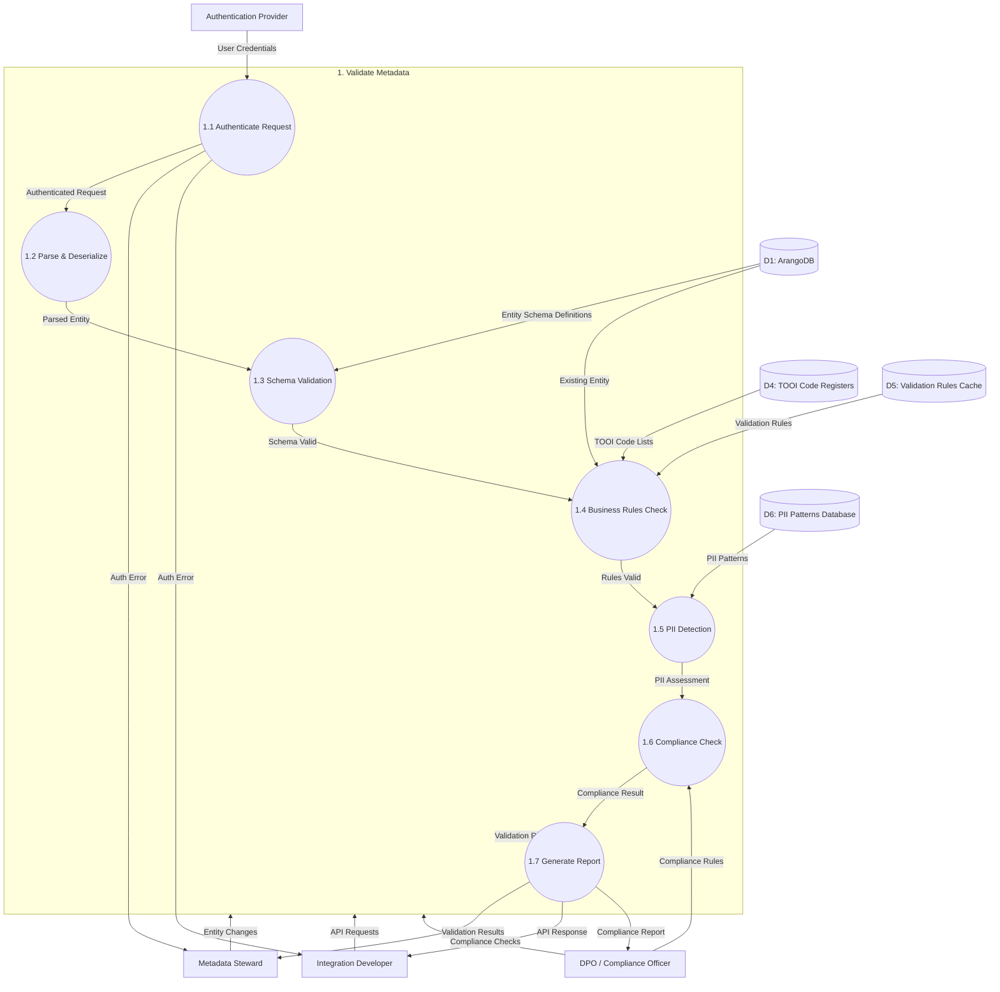

# Data Flow Diagram: Level 2 - Validate Metadata Process

> **Template Origin**: Official | **ArcKit Version**: 4.3.1 | **Command**: `/arckit:dfd`

## Document Control

| Field | Value |
|-------|-------|
| **Document ID** | ARC-002-DFD-002-v1.0 |
| **Document Type** | Data Flow Diagram |
| **Project** | Metadata Registry Service (Project 002) |
| **Classification** | OFFICIAL |
| **Status** | DRAFT |
| **Version** | 1.0 |
| **Created Date** | 2026-04-20 |
| **Last Modified** | 2026-04-20 |
| **Review Cycle** | On-Demand |
| **Next Review Date** | 2026-05-20 |
| **Owner** | Enterprise Architect |
| **Reviewed By** | PENDING |
| **Approved By** | PENDING |
| **Distribution** | Project Team, Architecture Team |

## Revision History

| Version | Date | Author | Changes | Approved By | Approval Date |
|---------|------|--------|---------|-------------|---------------|
| 1.0 | 2026-04-20 | ArcKit AI | Initial creation from `/arckit:dfd` command | PENDING | PENDING |

## Diagram Purpose

This Level 2 Data Flow Diagram decomposes Process 1 (Validate Metadata) from the Level 1 DFD into detailed sub-processes. It shows how metadata entities are validated through multiple stages including authentication, schema validation, business rules, PII detection, and compliance checking.

---

## Level 2 DFD: Validate Metadata (Process 1)

### Parent Process Context

This diagram decomposes **Process 1.0 (Validate Metadata)** from ARC-002-DFD-001.

### `data-flow-diagram` DSL

```dfd
title Level 2 DFD - Validate Metadata Process

process   P1         "1\nValidate\nMetadata"

process   P1_1       "1.1\nAuthenticate\nRequest"
process   P1_2       "1.2\nParse &\nDeserialize"
process   P1_3       "1.3\nSchema\nValidation"
process   P1_4       "1.4\nBusiness Rules\nCheck"
process   P1_5       "1.5\nPII\nDetection"
process   P1_6       "1.6\nCompliance\nCheck"
process   P1_7       "1.7\nGenerate\nValidation Report"

store     D1         "ArangoDB"
store     D4         "TOOI Code\nRegisters"
store     D5         "Validation\nRules Cache"
store     D6         "PII Patterns\nDatabase"

entity    AUTH       "Authentication\nProvider"
entity    STEWARD    "Metadata Steward"
entity    DEVELOPER  "Integration\nDeveloper"
entity    DPO        "DPO / Compliance\nOfficer"

%% Input flows to parent process
STEWARD   --> P1    "Entity Changes"
DEVELOPER --> P1    "API Requests"
DPO       --> P1    "Compliance Checks"

%% Decomposition: P1 internal flows
AUTH      --> P1_1  "User Credentials"
STEWARD   --> P1_1  "Session Token"
DEVELOPER --> P1_1  "API Token"

P1_1      --> P1_2  "Authenticated\nRequest"
P1_1      --> STEWARD "Auth Error"
P1_1      --> DEVELOPER "Auth Error"

P1_2      --> P1_3  "Parsed Entity"
P1_2      --> P1_2  "Parse Error"

P1_3      --> P1_4  "Schema Valid"
P1_3      --> P1_3  "Schema Errors"

D1        --> P1_3  "Entity Schema\nDefinitions"
D1        --> P1_4  "Existing Entity\n(for updates)"

P1_4      --> P1_5  "Rules Valid"
P1_4      --> P1_4  "Rule Violations"

D5        --> P1_4  "Validation Rules"
D4        --> P1_4  "TOOI Code Lists"

P1_5      --> P1_6  "PII Assessment"
P1_5      --> P1_5  "PII Warnings"

D6        --> P1_5  "PII Patterns\n(Regex)"

DPO       --> P1_6  "Compliance\nRules"

P1_6      --> P1_7  "Compliance\nResult"
P1_6      --> P1_6  "Compliance\nIssues"

P1_7      --> P1    "Validation Report"
P1_7      --> STEWARD "Validation Results"
P1_7      --> DEVELOPER "API Response"
P1_7      --> DPO "Compliance Report"
```

### Mermaid (Approximate)



---

## Process Specifications

| Process | Name | Inputs | Outputs | Logic Summary |
|---------|------|--------|---------|---------------|
| 1.1 | Authenticate Request | User Credentials, Session Token, API Token | Authenticated Request, Auth Error | Validates OAuth 2.0/JWT tokens, checks session expiry, verifies RBAC permissions for requested operation. Returns 401/403 on failure. |
| 1.2 | Parse & Deserialize | Authenticated Request | Parsed Entity, Parse Error | Deserializes JSON/YAML payload, validates character encoding, checks max size limits (10MB), extracts entity type and attributes. |
| 1.3 | Schema Validation | Parsed Entity, Entity Schema Definitions | Schema Valid, Schema Errors | Validates against GGHH V2 entity schema, checks required fields, data types, format patterns (email, URI, dates). Returns detailed field-level errors. |
| 1.4 | Business Rules Check | Schema Valid, Existing Entity, Validation Rules, TOOI Code Lists | Rules Valid, Rule Violations | Applies TOOI/MDTO business rules: time validity (geldig_vanaf < geldig_tot), code list values, uniqueness constraints, referential integrity for edges. |
| 1.5 | PII Detection | Rules Valid, PII Patterns | PII Assessment, PII Warnings | Scans entity fields for PII patterns: BSN, passport, IBAN, email, phone, address. Scores confidence levels, flags fields requiring additional protection. |
| 1.6 | Compliance Check | PII Assessment, Compliance Rules, DPO Rules | Compliance Result, Compliance Issues | Checks AVG/GDPR compliance: lawful basis, data minimization, retention period, Woo classification, security level assignment. Generates DPIA trigger if needed. |
| 1.7 | Generate Report | Compliance Result, All Validation Errors | Validation Report | Aggregates all errors, warnings, and info messages. Assigns overall validation status (VALID, INVALID, WARN). Returns structured report with severity levels. |

---

## Data Store Descriptions (Level 2)

| Store | Name | Contents | Access | Retention |
|-------|------|----------|--------|-----------|
| D4 | TOOI Code Registers | Official government code lists (TOOI), MDTO standards, value lists with versions | Read by P1.4 | Updated quarterly |
| D5 | Validation Rules Cache | Compiled validation rules, constraint definitions, regex patterns | Read by P1.4 | TTL 24h, reload on schema change |
| D6 | PII Patterns Database | PII detection patterns (regex, ML models), confidence thresholds, GDPR field mappings | Read by P1.5 | Updated by DPO |

---

## Data Dictionary (Level 2)

| Data Flow | Composition | Source | Destination | Format |
|-----------|-------------|--------|-------------|--------|
| User Credentials | {username, password, mfa_code, client_id} | Steward, Developer | P1.1 | HTTPS |
| Authenticated Request | {user_id, roles, org_id, payload, operation} | P1.1 | P1.2 | Internal |
| Parsed Entity | {entity_type, attributes, relationships, metadata} | P1.2 | P1.3 | Internal |
| Entity Schema Definitions | {entity_type, required_fields, types, patterns} | D1 | P1.3 | JSON Schema |
| Schema Valid | {entity, is_valid, field_errors: []} | P1.3 | P1.4 | JSON |
| Validation Rules | {rule_id, constraint, severity, error_message} | D5 | P1.4 | JSON |
| TOOI Code Lists | {code_list_id, codes: [], valid_from, valid_to} | D4 | P1.4 | JSON |
| Rules Valid | {entity, rule_results: [], is_valid} | P1.4 | P1.5 | JSON |
| PII Patterns | {pattern_id, regex, confidence, gdpr_field} | D6 | P1.5 | Regex/JSON |
| PII Assessment | {entity, pii_fields: [], overall_score, recommendations} | P1.5 | P1.6 | JSON |
| Compliance Result | {entity, avg_status, woo_class, retention_days} | P1.6 | P1.7 | JSON |
| Validation Report | {status: VALID\|INVALID\|WARN, errors: [], warnings: [], info: [], timestamp} | P1.7 | Steward, Developer, DPO | JSON |

---

## Decision Rules

### 1.3 Schema Validation Rules

| Rule | Condition | Action |
|------|-----------|--------|
| SV-001 | Required field missing | Return ERROR with field name |
| SV-002 | Data type mismatch | Return ERROR with expected type |
| SV-003 | Date format invalid | Return ERROR with expected format (ISO 8601) |
| SV-004 | String length exceeds maximum | Return ERROR with max length |
| SV-005 | Invalid enum value | Return ERROR with allowed values |

### 1.4 Business Rules

| Rule | Condition | Action |
|------|-----------|--------|
| BR-001 | geldig_vanaf >= geldig_tot | Return ERROR |
| BR-002 | geldig_tot in past | Return WARN |
| BR-003 | TOOI code not in register | Return ERROR |
| BR-004 | Reference to non-existent entity | Return ERROR |
| BR-005 | Duplicate key within organization | Return ERROR |

### 1.5 PII Detection Rules

| Pattern | Regex (simplified) | Confidence | GDPR Field |
|---------|-------------------|------------|------------|
| BSN (Dutch SSN) | `^\d{9}$` | HIGH | citizens-service-id |
| IBAN | `^[A-Z]{2}\d{2}[A-Z0-9]{4}\d{7}$` | HIGH | bank-account-number |
| Email | `^[^@]+@[^@]+\.[^@]+$` | MEDIUM | email |
| Phone | `^[\+()\d\s-]{10,20}$` | MEDIUM | phone-number |
| Passport | `^[A-Z0-9<]{9}$` | HIGH | passport-number |

### 1.6 Compliance Rules

| Rule | Condition | Action |
|------|-----------|--------|
| AVG-001 | PII detected without legal basis | Return ERROR, trigger DPIA |
| AVG-002 | Retention period exceeds 20 years | Return WARN |
| WOO-001 | Woo document without classification | Return ERROR |
| WOO-002 | Woo exemption without grounds | Return ERROR |
| SEC-001 | High PII + low security level | Return ERROR |

---

## Validation Report Structure

```json
{
  "report_id": "vr-20240420-001",
  "entity_type": "gebeurtenis",
  "entity_key": "evt-001",
  "status": "VALID",
  "validated_at": "2024-04-20T10:00:00Z",
  "validated_by": "user-456",
  "summary": {
    "total_checks": 15,
    "errors": 0,
    "warnings": 2,
    "info": 1
  },
  "stages": {
    "authentication": {
      "status": "PASS",
      "user_id": "user-456",
      "roles": ["editor", "steward"]
    },
    "parsing": {
      "status": "PASS",
      "payload_size_bytes": 2048
    },
    "schema": {
      "status": "PASS",
      "fields_checked": 12
    },
    "business_rules": {
      "status": "WARN",
      "warnings": [
        {
          "code": "BR-002",
          "field": "geldig_tot",
          "message": "End date is in the past",
          "severity": "WARNING"
        }
      ]
    },
    "pii_detection": {
      "status": "PASS",
      "pii_fields_found": 0,
      "score": 0
    },
    "compliance": {
      "status": "PASS",
      "woo_classifiable": true,
      "avg_compliant": true,
      "retention_days": 2555
    }
  },
  "recommendations": [
    {
      "type": "INFO",
      "message": "Consider updating geldig_tot to future date"
    }
  ]
}
```

---

## Error Handling

| Error Code | Name | HTTP Status | Description |
|------------|------|-------------|-------------|
| VAL-001 | Authentication Failed | 401 | Invalid or expired credentials |
| VAL-002 | Authorization Failed | 403 | User lacks required role |
| VAL-003 | Parse Error | 400 | Invalid JSON/YAML syntax |
| VAL-004 | Schema Validation Failed | 400 | Required field missing or invalid type |
| VAL-005 | Business Rule Violation | 400 | Constraint violation |
| VAL-006 | Compliance Violation | 403 | AVG/Woo requirement not met |
| VAL-007 | Entity Not Found | 404 | Referenced entity doesn't exist |
| VAL-008 | Concurrent Modification | 409 | Entity modified by another user |

---

## Performance Targets

| Stage | Target | Measurement |
|-------|--------|-------------|
| 1.1 Authentication | <50ms (p95) | Token validation time |
| 1.2 Parsing | <20ms (p95) | Deserialization time |
| 1.3 Schema Validation | <30ms (p95) | Schema check time |
| 1.4 Business Rules | <50ms (p95) | Rule evaluation time |
| 1.5 PII Detection | <40ms (p95) | Pattern matching time |
| 1.6 Compliance Check | <30ms (p95) | Compliance rules time |
| 1.7 Report Generation | <10ms (p95) | Report assembly time |
| **Total** | **<200ms (p95)** | End-to-end validation |

---

## DFD Validation

### Yourdon-DeMarco Rules Checklist

| Rule | Status | Notes |
|------|--------|-------|
| Every process has at least one input AND one output | ✅ PASS | All sub-processes have inputs/outputs |
| No process has only inputs (black hole) | ✅ PASS | All processes produce output |
| No process has only outputs (miracle) | ✅ PASS | All processes consume data |
| Data stores have at least one read and one write flow | ✅ PASS | D4, D5, D6 have read flows; writes via parent process |
| Data flows are named | ✅ PASS | All arrows have labels |
| External entities only connect to processes | ✅ PASS | No entity-to-store connections |
| Process numbering is consistent | ✅ PASS | Parent: 1, Children: 1.1-1.7 |
| Level 2 decomposes from Level 1 | ✅ PASS | All inputs/outputs balanced |

### Balancing Rules (Level 1 ↔ Level 2)

| Level 1 Flow | Level 2 Equivalent | Status |
|--------------|-------------------|--------|
| Steward → P1 (Entity Changes) | Steward → P1.1 (via Session Token) | ✅ Balanced |
| Developer → P1 (API Requests) | Developer → P1.1 (via API Token) | ✅ Balanced |
| DPO → P1 (Compliance Checks) | DPO → P1.6 (Compliance Rules) | ✅ Balanced |
| P1 → Steward (Validation Errors) | P1.1, P1.7 → Steward (Auth Error, Results) | ✅ Balanced |
| P1 → P2 (Validated Entities) | P1.7 → P1 (Validation Report) | ✅ Balanced |

---

## Security Considerations

### Validation Pipeline Security

| Stage | Threat | Mitigation |
|-------|--------|------------|
| 1.1 Authentication | Token replay | Short-lived JWT, refresh token rotation |
| 1.2 Parsing | JSON bomb | Max size limit (10MB), depth limit |
| 1.3 Schema Validation | Schema injection | Whitelisted schemas only |
| 1.4 Business Rules | Privilege escalation | Role-based rule access |
| 1.5 PII Detection | Data exfiltration | PII access logging, DPO alerts |
| 1.6 Compliance | Compliance bypass | Immutable rules, audit trail |

### Data Protection

| Data | Classification | Protection |
|------|----------------|------------|
| User Credentials | HIGH | Hashed + salted, never logged |
| PII Assessment | HIGH | Encrypted at rest, access logged |
| Validation Report | MEDIUM | User-scoped access, retention 7 years |
| Compliance Issues | HIGH | DPO notifications, immutable audit |

---

## Visualization Instructions

**For `data-flow-diagram` DSL (true Yourdon-DeMarco notation):**
```bash
pip install data-flow-diagram
dfd < input.dfd > output.svg
```

**For Mermaid approximation:**
- **GitHub**: Renders automatically in markdown
- **https://mermaid.live**: Online editor (paste code, view rendered)
- **VS Code**: Install "Mermaid Preview" extension

---

## Level 2 DFD Summary

| Metric | Count |
|--------|-------|
| Sub-Processes | 7 |
| Data Stores | 3 (new) |
| External Entities | 4 |
| Data Flows | 25+ |

---

## Linked Artifacts

| Artifact | Type | Link |
|----------|------|------|
| ARC-002-DFD-001-v1.0.md | Level 0/1 DFD | `projects/002-metadata-registry/diagrams/ARC-002-DFD-001-v1.0.md` |
| ARC-002-DLD-v1.0.md | Detailed Design | `projects/002-metadata-registry/design/ARC-002-DLD-v1.0.md` |
| ARC-002-API-v1.0.md | API Specification | `projects/002-metadata-registry/design/ARC-002-API-v1.0.md` |
| ARC-002-SEC-v1.0.md | Security Design | `projects/002-metadata-registry/design/ARC-002-SEC-v1.0.md` |

---

## Next Steps

1. **Create Level 2 DFD for Process 4** - Decompose "Process Woo Publications"
   ```bash
   /arckit:dfd level 2 --process 4
   ```

2. **Create Sequence Diagram** - Document validation interaction sequence
   ```bash
   /arckit:diagram sequence
   ```

3. **Create State Diagram** - Document validation report states
   ```bash
   /arckit:diagram state
   ```

---

## Generation Metadata

**Generated by**: ArcKit `/arckit:dfd` command
**Generated on**: 2026-04-20 00:00:00 GMT
**ArcKit Version**: 4.3.1
**Project**: Metadata Registry Service (Project 002)
**AI Model**: claude-opus-4-7
**DFD Level**: Level 2 - Validate Metadata Process Decomposition
