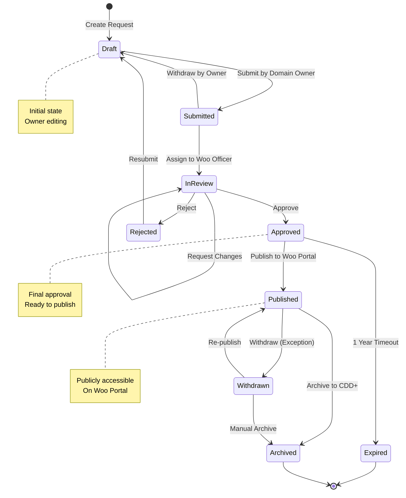
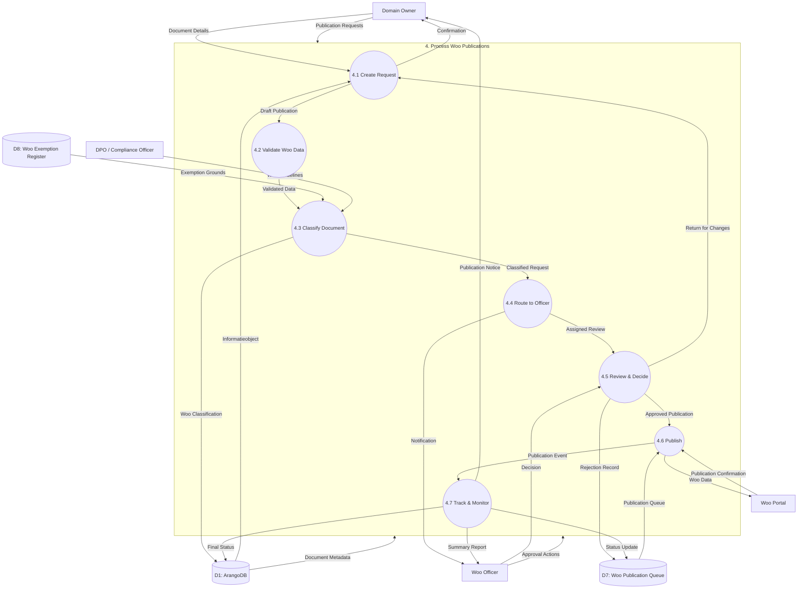

# Data Flow Diagram: Level 2 - Process Woo Publications

> **Template Origin**: Official | **ArcKit Version**: 4.3.1 | **Command**: `/arckit:dfd`

## Document Control

| Field | Value |
|-------|-------|
| **Document ID** | ARC-002-DFD-003-v1.0 |
| **Document Type** | Data Flow Diagram |
| **Project** | Metadata Registry Service (Project 002) |
| **Classification** | OFFICIAL |
| **Status** | DRAFT |
| **Version** | 1.0 |
| **Created Date** | 2026-04-20 |
| **Last Modified** | 2026-04-20 |
| **Review Cycle** | On-Demand |
| **Next Review Date** | 2026-05-20 |
| **Owner** | Enterprise Architect |
| **Reviewed By** | PENDING |
| **Approved By** | PENDING |
| **Distribution** | Project Team, Architecture Team, Woo Officers |

## Revision History

| Version | Date | Author | Changes | Approved By | Approval Date |
|---------|------|--------|---------|-------------|---------------|
| 1.0 | 2026-04-20 | ArcKit AI | Initial creation from `/arckit:dfd` command | PENDING | PENDING |

## Diagram Purpose

This Level 2 Data Flow Diagram decomposes Process 4 (Process Woo Publications) from the Level 1 DFD. It documents the complete Woo (Wet open overheid) publication workflow, from initial request through approval, publication, and archival. The workflow implements the Dutch Government Information (Public Access) Act requirements.

---

## Woo Publication Workflow States



---

## Level 2 DFD: Process Woo Publications (Process 4)

### Parent Process Context

This diagram decomposes **Process 4.0 (Process Woo Publications)** from ARC-002-DFD-001.

### `data-flow-diagram` DSL

```dfd
title Level 2 DFD - Process Woo Publications

process   P4         "4\nProcess Woo\nPublications"

process   P4_1       "4.1\nCreate\nRequest"
process   P4_2       "4.2\nValidate\nWoo Data"
process   P4_3       "4.3\nClassify\nDocument"
process   P4_4       "4.4\nRoute to\nOfficer"
process   P4_5       "4.5\nReview &\nDecide"
process   P4_6       "4.6\nPublish to\nWoo Portal"
process   P4_7       "4.7\nTrack &\nMonitor"

store     D1         "ArangoDB"
store     D7         "Woo Publication\nQueue"
store     D8         "Woo Exemption\nRegister"

entity    OWNER      "Domain Owner"
entity    WOO_OFF    "Woo Officer"
entity    WOO_PORT   "Woo Portal"
entity    DPO        "DPO / Compliance\nOfficer"

%% Input flows to parent process
OWNER     --> P4    "Publication Requests"
WOO_OFF   --> P4    "Approval Actions"
D1        --> P4    "Document Metadata"

%% Decomposition: P4 internal flows
OWNER     --> P4_1  "Document Details"
D1        --> P4_1  "Informatieobject"

P4_1      --> P4_2  "Draft Publication"
P4_1      --> OWNER "Confirmation"

P4_2      --> P4_3  "Validated Data"
P4_2      --> P4_2  "Validation Errors"

D8        --> P4_3  "Exemption Grounds"
DPO       --> P4_3  "Woo Guidelines"

P4_3      --> P4_4  "Classified Request"
P4_3      --> D1    "Woo Classification"

P4_4      --> P4_5  "Assigned Review"
P4_4      --> WOO_OFF "Notification"

WOO_OFF   --> P4_5  "Decision"
P4_5      --> WOO_OFF "Review Details"

P4_5      --> P4_6  "Approved Publication"
P4_5      --> P4_1  "Return for Changes"
P4_5      --> D7    "Rejection Record"

D7        --> P4_6  "Publication Queue"

P4_6      --> WOO_PORT "Woo Data"
WOO_PORT  --> P4_6  "Publication Confirmation"

P4_6      --> P4_7  "Publication Event"
P4_7      --> D7    "Status Update"
P4_7      --> D1    "Final Status"
P4_7      --> OWNER "Publication Notice"
P4_7      --> WOO_OFF "Summary Report"
```

### Mermaid (Approximate)



---

## Process Specifications

| Process | Name | Inputs | Outputs | Logic Summary |
|---------|------|--------|---------|---------------|
| 4.1 | Create Request | Document Details, Informatieobject | Draft Publication, Confirmation | Creates WooPublicatie entity in status DRAFT. Links to Informatieobject. Captures initial metadata: title, description, publication date, requested by. |
| 4.2 | Validate Woo Data | Draft Publication | Validated Data, Validation Errors | Validates required Woo fields: informatiecategorie, documenttype, beveiligingsniveau. Checks document is in correct status (gepersisteerd). Validates publication date is not in past. |
| 4.3 | Classify Document | Validated Data, Exemption Grounds, Woo Guidelines | Classified Request, Woo Classification | Determines Woo classification: openbaar, gedeeltelijk_openbaar, niet_openbaar. If niet_openbaar, requires exemption ground from register. Assigns Woo URL slug. |
| 4.4 | Route to Officer | Classified Request | Assigned Review, Notification | Routes to appropriate Woo Officer based on organization and information category. Sends notification with review queue position. Sets status to IN_REVIEW. |
| 4.5 | Review & Decide | Decision, Review Details | Approved Publication, Return for Changes, Rejection Record | Officer reviews request, can approve (set to GOEDGEKEURD), reject (AFGEKEURD with reason), or request changes (TERUGGEZONDEN). All decisions require justification. |
| 4.6 | Publish to Woo Portal | Approved Publication, Publication Queue | Woo Data, Publication Confirmation | Calls Woo Portal API to publish document. Receives Woo URL and publication ID. Updates status to GEPUBLICEERD. Stores publication timestamp. |
| 4.7 | Track & Monitor | Publication Event | Status Update, Final Status, Publication Notice, Summary Report | Monitors publication status, tracks access metrics, generates daily/weekly summaries for officers. Handles withdrawal requests and exceptions. Updates final archival status. |

---

## Data Store Descriptions (Level 2 - Woo)

| Store | Name | Contents | Access | Retention |
|-------|------|----------|--------|-----------|
| D7 | Woo Publication Queue | All Woo publication requests, status history, decisions, rejection reasons, publication URLs | Read/Write by P4 | 7 years after publication |
| D8 | Woo Exemption Register | Official Woo exemption grounds (art. 10.1a Woo), valid reasons, required documentation | Read by P4.3 | Updated by Ministry |

---

## Woo Publication Data Model

### WooPublicatie Entity

```javascript
{
  "_key": "woo-001",
  "informatieobject_id": "info-001",
  "status": "DRAFT",  // DRAFT, IN_REVIEW, GOEDGEKEURD, AFGEKEURD, GEPUBLICEERD, INGETROKKEN, GEARCHIVEERD

  // Request details
  "aangevraagd_door": "user-456",
  "aangevraagd_op": "2024-04-19T10:00:00Z",
  "gewenste_publicatiedatum": "2024-05-01",

  // Classification
  "woo_classificatie": "openbaar",  // openbaar, gedeeltelijk_openbaar, niet_openbaar
  "informatiecategorie": "besluit",
  "beveiligingsniveau": "openbaar",

  // Exemption (if applicable)
  "exemptie_grond": null,
  "exemptie_beschrijving": null,
  "exemptie_documenten": [],

  // Review
  "woo_officer_id": "user-789",
  "toegewezen_op": "2024-04-19T11:00:00Z",
  "review_deadline": "2024-04-26T11:00:00Z",  // 7 days

  // Decision
  "besluit": null,
  "besluit_op": null,
  "besluit_door": null,
  "afwijzingsreden": null,

  // Publication
  "woo_url": null,
  "woo_publicatie_id": null,
  "gepubliceerd_op": null,

  // Withdrawal (if applicable)
  "ingetrokken_op": null,
  "ingetrokken_door": null,
  "ingetrokken_reden": null,

  // Audit
  "geldig_vanaf": "2024-04-19T10:00:00Z",
  "geldig_tot": "9999-12-31T23:59:59Z",
  "organisatie_id": "org-123"
}
```

---

## Data Dictionary (Level 2 - Woo)

| Data Flow | Composition | Source | Destination | Format |
|-----------|-------------|--------|-------------|--------|
| Document Details | {informatieobject_id, title, description, category} | Owner | P4.1 | JSON |
| Draft Publication | {woo_publicatie_id, status: DRAFT, informatiecategorie} | P4.1 | P4.2 | Internal |
| Validation Errors | {field, error_code, message} | P4.2 | P4.2 | JSON |
| Exemption Grounds | {ground_code, description, required_docs} | D8 | P4.3 | JSON |
| Woo Guidelines | {classification_rules, exemption_criteria} | DPO | P4.3 | PDF/JSON |
| Classified Request | {woo_classificatie, exemption_ground, woo_slug} | P4.3 | P4.4 | JSON |
| Assigned Review | {status: IN_REVIEW, officer_id, deadline} | P4.4 | P4.5 | Internal |
| Notification | {request_id, queue_position, deadline} | P4.4 | Woo Officer | Email |
| Decision | {approve/reject/changes, justification, exemption} | Woo Officer | P4.5 | Form/JSON |
| Approved Publication | {status: GOEDGEKEURD, approved_by, approved_at} | P4.5 | P4.6 | JSON |
| Rejection Record | {status: AFGEKEURD, reason, rejected_by, rejected_at} | P4.5 | D7 | JSON |
| Publication Confirmation | {woo_url, publication_id, published_at} | Woo Portal | P4.6 | JSON |
| Publication Notice | {woo_url, published_at, access_count} | P4.7 | Owner | Email |
| Summary Report | {total_published, pending_rejections, avg_processing_time} | P4.7 | Woo Officer | JSON |

---

## Woo Exemption Grounds (Article 10.1a Woo)

| Ground Code | Description | Documentation Required | Auto-approve? |
|-------------|-------------|------------------------|---------------|
| EX-001 | Relations of the Kingdom | Cabinet approval | No |
| EX-002 | Security of the State | Security assessment | No |
| EX-003 | Personal privacy | PIA assessment | Conditional |
| EX-004 | Commercial confidentiality | Business justification | Conditional |
| EX-005 | Ongoing investigation | Case number | Yes |
| EX-006 | Diplomatic relations | Foreign Affairs approval | No |
| EX-007 | Statistical data | Anonymization report | Yes |
| EX-008 | Incomplete decisions | Completion estimate | Yes |

---

## Decision Rules (Woo Process)

### 4.2 Validation Rules

| Rule | Condition | Action |
|------|-----------|--------|
| WOO-V-001 | Informatieobject status != gepersisteerd | Reject: document must be finalized |
| WOO-V-002 | Publication date < today | Warn: date is in the past |
| WOO-V-003 | Informatiecategorie = besluit, no besluitdatum | Reject: besluiten require date |
| WOO-V-004 | beveiligingsniveau = vertrouwelijk, no exemption | Reject: confidential requires exemption |

### 4.3 Classification Rules

| Rule | Condition | Classification |
|------|-----------|----------------|
| WOO-C-001 | beveiligingsniveau = openbaar | openbaar |
| WOO-C-002 | beveiligingsniveau = intern AND exemption approved | gedeeltelijk_openbaar |
| WOO-C-003 | beveiligingsniveau = vertrouwelijk AND exemption approved | niet_openbaar |
| WOO-C-004 | contains PII > 50%, no exemption | Require DPO review |

### 4.5 Approval Rules

| Rule | Condition | Action |
|------|-----------|--------|
| WOO-A-001 | Review deadline exceeded (7 days) | Auto-escalate to senior officer |
| WOO-A-002 | Third rejection | Require DPO review |
| WOO-A-003 | No justification given | Reject decision, require reason |
| WOO-A-004 | Changes requested twice | Escalate to Domain Owner |

### 4.6 Publication Rules

| Rule | Condition | Action |
|------|-----------|--------|
| WOO-P-001 | Publication date > 30 days from approval | Queue for scheduled publication |
| WOO-P-002 | Woo Portal API error | Retry 3x, then manual intervention |
| WOO-P-003 | Document withdrawn before publication | Cancel, notify requester |
| WOO-P-004 | Publication URL received | Update WooPublicatie, send confirmation |

---

## Service Level Agreements

| Metric | Target | Measurement |
|--------|--------|-------------|
| Request to Assignment | <1 hour | P4.1 → P4.4 timestamp |
| Assignment to First Review | <3 working days | P4.4 → P4.5 timestamp |
| Review to Decision | <7 working days | P4.5 decision timestamp |
| Approval to Publication | <24 hours | P4.5 → P4.6 timestamp |
| Publication to Notice | <1 hour | P4.6 → P4.7 → Owner |

---

## Error Handling

| Error Code | Name | HTTP Status | Description |
|------------|------|-------------|-------------|
| WOO-001 | Document Not Found | 404 | Informatieobject doesn't exist |
| WOO-002 | Invalid Document Status | 400 | Document not in gepersisteerd status |
| WOO-003 | Missing Required Field | 400 | Required Woo field missing |
| WOO-004 | Invalid Exemption Ground | 400 | Exemption code not in register |
| WOO-005 | Unauthorized Requester | 403 | User not authorized for this organization |
| WOO-006 | No Available Officer | 503 | No Woo Officer assigned to queue |
| WOO-007 | Publication Failed | 502 | Woo Portal API error |
| WOO-008 | Withdrawal Not Allowed | 403 | Document already published > 1 year |

---

## DFD Validation

### Yourdon-DeMarco Rules Checklist

| Rule | Status | Notes |
|------|--------|-------|
| Every process has at least one input AND one output | ✅ PASS | All sub-processes have inputs/outputs |
| No process has only inputs (black hole) | ✅ PASS | All processes produce output |
| No process has only outputs (miracle) | ✅ PASS | All processes consume data |
| Data stores have at least one read and one write flow | ✅ PASS | D7, D8 have read/write flows |
| Data flows are named | ✅ PASS | All arrows have labels |
| External entities only connect to processes | ✅ PASS | No entity-to-store connections |
| Process numbering is consistent | ✅ PASS | Parent: 4, Children: 4.1-4.7 |
| Level 2 decomposes from Level 1 | ✅ PASS | All inputs/outputs balanced |

---

## Security Considerations

| Aspect | Threat | Mitigation |
|--------|--------|------------|
| Unauthorized access | Non-owner creating request | RBAC check: owner role required |
| Data leakage | Sensitive document published | DPO review for niet_openbaar |
| Injection | Malicious Woo URL | URL allowlist, validation |
| DoS | Flood of publication requests | Rate limit per organization |
| Tampering | Decision modified after approval | Immutable audit trail |

---

## Visualization Instructions

**For `data-flow-diagram` DSL (true Yourdon-DeMarco notation):**
```bash
pip install data-flow-diagram
dfd < input.dfd > output.svg
```

**For Mermaid approximation:**
- **GitHub**: Renders automatically in markdown
- **https://mermaid.live**: Online editor (paste code, view rendered)
- **VS Code**: Install "Mermaid Preview" extension

---

## Level 2 DFD Summary

| Metric | Count |
|--------|-------|
| Sub-Processes | 7 |
| Data Stores | 2 (new) |
| External Entities | 4 |
| Data Flows | 30+ |
| Workflow States | 8 |

---

## Linked Artifacts

| Artifact | Type | Link |
|----------|------|------|
| ARC-002-DFD-001-v1.0.md | Level 0/1 DFD | `projects/002-metadata-registry/diagrams/ARC-002-DFD-001-v1.0.md` |
| ARC-002-REQ-v1.1.md | Requirements (BR-MREG-009) | `projects/002-metadata-registry/ARC-002-REQ-v1.1.md` |
| ARC-002-DLD-v1.0.md | Detailed Design | `projects/002-metadata-registry/design/ARC-002-DLD-v1.0.md` |

---

## Generation Metadata

**Generated by**: ArcKit `/arckit:dfd` command
**Generated on**: 2026-04-20 00:00:00 GMT
**ArcKit Version**: 4.3.1
**Project**: Metadata Registry Service (Project 002)
**AI Model**: claude-opus-4-7
**DFD Level**: Level 2 - Process Woo Publications Decomposition
