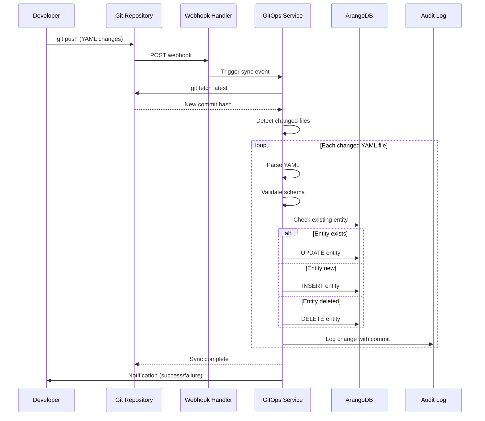
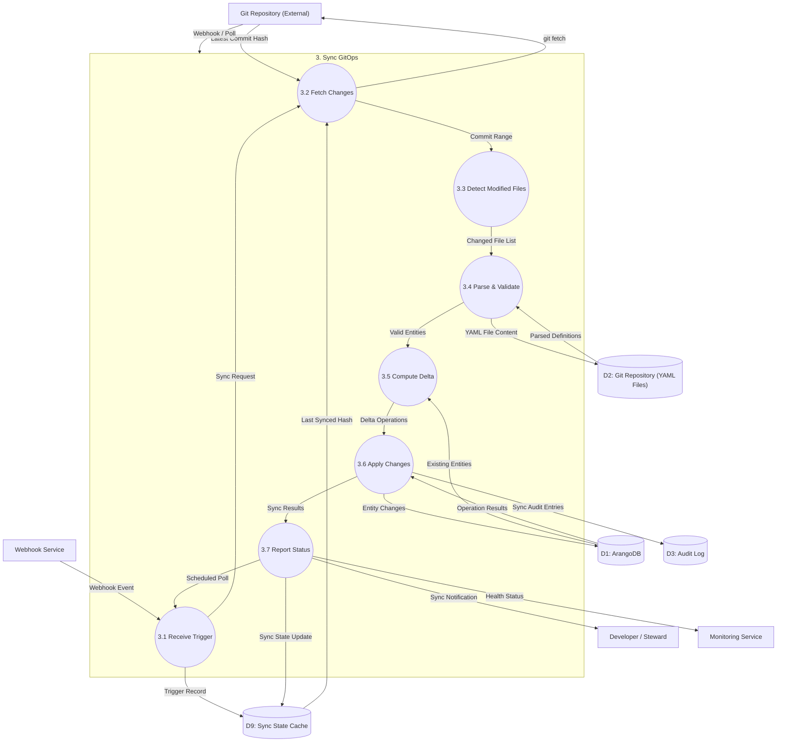

# Data Flow Diagram: Level 2 - Sync GitOps Process

> **Template Origin**: Official | **ArcKit Version**: 4.3.1 | **Command**: `/arckit:dfd`

## Document Control

| Field | Value |
|-------|-------|
| **Document ID** | ARC-002-DFD-004-v1.0 |
| **Document Type** | Data Flow Diagram |
| **Project** | Metadata Registry Service (Project 002) |
| **Classification** | OFFICIAL |
| **Status** | DRAFT |
| **Version** | 1.0 |
| **Created Date** | 2026-04-20 |
| **Last Modified** | 2026-04-20 |
| **Review Cycle** | On-Demand |
| **Next Review Date** | 2026-05-20 |
| **Owner** | Enterprise Architect |
| **Reviewed By** | PENDING |
| **Approved By** | PENDING |
| **Distribution** | Project Team, Architecture Team, DevOps Team |

## Revision History

| Version | Date | Author | Changes | Approved By | Approval Date |
|---------|------|--------|---------|-------------|---------------|
| 1.0 | 2026-04-20 | ArcKit AI | Initial creation from `/arckit:dfd` command | PENDING | PENDING |

## Diagram Purpose

This Level 2 Data Flow Diagram decomposes Process 3 (Sync GitOps) from the Level 1 DFD. It documents the GitOps synchronization service that keeps the metadata registry in sync with YAML definitions stored in a Git repository. This background service implements the GitOps pattern for infrastructure-as-code metadata management.

---

## GitOps Synchronization Architecture



---

## Level 2 DFD: Sync GitOps (Process 3)

### Parent Process Context

This diagram decomposes **Process 3.0 (Sync GitOps)** from ARC-002-DFD-001.

### `data-flow-diagram` DSL

```dfd
title Level 2 DFD - Sync GitOps Process

process   P3         "3\nSync\nGitOps"

process   P3_1       "3.1\nReceive\nTrigger"
process   P3_2       "3.2\nFetch\nChanges"
process   P3_3       "3.3\nDetect\nModified Files"
process   P3_4       "3.4\nParse &\nValidate"
process   P3_5       "3.5\nCompute\nDelta"
process   P3_6       "3.6\nApply\nChanges"
process   P3_7       "3.7\nReport\nStatus"

store     D1         "ArangoDB"
store     D2         "Git Repository\n(YAML Files)"
store     D3         "Audit Log"
store     D9         "Sync State\nCache"

entity    GIT        "Git Repository\n(External)"
entity    DEV        "Developer /\nSteward"
entity    WEBHOOK    "Webhook\nService"
entity    MONITOR    "Monitoring\nService"

%% Input flows to parent process
GIT       --> P3    "Webhook / Poll"

%% Decomposition: P3 internal flows
WEBHOOK   --> P3_1  "Webhook Event"
P3_7      --> P3_1  "Scheduled Poll"

P3_1      --> P3_2  "Sync Request"
P3_1      --> D9    "Trigger Record"

P3_2      --> GIT   "git fetch"
GIT       --> P3_2  "Latest Commit Hash"
D9        --> P3_2  "Last Synced Hash"

P3_2      --> P3_3  "Commit Range"

P3_3      --> P3_4  "Changed File List"
P3_3      --> P3_3  "No Changes (skip)"

P3_4      --> D2    "YAML File Content"
D2        --> P3_4  "Parsed Definitions"

P3_4      --> P3_4  "Parse Errors"
P3_4      --> P3_5  "Valid Entities"

D1        --> P3_5  "Existing Entities"

P3_5      --> P3_6  "Delta Operations\n(CREATE/UPDATE/DELETE)"
P3_5      --> P3_5  "Conflict Detected"

P3_6      --> D1    "Entity Changes"
P3_6      --> D3    "Sync Audit Entries"
D1        --> P3_6  "Operation Results"

P3_6      --> P3_7  "Sync Results"
P3_7      --> D9    "Sync State Update"
P3_7      --> DEV   "Sync Notification"
P3_7      --> MONITOR "Health Status"
```

### Mermaid (Approximate)



---

## Process Specifications

| Process | Name | Inputs | Outputs | Logic Summary |
|---------|------|--------|---------|---------------|
| 3.1 | Receive Trigger | Webhook Event, Scheduled Poll | Sync Request, Trigger Record | Receives sync trigger from Git webhook or scheduled poll (60s interval). Validates webhook signature, checks rate limits, deduplicates concurrent triggers. |
| 3.2 | Fetch Changes | Sync Request, Last Synced Hash | Commit Range, Latest Commit Hash | Executes `git fetch` to get latest changes. Compares with last synced hash to determine commit range for processing. |
| 3.3 | Detect Modified Files | Commit Range | Changed File List, No Changes | Parses commit diffs to identify changed YAML files. Filters for relevant paths: `schemas/`, `valuelists/`, `entities/`. Returns early if no changes. |
| 3.4 | Parse & Validate | Changed File List, YAML File Content | Parsed Definitions, Valid Entities, Parse Errors | Deserializes YAML into entity structures. Validates against GGHH V2 schema. Collects parse errors for batch reporting. |
| 3.5 | Compute Delta | Valid Entities, Existing Entities | Delta Operations, Conflict Detected | Compares parsed entities with database state. Determines CREATE (new), UPDATE (modified), DELETE (removed) operations. Detects conflicts (concurrent modifications). |
| 3.6 | Apply Changes | Delta Operations | Entity Changes, Sync Audit Entries, Operation Results | Applies delta operations in transaction: creates/updates/deletes entities. Handles rollback on errors. Writes audit entries with commit reference. |
| 3.7 | Report Status | Sync Results | Sync State Update, Sync Notification, Health Status | Aggregates sync results: success count, error count, conflicts. Updates sync state cache. Sends notifications to developers. Reports health to monitoring. |

---

## Data Store Descriptions (Level 2 - GitOps)

| Store | Name | Contents | Access | Retention |
|-------|------|----------|--------|-----------|
| D9 | Sync State Cache | Last synced commit hash, sync status, last sync timestamp, error history | Read/Write by P3 | 90 days |
| D2 | Git Repository | YAML schema definitions, value lists, entity definitions in Git format | Read by P3.4 | Forever (Git history) |

---

## YAML File Structure

### Schema Definition (`schemas/gebeurtenis.yaml`)

```yaml
apiVersion: "gghh.metadata-registry.nl/v2"
kind: "Schema"
metadata:
  name: "gebeurtenis"
  namespace: "org-123"
spec:
  attributes:
    - name: "naam"
      type: "string"
      required: true
      minLength: 1
      maxLength: 255
    - name: "omschrijving"
      type: "string"
      required: false
    - name: "gebeurtenistype"
      type: "enum"
      required: true
      values: ["aanvraag", "beschikking", "melding", "taakuitvoering", "andere"]
  validations:
    - rule: "time_validity"
      spec:
        start_field: "geldig_vanaf"
        end_field: "geldig_tot"
  relations:
    - to: "gegevensproduct"
      relation: "produces"
      cardinality: "many-to-many"
```

### Value List (`valuelists/gebeurtenistype.yaml`)

```yaml
apiVersion: "gghh.metadata-registry.nl/v2"
kind: "ValueList"
metadata:
  name: "gebeurtenistype"
  namespace: "global"
spec:
  values:
    - code: "aanvraag"
      label: "Aanvraag"
      description: "Indiening van een verzoek"
      valid_from: "2020-01-01"
    - code: "beschikking"
      label: "Beschikking"
      description: "Besluit van een bestuursorgaan"
      valid_from: "2020-01-01"
```

---

## Data Dictionary (Level 2 - GitOps)

| Data Flow | Composition | Source | Destination | Format |
|-----------|-------------|--------|-------------|--------|
| Webhook Event | {event_type, repo_url, commit_hash, branch, changed_files: [], signature} | Git, Webhook | P3.1 | HTTP/JSON |
| Sync Request | {trigger_type, commit_hash, priority} | P3.1 | P3.2 | Internal |
| Latest Commit Hash | {commit_hash, branch, author, timestamp, message} | Git | P3.2 | Git protocol |
| Commit Range | {from_hash, to_hash, commits: []} | P3.2 | P3.3 | Internal |
| Changed File List | {files: [], file_type: schema/value_list/entity} | P3.3 | P3.4 | Internal |
| YAML File Content | {file_path, content, version, commit} | D2 | P3.4 | YAML |
| Parsed Definitions | {entities: [], schemas: [], value_lists: []} | P3.4 | P3.5 | Internal |
| Existing Entities | {entity_type, key, version, modified_at} | D1 | P3.5 | JSON |
| Delta Operations | [{op: CREATE/UPDATE/DELETE, entity, reason}] | P3.5 | P3.6 | JSON |
| Conflict Detected | {entity_key, local_version, incoming_version} | P3.5 | P3.5 | JSON |
| Entity Changes | {created, updated, deleted, errors: []} | P3.6 | D1 | Batch |
| Sync Audit Entries | [{action, entity_id, commit_hash, timestamp}] | P3.6 | D3 | JSON |
| Sync Results | {status, created_count, updated_count, deleted_count, error_count} | P3.6 | P3.7 | JSON |
| Sync State Update | {last_sync_hash, last_sync_time, status} | P3.7 | D9 | JSON |
| Sync Notification | {status, summary, errors: []} | P3.7 | Developer | Email/Webhook |
| Health Status | {sync_enabled, last_sync, error_rate} | P3.7 | Monitoring | Prometheus |

---

## Decision Rules (GitOps)

### 3.4 Validation Rules

| Rule | Condition | Action |
|------|-----------|--------|
| SYNC-V-001 | YAML parse error | Skip file, log error, continue |
| SYNC-V-002 | Invalid apiVersion | Skip file, log error |
| SYNC-V-003 | Missing required metadata | Skip file, log error |
| SYNC-V-004 | Namespace mismatch | Skip file, log error |
| SYNC-V-005 | Time validity invalid | Skip file, log error |

### 3.5 Delta Rules

| Rule | Condition | Action |
|------|-----------|--------|
| SYNC-D-001 | File new, entity not in DB | CREATE operation |
| SYNC-D-002 | File modified, entity in DB, no conflict | UPDATE operation |
| SYNC-D-003 | File deleted, entity in DB | DELETE operation |
| SYNC-D-004 | Entity modified in DB since last sync | Conflict, require manual resolution |
| SYNC-D-005 | Entity marked do-not-sync | Skip operation |

### 3.6 Transaction Rules

| Rule | Condition | Action |
|------|-----------|--------|
| SYNC-T-001 | Any operation fails | Rollback all changes in batch |
| SYNC-T-002 | Validation error | Skip entity only, continue others |
| SYNC-T-003 | Database connection error | Retry 3x with exponential backoff |
| SYNC-T-004 | Constraint violation | Log error, skip entity |

---

## Sync Configuration

```yaml
# gitops-config.yaml
sync:
  enabled: true
  repository:
    url: "https://github.com/minjus/metadata-registry"
    branch: "main"
    auth_method: "ssh_key"
  triggers:
    webhook:
      enabled: true
      secret: "${WEBHOOK_SECRET}"
      endpoint: "/api/v1/gitops/webhook"
    poll:
      enabled: true
      interval_seconds: 60
  paths:
    include:
      - "schemas/**/*.yaml"
      - "valuelists/**/*.yaml"
      - "entities/**/*.yaml"
    exclude:
      - "**/_draft.yaml"
      - "**/*.backup.yaml"
  batch:
    max_operations: 100
    timeout_seconds: 300
    rollback_on_error: true
  conflict:
    strategy: "skip_and_notify"  # skip | skip_and_notify | overwrite
    notification: ["devops@minjus.nl"]
  audit:
    log_level: "info"
    include_content_diff: false
```

---

## Error Handling

| Error Code | Name | Action |
|------------|------|--------|
| SYNC-001 | Repository Not Found | Log fatal, disable sync |
| SYNC-002 | Authentication Failed | Log error, retry with backoff |
| SYNC-003 | Webhook Signature Invalid | Reject webhook, return 401 |
| SYNC-004 | YAML Parse Error | Skip file, continue batch |
| SYNC-005 | Database Connection Error | Retry 3x, then notify ops |
| SYNC-006 | Conflict Detected | Skip entity, notify stakeholders |
| SYNC-007 | Transaction Timeout | Rollback, retry batch |
| SYNC-008 | Rate Limit Exceeded | Queue trigger, delay sync |

---

## Performance Targets

| Stage | Target | Measurement |
|-------|--------|-------------|
| 3.1 Receive Trigger | <10ms (p95) | Webhook processing time |
| 3.2 Fetch Changes | <5s (p95) | Git fetch time |
| 3.3 Detect Files | <1s (p95) | Diff parsing time |
| 3.4 Parse & Validate | <100ms per file (p95) | YAML parse time |
| 3.5 Compute Delta | <500ms (p95) | Database comparison time |
| 3.6 Apply Changes | <2s per 100 ops (p95) | Batch transaction time |
| 3.7 Report Status | <50ms (p95) | Notification time |
| **Total (100 files)** | **<30s** | End-to-end sync time |

---

## Monitoring Metrics

```prometheus
# Sync operations
gitops_sync_total{status="success|error|conflict"}
gitops_sync_duration_seconds{operation="fetch|parse|apply"}

# Entity counts
gitops_entities_created_total
gitops_entities_updated_total
gitops_entities_deleted_total
gitops_entities_skipped_total{reason="conflict|error"}

# Health
gitops_last_success_timestamp_seconds
gitops_sync_error_rate
gitops_sync_queue_depth
```

---

## DFD Validation

### Yourdon-DeMarco Rules Checklist

| Rule | Status | Notes |
|------|--------|-------|
| Every process has at least one input AND one output | ✅ PASS | All sub-processes have inputs/outputs |
| No process has only inputs (black hole) | ✅ PASS | All processes produce output |
| No process has only outputs (miracle) | ✅ PASS | All processes consume data |
| Data stores have at least one read and one write flow | ✅ PASS | D9 has read/write; D2 read only (external) |
| Data flows are named | ✅ PASS | All arrows have labels |
| External entities only connect to processes | ✅ PASS | No entity-to-store connections |
| Process numbering is consistent | ✅ PASS | Parent: 3, Children: 3.1-3.7 |
| Level 2 decomposes from Level 1 | ✅ PASS | All inputs/outputs balanced |

---

## Security Considerations

| Aspect | Threat | Mitigation |
|--------|--------|------------|
| Webhook injection | Malicious payload | HMAC signature verification |
| Repository access | Unauthorized git access | SSH key authentication |
| YAML injection | Malicious YAML content | Schema validation, sandboxed parser |
| Privilege escalation | Sync creating admin entities | RBAC enforcement in P3.6 |
| Data loss | Deletion cascade | Soft delete, audit trail |
| Replay attack | Duplicate webhook | Deduplication by commit hash |

---

## Visualization Instructions

**For `data-flow-diagram` DSL (true Yourdon-DeMarco notation):**
```bash
pip install data-flow-diagram
dfd < input.dfd > output.svg
```

**For Mermaid approximation:**
- **GitHub**: Renders automatically in markdown
- **https://mermaid.live**: Online editor (paste code, view rendered)
- **VS Code**: Install "Mermaid Preview" extension

---

## Level 2 DFD Summary

| Metric | Count |
|--------|-------|
| Sub-Processes | 7 |
| Data Stores | 2 (1 new) |
| External Entities | 4 |
| Data Flows | 30+ |

---

## Linked Artifacts

| Artifact | Type | Link |
|----------|------|------|
| ARC-002-DFD-001-v1.0.md | Level 0/1 DFD | `projects/002-metadata-registry/diagrams/ARC-002-DFD-001-v1.0.md` |
| ARC-002-REQ-v1.1.md | Requirements (BR-MREG-007) | `projects/002-metadata-registry/ARC-002-REQ-v1.1.md` |
| ARC-002-DLD-v1.0.md | Detailed Design | `projects/002-metadata-registry/design/ARC-002-DLD-v1.0.md` |

---

## Generation Metadata

**Generated by**: ArcKit `/arckit:dfd` command
**Generated on**: 2026-04-20 00:00:00 GMT
**ArcKit Version**: 4.3.1
**Project**: Metadata Registry Service (Project 002)
**AI Model**: claude-opus-4-7
**DFD Level**: Level 2 - Sync GitOps Process Decomposition
