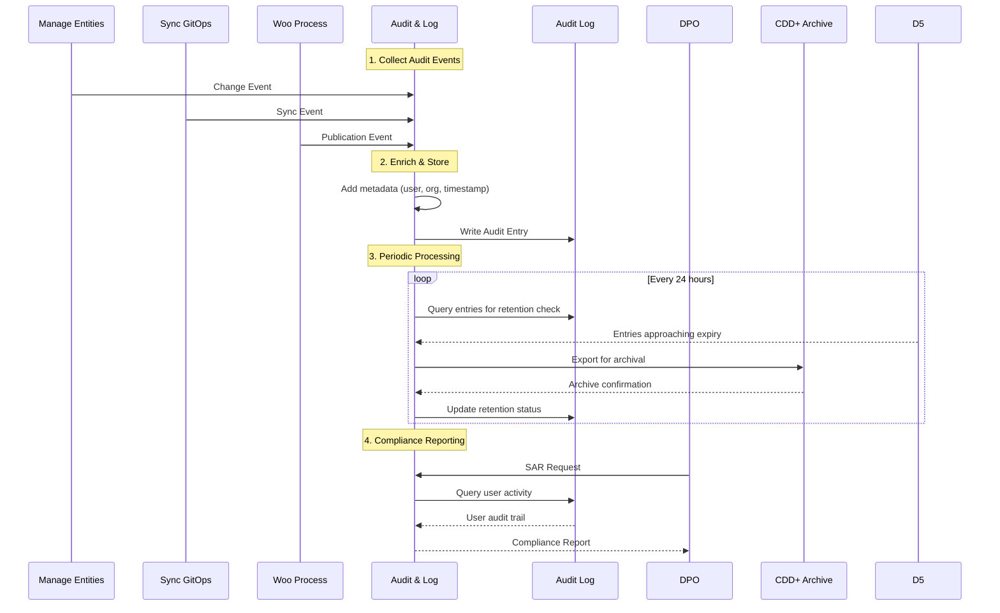
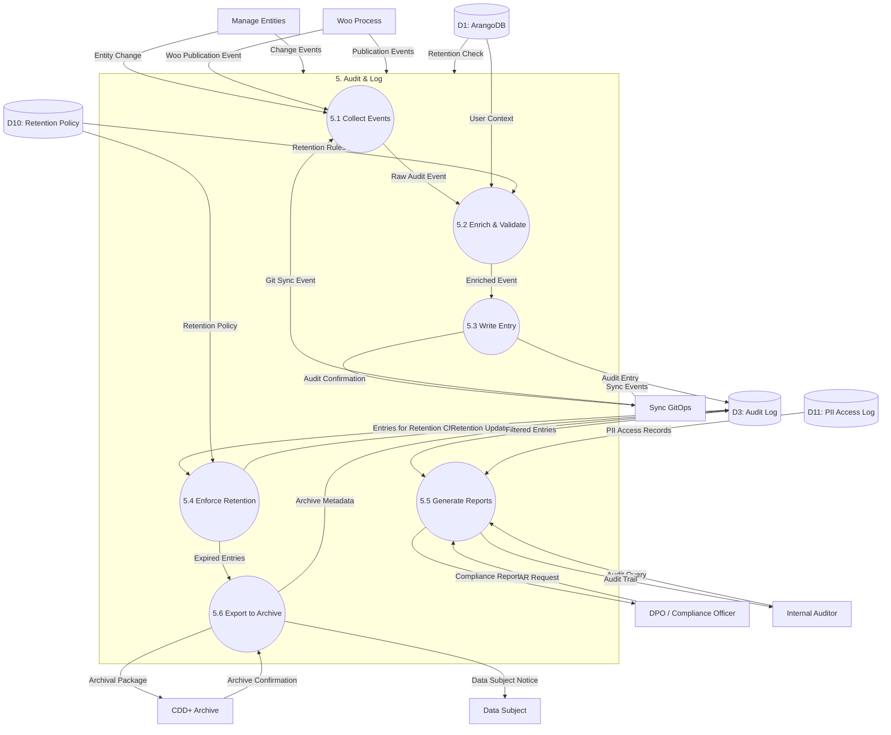
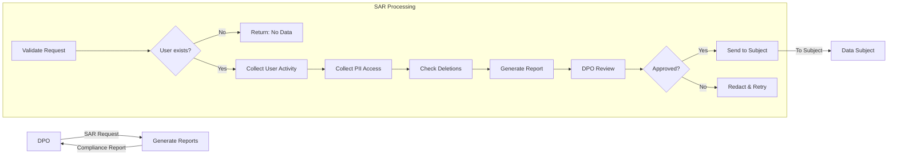

# Data Flow Diagram: Level 2 - Audit & Log Process

> **Template Origin**: Official | **ArcKit Version**: 4.3.1 | **Command**: `/arckit:dfd`

## Document Control

| Field | Value |
|-------|-------|
| **Document ID** | ARC-002-DFD-005-v1.0 |
| **Document Type** | Data Flow Diagram |
| **Project** | Metadata Registry Service (Project 002) |
| **Classification** | OFFICIAL |
| **Status** | DRAFT |
| **Version** | 1.0 |
| **Created Date** | 2026-04-20 |
| **Last Modified** | 2026-04-20 |
| **Review Cycle** | On-Demand |
| **Next Review Date** | 2026-05-20 |
| **Owner** | Enterprise Architect |
| **Reviewed By** | PENDING |
| **Approved By** | PENDING |
| **Distribution** | Project Team, Architecture Team, DPO, Audit Team |

## Revision History

| Version | Date | Author | Changes | Approved By | Approval Date |
|---------|------|--------|---------|-------------|---------------|
| 1.0 | 2026-04-20 | ArcKit AI | Initial creation from `/arckit:dfd` command | PENDING | PENDING |

## Diagram Purpose

This Level 2 Data Flow Diagram decomposes Process 5 (Audit & Log) from the Level 1 DFD. It documents the centralized audit logging system that tracks all system mutations, enforces retention policies, generates compliance reports, and manages archival to CDD+. This process is critical for AVG/GDPR compliance and Archiefwet requirements.

---

## Audit Data Flow Architecture



---

## Level 2 DFD: Audit & Log (Process 5)

### Parent Process Context

This diagram decomposes **Process 5.0 (Audit & Log)** from ARC-002-DFD-001.

### `data-flow-diagram` DSL

```dfd
title Level 2 DFD - Audit & Log Process

process   P5         "5\nAudit &\nLog"

process   P5_1       "5.1\nCollect\nEvents"
process   P5_2       "5.2\nEnrich &\nValidate"
process   P5_3       "5.4\nWrite\nAudit Entry"
process   P5_4       "5.5\nEnforce\nRetention"
process   P5_5       "5.6\nGenerate\nReports"
process   P5_6       "5.7\nExport to\nArchive"

store     D1         "ArangoDB"
store     D3         "Audit Log"
store     D10        "Retention\nPolicy"
store     D11        "PII Access\nLog"

entity    P2         "Manage\nEntities"
entity    P3         "Sync\nGitOps"
entity    P4         "Woo\nProcess"
entity    DPO        "DPO / Compliance\nOfficer"
entity    AUDITOR    "Internal\nAuditor"
entity    CDD        "CDD+\nArchive"
entity    SUBJECT    "Data\nSubject"

%% Input flows to parent process
P2        --> P5    "Change Events"
P3        --> P5    "Sync Events"
P4        --> P5    "Publication Events"
D1        --> P5    "Retention Check"

%% Decomposition: P5 internal flows
P2        --> P5_1  "Entity Change"
P3        --> P5_1  "Git Sync Event"
P4        --> P5_1  "Woo Publication Event"

P5_1      --> P5_2  "Raw Audit Event"

P5_2      --> P5_2  "Validation Error"
P5_2      --> P5_3  "Enriched Event"

D1        --> P5_2  "User Context"
D10       --> P5_2  "Retention Rules"

P5_3      --> P3    "Audit Confirmation"
P5_3      --> D3    "Audit Entry"

D3        --> P5_4  "Entries for\nRetention Check"
D10       --> P5_4  "Retention Policy"

P5_4      --> P5_6  "Expired Entries"
P5_4      --> D3    "Retention Update"

DPO       --> P5_5  "SAR Request"
AUDITOR   --> P5_5  "Audit Query"

D3        --> P5_5  "Filtered Entries"
D11       --> P5_5  "PII Access Records"

P5_5      --> DPO   "Compliance Report"
P5_5      --> AUDITOR "Audit Trail"

P5_6      --> CDD  "Archival Package"
CDD       --> P5_6  "Archive Confirmation"

P5_6      --> SUBJECT "Data Subject\nNotice"
P5_6      --> D3    "Archive Metadata"
```

### Mermaid (Approximate)



---

## Process Specifications

| Process | Name | Inputs | Outputs | Logic Summary |
|---------|------|--------|---------|---------------|
| 5.1 | Collect Events | Entity Change, Git Sync Event, Woo Publication Event | Raw Audit Event | Receives audit events from all system processes. Normalizes event format, assigns correlation ID (request_id), buffers for batch processing. |
| 5.2 | Enrich & Validate | Raw Audit Event, User Context, Retention Rules | Enriched Event, Validation Error | Enriches events with user context (user_id, org_id, roles), IP address, user agent. Validates required fields present. Determines retention period based on data classification. |
| 5.3 | Write Entry | Enriched Event | Audit Entry, Audit Confirmation | Writes audit entry to Audit Log collection. Ensures immutability (append-only). Returns confirmation to caller. Handles write failures with retry logic. |
| 5.4 | Enforce Retention | Entries for Retention Check, Retention Policy | Expired Entries, Retention Update | Periodic job (daily) checks retention expiry. For expired entries: flags for archival, updates metadata, schedules export. Handles different retention periods by data type. |
| 5.5 | Generate Reports | SAR Request, Audit Query, Filtered Entries, PII Access Records | Compliance Report, Audit Trail | Processes Subject Access Requests (SAR) from DPO. Queries audit trail by user, date range, entity type. Generates AVG/GDPR compliance reports showing data access, modifications, deletions. |
| 5.6 | Export to Archive | Expired Entries | Archival Package, Archive Confirmation, Data Subject Notice, Archive Metadata | Exports expired audit entries to CDD+ Archive for long-term preservation (20+ years). Generates archival metadata package. Notifies data subjects if their data is archived. Updates audit log with archive location. |

---

## Data Store Descriptions (Level 2 - Audit)

| Store | Name | Contents | Access | Retention |
|-------|------|----------|--------|-----------|
| D10 | Retention Policy | Retention rules by data type, legal hold flags, archive schedules | Read by P5.2, P5.4 | Updated by DPO |
| D11 | PII Access Log | Separate log of all PII access (who accessed which PII, when, why) | Write by P5.3, Read by P5.5 | 7 years (AVG) |

---

## Audit Entry Structure

### Audit Log Collection Schema

```javascript
{
  "_key": "audit-20240420-001",
  "event_id": "evt_550e8400-e29b-41d4-a716-446655440000",

  // Event details
  "action": "create",  // create, update, delete, read, export, sync
  "entity_type": "gebeurtenis",
  "entity_id": "evt-001",
  "entity_summary": {
    "naam": "Burger aanvraag uitkering",
    "gebeurtenistype": "aanvraag"
  },

  // Changes (for mutations)
  "changes": {
    "naam": ["", "Burger aanvraag uitkering"],
    "gebeurtenistype": ["", "aanvraag"],
    "geldig_vanaf": [null, "2024-01-01T00:00:00Z"]
  },

  // Actor
  "user_id": "user-456",
  "user_name": "Jan de Vries",
  "user_email": "j.devries@minjus.nl",
  "user_roles": ["steward", "editor"],
  "organisation_id": "org-123",

  // Request context
  "request_id": "req_550e8400-e29b-41d4-a716-446655440000",
  "correlation_id": "corr_abc123",
  "ip_address": "192.168.1.100",
  "user_agent": "Mozilla/5.0...",

  // Timing
  "timestamp": "2024-04-20T10:00:00Z",
  "duration_ms": 45,

  // Classification & Retention
  "data_classification": "OFFICIAL",
  "contains_pii": false,
  "retention_period_days": 2555,  // 7 years
  "retention_expiry": "2031-04-20T10:00:00Z",
  "archived": false,
  "archive_location": null,

  // Compliance
  "legal_basis": "legal_obligation",  // AVG Art 6(1)(c)
  "purpose": "metadata_management",
  "consent_id": null,

  // Audit metadata
  "created_at": "2024-04-20T10:00:00Z",
  "created_by": "system",
  "geldig_vanaf": "2024-04-20T10:00:00Z",
  "geldig_tot": "9999-12-31T23:59:59Z"
}
```

---

## Data Dictionary (Level 2 - Audit)

| Data Flow | Composition | Source | Destination | Format |
|-----------|-------------|--------|-------------|--------|
| Entity Change | {action, entity_type, entity_id, changes, user_context} | P2 | P5.1 | JSON |
| Git Sync Event | {action: sync, commit_hash, files_changed, sync_result} | P3 | P5.1 | JSON |
| Woo Publication Event | {action: publish, woo_publicatie_id, status, officer_id} | P4 | P5.1 | JSON |
| Raw Audit Event | {event_type, data, timestamp} | P5.1 | P5.2 | JSON |
| User Context | {user_id, name, email, roles, org_id} | D1 | P5.2 | JSON |
| Retention Rules | {entity_type, retention_days, archive_after} | D10 | P5.2 | JSON |
| Enriched Event | {all audit fields, classification, retention_expiry} | P5.2 | P5.3 | JSON |
| Validation Error | {field, error_code, message} | P5.2 | P5.2 | JSON |
| Audit Entry | {complete audit record} | P5.3 | D3 | JSON |
| Audit Confirmation | {audit_id, timestamp, status} | P5.3 | P2, P3, P4 | JSON |
| SAR Request | {subject_user_id, date_range, requested_by, purpose} | DPO | P5.5 | Form |
| Audit Query | {filters: {user_id, entity_type, date_range}, requester} | Auditor | P5.5 | JSON |
| Filtered Entries | {audit_entries: [], total_count, page_info} | D3 | P5.5 | JSON |
| PII Access Records | {access_log_entries: [], pii_summary} | D11 | P5.5 | JSON |
| Compliance Report | {subject_activity, data_accesses, deletions, retention_status} | P5.5 | DPO | PDF/JSON |
| Audit Trail | {query_results, summary, anomalies} | P5.5 | Auditor | PDF/JSON |
| Expired Entries | {audit_ids, expiry_date, archive_eligible} | P5.4 | P5.6 | JSON |
| Archival Package | {audit_data, metadata, package_id, checksum} | P5.6 | CDD | JSON/TAR |
| Archive Confirmation | {package_id, archived_at, location, retention_date} | CDD | P5.6 | JSON |
| Data Subject Notice | {data_archived: bool, retention_years, rights} | P5.6 | Subject | Email |

---

## Retention Policy Matrix

| Entity Type | Base Retention | Extension | Total | Archive After | Legal Basis |
|-------------|----------------|-----------|-------|---------------|-------------|
| gebeurtenis | 7 years | +0 | 7 years | 5 years | Archiefwet |
| informatieobject | 20 years | +0 | 20 years | 10 years | Archiefwet |
| woo_publicatie | 20 years | +0 | 20 years | 10 years | Woo + Archiefwet |
| audit_entry | 7 years | +0 | 7 years | 5 years | AVG Art 30(1)(d) |
| pii_access_log | 7 years | +0 | 7 years | 5 years | AVG Art 30 |
| user_profile | 7 years | - | 7 years | Never | AVG Art 5(1)(e) |
| security_event | 7 years | +13 | 20 years | 5 years | Security guidelines |

---

## Decision Rules (Audit)

### 5.2 Validation Rules

| Rule | Condition | Action |
|------|-----------|--------|
| AUD-V-001 | Missing user_id | Reject, require authentication |
| AUD-V-002 | Missing entity_id for mutation | Reject, invalid event |
| AUD-V-003 | Future timestamp | Reject, invalid time |
| AUD-V-004 | Contains_pii=true, missing legal_basis | Reject, AVG violation |
| AUD-V-005 | action=delete on archived entity | Reject, immutable |

### 5.4 Retention Rules

| Rule | Condition | Action |
|------|-----------|--------|
| AUD-R-001 | current_date >= retention_expiry | Flag for archival |
| AUD-R-002 | legal_hold=true | Skip archival |
| AUD-R-003 | contains_pii=true | DPO notification before archive |
| AUD-R-004 | retention_period_days < 365 | Warn: short retention |
| AUD-R-005 | entity marked do_not_archive | Skip archival |

### 5.5 Access Control Rules

| Rule | Condition | Action |
|------|-----------|--------|
| AUD-A-001 | requester=DPO, sar for own org | Allow |
| AUD-A-002 | requester=Auditor, valid audit scope | Allow |
| AUD-A-003 | requester=Data Subject, own user_id | Allow (limited fields) |
| AUD-A-004 | requester=Developer | Deny (use PII Access Log instead) |
| AUD-A-005 | query includes PII, no DPO approval | Deny |

---

## SAR (Subject Access Request) Process



---

## Performance Targets

| Stage | Target | Measurement |
|-------|--------|-------------|
| 5.1 Collect Events | <5ms (p95) | Event buffering time |
| 5.2 Enrich & Validate | <20ms (p95) | Enrichment processing |
| 5.3 Write Entry | <50ms (p95) | Database write time |
| 5.4 Enforce Retention | <30s per 10K entries | Batch processing |
| 5.5 Generate Reports | <5s (p95) | Report query time |
| 5.6 Export to Archive | <5min per 1000 entries | Package creation |

---

## Security Considerations

| Aspect | Threat | Mitigation |
|--------|--------|------------|
| Tampering | Audit entry modification | Append-only collection, immutability checks |
| Data leakage | Unauthorized audit access | RBAC, DPO approval required |
| Loss | Database failure | Replication, backup before purge |
| Privacy | PII in audit logs | Separate PII Access Log, redaction |
| Integrity | Fake audit entries | HMAC signatures, non-repudiation |

---

## Visualization Instructions

**For `data-flow-diagram` DSL (true Yourdon-DeMarco notation):**
```bash
pip install data-flow-diagram
dfd < input.dfd > output.svg
```

**For Mermaid approximation:**
- **GitHub**: Renders automatically in markdown
- **https://mermaid.live**: Online editor (paste code, view rendered)
- **VS Code**: Install "Mermaid Preview" extension

---

## DFD Validation Summary

| Metric | Count |
|--------|-------|
| Sub-Processes | 6 |
| Data Stores | 2 (new) |
| External Entities | 7 |
| Data Flows | 35+ |

---

## Linked Artifacts

| Artifact | Type | Link |
|----------|------|------|
| ARC-002-DFD-001-v1.0.md | Level 0/1 DFD | `projects/002-metadata-registry/diagrams/ARC-002-DFD-001-v1.0.md` |
| ARC-002-REQ-v1.1.md | Requirements (BR-MREG-005, BR-MREG-011) | `projects/002-metadata-registry/ARC-002-REQ-v1.1.md` |
| ARC-002-SEC-v1.0.md | Security Design | `projects/002-metadata-registry/design/ARC-002-SEC-v1.0.md` |

---

## Generation Metadata

**Generated by**: ArcKit `/arckit:dfd` command
**Generated on**: 2026-04-20 00:00:00 GMT
**ArcKit Version**: 4.3.1
**Project**: Metadata Registry Service (Project 002)
**AI Model**: claude-opus-4-7
**DFD Level**: Level 2 - Audit & Log Process Decomposition
