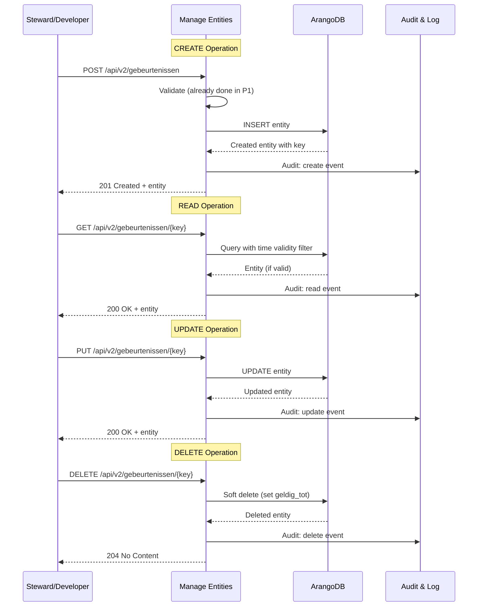
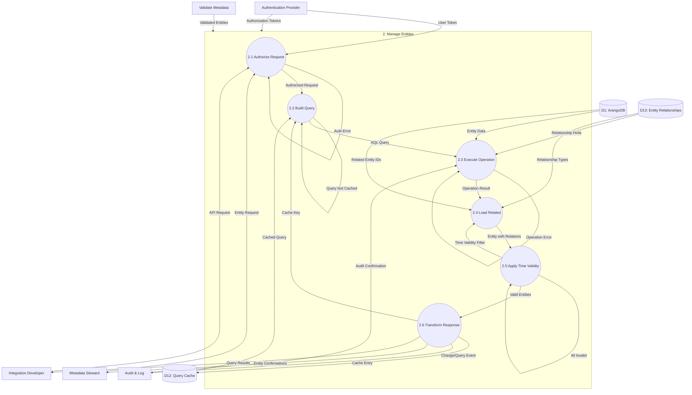
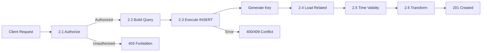
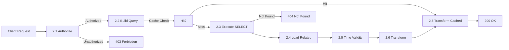
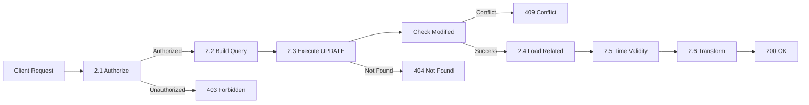
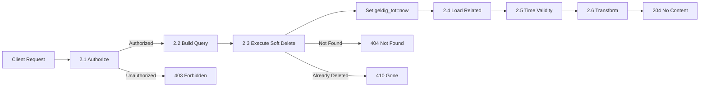

# Data Flow Diagram: Level 2 - Manage Entities Process

> **Template Origin**: Official | **ArcKit Version**: 4.3.1 | **Command**: `/arckit:dfd`

## Document Control

| Field | Value |
|-------|-------|
| **Document ID** | ARC-002-DFD-006-v1.0 |
| **Document Type** | Data Flow Diagram |
| **Project** | Metadata Registry Service (Project 002) |
| **Classification** | OFFICIAL |
| **Status** | DRAFT |
| **Version** | 1.0 |
| **Created Date** | 2026-04-20 |
| **Last Modified** | 2026-04-20 |
| **Review Cycle** | On-Demand |
| **Next Review Date** | 2026-05-20 |
| **Owner** | Enterprise Architect |
| **Reviewed By** | PENDING |
| **Approved By** | PENDING |
| **Distribution** | Project Team, Architecture Team |

## Revision History

| Version | Date | Author | Changes | Approved By | Approval Date |
|---------|------|--------|---------|-------------|---------------|
| 1.0 | 2026-04-20 | ArcKit AI | Initial creation from `/arckit:dfd` command | PENDING | PENDING |

## Diagram Purpose

This Level 2 Data Flow Diagram decomposes Process 2 (Manage Entities) from the Level 1 DFD. It documents the core CRUD operations that create, read, update, and delete metadata entities in ArangoDB. This process handles all database interactions, time-based validity filtering, organization isolation, and referential integrity.

---

## CRUD Operations Architecture



---

## Level 2 DFD: Manage Entities (Process 2)

### Parent Process Context

This diagram decomposes **Process 2.0 (Manage Entities)** from ARC-002-DFD-001.

### `data-flow-diagram` DSL

```dfd
title Level 2 DFD - Manage Entities Process

process   P2         "2\nManage\nEntities"

process   P2_1       "2.1\nAuthorize\nRequest"
process   P2_2       "2.2\nBuild\nQuery"
process   P2_3       "2.3\nExecute\nOperation"
process   P2_4       "2.4\nLoad Related\nEntities"
process   P2_5       "2.5\nApply Time\nValidity"
process   P2_6       "2.6\nTransform\nResponse"

store     D1         "ArangoDB"
store     D12        "Query Cache"
store     D13        "Entity\nRelationships"

entity    AUTH       "Authentication\nProvider"
entity    P1         "Validate\nMetadata"
entity    P5         "Audit &\nLog"
entity    STEWARD    "Metadata\nSteward"
entity    DEV        "Integration\nDeveloper"

%% Input flows to parent process
P1        --> P2    "Validated Entities"
AUTH      --> P2    "Authorization Tokens"

%% Decomposition: P2 internal flows
STEWARD   --> P2_1  "Entity Request"
DEV       --> P2_1  "API Request"

AUTH      --> P2_1  "User Token"

P2_1      --> P2_1  "Auth Error"
P2_1      --> P2_2  "Authorized Request"

D12       --> P2_2  "Cached Query"
P2_6      --> P2_2  "Cache Key"

P2_2      --> P2_2  "Query Not Cached"
P2_2      --> P2_3  "AQL Query"

D1        --> P2_3  "Entity Data"
D13       --> P2_3  "Relationship Hints"

P2_3      --> P2_3  "Operation Error"
P2_3      --> P2_4  "Operation Result"

D1        --> P2_4  "Related Entity IDs"
D13       --> P2_4  "Relationship Types"

P2_4      --> P2_5  "Entity with\nRelations"
P2_5      --> P2_4  "Time Validity\nFilter"

P2_5      --> P2_5  "All Invalid"
P2_5      --> P2_6  "Valid Entities"

P2_6      --> D12   "Cache Entry"
P2_6      --> P5    "Change Event"
P2_6      --> P5    "Query Event"

P2_6      --> STEWARD "Entity Confirmations"
P2_6      --> DEV    "Query Results"

P5        --> P2_3  "Audit Confirmation"
```

### Mermaid (Approximate)



---

## CRUD Operation Types

### Create (POST)



### Read (GET)



### Update (PUT)



### Delete (DELETE)



---

## Process Specifications

| Process | Name | Inputs | Outputs | Logic Summary |
|---------|------|--------|---------|---------------|
| 2.1 | Authorize Request | User Token, Entity Request | Authorized Request, Auth Error | Validates JWT token, extracts user claims (user_id, org_id, roles). Checks RBAC: user has required role for operation on target organization. Enforces row-level security (RLS). |
| 2.2 | Build Query | Authorized Request, Cached Query, Cache Key | AQL Query, Query Not Cached | Constructs ArangoDB query (AQL) for operation. Applies filters: organization_id, time validity, pagination. Checks query cache for GET requests. Returns cached result if available. |
| 2.3 | Execute Operation | AQL Query, Entity Data, Relationship Hints, Audit Confirmation | Operation Result, Operation Error | Executes CRUD operation against ArangoDB. Handles constraints, duplicates, conflicts. For creates, generates new key. For updates, checks concurrent modification. Receives audit confirmation. |
| 2.4 | Load Related Entities | Operation Result, Related Entity IDs, Relationship Types | Entity with Relations | Loads related entities via edge collections. Resolves graph relationships (1-3 hops depth). Applies RLS filtering to related entities. Handles missing or deleted relations gracefully. |
| 2.5 | Apply Time Validity | Entity with Relations, Time Validity Filter | Valid Entities, All Invalid | Filters entities by time validity: `geldig_vanaf <= now < geldig_tot`. For queries, excludes invalid entities. For mutations, validates time ranges don't conflict. |
| 2.6 | Transform Response | Valid Entities, Operation Result | Entity Confirmations, Query Results, Cache Entry, Change/Query Event | Transforms database entities to API response format. Removes internal fields. Adds computed fields (e.g., valid_today). Populates cache for GET queries. Sends audit event for mutations. |

---

## Data Store Descriptions (Level 2 - Entities)

| Store | Name | Contents | Access | Retention |
|-------|------|----------|--------|-----------|
| D12 | Query Cache | Cached query results keyed by hash of (query + user_org) | Read/Write by P2.2, P2.6 | TTL 5 minutes |
| D13 | Entity Relationships | Edge collection metadata, relationship cardinalities, traversal hints | Read by P2.3, P2.4 | Updated by schema changes |

---

## Query Examples

### Create Entity

```aql
// INSERT with generated key
INSERT {
  naam: @naam,
  omschrijving: @omschrijving,
  gebeurtenistype: @gebeurtenistype,
  geldig_vanaf: @geldig_vanaf,
  geldig_tot: @geldig_tot,
  organisatie_id: @org_id,
  aangemaakt_door: @user_id,
  aangemaakt_op: DATE_NOW(),
  gewijzigd_door: null,
  gewijzigd_op: null
} INTO gebeurtenis
RETURN NEW
```

### Read with Time Validity

```aql
// SELECT with time validity filter
FOR doc IN gebeurtenis
  FILTER doc.organisatie_id == @org_id
  FILTER doc._key == @key
  FILTER doc.geldig_vanaf <= @now
  FILTER doc.geldig_tot > @now
  RETURN doc
```

### Read with Graph Traversal

```aql
// SELECT entity with related entities (2 hops)
WITH gebeurtenis, gegevensproduct, elementaire_set
FOR v, e, p IN 1..2 OUTBOUND @start_id
  GRAPH 'gghm_v2'
  FILTER p.vertices[1].organisatie_id == @org_id
  FILTER p.vertices[*].geldig_vanaf ALL <= @now
  FILTER p.vertices[*].geldig_tot ALL > @now
  RETURN {
    entity: v,
    edge: e,
    path: p,
    depth: LENGTH(p.edges)
  }
```

### Update (Optimistic Locking)

```aql
// UPDATE with version check
UPDATE doc WITH {
  naam: @naam,
  gewijzigd_door: @user_id,
  gewijzigd_op: DATE_NOW()
} IN gebeurtenis
FILTER doc._key == @key
FILTER doc.gewijzigd_op == @expected_version  // Optimistic lock
RETURN NEW
```

### Delete (Soft Delete)

```aql
// Soft delete by setting geldig_tot
UPDATE doc WITH {
  geldig_tot: DATE_NOW(),  // "Delete" by ending validity
  gewijzigd_door: @user_id,
  gewijzigd_op: DATE_NOW()
} IN gebeurtenis
FILTER doc._key == @key
RETURN NEW
```

---

## Data Dictionary (Level 2 - Entities)

| Data Flow | Composition | Source | Destination | Format |
|-----------|-------------|--------|-------------|--------|
| User Token | {access_token, refresh_token, expires} | Steward, Developer, Auth | P2.1 | JWT |
| Authorized Request | {operation, entity_type, key, data, user_id, org_id, roles} | P2.1 | P2.2 | Internal |
| Cache Key | {hash(operation, filters, org_id)} | P2.2 | P2.2, P2.6 | String |
| Cached Query | {result, cached_at, ttl} | D12 | P2.2 | JSON |
| AQL Query | {query_text, bind_vars} | P2.2 | P2.3 | AQL |
| Entity Data | {entity_type, attributes, relationships} | D1 | P2.3 | JSON |
| Relationship Hints | {edge_collections, depth, direction} | D13 | P2.3 | JSON |
| Operation Result | {created_key, updated_entity, deleted_count} | P2.3 | P2.4 | JSON |
| Operation Error | {code, message, details} | P2.3 | P2.3, P2.6 | JSON |
| Related Entity IDs | {_from, _to, edge_type} | D1, D13 | P2.4 | JSON |
| Entity with Relations | {entity, relations: [], depth} | P2.4 | P2.5 | JSON |
| Time Validity Filter | {now_timestamp, include_expired} | P2.5 | P2.5 | Internal |
| Valid Entities | {entities: [], total_count} | P2.5 | P2.6 | JSON |
| Entity Confirmations | {status: created/updated/deleted, key, revision} | P2.6 | Steward | JSON |
| Query Results | {data: [], pagination, total} | P2.6 | Developer | JSON |
| Change Event | {action, entity_type, entity_id, changes, user_id} | P2.6 | P5 | JSON |
| Query Event | {action: read, entity_type, filters, user_id} | P2.6 | P5 | JSON |

---

## Authorization Matrix

| Operation | viewer | editor | admin | system_admin |
|-----------|--------|--------|-------|--------------|
| CREATE | ❌ | ❌ | ✅ | ✅ |
| READ (own org) | ✅ | ✅ | ✅ | ✅ |
| READ (other org) | ❌ | ❌ | ✅ | ✅ |
| UPDATE (own org) | ❌ | ✅ | ✅ | ✅ |
| UPDATE (other org) | ❌ | ❌ | ❌ | ✅ |
| DELETE (own org) | ❌ | ❌ | ✅ | ✅ |
| DELETE (other org) | ❌ | ❌ | ❌ | ✅ |
| AUDIT LOG | ❌ | ❌ | ✅ (own) | ✅ |

---

## Error Handling

| Error Code | Name | HTTP Status | Description |
|------------|------|-------------|-------------|
| ENT-001 | Entity Not Found | 404 | Entity doesn't exist or not in organization |
| ENT-002 | Duplicate Key | 409 | Entity key already exists |
| ENT-003 | Concurrent Modification | 409 | Entity modified by another user |
| ENT-004 | Invalid Time Range | 400 | geldig_tot <= geldig_vanaf |
| ENT-005 | Referential Integrity | 400 | Related entity doesn't exist |
| ENT-006 | Unauthorized | 403 | User lacks required role |
| ENT-007 | Invalid Operation | 400 | Operation not allowed for entity state |
| ENT-008 | Query Too Complex | 400 | Graph depth > 5 or result size > 10000 |

---

## Performance Targets

| Operation | Target | Measurement |
|-----------|--------|-------------|
| CREATE | <100ms (p95) | INSERT time excluding validation |
| READ (single) | <50ms (p95) | SELECT by key with time filter |
| READ (list) | <200ms (p95) | SELECT with pagination, limit 100 |
| READ (graph, 2 hops) | <500ms (p95) | Graph traversal with validity filter |
| UPDATE | <100ms (p95) | UPDATE with optimistic lock check |
| DELETE | <100ms (p95) | Soft delete (update geldig_tot) |
| Cache Hit | <10ms (p95) | Return cached query result |

---

## DFD Validation

### Yourdon-DeMarco Rules Checklist

| Rule | Status | Notes |
|------|--------|-------|
| Every process has at least one input AND one output | ✅ PASS | All sub-processes have inputs/outputs |
| No process has only inputs (black hole) | ✅ PASS | All processes produce output |
| No process has only outputs (miracle) | ✅ PASS | All processes consume data |
| Data stores have at least one read and one write flow | ✅ PASS | D12, D13 have read/write |
| Data flows are named | ✅ PASS | All arrows have labels |
| External entities only connect to processes | ✅ PASS | No entity-to-store connections |
| Process numbering is consistent | ✅ PASS | Parent: 2, Children: 2.1-2.6 |
| Level 2 decomposes from Level 1 | ✅ PASS | All inputs/outputs balanced |

---

## Security Considerations

| Aspect | Threat | Mitigation |
|--------|--------|------------|
| Unauthorized access | No token presented | Reject with 401 |
| Privilege escalation | Viewer tries UPDATE | RBAC enforcement in P2.1 |
| Data leakage | Cross-org query | RLS filter in P2.2 |
| Injection | Malicious AQL | Parameterized queries only |
| DoS | Deep graph traversal | Max depth enforcement (5 hops) |
| Replay attack | Stale token | JWT expiry < 1 hour |

---

## Visualization Instructions

**For `data-flow-diagram` DSL (true Yourdon-DeMarco notation):**
```bash
pip install data-flow-diagram
dfd < input.dfd > output.svg
```

**For Mermaid approximation:**
- **GitHub**: Renders automatically in markdown
- **https://mermaid.live**: Online editor (paste code, view rendered)
- **VS Code**: Install "Mermaid Preview" extension

---

## DFD Summary

| Metric | Count |
|--------|-------|
| Sub-Processes | 6 |
| Data Stores | 2 (new) |
| External Entities | 5 |
| Data Flows | 30+ |
| CRUD Operations | 4 (Create, Read, Update, Delete) |

---

## Linked Artifacts

| Artifact | Type | Link |
|----------|------|------|
| ARC-002-DFD-001-v1.0.md | Level 0/1 DFD | `projects/002-metadata-registry/diagrams/ARC-002-DFD-001-v1.0.md` |
| ARC-002-DLD-v1.0.md | Detailed Design | `projects/002-metadata-registry/design/ARC-002-DLD-v1.0.md` |
| ARC-002-DB-v1.0.md | Database Design | `projects/002-metadata-registry/design/ARC-002-DB-v1.0.md` |
| ARC-002-API-v1.0.md | API Specification | `projects/002-metadata-registry/design/ARC-002-API-v1.0.md` |

---

## Generation Metadata

**Generated by**: ArcKit `/arckit:dfd` command
**Generated on**: 2026-04-20 00:00:00 GMT
**ArcKit Version**: 4.3.1
**Project**: Metadata Registry Service (Project 002)
**AI Model**: claude-opus-4-7
**DFD Level**: Level 2 - Manage Entities Process Decomposition
