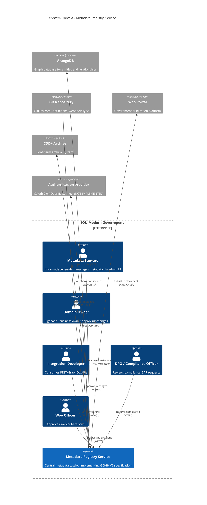

# Architecture Diagram: System Context - Metadata Registry Service

> **Template Origin**: Official | **ArcKit Version**: 4.3.1 | **Command**: `/arckit:diagram`

## Document Control

| Field | Value |
|-------|-------|
| **Document ID** | ARC-002-DIAG-001-v1.0 |
| **Document Type** | Architecture Diagram |
| **Project** | Metadata Registry Service (Project 002) |
| **Classification** | OFFICIAL |
| **Status** | IN_REVIEW |
| **Version** | 1.0 |
| **Created Date** | 2026-04-19 |
| **Last Modified** | 2026-04-19 |
| **Review Cycle** | On-Demand |
| **Next Review Date** | 2026-05-19 |
| **Owner** | Enterprise Architect |
| **Reviewed By** | ArcKit AI on 2026-04-19 |
| **Approved By** | PENDING |
| **Distribution** | Project Team, Architecture Team, DPO, Woo Officers |

## Revision History

| Version | Date | Author | Changes | Approved By | Approval Date |
|---------|------|--------|---------|-------------|---------------|
| 1.0 | 2026-04-19 | ArcKit AI | Initial creation from `/arckit:diagram` command | PENDING | PENDING |

## Diagram Purpose

This C4 Level 1 System Context diagram shows the Metadata Registry Service in its context with users and external systems. It serves as the foundation architecture visualization for stakeholder communication and requirements traceability.

---

## System Context Diagram



---

## Component Inventory

| ID | Component | Type | Technology | Responsibilities |
|----|-----------|------|------------|------------------|
| A1 | Metadata Steward | Person | Browser | Manages metadata entities, approves changes within organization |
| A2 | Domain Owner | Person | Browser | Approves Woo publications, domain-level decisions |
| A3 | Integration Developer | Person | API Client | Integrates via REST/GraphQL, builds downstream services |
| A4 | DPO / Compliance Officer | Person | Browser | Reviews AVG compliance, processes SAR requests |
| A5 | Woo Officer | Person | Browser | Approves Woo publication requests, tracks refusal grounds |
| S1 | Metadata Registry Service | System | Rust, actix-web | Central metadata catalog, GGHH V2 implementation |
| E1 | ArangoDB | System_Ext | ArangoDB 3.11.5 | Graph storage, 29 edge collections, AQL queries |
| E2 | Git Repository | System_Ext | Git, git2 | YAML definitions, webhook triggers, version control |
| E3 | Woo Portal | System_Ext | REST API | Government publication platform, Woo compliance |
| E4 | CDD+ Archive | System_Ext | REST API | Long-term archival, Archiefwet compliance |
| E5 | Authentication Provider | System_Ext | OAuth 2.0/OIDC | User authentication, MFA, token management (NOT IMPLEMENTED) |

---

## Architecture Decisions

### AD-001: ArangoDB as Primary Storage

**Decision**: Use ArangoDB as the primary graph database for storing all GGHH V2 entities.

**Rationale**:
- Native graph database with 29 edge collections for complex relationships
- Multi-model: graph, document, and key-value in one database
- Open-source (sovereign technology compliance)
- Efficient graph traversals for context-aware search
- JSON document storage for flexible entity schemas

**Trade-offs**:
- **Pro**: Graph-native design simplifies relationship queries
- **Pro**: Single database for entities and edges (no joins)
- **Con**: Team may lack graph database expertise
- **Con**: ArangoDB operations more complex than relational databases

**Alternatives Considered**:
- PostgreSQL (relational) - rejected: requires multiple tables for edges, complex joins
- Neo4j - rejected: less mature document storage, commercial licensing concerns

**Evolution Stage**: [Commodity 0.92] - USE self-hosted option

---

### AD-002: GitOps for Metadata Synchronization

**Decision**: Use GitOps pattern for metadata synchronization via YAML files in Git repository.

**Rationale**:
- Version control for all metadata changes
- Audit trail via Git commit history
- Collaboration via pull requests
- Rollback capability via Git revert
- Aligns with BR-MREG-007 requirement

**Trade-offs**:
- **Pro**: Transparent change history
- **Pro**: Peer review before merging
- **Con**: Requires Git access for all metadata stewards
- **Con**: Merge conflicts require manual resolution

**Evolution Stage**: [Product 0.75] - USE existing Git infrastructure

---

### AD-003: REST + GraphQL APIs

**Decision**: Expose both REST (v1, v2) and GraphQL APIs for metadata access.

**Rationale**:
- REST for standard CRUD operations (v1, v2)
- GraphQL for flexible queries and graph traversals
- Aligns with BR-MREG-010 requirement
- Supports different integration patterns

**Trade-offs**:
- **Pro**: REST is simple and widely understood
- **Pro**: GraphQL enables efficient nested queries
- **Con**: Two API paradigms to maintain
- **Con**: GraphQL requires careful query complexity limiting

**Evolution Stage**: [Custom 0.42] - BUILD custom implementation

---

### AD-004: Dioxus for Admin UI

**Decision**: Use Dioxus (Rust + WebAssembly) for the admin UI.

**Rationale**:
- Sovereign technology (100% open-source)
- Type-safe Rust code sharing with backend
- WebAssembly for near-native performance
- WCAG 2.1 AA compliance achievable

**Trade-offs**:
- **Pro**: Single language (Rust) for full stack
- **Pro**: No JavaScript build toolchain complexity
- **Con**: Dioxus ecosystem smaller than React
- **Con**: WebAssembly debugging less mature

**Evolution Stage**: [Genesis 0.25] - BUILD sovereign tech

---

## Requirements Traceability

### Business Requirements Coverage

| BR ID | Requirement | Component | Status |
|-------|-------------|-----------|--------|
| BR-MREG-001 | GGHH V2 entities | S1 | ✅ Covered |
| BR-MREG-002 | Time-based validity | S1, E1 | ✅ Covered |
| BR-MREG-003 | Graph relationships | S1, E1 | ✅ Covered |
| BR-MREG-004 | Multi-tenancy | S1, E5 | ⚠️ Partial - Auth not implemented |
| BR-MREG-005 | Audit trail | S1 | ✅ Covered |
| BR-MREG-006 | TOOI/MDTO validation | S1 | ✅ Covered |
| BR-MREG-007 | GitOps sync | S1, E2 | ✅ Covered |
| BR-MREG-008 | CDD+ integration | S1, E4 | ⚠️ Partial - Stubbed |
| BR-MREG-009 | Woo publication | S1, E3, A5 | ✅ Covered |
| BR-MREG-010 | REST/GraphQL APIs | S1, A3 | ✅ Covered |
| BR-MREG-011 | AVG privacy classification | S1, A4 | ✅ Covered |
| BR-MREG-015 | Subject Access Rights | S1, A4 | ⚠️ Partial - SAR endpoint stubbed |
| BR-MREG-016 | Row-Level Security | S1, E5 | ❌ Not Implemented |

### Integration Requirements Coverage

| INT ID | Integration | Component | Status |
|-------|-------------|-----------|--------|
| INT-MREG-1 | ArangoDB storage | S1 ↔ E1 | ✅ Implemented |
| INT-MREG-2 | GitOps sync | S1 ↔ E2 | ✅ Implemented |
| INT-MREG-3 | Woo portal | S1 ↔ E3 | ⚠️ Stubbed |
| INT-MREG-4 | CDD+ archive | S1 ↔ E4 | ⚠️ Stubbed |
| INT-MREG-5 | Authentication | S1 ↔ E5 | ❌ Not Implemented |

### Coverage Summary

| Category | Total | Covered | Partial | Not Covered | % Complete |
|----------|-------|---------|---------|-------------|------------|
| Business Requirements | 16 | 9 | 5 | 2 | 56% |
| Integration Requirements | 5 | 2 | 2 | 1 | 40% |
| **Overall** | **21** | **11** | **7** | **3** | **52%** |

---

## Integration Points

### External Systems and APIs

| System | Protocol | Authentication | Data Format | SLA | Dependencies |
|--------|----------|----------------|-------------|-----|--------------|
| ArangoDB | HTTP | Basic auth | JSON | <10ms read, <100ms traversal | Connection pooling |
| Git Repository | Git protocol | SSH/Token | YAML | Sync within 1 min | Webhook receiver |
| Woo Portal | REST | OAuth 2.0 | JSON | Publication <5s | Approval workflow |
| CDD+ Archive | REST | mTLS | JSON | Archival <24h | Retention check |
| Authentication Provider | OAuth 2.0/OIDC | - | JWT | <100ms auth | NOT IMPLEMENTED |

### Data Flows

| Flow | Source | Destination | Data | Trigger | Notes |
|------|--------|--------------|------|---------|-------|
| Entity CRUD | Admin UI | API | JSON entity | User action | Audited |
| Webhook sync | Git | API | YAML files | Git commit | Validated |
| Woo publication | API | Woo Portal | Document metadata | Approval | Human approval |
| Archival | API | CDD+ | Metadata + references | Retention expiry | Batch job |
| Authentication | User | Auth Provider | Credentials | Login | NOT IMPLEMENTED |

---

## Security Architecture

### Security Zones

| Zone | Components | Access Control | Classification |
|------|------------|----------------|----------------|
| Public | None | N/A | N/A |
| Internal | Admin UI | RBAC + MFA | OFFICIAL |
| Private | API | OAuth 2.0/OIDC | OFFICIAL |
| Restricted | Database | Network isolation | OFFICIAL |

### Authentication and Authorization

| Control | Status | Implementation |
|---------|--------|----------------|
| User authentication | ❌ BLOCKING | Not implemented - E5 required |
| Multi-factor auth | ❌ BLOCKING | Required for admin users |
| RBAC | ❌ BLOCKING | Roles: viewer, editor, admin, system_admin |
| Row-Level Security | ❌ BLOCKING | Organization isolation required |
| Session management | ❌ BLOCKING | 8h inactivity, 24h absolute timeout |

### Data Protection

| Control | Status | Implementation |
|---------|--------|----------------|
| TLS 1.3+ | ⚠️ Partial | Docker compose only |
| Encryption at rest | ⚠️ Partial | ArangoDB encryption not configured |
| Secrets management | ⚠️ Partial | Environment variables only |
| PII tokenization | ❌ | Not implemented |

---

## Non-Functional Requirements Coverage

### Performance Targets

| NFR ID | Target | How Achieved | Status |
|--------|--------|--------------|--------|
| NFR-MREG-P-1 | API <200ms (p95) | Actix-web async, ArangoDB indexes | ⚠️ Needs testing |
| NFR-MREG-P-2 | DB <100ms (p95) | Graph optimization, connection pooling | ⚠️ Needs testing |
| NFR-MREG-P-3 | 100 concurrent API users | Stateless API | ✅ Architecture supports |

### Availability and Resilience

| NFR ID | Target | How Achieved | Status |
|--------|--------|--------------|--------|
| NFR-MREG-A-1 | 99.5% uptime | Not addressed | ❌ No HA strategy |
| NFR-MREG-A-2 | RTO <4h, RPO <1h | Not addressed | ❌ No DR strategy |
| NFR-MREG-A-3 | Fault tolerance | Not addressed | ❌ No resilience patterns |

### Scalability

| NFR ID | Target | How Achieved | Status |
|--------|--------|--------------|--------|
| NFR-MREG-S-1 | Horizontal scaling | Stateless API (actix-web) | ✅ Architecture supports |
| NFR-MREG-S-2 | 10M entities | ArangoDB clustering | ⚠️ No scaling strategy |

---

## UK Government Compliance

This system is designed for Dutch Government (IOU-Modern) and follows Netherlands-specific compliance frameworks.

### Compliance Frameworks

| Framework | Status | Notes |
|-----------|--------|-------|
| AVG/GDPR | ⚠️ Partial | PII tracking implemented, SAR incomplete |
| Woo (Wet open overheid) | ✅ Compliant | WooPublicatie workflow complete |
| Archiefwet | ✅ Compliant | Retention periods (Bewaartermijn) implemented |
| Sovereign Technology | ✅ Compliant | 100% open-source stack |

### Data Residency

- **Requirement**: All data stored within EU (Netherlands preferred)
- **Status**: Self-hosted ArangoDB option supports EU deployment
- **Gap**: No cloud region enforcement configured

---

## Wardley Map Integration

Based on the IOU-Modern architecture principles and HLD analysis:

| Component | Evolution | Build/Buy | Rationale |
|-----------|-----------|-----------|-----------|
| Metadata Registry API | [Custom 0.42] | BUILD | Competitive advantage in GGHH V2 implementation |
| ArangoDB | [Commodity 0.92] | USE | Mature open-source graph database |
| GitOps sync | [Product 0.75] | USE | Standard Git tools, no differentiation |
| Dioxus Admin UI | [Genesis 0.25] | BUILD | Sovereign technology, early-stage framework |
| Woo Portal integration | [Custom 0.42] | BUILD | Government-specific publication workflow |
| CDD+ integration | [Product 0.70] | USE | Standard archival API |
| Authentication | [Commodity 0.95] | BUY | OAuth 2.0/OIDC is commodity |

### Strategic Alignment

- **BUILD decisions**: Focus on GGHH V2 implementation, Woo workflow, Dioxus UI
- **BUY decisions**: Authentication provider, standard integrations
- **USE decisions**: ArangoDB (self-hosted), Git tools

---

## Diagram Quality Gate

| # | Criterion | Target | Result | Status |
|---|-----------|--------|--------|--------|
| 1 | Edge crossings | < 5 for complex, 0 for simple | 0 | ✅ PASS |
| 2 | Visual hierarchy | System boundary prominent | ✅ Enterprise boundary used | ✅ PASS |
| 3 | Grouping | Related elements proximate | ✅ Actors grouped, systems external | ✅ PASS |
| 4 | Flow direction | Consistent LR or TB | LR (left-to-right) | ✅ PASS |
| 5 | Relationship traceability | Clear paths, no ambiguity | ✅ All relationships traceable | ✅ PASS |
| 6 | Abstraction level | One C4 level | Level 1 (Context) only | ✅ PASS |
| 7 | Edge label readability | Legible, non-overlapping | ✅ Labels clear | ✅ PASS |
| 8 | Node placement | No long edges, proximate connections | ✅ Adjacent placement | ✅ PASS |
| 9 | Element count | < 10 for Context | 10/10 | ✅ PASS |

**Quality Gate Result**: ✅ **PASS** - All criteria met

---

## Linked Artifacts

| Artifact | Type | Link |
|----------|------|------|
| ARC-002-REQ-v1.1.md | Requirements | `projects/002-metadata-registry/ARC-002-REQ-v1.1.md` |
| ARC-002-HLDR-v1.0.md | HLD Review | `projects/002-metadata-registry/reviews/ARC-002-HLDR-v1.0.md` |
| ARC-000-PRIN-v1.0.md | Architecture Principles | `projects/000-global/ARC-000-PRIN-v1.0.md` |

---

## Visualization Instructions

**View this diagram by pasting the Mermaid code into:**

- **GitHub**: Renders automatically in markdown
- **https://mermaid.live**: Online editor (paste code, view rendered)
- **VS Code**: Install "Mermaid Preview" extension
- **ArcKit Pages**: Run `/arckit:pages` to generate documentation site

---

## Next Steps

1. **Create Container Diagram** - Show technical containers (API, Admin UI, Database)
   ```bash
   /arckit:diagram container
   ```

2. **Create HLD Document** - Document technical architecture
   ```bash
   /arckit:hld-review
   ```

3. **Create Threat Model** - Analyze security threats
   ```bash
   # Security threat modeling recommended
   ```

4. **Create Deployment Diagram** - Show infrastructure topology
   ```bash
   /arckit:diagram deployment
   ```

---

## Generation Metadata

**Generated by**: ArcKit `/arckit:diagram` command
**Generated on**: 2026-04-19 12:00:00 GMT
**ArcKit Version**: 4.3.1
**Project**: Metadata Registry Service (Project 002)
**AI Model**: claude-opus-4-7
**Generation Context**: C4 Level 1 System Context diagram created from requirements (ARC-002-REQ-v1.1.md), HLD review (ARC-002-HLDR-v1.0.md), and implementation analysis of metadata-registry/ directory
