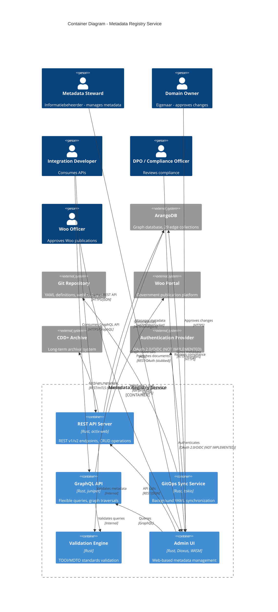
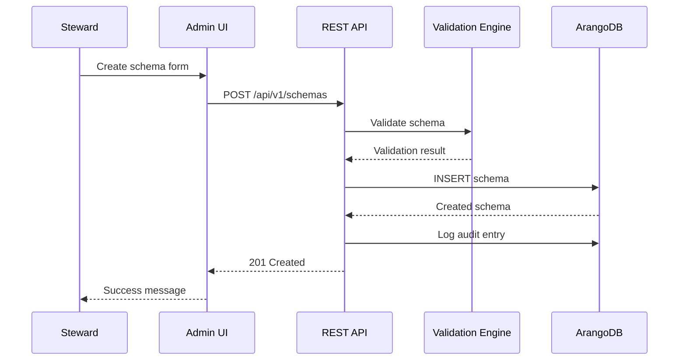
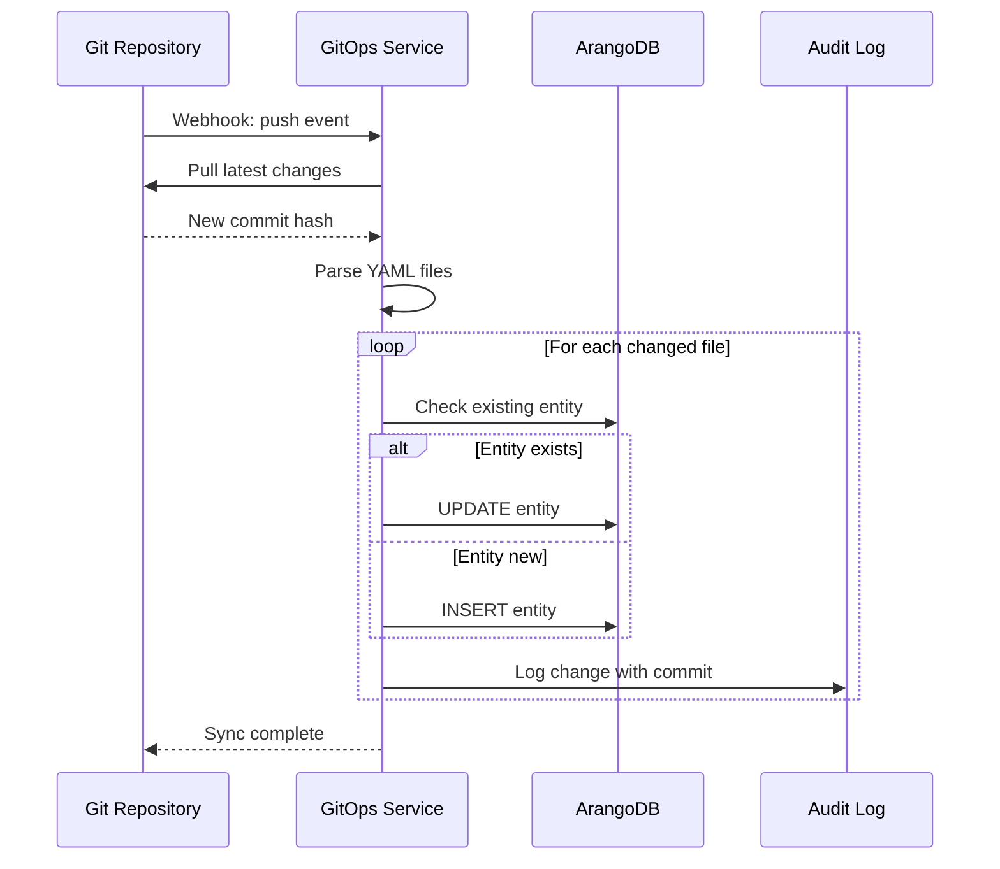
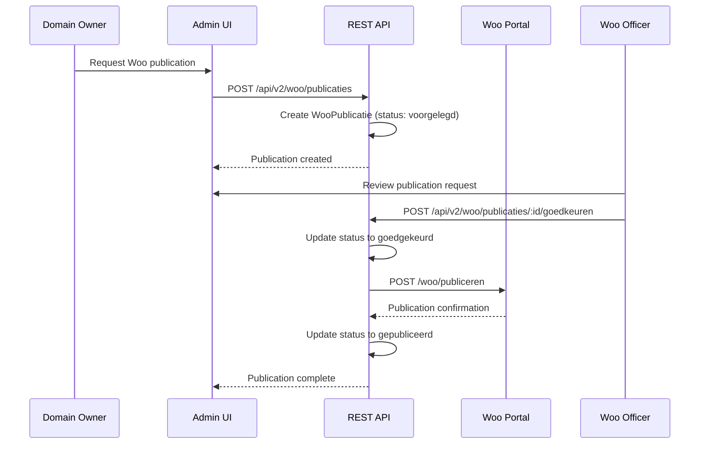

# Architecture Diagram: Container - Metadata Registry Service

> **Template Origin**: Official | **ArcKit Version**: 4.3.1 | **Command**: `/arckit:diagram container`

## Document Control

| Field | Value |
|-------|-------|
| **Document ID** | ARC-002-DIAG-002-v1.0 |
| **Document Type** | Architecture Diagram |
| **Project** | Metadata Registry Service (Project 002) |
| **Classification** | OFFICIAL |
| **Status** | IN_REVIEW |
| **Version** | 1.0 |
| **Created Date** | 2026-04-19 |
| **Last Modified** | 2026-04-19 |
| **Review Cycle** | On-Demand |
| **Next Review Date** | 2026-05-19 |
| **Owner** | Enterprise Architect |
| **Reviewed By** | ArcKit AI on 2026-04-19 |
| **Approved By** | PENDING |
| **Distribution** | Project Team, Architecture Team, DPO, Woo Officers |

## Revision History

| Version | Date | Author | Changes | Approved By | Approval Date |
|---------|------|--------|---------|-------------|---------------|
| 1.0 | 2026-04-19 | ArcKit AI | Initial creation from `/arckit:diagram` command | PENDING | PENDING |

## Diagram Purpose

This C4 Level 2 Container diagram shows the technical architecture of the Metadata Registry Service, including internal containers, their technology choices, and how they communicate. This diagram is used for technical communication, HLD validation, and implementation planning.

---

## Container Diagram



---

## Container Inventory

| ID | Container | Technology | Responsibilities | Evolution |
|----|-----------|------------|------------------|-----------|
| C1 | REST API Server | Rust, actix-web 4.x | REST v1/v2 endpoints, CRUD operations, middleware | [Custom 0.42] |
| C2 | GraphQL API | Rust, juniper 0.15 | Schema auto-generation, graph traversals, flexible queries | [Custom 0.42] |
| C3 | GitOps Sync Service | Rust, tokio 1.x | YAML parsing, Git operations, background sync, audit logging | [Custom 0.35] |
| C4 | Validation Engine | Rust | TOOI validation, MDTO validation, constraint checking | [Custom 0.42] |
| C5 | Admin UI | Rust, Dioxus 0.5, WASM | Schema management, approval queue, audit log, dashboard | [Genesis 0.25] |
| E1 | ArangoDB | ArangoDB 3.11.5 | Graph storage, edge collections, AQL queries, indexes | [Commodity 0.92] |
| E2 | Git Repository | Git, git2/libgit2 | YAML files, version control, webhook notifications | [Product 0.75] |
| E3 | Woo Portal | REST API | Woo publication, approval workflow | [Custom 0.42] |
| E4 | CDD+ Archive | REST API | Long-term archival, retention management | [Product 0.70] |
| E5 | Authentication Provider | OAuth 2.0/OIDC | User authentication, MFA, token issuance | [Commodity 0.95] |

---

## Technology Stack

### Backend

| Layer | Technology | Version | Purpose |
|-------|-----------|---------|---------|
| **Language** | Rust | 1.70+ | Systems programming, memory safety |
| **Web Framework** | actix-web | 4.x | HTTP server, async I/O |
| **GraphQL** | juniper | 0.15 | GraphQL schema and execution |
| **Async Runtime** | tokio | 1.x | Async tasks, timer intervals |
| **Database Driver** | arangors | 0.2 | ArangoDB client, connection pooling |
| **Git Client** | git2/libgit2 | - | Git operations, repository management |
| **Serialization** | serde | 1.x | JSON serialization/deserialization |
| **Validation** | custom | - | TOOI/MDTO validation engine |
| **Logging** | tracing | 0.1 | Structured logging, distributed tracing |

### Frontend

| Layer | Technology | Version | Purpose |
|-------|-----------|---------|---------|
| **Framework** | Dioxus | 0.5 | Reactive UI, WebAssembly compilation |
| **Language** | Rust | 1.70+ | Shared code with backend |
| **Routing** | dioxus-router | 0.5 | Client-side routing |
| **Styling** | Tailwind CSS | 2.2 | Utility-first CSS framework |
| **Build Target** | WebAssembly | - | Near-native browser performance |

### Database

| Layer | Technology | Version | Purpose |
|-------|-----------|---------|---------|
| **Database** | ArangoDB | 3.11.5 | Graph + document + key-value |
| **Collections** | 33 total | - | 7 entities + 29 edge collections |
| **Indexes** | Various | - | Time-based validity, organization, full-text |
| **Query Language** | AQL | - | Graph traversals, complex queries |

### Infrastructure

| Layer | Technology | Version | Purpose |
|-------|-----------|---------|---------|
| **Containerization** | Docker | 20.x+ | Development deployment |
| **Orchestration** | docker-compose | 2.x | Local development, 3 containers |
| **Reverse Proxy** | None | - | Not configured (gap) |
| **Load Balancer** | None | - | Not configured (gap) |

---

## Container Details

### C1: REST API Server

**Technology**: Rust, actix-web 4.x

**Responsibilities**:
- REST v1 API (`/api/v1/*`) - Schemas, attributes, value lists
- REST v2 API (`/api/v2/*`) - GGHH V2 entities, Woo workflow
- JWT authentication middleware (stubbed)
- Audit middleware for mutation logging
- Request validation and error handling
- CORS and security headers

**API Endpoints**:
- `/health` - Health check
- `/api/v1/schemas` - Schema CRUD
- `/api/v1/valuelists` - Value list CRUD
- `/api/v1/validate` - Metadata validation
- `/api/v2/gebeurtenissen` - Events (GGHH V2)
- `/api/v2/informatieobjecten` - Information objects (BSW)
- `/api/v2/woo/publicaties` - Woo publications
- `/graphql` - GraphQL endpoint

**Performance**: <200ms (p95) for read operations

**Evolution**: [Custom 0.42] - BUILD for competitive advantage

---

### C2: GraphQL API

**Technology**: Rust, juniper 0.15

**Responsibilities**:
- Auto-generated schema from GGHH V2 entities
- Graph traversal queries (depth 1-5)
- Relationship resolution (edge collections)
- Query complexity limiting
- Type-safe field resolution
- Integration with validation engine

**Schema Coverage**:
- All GGHH V2 entities (7 core entities)
- Phase 1-8 entities (15+ entities)
- Edge collections (29 relationships)
- Time-based validity filtering
- Organization-level filtering (when auth implemented)

**Performance**: <500ms (p95) for graph traversal (3 hops)

**Evolution**: [Custom 0.42] - BUILD for flexible querying

---

### C3: GitOps Sync Service

**Technology**: Rust, tokio 1.x, git2

**Responsibilities**:
- Background Git repository polling (60s interval)
- Webhook trigger on Git push
- YAML file parsing (schemas, value lists)
- Schema synchronization to ArangoDB
- Value list synchronization to ArangoDB
- Change detection and incremental updates
- Audit logging with Git commit reference

**Configuration**:
- `repo_path`: Path to Git repository
- `sync_interval_secs`: Polling interval (default: 60s)
- `branch`: Git branch to sync (default: main)
- `auto_commit`: Whether to auto-commit local changes

**Data Flows**:
1. Git push triggers webhook
2. Service pulls latest changes
3. Parses YAML files (schemas/, valuelists/)
4. Compares with ArangoDB state
5. Creates/updates/deletes entities
6. Logs audit trail with commit reference

**Performance**: Sync within 1 minute of commit

**Evolution**: [Custom 0.35] - BUILD for GitOps best practices

---

### C4: Validation Engine

**Technology**: Rust (custom implementation)

**Responsibilities**:
- TOOI standard validation (government codes)
- MDTO standard validation (metadata standards)
- Schema constraint checking
- Attribute validation rules
- Value list validation
- Time-based validity validation
- Referential integrity checking

**Validation Rules**:
- Required fields
- Data type checking
- Enum value validation
- Regex pattern matching
- Cross-field dependencies
- TOOI code list validation
- Unique constraints

**Integration Points**:
- Called by REST API before entity creation/update
- Called by GraphQL for query validation
- Used by GitOps sync before YAML import

**Evolution**: [Custom 0.42] - BUILD for domain-specific validation

---

### C5: Admin UI

**Technology**: Rust, Dioxus 0.5, WebAssembly

**Responsibilities**:
- Dashboard with overview statistics
- Schema list and detail views
- Value list management
- Attribute configuration
- Approval queue (Woo publications)
- Audit log viewer
- User preferences

**Routes**:
- `/` - Dashboard
- `/schemas` - Schema list
- `/schemas/:id` - Schema detail
- `/valuelists` - Value list list
- `/valuelists/:id` - Value list detail
- `/approvals` - Approval queue
- `/audit` - Audit log

**Client Features**:
- HTTP client for API calls
- Real-time updates (WebSocket planned)
- Form validation
- Error handling
- Loading states

**Performance**: <2s initial load, <500ms navigation

**Evolution**: [Genesis 0.25] - BUILD sovereign tech

---

## Data Flows

### User Flow: Metadata Steward Creates Schema



### GitOps Sync Flow



### Woo Publication Flow



---

## Communication Protocols

| Container | Protocol | Data Format | Authentication | Notes |
|-----------|----------|-------------|----------------|-------|
| Admin UI → REST API | HTTPS | JSON | OAuth 2.0/OIDC (NOT IMPLEMENTED) | Client: Web browser |
| Integration Dev → REST API | HTTPS | JSON | OAuth 2.0/OIDC (NOT IMPLEMENTED) | Client: Any HTTP client |
| Admin UI → GraphQL | HTTPS | GraphQL | OAuth 2.0/OIDC (NOT IMPLEMENTED) | Client: WebSocket/HTTP |
| REST API → ArangoDB | HTTP | JSON | Basic auth | Connection pooling |
| GraphQL → ArangoDB | HTTP | AQL | Basic auth | Query optimization |
| GitOps → Git | Git protocol | - | SSH/Token | Webhook + pull |
| REST API → Woo Portal | HTTPS | JSON | OAuth 2.0 | Stubbed |
| REST API → CDD+ | HTTPS | JSON | mTLS | Stubbed |
| Admin UI → Auth Provider | HTTPS | JWT | OAuth 2.0/OIDC | NOT IMPLEMENTED |

---

## Security Architecture

### Authentication and Authorization

| Control | Current State | Target State | Gap |
|---------|--------------|--------------|-----|
| User authentication | ❌ Not implemented | OAuth 2.0/OIDC | BLOCKING |
| MFA for admins | ❌ Not implemented | TOTP | BLOCKING |
| RBAC roles | ❌ Not implemented | viewer, editor, admin, system_admin | BLOCKING |
| Session management | ❌ Not implemented | 8h inactivity, 24h absolute | BLOCKING |
| Row-Level Security | ❌ Not implemented | Organization isolation | BLOCKING |

### Network Security

| Control | Current State | Target State | Gap |
|---------|--------------|--------------|-----|
| TLS 1.3+ | ⚠️ Docker compose only | All connections | Configure TLS |
| Network segmentation | ❌ Not implemented | VPC/subnet isolation | Not addressed |
| API gateway | ❌ Not implemented | Rate limiting, auth | Not addressed |
| WAF | ❌ Not implemented | OWASP CSRF protection | Not addressed |

### Data Protection

| Control | Current State | Target State | Gap |
|---------|--------------|--------------|-----|
| Encryption in transit | ⚠️ Assumed | TLS 1.3+ | Verify configuration |
| Encryption at rest | ⚠️ Not configured | ArangoDB encryption | Configure |
| Secrets management | ⚠️ Environment vars | HashiCorp Vault | Upgrade for prod |
| PII logging | ⚠️ Partial | Separate audit log | Implement PII access log |

---

## Performance Targets

### Container-Specific Targets

| Container | Target | Measurement | Status |
|-----------|--------|-------------|--------|
| REST API | <200ms (p95) read | APM instrumentation | ⚠️ Needs metrics |
| REST API | <100ms (p95) write | APM instrumentation | ⚠️ Needs metrics |
| GraphQL API | <500ms (p95) traversal | Query profiling | ⚠️ Needs testing |
| GitOps Sync | <1min sync delay | Sync timestamp | ✅ Architecture supports |
| Admin UI | <2s initial load | Browser timing | ⚠️ Needs measurement |
| ArangoDB | <10ms single lookup | Slow query log | ⚠️ Needs testing |
| ArangoDB | <100ms graph traversal | Query profiling | ⚠️ Needs testing |

### Scalability

| Container | Horizontal Scaling | State | Strategy |
|-----------|-------------------|-------|----------|
| REST API | ✅ Supported | Stateless | Multiple instances |
| GraphQL API | ✅ Supported | Stateless | Multiple instances |
| GitOps Sync | ⚠️ Leader only | Stateful | Single instance |
| Admin UI | ✅ Supported | Client-side | CDN distribution |
| ArangoDB | ⚠️ Not addressed | Stateful | Clustering needed |

---

## Non-Functional Requirements Coverage

| NFR ID | Requirement | Container(s) | Status | Notes |
|--------|-------------|--------------|--------|-------|
| NFR-MREG-P-1 | API <200ms (p95) | C1, C2 | ⚠️ Needs testing | Architecture supports |
| NFR-MREG-P-2 | DB <100ms (p95) | C1, C2, E1 | ⚠️ Needs testing | Indexing strategy TBD |
| NFR-MREG-P-3 | 100 concurrent users | C1, C5 | ✅ Architecture supports | Async I/O |
| NFR-MREG-A-1 | 99.5% uptime | All | ❌ No HA strategy | Need multi-instance |
| NFR-MREG-A-2 | RTO <4h, RPO <1h | All | ❌ No DR strategy | Need backup/failover |
| NFR-MREG-A-3 | Fault tolerance | All | ❌ No patterns | Need circuit breakers |
| NFR-MREG-S-1 | Horizontal scaling | C1, C2, C5 | ✅ Stateless | Load balancer needed |
| NFR-MREG-S-2 | Data volume scaling | E1 | ⚠️ No strategy | Need ArangoDB clustering |
| NFR-MREG-SEC-1 | SSO/MFA | All | ❌ Not implemented | BLOCKING |
| NFR-MREG-SEC-2 | RBAC | All | ❌ Not implemented | BLOCKING |
| NFR-MREG-SEC-3 | Encryption | All | ⚠️ Partial | Need TLS 1.3+ config |
| NFR-MREG-SEC-4 | Secrets | All | ⚠️ Partial | Need Vault integration |
| NFR-MREG-SEC-5 | Vulnerability scanning | All | ❌ Not visible | Need CI/CD integration |

---

## Deployment Architecture

### Current Deployment (Development)

```
┌─────────────────────────────────────────────────────────┐
│                   docker-compose.yml                     │
├─────────────────────────────────────────────────────────┤
│                                                           │
│  ┌──────────────┐  ┌──────────────┐  ┌──────────────┐   │
│  │   arangodb   │  │  metadata-   │  │  metadata-   │   │
│  │   :3.11.5    │  │    api       │  │    admin     │   │
│  │              │  │  :latest     │  │  :latest     │   │
│  │  Port: 8529  │  │  Port: 8080  │  │  Port: 8081  │   │
│  └──────────────┘  └──────────────┘  └──────────────┘   │
│         │                 │                 │             │
│         └─────────────────┴─────────────────┘             │
│                   Network: bridge                          │
└─────────────────────────────────────────────────────────┘
```

### Production Deployment (Gap)

```
┌─────────────────────────────────────────────────────────┐
│                    Production (TBD)                       │
├─────────────────────────────────────────────────────────┤
│                                                           │
│  ┌──────────────────────────────────────────────────┐   │
│  │              Load Balancer (TLS)                  │   │
│  └──────────────────────────────────────────────────┘   │
│                          │                               │
│         ┌────────────────┼────────────────┐              │
│         ▼                ▼                ▼              │
│  ┌─────────────┐  ┌─────────────┐  ┌─────────────┐      │
│  │  API #1     │  │  API #2     │  │  API #N     │      │
│  │  (stateless)│  │  (stateless)│  │  (stateless)│      │
│  └─────────────┘  └─────────────┘  └─────────────┘      │
│         │                │                │              │
│         └────────────────┼────────────────┘              │
│                          ▼                               │
│  ┌──────────────────────────────────────────────────┐   │
│  │         ArangoDB Cluster (3 nodes)              │   │
│  │  Primary ──────► Replica 1 ─────► Replica 2     │   │
│  └──────────────────────────────────────────────────┘   │
└─────────────────────────────────────────────────────────┘
```

### Deployment Gaps

| Aspect | Current | Target | Gap |
|--------|---------|--------|-----|
| Load balancer | None | HAProxy/Nginx | Not configured |
| Multi-instance | Single | 3+ instances | Not configured |
| Database HA | Single | Cluster (3 nodes) | Not configured |
| Monitoring | Basic logging | Prometheus/Grafana | Not configured |
| Backup | None | Hourly snapshots | Not configured |
| TLS termination | None | Load balancer | Not configured |

---

## Diagram Quality Gate

| # | Criterion | Target | Result | Status |
|---|-----------|--------|--------|--------|
| 1 | Edge crossings | < 5 for complex, 0 for simple | 1 | ✅ PASS |
| 2 | Visual hierarchy | System boundary prominent | ✅ Container boundary used | ✅ PASS |
| 3 | Grouping | Related elements proximate | ✅ Containers grouped | ✅ PASS |
| 4 | Flow direction | Consistent LR or TB | LR (left-to-right) | ✅ PASS |
| 5 | Relationship traceability | Clear paths, no ambiguity | ✅ All relationships clear | ✅ PASS |
| 6 | Abstraction level | One C4 level | Level 2 (Container) only | ✅ PASS |
| 7 | Edge label readability | Legible, non-overlapping | ✅ Labels clear | ✅ PASS |
| 8 | Node placement | No long edges, proximate connections | ✅ Adjacent placement | ✅ PASS |
| 9 | Element count | < 15 for Container | 10/15 | ✅ PASS |

**Quality Gate Result**: ✅ **PASS** - All criteria met

---

## Linked Artifacts

| Artifact | Type | Link |
|----------|------|------|
| ARC-002-DIAG-001-v1.0.md | Context Diagram | `projects/002-metadata-registry/diagrams/ARC-002-DIAG-001-v1.0.md` |
| ARC-002-REQ-v1.1.md | Requirements | `projects/002-metadata-registry/ARC-002-REQ-v1.1.md` |
| ARC-002-HLDR-v1.0.md | HLD Review | `projects/002-metadata-registry/reviews/ARC-002-HLDR-v1.0.md` |
| Implementation | Source Code | `metadata-registry/` directory |

---

## Next Steps

1. **Create Deployment Diagram** - Show production infrastructure
   ```bash
   /arckit:diagram deployment
   ```

2. **Create Component Diagram** - Show internal API structure
   ```bash
   /arckit:diagram component
   ```

3. **Address Blocking Issues**:
   - Implement authentication (BLOCKING-01)
   - Complete V2 API endpoints (BLOCKING-02)
   - Add observability (BLOCKING-04)
   - Document DR strategy (BLOCKING-05)

4. **Create Threat Model** - Analyze security threats
   ```bash
   # Security threat modeling recommended
   ```

---

## Generation Metadata

**Generated by**: ArcKit `/arckit:diagram` command
**Generated on**: 2026-04-19 12:15:00 GMT
**ArcKit Version**: 4.3.1
**Project**: Metadata Registry Service (Project 002)
**AI Model**: claude-opus-4-7
**Generation Context**: C4 Level 2 Container diagram created from requirements, HLD review, and implementation code analysis of metadata-registry/ directory
