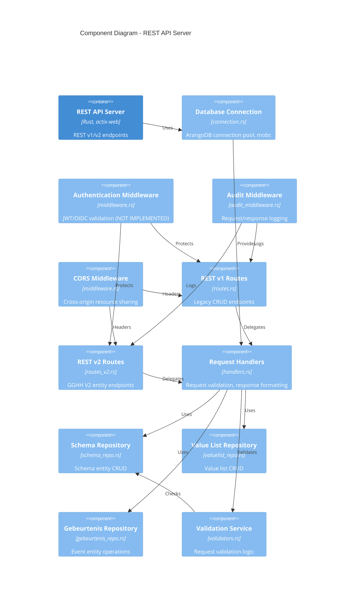
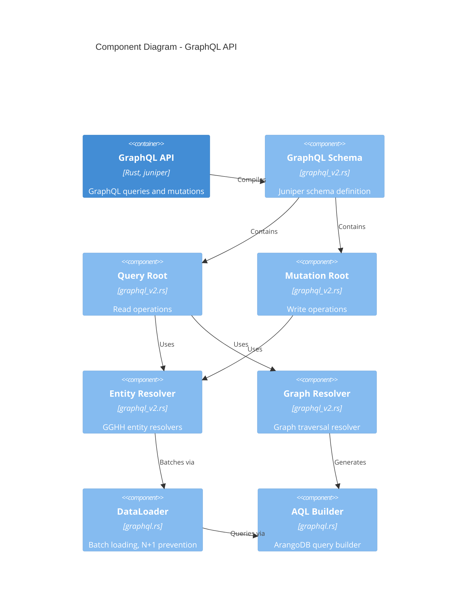
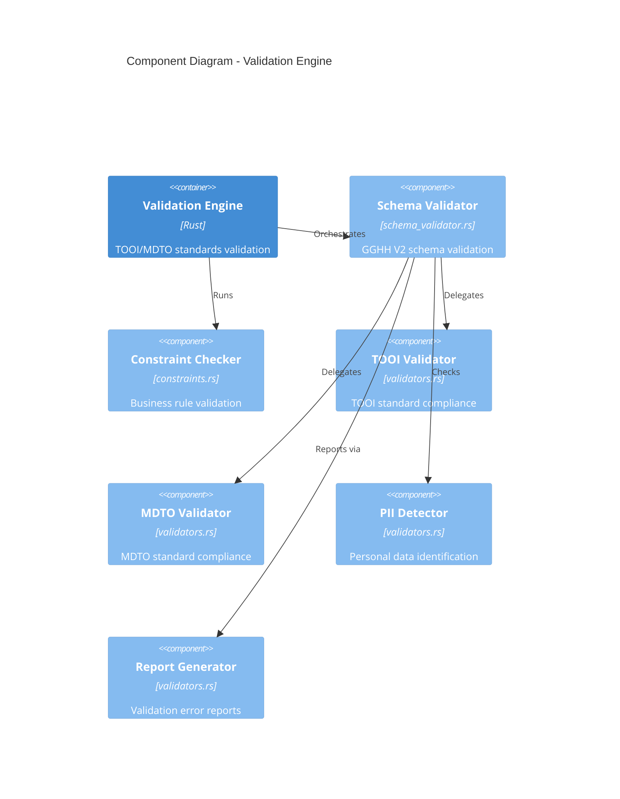
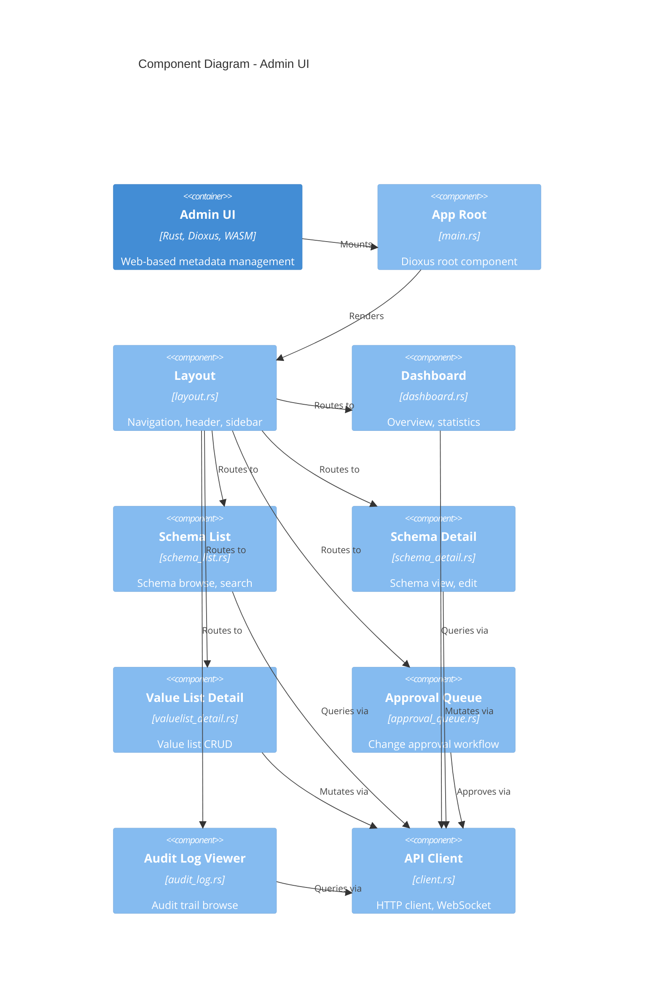
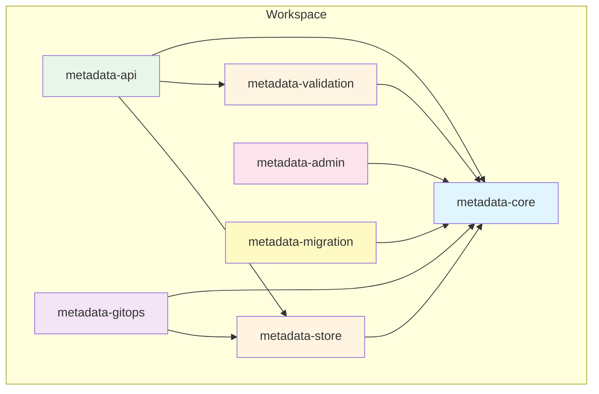

# Architecture Diagram: Component - Metadata Registry Service

> **Template Origin**: Official | **ArcKit Version**: 4.3.1 | **Command**: `/arckit:diagram component`

## Document Control

| Field | Value |
|-------|-------|
| **Document ID** | ARC-002-DIAG-003-v1.0 |
| **Document Type** | Architecture Diagram |
| **Project** | Metadata Registry Service (Project 002) |
| **Classification** | OFFICIAL |
| **Status** | DRAFT |
| **Version** | 1.0 |
| **Created Date** | 2026-04-19 |
| **Last Modified** | 2026-04-19 |
| **Review Cycle** | On-Demand |
| **Next Review Date** | 2026-05-19 |
| **Owner** | Enterprise Architect |
| **Reviewed By** | PENDING |
| **Approved By** | PENDING |
| **Distribution** | Project Team, Architecture Team |

## Revision History

| Version | Date | Author | Changes | Approved By | Approval Date |
|---------|------|--------|---------|-------------|---------------|
| 1.0 | 2026-04-19 | ArcKit AI | Initial creation from `/arckit:diagram component` command | PENDING | PENDING |

---

## Diagram Purpose

This C4 Level 3 Component diagram shows the internal structure of each container in the Metadata Registry Service, including Rust crates, modules, and their relationships. This diagram is used by developers for implementation planning and code organization.

---

## Component Diagram: REST API Server

---

## Component Diagram: GraphQL API

---

## Component Diagram: GitOps Sync Service

---

## Component Diagram: Validation Engine

---

## Component Diagram: Admin UI

---

## Component Inventory: REST API Server

| ID | Component | File | Responsibility | Technology |
|----|-----------|------|----------------|------------|
| C1 | Database Connection | connection.rs | ArangoDB connection pool, health checks | arangors, mobc |
| C2 | Auth Middleware | middleware.rs | JWT/OIDC token validation | NOT IMPLEMENTED |
| C3 | Audit Middleware | audit_middleware.rs | Request/response audit logging | tracing |
| C4 | CORS Middleware | middleware.rs | Cross-origin headers | actix-cors |
| C5 | REST v1 Routes | routes.rs | Legacy CRUD endpoints | actix-web |
| C6 | REST v2 Routes | routes_v2.rs | GGHH V2 entity endpoints | actix-web |
| C7 | Request Handlers | handlers.rs | Request validation, response formatting | serde |
| C8 | Schema Repository | schema_repo.rs | Schema entity CRUD operations | arangors |
| C9 | Value List Repository | valuelist_repo.rs | Value list CRUD operations | arangors |
| C10 | Gebeurtenis Repository | gebeurtenis_repo.rs | Event entity operations | arangors |
| C11 | Validation Service | validators.rs | Request validation logic | regex |

---

## Component Inventory: GraphQL API

| ID | Component | File | Responsibility | Technology |
|----|-----------|------|----------------|------------|
| G1 | GraphQL Schema | graphql_v2.rs | Juniper schema definition | juniper |
| G2 | Query Root | graphql_v2.rs | Read operation entry point | juniper |
| G3 | Mutation Root | graphql_v2.rs | Write operation entry point | juniper |
| G4 | Entity Resolver | graphql_v2.rs | GGHH entity field resolvers | async-trait |
| G5 | Graph Resolver | graphql_v2.rs | Graph traversal resolver | arangors |
| G6 | DataLoader | graphql.rs | Batch loading, N+1 prevention | juniper |
| G7 | AQL Builder | graphql.rs | ArangoDB query construction | string formatting |

---

## Component Inventory: GitOps Sync Service

| ID | Component | File | Responsibility | Technology |
|----|-----------|------|----------------|------------|
| S1 | File Watcher | watch.rs | inotify/file system watching | notify |
| S2 | Git Webhook | webhook.rs | GitHub/GitLab webhook handler | actix-web |
| S3 | YAML Parser | yaml.rs | serde_yaml parsing, entity conversion | serde_yaml |
| S4 | Sync Engine | sync.rs | Diff calculation, upsert logic | tokio |
| S5 | Sync State | sync.rs | Last sync timestamp, tracking tables | chrono |
| S6 | YAML Repository | yaml.rs | File-based entity definitions | std::fs |

---

## Component Inventory: Validation Engine

| ID | Component | File | Responsibility | Technology |
|----|-----------|------|----------------|------------|
| V1 | Schema Validator | schema_validator.rs | GGHH V2 schema validation | custom rules |
| V2 | Constraint Checker | constraints.rs | Business rule validation | regex |
| V3 | TOOI Validator | validators.rs | TOOI standard compliance | TOOI spec |
| V4 | MDTO Validator | validators.rs | MDTO standard compliance | MDTO spec |
| V5 | PII Detector | validators.rs | Personal data identification | pattern matching |
| V6 | Report Generator | validators.rs | Validation error formatting | serde_json |

---

## Component Inventory: Admin UI

| ID | Component | File | Responsibility | Technology |
|----|-----------|------|----------------|------------|
| U1 | App Root | main.rs | Dioxus root component, routing | dioxus |
| U2 | Layout | layout.rs | Navigation, header, sidebar | dioxus |
| U3 | Dashboard | dashboard.rs | Overview, statistics display | dioxus |
| U4 | Schema List | schema_list.rs | Schema browse, search UI | dioxus |
| U5 | Schema Detail | schema_detail.rs | Schema view, edit forms | dioxus |
| U6 | Value List Detail | valuelist_detail.rs | Value list CRUD UI | dioxus |
| U7 | Approval Queue | approval_queue.rs | Change approval workflow | dioxus |
| U8 | Audit Log Viewer | audit_log.rs | Audit trail browse | dioxus |
| U9 | API Client | client.rs | HTTP client, WebSocket | reqwest |

---

## Technology Stack Summary

| Layer | Technology | Purpose |
|-------|-----------|---------|
| **Language** | Rust 2021 Edition | Systems programming, memory safety |
| **Web Framework** | actix-web 4.0 | HTTP server, routing |
| **GraphQL** | juniper 0.15 | GraphQL schema and execution |
| **Database** | ArangoDB via arangors | Graph database client |
| **Connection Pool** | mobc 0.9 | Database connection management |
| **Async Runtime** | tokio 1.0 | Asynchronous I/O |
| **Serialization** | serde/serde_json | Data serialization |
| **YAML Parsing** | serde_yaml 0.9 | GitOps configuration |
| **Git Operations** | git2 0.18 | Git repository access |
| **File Watching** | notify 6.0 | File system events |
| **Validation** | regex 1.0 | Pattern validation |
| **Admin UI** | dioxus 0.7 | WebAssembly UI framework |
| **Logging** | tracing/tracing-subscriber | Structured logging |

---

## Module Dependency Graph

---

## Package Dependency Summary

| Crate | Internal Dependencies | External Dependencies |
|-------|----------------------|----------------------|
| metadata-core | None | serde, chrono, uuid, thiserror |
| metadata-store | metadata-core | arangors, mobc, async-trait |
| metadata-validation | metadata-core | regex |
| metadata-api | metadata-store, metadata-validation, metadata-core | actix-web, juniper, tokio |
| metadata-gitops | metadata-store, metadata-core | git2, serde_yaml, notify, tokio |
| metadata-admin | metadata-core | dioxus, reqwest |
| metadata-migration | metadata-core | arangors, tokio |

---

## Implementation Notes

### Critical TODO Items

1. **Authentication/Authorization** (C2): Middleware stub exists but needs OAuth 2.0/OIDC integration
2. **Row-Level Security**: Organization-level filtering not implemented in repositories
3. **Graph Traversal Optimization**: AQL query builder needs index optimization
4. **Batch Loading**: DataLoader implementation incomplete
5. **WebSocket Support**: Admin UI real-time updates not implemented

### Performance Considerations

- **Connection Pooling**: mobc configured for 10-100 connections per crate
- **Query Indexing**: ArangoDB indexes required on `_key`, `geldig_vanaf`, `geldig_tot`, `organisatie_id`
- **Async/Await**: All I/O operations use tokio async runtime
- **WASM Optimization**: Admin UI compiled with `lto=true`, `opt-level=z` for bundle size

### Security Considerations

- **Input Validation**: All public API endpoints validate via validation engine
- **SQL Injection Protection**: ArangoDB parameterized queries via arangors
- **CORS**: Configured for specific origins in production
- **Audit Logging**: All mutations logged via audit middleware (async)
