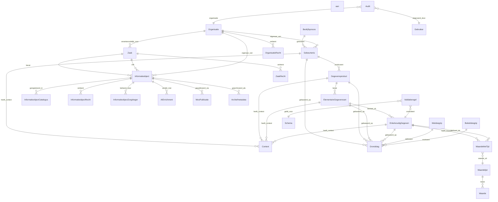

# Architecture Diagram: Data Model - Metadata Registry Service

> **Template Origin**: Official | **ArcKit Version**: 4.3.1 | **Command**: `/arckit:diagram datamodel`

## Document Control

| Field | Value |
|-------|-------|
| **Document ID** | ARC-002-DIAG-004-v1.0 |
| **Document Type** | Architecture Diagram |
| **Project** | Metadata Registry Service (Project 002) |
| **Classification** | OFFICIAL |
| **Status** | DRAFT |
| **Version** | 1.0 |
| **Created Date** | 2026-04-19 |
| **Last Modified** | 2026-04-19 |
| **Review Cycle** | On-Demand |
| **Next Review Date** | 2026-05-19 |
| **Owner** | Enterprise Architect |
| **Reviewed By** | PENDING |
| **Approved By** | PENDING |
| **Distribution** | Project Team, Architecture Team, Data Governance |

## Revision History

| Version | Date | Author | Changes | Approved By | Approval Date |
|---------|------|--------|---------|-------------|---------------|
| 1.0 | 2026-04-19 | ArcKit AI | Initial creation from `/arckit:diagram datamodel` command | PENDING | PENDING |

---

## Diagram Purpose

This Entity-Relationship diagram shows the complete data model for the Metadata Registry Service, including all GGHH V2 entities, BSW-specific entities, and the 29 edge collections that define their relationships.

---

## Complete Entity-Relationship Diagram



---

## GGHH V2 Core Entities

### Entity: Gebeurtenis (Event)

The central GGHH V2 entity representing a business event or data exchange.

| Attribute | Type | Required | Description |
|-----------|------|----------|-------------|
| _key | String | Yes | Unique identifier |
| naam | String | Yes | Event name |
| omschrijving | Text | No | Description |
| gebeurtenistype | String | Yes | Type classification |
| geldig_vanaf | DateTime | Yes | Valid from |
| geldig_tot | DateTime | Yes | Valid until |
| organisatie_id | String | Yes | Owner organization |

**Relationships**:
- → Gegevensproduct (produces)
- → Context (has_context)
- → Grondslag (based_on)
- ← Bedrijfsproces (generated_by)

---

### Entity: Gegevensproduct (Data Product)

A data product produced by an event, containing one or more elementary data sets.

| Attribute | Type | Required | Description |
|-----------|------|----------|-------------|
| _key | String | Yes | Unique identifier |
| naam | String | Yes | Product name |
| omschrijving | Text | No | Description |
| gegevensproducttype | String | Yes | Type classification |
| geldig_vanaf | DateTime | Yes | Valid from |
| geldig_tot | DateTime | Yes | Valid until |
| organisatie_id | String | Yes | Owner organization |

**Relationships**:
- ← Gebeurtenis (produced_by)
- → ElementaireGegevensset (contains)
- → Context (has_context)
- → Grondslag (based_on)

---

### Entity: ElementaireGegevensset (Elementary Data Set)

A logical grouping of related data elements.

| Attribute | Type | Required | Description |
|-----------|------|----------|-------------|
| _key | String | Yes | Unique identifier |
| naam | String | Yes | Set name |
| omschrijving | Text | No | Description |
| set_type | String | Yes | Set classification |
| geldig_vanaf | DateTime | Yes | Valid from |
| geldig_tot | DateTime | Yes | Valid until |
| organisatie_id | String | Yes | Owner organization |

**Relationships**:
- ← Gegevensproduct (part_of)
- → EnkelvoudigGegeven (consists_of)
- → Context (has_context)
- → Grondslag (based_on)

---

### Entity: EnkelvoudigGegeven (Simple Data Element)

An individual data element with a specific data type.

| Attribute | Type | Required | Description |
|-----------|------|----------|-------------|
| _key | String | Yes | Unique identifier |
| naam | String | Yes | Element name |
| omschrijving | Text | No | Description |
| datatype | String | Yes | Data type (string, integer, etc.) |
| lengte | Integer | No | Maximum length |
| verplicht | Boolean | Yes | Required flag |
| geldig_vanaf | DateTime | Yes | Valid from |
| geldig_tot | DateTime | Yes | Valid until |
| organisatie_id | String | Yes | Owner organization |

**Relationships**:
- ← ElementaireGegevensset (part_of)
- → WaardeMetTijd (has_value)
- → Context (has_context)
- → Grondslag (based_on)
- ← Validatieregel (validated_by)

---

### Entity: WaardeMetTijd (Value with Time)

A value that changes over time, associated with a data element.

| Attribute | Type | Required | Description |
|-----------|------|----------|-------------|
| _key | String | Yes | Unique identifier |
| waarde | String | Yes | The value |
| geldig_vanaf | DateTime | Yes | Valid from |
| geldig_tot | DateTime | Yes | Valid until |
| bron | String | No | Source system |
| kwaliteit | String | No | Data quality indicator |

**Relationships**:
- → EnkelvoudigGegeven (belongs_to)
- → Waardelijst (value_from)

---

### Entity: Context

Contextual metadata for entities.

| Attribute | Type | Required | Description |
|-----------|------|----------|-------------|
| _key | String | Yes | Unique identifier |
| context_type | String | Yes | Context type |
| context_waarde | String | Yes | Context value |
| geldig_vanaf | DateTime | Yes | Valid from |
| geldig_tot | DateTime | Yes | Valid until |

---

### Entity: Grondslag (Legal Basis)

Legal basis for data processing.

| Attribute | Type | Required | Description |
|-----------|------|----------|-------------|
| _key | String | Yes | Unique identifier |
| naam | String | Yes | Legal basis name |
| omschrijving | Text | No | Description |
| type | String | Yes | Type (wet, ministeriele_regeling, etc.) |
| geldig_vanaf | DateTime | Yes | Valid from |
| geldig_tot | DateTime | Yes | Valid until |
| verwijzing | String | No | URL to legal text |

**Relationships**:
- ← Wetsbegrip (defined_by)
- ← Beleidsbegrip (motivated_by)

---

## BSW-Specific Entities

### Entity: Zaak

Case/dossier for BSW architecture.

| Attribute | Type | Required | Description |
|-----------|------|----------|-------------|
| _key | String | Yes | Unique identifier |
| zaaknummer | String | Yes | Case number |
| zaaktype | String | Yes | Case type |
| startdatum | Date | Yes | Start date |
| einddatum | Date | No | End date |
| status | String | Yes | Status |
| organisatie_id | String | Yes | Responsible organization |

**Relationships**:
- → Informatieobject (contains)
- → ZaakRecht (grants)
- → Informatieobject (inherits_to)

---

### Entity: Informatieobject

Core BSW abstraction: dataobject + metadata.

| Attribute | Type | Required | Description |
|-----------|------|----------|-------------|
| _key | String | Yes | Unique identifier |
| dataobject_id | String | Yes | Reference to actual content |
| naam | String | Yes | Object name |
| omschrijving | Text | No | Description |
| objecttype | String | Yes | Object type |
| informatiecategorie | String | Yes | Woo category |
| documenttype | String | Yes | Document type |
| beveiligingsniveau | Enum | Yes | Security level |
| privacy_level | Enum | Yes | Privacy level |
| status | Enum | Yes | dynamisch/gepersistent/gearchiveerd |
| zaak_id | String | No | Related case |
| samenvatting | Text | No | AI-generated summary |
| organisatie_id | String | Yes | Owner organization |

**Relationships**:
- ← Zaak (part_of)
- → InformatieobjectCatalogus (registered_in)
- → InformatieobjectRecht (grants)
- → InformatieobjectZorgdrager (managed_by)
- → AIEnrichment (enriched_with)
- → WooPublicatie (published_via)
- → Archiefmetadata (archived_as)

---

### Entity: InformatieobjectCatalogus

Catalog entry with location reference.

| Attribute | Type | Required | Description |
|-----------|------|----------|-------------|
| _key | String | Yes | Unique identifier |
| informatieobject_id | String | Yes | Reference to Informatieobject |
| locatie_uri | String | Yes | Storage location (CDD+, file system) |
| zoek_index | Text | Yes | Full-text searchable content |
| context_metadata | JSON | Yes | Context for search |

---

### Entity: InformatieobjectRecht

Object-level authorization grants.

| Attribute | Type | Required | Description |
|-----------|------|----------|-------------|
| _key | String | Yes | Unique identifier |
| informatieobject_id | String | Yes | Reference to Informatieobject |
| user_id | String | Yes | User identifier |
| recht_type | Enum | Yes | lezen/bewerken/goedkeuren/verwijderen |
| granted_by | String | Yes | Grantor |
| granted_at | DateTime | Yes | Grant timestamp |

---

### Entity: InformatieobjectZorgdrager

Multi-caretaker support for chain collaboration.

| Attribute | Type | Required | Description |
|-----------|------|----------|-------------|
| _key | String | Yes | Unique identifier |
| informatieobject_id | String | Yes | Reference to Informatieobject |
| organisatie_id | String | Yes | Caretaker organization |
| rol | Enum | Yes | primair/secundair |
| vanaf | DateTime | Yes | Start of caretaker role |

---

## Phase 1-3 Entities

### Entity: Bedrijfsproces (Business Process)

| Attribute | Type | Required | Description |
|-----------|------|----------|-------------|
| _key | String | Yes | Unique identifier |
| naam | String | Yes | Process name |
| omschrijving | Text | No | Description |
| organisatie_id | String | Yes | Owner organization |

**Relationships**:
- → Gebeurtenis (generates)

---

### Entity: Wetsbegrip (Legal Concept)

| Attribute | Type | Required | Description |
|-----------|------|----------|-------------|
| _key | String | Yes | Unique identifier |
| naam | String | Yes | Concept name |
| omschrijving | Text | No | Description |
| wet | String | Yes | Law reference |

**Relationships**:
- → Grondslag (defines)

---

### Entity: Beleidsbegrip (Policy Concept)

| Attribute | Type | Required | Description |
|-----------|------|----------|-------------|
| _key | String | Yes | Unique identifier |
| naam | String | Yes | Concept name |
| omschrijving | Text | No | Description |
| beleid | String | Yes | Policy reference |

**Relationships**:
- → Grondslag (motivates)

---

## Supporting Entities

### Entity: Organisatie

| Attribute | Type | Required | Description |
|-----------|------|----------|-------------|
| _key | String | Yes | Unique identifier |
| naam | String | Yes | Organization name |
| gemeentecode | String | No | Municipality code |
| ogc_code | String | No | OGC code |

---

### Entity: Gebruiker (User)

| Attribute | Type | Required | Description |
|-----------|------|----------|-------------|
| _key | String | Yes | Unique identifier |
| naam | String | Yes | User name |
| email | String | Yes | Email address |
| organisatie_id | String | Yes | Organization |

---

### Entity: Audit

| Attribute | Type | Required | Description |
|-----------|------|----------|-------------|
| _key | String | Yes | Unique identifier |
| actie | String | Yes | Action (create/update/delete) |
| entity_type | String | Yes | Entity type |
| entity_id | String | Yes | Entity identifier |
| uitgevoerd_door | String | Yes | User ID |
| organisatie_id | String | Yes | Organization |
| uitgevoerd_op | DateTime | Yes | Timestamp |
| reden | Text | No | Reason for change |

---

### Entity: Waardelijst (Value List)

| Attribute | Type | Required | Description |
|-----------|------|----------|-------------|
| _key | String | Yes | Unique identifier |
| naam | String | Yes | List name |
| omschrijving | Text | No | Description |
| type | String | Yes | List type |

**Relationships**:
- → Waarde (contains)

---

### Entity: Waarde (Value)

| Attribute | Type | Required | Description |
|-----------|------|----------|-------------|
| _key | String | Yes | Unique identifier |
| code | String | Yes | Value code |
| waarde | String | Yes | Value display |
| geldig_vanaf | DateTime | Yes | Valid from |
| geldig_tot | DateTime | Yes | Valid until |

---

## Edge Collections (29 Total)

| Edge Collection | From | To | Description |
|-----------------|------|-----|-------------|
| gebeurtenis_gegevensproduct | Gebeurtenis | Gegevensproduct | Produces |
| gebeurtenis_context | Gebeurtenis | Context | Has context |
| gebeurtenis_grondslag | Gebeurtenis | Grondslag | Based on |
| gegevensproduct_elementaire_set | Gegevensproduct | ElementaireGegevensset | Contains |
| gegevensproduct_context | Gegevensproduct | Context | Has context |
| gegevensproduct_grondslag | Gegevensproduct | Grondslag | Based on |
| elementaire_set_enkelvoudig | ElementaireGegevensset | EnkelvoudigGegeven | Consists of |
| elementaire_set_context | ElementaireGegevensset | Context | Has context |
| elementaire_set_grondslag | ElementaireGegevensset | Grondslag | Based on |
| enkelvoudig_waarde_met_tijd | EnkelvoudigGegeven | WaardeMetTijd | Has value |
| enkelvoudig_context | EnkelvoudigGegeven | Context | Has context |
| enkelvoudig_grondslag | EnkelvoudigGegeven | Grondslag | Based on |
| waarde_waardelijst | WaardeMetTijd | Waardelijst | Value from |
| zaak_informatieobject | Zaak | Informatieobject | Contains |
| zaak_recht | Zaak | InformatieobjectRecht | Grants |
| inherits_from | Informatieobject | Zaak | Inherits from |
| informatieobject_catalogus | Informatieobject | InformatieobjectCatalogus | Registered in |
| informatieobject_recht | Informatieobject | InformatieobjectRecht | Grants |
| informatieobject_zorgdrager | Informatieobject | InformatieobjectZorgdrager | Managed by |
| informatieobject_ai | Informatieobject | AIEnrichment | Enriched with |
| informatieobject_woo | Informatieobject | WooPublicatie | Published via |
| informatieobject_archief | Informatieobject | Archiefmetadata | Archived as |
| bedrijfsproces_gebeurtenis | Bedrijfsproces | Gebeurtenis | Generates |
| wetsbegrip_grondslag | Wetsbegrip | Grondslag | Defines |
| beleidsbegrip_grondslag | Beleidsbegrip | Grondslag | Motivates |
| organisatie_gebeurtenis | Organisatie | Gebeurtenis | Owns |
| organisatie_informatieobject | Organisatie | Informatieobject | Owns |
| organisatie_zaak | Organisatie | Zaak | Responsible for |
| validatieregel_enkelvoudig | Validatieregel | EnkelvoudigGegeven | Validates |

---

## Index Strategy

### Persistent Indexes

```javascript
// Time-based validity (all entities)
db.gebeurtenis.ensurePersistentIndex(["geldig_vanaf", "geldig_tot"]);
db.gegevensproduct.ensurePersistentIndex(["geldig_vanaf", "geldig_tot"]);
// ... repeat for all entities

// Organization filtering
db.gebeurtenis.ensurePersistentIndex(["organisatie_id"]);
db.informatieobject.ensurePersistentIndex(["organisatie_id"]);

// Zaak lookups
db.informatieobject.ensurePersistentIndex(["zaak_id"]);

// Authorization checks
db.informatieobject_recht.ensurePersistentIndex(["user_id"]);
db.informatieobject_recht.ensurePersistentIndex(["informatieobject_id", "recht_type"]);
```

### Geo Indexes

```javascript
// Not applicable for metadata registry
// (No location-based queries in current requirements)
```

### Full-Text Indexes

```javascript
// Search functionality
db.informatieobject_catalogus.ensureFullTextIndex(["zoek_index"]);
db.gebeurtenis.ensureFullTextIndex(["naam", "omschrijving"]);
```

---

## Data Volume Estimates

| Entity | Year 1 | Year 2 | Year 3 | Year 5 |
|--------|--------|--------|--------|--------|
| Gebeurtenis | 10K | 50K | 100K | 500K |
| Gegevensproduct | 5K | 25K | 50K | 250K |
| ElementaireGegevensset | 20K | 100K | 200K | 1M |
| EnkelvoudigGegeven | 100K | 500K | 1M | 5M |
| WaardeMetTijd | 1M | 5M | 10M | 50M |
| Informatieobject | 100K | 500K | 1M | 10M |
| Zaak | 10K | 50K | 100K | 1M |
| Audit | 1M | 5M | 10M | 50M |

**Total**: ~2.3M documents (Year 1) → ~117M documents (Year 5)

---

## Related Documents

- **ARC-002-REQ-v1.1**: Requirements document (entity specifications)
- **ARC-002-ADR-002**: ArangoDB decision (graph storage)
- **ARC-002-ADR-004**: BSW alignment (BSW entities)
