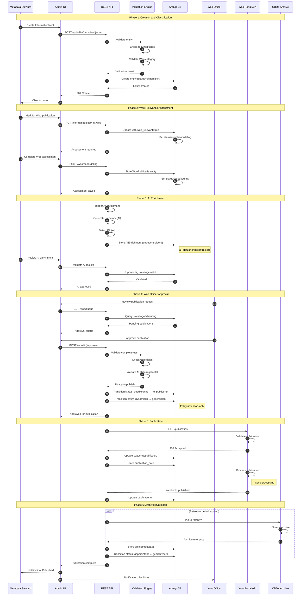

# Architecture Diagram: Sequence - Woo Publication Workflow

> **Template Origin**: Official | **ArcKit Version**: 4.3.1 | **Command**: `/arckit:diagram sequence`

## Document Control

| Field | Value |
|-------|-------|
| **Document ID** | ARC-002-DIAG-005-v1.0 |
| **Document Type** | Architecture Diagram |
| **Project** | Metadata Registry Service (Project 002) |
| **Classification** | OFFICIAL |
| **Status** | DRAFT |
| **Version** | 1.0 |
| **Created Date** | 2026-04-19 |
| **Last Modified** | 2026-04-19 |
| **Review Cycle** | On-Demand |
| **Next Review Date** | 2026-05-19 |
| **Owner** | Enterprise Architect |
| **Reviewed By** | PENDING |
| **Approved By** | PENDING |
| **Distribution** | Project Team, Architecture Team, Woo Officers |

## Revision History

| Version | Date | Author | Changes | Approved By | Approval Date |
|---------|------|--------|---------|-------------|---------------|
| 1.0 | 2026-04-19 | ArcKit AI | Initial creation from `/arckit:diagram sequence` command | PENDING | PENDING |

---

## Diagram Purpose

This sequence diagram shows the complete Wet open overheid (Woo) publication workflow, from information object creation to final publication on the Woo portal, including all validation, approval, and publication steps.

---

## Woo Publication Workflow



---

## Workflow States

### State Transitions

```
┌──────────────┐
│  Creatie     │
│ (dynamisch)  │
└──────┬───────┘
       │ Mark for Woo
       ▼
┌──────────────┐
│ Woobeoordeling│
│ (assessment) │
└──────┬───────┘
       │ Assessment complete
       ▼
┌──────────────┐
│ Goedkeuring   │
│ (approval)   │
└──────┬───────┘
       │ Woo Officer approves
       ▼
┌──────────────┐
│Te_publiceren │
│ (pending)    │
└──────┬───────┘
       │ Submit to Woo
       ▼
┌──────────────┐
│ Gepubliceerd │
│ (published)  │
└──────┬───────┘
       │ Archive
       ▼
┌──────────────┐
│ Gearchiveerd │
└──────────────┘
```

### Status Values

| Status | Description | Mutable | Published |
|--------|-------------|---------|-----------|
| `creatie` | Initial creation | Yes | No |
| `woobeoordeling` | Woo assessment pending | Yes | No |
| `goedkeuring` | Pending Woo Officer approval | Yes | No |
| `te_publiceren` | Approved, pending submission | No | No |
| `gepubliceerd` | Published on Woo portal | No | Yes |
| `gearchiveerd` | Archived in CDD+ | No | Yes |

---

## API Endpoints

### Creation

```http
POST /api/v2/informatieobjecten
Content-Type: application/json

{
  "naam": "Besluit ook openbaar",
  "omschrijving": "...",
  "objecttype": "besluit",
  "informatiecategorie": "besluit",
  "documenttype": "pdf",
  "beveiligingsniveau": "openbaar",
  "organisatie_id": "org-123"
}
```

### Woo Assessment

```http
POST /api/v2/informatieobject/{id}/woo/beoordeling
Content-Type: application/json

{
  "woo_relevant": true,
  "publicatie_binnen": "10_werken",
  "ingang_publicatie": "2024-05-01",
  "redenering": "Besluit van openbaar belang"
}
```

### AI Validation

```http
PUT /api/v2/informatieobject/{id}/ai/validate
Content-Type: application/json

{
  "ai_status": "getoetst",
  "validator_id": "user-456",
  "opmerking": "Summary is accurate"
}
```

### Woo Officer Approval

```http
POST /api/v2/woo/{id}/approve
Authorization: Bearer <woo-officer-token>

{
  "goedgekeurd": true,
  "redenering": "Voldoet aan Woo vereisten"
}
```

### Publication

```http
POST /api/v2/woo/{id}/publish
Authorization: Bearer <service-token>

{
  "publicatie_datum": "2024-05-01",
  "metadata_volledig": true
}
```

---

## Data Structures

### WooPublicatie Entity

```rust
pub struct WooPublicatie {
    pub _key: String,
    pub informatieobject_id: String,

    // Assessment
    pub woo_relevant: bool,
    pub publicatie_binnen: PublicatieBinnen,
    pub ingang_publicatie: Date,
    pub redenering: String,

    // AI Enrichment
    pub samenvatting: Option<String>,
    pub ai_status: AIStatus,
    pub vertrouwensscore: f64,
    pub getoetst_door: Option<String>,
    pub getoetst_op: Option<DateTime>,

    // Approval
    pub goedgekeurd_door: Option<String>,
    pub goedgekeurd_op: Option<DateTime>,
    pub goedkeurings_redenering: Option<String>,

    // Publication
    pub status: WooStatus,
    pub publicatie_datum: Option<Date>,
    pub publicatie_url: Option<String>,
    pub woo_referentie: Option<String>,

    // Audit
    pub organisatie_id: String,
    pub aangemaakt_door: String,
    pub aangemaakt_op: DateTime,
}
```

---

## Error Handling

| Error | Condition | HTTP Status | User Action |
|-------|-----------|-------------|-------------|
| `INVALID_WOO_CATEGORY` | informatiecategorie not valid | 400 | Select valid Woo category |
| `AI_NOT_VALIDATED` | ai_status=ongecontroleerd | 403 | Validate AI results first |
| `MISSING_REQUIRED_FIELDS` | Woo fields incomplete | 400 | Complete assessment |
| `NOT_WOO_RELEVANT` | woo_relevant=false | 400 | Mark as Woo relevant first |
| `ALREADY_PUBLISHED` | status=gepubliceerd | 409 | Cannot re-publish |
| `READ_ONLY_ENTITY` | status=gepersistent | 403 | Cannot modify read-only entity |
| `UNAUTHORIZED` | Non-Woo officer approves | 403 | Get Woo officer approval |

---

## Related Documents

- **ARC-002-REQ-v1.1**: FR-MREG-9 (Woo Publication Workflow)
- **ARC-002-ADR-004**: BSW Alignment (AI validation requirement)
- **ARC-002-DIAG-006**: GitOps Sync Flow
