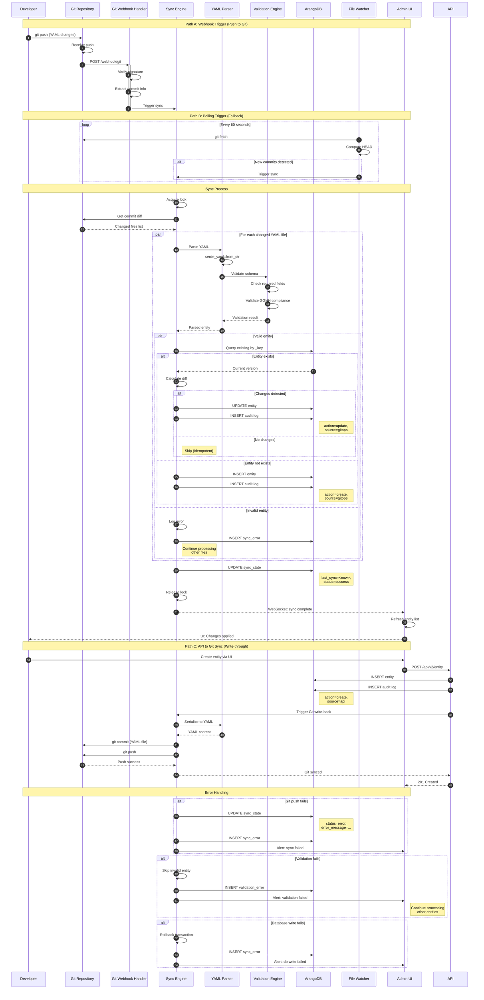

# Architecture Diagram: Sequence - GitOps Sync Flow

> **Template Origin**: Official | **ArcKit Version**: 4.3.1 | **Command**: `/arckit:diagram sequence`

## Document Control

| Field | Value |
|-------|-------|
| **Document ID** | ARC-002-DIAG-006-v1.0 |
| **Document Type** | Architecture Diagram |
| **Project** | Metadata Registry Service (Project 002) |
| **Classification** | OFFICIAL |
| **Status** | DRAFT |
| **Version** | 1.0 |
| **Created Date** | 2026-04-19 |
| **Last Modified** | 2026-04-19 |
| **Review Cycle** | On-Demand |
| **Next Review Date** | 2026-05-19 |
| **Owner** | Enterprise Architect |
| **Reviewed By** | PENDING |
| **Approved By** | PENDING |
| **Distribution** | Project Team, Architecture Team, DevOps |

## Revision History

| Version | Date | Author | Changes | Approved By | Approval Date |
|---------|------|--------|---------|-------------|---------------|
| 1.0 | 2026-04-19 | ArcKit AI | Initial creation from `/arckit:diagram sequence` command | PENDING | PENDING |

---

## Diagram Purpose

This sequence diagram shows the GitOps synchronization flow, including webhook-based triggers, YAML parsing, diff calculation, and bidirectional sync between the Git repository and ArangoDB.

---

## GitOps Sync Flow



---

## Sync Modes

### Webhook Mode (Primary)

**Trigger**: Git push event
**Latency**: <5 seconds
**Use Case**: Production environments

```
Git → Webhook → Sync Engine → ArangoDB
```

### Polling Mode (Fallback)

**Trigger**: Scheduled polling (60s interval)
**Latency**: 60-120 seconds
**Use Case**: Webhook unavailable

```
Watcher → Git (fetch) → Sync Engine → ArangoDB
```

### Pull Mode (On-Demand)

**Trigger**: Manual API call
**Latency**: Immediate
**Use Case**: Manual sync, recovery

```
Admin UI → API → Sync Engine → ArangoDB
```

### Write-Through Mode

**Trigger**: API write operation
**Latency**: Synchronous
**Use Case**: API-initiated changes

```
API → ArangoDB + Sync Engine → Git
```

---

## YAML Format

### Entity Definition

```yaml
# metadata/organisaties/org-001/schemas/schema-001.yaml
apiVersion: gghm.io/v2
kind: Gebeurtenis
metadata:
  _key: schema-001
  naam: "Burger aanvraag uitkering"
  organisatie_id: org-001
spec:
  omschrijving: "Aanvraag van een uitkering door een burger"
  gebeurtenistype: "aanvraag"
  beveiligingsniveau: "vertrouwelijk"
  privacy_level: "avg"
  geldigheid:
    geldig_vanaf: "2024-01-01T00:00:00Z"
    geldig_tot: "9999-12-31T23:59:59Z"
  context:
    - type: "domein"
      waarde: "sociale_zekerheid"
    - type: "wet"
      waarde: "ww"
```

### Relationship Definition

```yaml
# metadata/organisaties/org-001/relationships/gebeurtenis-product-001.yaml
apiVersion: gghm.io/v2
kind: Edge
metadata:
  _from: gebeurtenis/evt-001
  _to: gegevensproduct/gdp-001
  organisatie_id: org-001
spec:
  relatie_type: "produceert"
  geldigheid:
    geldig_vanaf: "2024-01-01T00:00:00Z"
    geldig_tot: "9999-12-31T23:59:59Z"
```

---

## Sync State

### Sync State Entity

```rust
pub struct SyncState {
    pub _key: String,  // "sync-state"
    pub last_sync: DateTime<Utc>,
    pub last_commit: String,  // Git commit SHA
    pub last_commit_message: String,
    pub status: SyncStatus,
    pub files_processed: i32,
    pub files_succeeded: i32,
    pub files_failed: i32,
    pub entities_created: i32,
    pub entities_updated: i32,
    pub entities_deleted: i32,
    pub error_message: Option<String>,
}

pub enum SyncStatus {
    Idle,
    Running,
    Success,
    PartialSuccess,
    Error,
}
```

### Sync Log

```rust
pub struct SyncLog {
    pub _key: String,
    pub timestamp: DateTime<Utc>,
    pub commit_sha: String,
    pub file_path: String,
    pub entity_type: String,
    pub entity_key: String,
    pub action: SyncAction,  // created, updated, deleted, skipped, error
    pub error_message: Option<String>,
}
```

---

## Error Handling

| Error Type | Condition | Action | Retry |
|------------|-----------|--------|-------|
| `INVALID_YAML` | Parse error | Log, skip file | No |
| `VALIDATION_FAILED` | Schema validation | Log, skip file | No |
| `DB_WRITE_FAILED` | ArangoDB error | Rollback transaction | Yes (3x) |
| `GIT_PUSH_FAILED` | Write-back error | Queue for retry | Yes (5x) |
| `LOCK_ACQUISITION_FAILED` | Sync already running | Return immediately | No |
| `NETWORK_ERROR` | Git unreachable | Switch to polling | Yes (indefinite) |

---

## Idempotency

The sync process is idempotent:

```rust
pub fn sync_entity(entity: ParsedEntity) -> Result<(), Error> {
    let existing = db.get_entity(&entity.key)?;

    match existing {
        Some(current) if current.hash == entity.hash => {
            // No changes - skip
            return Ok(());
        }
        Some(current) => {
            // Update existing
            db.update_entity(&entity)?;
            audit_log("update", "gitops", &entity.key)?;
        }
        None => {
            // Create new
            db.create_entity(&entity)?;
            audit_log("create", "gitops", &entity.key)?;
        }
    }

    Ok(())
}
```

---

## Performance

| Metric | Target | Measurement |
|--------|--------|-------------|
| Webhook to sync start | <5s | Git push → Sync engine start |
| Single file sync | <100ms | YAML parse → DB write |
| Full sync (1000 files) | <30s | Complete repository sync |
| Git write-back latency | <500ms | API → Git commit push |
| Lock acquisition timeout | 60s | Max wait for sync lock |

---

## Related Documents

- **ARC-002-REQ-v1.1**: FR-MREG-10 (GitOps Synchronization)
- **ARC-002-DIAG-003**: Component Diagram (GitOps Service)
- **ARC-002-ADR-001**: Rust language selection (git2 crate)
