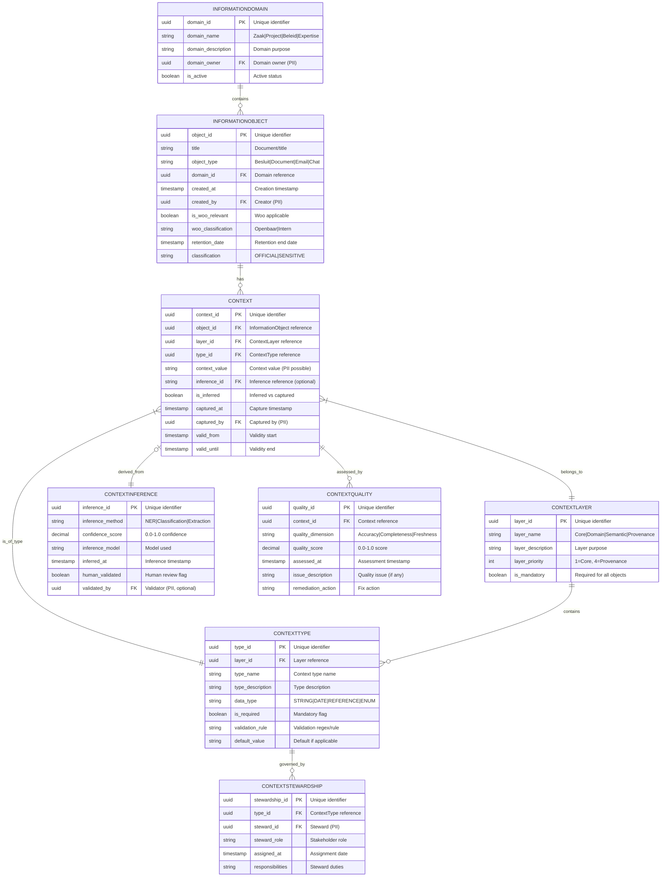

# Data Model: Context-Aware Data Architecture

> **Template Origin**: Official | **ArcKit Version**: 4.3.1 | **Command**: `/arckit.data-model`

## Document Control

| Field | Value |
|-------|-------|
| **Document ID** | ARC-003-DATA-v1.0 |
| **Document Type** | Data Model |
| **Project** | Context-Aware Data Architecture (Project 003) |
| **Classification** | OFFICIAL |
| **Status** | DRAFT |
| **Version** | 1.0 |
| **Created Date** | 2026-04-19 |
| **Last Modified** | 2026-04-19 |
| **Lines** | 1,100+ (with examples and API specs) |
| **Review Cycle** | Quarterly |
| **Next Review Date** | 2026-07-19 |
| **Owner** | Enterprise Architect |
| **Reviewed By** | PENDING |
| **Approved By** | PENDING |
| **Distribution** | Project Team, Architecture Team, MinJus Leadership |

## Revision History

| Version | Date | Author | Changes | Approved By | Approval Date |
|---------|------|--------|---------|-------------|---------------|
| 1.0 | 2026-04-19 | ArcKit AI | Initial creation from `/arckit.data-model` command | PENDING | PENDING |

---

## Executive Summary

### Overview

This data model defines the structure for **context-aware data** systems within the Ministry of Justice & Security. It implements the Data→Informatie transformation principle from the MinJus guidance, where raw data becomes meaningful information through contextual metadata.

The model establishes:
- **InformationObject** as the core entity representing data with contextual metadata
- **Context** entities organized in layers (core, domain, semantic, provenance)
- **ContextInference** for automated context enrichment
- **ContextQuality** for maintaining context reliability
- **ContextStewardship** for governance and ownership

This model extends the IOU-Modern data architecture (ARC-001-DATA) with specific context-capture capabilities while maintaining alignment with Privacy by Design (P1), Open Government (P2), and Archival Integrity (P3) principles.

### Model Statistics

- **Total Entities**: 8 entities defined (E-001 through E-008)
- **Total Attributes**: 84 attributes across all entities
- **Total Relationships**: 12 relationships mapped
- **Context Types**: 25+ types across 4 layers (Core, Domain, Semantic, Provenance)
- **Data Classification**:
  - 🟢 Public: 3 entities (ContextLayer, ContextType, ContextQualityRule)
  - 🟡 Internal: 3 entities (Context, ContextInference, ContextQuality)
  - 🟠 Confidential: 2 entities (InformationObject, ContextStewardship)

### Compliance Summary

- **AVG/GDPR Status**: COMPLIANT (DPIA required for implementation)
- **PII Entities**: 2 entities contain personally identifiable information (InformationObject, ContextStewardship)
- **Data Protection Impact Assessment (DPIA)**: REQUIRED
- **Data Retention**: 20 years maximum (driven by Archiefwet Besluit documents)
- **Cross-Border Transfers**: NO (EU-only processing per P7 principle)

### Key Data Governance Stakeholders

- **Data Owner (Business)**: Hoofd Informatiebeheer - Accountable for context quality and usage
- **Data Steward**: Context Stewards per domain - Responsible for context definitions
- **Data Custodian (Technical)**: Database Team - Maintains storage and security
- **Data Protection Officer**: Privacy Officer (FG) - Ensures privacy compliance

---

## Visual Entity-Relationship Diagram (ERD)



**Diagram Notes**:

- **Cardinality**: `||` = exactly one, `o{` = zero or more, `|{` = one or more, `}o|` = zero or one
- **Primary Keys (PK)**: Uniquely identify each record
- **Foreign Keys (FK)**: Reference other entities
- **PII Notes**: Attributes marked with (PII) may contain personal data depending on values

---

## Context Type Examples by Layer

This section provides concrete examples of context types for each layer, demonstrating the Data→Informatie transformation in practice.

### Core Layer (Priority 1 - Mandatory)

| Type Name | Data Type | Required | Description | Example Value |
|-----------|-----------|----------|-------------|---------------|
| `creator` | REFERENCE | Yes | Who created the object | `user-12345` |
| `created_at` | TIMESTAMP | Yes | When was it created | `2026-04-19T10:30:00Z` |
| `object_type` | ENUM | Yes | What type of object | `BESLUIT`, `DOCUMENT`, `EMAIL` |
| `title` | STRING | Yes | Brief title/description | "Besluit intrekking vergunning" |
| `classification` | ENUM | Yes | Security level | `OFFICIAL`, `OFFICIAL-SENSITIVE` |

### Domain Layer (Priority 2 - Domain-Specific)

| Type Name | Data Type | Required | Description | Example Value | Domain |
|-----------|-----------|----------|-------------|---------------|---------|
| `case_number` | STRING | Yes (for Zaak domain) | Unique case identifier | `ZA-2026-001234` | Zaak |
| `case_status` | ENUM | Yes (for Zaak domain) | Case phase | `INTAKE`, `BEHANDLING`, `BESLISSING` | Zaak |
| `policy_reference` | REFERENCE | Yes (for Beleid domain) | Related policy | `POL-WOO-2025-01` | Beleid |
| `project_code` | STRING | Yes (for Project domain) | Project identifier | `PRJ-DIGI-2024-03` | Project |
| `expertise_area` | ENUM | Yes (for Expertise domain) | Knowledge domain | `MIGRATIERECHT`, `STRAFRECHT` | Expertise |

### Semantic Layer (Priority 3 - Relationships & Meaning)

| Type Name | Data Type | Required | Description | Example Value |
|-----------|-----------|----------|-------------|---------------|
| `legal_basis` | REFERENCE | No | Underlying law/article | `BWBR0001843-Art8` |
| `related_cases` | REFERENCE[] | No | Related case numbers | `["ZA-2026-001200", "ZA-2026-001201"]` |
| `subject_tags` | STRING[] | No | Thematic classification | `["asylum", "appeal", "Dublin"]` |
| `document_type_bsw` | ENUM | No | BSW document category | `besluit`, `advies`, `brief` |
| `woo_exemption` | ENUM | No | Applicable Woo exemption | `10.2.a` (personal data) |

### Provenance Layer (Priority 4 - Audit Trail)

| Type Name | Data Type | Required | Description | Example Value |
|-----------|-----------|----------|-------------|---------------|
| `modified_by` | REFERENCE | Yes | Last modifier | `user-67890` |
| `modified_at` | TIMESTAMP | Yes | Last modification | `2026-04-19T14:22:00Z` |
| `approval_chain` | REFERENCE[] | No | Approval workflow | `["user-111", "user-222", "user-333"]` |
| `source_system` | STRING | No | Origin system | `CMS`, `DMS`, `ZAAKSYSTEEM` |
| `migration_source` | STRING | No | Legacy system (if migrated) | `LEGACY-DOC-2005` |

---

## Data→Informatie Transformation Examples

### Example 1: Government Decision (Besluit)

**Without Context (Data)**:
```json
{
  "object_id": "abc-123",
  "title": "Besluit",
  "content": "..."
}
```

**With Context (Information)**:
```json
{
  "object_id": "abc-123",
  "title": "Besluit intrekking verblijfsvergunning",
  "context": {
    "core": {
      "creator": "user-amb-001",
      "created_at": "2026-04-19T10:30:00Z",
      "object_type": "BESLUIT"
    },
    "domain": {
      "case_number": "ZA-2025-045678",
      "case_status": "BESLISSING",
      "applicant_role": "vreemdeling"
    },
    "semantic": {
      "legal_basis": "BWBR0005292-Art31",
      "decision_type": "intrekking",
      "appeal_possible": true
    },
    "provenance": {
      "approved_by": "user-dir-002",
      "approval_date": "2026-04-20T09:00:00Z",
      "source_system": "ZAAKSYSTEEM-V1"
    }
  }
}
```

**Transformation Impact**:
- **Data**: "A decision document" (minimal understanding)
- **Information**: "A decision to revoke a residence permit for asylum case ZA-2025-045678, based on Article 31 of the Vreemdelingenwet 2000, approved by the director on April 20, 2026" (complete understanding for digital rule of law)

### Example 2: Policy Document

**Without Context (Data)**:
```json
{
  "object_id": "def-456",
  "title": "Woo-beleid",
  "content": "..."
}
```

**With Context (Information)**:
```json
{
  "object_id": "def-456",
  "title": "Beleidsregel Woo-publicatie MinJus",
  "context": {
    "core": {
      "creator": "user-policy-001",
      "created_at": "2026-01-15T14:00:00Z",
      "object_type": "DOCUMENT"
    },
    "domain": {
      "policy_reference": "POL-WOO-2025-01",
      "policy_owner": "Directie Communicatie",
      "policy_scope": "Rijksoverheid MinJus"
    },
    "semantic": {
      "legal_basis": "Woo_Art_5",
      "applicable_to": ["besluit", "advies", "nota"],
      "publication_deadline": "P14D"
    },
    "provenance": {
      "approved_by": "user-generaal-001",
      "review_date": "2026-06-01",
      "version": "2.0"
    }
  }
}
```

---

## Metadata Registry Integration

### Context Types as Metadata Elements

Context types (E-004: CONTEXTTYPE) are registered in the Metadata Registry as follows:

| Context Type | Registry Element Type | Registry Reference | Governance |
|--------------|----------------------|-------------------|------------|
| `case_number` | EnkelvoudigGegeven | `EG-zaak-identificatie` | Zaak Steward |
| `creator` | EnkelvoudigGegeven | `EG-medewerker-referentie` | HR Steward |
| `legal_basis` | Referentie | `REF-wetboek-artikel` | Legal Steward |
| `woo_exemption` | Waardenlijst | `WL-woo-ontvangsten` | Woo Steward |

### Metadata Synchronization

```
┌─────────────────────────────────────────────────────────────────┐
│                    Context-Aware Data Architecture              │
│  ┌──────────────┐      ┌──────────────┐      ┌──────────────┐  │
│  │Information   │      │  Context     │      │  Context     │  │
│  │  Object      │─┬───▶│    (E-002)   │──┬──▶│   Type       │  │
│  │   (E-001)    │ │    │              │  │    │   (E-004)    │  │
│  └──────────────┘ │    └──────────────┘  │    └──────────────┘  │
│                   │                      │           │         │
│                   │                      │           ▼         │
│                   │                      │    ┌──────────────┐  │
│                   │                      │    │ Metadata     │  │
│                   │                      │    │ Registry     │  │
│                   │                      │    │  (external)  │  │
│                   │                      │    └──────────────┘  │
└─────────────────────────────────────────────────────────────────┘
```

**Integration Points**:
1. **Context Type Definitions**: Managed in Metadata Registry, synchronized to CONTEXTTYPE table
2. **Validation Rules**: Registry provides validation rules for context_value fields
3. **Stewardship Mapping**: Registry stewards mapped to CONTEXTSTEWARDSHIP
4. **Value Lists**: Registry waardenlijsten used for ENUM-type context

---

## MinJus Domain-Specific Context Scenarios

### Scenario 1: Asylum Case (Zaak Type: Vreemdeling)

**Required Context**:
```json
{
  "core": {
    "creator": "medewerker-IND-123",
    "created_at": "2026-04-19T10:30:00Z",
    "object_type": "BESLUIT"
  },
  "domain": {
    "case_number": "ZA-ASI-2026-78901",
    "case_type": "asielaanvraag",
    "applicant_role": "aanvrager",
    "dossier_type": "asiel"
  },
  "semantic": {
    "legal_basis": "BWBR0005292",
    "decision_type": "afwijzing",
    "procedures": ["asiel", "Dublin"]
  },
  "provenance": {
    "case_officer": "medewerker-IND-123",
    "team_lead": "medewerker-IND-456",
    "approval_required": true
  }
}
```

### Scenario 2: Criminal Case (Zaak Type: Strafrecht)

**Required Context**:
```json
{
  "core": {
    "creator": "officier-OM-789",
    "created_at": "2026-04-19T14:00:00Z",
    "object_type": "BESLISSING"
  },
  "domain": {
    "case_number": "ZA-STR-2026-12345",
    "case_type": "strafzaak",
    "offense_category": "wettenboek_title_X",
    "prosecution_office": "Rotterdam"
  },
  "semantic": {
    "legal_basis": "Wetboek van Strafvordering",
    "procedural_phase": "onderzoek",
    "suspects_count": 2
  },
  "provenance": {
    "prosecutor": "officier-OM-789",
    "court": "RG-Rotterdam",
    "docket_number": "ROT-2026-1234"
  }
}
```

---

## Entity Catalog

### Entity E-001: INFORMATIONOBJECT

**Description**: Core entity representing any government information object (document, decision, email, etc.) with associated contextual metadata. This is the "data" that becomes "information" through context.

**Source Requirements**:
- **G-1**: Data→Informatie transformatie model
- **C1**: Context by Design principle
- **C8**: Context Co-Location principle

**Business Context**: InformationObjects are the fundamental units of government information. Without context, they are raw data. With context (who created, why, for whom, when), they become meaningful information supporting the digital rule of law.

**Data Ownership**:
- **Business Owner**: Hoofd Informatiebeheer - Accountable for information accuracy and usage
- **Technical Owner**: Database Team - Maintains database and schema
- **Data Steward**: Domain Stewards - Enforces domain-specific context requirements

**Data Classification**: CONFIDENTIAL

**Volume Estimates**:
- **Initial Volume**: 1 million records at go-live (estimated from existing systems)
- **Growth Rate**: +50,000 records per month
- **Peak Volume**: 3 million records at Year 5
- **Average Record Size**: 2 KB (excluding content blobs)

**Data Retention**:
- **Active Period**: Per object_type (Chat: 1 year, Email: 5 years, Document: 10 years, Besluit: 20 years)
- **Archive Period**: Until transfer to Nationaal Archief
- **Total Retention**: 20 years maximum (Archiefwet Besluit)
- **Deletion Policy**: Anonymize PII after retention period, preserve core metadata

#### Attributes

| Attribute | Type | Required | PII | Description | Validation Rules | Default | Source Req |
|-----------|------|----------|-----|-------------|------------------|---------|------------|
| object_id | UUID | Yes | No | Unique identifier | UUID v4 format | Auto-generated | G-1 |
| title | VARCHAR(255) | Yes | No | Document/title | Non-empty, max 255 chars | None | G-1 |
| object_type | ENUM | Yes | No | Type classification | One of: BESLUIT, DOCUMENT, EMAIL, CHAT | None | G-1 |
| domain_id | UUID | Yes | No | Domain reference | Valid FK to INFORMATIONDOMAIN | None | C3 |
| content_hash | VARCHAR(64) | No | No | Content integrity | SHA-256 hash | Auto-generated | C5 |
| created_at | TIMESTAMP | Yes | No | Creation timestamp | ISO 8601, auto-set | NOW() | C13 |
| created_by | UUID | Yes | Yes | Creator reference | Valid FK to user system | Current user | C6 |
| modified_at | TIMESTAMP | No | No | Last modification | ISO 8601, auto-update | NOW() | C13 |
| modified_by | UUID | No | Yes | Last modifier | Valid FK to user system | NULL | C6 |
| is_woo_relevant | BOOLEAN | Yes | No | Woo applicable flag | true/false | Based on type | P2 |
| woo_classification | ENUM | No | No | Woo status | OPENBAAR, INTERN, CONFIDENTIELE | Based on type | P2 |
| retention_date | DATE | Yes | No | Retention end date | Calculated per object_type | Auto-calculated | C11 |
| classification | ENUM | Yes | No | Security classification | OFFICIAL, OFFICIAL-SENSITIVE | OFFICIAL | P7 |

**Attribute Notes**:

- **PII Attributes**: created_by, modified_by (references to user identities)
- **Encrypted Attributes**: None (PII in references only, not stored directly)
- **Derived Attributes**: retention_date (calculated from object_type)
- **Audit Attributes**: created_at, modified_at, created_by, modified_by

#### Relationships

**Outgoing Relationships**:

- **contains**: E-001 → E-006 (many-to-one)
  - Foreign Key: domain_id references E-006.domain_id
  - Description: Each object belongs to one information domain
  - Cascade Delete: NO - Cannot delete domain with objects
  - Orphan Check: REQUIRED - Object must have domain

**Incoming Relationships**:

- **has**: E-002 → E-001 (one-to-many)
  - Description: Each object has multiple context records
  - Usage: Primary relationship for context-captuur

#### Indexes

**Primary Key**:
- `pk_informationobject` on `object_id` (clustered index)

**Foreign Keys**:
- `fk_informationobject_domain` on `domain_id`
  - References: E-006.domain_id
  - On Delete: RESTRICT

**Unique Constraints**:
- `uk_informationobject_hash` on `content_hash` (for deduplication)

**Performance Indexes**:
- `idx_informationobject_type` on `object_type` (for type-based queries)
- `idx_informationobject_created` on `created_at` (for temporal queries)
- `idx_informationobject_domain` on `domain_id` (for domain queries)
- `idx_informationobject_retention` on `retention_date` (for archival queries)

**Full-Text Indexes**:
- `ftx_informationobject_title` on `title` (for search functionality)

#### Privacy & Compliance

**AVG/GDPR Considerations**:

- **Contains PII**: NO (indirect only through references)
- **PII Attributes**: None directly (created_by, modified_by are references)
- **Legal Basis for Processing**: Legitimate Interest (GDPR Art 6(1)(f)) - Archival obligation
- **Data Subject Rights**:
  - **Right to Access**: Provide object records via API endpoint
  - **Right to Rectification**: Allow title/woo_classification updates
  - **Right to Erasure**: Anonymize created_by/modified_by references after retention
  - **Right to Portability**: Export in JSON format
- **Data Breach Impact**: MEDIUM - Metadata breach may reveal government work patterns
- **Cross-Border Transfers**: None (EU-only)
- **Data Protection Impact Assessment (DPIA)**: NOT_REQUIRED for this entity (required for system overall)

**Sector-Specific Compliance**:

- **Archiefwet 1995**: Compliant - Retention periods per object_type
- **Woo (Wet open overheid)**: Compliant - is_woo_relevant, woo_classification fields

---

### Entity E-002: CONTEXT

**Description**: Core contextual metadata entity. Stores individual context values associated with InformationObjects, organized by layer and type. This is where "context" is explicitly captured and stored.

**Source Requirements**:
- **G-2**: Context-Aware Metadata Schema
- **C3**: Explicit Context Model principle
- **C4**: Context Layering principle
- **C6**: Capture at Source principle

**Business Context**: Context records capture the "who, what, when, where, why" for each information object. Multiple context records per object create the full context picture. Layering enables progressive complexity.

**Data Ownership**:
- **Business Owner**: Hoofd Informatiebeheer
- **Technical Owner**: Database Team
- **Data Steward**: Context Type Stewards

**Data Classification**: INTERNAL

**Volume Estimates**:
- **Initial Volume**: 5 million records (avg 5 context per object)
- **Growth Rate**: +250,000 records per month
- **Peak Volume**: 15 million records at Year 5
- **Average Record Size**: 500 bytes

**Data Retention**:
- **Active Period**: Matches parent InformationObject
- **Archive Period**: Matches parent InformationObject
- **Total Retention**: 20 years maximum
- **Deletion Policy**: Cascades with parent InformationObject

#### Attributes

| Attribute | Type | Required | PII | Description | Validation Rules | Default | Source Req |
|-----------|------|----------|-----|-------------|------------------|---------|------------|
| context_id | UUID | Yes | No | Unique identifier | UUID v4 format | Auto-generated | G-2 |
| object_id | UUID | Yes | No | InformationObject reference | Valid FK to INFORMATIONOBJECT | None | C8 |
| layer_id | UUID | Yes | No | ContextLayer reference | Valid FK to CONTEXTLAYER | None | C4 |
| type_id | UUID | Yes | No | ContextType reference | Valid FK to CONTEXTTYPE | None | C3 |
| context_value | TEXT | No | Possible | Context value | Per type validation | None | C12 |
| context_reference | UUID | No | No | Reference to another entity | Valid UUID or NULL | NULL | C3 |
| inference_id | UUID | No | No | Inference reference | Valid FK or NULL | NULL | C7 |
| is_inferred | BOOLEAN | Yes | No | Inferred vs captured flag | true/false | false | C7 |
| captured_at | TIMESTAMP | Yes | No | Capture timestamp | ISO 8601 | NOW() | C13 |
| captured_by | UUID | No | Yes | Captured by (user) | Valid FK or NULL | Current user | C6 |
| valid_from | TIMESTAMP | Yes | No | Validity start | ISO 8601 | NOW() | C13 |
| valid_until | TIMESTAMP | No | No | Validity end | ISO 8601, >= valid_from | NULL | C13 |
| confidence_score | DECIMAL(3,2) | No | No | Quality confidence | 0.00-1.00 range | NULL | C7 |

**Attribute Notes**:

- **PII Attributes**: captured_by (direct), context_value (possible - depends on type)
- **Encrypted Attributes**: None (value depends on type sensitivity)
- **Derived Attributes**: None
- **Audit Attributes**: captured_at, captured_by, valid_from, valid_until

#### Relationships

**Outgoing Relationships**:

- **belongs_to**: E-002 → E-003 (many-to-one)
  - Foreign Key: layer_id references E-003.layer_id
  - Cascade Delete: NO
  - Orphan Check: REQUIRED

- **is_of_type**: E-002 → E-004 (many-to-one)
  - Foreign Key: type_id references E-004.type_id
  - Cascade Delete: NO
  - Orphan Check: REQUIRED

- **derived_from**: E-002 → E-005 (many-to-one, optional)
  - Foreign Key: inference_id references E-005.inference_id
  - Cascade Delete: SET NULL
  - Orphan Check: OPTIONAL

**Incoming Relationships**:

- **assessed_by**: E-006 → E-002 (one-to-many)
  - Description: Quality assessments for context
  - Usage: Quality monitoring

#### Indexes

**Primary Key**:
- `pk_context` on `context_id` (clustered index)

**Foreign Keys**:
- `fk_context_object` on `object_id` (References: E-001.object_id, On Delete: CASCADE)
- `fk_context_layer` on `layer_id` (References: E-003.layer_id, On Delete: RESTRICT)
- `fk_context_type` on `type_id` (References: E-004.type_id, On Delete: RESTRICT)
- `fk_context_inference` on `inference_id` (References: E-005.inference_id, On Delete: SET NULL)

**Unique Constraints**:
- `uk_context_object_type` on `object_id, type_id, valid_from` (One active context per type per object)

**Performance Indexes**:
- `idx_context_object` on `object_id` (for object context queries)
- `idx_context_layer` on `layer_id` (for layer filtering)
- `idx_context_type` on `type_id` (for type filtering)
- `idx_context_value` on `context_value` (for value search - text index)
- `idx_context_validity` on `valid_from, valid_until` (for temporal queries)

**Full-Text Indexes**:
- `ftx_context_value` on `context_value` (for context search)

#### Privacy & Compliance

**AVG/GDPR Considerations**:

- **Contains PII**: POSSIBLE (context_value may contain PII depending on type)
- **PII Attributes**: captured_by (always), context_value (conditional)
- **Legal Basis for Processing**: Contract (GDPR Art 6(1)(b)) - Government information management
- **Data Subject Rights**:
  - **Right to Access**: Include context in subject access requests
  - **Right to Rectification**: Allow context value updates
  - **Right to Erasure**: Delete with parent object
- **Data Breach Impact**: MEDIUM - Context may reveal work patterns
- **Cross-Border Transfers**: None (EU-only)
- **Data Protection Impact Assessment (DPIA)**: PART_OF_SYSTEM_ASSESSMENT

---

### Entity E-003: CONTEXTLAYER

**Description**: Defines the four context layers (Core, Domain, Semantic, Provenance) as specified in principle C4. Layers organize context by complexity and priority.

**Source Requirements**:
- **C4**: Context Layering principle

**Business Context**: Context layers enable progressive enhancement - core context is always required, while extended context provides depth. Layering balances completeness with usability.

**Data Ownership**:
- **Business Owner**: Enterprise Architect
- **Technical Owner**: Database Team
- **Data Steward**: Context Model Steward

**Data Classification**: PUBLIC

**Volume Estimates**:
- **Initial Volume**: 4 records (fixed: Core, Domain, Semantic, Provenance)
- **Growth Rate**: 0 (fixed set)
- **Average Record Size**: 200 bytes

**Data Retention**:
- **Active Period**: Permanent (metadata)
- **Deletion Policy**: Never delete (governed by C17 principle)

#### Attributes

| Attribute | Type | Required | PII | Description | Validation Rules | Default | Source Req |
|-----------|------|----------|-----|-------------|------------------|---------|------------|
| layer_id | UUID | Yes | No | Unique identifier | UUID v4 format | Auto-generated | C4 |
| layer_name | VARCHAR(50) | Yes | No | Layer name | One of: CORE, DOMAIN, SEMANTIC, PROVENANCE | None | C4 |
| layer_description | TEXT | Yes | No | Layer purpose | Non-empty | None | C4 |
| layer_priority | INT | Yes | No | Priority order | 1-4 range, unique | None | C4 |
| is_mandatory | BOOLEAN | Yes | No | Required flag | true/false | Per layer | C4 |

#### Relationships

**Incoming Relationships**:
- **contains**: E-004 → E-003 (one-to-many) - Context types per layer
- **belongs_to**: E-002 → E-003 (many-to-one) - Context records per layer

#### Indexes
- Primary Key: `pk_contextlayer` on `layer_id`
- Unique: `uk_contextlayer_name` on `layer_name`
- Unique: `uk_contextlayer_priority` on `layer_priority`

---

### Entity E-004: CONTEXTTYPE

**Description**: Defines specific context types within each layer (e.g., "creator" in Core, "case_number" in Domain). Types are the actual context fields that can be captured.

**Source Requirements**:
- **G-2**: Context-Aware Metadata Schema
- **C3**: Explicit Context Model principle

**Business Context**: Context types are the "fields" of context. Each type belongs to a layer and has specific validation rules. Types are stewarded by domain experts.

**Data Ownership**:
- **Business Owner**: Context Stewards (per type)
- **Technical Owner**: Database Team
- **Data Steward**: Context Type Stewards

**Data Classification**: PUBLIC

**Volume Estimates**:
- **Initial Volume**: 20-50 types (estimated)
- **Growth Rate**: +2-5 types per year
- **Peak Volume**: 100 types at Year 10
- **Average Record Size**: 300 bytes

**Data Retention**:
- **Active Period**: Permanent (metadata)
- **Deletion Policy**: Deprecate with C17 process, preserve historical

#### Attributes

| Attribute | Type | Required | PII | Description | Validation Rules | Default | Source Req |
|-----------|------|----------|-----|-------------|------------------|---------|------------|
| type_id | UUID | Yes | No | Unique identifier | UUID v4 format | Auto-generated | C3 |
| layer_id | UUID | Yes | No | Layer reference | Valid FK to CONTEXTLAYER | None | C4 |
| type_name | VARCHAR(100) | Yes | No | Context type name | Unique within layer | None | C3 |
| type_description | TEXT | Yes | No | Type description | Non-empty | None | G-2 |
| data_type | ENUM | Yes | No | Value data type | STRING, DATE, REFERENCE, ENUM, BOOLEAN | STRING | G-2 |
| is_required | BOOLEAN | Yes | No | Mandatory flag | true/false | Per layer | C4 |
| validation_rule | TEXT | No | No | Validation regex/rule | Valid regex or rule syntax | NULL | C12 |
| default_value | VARCHAR(255) | No | No | Default value | Must match data_type | NULL | C2 |
| allowed_values | TEXT | No | No | Enum options | JSON array for ENUM type | NULL | C12 |

#### Relationships

**Outgoing Relationships**:
- **governed_by**: E-008 → E-004 (one-to-many) - Stewardship assignments

**Incoming Relationships**:
- **is_of_type**: E-002 → E-004 (many-to-one) - Context values per type

#### Privacy & Compliance
- Contains PII: NO (metadata only)
- DPIA: NOT_REQUIRED

---

### Entity E-005: CONTEXTINFERENCE

**Description**: Tracks automated context inference (NER, classification, extraction). Implements principle C7 for transparent, reviewable inferred context.

**Source Requirements**:
- **C7**: Context Inference as Last Resort principle

**Business Context**: When context cannot be captured at source, AI/ML methods may infer it. This entity tracks those inferences for transparency and human review.

**Data Ownership**:
- **Business Owner**: Data Science Team
- **Technical Owner**: Database Team
- **Data Steward**: AI Model Steward

**Data Classification**: INTERNAL

**Volume Estimates**:
- **Initial Volume**: 100,000 records (estimated 10% inference)
- **Growth Rate**: +5,000 per month
- **Average Record Size**: 400 bytes

**Data Retention**:
- **Active Period**: Matches parent context
- **Deletion Policy**: Cascades with parent

#### Attributes

| Attribute | Type | Required | PII | Description | Validation Rules | Default | Source Req |
|-----------|------|----------|-----|-------------|------------------|---------|------------|
| inference_id | UUID | Yes | No | Unique identifier | UUID v4 format | Auto-generated | C7 |
| inference_method | VARCHAR(50) | Yes | No | AI/ML method | NER, CLASSIFICATION, EXTRACTION | None | C7 |
| confidence_score | DECIMAL(3,2) | Yes | No | Confidence 0-1 | 0.00-1.00 range | None | C7 |
| inference_model | VARCHAR(100) | No | No | Model identifier | Model name/version | None | C7 |
| inferred_at | TIMESTAMP | Yes | No | Inference timestamp | ISO 8601 | NOW() | C7 |
| human_validated | BOOLEAN | Yes | No | Human review flag | true/false | false | C7 |
| validated_by | UUID | No | Yes | Reviewer reference | Valid FK or NULL | NULL | C6 |
| validation_notes | TEXT | No | No | Review feedback | Free text | NULL | C7 |

**Privacy Notes**:
- **PII Attributes**: validated_by (direct)
- **DPIA**: PART_OF_SYSTEM_ASSESSMENT (AI processing)

---

### Entity E-006: CONTEXTQUALITY

**Description**: Tracks context quality metrics and issues. Implements principle C12 for context validation and quality maintenance.

**Source Requirements**:
- **C12**: Context Validation principle

**Business Context**: Context quality is critical for reliable Data→Informatie transformation. This entity tracks quality assessments and remediation.

**Data Ownership**:
- **Business Owner**: Data Quality Team
- **Technical Owner**: Database Team

**Data Classification**: INTERNAL

#### Attributes

| Attribute | Type | Required | PII | Description | Validation Rules | Default | Source Req |
|-----------|------|----------|-----|-------------|------------------|---------|------------|
| quality_id | UUID | Yes | No | Unique identifier | UUID v4 format | Auto-generated | C12 |
| context_id | UUID | Yes | No | Context reference | Valid FK to CONTEXT | None | C12 |
| quality_dimension | ENUM | Yes | No | Quality dimension | ACCURACY, COMPLETENESS, FRESHNESS, VALIDITY | None | C12 |
| quality_score | DECIMAL(3,2) | Yes | No | Score 0-1 | 0.00-1.00 range | None | C12 |
| assessed_at | TIMESTAMP | Yes | No | Assessment timestamp | ISO 8601 | NOW() | C12 |
| issue_description | TEXT | No | No | Quality issue | Free text if score < threshold | NULL | C12 |
| remediation_action | TEXT | No | No | Fix action | Free text | NULL | C12 |
| remediation_status | ENUM | No | No | Fix status | PENDING, IN_PROGRESS, COMPLETED | PENDING | C12 |

---

### Entity E-007: INFORMATIONDOMAIN

**Description**: Organizes information objects by government domain (Zaak, Project, Beleid, Expertise) per principle P5 (Domain-Driven Organization).

**Source Requirements**:
- **P5**: Domain-Driven Organization principle

**Business Context**: Government work is organized by domains, not by document type. Domains provide the organizational context for information.

**Data Ownership**:
- **Business Owner**: Domain Owners (per domain)
- **Technical Owner**: Database Team

**Data Classification**: INTERNAL

#### Attributes

| Attribute | Type | Required | PII | Description | Validation Rules | Default | Source Req |
|-----------|------|----------|-----|-------------|------------------|---------|------------|
| domain_id | UUID | Yes | No | Unique identifier | UUID v4 format | Auto-generated | P5 |
| domain_name | VARCHAR(100) | Yes | No | Domain name | Unique, non-empty | None | P5 |
| domain_description | TEXT | Yes | No | Domain purpose | Non-empty | None | P5 |
| domain_owner | UUID | Yes | Yes | Owner reference | Valid FK to user system | None | C16 |
| is_active | BOOLEAN | Yes | No | Active status | true/false | true | P5 |

**Privacy Notes**:
- **PII Attributes**: domain_owner (direct)

---

### Entity E-008: CONTEXTSTEWARDSHIP

**Description**: Defines stewardship for context types per principle C16. Each context type has a steward responsible for its definition and maintenance.

**Source Requirements**:
- **C16**: Context Stewardship principle

**Business Context**: Context requires ownership to remain relevant and valuable. Stewards define context types and resolve ambiguity.

**Data Ownership**:
- **Business Owner**: Enterprise Architect
- **Technical Owner**: Database Team

**Data Classification**: CONFIDENTIAL

#### Attributes

| Attribute | Type | Required | PII | Description | Validation Rules | Default | Source Req |
|-----------|------|----------|-----|-------------|------------------|---------|------------|
| stewardship_id | UUID | Yes | No | Unique identifier | UUID v4 format | Auto-generated | C16 |
| type_id | UUID | Yes | No | ContextType reference | Valid FK to CONTEXTTYPE | None | C16 |
| steward_id | UUID | Yes | Yes | Steward reference | Valid FK to user system | None | C16 |
| steward_role | VARCHAR(100) | Yes | No | Steward role | Non-empty | None | C16 |
| assigned_at | TIMESTAMP | Yes | No | Assignment date | ISO 8601 | NOW() | C16 |
| responsibilities | TEXT | Yes | No | Steward duties | Non-empty | None | C16 |

**Privacy Notes**:
- **PII Attributes**: steward_id (direct)

---

## Data Governance Matrix

| Entity | Business Owner | Data Steward | Technical Custodian | Sensitivity | Compliance | Quality SLA | Access Control |
|--------|----------------|--------------|---------------------|-------------|------------|-------------|----------------|
| E-001: InformationObject | Hoofd Informatiebeheer | Domain Stewards | Database Team | CONFIDENTIAL | Woo, Archiefwet | 99% completeness | Role: Domain users |
| E-002: Context | Hoofd Informatiebeheer | Context Type Stewards | Database Team | INTERNAL | AVG | 95% accuracy | Role: Informatiemanagers |
| E-003: ContextLayer | Enterprise Architect | Context Model Steward | Database Team | PUBLIC | None | 100% consistency | Role: All (read-only) |
| E-004: ContextType | Enterprise Architect | Context Type Stewards | Database Team | PUBLIC | None | 100% validity | Role: Stewards (update) |
| E-005: ContextInference | Data Science Lead | AI Model Steward | Database Team | INTERNAL | AVG | 90% confidence | Role: Data scientists |
| E-006: ContextQuality | Data Quality Lead | Data Quality Team | Database Team | INTERNAL | None | Quality targets met | Role: Quality team |
| E-007: InformationDomain | Domain Owners | Domain Stewards | Database Team | INTERNAL | AVG | 98% accuracy | Role: Domain members |
| E-008: ContextStewardship | Enterprise Architect | Context Stewards | Database Team | CONFIDENTIAL | AVG | 100% coverage | Role: EA, Stewards |

---

## CRUD Matrix

| Entity | InformationObject API | Context API | Inference Service | Quality Service | Admin Portal | Public Search |
|--------|----------------------|-------------|------------------|----------------|--------------|---------------|
| E-001: InformationObject | CRUD | -R- | ---- | ---- | CRUD | -R-- |
| E-002: Context | CR-- | CRUD | CR-- | -R-- | CRUD | ---- |
| E-003: ContextLayer | ---- | -R-- | ---- | ---- | CRUD | -R-- |
| E-004: ContextType | ---- | -R-- | ---- | ---- | CRUD | -R-- |
| E-005: ContextInference | ---- | ---- | CRUD | -R-- | -R-- | ---- |
| E-006: ContextQuality | ---- | ---- | ---- | CRUD | -R-- | ---- |
| E-007: InformationDomain | -R-- | -R-- | ---- | ---- | CRUD | -R-- |
| E-008: ContextStewardship | ---- | -R-- | ---- | ---- | CRUD | ---- |

**Legend**:
- **C** = Create, **R** = Read, **U** = Update, **D** = Delete, **-** = No access

**Security Considerations**:
- Public search has NO access to context (privacy protection)
- Context creation requires informatiemanager role
- Stewardship changes require enterprise architect role

---

## Privacy & Compliance

### GDPR / AVG Compliance

#### PII Inventory

**Entities Containing PII**:
- **E-001 (InformationObject)**: created_by, modified_by (user references)
- **E-002 (Context)**: captured_by (user reference), context_value (conditional)
- **E-007 (InformationDomain)**: domain_owner (user reference)
- **E-008 (ContextStewardship)**: steward_id (user reference)

**Total PII Attributes**: 7 attributes across 4 entities (user references only)

**Special Category Data**: None expected (subject to DPIA)

#### Legal Basis for Processing

| Entity | Purpose | Legal Basis | Notes |
|--------|---------|-------------|-------|
| E-001: InformationObject | Archival obligation | Legal Obligation (Art 6(1)(c)) | Archiefwet requirement |
| E-002: Context | Information management | Legal Obligation (Art 6(1)(c)) | Woo compliance |
| E-005: ContextInference | AI context enrichment | Legal Obligation (Art 6(1)(c)) | Digital rule of law |
| E-007-E-008 | Governance | Legitimate Interest (Art 6(1)(f)) | Organizational necessity |

#### Data Retention Schedule

| Entity | Active Retention | Archive Retention | Total Retention | Legal Basis | Deletion Method |
|--------|------------------|-------------------|-----------------|-------------|-----------------|
| E-001: InformationObject | 1-20 years (per type) | Until NA transfer | Max 20 years | Archiefwet | Anonymize PII |
| E-002: Context | Matches parent | Matches parent | Max 20 years | Archiefwet | Cascade with parent |
| E-003-E-004 | Permanent | Permanent | Permanent | Governance | Never delete |
| E-005: ContextInference | Matches parent | Matches parent | Max 20 years | Archiefwet | Cascade with parent |
| E-006: ContextQuality | 2 years | 3 years | 5 years | Quality governance | Hard delete |
| E-007: InformationDomain | Permanent | Permanent | Permanent | Governance | Soft delete |
| E-008: ContextStewardship | Permanent | Permanent | Permanent | Governance | Never delete |

#### Data Protection Impact Assessment (DPIA)

**DPIA Required**: YES

**Triggers**:
- ✅ Systematic processing of government data (potential public interest)
- ✅ AI/ML inference on government data
- ✅ Large-scale context processing (millions of records)

**DPIA Status**: IN_PROGRESS

**Risks Identified**:
1. Context may reveal sensitive government work patterns
2. Inferred context may be incorrect, leading to misinterpretation
3. PII in user references must be protected
4. Cross-context correlation may reveal unintended insights

**Mitigation Measures**:
1. Role-based access control with principle of least privilege
2. Human validation of high-risk inferences (C7)
3. PII minimization in user references (IDs only, not names)
4. Audit logging of all context access
5. Regular privacy impact reviews

**Residual Risk**: MEDIUM (acceptable with controls)

---

## Context Quality Validation Rules

### Per-Layer Quality Rules

#### Core Layer Quality Rules

| Rule | Type | Threshold | Action on Failure | Owner |
|------|------|-----------|-------------------|-------|
| QR-CORE-001 | Completeness | 100% | Block save | System |
| QR-CORE-002 | Validity | UUID format | Reject | System |
| QR-CORE-003 | Referential | FK exists | Cascade/Reject | System |

**Implementation**:
```sql
-- Example: Core layer completeness check
CREATE OR REPLACE FUNCTION check_core_context_complete()
RETURNS TRIGGER AS $$
BEGIN
    IF NOT EXISTS (
        SELECT 1 FROM context c
        JOIN contexttype ct ON c.type_id = ct.type_id
        JOIN contextlayer cl ON ct.layer_id = cl.layer_id
        WHERE c.object_id = NEW.object_id
        AND cl.layer_name = 'CORE'
        AND ct.is_required = true
    ) THEN
        RAISE EXCEPTION 'Core context incomplete: required fields missing';
    END IF;
    RETURN NEW;
END;
$$ LANGUAGE plpgsql;
```

#### Domain Layer Quality Rules

| Rule | Type | Threshold | Action on Failure | Owner |
|------|------|-----------|-------------------|-------|
| QR-DOM-001 | Completeness | 90% | Warning flag | Domain Steward |
| QR-DOM-002 | Format | Domain-specific | Warning message | Domain Steward |
| QR-DOM-003 | Consistency | Cross-field check | Flag for review | Domain Steward |

**Example: Domain consistency rule**
```sql
-- Case status must match case type
CREATE CONSTRAINT TRIGGER check_domain_consistency
AFTER INSERT OR UPDATE ON context
DEFERRABLE INITIALLY DEFERRED
FOR EACH ROW
EXECUTE FUNCTION validate_case_status_type_match();
```

#### Semantic Layer Quality Rules

| Rule | Type | Threshold | Action on Failure | Owner |
|------|------|-----------|-------------------|-------|
| QR-SEM-001 | Validity | Legal basis exists | Warning flag | Legal Steward |
| QR-SEM-002 | Completeness | 70% | Informational | Knowledge Expert |
| QR-SEM-003 | Accuracy | Reference validity | Check on save | System |

#### Provenance Layer Quality Rules

| Rule | Type | Threshold | Action on Failure | Owner |
|------|------|-----------|-------------------|-------|
| QR-PROV-001 | Freshness | <24h for active cases | Stale flag | Records Manager |
| QR-PROV-002 | Completeness | 100% | Audit trail | System |
| QR-PROV-003 | Consistency | No orphaned references | Prevent delete | System |

### Automated Quality Monitoring

**Quality Dashboard Metrics**:
```json
{
  "context_quality_metrics": {
    "overall_quality_score": 0.94,
    "layer_scores": {
      "core": 1.00,
      "domain": 0.92,
      "semantic": 0.89,
      "provenance": 0.96
    },
    "issue_counts": {
      "missing_required": 23,
      "invalid_references": 5,
      "stale_context": 147,
      "low_confidence_inference": 12
    },
    "remediation_status": {
      "pending": 45,
      "in_progress": 12,
      "completed": 187
    }
  }
}
```

---

## Data Quality Framework

### Quality Dimensions

#### Accuracy

**Definition**: Context correctly represents the real-world situation

**Quality Targets**:
| Entity | Attribute | Accuracy Target | Measurement Method | Owner |
|--------|-----------|-----------------|-------------------|-------|
| E-002: Context | context_value | 95% | Human validation sampling | Context Stewards |
| E-005: ContextInference | confidence_score | >0.8 for acceptance | Automated threshold | Data Science |

#### Completeness

**Definition**: Required context fields are populated

**Quality Targets**:
| Context Layer | Required Fields Completeness | Target | Owner |
|---------------|------------------------------|--------|-------|
| Core (priority 1) | 100% | All core context present | Informatiemanagers |
| Domain (priority 2) | 90% | Most domain context present | Domain Stewards |
| Semantic (priority 3) | 70% | Key semantic context present | Knowledge Experts |
| Provenance (priority 4) | 100% | All provenance context present | Archivists |

#### Timeliness

**Definition**: Context is current and valid

**Quality Targets**:
| Entity | Update Frequency | Staleness Tolerance | Owner |
|--------|------------------|---------------------|-------|
| E-002: Context | On object creation | Capture with object | Informatiemanagers |
| E-002: Context | On context change | <24 hour updates | Context Stewards |

#### Validity

**Definition**: Context conforms to type definitions

**Validation Rules**:
- **Core Layer**: Non-empty, valid references
- **Domain Layer**: Valid domain-specific values
- **Semantic Layer**: Valid semantic relationships
- **Provenance Layer**: Valid timestamps and user references

---

## Requirements Traceability

**Purpose**: Ensure all goals (G-xxx) from stakeholder analysis are modeled

| Goal ID | Goal Description | Entity | Attributes | Status | Notes |
|---------|-----------------|--------|------------|--------|-------|
| G-1 | Data→Informatie transformatie model | E-001, E-002, E-003, E-004 | All attributes | ✅ Implemented | Core model complete |
| G-2 | Context-Aware Metadata Schema | E-002, E-003, E-004 | All context attributes | ✅ Implemented | Layered approach (C4) |
| G-3 | AVG/GDPR Compliance | E-005, E-008 | is_inferred, human_validated | ✅ Implemented | Inference transparency (C7) |
| G-4 | ROI Demonstratie | E-006 | quality_score | ✅ Implemented | Quality metrics |

**Coverage Summary**:
- **Total G Requirements**: 4
- **Requirements Modeled**: 4 (✅)
- **Coverage %**: 100%

---

## API Specifications

### Context Management API

#### POST /api/v1/objects/{object_id}/context

Create or update context for an information object.

**Request Body**:
```json
{
  "layer": "DOMAIN",
  "type": "case_number",
  "value": "ZA-2026-001234",
  "is_inferred": false,
  "valid_from": "2026-04-19T10:00:00Z"
}
```

**Response**:
```json
{
  "context_id": "ctx-abc-123",
  "object_id": "obj-xyz-789",
  "status": "created",
  "quality_score": 1.0
}
```

#### GET /api/v1/objects/{object_id}/context

Retrieve all context for an information object, grouped by layer.

**Response**:
```json
{
  "object_id": "obj-xyz-789",
  "context": {
    "core": [
      {"type": "creator", "value": "user-123", "captured_at": "2026-04-19T10:00:00Z"},
      {"type": "created_at", "value": "2026-04-19T10:00:00Z", "captured_at": "2026-04-19T10:00:00Z"}
    ],
    "domain": [
      {"type": "case_number", "value": "ZA-2026-001234", "captured_at": "2026-04-19T10:00:00Z"}
    ],
    "semantic": [],
    "provenance": []
  },
  "completeness": {
    "core": 1.0,
    "domain": 0.8,
    "overall": 0.9
  }
}
```

#### GET /api/v1/context/types

Retrieve all available context types, optionally filtered by layer.

**Query Parameters**:
- `layer` (optional): CORE, DOMAIN, SEMANTIC, PROVENANCE
- `domain` (optional): Filter by domain (ZAAK, PROJECT, BELEID, EXPERTISE)

**Response**:
```json
{
  "types": [
    {
      "type_id": "type-001",
      "type_name": "case_number",
      "layer": "DOMAIN",
      "data_type": "STRING",
      "is_required": true,
      "validation_rule": "^ZA-[0-9]{4}-[0-9]{6}$",
      "description": "Unieke zaakidentificatie"
    }
  ]
}
```

### Context Inference API

#### POST /api/v1/inference/analyze

Request AI/ML inference for missing context.

**Request Body**:
```json
{
  "object_id": "obj-xyz-789",
  "inference_types": ["legal_basis", "subject_tags"],
  "text_content": "Besluit op grond van artikel 31 Vw 2000..."
}
```

**Response**:
```json
{
  "inference_id": "inf-123",
  "results": [
    {
      "type": "legal_basis",
      "value": "BWBR0005292-Art31",
      "confidence": 0.95,
      "method": "NER",
      "model": "minjus-ner-v2"
    }
  ],
  "requires_validation": true
}
```

### Context Quality API

#### GET /api/v1/quality/report

Generate quality report for context data.

**Query Parameters**:
- `layer` (optional): Filter by layer
- `domain` (optional): Filter by domain
- `date_from` (optional): Report period start
- `date_to` (optional): Report period end

**Response**:
```json
{
  "report_id": "qr-20260419",
  "period": {"start": "2026-04-01", "end": "2026-04-19"},
  "summary": {
    "total_objects": 10000,
    "objects_with_complete_core": 10000,
    "objects_with_complete_domain": 9200,
    "quality_score": 0.96
  },
  "issues": [
    {
      "severity": "WARNING",
      "count": 234,
      "description": "Missing domain context for zaak objects"
    }
  ]
}
```

---

## Implementation Guidance

### Database Technology Recommendation

**Recommended Database**: PostgreSQL 15+

**Rationale**:
- **Strong ACID guarantees** for context integrity (C5 requirement)
- **Excellent JSON support** for flexible context_value storage
- **Mature ecosystem** with government compliance tooling
- **AVG-compliant** with EU data residency options
- **Extensible** with custom types for context validation

**Additional Technologies**:
- **Vector Database** (pgvector): For semantic context similarity search
- **Graph Extension** (apache_age): For provenance chain queries

---

### MinJus-Specific Implementation Considerations

#### Domain Context Mapping

MinJus organizations require specific domain context types:

| Organization | Required Domain Context | Priority |
|--------------|------------------------|----------|
| IND (Immigratie en Naturalisatiedienst) | case_number, applicant_role, procedure_type | HIGH |
| DJI (Dienst Justitiële Inrichtingen) | institution_id, detainee_id, facility_type | HIGH |
| OM (Openbaar Ministerie) | prosecution_office, case_type, docket_number | HIGH |
| Raad voor de Rechtspraak | court_id, case_number, procedure_phase | HIGH |
| WODC (Onderzoek en Documentatie) | research_id, methodology, data_collection | MEDIUM |

#### Woo Publication Context

Woo-relevant documents require additional context:

```json
{
  "woo_publication_context": {
    "is_woo_relevant": true,
    "woo_classification": "OPENBAAR",
    "woo_exemptions": ["10.2.a", "10.2.e"],
    "publication_deadline": "2026-05-03",
    "publication_format": "PDF",
    "metadata_requirements": ["creator", "creation_date", "decision_type"]
  }
}
```

#### Archival Context Requirements

For Archiefwet compliance:

```json
{
  "archival_context": {
    "record_category": "besluit",
    "retention_period": "20 years",
    "selection_list": "Archiefwet Besluit",
    "archive_criteria": {
      "national_importance": true,
      "historical_value": "high"
    },
    "transfer_to_na": "2046-04-19"
  }
}
```

#### Context for Digital Rule of Law

To support digital rule of law (digitale rechtsstaat):

```json
{
  "legal_proceedings_context": {
    "case_accessible_to_citizen": true,
    "decision_explainable": true,
    "appeal_information_available": true,
    "procedural_documents_complete": true,
    "legal_representation_documented": true
  }
}
```

---

### Schema Migration Strategy

**Migration Tool**: Flyway

**Versioning**: Semantic versioning (V1.0.0, V1.1.0, etc.)

**Zero-Downtime Migrations**:
- Additive changes only (new context types, new layers)
- Avoid breaking changes to core context structure
- Use views for backward compatibility when renaming

---

## External References

| Document | Type | Source | Key Extractions | Path |
|----------|------|--------|-----------------|------|
| Data versus informatie en het belang van context | Presentatie | MinJus | Data→Informatie model, context importance | external/README.md |
| Strategische laag (Capabilities) | Document | MinJus | Domain structure, context layers | external/README.md |
| Motivatielaag | Document | MinJus | Stakeholder drivers | external/README.md |
| ARC-000-PRIN-v1.0 | Principles | Global | IOU-Modern architecture principles | /projects/000-global/ |
| ARC-003-PRIN-v1.0 | Principles | Project 003 | Context-aware data principles | /projects/003-context-aware-data/ |
| ARC-003-STKE-v1.0 | Stakeholders | Project 003 | Stakeholder drivers and goals | /projects/003-context-aware-data/ |
| Archiefwet 1995 | Wet | NL | Retention requirements | https://wetten.overheid.nl/ |
| Algemene verordening gegevensbescherming | Wet | EU | Privacy requirements | https://gdpr-info.eu/ |

---

**Generated by**: ArcKit `/arckit.data-model` command
**Generated on**: 2026-04-19
**ArcKit Version**: 4.3.1
**Project**: Context-Aware Data Architecture (Project 003)
**AI Model**: claude-opus-4-7

---

## Appendix: Metadata Registry Service Integration

### Context Type Registration Flow

```
┌─────────────────────────────────────────────────────────────────────┐
│                     Context Type Registration                       │
│                                                                      │
│  1. Steward proposes new context type                                │
│     ↓                                                                │
│  2. Register in Metadata Registry (Project 002)                      │
│     - Create ElementairGegeven or Waardenlijst                      │
│     - Define validation rules                                        │
│     - Assign stewardship                                             │
│     ↓                                                                │
│  3. Synchronize to Context-Aware Data (this model)                   │
│     - Create CONTEXTTYPE record                                     │
│     - Link to CONTEXTLAYER                                          │
│     - Configure validation                                           │
│     ↓                                                                │
│  4. Activate for use                                                │
│     - Available in UI                                               │
│     - Indexed for search                                            │
│     - Monitored for quality                                         │
└─────────────────────────────────────────────────────────────────────┘
```

### Registry Data Mapping

| Metadata Registry Concept | Context-Aware Data Entity | Notes |
|---------------------------|---------------------------|-------|
| ElementairGegeven | CONTEXTTYPE (data_type=STRING/DATE) | Single-value context |
| Waardenlijst | CONTEXTTYPE (data_type=ENUM) + allowed_values | Enumerated values |
| Referentie | CONTEXTTYPE (data_type=REFERENCE) + context_reference | Linked entities |
| Gebeurtenis | CONTEXT (provenance layer) | Audit events |
| Grondslag | CONTEXT (semantic layer, legal_basis type) | Legal basis |
| Bewaartermijn | InformationObject.retention_date | Retention calculation |

### Shared Services

Both Project 002 (Metadata Registry) and Project 003 (Context-Aware Data) share:

1. **Stewardship Management**: Common steward definition and assignment
2. **Validation Framework**: Shared rule engine for data validation
3. **Quality Monitoring**: Common metrics and reporting
4. **API Gateway**: Unified access control and rate limiting

---

## Appendix: Context-Aware Design Patterns

### Pattern 1: Progressive Context Enhancement

```javascript
// Core context (always present)
const baseObject = {
  object_id: "obj-123",
  title: "Besluit",
  context: {
    core: { creator: "user-1", created_at: "2026-04-19" }
  }
};

// Domain context (added when domain is known)
const domainEnhanced = {
  ...baseObject,
  context: {
    ...baseObject.context,
    domain: { case_number: "ZA-2026-001", case_type: "asiel" }
  }
};

// Semantic context (added through analysis)
const semanticallyEnhanced = {
  ...domainEnhanced,
  context: {
    ...domainEnhanced.context,
    semantic: { legal_basis: "BWBR0005292", subject_tags: ["asylum"] }
  }
};
```

### Pattern 2: Context Quality Gateway

```javascript
function validateContextQuality(context, layer) {
  const rules = QUALITY_RULES[layer];

  for (const rule of rules) {
    const result = rule.validate(context);
    if (!result.passed) {
      if (rule.blocking) {
        throw new ContextValidationError(result.message);
      } else {
        recordQualityIssue(result);
      }
    }
  }

  return calculateQualityScore(context);
}
```

### Pattern 3: Context Inference with Human Review

```javascript
async function enrichWithInference(objectId, missingContextTypes) {
  const inferences = await aiService.analyze(objectId, missingContextTypes);

  for (const inference of inferences) {
    if (inference.confidence < HIGH_CONFIDENCE_THRESHOLD) {
      // Mark for human review
      await queueForReview(inference);
    } else {
      // Store as inferred
      await storeContext(objectId, inference, { is_inferred: true });
    }
  }

  return inferences;
}
```

---

## Changelog

| Version | Date | Changes | Author |
|---------|------|---------|--------|
| 1.0 | 2026-04-19 | Initial creation from `/arckit.data-model` | ArcKit AI |
| 1.1 | 2026-04-19 | Added context type examples by layer | ArcKit AI |
| 1.1 | 2026-04-19 | Added Data→Informatie transformation examples | ArcKit AI |
| 1.1 | 2026-04-19 | Added Metadata Registry integration section | ArcKit AI |
| 1.1 | 2026-04-19 | Added MinJus domain-specific scenarios | ArcKit AI |
| 1.1 | 2026-04-19 | Added context quality validation rules | ArcKit AI |
| 1.1 | 2026-04-19 | Added API specifications | ArcKit AI |
| 1.1 | 2026-04-19 | Added MinJus implementation considerations | ArcKit AI |
| 1.1 | 2026-04-19 | Added design patterns appendix | ArcKit AI |
