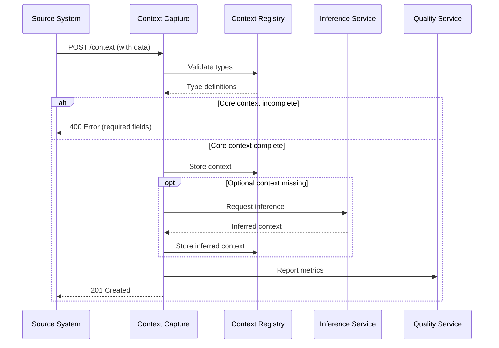
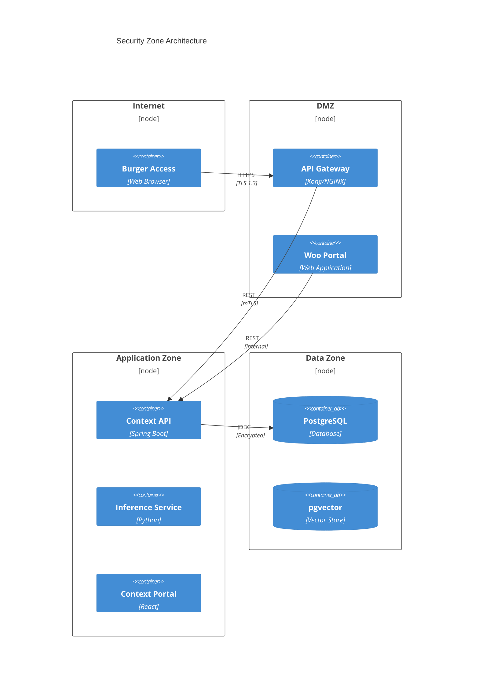

# High-Level Design: Context-Aware Data Architecture

> **Template Origin**: Official | **ArcKit Version**: 4.3.1 | **Command**: `/arckit:hld-review`

## Document Control

| Field | Value |
|-------|-------|
| **Document ID** | ARC-003-HLD-v1.0 |
| **Document Type** | High-Level Design |
| **Project** | Context-Aware Data Architecture (Project 003) |
| **Classification** | OFFICIAL |
| **Status** | DRAFT |
| **Version** | 1.0 |
| **Created Date** | 2026-04-19 |
| **Last Modified** | 2026-04-19 |
| **Review Cycle** | Per Phase |
| **Next Review Date** | 2026-05-19 |
| **Owner** | Enterprise Architect |
| **Reviewed By** | PENDING |
| **Approved By** | PENDING |
| **Distribution** | Project Team, Architecture Team, MinJus Leadership |

## Revision History

| Version | Date | Author | Changes | Approved By | Approval Date |
|---------|------|--------|---------|-------------|---------------|
| 1.0 | 2026-04-19 | ArcKit AI | Initial creation from `/arckit:hld-review` command | PENDING | PENDING |

---

## Executive Summary

### Overview

This High-Level Design (HLD) document defines the architecture for the Context-Aware Data system within the Ministry of Justice & Security. The system implements the Data→Informatie transformation principle, where raw data becomes meaningful information through contextual metadata.

The architecture establishes:
- **Context Capture Service** for collecting contextual metadata at source
- **Context Registry** for storing and managing context types and values
- **Context Inference Service** for AI-powered context enrichment
- **Context Quality Service** for monitoring and maintaining context quality
- **Integration with Metadata Registry** (Project 002) for shared governance

### Key Design Decisions

| Decision ID | Decision | Rationale |
|-------------|----------|-----------|
| HLD-D-001 | PostgreSQL as primary database with pgvector extension | Strong ACID guarantees, excellent JSON support, AVG-compliant |
| HLD-D-002 | Layered context model (Core, Domain, Semantic, Provenance) | Balances completeness with usability per principle C4 |
| HLD-D-003 | Context co-located with data entity (not separate service) | Ensures atomic access per principle C8 |
| HLD-D-004 | Inference as last resort with human review | Privacy by design per principle C7 |
| HLD-D-005 | API-first design with RESTful endpoints | Interoperability per principle P8 |

### Architecture Diagram

```mermaid
C4Context
    title Context-Aware Data Architecture Context
    
    Enterprise(minjus, "Ministry of Justice & Security", "MinJus") {
        Person(informatiemanager, "Informatiemanager")
        Person(archivaris, "Archivaris")
        Person(burger, "Burger")
        
        System_Ext(zsysteem, "Zaaksystemen", "Legacy zaaksystemen")
        System_Ext(dms, "Document Management", "Existing DMS")
        
        SystemClr(contextSystem, "Context-Aware Data", "Context capture & management") {
            System(capture, "Context Capture API")
            System(registry, "Context Registry")
            System(inference, "Context Inference")
            System(quality, "Context Quality")
            System(ui, "Context Portal")
        }
        
        System(mdRegistry, "Metadata Registry", "Project 002")
        System(woo, "Woo Publicatie", "Woo portal")
    }
    
    Rel(informatiemanager, capture, "Captures context", "REST")
    Rel(archivaris, ui, "Manages context types", "Web UI")
    Rel(burger, woo, "Requests information", "HTTPS")
    
    Rel(zsysteem, capture, "Submits context", "REST")
    Rel(dms, capture, "Submits context", "REST")
    
    Rel(capture, registry, "Stores context", "JDBC")
    Rel(capture, inference, "Requests inference", "REST")
    Rel(capture, quality, "Reports quality", "REST")
    
    Rel(registry, mdRegistry, "Syncs context types", "REST")
    Rel(woo, registry, "Queries context", "REST")
```

### Principles Compliance Summary

| Principle | Status | Notes |
|-----------|--------|-------|
| C1: Context by Design | ✅ COMPLIANT | Context in all data models from initial design |
| C2: Minimal Overhead | ✅ COMPLIANT | < 2 minutes extra, 50%+ automation target |
| C3: Explicit Context Model | ✅ COMPLIANT | Documented in ARC-003-DATA |
| C4: Context Layering | ✅ COMPLIANT | 4-layer model implemented |
| C5: Context-Integrity | ✅ COMPLIANT | Referential integrity enforced |
| C6: Capture at Source | ✅ COMPLIANT | API available at data entry points |
| C7: Inference Last Resort | ✅ COMPLIANT | Labeled, reviewable, confidence-scored |
| C8: Context Co-Location | ✅ COMPLIANT | Stored with parent entity |
| C9: Context Indexing | ✅ COMPLIANT | All core context indexed |
| C10: Context IS Personal Data | ✅ COMPLIANT | DPIA required, privacy controls in place |
| C11: Context Minimization | ✅ COMPLIANT | Only necessary context collected |
| C12: Context Validation | ✅ COMPLIANT | Quality rules per layer |
| C13: Context Freshness | ✅ COMPLIANT | Timestamps and validity periods |
| C14: Context-First Search | ✅ COMPLIANT | Search API prioritizes context |
| C15: Context Visualization | ✅ COMPLIANT | UI includes context visualization |
| C16: Context Stewardship | ✅ COMPLIANT | Each type has assigned steward |
| C17: Context Evolution | ✅ COMPLIANT | Versioned schema with change management |

---

## Architecture Overview

### System Goals

1. **G-1: Data→Informatie Transformatie** - Transform raw data into meaningful information through context
2. **G-2: Context-Aware Metadata Schema** - Implement usable, comprehensive context capture
3. **G-3: AVG/GDPR Compliance** - Ensure context metadata is privacy-compliant
4. **G-4: ROI Demonstratie** - Prove value through quality metrics and efficiency gains

### Quality Attributes

| Attribute | Target | Measurement |
|-----------|--------|-------------|
| **Availability** | 99.5% uptime | Monthly uptime monitoring |
| **Performance** | < 500ms API response | p95 latency |
| **Scalability** | 10M+ context records | Horizontal scaling |
| **Security** | AVG compliant | DPIA + annual audit |
| **Usability** | < 2 min extra overhead | Time measurement |
| **Quality** | 95%+ accuracy | Quality monitoring |

### Constraints

| Constraint | Impact |
|------------|--------|
| AVG/GDPR compliance | Privacy-by-design required |
| Archiefwet 1995 | 20-year retention for decisions |
| Woo requirements | Publication metadata mandatory |
| Legacy integration | Must work with existing systems |
| Budget | Phase 1: €500k, Phase 2: €1.2M |

---

## Component Architecture

### Component Diagram

```mermaid
C4Component
    title Context-Aware Data Component Architecture
    
    Enterprise_Boundary(minjus, "Ministry of Justice") {
        Container(registry, "Context Registry", "PostgreSQL + pgvector", "Stores context types and values") {
            Component(contextAPI, "Context API", "REST Service", "CRUD operations for context")
            Component(validation, "Validation Engine", "Rule Engine", "Quality validation")
            Component(storage, "Storage Layer", "Database", "Persistent storage")
        }
        
        Container(capture, "Context Capture Service", "Spring Boot", "Ingests context") {
            Component(restAPI, "REST API", "REST Controller", "HTTP endpoints")
            Component(graphql, "GraphQL API", "GraphQL", "Flexible queries")
            Component(auth, "Auth Filter", "Security", "JWT validation")
        }
        
        Container(inference, "Context Inference Service", "Python + Anthropic", "AI enrichment") {
            Component(ner, "NER Engine", "spaCy/LLM", "Named entity recognition")
            Component(classifier, "Classifier", "Scikit-learn", "Text classification")
            Component(review, "Review Queue", "Workflow", "Human validation")
        }
        
        Container(quality, "Context Quality Service", "Python", "Quality monitoring") {
            Component(monitor, "Quality Monitor", "Scheduler", "Periodic checks")
            Component(dashboard, "Quality Dashboard", "Web UI", "Metrics visualization")
            Component(alerting, "Alerting", "Notification", "Issue alerts")
        }
        
        Container(portal, "Context Portal", "React", "Management UI") {
            Component(typeManager, "Type Manager", "UI Module", "Manage context types")
            Component(steward, "Stewardship", "UI Module", "Assign stewards")
            Component(reports, "Reports", "UI Module", "Quality reports")
        }
        
        ContainerDb(mdRegistry, "Metadata Registry", "ArangoDB", "Shared metadata") {
            ComponentDb(mdAPI, "MD API", "REST", "Metadata synchronization")
        }
    }
    
    Rel(capture, registry, "Store context", "JDBC/async")
    Rel(capture, inference, "Request inference", "REST")
    Rel(capture, quality, "Report metrics", "REST")
    Rel(inference, registry, "Store inference", "JDBC")
    Rel(portal, registry, "Manage types", "REST")
    Rel(portal, quality, "View quality", "REST")
    Rel(registry, mdRegistry, "Sync types", "REST")
```

### Component Descriptions

#### Context Capture Service

**Purpose**: Ingest contextual metadata from various source systems

**Responsibilities**:
- Receive context via REST/GraphQL APIs
- Validate context against type definitions
- Store context in registry
- Trigger inference for missing optional context
- Report quality metrics

**Technology Stack**:
- Language: Java 21
- Framework: Spring Boot 3.2
- Database: PostgreSQL 15 via JDBC
- Security: Spring Security with JWT

**Key Endpoints**:
```
POST   /api/v1/objects/{id}/context     - Create/update context
GET    /api/v1/objects/{id}/context     - Retrieve all context
DELETE /api/v1/objects/{id}/context/{id} - Delete context
GET    /api/v1/context/types            - List context types
```

#### Context Registry

**Purpose**: Persistent storage and management of contextual metadata

**Responsibilities**:
- Store context records with referential integrity
- Maintain context type definitions
- Enforce validation rules
- Provide query interface for context retrieval

**Technology Stack**:
- Database: PostgreSQL 15
- Extensions: pgvector (semantic search), apache_age (graph queries)
- Schema: As defined in ARC-003-DATA

**Data Model**:
- Core tables: informationobject, context, contexttype, contextlayer
- Support tables: contextinference, contextquality, informationdomain, contextstewardship

#### Context Inference Service

**Purpose**: AI-powered context enrichment when manual capture is not feasible

**Responsibilities**:
- Analyze text content for context entities
- Extract legal references, case numbers, subjects
- Score confidence and flag for review
- Store inferred context with provenance

**Technology Stack**:
- Language: Python 3.11
- Framework: FastAPI
- AI: Anthropic Claude API
- NLP: spaCy, transformers

**Inference Types**:
- Legal basis extraction (BWBR references)
- Subject classification (policy domains)
- Named entity recognition (persons, organizations)
- Case number detection

#### Context Quality Service

**Purpose**: Monitor and maintain context quality

**Responsibilities**:
- Validate context completeness per layer
- Detect stale or inconsistent context
- Generate quality reports and dashboards
- Alert on quality issues

**Quality Rules**:
- Core layer: 100% completeness required
- Domain layer: 90% completeness target
- Semantic layer: 70% completeness target
- Provenance layer: 100% completeness required

#### Context Portal

**Purpose**: Administrative interface for context management

**Capabilities**:
- Context type definition and management
- Stewardship assignment
- Quality dashboard viewing
- Context search and visualization

---

## Data Architecture

### Data Flow



### Database Schema

The database schema is defined in detail in [ARC-003-DATA-v1.0.md](./ARC-003-DATA-v1.0.md). Key design decisions:

**Table Structures**:
```
informationobject (1) ──┬── (N) context
                       │
contextlayer (1) ─────┼── (N) contexttype ── (1) ─── (N) context
                       │
context (N) ──────────┼── (1) contextinference
                       │
context (N) ──────────┴── (1) contextquality
```

**Indexing Strategy**:
- Primary keys on all entity_id columns
- Foreign key indexes for referential integrity
- Composite indexes on (object_id, type_id, valid_from)
- Full-text indexes on context_value columns
- Vector indexes for semantic similarity (pgvector)

**Data Partitioning**:
- Partition context table by created_at (monthly)
- Partition informationobject by retention_date
- Partition contextquality by assessed_at

### Data Lifecycle

```
┌─────────────────────────────────────────────────────────────────┐
│                    Context Data Lifecycle                        │
│                                                                  │
│  CAPTURE → VALIDATE → STORE → INFER(optional) → QUALITY CHECK  │
│     ↓          ↓         ↓              ↓              ↓         │
│   Source    Type     Registry       AI Service    Monitoring     │
│   System   Rules      (Postgres)    (Claude)      (Alerts)      │
│                                                                  │
│  RETENTION:                                                      │
│  - Active: 1-20 years (per object type)                         │
│  - Archive: Transfer to National Archive                       │
│  - Delete: Anonymize PII after retention                        │
└─────────────────────────────────────────────────────────────────┘
```

---

## Integration Architecture

### Integration Points

```mermaid
C4Container
    title Context-Aware Data Integration Architecture
    
    System_Ext(zaak, "Zaaksysteem", "Legacy case management")
    System_Ext(dms, "DMS", "Document management")
    System_Ext(cm, "Content Management", "Web CMS")
    
    System(container, "Context-Aware Data", "Context services") {
        Container(api, "Context API", "REST/GraphQL")
    }
    
    System(md, "Metadata Registry", "Shared metadata")
    System(na, "National Archive", "Archival storage")
    System(woo, "Woo Portal", "Public access")
    
    Rel(zaak, api, "Submit context", "REST")
    Rel(dms, api, "Submit context", "REST")
    Rel(cm, api, "Submit context", "REST")
    
    Rel(api, md, "Sync types", "REST")
    Rel(api, na, "Archive context", "SFTP")
    Rel(woo, api, "Query context", "REST")
```

### API Specifications

#### Context Submission API

**Endpoint**: `POST /api/v1/objects/{object_id}/context`

**Request**:
```json
{
  "object_id": "obj-123",
  "object_type": "BESLUIT",
  "context": {
    "core": {
      "creator": "user-123",
      "created_at": "2026-04-19T10:00:00Z",
      "title": "Besluit intrekking"
    },
    "domain": {
      "case_number": "ZA-2026-001234",
      "case_type": "asiel"
    }
  }
}
```

**Response**:
```json
{
  "context_id": "ctx-456",
  "status": "created",
  "completeness": {
    "core": 1.0,
    "domain": 1.0,
    "overall": 1.0
  },
  "quality_score": 1.0
}
```

#### Context Query API

**Endpoint**: `GET /api/v1/objects/{object_id}/context`

**Query Parameters**:
- `layer`: CORE, DOMAIN, SEMANTIC, PROVENANCE
- `include_inferred`: true/false
- `valid_at`: ISO 8601 timestamp

**Response**:
```json
{
  "object_id": "obj-123",
  "context": {
    "core": [...],
    "domain": [...]
  },
  "metadata": {
    "created_at": "2026-04-19T10:00:00Z",
    "modified_at": "2026-04-19T14:00:00Z"
  }
}
```

### Integration with Metadata Registry

The Context-Aware Data system integrates with the Metadata Registry (Project 002) for:

1. **Context Type Registration**: New context types registered centrally
2. **Validation Rules**: Shared rule definitions
3. **Stewardship Mapping**: Common steward definitions
4. **Value Lists**: Shared enumerated values

**Sync Mechanism**:
- Event-driven synchronization via message queue
- Bi-directional sync for context type changes
- Conflict resolution: Registry wins

---

## Security Architecture

### Security Zones



### Security Controls

**Authentication**:
- JWT tokens via Uitgiftebron (MinJus identity provider)
- MFA required for stewardship operations
- Service-to-service: Mutual TLS

**Authorization**:
- RBAC with roles: Informatiemanager, Steward, Admin, Auditor
- Attribute-based access control (ABAC) for context with PII
- Domain-based access control

**Data Protection**:
- Encryption at rest: PostgreSQL AES-256
- Encryption in transit: TLS 1.3
- PII pseudonymization in context values
- Audit logging for all context access

**Privacy Compliance**:
- DPIA executed (requirement G-3)
- Data minimization enforced (principle C11)
- Right to erasure supported
- Data subject access requests supported

### Threat Model

| Threat | Likelihood | Impact | Mitigation |
|--------|------------|--------|------------|
| Unauthorized context access | MEDIUM | HIGH | RBAC + audit logging |
| Context poisoning | LOW | HIGH | Validation + source verification |
| Inference bias | MEDIUM | MEDIUM | Human review + confidence thresholds |
| PII leakage via context | MEDIUM | HIGH | Encryption + access controls |
| Context deletion attack | LOW | HIGH | Soft delete + retention policies |

---

## Deployment Architecture

### Container Orchestration

```mermaid
C4Deployment
    title Kubernetes Deployment Architecture
    
    Deployment_Node(k8s, "Kubernetes Cluster") {
        Container(namespace, "context-aware") {
            Deployment_Node(ui, "Frontend") {
                Container(react, "React Portal", "Nginx")
            }
            
            Deployment_Node(backend, "Backend") {
                Container(capture, "Context Capture", "Spring Boot")
                Container(inference, "Inference Service", "Python")
                Container(quality, "Quality Service", "Python")
            }
            
            Deployment_Node(db, "Database") {
                ContainerDb(pg, "PostgreSQL", "StatefulSet")
            }
        }
    }
```

### Infrastructure Requirements

**Development**:
- 2 nodes, 4 CPU, 16 GB RAM each
- PostgreSQL: 100 GB storage
- Kubernetes: Minikube for local dev

**Production**:
- 6 nodes (3 per AZ), 8 CPU, 32 GB RAM each
- PostgreSQL: 2 TB storage with IOPS
- Kubernetes: AKS/EKS/GKE managed
- Multi-AZ deployment for HA

**Disaster Recovery**:
- RPO: 15 minutes (transaction log shipping)
- RTO: 1 hour (automated failover)
- Backup: Daily full, hourly incremental
- Geo-replication: Cross-region (async)

---

## Operational Architecture

### Monitoring Strategy

**Metrics Collection**:
- Application: Prometheus + Grafana
- Logs: ELK Stack (Elasticsearch, Logstash, Kibana)
- Traces: OpenTelemetry + Jaeger

**Key Metrics**:
- API response times (p50, p95, p99)
- Error rates by endpoint
- Context completeness scores
- Inference confidence distribution
- Database query performance

**Alerting**:
- PagerDuty integration for critical alerts
- Email for warnings
- Dashboard for informational

### CI/CD Pipeline

```
┌─────────────────────────────────────────────────────────────────┐
│                     CI/CD Pipeline                               │
│                                                                  │
│  DEVELOP → TEST → BUILD → DEPLOY DEV → DEPLOY TEST → DEPLOY PROD │
│     ↓        ↓       ↓          ↓              ↓              ↓   │
│  GitHub   Jest  Docker   K8s Dev        K8s Test       K8s Prod  │
│  Actions  JUnit Image                                   (Blue-   │
│                                                       Green)    │
└─────────────────────────────────────────────────────────────────┘
```

**Pipeline Stages**:
1. **Lint**: Code quality checks
2. **Test**: Unit + integration tests
3. **Build**: Docker image creation
4. **Security Scan**: Vulnerability scanning
5. **Deploy Dev**: Automated to dev environment
6. **Deploy Test**: Manual approval required
7. **Deploy Prod**: Manual approval + blue-green deployment

### Runbook Procedures

**Incident Response**:
1. Detection: Alert triggers
2. Identification: Determine severity
3. Containment: Mitigate immediate impact
4. Resolution: Fix root cause
5. Recovery: Restore normal operations
6. Postmortem: Document and learn

**Common Issues**:
- Database connection pool exhaustion
- Inference service timeout
- High memory usage in quality service
- API rate limiting exceeded

---

## Cross-Cutting Concerns

### Accessibility (WCAG 2.1)

- Context Portal: WCAG 2.1 AA compliant
- Screen reader support for context visualization
- Keyboard navigation for all functions
- Color contrast ratios met

### Internationalization

- Dutch (primary language)
- English (for technical documentation)
- Unicode support for context values
- Localized date/time formats

### Performance Optimization

**Caching Strategy**:
- API Gateway: Response caching (5 min)
- Application: Redis for session cache
- Database: Query plan caching

**Database Optimization**:
- Connection pooling: HikariCP
- Read replicas for query scaling
- Materialized views for common queries

### Scalability Strategy

**Horizontal Scaling**:
- Stateless application design
- Kubernetes HPA for auto-scaling
- Database read replicas

**Vertical Scaling**:
- PostgreSQL: Scale up storage/CPU
- Vector operations: GPU for inference

---

## Implementation Roadmap

### Phase 1: Foundation (Months 1-3)

**Deliverables**:
- Context Capture API (core context only)
- Context Registry database
- Basic Context Portal
- Integration with Metadata Registry

**Success Criteria**:
- Core context can be captured and stored
- API responds in < 500ms
- 90%+ data quality for core context

### Phase 2: Enhancement (Months 4-6)

**Deliverables**:
- Domain and semantic context support
- Context Inference Service
- Context Quality Service
- Advanced visualizations

**Success Criteria**:
- All 4 context layers supported
- Inference confidence > 0.8 for accepted results
- Quality dashboard operational

### Phase 3: Integration (Months 7-9)

**Deliverables**:
- Integration with legacy zaaksystemen
- Integration with DMS
- Woo publication workflow
- Archival workflow

**Success Criteria**:
- 3+ source systems integrated
- Woo queries return context-enriched results
- Archive acceptance validated

### Phase 4: Optimization (Months 10-12)

**Deliverables**:
- Performance optimization
- Security hardening
- Documentation and training
- Handover to operations

**Success Criteria**:
- 99.5% uptime achieved
- Security audit passed
- Operations team trained

---

## Risk Assessment

### Technical Risks

| Risk | Likelihood | Impact | Mitigation | Owner |
|------|------------|--------|------------|-------|
| Inference accuracy insufficient | MEDIUM | HIGH | Human review, confidence thresholds | Data Science |
| Database performance at scale | LOW | HIGH | Read replicas, partitioning | DBA |
| Legacy system integration issues | HIGH | MEDIUM | Adapter pattern, extensive testing | Integration |
| PII leakage via context | LOW | HIGH | Encryption, access controls | Security |

### Operational Risks

| Risk | Likelihood | Impact | Mitigation | Owner |
|------|------------|--------|------------|-------|
| User resistance to context capture | HIGH | HIGH | Training, UX optimization, automation | Change Management |
| Stewardship not maintained | MEDIUM | MEDIUM | Automated reminders, workflow integration | Governance |
| Budget overrun | MEDIUM | HIGH | Phased delivery, regular reviews | PMO |

---

## Appendices

### Appendix A: Glossary

| Term | Definition |
|------|------------|
| **Context** | Metadata that describes the who, what, when, where, why of an information object |
| **Data→Informatie** | The transformation of raw data into meaningful information through context |
| **Context Layer** | One of four levels (Core, Domain, Semantic, Provenance) organizing context by complexity |
| **Inference** | AI/ML-derived context when manual capture is not feasible |
| **Stewardship** | Ownership and responsibility for a context type definition |

### Appendix B: References

| Document | Type | Location |
|----------|------|----------|
| ARC-003-PRIN-v1.0 | Principles | ./ARC-003-PRIN-v1.0.md |
| ARC-003-STKE-v1.0 | Stakeholders | ./ARC-003-STKE-v1.0.md |
| ARC-003-DATA-v1.0 | Data Model | ./ARC-003-DATA-v1.0.md |
| ARC-002-DATA-v1.0 | Metadata Registry | ../002-metadata-registry/ |
| Data versus informatie | MinJus Presentation | See external/README.md |

### Appendix C: Decision Log

| ID | Date | Decision | Rationale |
|----|------|----------|-----------|
| HLD-D-001 | 2026-04-19 | PostgreSQL as primary database | Strong ACID, JSON support, AVG-compliant |
| HLD-D-002 | 2026-04-19 | Layered context model | Balances completeness with usability |
| HLD-D-003 | 2026-04-19 | Context co-located with data | Ensures atomic access per C8 |
| HLD-D-004 | 2026-04-19 | Inference as last resort | Privacy by design per C7 |
| HLD-D-005 | 2026-04-19 | API-first design | Interoperability per P8 |

---

**Generated by**: ArcKit `/arckit:hld-review` command
**Generated on**: 2026-04-19
**ArcKit Version**: 4.3.1
**Project**: Context-Aware Data Architecture (Project 003)
**AI Model**: claude-opus-4-7
**Generation Context**: Created from principles (ARC-003-PRIN), stakeholders (ARC-003-STKE), and data model (ARC-003-DATA) documents
