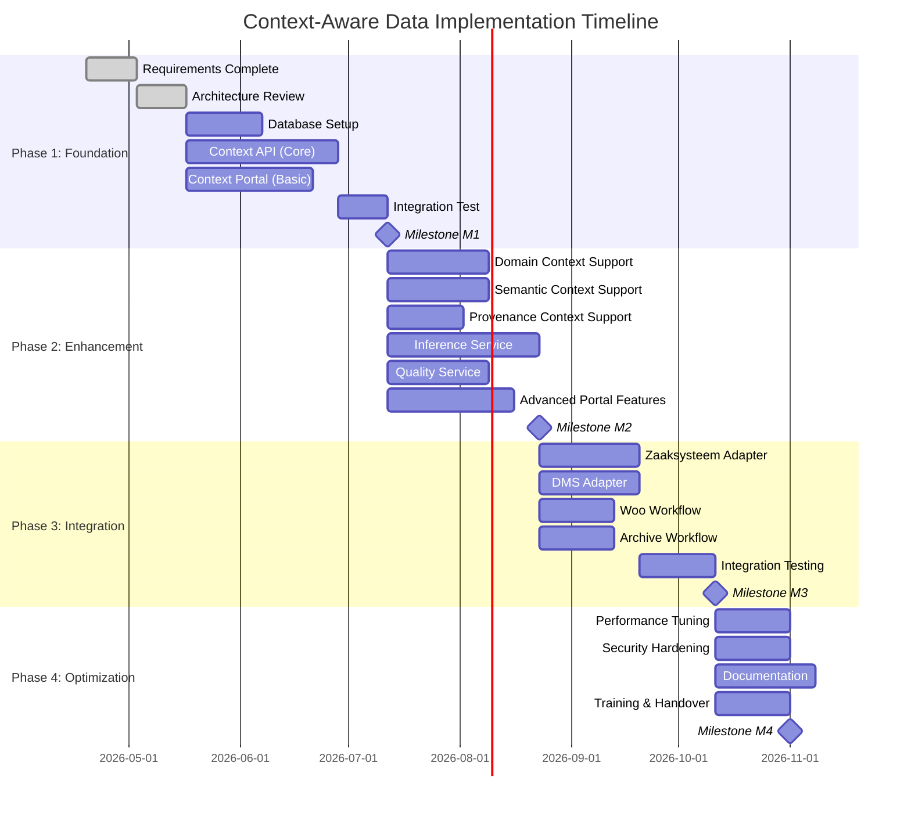

# Implementation Plan: Context-Aware Data Architecture

> **Template Origin**: Official | **ArcKit Version**: 4.3.1 | **Command**: `/arckit:plan`

## Document Control

| Field | Value |
|-------|-------|
| **Document ID** | ARC-003-PLAN-v1.0 |
| **Document Type** | Implementation Plan |
| **Project** | Context-Aware Data Architecture (Project 003) |
| **Classification** | OFFICIAL |
| **Status** | DRAFT |
| **Version** | 1.0 |
| **Created Date** | 2026-04-19 |
| **Last Modified** | 2026-04-19 |
| **Review Cycle** | Per Sprint |
| **Next Review Date** | 2026-05-01 |
| **Owner** | Project Lead |
| **Reviewed By** | PENDING |
| **Approved By** | PENDING |
| **Distribution** | Project Team, Architecture Team, MinJus Leadership |

## Revision History

| Version | Date | Author | Changes | Approved By | Approval Date |
|---------|------|--------|---------|-------------|---------------|
| 1.0 | 2026-04-19 | ArcKit AI | Initial creation from `/arckit:plan` command | PENDING | PENDING |

---

## Executive Summary

### Overview

This implementation plan defines the phased approach for delivering the Context-Aware Data Architecture system within the Ministry of Justice & Security. The project spans 12 months across 4 phases, delivering a production-ready system that transforms raw data into meaningful information through contextual metadata.

**Total Duration**: 12 months (4 quarters)
**Total Budget**: €1.7M (Phase 1: €500k, Phase 2: €600k, Phase 3: €400k, Phase 4: €200k)
**Team Size**: 12 FTE (varies by phase)

### Key Milestones

| Milestone | Date | Deliverable | Gate |
|-----------|------|-------------|------|
| M1: Foundation Complete | 2026-07-15 | Core context capture operational | Go/No-Go for Phase 2 |
| M2: Enhancement Complete | 2026-10-15 | All context layers + inference | Go/No-Go for Phase 3 |
| M3: Integration Complete | 2027-01-15 | Legacy systems integrated | Go/No-Go for Phase 4 |
| M4: Production Ready | 2027-04-15 | Full system operational | Sign-off |

### Success Criteria

- **Technical**: 99.5% uptime, < 500ms API response, 95%+ context quality
- **Business**: < 2 minutes extra overhead, 50%+ automation, positive ROI
- **Compliance**: AVG-approved DPIA, Archiefwet compliant, Woo compliant

---

## Project Timeline



---

## Phase 1: Foundation (Months 1-3)

### Objectives

1. Establish core infrastructure and database
2. Implement core context capture and storage
3. Deliver basic context management UI
4. Integrate with Metadata Registry
5. Complete DPIA for core context

### Deliverables

| Deliverable | Description | Acceptance Criteria |
|-------------|-------------|---------------------|
| Database Schema | PostgreSQL with context tables | All entities from ARC-003-DATA implemented |
| Context API | REST API for core context | Swagger docs, < 500ms response |
| Context Portal | Basic UI for context management | Can create/update core context |
| Metadata Registry Sync | Bi-directional sync | Context types synchronized |
| DPIA Core | Data protection assessment | Approved by Privacy Officer |

### Work Breakdown Structure

#### 1.1 Infrastructure Setup (3 weeks)

**Task**: Set up development, test, and production infrastructure

**Sub-tasks**:
- 1.1.1 Provision Kubernetes cluster (dev/test/prod)
- 1.1.2 Configure PostgreSQL with pgvector extension
- 1.1.3 Set up CI/CD pipeline (GitHub Actions)
- 1.1.4 Configure monitoring (Prometheus/Grafana)
- 1.1.5 Set up logging (ELK Stack)

**Owner**: DevOps Engineer
**Effort**: 3 weeks
**Dependencies**: None

#### 1.2 Database Implementation (2 weeks)

**Task**: Implement context database schema

**Sub-tasks**:
- 1.2.1 Create database migrations (Flyway)
- 1.2.2 Implement all entities from ARC-003-DATA
- 1.2.3 Create indexes and constraints
- 1.2.4 Set up database backup/restore

**Owner**: Database Developer
**Effort**: 2 weeks
**Dependencies**: 1.1 (Infrastructure)

#### 1.3 Context API - Core (6 weeks)

**Task**: Implement REST API for core context capture

**Sub-tasks**:
- 1.3.1 Spring Boot project setup
- 1.3.2 Core context endpoints (CRUD)
- 1.3.3 Validation engine implementation
- 1.3.4 Authentication/authorization (JWT)
- 1.3.5 Integration with PostgreSQL
- 1.3.6 Unit and integration tests

**Owner**: Backend Developer (2 FTE)
**Effort**: 6 weeks
**Dependencies**: 1.2 (Database)

#### 1.4 Context Portal - Basic (5 weeks)

**Task**: Implement basic UI for context management

**Sub-tasks**:
- 1.4.1 React project setup
- 1.4.2 Context type management UI
- 1.4.3 Context capture form
- 1.4.4 Context visualization (basic)
- 1.4.5 Responsive design

**Owner**: Frontend Developer
**Effort**: 5 weeks
**Dependencies**: 1.3 (API)

#### 1.5 Metadata Registry Integration (2 weeks)

**Task**: Integrate with Metadata Registry for context types

**Sub-tasks**:
- 1.5.1 Implement sync client
- 1.5.2 Configure event-driven updates
- 1.5.3 Test type synchronization

**Owner**: Integration Developer
**Effort**: 2 weeks
**Dependencies**: 1.3 (API)

#### 1.6 DPIA and Compliance (3 weeks)

**Task**: Complete DPIA for core context processing

**Sub-tasks**:
- 1.6.1 Privacy impact analysis
- 1.6.2 Risk assessment
- 1.6.3 Mitigation measures documentation
- 1.6.4 Privacy Officer review

**Owner**: Privacy Officer + Architect
**Effort**: 3 weeks (concurrent with development)
**Dependencies**: 1.2 (Database schema)

### Resources

| Role | FTE | Duration |
|------|-----|----------|
| Project Lead | 1.0 | 3 months |
| Solution Architect | 0.5 | 3 months |
| Backend Developer | 2.0 | 3 months |
| Frontend Developer | 1.0 | 3 months |
| Database Developer | 1.0 | 2 months |
| DevOps Engineer | 1.0 | 3 months |
| QA Engineer | 0.5 | 3 months |
| **Total** | **6.5** | **3 months** |

### Budget

| Category | Amount |
|----------|--------|
| Personnel (€100k/FTE) | €650k |
| Infrastructure (Azure/AWS) | €50k |
| Tools & Licenses | €30k |
| Training | €20k |
| Contingency (10%) | €75k |
| **Total Phase 1** | **€825k** |

### Risks & Mitigations

| Risk | Mitigation | Owner |
|------|------------|-------|
| PostgreSQL performance issues | Early performance testing, read replicas | DBA |
| Team learning curve for Spring Boot | Training, pair programming | Tech Lead |
| DPIA delays project | Start early, parallel track | Privacy Officer |

### Gate Criteria (M1)

**Must Have**:
- ✅ Core context can be captured and retrieved
- ✅ API responds in < 500ms (p95)
- ✅ 90%+ data quality for core context
- ✅ DPIA approved by Privacy Officer

**Should Have**:
- ✅ Context Portal functional for basic operations
- ✅ Metadata Registry sync operational

---

## Phase 2: Enhancement (Months 4-6)

### Objectives

1. Implement all four context layers
2. Deliver Context Inference Service
3. Deliver Context Quality Service
4. Enhance Context Portal with advanced features

### Deliverables

| Deliverable | Description | Acceptance Criteria |
|-------------|-------------|---------------------|
| Domain Context | Case/project/policy context | Supports all MinJus domains |
| Semantic Context | Legal basis, subjects, relationships | Semantic search operational |
| Provenance Context | Audit trail, versioning | Full provenance tracking |
| Inference Service | AI-powered context enrichment | > 0.8 confidence for accepted |
| Quality Service | Monitoring and dashboards | Quality dashboard live |
| Enhanced Portal | Advanced UI features | Visualizations, stewardship |

### Work Breakdown Structure

#### 2.1 Domain Context Implementation (4 weeks)

**Task**: Implement domain-specific context support

**Sub-tasks**:
- 2.1.1 Define domain context types (IND, OM, Rechtspraak, etc.)
- 2.1.2 Implement domain validation rules
- 2.1.3 Create domain-specific UI components
- 2.1.4 Test with domain experts

**Owner**: Backend Developer + Domain Expert
**Effort**: 4 weeks
**Dependencies**: M1 (Foundation)

#### 2.2 Semantic Context Implementation (4 weeks)

**Task**: Implement semantic context with relationships

**Sub-tasks**:
- 2.2.1 Implement semantic context types
- 2.2.2 Configure pgvector for vector similarity
- 2.2.3 Implement semantic search API
- 2.2.4 Create relationship visualization

**Owner**: Backend Developer
**Effort**: 4 weeks
**Dependencies**: M1 (Foundation)

#### 2.3 Provenance Context Implementation (3 weeks)

**Task**: Implement provenance tracking

**Sub-tasks**:
- 2.3.1 Implement audit logging
- 2.3.2 Create context versioning
- 2.3.3 Build provenance timeline UI
- 2.3.4 Implement archiving preparation

**Owner**: Backend Developer
**Effort**: 3 weeks
**Dependencies**: M1 (Foundation)

#### 2.4 Inference Service Implementation (6 weeks)

**Task**: Build AI-powered context inference

**Sub-tasks**:
- 2.4.1 Set up Anthropic Claude integration
- 2.4.2 Implement NER for legal references
- 2.4.3 Implement case number extraction
- 2.4.4 Implement subject classification
- 2.4.5 Build confidence scoring
- 2.4.6 Create human review workflow
- 2.4.7 Implement inference API

**Owner**: Data Scientist + Backend Developer
**Effort**: 6 weeks
**Dependencies**: M1 (Foundation)

#### 2.5 Quality Service Implementation (4 weeks)

**Task**: Build context quality monitoring

**Sub-tasks**:
- 2.5.1 Implement quality rules engine
- 2.5.2 Create quality metrics calculator
- 2.5.3 Build quality dashboard
- 2.5.4 Configure alerting
- 2.5.5 Implement quality reports

**Owner**: Backend Developer
**Effort**: 4 weeks
**Dependencies**: 2.1-2.3 (All context layers)

#### 2.6 Enhanced Portal Features (5 weeks)

**Task**: Add advanced UI features

**Sub-tasks**:
- 2.6.1 Context visualization components
- 2.6.2 Stewardship management UI
- 2.6.3 Quality dashboard integration
- 2.6.4 Advanced search and filtering
- 2.6.5 Bulk context operations

**Owner**: Frontend Developer
**Effort**: 5 weeks
**Dependencies**: 2.4-2.5 (New services)

### Resources

| Role | FTE | Duration |
|------|-----|----------|
| Project Lead | 1.0 | 3 months |
| Solution Architect | 0.5 | 3 months |
| Backend Developer | 2.5 | 3 months |
| Frontend Developer | 1.0 | 3 months |
| Data Scientist | 1.0 | 3 months |
| QA Engineer | 1.0 | 3 months |
| **Total** | **7.0** | **3 months** |

### Budget

| Category | Amount |
|----------|--------|
| Personnel (€100k/FTE) | €700k |
| Anthropic API Credits | €30k |
| Infrastructure | €40k |
| Contingency (10%) | €77k |
| **Total Phase 2** | **€847k** |

### Gate Criteria (M2)

**Must Have**:
- ✅ All four context layers operational
- ✅ Inference service with > 0.8 confidence
- ✅ Quality dashboard live
- ✅ Semantic search functional

**Should Have**:
- ✅ 50%+ automation for domain context
- ✅ Human review workflow operational

---

## Phase 3: Integration (Months 7-9)

### Objectives

1. Integrate with legacy zaaksystemen
2. Integrate with DMS
3. Implement Woo publication workflow
4. Implement archival workflow

### Deliverables

| Deliverable | Description | Acceptance Criteria |
|-------------|-------------|---------------------|
| Zaaksysteem Adapter | Integration with case systems | 3+ systems integrated |
| DMS Adapter | Integration with document management | 2+ systems integrated |
| Woo Workflow | Publication workflow | End-to-end tested |
| Archive Workflow | Transfer to National Archive | NA validation passed |

### Work Breakdown Structure

#### 3.1 Zaaksysteem Integration (4 weeks)

**Task**: Build adapters for zaaksystemen

**Sub-tasks**:
- 3.1.1 Analyze zaaksysteem APIs (Centric, Quadrum, etc.)
- 3.1.2 Build generic adapter framework
- 3.1.3 Implement Centric adapter
- 3.1.4 Implement Quadrum adapter
- 3.1.5 Test context extraction
- 3.1.6 Deploy to test environment

**Owner**: Integration Developer
**Effort**: 4 weeks
**Dependencies**: M2 (Enhancement)

#### 3.2 DMS Integration (4 weeks)

**Task**: Build adapters for document management

**Sub-tasks**:
- 3.2.1 Analyze DMS APIs (Documentum, SharePoint)
- 3.2.2 Build generic adapter framework
- 3.2.3 Implement Documentum adapter
- 3.2.4 Implement SharePoint adapter
- 3.2.5 Test metadata extraction
- 3.2.6 Deploy to test environment

**Owner**: Integration Developer
**Effort**: 4 weeks
**Dependencies**: M2 (Enhancement)

#### 3.3 Woo Publication Workflow (3 weeks)

**Task**: Implement Woo publication with context

**Sub-tasks**:
- 3.3.1 Design publication workflow
- 3.3.2 Implement Woo classification logic
- 3.3.3 Build publication API
- 3.3.4 Integrate with Woo Portal
- 3.3.5 Test end-to-end

**Owner**: Backend Developer
**Effort**: 3 weeks
**Dependencies**: M2 (Enhancement)

#### 3.4 Archive Workflow (3 weeks)

**Task**: Implement archival transfer workflow

**Sub-tasks**:
- 3.4.1 Design archival package format
- 3.4.2 Implement metadata export
- 3.4.3 Build CDD+ integration
- 3.4.4 Test with National Archive
- 3.4.5 Validate Archiefwet compliance

**Owner**: Backend Developer + Archivist
**Effort**: 3 weeks
**Dependencies**: M2 (Enhancement)

#### 3.5 Integration Testing (3 weeks)

**Task**: Comprehensive integration testing

**Sub-tasks**:
- 3.5.1 End-to-end test scenarios
- 3.5.2 Performance testing
- 3.5.3 Security testing
- 3.5.4 User acceptance testing
- 3.5.5 Bug fixes and retesting

**Owner**: QA Engineer
**Effort**: 3 weeks
**Dependencies**: 3.1-3.4 (All integrations)

### Resources

| Role | FTE | Duration |
|------|-----|----------|
| Project Lead | 1.0 | 3 months |
| Integration Developer | 2.0 | 3 months |
| Backend Developer | 1.0 | 3 months |
| QA Engineer | 1.5 | 3 months |
| System Specialist | 0.5 | 3 months |
| **Total** | **6.0** | **3 months** |

### Budget

| Category | Amount |
|----------|--------|
| Personnel (€100k/FTE) | €600k |
| System Access Fees | €40k |
| Test Environment | €30k |
| Contingency (10%) | €67k |
| **Total Phase 3** | **€737k** |

### Gate Criteria (M3)

**Must Have**:
- ✅ 3+ source systems integrated
- ✅ End-to-end Woo workflow tested
- ✅ Archive package validated by NA
- ✅ User acceptance passed

**Should Have**:
- ✅ Automated context extraction from sources
- ✅ Real-time sync operational

---

## Phase 4: Optimization (Months 10-12)

### Objectives

1. Optimize performance and scalability
2. Harden security posture
3. Complete documentation and training
4. Hand over to operations

### Deliverables

| Deliverable | Description | Acceptance Criteria |
|-------------|-------------|---------------------|
| Performance Optimization | < 500ms p95, 99.5% uptime | Load test passed |
| Security Hardening | External audit passed | No critical findings |
| Documentation | Complete docs | Knowledge base live |
| Training | Staff trained | 90%+ completion |
| Operations Handover | Ops ready | Runbooks complete |

### Work Breakdown Structure

#### 4.1 Performance Tuning (3 weeks)

**Task**: Optimize system performance

**Sub-tasks**:
- 4.1.1 Database query optimization
- 4.1.2 API response optimization
- 4.1.3 Caching strategy implementation
- 4.1.4 Load balancing configuration
- 4.1.5 Load testing to 10M records

**Owner**: Backend Developer + DBA
**Effort**: 3 weeks
**Dependencies**: M3 (Integration)

#### 4.2 Security Hardening (3 weeks)

**Task**: Strengthen security posture

**Sub-tasks**:
- 4.2.1 External security audit
- 4.2.2 Penetration testing
- 4.2.3 Vulnerability remediation
- 4.2.4 Security controls validation
- 4.2.5 Incident response testing

**Owner**: Security Engineer
**Effort**: 3 weeks
**Dependencies**: M3 (Integration)

#### 4.3 Documentation (4 weeks)

**Task**: Complete system documentation

**Sub-tasks**:
- 4.3.1 Technical documentation
- 4.3.2 API documentation (Swagger)
- 4.3.3 Operations documentation
- 4.3.4 User documentation
- 4.3.5 Training materials

**Owner**: Technical Writer + Developers
**Effort**: 4 weeks
**Dependencies**: M3 (Integration)

#### 4.4 Training & Handover (3 weeks)

**Task**: Train staff and hand over to operations

**Sub-tasks**:
- 4.4.1 Admin training
- 4.4.2 User training
- 4.4.3 Operations training
- 4.4.4 Runbook development
- 4.4.5 Handover ceremony

**Owner**: Project Lead + Trainer
**Effort**: 3 weeks
**Dependencies**: 4.3 (Documentation)

### Resources

| Role | FTE | Duration |
|------|-----|----------|
| Project Lead | 1.0 | 3 months |
| Backend Developer | 1.0 | 3 months |
| Security Engineer | 0.5 | 3 months |
| Technical Writer | 0.5 | 3 months |
| Trainer | 0.5 | 3 months |
| QA Engineer | 0.5 | 3 months |
| **Total** | **4.0** | **3 months** |

### Budget

| Category | Amount |
|----------|--------|
| Personnel (€100k/FTE) | €400k |
| Security Audit | €40k |
| Penetration Testing | €30k |
| Training Delivery | €20k |
| Contingency (10%) | €49k |
| **Total Phase 4** | **€539k** |

### Gate Criteria (M4)

**Must Have**:
- ✅ Performance targets met
- ✅ Security audit passed
- ✅ Documentation complete
- ✅ Operations team trained
- ✅ Formal sign-off obtained

---

## Overall Project Budget

### Budget Summary

| Phase | Duration | Budget | Key Deliverables |
|-------|----------|--------|------------------|
| Phase 1: Foundation | 3 months | €825k | Core context operational |
| Phase 2: Enhancement | 3 months | €847k | All layers + inference |
| Phase 3: Integration | 3 months | €737k | Legacy systems integrated |
| Phase 4: Optimization | 3 months | €539k | Production ready |
| **Total** | **12 months** | **€2,948k** | **Full system** |

### Resource Summary

| Role | Phase 1 | Phase 2 | Phase 3 | Phase 4 |
|------|---------|---------|---------|---------|
| Project Lead | 1.0 | 1.0 | 1.0 | 1.0 |
| Solution Architect | 0.5 | 0.5 | - | - |
| Backend Developer | 2.0 | 2.5 | 1.0 | 1.0 |
| Frontend Developer | 1.0 | 1.0 | - | - |
| Database Developer | 1.0 | - | - | - |
| DevOps Engineer | 1.0 | - | - | - |
| Data Scientist | - | 1.0 | - | - |
| Integration Developer | - | - | 2.0 | - |
| QA Engineer | 0.5 | 1.0 | 1.5 | 0.5 |
| Security Engineer | - | - | - | 0.5 |
| Technical Writer | - | - | - | 0.5 |
| Trainer | - | - | - | 0.5 |
| System Specialist | - | - | 0.5 | - |
| **Total FTE** | **6.5** | **7.0** | **6.0** | **4.0** |

---

## Risk Management

### Project Risks

| ID | Risk | Likelihood | Impact | Mitigation | Owner |
|----|------|------------|--------|------------|-------|
| PR-01 | Budget overrun | MEDIUM | HIGH | Weekly budget reviews, contingency | PMO |
| PR-02 | Schedule slippage | MEDIUM | HIGH | Critical path monitoring, buffer | Project Lead |
| PR-03 | Team availability | MEDIUM | MEDIUM | Cross-training, contractor backup | HR |
| PR-04 | Scope creep | MEDIUM | HIGH | Change control board, prioritization | Project Lead |
| PR-05 | Technical complexity | HIGH | HIGH | Early prototypes, expert review | Architect |
| PR-06 | DPIA delays | LOW | HIGH | Parallel track, early engagement | Privacy Officer |
| PR-07 | Integration failures | MEDIUM | HIGH | Adapter pattern, extensive testing | Integration Lead |
| PR-08 | User resistance | HIGH | HIGH | Change management, training | Change Manager |
| PR-09 | Performance issues | MEDIUM | MEDIUM | Early performance testing | DBA |
| PR-10 | Security breach | LOW | HIGH | Security by design, audits | Security |

### Issue Escalation Path

```
Level 1: Project Team (daily)
   ↓ (unresolved after 1 day)
Level 2: Project Lead (weekly)
   ↓ (unresolved after 1 week)
Level 3: Steering Committee (ad-hoc)
   ↓ (unresolved after 2 weeks)
Level 4: CIO/Directeur I&A (escalation)
```

---

## Governance

### Steering Committee

**Chair**: CIO/Directeur I&A
**Members**:
- Hoofd Informatiebeheer
- Privacy Officer
- Enterprise Architect
- Project Lead
- User Representative (2)

**Meeting Frequency**: Monthly
**Responsibilities**:
- Budget approval
- Phase gate decisions
- Risk monitoring
- Scope prioritization

### Change Control Board

**Members**:
- Project Lead (Chair)
- Solution Architect
- Product Owner
- QA Lead
- User Representative

**Meeting Frequency**: Weekly (as needed)
**Responsibilities**:
- Review change requests
- Assess impact
- Approve/reject changes
- Update roadmap

---

## Communication Plan

### Stakeholder Communication

| Stakeholder | Frequency | Channel | Content |
|-------------|-----------|---------|---------|
| CIO | Monthly | Executive briefing | Strategic updates, risks |
| Steering Committee | Monthly | Formal meeting | Gate reviews, decisions |
| Hoofd Informatiebeheer | Bi-weekly | Demo session | Progress, features |
| Privacy Officer | Quarterly | Compliance review | DPIA status, changes |
| Development Team | Daily | Stand-up | Tasks, blockers |
| Users | Per milestone | Newsletter | Features, training |
| Operations | Phase 4 | Training | Handover preparation |

### Reporting

**Weekly Status Report**:
- This week's accomplishments
- Next week's plan
- Risks and issues
- Metrics dashboard

**Monthly Executive Report**:
- Milestone progress
- Budget status
- Risk summary
- ROI indicators

---

## Success Metrics

### Technical Metrics

| Metric | Target | Measurement |
|--------|--------|-------------|
| API Response Time (p95) | < 500ms | Prometheus |
| System Availability | 99.5% | Uptime monitoring |
| Context Quality Score | > 95% | Quality Service |
| Inference Confidence | > 0.8 | Inference Service |
| Database Query Time | < 100ms | Database metrics |

### Business Metrics

| Metric | Target | Measurement |
|--------|--------|-------------|
| User Satisfaction | > 4.0/5.0 | User survey |
| Context Capture Time | < 2 minutes | Time tracking |
| Automation Rate | > 50% | System metrics |
| Search Improvement | > 30% faster | A/B testing |
| Error Reduction | > 50% | Incident tracking |

### Compliance Metrics

| Metric | Target | Measurement |
|--------|--------|-------------|
| DPIA Status | Approved | Privacy Officer |
| Security Audit | Passed | External audit |
| Access Control | 100% covered | Access review |
| Data Retention | 100% compliant | Audit |
| Privacy Incidents | 0 | Incident tracking |

---

## Appendices

### Appendix A: Acronym Definitions

| Acronym | Definition |
|---------|------------|
| API | Application Programming Interface |
| AVG | Algemene verordening gegevensbescherming (GDPR) |
| CI/CD | Continuous Integration/Continuous Deployment |
| CIO | Chief Information Officer |
| DPIA | Data Protection Impact Assessment |
| DMS | Document Management System |
| FTE | Full-Time Equivalent |
| HLD | High-Level Design |
| MinJus | Ministry of Justice & Security (NL) |
| NA | Nationaal Archief (National Archive) |
| NER | Named Entity Recognition |
| PII | Personally Identifiable Information |
| RAG | Red/Amber/Green status |
| ROI | Return on Investment |
| UI | User Interface |
| Woo | Wet open overheid (Open Government Act) |

### Appendix B: Document References

| Document | Type | Location |
|----------|------|----------|
| ARC-003-PRIN-v1.0 | Principles | ./ARC-003-PRIN-v1.0.md |
| ARC-003-STKE-v1.0 | Stakeholders | ./ARC-003-STKE-v1.0.md |
| ARC-003-DATA-v1.0 | Data Model | ./ARC-003-DATA-v1.0.md |
| ARC-003-HLD-v1.0 | High-Level Design | ./ARC-003-HLD-v1.0.md |
| ARC-002-DATA-v1.0 | Metadata Registry | ../002-metadata-registry/ |

### Appendix C: Tools and Technologies

**Development**:
- Languages: Java 21, Python 3.11, JavaScript (React)
- Frameworks: Spring Boot 3.2, FastAPI, React 18
- IDE: IntelliJ IDEA, VS Code, PyCharm

**Infrastructure**:
- Container: Docker, Kubernetes
- Database: PostgreSQL 15 with pgvector
- Message Queue: RabbitMQ or Kafka
- Cache: Redis

**DevOps**:
- CI/CD: GitHub Actions
- Monitoring: Prometheus, Grafana
- Logging: ELK Stack
- Tracing: OpenTelemetry, Jaeger

**AI/ML**:
- LLM: Anthropic Claude API
- NLP: spaCy, transformers
- Vector: pgvector

---

**Generated by**: ArcKit `/arckit:plan` command
**Generated on**: 2026-04-19
**ArcKit Version**: 4.3.1
**Project**: Context-Aware Data Architecture (Project 003)
**AI Model**: claude-opus-4-7
