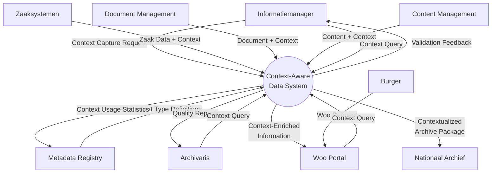
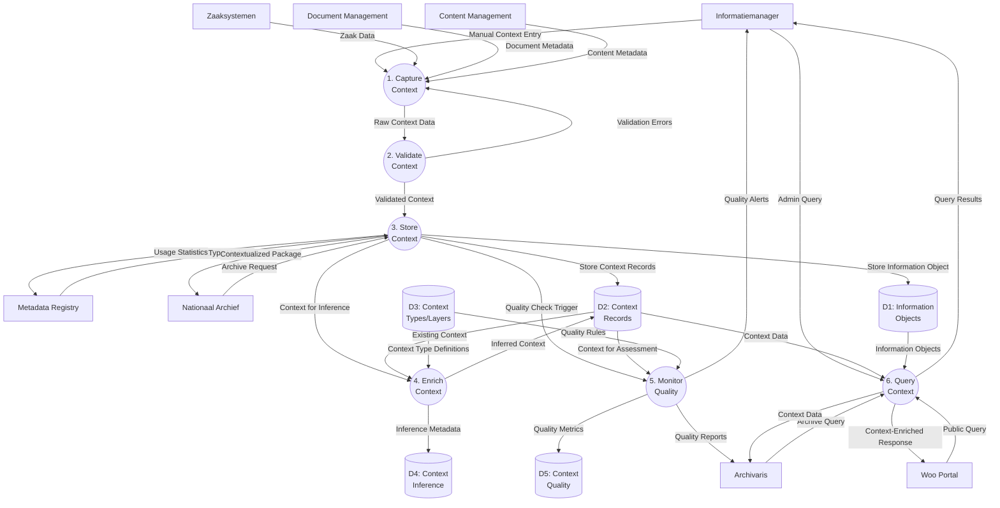
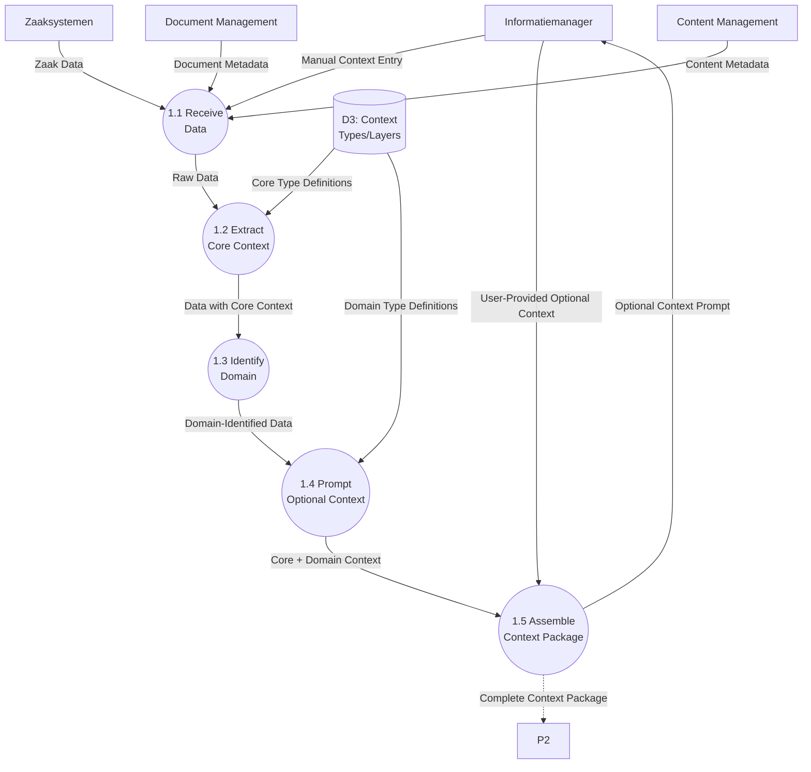

# Data Flow Diagram: Context-Aware Data Architecture

> **Template Origin**: Official | **ArcKit Version**: 4.3.1 | **Command**: `/arckit.dfd`

## Document Control

| Field | Value |
|-------|-------|
| **Document ID** | ARC-003-DFD-001-v1.0 |
| **Document Type** | Data Flow Diagram |
| **Project** | Context-Aware Data Architecture (Project 003) |
| **Classification** | OFFICIAL |
| **Status** | DRAFT |
| **Version** | 1.0 |
| **Created Date** | 2026-04-20 |
| **Last Modified** | 2026-04-20 |
| **Review Cycle** | Quarterly |
| **Next Review Date** | 2026-05-20 |
| **Owner** | Enterprise Architect |
| **Reviewed By** | PENDING |
| **Approved By** | PENDING |
| **Distribution** | Project Team, Architecture Team, MinJus Leadership |
| **DFD Level** | All Levels (0-2) |
| **Notation** | Yourdon-DeMarco |

## Revision History

| Version | Date | Author | Changes | Approved By | Approval Date |
|---------|------|--------|---------|-------------|---------------|
| 1.0 | 2026-04-20 | ArcKit AI | Initial creation from `/arckit:dfd` command | PENDING | PENDING |

---

## Yourdon-DeMarco Notation Key

| Symbol | Shape | Description |
|--------|-------|-------------|
| **External Entity** | Rectangle | Source or sink of data outside the system boundary |
| **Process** | Circle | Transforms incoming data flows into outgoing data flows |
| **Data Store** | Open-ended rectangle (parallel lines) | Repository of data at rest |
| **Data Flow** | Named arrow | Data in motion between components |

---

## Context Diagram (Level 0)

### `data-flow-diagram` Format

Render with: `pip install data-flow-diagram` then `dfd < file.dfd` (produces SVG/PNG with true Yourdon-DeMarco notation)

```dfd
title Context Diagram - Context-Aware Data Architecture

# External Entities
entity    INFO    "Informatiemanager"
entity    ARCH    "Archivaris"
entity    BURGER  "Burger"
entity    ZAAK    "Zaaksystemen"
entity    DMS     "Document\nManagement"
entity    CMS     "Content\nManagement"
entity    MDREG   "Metadata\nRegistry"
entity    NA      "Nationaal\nArchief"
entity    WOO     "Woo Portal"

# Central Process
process   P0      "Context-Aware\nData System"

# Data Flows - Source System Inputs
INFO  --> P0    "Context Capture Request"
ZAAK  --> P0    "Zaak Data + Context"
DMS   --> P0    "Document + Context"
CMS   --> P0    "Content + Context"

# Data Flows - Metadata Sync
MDREG --> P0    "Context Type Definitions"
P0   --> MDREG  "Context Usage Statistics"

# Data Flows - Quality/Validation
P0   --> INFO    "Validation Feedback"
P0   --> ARCH    "Quality Reports"

# Data Flows - Public Access
P0   --> WOO    "Context-Enriched\nInformation"
BURGER --> WOO   "Woo Request"

# Data Flows - Archival
P0   --> NA    "Contextualized\nArchive Package"

# Data Flows - Query Responses
WOO   --> P0    "Context Query"
ARCH  --> P0    "Context Query"
INFO  --> P0    "Context Query"
```

### Mermaid Format

View at [mermaid.live](https://mermaid.live) or in GitHub/VS Code markdown preview.



---

## Level 1 DFD

### `data-flow-diagram` Format

```dfd
title Level 1 DFD - Context-Aware Data System

entity    INFO    "Informatiemanager"
entity    ARCH    "Archivaris"
entity    ZAAK    "Zaaksystemen"
entity    DMS     "Document\nManagement"
entity    CMS     "Content\nManagement"
entity    MDREG   "Metadata\nRegistry"
entity    NA      "Nationaal\nArchief"
entity    WOO     "Woo Portal"

process   P1      "1\nCapture\nContext"
process   P2      "2\nValidate\nContext"
process   P3      "3\nStore\nContext"
process   P4      "4\nEnrich\nContext"
process   P5      "5\nMonitor\nQuality"
process   P6      "6\nQuery\nContext"

store     D1      "Information\nObjects"
store     D2      "Context\nRecords"
store     D3      "Context\nTypes/Layers"
store     D4      "Context\nInference"
store     D5      "Context\nQuality"

# Input Flows
INFO --> P1   "Manual Context Entry"
ZAAK --> P1   "Zaak Data"
DMS  --> P1   "Document Metadata"
CMS  --> P1   "Content Metadata"

# Capture to Validate
P1   --> P2   "Raw Context Data"
P2   --> P1   "Validation Errors"

# Validate to Store
P2   --> P3   "Validated Context"
P3   --> D1   "Store Information Object"
P3   --> D2   "Store Context Records"

# Store to Enrich
P3   --> P4   "Context for Inference"
D2   --> P4   "Existing Context"
D3   --> P4   "Context Type Definitions"
P4   --> D2   "Inferred Context"
P4   --> D4   "Inference Metadata"

# Store to Quality
P3   --> P5   "Quality Check Trigger"
D2   --> P5   "Context for Assessment"
D3   --> P5   "Quality Rules"
P5   --> D5   "Quality Metrics"
P5   --> INFO "Quality Alerts"
P5   --> ARCH "Quality Reports"

# Metadata Registry Sync
MDREG --> P3   "Context Type Updates"
P3   --> MDREG "Usage Statistics"

# Query Flows
WOO  --> P6   "Public Query"
ARCH --> P6   "Archive Query"
INFO --> P6   "Admin Query"
D2   --> P6   "Context Data"
D1   --> P6   "Information Objects"
P6   --> WOO  "Context-Enriched Response"
P6   --> ARCH "Context Data"
P6   --> INFO "Query Results"

# Archival
NA   --> P3   "Archive Request"
P3   --> NA   "Contextualized Package"
```

### Mermaid Format



---

## Level 2 DFD - Context Capture Detail (Process 1)

### `data-flow-diagram` Format

```dfd
title Level 2 DFD - Context Capture (Process 1)

entity    INFO    "Informatiemanager"
entity    ZAAK    "Zaaksystemen"
entity    DMS     "Document\nManagement"
entity    CMS     "Content\nManagement"

process   P1_1    "1.1\nReceive\nData"
process   P1_2    "1.2\nExtract\nCore Context"
process   P1_3    "1.3\nIdentify\nDomain"
process   P1_4    "1.4\nPrompt\nOptional\nContext"
process   P1_5    "1.5\nAssemble\nContext\nPackage"

store     D3      "Context\nTypes/Layers"

# Input Reception
INFO --> P1_1    "Manual Context Entry"
ZAAK --> P1_1    "Zaak Data"
DMS  --> P1_1    "Document Metadata"
CMS  --> P1_1    "Content Metadata"

# Core Context Extraction
P1_1 --> P1_2    "Raw Data"
D3   --> P1_2    "Core Type Definitions"
P1_2 --> P1_3    "Data with Core Context"

# Domain Identification
P1_3 --> P1_4    "Domain-Identified Data"
D3   --> P1_4    "Domain Type Definitions"

# Optional Context Prompt
P1_4 --> P1_5    "Core + Domain Context"
P1_5 --> INFO    "Optional Context Prompt"
INFO --> P1_5    "User-Provided Optional Context"

# Output
P1_5 --> P2      "Complete Context Package"
```

### Mermaid Format



---

## Level 2 DFD - Context Enrichment Detail (Process 4)

### `data-flow-diagram` Format

```dfd
title Level 2 DFD - Context Enrichment (Process 4)

process   P4_1    "4.1\nDetect Missing\nContext"
process   P4_2    "4.2\nSelect\nInference\nMethod"
process   P4_3    "4.3\nExecute\nAI/ML\nInference"
process   P4_4    "4.4\nScore\nConfidence"
process   P4_5    "4.5\nHuman\nReview\nQueue"

store     D2      "Context\nRecords"
store     D3      "Context\nTypes/Layers"
store     D4      "Context\nInference"

# Input from Process 3
P3   --> P4_1    "Context for Analysis"

# Detection
D2   --> P4_1    "Existing Context"
D3   --> P4_1    "Required Context Definitions"
P4_1 --> P4_2    "Missing Context Types"

# Method Selection
P4_2 --> P4_3    "Inference Request (NER/Classification/Extraction)"
P4_2 --> D4      "Inference Metadata"

# Inference Execution
P4_3 --> P4_4    "Inferred Context Values"

# Confidence Scoring
P4_4 --> P4_5    "Low Confidence Results"
P4_4 --> D2      "High Confidence Context"

# Human Review
P4_5 --> INFO    "Review Task"
INFO --> P4_5    "Human Validation"
P4_5 --> D2      "Validated Context"
P4_5 --> D4      "Validation Metadata"
```

### Mermaid Format

```mermaid
flowchart TB
    %% External Entities
    INFO["Informatiemanager"]

    %% Processes
    P4_1(("4.1 Detect Missing<br/>Context"))
    P4_2(("4.2 Select<br/>Inference Method"))
    P4_3(("4.3 Execute AI/ML<br/>Inference"))
    P4_4(("4. Score<br/>Confidence"))
    P4_5(("4.5 Human<br/>Review Queue"))

    %% Data Stores
    D2[("D2: Context<br/>Records")]
    D3[("D3: Context<br/>Types/Layers")]
    D4[("D4: Context<br/>Inference")]

    %% Input from Process 3
    P3 -.->|Context for Analysis| P4_1

    %% Detection
    D2 -->|Existing Context| P4_1
    D3 -->|Required Context Definitions| P4_1
    P4_1 -->|Missing Context Types| P4_2

    %% Method Selection
    P4_2 -->|Inference Request<br/>(NER/Classification/Extraction)| P4_3
    P4_2 -->|Inference Metadata| D4

    %% Inference Execution
    P4_3 -->|Inferred Context Values| P4_4

    %% Confidence Scoring
    P4_4 -->|Low Confidence Results| P4_5
    P4_4 -->|High Confidence Context| D2

    %% Human Review
    P4_5 -->|Review Task| INFO
    INFO -->|Human Validation| P4_5
    P4_5 -->|Validated Context| D2
    P4_5 -->|Validation Metadata| D4
```

---

## Process Specifications

| Process ID | Name | Inputs | Outputs | Logic Summary | Req. Trace |
|------------|------|--------|---------|---------------|------------|
| **P0** | Context-Aware Data System | Context Data, Type Definitions, Queries | Contextualized Information, Quality Reports | Central system that transforms raw data into information through context capture, validation, storage, enrichment, and quality monitoring | G-1, G-2 |
| **P1** | Capture Context | Manual Entry, Zaak Data, Document Metadata, Content Metadata | Raw Context Data | Receives data from source systems and users, extracts core and domain context, prompts for optional context | C6, C8 |
| **P2** | Validate Context | Raw Context Data | Validated Context, Validation Errors | Validates context against type definitions, checks required fields, enforces referential integrity | C3, C12 |
| **P3** | Store Context | Validated Context, Type Updates, Archive Request | Stored Records, Usage Statistics, Archive Package | Persists context to database with referential integrity, syncs with metadata registry, prepares archival packages | C5, C8 |
| **P4** | Enrich Context | Context for Inference, Existing Context, Type Definitions | Inferred Context, Inference Metadata | Detects missing context, selects AI/ML method (NER, classification, extraction), scores confidence, queues human review | C7 |
| **P5** | Monitor Quality | Context for Assessment, Quality Rules | Quality Metrics, Alerts, Reports | Validates completeness, accuracy, freshness per layer, generates quality dashboards, alerts on issues | C12 |
| **P6** | Query Context | Public/Admin/Archive Queries, Context Data | Context-Enriched Responses | Retrieves context by layer, applies access controls, formats responses for different consumers | C9, C14 |
| **P1.1** | Receive Data | Manual Entry, Zaak Data, Document Metadata, Content Metadata | Normalized Data | Accepts data in multiple formats, normalizes to internal structure, validates data format | C6 |
| **P1.2** | Extract Core Context | Normalized Data, Core Type Definitions | Data with Core Context | Auto-extracts creator, timestamp, title, classification from source data | C4, C6 |
| **P1.3** | Identify Domain | Data with Core Context, Domain Type Definitions | Domain-Identified Data | Determines information domain (Zaak, Project, Beleid, Expertise) based on patterns | C4 |
| **P1.4** | Prompt Optional Context | Domain-Identified Data, Domain Type Definitions | Core + Domain Context | Identifies missing optional context for domain, prompts user for input | C2, C11 |
| **P1.5** | Assemble Context Package | Core + Domain Context, User Optional Context | Complete Context Package | Combines all captured context into structured package for validation | C8 |
| **P4.1** | Detect Missing Context | Context for Analysis, Existing Context, Required Definitions | Missing Context Types | Compares existing context against required definitions per layer, identifies gaps | C7 |
| **P4.2** | Select Inference Method | Missing Context Types | Inference Request, Inference Metadata | Maps context types to appropriate AI/ML methods (NER for entities, classification for categories) | C7 |
| **P4.3** | Execute AI/ML Inference | Inference Request | Inferred Context Values | Runs NER, classification, or extraction models on content, returns candidate values | C7 |
| **P4.4** | Score Confidence | Inferred Context Values | Low/High Confidence Results | Calculates confidence scores, routes high-confidence to storage, low-confidence to review | C7 |
| **P4.5** | Human Review Queue | Low Confidence Results, Human Validation | Validated Context, Validation Metadata | Presents inferred context for human review, captures validation decisions | C7 |

---

## Data Store Descriptions

| Store ID | Name | Contents | Access Pattern | Retention | Contains PII |
|----------|------|----------|----------------|-----------|-------------|
| **D1** | Information Objects | object_id, title, object_type, domain_id, created_at, created_by, classification, woo_classification, retention_date | Read by P3, P6; Write by P3 | 1-20 years per object_type | Yes (created_by, modified_by references) |
| **D2** | Context Records | context_id, object_id, layer_id, type_id, context_value, captured_at, captured_by, is_inferred, valid_from, valid_until | Read by P4, P5, P6; Write by P3, P4 | Matches parent object | Yes (captured_by, conditional in context_value) |
| **D3** | Context Types/Layers | layer_id, layer_name, type_id, type_name, data_type, validation_rule, is_required | Read by P1, P2, P4, P5; Write by P3 (sync from MD Registry) | Permanent (metadata) | No |
| **D4** | Context Inference | inference_id, method, confidence_score, model_version, inferred_at, human_validated, validated_by | Read by P4; Write by P4 | Matches parent object | Yes (validated_by reference) |
| **D5** | Context Quality | quality_id, context_id, dimension, score, assessed_at, issue_description, remediation_status | Read by P5; Write by P5 | 5 years maximum | No |

---

## Data Dictionary

| Data Flow | Composition | Source | Destination | Format |
|-----------|-------------|--------|-------------|--------|
| **Context Capture Request** | {object_id, object_type, domain_id, core_context_data} | Informatiemanager | P1 | JSON |
| **Zaak Data + Context** | {case_number, case_type, case_status, decision_data, metadata} | Zaaksystemen | P1 | XML/JSON |
| **Document + Context** | {document_id, title, author, creation_date, doc_type, metadata} | DMS | P1 | CMIS/JSON |
| **Content + Context** | {content_id, title, creator, publish_date, content_type, tags} | CMS | P1 | REST/JSON |
| **Context Type Definitions** | {type_id, type_name, layer_id, data_type, validation_rule, is_required} | Metadata Registry | P0, P3 | JSON |
| **Validation Feedback** | {validation_errors, missing_fields, quality_score, recommendations} | P2 | Informatiemanager | JSON |
| **Quality Reports** | {quality_metrics, layer_scores, issue_counts, remediation_status} | P5 | Archivaris | PDF/JSON |
| **Context-Enriched Information** | {object_data, core_context, domain_context, semantic_context, provenance_context} | P6 | Woo Portal | JSON-LD |
| **Contextualized Archive Package** | {information_objects, full_context, provenance_chain, metadata_manifest} | P3 | Nationaal Archief | SIP/ZIP |
| **Inferred Context** | {context_id, type_id, inferred_value, confidence_score, inference_method} | P4 | D2, P4.5 | JSON |
| **Human Validation** | {inference_id, validated_value, validator_id, validation_timestamp, notes} | Informatiemanager | P4.5 | JSON |
| **Complete Context Package** | {object_id, core_context[], domain_context[], optional_context[]} | P1.5 | P2 | JSON |

---

## Requirements Traceability

| DFD Element | Element Type | Requirement ID | Requirement Description | Coverage |
|-------------|-------------|----------------|-------------------------|----------|
| P0 | Process | G-1 | Data→Informatie transformatie model | ✅ Full |
| P1 | Process | C6 | Capture at Source | ✅ Full |
| P2 | Process | C12 | Context Validation | ✅ Full |
| P3 | Process | C8 | Context Co-Location | ✅ Full |
| P4 | Process | C7 | Inference Last Resort | ✅ Full |
| P4.5 | Process | C7 | Human Validation Required | ✅ Full |
| P5 | Process | C12 | Context Quality Monitoring | ✅ Full |
| P6 | Process | C14 | Context-First Search | ✅ Full |
| D2 | Store | C5 | Context Integrity | ✅ Full |
| D3 | Store | C4 | Context Layering | ✅ Full |
| D4 | Store | C7 | Inference Transparency | ✅ Full |
| D5 | Store | C12 | Quality Tracking | ✅ Full |
| Metadata Registry Sync | Flow | INT-001 | Integration with Metadata Registry | ✅ Full |
| Archive Package | Flow | C4 | Provenance for Archiefwet | ✅ Full |
| Woo Query | Flow | P2 | Open Government | ✅ Full |
| Validation Errors | Flow | C2 | Minimal Overhead | ✅ Full |

**Coverage Summary**:

- Total Requirements Mapped: 17
- Fully Covered: 17
- Partially Covered: 0
- Not Covered: 0

---

## DFD Balancing Check

| Level 0 Boundary Flow | Direction | Present at Level 1? | Notes |
|------------------------|-----------|---------------------|-------|
| Context Capture Request | In | ✅ Yes (INFO → P1) | Decomposed into manual/system entry |
| Zaak Data + Context | In | ✅ Yes (ZAAK → P1) | Direct to Capture process |
| Document + Context | In | ✅ Yes (DMS → P1) | Direct to Capture process |
| Content + Context | In | ✅ Yes (CMS → P1) | Direct to Capture process |
| Context Type Definitions | In | ✅ Yes (MDREG → P3) | Goes to Store process |
| Validation Feedback | Out | ✅ Yes (P2 → INFO via P5) | Routed through Quality monitoring |
| Quality Reports | Out | ✅ Yes (P5 → ARCH) | Direct from Quality process |
| Context-Enriched Information | Out | ✅ Yes (P6 → WOO) | From Query process |
| Contextualized Archive Package | Out | ✅ Yes (P3 → NA) | From Store process |
| Context Query | In | ✅ Yes (WOO/ARCH/INFO → P6) | Direct to Query process |
| Context Usage Statistics | Out | ✅ Yes (P3 → MDREG) | From Store process |

**Balancing Status**: ✅ All flows balanced

---

## Rendering Tools

| Tool | Type | Yourdon-DeMarco | How to Use |
|------|------|-----------------|------------|
| **data-flow-diagram** | CLI (Python) | True notation | `pip install data-flow-diagram` then `dfd < file.dfd` |
| **Mermaid** | Text-to-diagram | Approximate | Paste into [mermaid.live](https://mermaid.live) or view in GitHub |
| **draw.io** | Online editor | True notation | Open [app.diagrams.net](https://app.diagrams.net), enable "Data Flow Diagrams" shapes |
| **Visual Paradigm** | Online editor | True notation | [online.visual-paradigm.com](https://online.visual-paradigm.com) |

---

## Linked Artifacts

**Requirements**: `../ARC-003-REQ-v1.0.md` (if available)
**Data Model**: `../ARC-003-DATA-v1.0.md`
**Architecture Diagrams**: `../ARC-003-HLD-v1.0.md` (contains C4 diagrams)
**Architecture Principles**: `../ARC-003-PRIN-v1.0.md`
**Stakeholder Analysis**: `../ARC-003-STKE-v1.0.md`

---

**Generated by**: ArcKit `/arckit:dfd` command
**Generated on**: 2026-04-20
**ArcKit Version**: 4.3.1
**Project**: Context-Aware Data Architecture (Project 003)
**AI Model**: claude-opus-4-7
**DFD Level**: All Levels (0-2)
