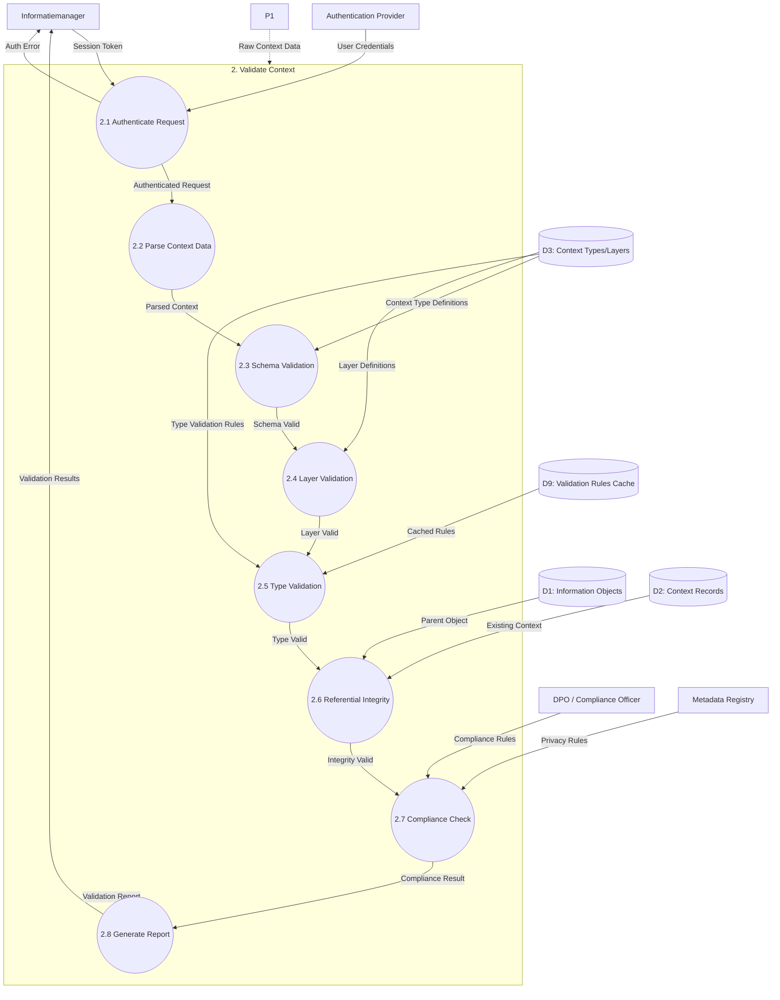

# Data Flow Diagram: Level 2 - Validate Context Process

> **Template Origin**: Official | **ArcKit Version**: 4.3.1 | **Command**: `/arckit:dfd`

## Document Control

| Field | Value |
|-------|-------|
| **Document ID** | ARC-003-DFD-002-v1.0 |
| **Document Type** | Data Flow Diagram |
| **Project** | Context-Aware Data Architecture (Project 003) |
| **Classification** | OFFICIAL |
| **Status** | DRAFT |
| **Version** | 1.0 |
| **Created Date** | 2026-04-20 |
| **Last Modified** | 2026-04-20 |
| **Review Cycle** | Quarterly |
| **Next Review Date** | 2026-05-20 |
| **Owner** | Enterprise Architect |
| **Reviewed By** | PENDING |
| **Approved By** | PENDING |
| **Distribution** | Project Team, Architecture Team, MinJus Leadership |

## Revision History

| Version | Date | Author | Changes | Approved By | Approval Date |
|---------|------|--------|---------|-------------|---------------|
| 1.0 | 2026-04-20 | ArcKit AI | Initial creation from `/arckit:dfd` command | PENDING | PENDING |

## Diagram Purpose

This Level 2 Data Flow Diagram decomposes Process 2 (Validate Context) from the Level 1 DFD into detailed sub-processes. It shows how contextual metadata is validated through multiple stages including authentication, schema validation, business rules, referential integrity, and compliance checking.

---

## Level 2 DFD: Validate Context (Process 2)

### Parent Process Context

This diagram decomposes **Process 2.0 (Validate Context)** from ARC-003-DFD-001.

### `data-flow-diagram` DSL

```dfd
title Level 2 DFD - Validate Context Process

process   P2         "2\nValidate\nContext"

process   P2_1       "2.1\nAuthenticate\nRequest"
process   P2_2       "2.2\nParse\nContext\nData"
process   P2_3       "2.3\nSchema\nValidation"
process   P2_4       "2.4\nLayer\nValidation"
process   P2_5       "2.5\nType\nValidation"
process   P2_6       "2.6\nReferential\nIntegrity"
process   P2_7       "2.7\nCompliance\nCheck"
process   P2_8       "2.8\nGenerate\nValidation\nReport"

store     D2         "Context\nRecords"
store     D3         "Context\nTypes/Layers"
store     D9         "Validation\nRules Cache"
store     D1         "Information\nObjects"

entity    INFO       "Informatiemanager"
entity    AUTH       "Authentication\nProvider"
entity    DPO        "DPO / Compliance\nOfficer"
entity    MDREG      "Metadata\nRegistry"

%% Input flows to parent process
P1        --> P2    "Raw Context Data"

%% Decomposition: P2 internal flows
INFO       --> P2_1  "Session Token"
AUTH       --> P2_1  "User Credentials"

P2_1       --> P2_2  "Authenticated\nRequest"
P2_1       --> INFO  "Auth Error"

P2_2       --> P2_3  "Parsed Context"
P2_2       --> P2_2  "Parse Error"

P2_3       --> P2_4  "Schema Valid"
P2_3       --> P2_3  "Schema Errors"

D3         --> P2_3  "Context Type\nDefinitions"

P2_4       --> P2_5  "Layer Valid"
P2_4       --> P2_4  "Layer Errors"

D3         --> P2_4  "Layer Definitions"

P2_5       --> P2_6  "Type Valid"
P2_5       --> P2_5  "Type Errors"

D3         --> P2_5  "Type Validation\nRules"
D9         --> P2_5  "Cached Rules"

P2_6       --> P2_7  "Integrity Valid"
P2_6       --> P2_6  "Integrity Errors"

D2         --> P2_6  "Existing Context"
D1         --> P2_6  "Parent Object"

P2_7       --> P2_8  "Compliance Result"
P2_7       --> P2_7  "Compliance Issues"

DPO        --> P2_7  "Compliance Rules"
MDREG      --> P2_7  "Privacy Rules"

P2_8       --> P2    "Validation Report"
P2_8       --> INFO  "Validation Results"
P2_8       --> P2_1  "Validation Errors"
```

### Mermaid (Approximate)



---

## Process Specifications

| Process | Name | Inputs | Outputs | Logic Summary |
|---------|------|--------|---------|---------------|
| 2.1 | Authenticate Request | Session Token, User Credentials | Authenticated Request, Auth Error | Validates OAuth 2.0/JWT tokens from Uitgiftebron, checks session expiry, verifies RBAC permissions for context operations (Informatiemanager role required). |
| 2.2 | Parse Context Data | Authenticated Request | Parsed Context, Parse Error | Deserializes JSON context payload, validates character encoding (UTF-8), checks max size limits (1MB per context record), extracts object_id, layer_id, type_id, context_value. |
| 2.3 | Schema Validation | Parsed Context, Context Type Definitions | Schema Valid, Schema Errors | Validates against context type schema from D3. Checks data type match (STRING, DATE, REFERENCE, ENUM, BOOLEAN). Validates JSON structure and field names. |
| 2.4 | Layer Validation | Schema Valid, Layer Definitions | Layer Valid, Layer Errors | Validates context layer assignment: CORE (priority 1) mandatory for all objects, DOMAIN (2) requires domain assignment, SEMANTIC (3) optional, PROVENANCE (4) required for audit trail. |
| 2.5 | Type Validation | Layer Valid, Type Validation Rules, Cached Rules | Type Valid, Type Errors | Applies type-specific validation: regex patterns for STRING, valid references for REFERENCE type, enum values from allowed_values list, ISO 8601 dates for TIMESTAMP. |
| 2.6 | Referential Integrity | Type Valid, Existing Context, Parent Object | Integrity Valid, Integrity Errors | Validates object_id exists in D1 (InformationObject). For updates, checks existing context in D2. Enforces uniqueness: one active context per type per object (valid_from/valid_until). |
| 2.7 | Compliance Check | Integrity Valid, Compliance Rules, Privacy Rules | Compliance Result, Compliance Issues | Checks AVG/GDPR compliance: PII in context_value requires legal basis, minimization principle (only necessary context), data classification alignment. Triggers DPIA review for high-risk context. |
| 2.8 | Generate Report | Compliance Result, All Validation Errors | Validation Report | Aggregates all errors, warnings, and info messages. Assigns overall validation status (VALID, INVALID, WARN). Returns structured report with severity levels and remediation recommendations. |

---

## Data Store Descriptions (Level 2)

| Store | Name | Contents | Access | Retention |
|-------|------|----------|--------|-----------|
| D9 | Validation Rules Cache | Compiled validation rules from context types, regex patterns, constraint definitions with TTL cache | Read by P2.5, synced from D3 | TTL 1h, reload on schema change |

---

## Data Dictionary (Level 2)

| Data Flow | Composition | Source | Destination | Format |
|-----------|-------------|--------|-------------|--------|
| User Credentials | {user_id, password/token, mfa_code, client_id} | Informatiemanager | P2.1 | HTTPS |
| Authenticated Request | {user_id, roles, org_id, context_data, operation} | P2.1 | P2.2 | Internal |
| Parsed Context | {object_id, layer_id, type_id, context_value, validity_period} | P2.2 | P2.3 | JSON |
| Context Type Definitions | {type_id, type_name, data_type, validation_rule, allowed_values} | D3 | P2.3 | JSON |
| Schema Valid | {context, is_valid, field_errors: []} | P2.3 | P2.4 | JSON |
| Layer Definitions | {layer_id, layer_name, is_mandatory, layer_priority} | D3 | P2.4 | JSON |
| Layer Valid | {context, layer_valid, layer_warnings: []} | P2.4 | P2.5 | JSON |
| Type Validation Rules | {type_id, regex_pattern, min_length, max_length, enum_values} | D3, D9 | P2.5 | Regex/JSON |
| Cached Rules | {rule_id, constraint, compiled_pattern, ttl} | D9 | P2.5 | Compiled |
| Type Valid | {context, type_valid, type_errors: []} | P2.5 | P2.6 | JSON |
| Existing Context | {context_id, object_id, type_id, valid_from, valid_until} | D2 | P2.6 | Query |
| Parent Object | {object_id, domain_id, object_type, created_at} | D1 | P2.6 | Query |
| Integrity Valid | {context, references_valid, uniqueness_ok} | P2.6 | P2.7 | JSON |
| Compliance Rules | {rule_id, avg_requirement, data_minimization, retention_check} | DPO | P2.7 | JSON |
| Privacy Rules | {pii_fields, legal_basis_required, sensitivity_level} | MDREG | P2.7 | JSON |
| Compliance Result | {context, avg_compliant, pii_assessed, retention_ok} | P2.7 | P2.8 | JSON |
| Validation Report | {status: VALID\|INVALID\|WARN, errors: [], warnings: [], info: [], timestamp} | P2.8 | Informatiemanager, P2 | JSON |

---

## Decision Rules

### 2.3 Schema Validation Rules

| Rule | Condition | Action |
|------|-----------|--------|
| SV-C-001 | Required field missing (object_id, layer_id, type_id) | Return ERROR with field name |
| SV-C-002 | Data type mismatch (context_value vs type) | Return ERROR with expected type |
| SV-C-003 | Invalid JSON structure | Return ERROR with position |
| SV-C-004 | Context value exceeds max length (10KB) | Return ERROR |
| SV-C-005 | Invalid layer_id | Return ERROR with valid layers |

### 2.4 Layer Validation Rules

| Rule | Condition | Action |
|------|-----------|--------|
| LV-C-001 | CORE layer context missing | Return ERROR (Core is mandatory) |
| LV-C-002 | DOMAIN layer without domain_id on object | Return WARN (Domain context requires domain assignment) |
| LV-C-003 | SEMANTIC layer for non-domain object | Return WARN (Semantic context usually needs domain) |
| LV-C-004 | PROVENANCE layer with modified_at < created_at | Return ERROR (Invalid timeline) |
| LV-C-005 | Multiple contexts of same type in CORE layer | Return ERROR (Core must be unique per type) |

### 2.5 Type Validation Rules

| Rule | Condition | Action |
|------|-----------|--------|
| TV-C-001 | STRING type matches regex pattern | Check pattern, return ERROR if mismatch |
| TV-C-002 | DATE type not ISO 8601 format | Return ERROR with expected format |
| TV-C-003 | ENUM value not in allowed_values | Return ERROR with valid values |
| TV-C-004 | REFERENCE type, UUID invalid | Return ERROR with UUID format |
| TV-C-005 | CONTEXT_VALUE empty for required type | Return ERROR (value required) |

### 2.6 Referential Integrity Rules

| Rule | Condition | Action |
|------|-----------|--------|
| RI-C-001 | object_id not in InformationObject | Return ERROR (Parent must exist) |
| RI-C-002 | type_id not in ContextType for given layer_id | Return ERROR (Type must belong to layer) |
| RI-C-003 | Duplicate active context for same type on object | Return ERROR (Use valid_from/valid_until for versioning) |
| RI-C-004 | valid_from > valid_until | Return ERROR (Invalid validity period) |
| RI-C-005 | Context validity outside object retention period | Return WARN (Context may expire before object) |

### 2.7 Compliance Rules

| Rule | Condition | Action |
|------|-----------|--------|
| AVG-C-001 | PII detected (context_value contains personal data) without legal_basis | Return ERROR, trigger DPIA |
| AVG-C-002 | Core context contains PII without classification | Return ERROR (PII requires security classification) |
| AVG-C-003 | Context value length excessive (>1KB) for PII type | Return WARN (Data minimization) |
| WOO-C-001 | Woo-relevant object missing woo_classification in domain context | Return ERROR (Woo requirement) |
| WOO-C-002 | woo_exemption context without exemption_ground | Return ERROR (Exemption requires ground) |

---

## Validation Report Structure

```json
{
  "report_id": "vr-20260420-ctx-001",
  "object_id": "obj-xyz-789",
  "context_type": "case_number",
  "status": "VALID",
  "validated_at": "2026-04-20T10:00:00Z",
  "validated_by": "user-456",
  "summary": {
    "total_checks": 12,
    "errors": 0,
    "warnings": 1,
    "info": 0
  },
  "stages": {
    "authentication": {
      "status": "PASS",
      "user_id": "user-456",
      "roles": ["informatiemanager"]
    },
    "parsing": {
      "status": "PASS",
      "payload_size_bytes": 256
    },
    "schema": {
      "status": "PASS",
      "data_type_match": true,
      "required_fields_present": true
    },
    "layer": {
      "status": "PASS",
      "layer": "DOMAIN",
      "layer_mandatory": true
    },
    "type": {
      "status": "WARN",
      "warnings": [
        {
          "code": "TV-C-006",
          "message": "Case number format non-standard but valid",
          "severity": "WARNING"
        }
      ]
    },
    "integrity": {
      "status": "PASS",
      "parent_object_exists": true,
      "uniqueness_ok": true
    },
    "compliance": {
      "status": "PASS",
      "avg_compliant": true,
      "woo_compliant": true
    }
  },
  "recommendations": [
    {
      "type": "INFO",
      "message": "Consider standardizing case number format to ZA-YYYY-NNNNNN"
    }
  ]
}
```

---

## Context Layer Quality Rules

### Core Layer (Priority 1 - Mandatory)

| Quality Rule | Description | Threshold | Action |
|--------------|-------------|-----------|--------|
| QR-CORE-001 | Completeness | 100% | Block save if any required core context missing |
| QR-CORE-002 | Validity | Valid references | Reject if UUID/foreign key invalid |
| QR-CORE-003 | Timeliness | Capture with object | Warn if captured > 1 hour after object creation |

### Domain Layer (Priority 2)

| Quality Rule | Description | Threshold | Action |
|--------------|-------------|-----------|--------|
| QR-DOM-001 | Completeness | 90% | Warn if domain context incomplete |
| QR-DOM-002 | Consistency | Case status matches case type | Flag for review if mismatch |
| QR-DOM-003 | Format | Domain-specific patterns | Warn on non-standard formats |

### Semantic Layer (Priority 3)

| Quality Rule | Description | Threshold | Action |
|--------------|-------------|-----------|--------|
| QR-SEM-001 | Validity | Legal basis exists | Warn if legal basis reference invalid |
| QR-SEM-002 | Completeness | 70% target | Informational if below target |
| QR-SEM-003 | Accuracy | Reference verification | Check external references if available |

### Provenance Layer (Priority 4 - Audit Required)

| Quality Rule | Description | Threshold | Action |
|--------------|-------------|-----------|--------|
| QR-PROV-001 | Completeness | 100% | Block save if provenance incomplete |
| QR-PROV-002 | Freshness | <24h for active objects | Flag stale provenance |
| QR-PROV-003 | Consistency | No orphaned references | Prevent deletion if referenced |

---

## Error Handling

| Error Code | Name | HTTP Status | Description |
|------------|------|-------------|-------------|
| VAL-C-001 | Authentication Failed | 401 | Invalid or expired credentials |
| VAL-C-002 | Authorization Failed | 403 | User lacks Informatiemanager role |
| VAL-C-003 | Parse Error | 400 | Invalid JSON syntax |
| VAL-C-004 | Schema Validation Failed | 400 | Required field missing or invalid type |
| VAL-C-005 | Layer Validation Failed | 400 | Invalid or missing layer |
| VAL-C-006 | Type Validation Failed | 400 | Type-specific constraint violation |
| VAL-C-007 | Referential Integrity Failed | 400 | Invalid foreign key reference |
| VAL-C-008 | Compliance Violation | 403 | AVG/Woo requirement not met |
| VAL-C-009 | Duplicate Context | 409 | Active context already exists for type |
| VAL-C-010 | Concurrent Modification | 409 | Context modified by another user |

---

## Performance Targets

| Stage | Target | Measurement |
|-------|--------|-------------|
| 2.1 Authentication | <30ms (p95) | Token validation time |
| 2.2 Parsing | <15ms (p95) | Deserialization time |
| 2.3 Schema Validation | <20ms (p95) | Schema check time |
| 2.4 Layer Validation | <15ms (p95) | Layer rules time |
| 2.5 Type Validation | <25ms (p95) | Type-specific validation |
| 2.6 Referential Integrity | <40ms (p95) | Database query time |
| 2.7 Compliance Check | <30ms (p95) | Compliance rules time |
| 2.8 Report Generation | <10ms (p95) | Report assembly time |
| **Total** | **<185ms (p95)** | End-to-end validation |

---

## DFD Validation

### Yourdon-DeMarco Rules Checklist

| Rule | Status | Notes |
|------|--------|-------|
| Every process has at least one input AND one output | ✅ PASS | All sub-processes have inputs/outputs |
| No process has only inputs (black hole) | ✅ PASS | All processes produce output |
| No process has only outputs (miracle) | ✅ PASS | All processes consume data |
| Data stores have at least one read and one write flow | ✅ PASS | D1, D2, D3, D9 have read flows |
| Data flows are named | ✅ PASS | All arrows have labels |
| External entities only connect to processes | ✅ PASS | No entity-to-store connections |
| Process numbering is consistent | ✅ PASS | Parent: 2, Children: 2.1-2.8 |
| Level 2 decomposes from Level 1 | ✅ PASS | All inputs/outputs balanced |

### Balancing Rules (Level 1 ↔ Level 2)

| Level 1 Flow | Level 2 Equivalent | Status |
|--------------|-------------------|--------|
| P1 → P2 (Raw Context Data) | P1 → P2 (via parent) | ✅ Balanced |
| P2 → P1 (Validation Errors) | P2.1, P2.8 → Informatiemanager | ✅ Balanced |
| P2 → P3 (Validated Context) | P2.8 → P2 (Validation Report) | ✅ Balanced |
| P2 → P1 (Validation Errors) | P2.8 → P2.1 (for re-submission) | ✅ Balanced |

---

## Security Considerations

### Validation Pipeline Security

| Stage | Threat | Mitigation |
|-------|--------|------------|
| 2.1 Authentication | Token replay | Short-lived JWT, refresh token rotation |
| 2.2 Parsing | JSON bomb | Max size limit (1MB), depth limit |
| 2.3 Schema Validation | Schema injection | Whitelisted schemas only |
| 2.5 Type Validation | Regex DoS | Timeout on regex evaluation |
| 2.6 Referential Integrity | Data exfiltration | Query result limits, access logging |
| 2.7 Compliance Check | Compliance bypass | Immutable rules, audit trail |

### Data Protection

| Data | Classification | Protection |
|------|----------------|------------|
| Context Value (may contain PII) | HIGH | Encrypted at rest, access logged |
| Validation Report | MEDIUM | User-scoped access, retention 5 years |
| Compliance Issues | HIGH | DPO notifications, immutable audit |

---

## Visualization Instructions

**For `data-flow-diagram` DSL (true Yourdon-DeMarco notation):**
```bash
pip install data-flow-diagram
dfd < input.dfd > output.svg
```

**For Mermaid approximation:**
- **GitHub**: Renders automatically in markdown
- **https://mermaid.live**: Online editor (paste code, view rendered)
- **VS Code**: Install "Mermaid Preview" extension

---

## Level 2 DFD Summary

| Metric | Count |
|--------|-------|
| Sub-Processes | 8 |
| Data Stores | 4 (1 new) |
| External Entities | 4 |
| Data Flows | 30+ |

---

## Linked Artifacts

| Artifact | Type | Link |
|----------|------|------|
| ARC-003-DFD-001-v1.0.md | Level 0/1 DFD | `projects/003-context-aware-data/diagrams/ARC-003-DFD-001-v1.0.md` |
| ARC-003-DATA-v1.0.md | Data Model | `projects/003-context-aware-data/ARC-003-DATA-v1.0.md` |
| ARC-003-HLD-v1.0.md | High-Level Design | `projects/003-context-aware-data/ARC-003-HLD-v1.0.md` |
| ARC-003-PRIN-v1.0.md | Architecture Principles | `projects/003-context-aware-data/ARC-003-PRIN-v1.0.md` |

---

## Generation Metadata

**Generated by**: ArcKit `/arckit:dfd` command
**Generated on**: 2026-04-20
**ArcKit Version**: 4.3.1
**Project**: Context-Aware Data Architecture (Project 003)
**AI Model**: claude-opus-4-7
**DFD Level**: Level 2 - Validate Context Process Decomposition
