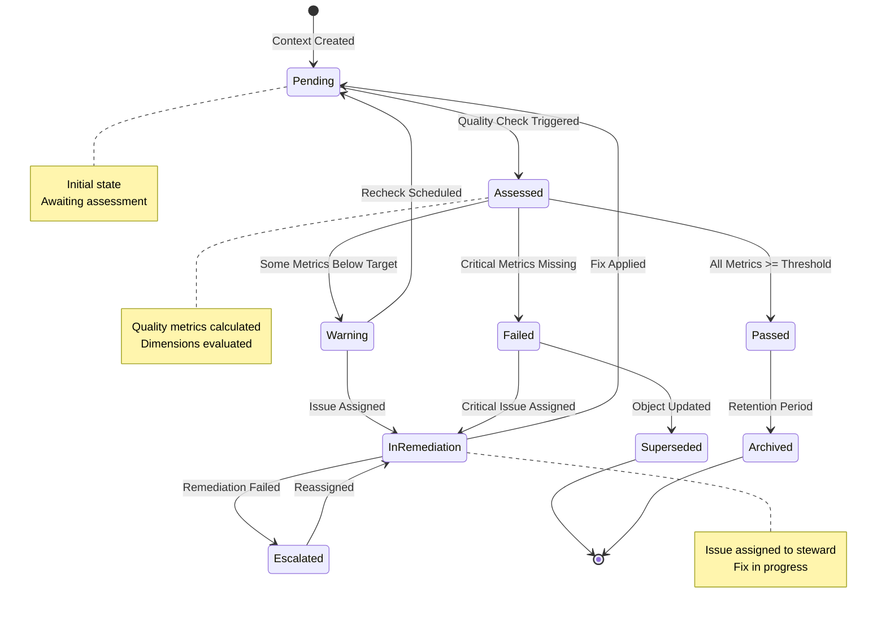
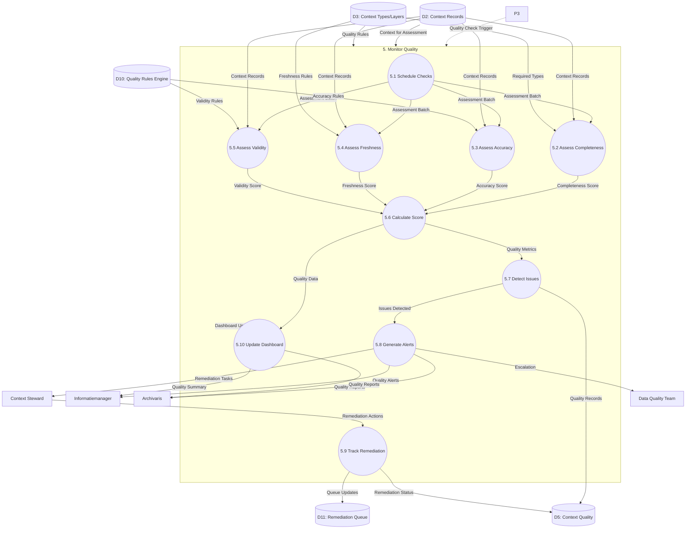

# Data Flow Diagram: Level 2 - Monitor Quality Process

> **Template Origin**: Official | **ArcKit Version**: 4.3.1 | **Command**: `/arckit:dfd`

## Document Control

| Field | Value |
|-------|-------|
| **Document ID** | ARC-003-DFD-003-v1.0 |
| **Document Type** | Data Flow Diagram |
| **Project** | Context-Aware Data Architecture (Project 003) |
| **Classification** | OFFICIAL |
| **Status** | DRAFT |
| **Version** | 1.0 |
| **Created Date** | 2026-04-20 |
| **Last Modified** | 2026-04-20 |
| **Review Cycle** | Quarterly |
| **Next Review Date** | 2026-05-20 |
| **Owner** | Enterprise Architect |
| **Reviewed By** | PENDING |
| **Approved By** | PENDING |
| **Distribution** | Project Team, Architecture Team, Data Quality Team, MinJus Leadership |

## Revision History

| Version | Date | Author | Changes | Approved By | Approval Date |
|---------|------|--------|---------|-------------|---------------|
| 1.0 | 2026-04-20 | ArcKit AI | Initial creation from `/arckit:dfd` command | PENDING | PENDING |

## Diagram Purpose

This Level 2 Data Flow Diagram decomposes Process 5 (Monitor Quality) from the Level 1 DFD. It documents the context quality monitoring workflow, including periodic quality checks, dimension-specific assessments, issue detection, alerting, and remediation tracking.

---

## Context Quality State Machine



---

## Level 2 DFD: Monitor Quality (Process 5)

### Parent Process Context

This diagram decomposes **Process 5.0 (Monitor Quality)** from ARC-003-DFD-001.

### `data-flow-diagram` DSL

```dfd
title Level 2 DFD - Monitor Quality Process

process   P5         "5\nMonitor\nQuality"

process   P5_1       "5.1\nSchedule\nQuality\nChecks"
process   P5_2       "5.2\nAssess\nCompleteness"
process   P5_3       "5.3\nAssess\nAccuracy"
process   P5_4       "5.4\nAssess\nFreshness"
process   P5_5       "5.5\nAssess\nValidity"
process   P5_6       "5.6\nCalculate\nQuality\nScore"
process   P5_7       "5.7\nDetect\nIssues"
process   P5_8       "5.8\nGenerate\nAlerts"
process   P5_9       "5.9\nTrack\nRemediation"
process   P5_10      "5.10\nUpdate\nQuality\nDashboard"

store     D2         "Context\nRecords"
store     D3         "Context\nTypes/Layers"
store     D5         "Context\nQuality"
store     D10        "Quality\nRules\nEngine"
store     D11        "Remediation\nQueue"

entity    INFO       "Informatiemanager"
entity    ARCH       "Archivaris"
entity    STEWARD    "Context\nSteward"
entity    DQ_TEAM    "Data Quality\nTeam"

%% Input flows to parent process
P3        --> P5    "Quality Check Trigger"
D2        --> P5    "Context for Assessment"
D3        --> P5    "Quality Rules"

%% Decomposition: P5 internal flows
P5_1      --> P5_2  "Assessment Batch"
P5_1      --> P5_3  "Assessment Batch"
P5_1      --> P5_4  "Assessment Batch"
P5_1      --> P5_5  "Assessment Batch"

D2        --> P5_2  "Context Records"
D3        --> P5_2  "Required Types"

P5_2      --> P5_6  "Completeness\nScore"

D2        --> P5_3  "Context Records"
D10       --> P5_3  "Accuracy Rules"

P5_3      --> P5_6  "Accuracy\nScore"

D2        --> P5_4  "Context Records"
D3        --> P5_4  "Freshness Rules"

P5_4      --> P5_6  "Freshness\nScore"

D2        --> P5_5  "Context Records"
D10       --> P5_5  "Validity Rules"

P5_5      --> P5_6  "Validity\nScore"

P5_6      --> P5_7  "Quality Metrics"
P5_6      --> P5_10 "Quality Data"

P5_7      --> P5_8  "Issues Detected"
P5_7      --> D5    "Quality Records"

P5_8      --> INFO  "Quality Alerts"
P5_8      --> ARCH  "Quality Reports"
P5_8      --> STEWARD "Remediation Tasks"
P5_8      --> DQ_TEAM "Escalation"

P5_9      --> D11   "Queue Updates"
P5_9      --> D5    "Remediation Status"
STEWARD   --> P5_9  "Remediation Actions"

P5_10     --> P5    "Dashboard Update"
P5_10     --> INFO  "Quality Summary"
P5_10     --> ARCH  "Quality Reports"
```

### Mermaid (Approximate)



---

## Process Specifications

| Process | Name | Inputs | Outputs | Logic Summary |
|---------|------|--------|---------|---------------|
| 5.1 | Schedule Quality Checks | Quality Check Trigger | Assessment Batch | Schedules periodic quality assessments (daily, weekly, monthly). Prioritizes high-risk contexts (PII, Woo-relevant). Batch processes up to 10,000 contexts per run. |
| 5.2 | Assess Completeness | Context Records, Required Types | Completeness Score | Calculates completeness per layer: CORE 100% required, DOMAIN 90% target, SEMANTIC 70% target, PROVENANCE 100% required. Returns percentage score with missing field list. |
| 5.3 | Assess Accuracy | Context Records, Accuracy Rules | Accuracy Score | Validates context values against business rules: case number format, legal basis references, enum values. Cross-references external systems where available. Returns confidence score. |
| 5.4 | Assess Freshness | Context Records, Freshness Rules | Freshness Score | Checks context age against update frequency rules. Flags stale context: CORE > 1 year, DOMAIN > 6 months, SEMANTIC > 1 year, PROVENANCE > 24 hours for active cases. |
| 5.5 | Assess Validity | Context Records, Validity Rules | Validity Score | Validates referential integrity (foreign keys), validity periods (valid_from <= valid_until), and schema compliance. Returns pass/fail per rule. |
| 5.6 | Calculate Quality Score | Completeness, Accuracy, Freshness, Validity Scores | Quality Metrics | Aggregates dimension scores using weighted formula: 40% completeness, 30% accuracy, 15% freshness, 15% validity. Returns overall 0.0-1.0 score. |
| 5.7 | Detect Issues | Quality Metrics, Quality Thresholds | Issues Detected, Quality Records | Identifies issues below threshold: overall < 0.7, any dimension < target, critical missing fields. Creates quality records in D5 with severity (CRITICAL, HIGH, MEDIUM, LOW). |
| 5.8 | Generate Alerts | Issues Detected, Quality Records | Quality Alerts, Quality Reports, Remediation Tasks, Escalation | Routes alerts based on severity: CRITICAL → immediate email/Slack, HIGH → daily digest, MEDIUM → weekly report, LOW → dashboard only. Assigns tasks to stewards. |
| 5.9 | Track Remediation | Remediation Actions, Queue Updates | Remediation Status, Queue Updates | Updates remediation queue status: PENDING → IN_PROGRESS → COMPLETED → VERIFIED. Tracks time to resolution. Re-queues failed remediation. |
| 5.10 | Update Quality Dashboard | Quality Data, Remediation Status | Dashboard Update, Quality Summary, Quality Reports | Aggregates quality metrics for dashboard: overall score, layer scores, issue counts, remediation status. Generates daily/weekly/monthly reports. |

---

## Data Store Descriptions (Level 2 - Quality)

| Store | Name | Contents | Access | Retention |
|-------|------|----------|--------|-----------|
| D10 | Quality Rules Engine | Quality rules, thresholds, weights, severity mappings, remediation SLAs | Read by P5.2-P5.5, P5.7 | Updated by stewards, permanent |
| D11 | Remediation Queue | Quality issues requiring remediation, assignments, status, SLA deadlines, resolution notes | Read/Write by P5.9 | 5 years after resolution |

---

## Data Dictionary (Level 2 - Quality)

| Data Flow | Composition | Source | Destination | Format |
|-----------|-------------|--------|-------------|--------|
| Quality Check Trigger | {trigger_type, batch_size, priority_filter} | P3 | P5.1 | Internal |
| Assessment Batch | {batch_id, context_ids: [], assessment_type} | P5.1 | P5.2-P5.5 | JSON |
| Context Records | {context_id, object_id, layer_id, type_id, value, valid_from, valid_until} | D2 | P5.2-P5.5 | Query |
| Required Types | {layer_id, type_id, is_required, priority} | D3 | P5.2 | JSON |
| Completeness Score | {layer_id, required_count, present_count, score, missing_fields: []} | P5.2 | P5.6 | JSON |
| Accuracy Rules | {type_id, validation_regex, reference_check, accuracy_threshold} | D10 | P5.3 | JSON |
| Accuracy Score | {layer_id, valid_count, total_count, score, issues: []} | P5.3 | P5.6 | JSON |
| Freshness Rules | {layer_id, max_age_days, warning_threshold, critical_threshold} | D3 | P5.4 | JSON |
| Freshness Score | {layer_id, stale_count, total_count, score, stale_items: []} | P5.4 | P5.6 | JSON |
| Validity Rules | {rule_type, constraint, severity} | D10 | P5.5 | JSON |
| Validity Score | {layer_id, valid_count, total_count, score, violations: []} | P5.5 | P5.6 | JSON |
| Quality Metrics | {overall_score, layer_scores, dimension_scores, assessed_at} | P5.6 | P5.7, P5.10 | JSON |
| Quality Thresholds | {critical: 0.5, warning: 0.7, target: 0.9} | D10 | P5.7 | JSON |
| Issues Detected | {issue_id, severity, dimension, description, affected_contexts: []} | P5.7 | P5.8, D5 | JSON |
| Quality Alerts | {alert_id, severity, message, action_required, link} | P5.8 | Informatiemanager, Steward | Email/JSON |
| Quality Reports | {period, summary_metrics, issue_counts, remediation_status} | P5.8, P5.10 | Archivaris | PDF/JSON |
| Remediation Tasks | {task_id, issue_id, assigned_to, deadline, priority} | P5.8 | D11 | JSON |
| Escalation | {escalation_id, issue_id, escalated_to, reason, original_assignee} | P5.8 | Data Quality Team | Email/JSON |
| Remediation Actions | {task_id, action_type, notes, completed_by} | Steward | P5.9 | Form/JSON |
| Remediation Status | {task_id, status, resolution_notes, verified_by} | P5.9 | D5, D11 | JSON |
| Quality Data | {metrics, trends, top_issues, steward_performance} | P5.6, P5.9 | P5.10 | JSON |
| Dashboard Update | {refresh_timestamp, widgets_data: []} | P5.10 | Dashboard UI | JSON |

---

## Quality Dimensions and Thresholds

### Completeness Dimension

| Layer | Required Fields | Target | Critical | Measurement |
|-------|----------------|--------|----------|-------------|
| CORE | creator, created_at, object_type, title | 100% | < 100% | count(present) / count(required) |
| DOMAIN | case_number, case_type (if Zaak domain) | 90% | < 70% | count(present) / count(required) |
| SEMANTIC | legal_basis, subject_tags | 70% | < 50% | count(present) / count(defined) |
| PROVENANCE | modified_by, modified_at | 100% | < 100% | count(present) / count(required) |

### Accuracy Dimension

| Context Type | Validation Method | Target | Critical | Measurement |
|--------------|-------------------|--------|----------|-------------|
| case_number | Regex: `^ZA-[A-Z]{4}-[0-9]{6}$` | 95% | < 80% | valid / total |
| legal_basis | External reference check | 90% | < 70% | references found / total |
| woo_classification | Enum validation | 100% | < 100% | valid enum / total |
| enum values | Allowed values check | 100% | < 95% | in list / total |

### Freshness Dimension

| Layer | Max Age | Warning | Critical | Measurement |
|-------|---------|---------|----------|-------------|
| CORE | 365 days | > 180 days | > 365 days | days since capture |
| DOMAIN | 180 days | > 90 days | > 180 days | days since capture |
| SEMANTIC | 365 days | > 180 days | > 365 days | days since capture |
| PROVENANCE | 1 day (active cases) | > 12 hours | > 24 hours | hours since modification |

### Validity Dimension

| Check Type | Target | Critical | Measurement |
|------------|--------|----------|-------------|
| Referential Integrity | 100% | < 100% | valid FKs / total FKs |
| Validity Period | 100% | Invalid | valid_from <= valid_until |
| Schema Compliance | 100% | < 100% | matches schema / total |

---

## Quality Score Calculation

```python
def calculate_quality_score(completeness, accuracy, freshness, validity):
    """
    Calculate overall quality score using weighted dimensions.
    Weights: 40% completeness, 30% accuracy, 15% freshness, 15% validity
    """
    weights = {
        'completeness': 0.40,
        'accuracy': 0.30,
        'freshness': 0.15,
        'validity': 0.15
    }

    overall = (
        completeness['score'] * weights['completeness'] +
        accuracy['score'] * weights['accuracy'] +
        freshness['score'] * weights['freshness'] +
        validity['score'] * weights['validity']
    )

    return {
        'overall_score': round(overall, 2),
        'dimension_scores': {
            'completeness': completeness,
            'accuracy': accuracy,
            'freshness': freshness,
            'validity': validity
        },
        'rating': get_quality_rating(overall)
    }

def get_quality_rating(score):
    """Map score to rating category."""
    if score >= 0.95: return 'EXCELLENT'
    if score >= 0.85: return 'GOOD'
    if score >= 0.70: return 'ACCEPTABLE'
    if score >= 0.50: return 'NEEDS IMPROVEMENT'
    return 'CRITICAL'
```

---

## Quality Issue Severity Levels

| Severity | Score Range | Response Time | Notification | Escalation |
|----------|-------------|---------------|--------------|------------|
| CRITICAL | < 0.50 | Immediate (1 hour) | Email + Slack + Phone | → Data Quality Team |
| HIGH | 0.50 - 0.69 | Same day (4 hours) | Email + Slack | → Steward Manager |
| MEDIUM | 0.70 - 0.84 | Next day (24 hours) | Daily digest | → Assigned Steward |
| LOW | 0.85 - 0.94 | Weekly (7 days) | Dashboard | → Informational |
| INFO | ≥ 0.95 | Monthly | Dashboard | None |

---

## Alert Templates

### CRITICAL Alert Template

```
SUBJECT: [CRITICAL] Context Quality Issue Detected - {object_id}

SEVERITY: CRITICAL
ISSUE: {issue_description}
AFFECTED OBJECTS: {affected_count}

QUALITY SCORE: {score} (Threshold: 0.50)
AFFECTED DIMENSIONS: {dimensions}

ACTION REQUIRED: Immediate remediation required
ASSIGNED TO: {steward_name}
DEADLINE: {deadline} (1 hour)

DETAILS:
{issue_details}

REMEDIATION STEPS:
1. Access object: {object_link}
2. Review missing/invalid context: {context_list}
3. Update context with correct values
4. Mark complete in remediation queue

Link to remediation task: {task_link}
```

---

## Service Level Agreements

| Metric | Target | Measurement | Owner |
|--------|--------|-------------|-------|
| Quality check completion | < 30 minutes for 10K batch | Batch duration | Data Quality Team |
| CRITICAL issue response | < 1 hour | Time to first action | Assigned Steward |
| HIGH issue response | < 4 hours | Time to first action | Assigned Steward |
| Remediation completion | < 5 business days | Time to resolution | Steward Manager |
| Dashboard refresh | < 5 seconds | Query time | Technical Team |

---

## Error Handling

| Error Code | Name | HTTP Status | Description |
|------------|------|-------------|-------------|
| QM-001 | Assessment Batch Failed | 500 | Batch processing error |
| QM-002 | Quality Rules Not Found | 404 | Rules engine unavailable |
| QM-003 | Remediation Queue Full | 503 | Queue capacity exceeded |
| QM-004 | Steward Not Assigned | 404 | No steward for context type |
| QM-005 | External Reference Check Failed | 502 | External system timeout |
| QM-006 | Dashboard Update Failed | 500 | Data aggregation error |
| QM-007 | Invalid Quality Threshold | 400 | Threshold out of range |

---

## DFD Validation

### Yourdon-DeMarco Rules Checklist

| Rule | Status | Notes |
|------|--------|-------|
| Every process has at least one input AND one output | ✅ PASS | All sub-processes have inputs/outputs |
| No process has only inputs (black hole) | ✅ PASS | All processes produce output |
| No process has only outputs (miracle) | ✅ PASS | All processes consume data |
| Data stores have at least one read and one write flow | ✅ PASS | D5, D11 have read/write flows |
| Data flows are named | ✅ PASS | All arrows have labels |
| External entities only connect to processes | ✅ PASS | No entity-to-store connections |
| Process numbering is consistent | ✅ PASS | Parent: 5, Children: 5.1-5.10 |
| Level 2 decomposes from Level 1 | ✅ PASS | All inputs/outputs balanced |

### Balancing Rules (Level 1 ↔ Level 2)

| Level 1 Flow | Level 2 Equivalent | Status |
|--------------|-------------------|--------|
| P3 → P5 (Quality Check Trigger) | P3 → P5.1 (via parent) | ✅ Balanced |
| P5 → Informatiemanager (Quality Alerts) | P5.8 → Informatiemanager | ✅ Balanced |
| P5 → Archivaris (Quality Reports) | P5.8, P5.10 → Archivaris | ✅ Balanced |
| D2 → P5 (Context for Assessment) | D2 → P5.2-P5.5 | ✅ Balanced |
| D3 → P5 (Quality Rules) | D3 → P5.2, P5.4 | ✅ Balanced |
| P5 → D5 (Quality Metrics) | P5.7 → D5 | ✅ Balanced |

---

## Visualization Instructions

**For `data-flow-diagram` DSL (true Yourdon-DeMarco notation):**
```bash
pip install data-flow-diagram
dfd < input.dfd > output.svg
```

**For Mermaid approximation:**
- **GitHub**: Renders automatically in markdown
- **https://mermaid.live**: Online editor (paste code, view rendered)
- **VS Code**: Install "Mermaid Preview" extension

---

## Level 2 DFD Summary

| Metric | Count |
|--------|-------|
| Sub-Processes | 10 |
| Data Stores | 6 (2 new) |
| External Entities | 4 |
| Data Flows | 35+ |
| Quality Dimensions | 4 |
| Severity Levels | 5 |

---

## Linked Artifacts

| Artifact | Type | Link |
|----------|------|------|
| ARC-003-DFD-001-v1.0.md | Level 0/1 DFD | `projects/003-context-aware-data/diagrams/ARC-003-DFD-001-v1.0.md` |
| ARC-003-DATA-v1.0.md | Data Model | `projects/003-context-aware-data/ARC-003-DATA-v1.0.md` |
| ARC-003-HLD-v1.0.md | High-Level Design | `projects/003-context-aware-data/ARC-003-HLD-v1.0.md` |
| ARC-003-PRIN-v1.0.md | Architecture Principles | `projects/003-context-aware-data/ARC-003-PRIN-v1.0.md` |

---

## Generation Metadata

**Generated by**: ArcKit `/arckit:dfd` command
**Generated on**: 2026-04-20
**ArcKit Version**: 4.3.1
**Project**: Context-Aware Data Architecture (Project 003)
**AI Model**: claude-opus-4-7
**DFD Level**: Level 2 - Monitor Quality Process Decomposition
