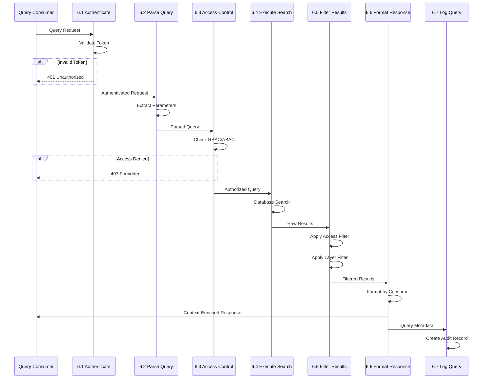
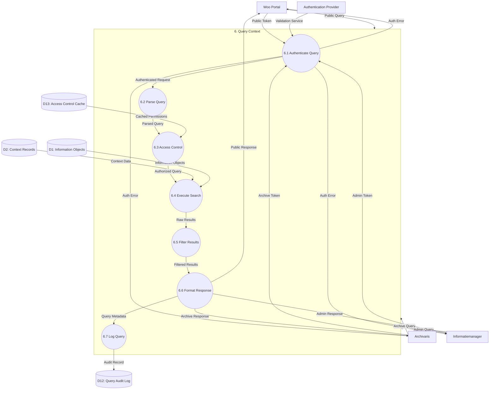

# Data Flow Diagram: Level 2 - Query Context Process

> **Template Origin**: Official | **ArcKit Version**: 4.3.1 | **Command**: `/arckit:dfd`

## Document Control

| Field | Value |
|-------|-------|
| **Document ID** | ARC-003-DFD-004-v1.0 |
| **Document Type** | Data Flow Diagram |
| **Project** | Context-Aware Data Architecture (Project 003) |
| **Classification** | OFFICIAL |
| **Status** | DRAFT |
| **Version** | 1.0 |
| **Created Date** | 2026-04-20 |
| **Last Modified** | 2026-04-20 |
| **Review Cycle** | Quarterly |
| **Next Review Date** | 2026-05-20 |
| **Owner** | Enterprise Architect |
| **Reviewed By** | PENDING |
| **Approved By** | PENDING |
| **Distribution** | Project Team, Architecture Team, MinJus Leadership |

## Revision History

| Version | Date | Author | Changes | Approved By | Approval Date |
|---------|------|--------|---------|-------------|---------------|
| 1.0 | 2026-04-20 | ArcKit AI | Initial creation from `/arckit:dfd` command | PENDING | PENDING |

## Diagram Purpose

This Level 2 Data Flow Diagram decomposes Process 6 (Query Context) from the Level 1 DFD. It documents the context query workflow for different consumer types (public Woo queries, archive queries, administrative queries), including access control, filtering, response formatting, and audit logging.

---

## Query Context Interaction Flow



---

## Level 2 DFD: Query Context (Process 6)

### Parent Process Context

This diagram decomposes **Process 6.0 (Query Context)** from ARC-003-DFD-001.

### `data-flow-diagram` DSL

```dfd
title Level 2 DFD - Query Context Process

process   P6         "6\nQuery\nContext"

process   P6_1       "6.1\nAuthenticate\nQuery"
process   P6_2       "6.2\nParse\nQuery\nParameters"
process   P6_3       "6.3\nAccess\nControl\nCheck"
process   P6_4       "6.4\nExecute\nSearch"
process   P6_5       "6.5\nFilter\nResults"
process   P6_6       "6.6\nFormat\nResponse"
process   P6_7       "6.7\nLog Query"

store     D1         "Information\nObjects"
store     D2         "Context\nRecords"
store     D12        "Query\nAudit\nLog"
store     D13        "Access\nControl\nCache"

entity    WOO        "Woo Portal"
entity    ARCH       "Archivaris"
entity    INFO       "Informatiemanager"
entity    AUTH       "Authentication\nProvider"

%% Input flows to parent process
WOO       --> P6    "Public Query"
ARCH      --> P6    "Archive Query"
INFO      --> P6    "Admin Query"

%% Decomposition: P6 internal flows
WOO       --> P6_1  "Public Token"
ARCH      --> P6_1  "Archive Token"
INFO      --> P6_1  "Admin Token"
AUTH      --> P6_1  "Validation Service"

P6_1      --> P6_2  "Authenticated\nRequest"
P6_1      --> WOO   "Auth Error"
P6_1      --> ARCH  "Auth Error"
P6_1      --> INFO  "Auth Error"

P6_2      --> P6_3  "Parsed Query"
P6_2      --> P6_2  "Parse Error"

P6_3      --> P6_3  "Access Denied"
P6_3      --> WOO   "Access Denied"
P6_3      --> ARCH  "Access Denied"

D13       --> P6_3  "Cached Permissions"

P6_3      --> P6_4  "Authorized Query"

D2        --> P6_4  "Context Data"
D1        --> P6_4  "Information Objects"

P6_4      --> P6_5  "Raw Results"

P6_5      --> P6_5  "Apply Access Filter"
P6_5      --> P6_5  "Apply Layer Filter"
P6_5      --> P6_5  "Apply Validity Filter"

P6_5      --> P6_6  "Filtered Results"

P6_6      --> WOO   "Public Response"
P6_6      --> ARCH  "Archive Response"
P6_6      --> INFO  "Admin Response"

P6_6      --> P6_7  "Query Metadata"

P6_7      --> D12   "Audit Record"
```

### Mermaid (Approximate)



---

## Process Specifications

| Process | Name | Inputs | Outputs | Logic Summary |
|---------|------|--------|---------|---------------|
| 6.1 | Authenticate Query | Public/Archive/Admin Token, Validation Service | Authenticated Request, Auth Error | Validates JWT/OAuth tokens. Identifies consumer type (Woo=public, Archive=authenticated, Admin=privileged). Caches permissions in D13 for 5 minutes. Returns 401 on invalid token. |
| 6.2 | Parse Query Parameters | Authenticated Request | Parsed Query, Parse Error | Extracts query parameters: object_id, layer_filter, type_filter, valid_at, include_inferred, sort_by, limit. Validates parameter types and ranges. Sets defaults (limit=100, all layers). |
| 6.3 | Access Control Check | Parsed Query, Cached Permissions | Authorized Query, Access Denied | Enforces RBAC: Public can only see OPENBAAR objects, Archive can see assigned domain, Admin has full access. Implements ABAC for PII contexts. Returns 403 if unauthorized. |
| 6.4 | Execute Search | Authorized Query, Context Data, Information Objects | Raw Results | Executes database query with joins to D1 and D2. Applies full-text search on context_value. Uses indexes for layer/type filtering. Returns max 1000 results per query. |
| 6.5 | Filter Results | Raw Results | Filtered Results | Applies three filters: (1) Access filter - remove contexts above clearance, (2) Layer filter - remove excluded layers, (3) Validity filter - only contexts valid at valid_at timestamp. |
| 6.6 | Format Response | Filtered Results | Consumer Response | Formats response per consumer type: Woo (JSON-LD with public context only), Archive (full context with provenance), Admin (complete with metadata). Adds pagination, timing, and result count metadata. |
| 6.7 | Log Query | Query Metadata | Audit Record | Creates audit log entry: query_hash, consumer_type, parameters, result_count, execution_time, timestamp. Logs to D12 for 7-year retention (AVG requirement). |

---

## Data Store Descriptions (Level 2 - Query)

| Store | Name | Contents | Access | Retention |
|-------|------|----------|--------|-----------|
| D12 | Query Audit Log | Query audit records: query_id, consumer, parameters, results, timestamp, execution_time | Write by P6.7 | 7 years (AVG) |
| D13 | Access Control Cache | Cached user permissions, roles, domain assignments with TTL | Read by P6.3, written by P6.1 | TTL 5 minutes |

---

## Consumer Types and Access Levels

### Public (Woo Portal)

| Attribute | Value |
|-----------|-------|
| Authentication | None (anonymous) |
| Access Level | PUBLIC only |
| Layers Visible | CORE only (title, creator, created_at) |
| Context Types | Non-sensitive only |
| Response Format | JSON-LD (Woo specification) |
| Rate Limit | 100 requests/minute/IP |
| Examples | Besluit metadata, publication info |

### Archive (Archivaris)

| Attribute | Value |
|-----------|-------|
| Authentication | JWT (MinJus identity) |
| Access Level | ASSIGNED DOMAIN only |
| Layers Visible | CORE, DOMAIN, PROVENANCE |
| Context Types | Domain-assigned, non-PII |
| Response Format | JSON + XML |
| Rate Limit | 1000 requests/minute/user |
| Examples | Case context, archival packages |

### Admin (Informatiemanager)

| Attribute | Value |
|-----------|-------|
| Authentication | JWT + MFA |
| Access Level | FULL (all domains) |
| Layers Visible | ALL layers |
| Context Types | ALL (including PII, inferred) |
| Response Format | JSON (complete) |
| Rate Limit | 10000 requests/minute/user |
| Examples | Quality analysis, bulk exports |

---

## Data Dictionary (Level 2 - Query)

| Data Flow | Composition | Source | Destination | Format |
|-----------|-------------|--------|-------------|--------|
| Public/Archive/Admin Token | {access_token, token_type, consumer_id} | Woo/Arch/Info | P6.1 | HTTPS/JWT |
| Validation Service | {token_valid, user_id, roles, expires_at} | AUTH | P6.1 | JSON |
| Authenticated Request | {consumer_type, user_id, query_params, timestamp} | P6.1 | P6.2 | Internal |
| Auth Error | {error_code, message, www_authenticate} | P6.1 | Consumer | HTTP 401 |
| Parsed Query | {object_id?, layer_filter?, type_filter?, valid_at, include_inferred, sort, limit} | P6.2 | P6.3 | JSON |
| Parse Error | {error_code, invalid_param, expected_format} | P6.2 | P6.2 | HTTP 400 |
| Cached Permissions | {user_id, roles, domains, clearance, cached_at} | D13 | P6.3 | JSON |
| Authorized Query | {parsed_query, user_context, access_filters} | P6.3 | P6.4 | Internal |
| Access Denied | {error_code, required_role, resource} | P6.3 | Consumer | HTTP 403 |
| Context Data | {context_id, object_id, layer_id, type_id, value, valid_from, valid_until} | D2 | P6.4 | Query |
| Information Objects | {object_id, title, domain_id, classification, woo_classification} | D1 | P6.4 | Query |
| Raw Results | {results: [], total_count, execution_time_ms} | P6.4 | P6.5 | JSON |
| Filtered Results | {results: [], filtered_count, filters_applied: []} | P6.5 | P6.6 | JSON |
| Public Response | {object_id, context: {core: []}, woo_metadata, links} | P6.6 | Woo | JSON-LD |
| Archive Response | {object_id, context: {core, domain, provenance}, archive_metadata} | P6.6 | Archivaris | JSON/XML |
| Admin Response | {object_id, context: {all_layers}, quality_metrics, audit_trail} | P6.6 | Informatiemanager | JSON |
| Query Metadata | {query_id, consumer, params, result_count, duration_ms} | P6.6 | P6.7 | JSON |
| Audit Record | {query_id, consumer, params_hash, results_count, timestamp} | P6.7 | D12 | Database |

---

## Query Parameter Specifications

### Query Parameters

| Parameter | Type | Required | Default | Description | Example |
|-----------|------|----------|---------|-------------|---------|
| object_id | UUID | No | null | Filter by specific object | obj-123-456 |
| layer_filter | ENUM[] | No | ALL | Layers to return | CORE,DOMAIN |
| type_filter | STRING[] | No | ALL | Context types to return | case_number,legal_basis |
| valid_at | TIMESTAMP | No | NOW | Point-in-time query | 2025-01-01T00:00:00Z |
| include_inferred | BOOLEAN | No | false | Include AI-inferred context | true |
| sort_by | ENUM | No | relevance | Sort order | created_at, relevance |
| limit | INT | No | 100 | Max results (1-1000) | 50 |
| offset | INT | No | 0 | Pagination offset | 100 |

### Response Format (Public/Woo)

```json
{
  "@context": "https://woo.minjus.nl/context",
  "object_id": "obj-123-456",
  "title": "Besluit intrekking vergunning",
  "context": {
    "core": [
      {
        "type": "creator",
        "value": "Ministerie van Justitie en Veiligheid",
        "captured_at": "2026-04-19T10:00:00Z"
      },
      {
        "type": "created_at",
        "value": "2026-04-19T10:00:00Z"
      },
      {
        "type": "object_type",
        "value": "BESLUIT"
      }
    ]
  },
  "woo_publicatie": {
    "woo_url": "https://woo.minjus.nl/besluit-123",
    "gepubliceerd_op": "2026-04-20T09:00:00Z"
  },
  "links": {
    "self": "/api/v1/objects/obj-123-456/context",
    "woo": "https://woo.minjus.nl/besluit-123"
  },
  "meta": {
    "query_duration_ms": 45,
    "result_count": 3
  }
}
```

### Response Format (Admin)

```json
{
  "object_id": "obj-123-456",
  "domain": {
    "domain_id": "dom-001",
    "domain_name": "Zaak",
    "domain_owner": "user-789"
  },
  "context": {
    "core": [
      {"type": "creator", "value": "user-123", "captured_at": "2026-04-19T10:00:00Z", "captured_by": "user-123"}
    ],
    "domain": [
      {"type": "case_number", "value": "ZA-2026-001234", "is_inferred": false},
      {"type": "case_status", "value": "BESLISSING", "is_inferred": false}
    ],
    "semantic": [
      {"type": "legal_basis", "value": "BWBR0005292-Art31", "is_inferred": true, "confidence_score": 0.95}
    ],
    "provenance": [
      {"type": "modified_by", "value": "user-456", "captured_at": "2026-04-19T14:00:00Z"}
    ]
  },
  "quality_metrics": {
    "overall_score": 0.94,
    "completeness": 1.0,
    "accuracy": 0.92
  },
  "audit_trail": {
    "created_at": "2026-04-19T10:00:00Z",
    "modified_at": "2026-04-19T14:00:00Z",
    "version": 2
  },
  "meta": {
    "query_duration_ms": 32,
    "result_count": 7,
    "total_context_records": 7
  }
}
```

---

## Access Control Rules

### RBAC Matrix

| Role | Public | Archive | Admin |
|------|--------|---------|-------|
| **Anonymous** | Read (CORE only) | - | - |
| **Citizen** | Read (CORE only) | - | - |
| **Archivaris** | Read (CORE only) | Read (CORE, DOMAIN, PROVENANCE) | - |
| **Informatiemanager** | Read (CORE only) | Read (CORE, DOMAIN, PROVENANCE) | Read/Write (ALL) |
| **Enterprise Architect** | Read (CORE only) | Read (CORE, DOMAIN, PROVENANCE) | Read/Write (ALL) |
| **System** | - | Read/Write (ALL) | Read/Write (ALL) |

### ABAC Rules

| Attribute | Rule | Effect |
|-----------|------|--------|
| object.classification | OFFICIAL-SENSITIVE + consumer=PUBLIC | Deny |
| context.type = PII + consumer != ADMIN | Mask value |
| context.is_inferred = true + consumer != ADMIN | Include with flag |
| object.domain_id != user.assigned_domains + consumer=ARCHIVE | Deny |
| context.layer = SEMANTIC + consumer=PUBLIC | Deny |

---

## Performance Targets

| Stage | Target | Measurement |
|-------|--------|-------------|
| 6.1 Authentication | <20ms (p95) | Token validation time |
| 6.2 Parse Query | <5ms (p95) | Parameter extraction time |
| 6.3 Access Control | <15ms (p95) | Permission check time (cached) |
| 6.4 Execute Search | <100ms (p95) | Database query time |
| 6.5 Filter Results | <20ms (p95) | In-memory filtering |
| 6.6 Format Response | <10ms (p95) | Response serialization |
| 6.7 Log Query | <10ms (p95) | Async write |
| **Total** | **<180ms (p95)** | End-to-end query |

---

## Error Handling

| Error Code | Name | HTTP Status | Description |
|------------|------|-------------|-------------|
| QRY-001 | Invalid Token | 401 | JWT expired or malformed |
| QRY-002 | Invalid Parameter | 400 | Query parameter validation failed |
| QRY-003 | Access Denied | 403 | User lacks required role/permission |
| QRY-004 | Object Not Found | 404 | No object matching query |
| QRY-005 | Rate Limit Exceeded | 429 | Too many requests |
| QRY-006 | Query Timeout | 504 | Search exceeded 30 seconds |
| QRY-007 | Invalid Sort | 400 | Sort field not supported |
| QRY-008 | Limit Exceeded | 400 | Limit > 1000 |

---

## DFD Validation

### Yourdon-DeMarco Rules Checklist

| Rule | Status | Notes |
|------|--------|-------|
| Every process has at least one input AND one output | ✅ PASS | All sub-processes have inputs/outputs |
| No process has only inputs (black hole) | ✅ PASS | All processes produce output |
| No process has only outputs (miracle) | ✅ PASS | All processes consume data |
| Data stores have at least one read and one write flow | ✅ PASS | D12, D13 have read/write flows |
| Data flows are named | ✅ PASS | All arrows have labels |
| External entities only connect to processes | ✅ PASS | No entity-to-store connections |
| Process numbering is consistent | ✅ PASS | Parent: 6, Children: 6.1-6.7 |
| Level 2 decomposes from Level 1 | ✅ PASS | All inputs/outputs balanced |

### Balancing Rules (Level 1 ↔ Level 2)

| Level 1 Flow | Level 2 Equivalent | Status |
|--------------|-------------------|--------|
| Woo → P6 (Public Query) | Woo → P6.1 (via parent) | ✅ Balanced |
| Archivaris → P6 (Archive Query) | Archivaris → P6.1 (via parent) | ✅ Balanced |
| Informatiemanager → P6 (Admin Query) | Informatiemanager → P6.1 (via parent) | ✅ Balanced |
| P6 → Woo (Context-Enriched Response) | P6.6 → Woo | ✅ Balanced |
| P6 → Archivaris (Context Data) | P6.6 → Archivaris | ✅ Balanced |
| P6 → Informatiemanager (Query Results) | P6.6 → Informatiemanager | ✅ Balanced |

---

## Visualization Instructions

**For `data-flow-diagram` DSL (true Yourdon-DeMarco notation):**
```bash
pip install data-flow-diagram
dfd < input.dfd > output.svg
```

**For Mermaid approximation:**
- **GitHub**: Renders automatically in markdown
- **https://mermaid.live**: Online editor (paste code, view rendered)
- **VS Code**: Install "Mermaid Preview" extension

---

## Level 2 DFD Summary

| Metric | Count |
|--------|-------|
| Sub-Processes | 7 |
| Data Stores | 4 (2 new) |
| External Entities | 4 |
| Data Flows | 25+ |
| Consumer Types | 3 |
| Access Layers | 4 |

---

## Linked Artifacts

| Artifact | Type | Link |
|----------|------|------|
| ARC-003-DFD-001-v1.0.md | Level 0/1 DFD | `projects/003-context-aware-data/diagrams/ARC-003-DFD-001-v1.0.md` |
| ARC-003-DATA-v1.0.md | Data Model | `projects/003-context-aware-data/ARC-003-DATA-v1.0.md` |
| ARC-003-HLD-v1.0.md | High-Level Design | `projects/003-context-aware-data/ARC-003-HLD-v1.0.md` |
| ARC-003-PRIN-v1.0.md | Architecture Principles | `projects/003-context-aware-data/ARC-003-PRIN-v1.0.md` |

---

## Generation Metadata

**Generated by**: ArcKit `/arckit:dfd` command
**Generated on**: 2026-04-20
**ArcKit Version**: 4.3.1
**Project**: Context-Aware Data Architecture (Project 003)
**AI Model**: claude-opus-4-7
**DFD Level**: Level 2 - Query Context Process Decomposition
