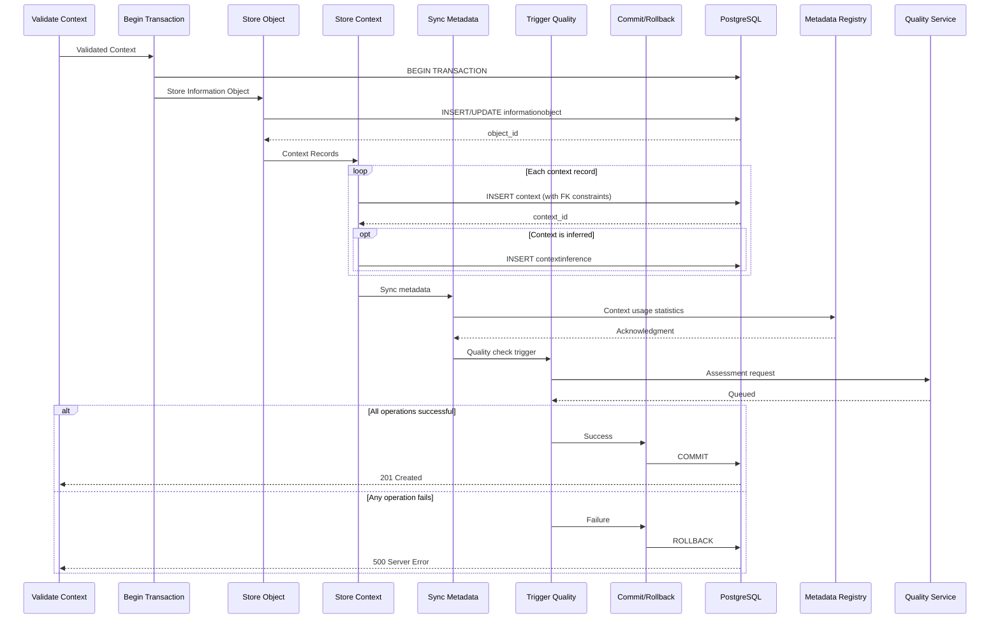
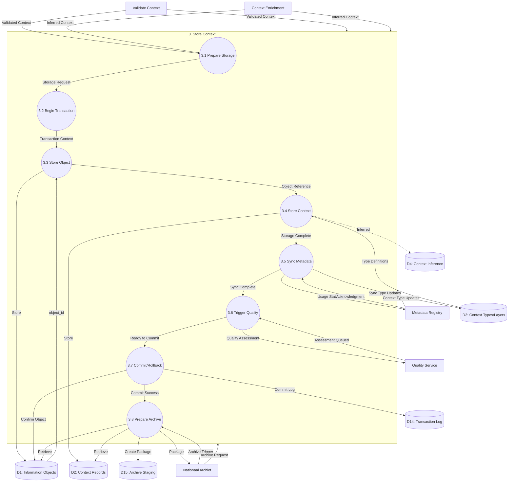
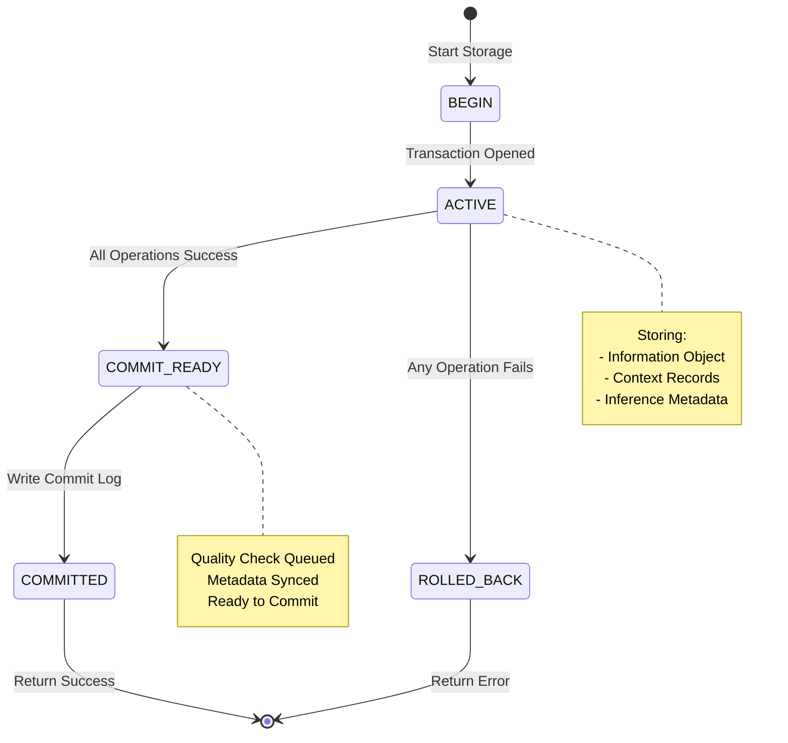

# Data Flow Diagram: Level 2 - Store Context Process

> **Template Origin**: Official | **ArcKit Version**: 4.3.1 | **Command**: `/arckit:dfd`

## Document Control

| Field | Value |
|-------|-------|
| **Document ID** | ARC-003-DFD-005-v1.0 |
| **Document Type** | Data Flow Diagram |
| **Project** | Context-Aware Data Architecture (Project 003) |
| **Classification** | OFFICIAL |
| **Status** | DRAFT |
| **Version** | 1.0 |
| **Created Date** | 2026-04-20 |
| **Last Modified** | 2026-04-20 |
| **Review Cycle** | Quarterly |
| **Next Review Date** | 2026-05-20 |
| **Owner** | Enterprise Architect |
| **Reviewed By** | PENDING |
| **Approved By** | PENDING |
| **Distribution** | Project Team, Architecture Team, Database Team, MinJus Leadership |

## Revision History

| Version | Date | Author | Changes | Approved By | Approval Date |
|---------|------|--------|---------|-------------|---------------|
| 1.0 | 2026-04-20 | ArcKit AI | Initial creation from `/arckit:dfd` command | PENDING | PENDING |

## Diagram Purpose

This Level 2 Data Flow Diagram decomposes Process 3 (Store Context) from the Level 1 DFD. It documents the context persistence workflow, including transaction management, referential integrity enforcement, metadata registry synchronization, archival package preparation, and audit logging.

---

## Context Storage Transaction Flow



---

## Level 2 DFD: Store Context (Process 3)

### Parent Process Context

This diagram decomposes **Process 3.0 (Store Context)** from ARC-003-DFD-001.

### `data-flow-diagram` DSL

```dfd
title Level 2 DFD - Store Context Process

process   P3         "3\nStore\nContext"

process   P3_1       "3.1\nPrepare\nStorage"
process   P3_2       "3.2\nBegin\nTransaction"
process   P3_3       "3.3\nStore\nInformation\nObject"
process   P3_4       "3.4\nStore\nContext\nRecords"
process   P3_5       "3.5\nSync\nMetadata\nRegistry"
process   P3_6       "3.6\nTrigger\nQuality\nCheck"
process   P3_7       "3.7\nCommit /\nRollback"
process   P3_8       "3.8\nPrepare\nArchive\nPackage"

store     D1         "Information\nObjects"
store     D2         "Context\nRecords"
store     D3         "Context\nTypes/Layers"
store     D4         "Context\nInference"
store     D14        "Transaction\nLog"
store     D15        "Archive\nStaging"

entity    P2         "Validate\nContext"
entity    P4         "Context\nEnrichment"
entity    P5         "Quality\nService"
entity    MDREG      "Metadata\nRegistry"
entity    NA         "Nationaal\nArchief"

%% Input flows to parent process
P2        --> P3    "Validated Context"
P4        --> P3    "Inferred Context"
MDREG     --> P3    "Context Type Updates"
NA        --> P3    "Archive Request"

%% Decomposition: P3 internal flows
P2        --> P3_1  "Validated Context"
P4        --> P3_1  "Inferred Context"
P3_1      --> P3_2  "Storage Request"

P3_2      --> P3_3  "Transaction Context"

P3_3      --> D1    "Store Information Object"
D1        --> P3_3  "object_id"

P3_3      --> P3_4  "Object Reference"

P3_4      --> D2    "Store Context Records"
D3        --> P3_4  "Type Definitions"
D2        --> P3_4  "context_id"

opt Inferred Context
    P3_4      --> D4  "Store Inference Metadata"
    D4        --> P3_4 "inference_id"
end

P3_4      --> P3_5  "Storage Complete"

P3_5      --> MDREG "Usage Statistics"
MDREG     --> P3_5  "Acknowledgment"
P3_5      --> D3    "Sync Type Updates"

P3_5      --> P3_6  "Sync Complete"

P3_6      --> P5    "Quality Assessment"
P5        --> P3_6  "Assessment Queued"

P3_6      --> P3_7  "Ready to Commit"

alt Success
    P3_7      --> D14  "Commit Log Entry"
    P3_7      --> D1   "Confirm Object"
    P3_7      --> P3_8 "Commit Success"
else Failure
    P3_7      --> D14  "Rollback Log Entry"
    P3_7      --> P2   "Error Response"
end

NA        --> P3_8  "Archive Trigger"
P3_8      --> D1    "Retrieve Object + Context"
P3_8      --> D2    "Retrieve Context Records"
P3_8      --> D15   "Create Archive Package"
P3_8      --> NA    "Contextualized Package"
```

### Mermaid (Approximate)



---

## Process Specifications

| Process | Name | Inputs | Outputs | Logic Summary |
|---------|------|--------|---------|---------------|
| 3.1 | Prepare Storage | Validated Context, Inferred Context | Storage Request | Normalizes context data into storage format. Groups contexts by object_id. Separates inferred contexts for special handling. Sets default values for timestamps (captured_at = NOW()). |
| 3.2 | Begin Transaction | Storage Request | Transaction Context | Opens database transaction with isolation level READ_COMMITTED. Assigns transaction_id from sequence. Records start timestamp in D14. |
| 3.3 | Store Information Object | Transaction Context | Object Reference | INSERT or UPDATE informationobject in D1. Handles UPSERT logic: insert if new object_id, update if exists. Returns object_id for context FK references. Enforces NOT NULL on core fields. |
| 3.4 | Store Context Records | Object Reference, Type Definitions | context_id, inference_id | Inserts context records in D2 with FK to D1. Batches up to 1000 records per transaction. For inferred contexts, creates D4 record with inference metadata. Enforces uniqueness constraint (object_id, type_id, valid_from). |
| 3.5 | Sync Metadata Registry | Storage Complete | Sync Complete | Sends usage statistics to Metadata Registry: context_type usage counts, inferred context ratios. Receives context type updates. Syncs new/updated types to D3. Handles merge conflicts (Registry wins). |
| 3.6 | Trigger Quality Check | Sync Complete | Assessment Queued | Queues asynchronous quality assessment with P5. Provides object_id and context_ids. Stores assessment_request_id in D14 for tracking. Non-blocking: returns immediately. |
| 3.7 | Commit/Rollback | Ready to Commit, Errors | Commit Success/Rollback Log | If all operations successful: COMMIT transaction, write commit log to D14, return success. If any error: ROLLBACK transaction, write rollback log with error details, return error to P2. |
| 3.8 | Prepare Archive Package | Commit Success, Archive Trigger | Contextualized Package | Retrieves object and all associated contexts from D1, D2. Generates archival package in SIP (Submission Information Package) format. Includes metadata manifest, provenance chain, and checksums. Stores in D15 for transfer to NA. |

---

## Data Store Descriptions (Level 2 - Storage)

| Store | Name | Contents | Access | Retention |
|-------|------|----------|--------|-----------|
| D14 | Transaction Log | Transaction records: transaction_id, start_time, end_time, status, operations, error_details | Write by P3.2, P3.7 | 7 years (audit requirement) |
| D15 | Archive Staging | Archival packages awaiting transfer to Nationaal Archief, including object data, context, metadata manifest | Write by P3.8, read by NA transfer job | Until successfully transferred |

---

## Data Dictionary (Level 2 - Storage)

| Data Flow | Composition | Source | Destination | Format |
|-----------|-------------|--------|-------------|--------|
| Storage Request | {object_id, object_type, domain_id, contexts: [{layer, type, value, is_inferred}]} | P3.1 | P3.2 | Internal |
| Transaction Context | {transaction_id, start_time, isolation_level} | P3.2 | P3.3 | Internal |
| Store Information Object | {object_id, title, object_type, domain_id, created_at, created_by, classification, ...} | P3.3 | D1 | SQL INSERT |
| object_id | UUID (generated) | D1 | P3.3 | Database return |
| Object Reference | {object_id, transaction_id} | P3.3 | P3.4 | Internal |
| Store Context Records | [{context_id, object_id, layer_id, type_id, context_value, valid_from, valid_until}] | P3.4 | D2 | SQL INSERT batch |
| Type Definitions | {type_id, data_type, validation_rule, is_required} | D3 | P3.4 | Query |
| context_id | UUID (generated) | D2 | P3.4 | Database return |
| Store Inference Metadata | {inference_id, method, confidence_score, model_version, inferred_at} | P3.4 | D4 | SQL INSERT |
| inference_id | UUID (generated) | D4 | P3.4 | Database return |
| Usage Statistics | {type_id, usage_count, period, inferred_ratio} | P3.5 | MDREG | JSON POST |
| Acknowledgment | {status: acknowledged, timestamp} | MDREG | P3.5 | JSON |
| Sync Type Updates | {new_types: [], updated_types: [], deleted_types: []} | MDREG | P3.5 | JSON |
| Quality Assessment | {object_id, context_ids: [], priority, scheduled_at} | P3.6 | P5 | Async message |
| Assessment Queued | {assessment_id, queued_at} | P5 | P3.6 | JSON |
| Commit Log Entry | {transaction_id, commit_time, operations_count, status: COMMITTED} | P3.7 | D14 | SQL INSERT |
| Rollback Log Entry | {transaction_id, rollback_time, error_code, error_message, operations_rolled_back} | P3.7 | D14 | SQL INSERT |
| Commit Success | {object_id, transaction_id, contexts_stored, committed_at} | P3.7 | P3.8, P2 | Internal |
| Error Response | {error_code, message, transaction_id, rolled_back} | P3.7 | P2 | HTTP 500 |
| Archive Trigger | {object_id, retention_date, archive_criteria} | NA | P3.8 | Request |
| Contextualized Package | {sip_id, object_data, context_data, metadata_manifest, checksums} | P3.8 | D15, NA | ZIP/XML |

---

## Transaction Management

### ACID Guarantees

| Property | Implementation | Notes |
|----------|----------------|-------|
| Atomicity | PostgreSQL transaction with COMMIT/ROLLBACK | All context records stored together or none |
| Consistency | Foreign key constraints, NOT NULL, CHECK constraints | Database enforces referential integrity |
| Isolation | READ_COMMITTED isolation level | Prevents dirty reads, allows concurrent reads |
| Durability | WAL (Write-Ahead Logging) | Committed data persists even after crash |

### Transaction States



---

## Archive Package Structure

### SIP (Submission Information Package) Format

```
archive-package-{object_id}.zip
├── METS.xml                 # Metadata Encoding Standard
├── manifest.md5             # Checksums for all files
├── object/
│   ├── {object_id}.json     # Information object metadata
│   └── content.{bin/pdf}    # Actual content (if applicable)
├── context/
│   ├── core/                # Core context records
│   │   ├── creator.json
│   │   ├── created_at.json
│   │   └── ...
│   ├── domain/              # Domain context records
│   ├── semantic/            # Semantic context records
│   └── provenance/          # Provenance context records
└── provenance/
    ├── chain.json           # Approval chain
    ├── audit_trail.json     # Full audit trail
    └── transfer.xml         # Archival transfer metadata
```

### Metadata Manifest (METS.xml)

```xml
<mets:mets OBJID="{object_id}" OBJLABEL="{title}">
  <mets:metsHdr CREATEDATE="{transfer_date}">
    <mets:agent ROLE="ARCHIVIST" TYPE="ORGANIZATION">
      <mets:name>Ministerie van Justitie en Veiligheid</mets:name>
    </mets:agent>
  </mets:metsHdr>
  <mets:dmdSec ID="DMD-1">
    <mets:mdWrap MDTYPE="DC">
    <mets:xmlData>
      <dc:title>{title}</dc:title>
      <dc:creator>{creator}</dc:creator>
      <dc:date>{created_at}</dc:date>
      <dc:type>{object_type}</dc:type>
      <dc:subject>{domain}</dc:subject>
    </mets:xmlData>
    </mets:mdWrap>
  </mets:dmdSec>
  <mets:amdSec ID="AMD-1">
    <mets:techMD ID="TECH-1">
      <!-- Technical metadata for preservation -->
    </mets:techMD>
    <mets:rightsMD ID="RIGHTS-1">
      <!-- Rights metadata (Woo classification) -->
    </mets:rightsMD>
    <mets:sourceMD ID="SOURCE-1">
      <!-- Source system metadata -->
    </mets:sourceMD>
    <mets:digiprovMD ID="DIGIPROV-1">
      <!-- Digital provenance (context layers) -->
    </mets:digiprovMD>
  </mets:amdSec>
  <mets:fileSec>
    <!-- File inventory with checksums -->
  </mets:fileSec>
  <mets:structMap TYPE="physical">
    <!-- Structure of the package -->
  </mets:structMap>
</mets:mets>
```

---

## Error Handling

| Error Code | Name | Action | Rollback |
|------------|------|--------|----------|
| STR-001 | Duplicate Object ID | Skip object insert, update only | No |
| STR-002 | FK Constraint Violation | Log error, rollback transaction | Yes |
| STR-003 | Unique Context Violation | Update existing context (valid_from/valid_until) | Partial |
| STR-004 | Type Definition Not Found | Log error, rollback transaction | Yes |
| STR-005 | Metadata Registry Unavailable | Continue without sync, retry later | No |
| STR-006 | Quality Queue Full | Log warning, continue | No |
| STR-007 | Archive Package Creation Failed | Log error, retry scheduled | No |
| STR-008 | Database Connection Lost | Rollback transaction, retry | Yes |
| STR-009 | Transaction Timeout | Rollback, return error | Yes |
| STR-010 | Constraint Check Failed | Log specific violation, rollback | Yes |

---

## Performance Targets

| Stage | Target | Measurement |
|-------|--------|-------------|
| 3.1 Prepare Storage | <10ms (p95) | Normalization time |
| 3.2 Begin Transaction | <5ms (p95) | Transaction start |
| 3.3 Store Object | <20ms (p95) | Object INSERT/UPDATE |
| 3.4 Store Context | <50ms (p95) | Batch INSERT (100 records) |
| 3.5 Sync Metadata | <100ms (p95) | External API call |
| 3.6 Trigger Quality | <10ms (p95) | Async queue enqueue |
| 3.7 Commit | <30ms (p95) | Transaction commit |
| 3.8 Prepare Archive | <200ms (p95) | Package creation |
| **Total** | **<425ms (p95)** | End-to-end storage |

---

## DFD Validation

### Yourdon-DeMarco Rules Checklist

| Rule | Status | Notes |
|------|--------|-------|
| Every process has at least one input AND one output | ✅ PASS | All sub-processes have inputs/outputs |
| No process has only inputs (black hole) | ✅ PASS | All processes produce output |
| No process has only outputs (miracle) | ✅ PASS | All processes consume data |
| Data stores have at least one read and one write flow | ✅ PASS | D1-D4, D14-D15 have read/write flows |
| Data flows are named | ✅ PASS | All arrows have labels |
| External entities only connect to processes | ✅ PASS | No entity-to-store connections |
| Process numbering is consistent | ✅ PASS | Parent: 3, Children: 3.1-3.8 |
| Level 2 decomposes from Level 1 | ✅ PASS | All inputs/outputs balanced |

### Balancing Rules (Level 1 ↔ Level 2)

| Level 1 Flow | Level 2 Equivalent | Status |
|--------------|-------------------|--------|
| P2 → P3 (Validated Context) | P2 → P3.1 | ✅ Balanced |
| P4 → P3 (Inferred Context) | P4 → P3.1 | ✅ Balanced |
| MDREG → P3 (Context Type Updates) | MDREG → P3.5 | ✅ Balanced |
| P3 → D1 (Store Information Object) | P3.3 → D1 | ✅ Balanced |
| P3 → D2 (Store Context Records) | P3.4 → D2 | ✅ Balanced |
| P3 → MDREG (Usage Statistics) | P3.5 → MDREG | ✅ Balanced |
| P3 → P5 (Quality Check Trigger) | P3.6 → P5 | ✅ Balanced |
| NA → P3 (Archive Request) | NA → P3.8 | ✅ Balanced |
| P3 → NA (Contextualized Package) | P3.8 → NA | ✅ Balanced |

---

## Visualization Instructions

**For `data-flow-diagram` DSL (true Yourdon-DeMarco notation):**
```bash
pip install data-flow-diagram
dfd < input.dfd > output.svg
```

**For Mermaid approximation:**
- **GitHub**: Renders automatically in markdown
- **https://mermaid.live**: Online editor (paste code, view rendered)
- **VS Code**: Install "Mermaid Preview" extension

---

## Level 2 DFD Summary

| Metric | Count |
|--------|-------|
| Sub-Processes | 8 |
| Data Stores | 6 (2 new) |
| External Entities | 5 |
| Data Flows | 30+ |
| Transaction States | 4 |

---

## Linked Artifacts

| Artifact | Type | Link |
|----------|------|------|
| ARC-003-DFD-001-v1.0.md | Level 0/1 DFD | `projects/003-context-aware-data/diagrams/ARC-003-DFD-001-v1.0.md` |
| ARC-003-DATA-v1.0.md | Data Model | `projects/003-context-aware-data/ARC-003-DATA-v1.0.md` |
| ARC-003-HLD-v1.0.md | High-Level Design | `projects/003-context-aware-data/ARC-003-HLD-v1.0.md` |
| ARC-003-PRIN-v1.0.md | Architecture Principles | `projects/003-context-aware-data/ARC-003-PRIN-v1.0.md` |

---

## Generation Metadata

**Generated by**: ArcKit `/arckit:dfd` command
**Generated on**: 2026-04-20
**ArcKit Version**: 4.3.1
**Project**: Context-Aware Data Architecture (Project 003)
**AI Model**: claude-opus-4-7
**DFD Level**: Level 2 - Store Context Process Decomposition
