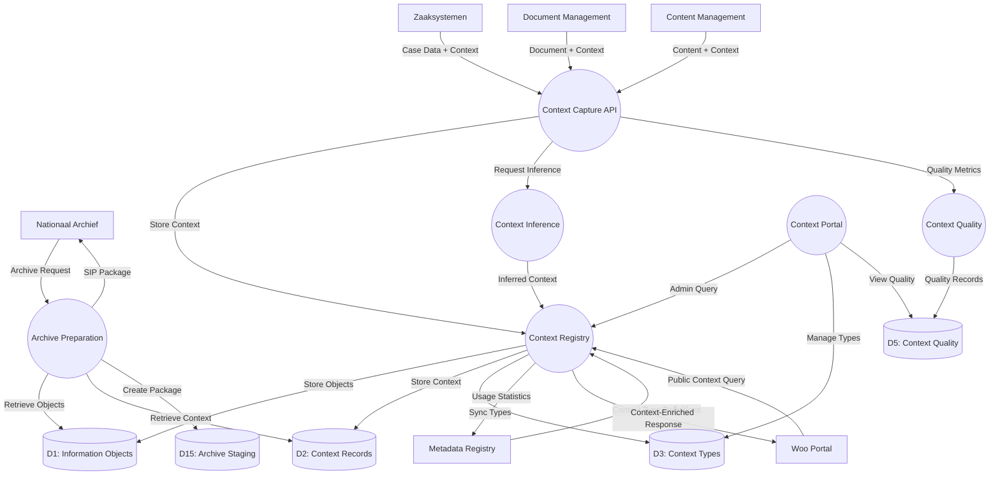

# Data Flow Diagram: Integration Flows

> **Template Origin**: Official | **ArcKit Version**: 4.3.1 | **Command**: `/arckit:dfd`

## Document Control

| Field | Value |
|-------|-------|
| **Document ID** | ARC-003-DFD-006-v1.0 |
| **Document Type** | Data Flow Diagram |
| **Project** | Context-Aware Data Architecture (Project 003) |
| **Classification** | OFFICIAL |
| **Status** | DRAFT |
| **Version** | 1.0 |
| **Created Date** | 2026-04-20 |
| **Last Modified** | 2026-04-20 |
| **Review Cycle** | Quarterly |
| **Next Review Date** | 2026-05-20 |
| **Owner** | Enterprise Architect |
| **Reviewed By** | PENDING |
| **Approved By** | PENDING |
| **Distribution** | Project Team, Architecture Team, Integration Teams, MinJus Leadership |

## Revision History

| Version | Date | Author | Changes | Approved By | Approval Date |
|---------|------|--------|---------|-------------|---------------|
| 1.0 | 2026-04-20 | ArcKit AI | Initial creation from `/arckit:dfd` command | PENDING | PENDING |

## Diagram Purpose

This Data Flow Diagram documents the integration flows between the Context-Aware Data system and external systems. It shows how context is captured from source systems, synchronized with the Metadata Registry, published to the Woo Portal, and transferred to the Nationaal Archief for long-term preservation.

---

## Integration Architecture Overview

```mermaid
C4Context
    title Context-Aware Data Integration Architecture

    Enterprise_Boundary(minjus, "Ministry of Justice & Security") {
        System(zsysteem, "Zaaksystemen", "Case management systems (Centric, iProces, etc.)")
        System(dms, "Document Management", "Document management (Documentum, etc.)")
        System(cms, "Content Management", "Web content management")

        System(contextSystem, "Context-Aware Data", "Context capture & management") {
            System(capture, "Context Capture API")
            System(registry, "Context Registry")
            System(quality, "Context Quality")
            System(portal, "Context Portal")
        }

        System(mdRegistry, "Metadata Registry", "Central metadata governance")
        System(woo, "Woo Portal", "Public access portal")
    }

    System_Ext(na, "Nationaal Archief", "National Archive (external)")

    Rel(zsysteem, capture, "Submit case context", "REST/JSON")
    Rel(dms, capture, "Submit document context", "REST/JSON")
    Rel(cms, capture, "Submit content context", "REST/JSON")

    Rel(capture, registry, "Store context", "JDBC")
    Rel(capture, quality, "Report quality", "REST")

    Rel(registry, mdRegistry, "Sync context types", "REST")
    Rel(woo, registry, "Query context", "REST")

    Rel(contextSystem, na, "Archive transfer", "SFTP/SIP")
```

---

## Level 1 DFD: Integration Flows

### `data-flow-diagram` Format

```dfd
title Integration DFD - Context-Aware Data System

# External Source Systems
entity    ZSysteem   "Zaaksystemen"
entity    DMS        "Document\nManagement"
entity    CMS        "Content\nManagement"

# External Consumer Systems
entity    WOO        "Woo Portal"
entity    NA         "Nationaal\nArchief"

# Shared Services
entity    MDREG      "Metadata\nRegistry"

# Context-Aware Data System
process   CAPTURE    "Context\nCapture\nAPI"
process   REGISTRY   "Context\nRegistry"
process   QUALITY    "Context\nQuality\nService"
process   INFERENCE  "Context\nInference\nService"
process   PORTAL     "Context\nPortal"
process   ARCHIVE    "Archive\nPreparation"

# Data Stores
store     D1         "Information\nObjects"
store     D2         "Context\nRecords"
store     D3         "Context\nTypes"
store     D5         "Context\nQuality"
store     D15        "Archive\nStaging"

# Source System Flows
ZSysteem  --> CAPTURE "Case Data + Context"
DMS       --> CAPTURE "Document + Context"
CMS       --> CAPTURE "Content + Context"

# Internal Processing
CAPTURE   --> REGISTRY  "Store Context"
CAPTURE   --> INFERENCE "Request Inference"
CAPTURE   --> QUALITY   "Quality Metrics"

INFERENCE --> REGISTRY  "Inferred Context"
QUALITY   --> D5        "Quality Records"

REGISTRY  --> D1        "Store Objects"
REGISTRY  --> D2        "Store Context"
REGISTRY  --> D3        "Sync Types"

# Metadata Registry Sync
MDREG     --> REGISTRY  "Context Type Definitions"
REGISTRY  --> MDREG     "Usage Statistics"

# Consumer Query Flows
WOO       --> REGISTRY  "Public Context Query"
REGISTRY  --> WOO       "Context-Enriched\nResponse"

# Administrative Flows
PORTAL    --> REGISTRY  "Admin Query"
PORTAL    --> D3        "Manage Types"
PORTAL    --> D5        "View Quality"

# Archival Flows
NA        --> ARCHIVE   "Archive Request"
ARCHIVE   --> D1        "Retrieve Objects"
ARCHIVE   --> D2        "Retrieve Context"
ARCHIVE   --> D15       "Create Package"
ARCHIVE   --> NA        "SIP Package"
```

### Mermaid (Approximate)



---

## Integration Specifications

### 1. Zaaksystemen Integration

**Purpose**: Capture context from case management systems when cases are created or updated.

**Endpoint**: `POST /api/v1/integrations/zaak/context`

**Request Format**:
```json
{
  "source_system": "iProces",
  "source_id": "ZA-2026-001234",
  "event_type": "case_created",
  "timestamp": "2026-04-20T10:00:00Z",
  "context": {
    "core": {
      "creator": "medewerker-IND-123",
      "created_at": "2026-04-20T10:00:00Z",
      "object_type": "BESLUIT"
    },
    "domain": {
      "case_number": "ZA-2026-001234",
      "case_type": "asielaanvraag",
      "case_status": "INTAKE",
      "applicant_role": "aanvrager"
    }
  }
}
```

**Response Format**:
```json
{
  "context_id": "ctx-abc-123",
  "object_id": "obj-xyz-789",
  "status": "created",
  "quality_score": 1.0
}
```

**Error Handling**:
| Error | HTTP | Description |
|-------|------|-------------|
| INV-001 | 400 | Invalid request format |
| INV-002 | 401 | Authentication failed |
| INV-003 | 422 | Context validation failed |

---

### 2. Document Management Integration

**Purpose**: Capture context when documents are created, updated, or classified.

**Endpoint**: `POST /api/v1/integrations/dms/context`

**Request Format**:
```json
{
  "source_system": "Documentum",
  "source_id": "DOC-2026-456789",
  "event_type": "document_created",
  "timestamp": "2026-04-20T11:00:00Z",
  "context": {
    "core": {
      "creator": "user-456",
      "created_at": "2026-04-20T11:00:00Z",
      "object_type": "DOCUMENT",
      "title": "Adviesaanvraag asiel"
    },
    "domain": {
      "document_type": "advies",
      "related_case": "ZA-2026-001234"
    },
    "semantic": {
      "subject_tags": ["asylum", "advies"],
      "confidentiality_level": "intern"
    }
  }
}
```

**Webhook Support**: DMS systems can configure webhooks for real-time context capture on document events.

---

### 3. Content Management Integration

**Purpose**: Capture context for web content that may be Woo-relevant.

**Endpoint**: `POST /api/v1/integrations/cms/context`

**Request Format**:
```json
{
  "source_system": "Drupal",
  "source_id": "node-12345",
  "event_type": "content_published",
  "timestamp": "2026-04-20T12:00:00Z",
  "context": {
    "core": {
      "creator": "webredactie-001",
      "created_at": "2026-04-20T12:00:00Z",
      "object_type": "CONTENT",
      "title": "Beleidsregel Woo-publicatie"
    },
    "domain": {
      "content_type": "news_article",
      "publication_channel": "website"
    },
    "provenance": {
      "publication_workflow": "standard",
      "approval_chain": ["redactie", "hoofdredactie"]
    }
  }
}
```

---

### 4. Metadata Registry Synchronization

**Purpose**: Bi-directional sync of context type definitions between Context-Aware Data and Metadata Registry.

**Sync Direction 1: Registry → Context-Aware Data**
- **Event**: Context type created/updated in Metadata Registry
- **Action**: Sync type definition to D3 (ContextTypes)
- **Method**: Poll every 5 minutes or webhook trigger

**Sync Direction 2: Context-Aware Data → Registry**
- **Event**: Hourly aggregation of context usage statistics
- **Data**: Usage counts per type, inferred context ratios
- **Method**: Scheduled batch job

**Endpoint**: `POST /api/v1/internal/sync/types`

---

### 5. Woo Portal Query Integration

**Purpose**: Enable Woo Portal to query context-enriched information for publication.

**Endpoint**: `GET /api/v1/public/woo/objects/{object_id}/context`

**Query Parameters**:
| Parameter | Type | Description |
|-----------|------|-------------|
| object_id | UUID | Information object identifier |
| include | STRING[] | Context layers to include (CORE only for public) |
| format | ENUM | Response format (json-ld, json) |

**Response Format (JSON-LD)**:
```json
{
  "@context": "https://woo.minjus.nl/v1/context",
  "object_id": "obj-123-456",
  "title": "Besluit intrekking verblijfsvergunning",
  "context": {
    "core": [
      {
        "type": "creator",
        "value": "Ministerie van Justitie en Veiligheid",
        "captured_at": "2026-04-20T10:00:00Z"
      }
    ]
  },
  "woo_metadata": {
    "woo_classificatie": "OPENBAAR",
    "gepubliceerd_op": "2026-04-21T09:00:00Z",
    "woo_url": "https://woo.minjus.nl/besluit-123"
  }
}
```

---

### 6. Nationaal Archief Transfer

**Purpose**: Transfer contextualized information packages to the Nationaal Archief for long-term preservation.

**Transfer Protocol**: SFTP + SIP (Submission Information Package)

**Package Structure**:
```
transfer-{timestamp}.zip
├── manifest.xml           # Transfer manifest
├── objects/               # Information objects (1000 per package)
│   ├── {object_id}.json
│   └── ...
├── context/               # All context records
│   ├── core/
│   ├── domain/
│   ├── semantic/
│   └── provenance/
└── metadata/
    ├── provenance-chain.xml
    └── checksums.txt
```

**Transfer Schedule**:
- **Frequency**: Weekly (Sunday 02:00 CET)
- **Batch Size**: 10,000 objects per transfer
- **Retention**: Packages retained in D15 until acknowledged by NA

**Endpoint**: `POST /api/v1/internal/archive/prepare`

---

## Integration Security

### Authentication Mechanisms

| Consumer | Method | Credential | Scope |
|----------|--------|------------|-------|
| Zaaksystemen | OAuth 2.0 Client Credentials | client_id + client_secret | zaak:write |
| DMS | OAuth 2.0 Client Credentials | client_id + client_secret | dms:write |
| CMS | OAuth 2.0 Client Credentials | client_id + client_secret | cms:write |
| Woo Portal | API Key | api_key (public) | woo:read |
| Nationaal Archief | Mutual TLS | Certificate | archive:read |
| Metadata Registry | Service-to-Service | Internal token | registry:sync |

### Authorization Matrix

| Role | Create Context | Read Context | Update Types | View Quality | Archive |
|------|---------------|--------------|--------------|--------------|---------|
| zaak_system | ✅ Own domain only | ❌ | ❌ | ❌ | ❌ |
| dms_system | ✅ Own domain only | ❌ | ❌ | ❌ | ❌ |
| cms_system | ✅ Own domain only | ❌ | ❌ | ❌ | ❌ |
| woo_public | ❌ | ✅ CORE only | ❌ | ❌ | ❌ |
| informatiemanager | ✅ All | ✅ All | ✅ Assigned | ✅ All | ❌ |
| archivaris | ❌ | ✅ CORE, DOMAIN, PROVENANCE | ❌ | ✅ All | ✅ |

---

## Service Level Agreements

| Integration | Availability | Response Time | Throughput |
|-------------|--------------|---------------|------------|
| Zaaksystemen API | 99.5% | < 200ms (p95) | 1000 req/min |
| DMS API | 99.5% | < 200ms (p95) | 500 req/min |
| CMS API | 99.0% | < 300ms (p95) | 200 req/min |
| Woo Query API | 99.9% | < 100ms (p95) | 5000 req/min |
| Metadata Registry Sync | 99.0% | < 5 seconds | 1 sync/5min |
| Archive Transfer | 98.0% | < 1 hour/package | 1 package/week |

---

## Error Recovery

| Error Type | Detection | Recovery | Retry Policy |
|------------|-----------|----------|--------------|
| Network Timeout | Response > 30s | Reconnect with backoff | 3 retries, exponential backoff |
| Validation Error | HTTP 422 | Log error, notify source | No retry (source fix required) |
| Authentication Error | HTTP 401 | Refresh credentials | No retry (credential update required) |
| Rate Limit | HTTP 429 | Wait and retry | Retry after X-RateLimit-Reset |
| Service Unavailable | HTTP 503 | Queue for later retry | Queue with DLQ after 5 attempts |

---

## Monitoring and Observability

### Integration Metrics

| Metric | Description | Alert Threshold |
|--------|-------------|-----------------|
| integration.requests.total | Total requests per integration | - |
| integration.requests.success | Successful requests | < 95% triggers warning |
| integration.requests.errors | Failed requests | > 5% triggers alert |
| integration.response_time.p95 | 95th percentile response time | > SLA triggers alert |
| integration.queue.depth | Background queue depth | > 1000 triggers alert |
| integration.sync.lag | Sync delay (Metadata Registry) | > 10 minutes triggers alert |

### Health Checks

Each integration endpoint exposes a health check:
- **Endpoint**: `/health/integrations/{integration_name}`
- **Response**: `{status: "healthy"|"degraded"|"unhealthy", checks: {...}}`

---

## DFD Validation

### Yourdon-DeMarco Rules Checklist

| Rule | Status | Notes |
|------|--------|-------|
| Every process has at least one input AND one output | ✅ PASS | All processes have inputs/outputs |
| No process has only inputs (black hole) | ✅ PASS | All processes produce output |
| No process has only outputs (miracle) | ✅ PASS | All processes consume data |
| Data stores have at least one read and one write flow | ✅ PASS | All stores have read/write |
| Data flows are named | ✅ PASS | All arrows have labels |
| External entities only connect to processes | ✅ PASS | No entity-to-store connections |
| System boundary is clear | ✅ PASS | Context-Aware Data bounded |

---

## Visualization Instructions

**For `data-flow-diagram` DSL (true Yourdon-DeMarco notation):**
```bash
pip install data-flow-diagram
dfd < input.dfd > output.svg
```

**For Mermaid approximation:**
- **GitHub**: Renders automatically in markdown
- **https://mermaid.live**: Online editor (paste code, view rendered)
- **VS Code**: Install "Mermaid Preview" extension

---

## Integration DFD Summary

| Metric | Count |
|--------|-------|
| External Systems | 6 (3 sources, 3 consumers) |
| Internal Processes | 6 |
| Data Stores | 5 |
| Integration Points | 12 |
| Protocols | REST, OAuth, SFTP, Webhook |

---

## Linked Artifacts

| Artifact | Type | Link |
|----------|------|------|
| ARC-003-DFD-001-v1.0.md | Level 0/1 DFD | `projects/003-context-aware-data/diagrams/ARC-003-DFD-001-v1.0.md` |
| ARC-003-HLD-v1.0.md | High-Level Design | `projects/003-context-aware-data/ARC-003-HLD-v1.0.md` |
| ARC-002-DATA-v1.0.md | Metadata Registry | `projects/002-metadata-registry/ARC-002-DATA-v1.0.md` |

---

## Generation Metadata

**Generated by**: ArcKit `/arckit:dfd` command
**Generated on**: 2026-04-20
**ArcKit Version**: 4.3.1
**Project**: Context-Aware Data Architecture (Project 003)
**AI Model**: claude-opus-4-7
**DFD Type**: Integration Flows
